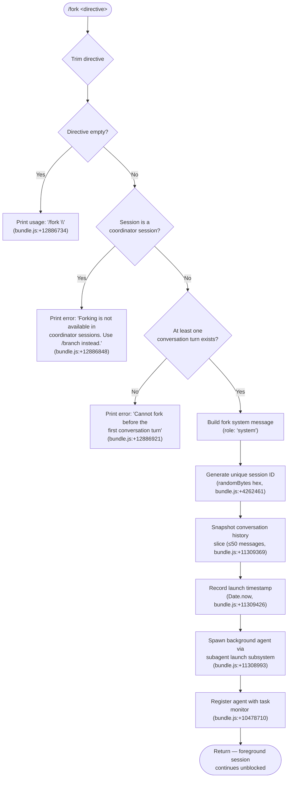

# `/fork`

> Analysis basis: CC v2.1.178 bundle.js (AST extraction + Claude interpretation)
> Minimum version: v2.1.178

---

## Overview

`/fork` spawns a background agent that inherits a full snapshot of the current conversation, then runs independently on a user-supplied directive. The forked agent is a proper background session whose lifecycle (launch, stall detection, completion, teardown) is tracked separately from the originating foreground session. Forking is disallowed inside coordinator sessions and before the first conversation turn.

---

## Registration

| Field | Value |
|---|---|
| type | `local-jsx` |
| name | `fork` |
| description | `Spawn a background agent that inherits the full conversation` |
| argumentHint | `<directive>` |
| module_id | `$XK` |
| load_inline | `true` |
| loc_byte | `12887151` |
| loc_byte_end | `12887354` |
| loc_line | `8882` |
| arbor_handler.name | `fA5` |
| arbor_handler.fqn | `claude-2.1.178::fA5` |
| arbor_handler.kind | `AsyncFunction` |
| arbor_handler.resolution_path | `module_id` |
| arbor_handler.n_hits | `0` |

Analysis basis: CC v2.1.178 bundle.js:+12887151

---

## Input Branching

More than three distinct branches are present (usage-error, coordinator-blocked, no-turn-yet, valid fork), so a Mermaid flowchart is used.



Analysis basis: CC v2.1.178 bundle.js:+12886710 – +12886921

---

## Behavioral Spec

### 1. Handler entry and validation (`fA5`)

```
async function handleFork(args, session):
    directive = args.trim()                         // bundle.js:+12886710

    if directive is empty:
        print "Usage: /fork <directive>"            // literal, bundle.js:+12886734
        return

    if session.coordinatorMode:
        print "Forking is not available in coordinator sessions. Use /branch instead."
                                                    // literal, bundle.js:+12886848
        return

    if noConversationTurnYet(session):
        print "Cannot fork before the first conversation turn"
                                                    // literal, bundle.js:+12886921
        return

    // Proceed to fork
    systemMsg = buildForkSystemMessage(directive)   // role = "system", bundle.js:+12886774
    launchBackgroundAgent(session, directive, systemMsg)
```

Analysis basis: CC v2.1.178 bundle.js:+12886710

### 2. Subagent launch preparation (`spawnSubagent` / `n$A`)

```
function spawnSubagent(session, directive, systemMsg):
    sessionId  = generateSessionId(randomBytes, bundle.js:+4262461)
    history    = snapshotHistory(session, maxMessages=50)
                                                    // bundle.js:+11309369
    launchTs   = Date.now()                         // bundle.js:+11309426
    spawnMode  = "fork"                             // literal, bundle.js:+11309184
    agentType  = "subagent"                         // literal, bundle.js:+11309910
    launchType = "spawn"                            // literal, bundle.js:+11309975

    if sessionId invalid or empty:
        emitTelemetry("subagent_fork_prompt_missing") // bundle.js:+11309135

    worktreeCtx = resolveWorktreeContext(session)   // bundle.js:+11309715
    replCtxs    = session.getReplContexts()         // bundle.js:+11309224

    agent = createLocalAgentRecord(
        sessionId, directive, history, worktreeCtx,
        launchTs, spawnMode, agentType, launchType
    )
    return agent
```

Analysis basis: CC v2.1.178 bundle.js:+11308978, +11309135, +11309184, +11309369

### 3. Local agent registration and context setup (`d46`)

```
function registerLocalAgent(agent):
    ensureSubagentDir()                  // mkdir, bundle.js:+13691536
    createSymlink(agent.sessionId)       // bundle.js:+13691589
    state = "pending"                    // literal, bundle.js:+13692611
    agentKind = "local_agent"            // literal, bundle.js:+10478335
    agent.status = "running"             // literal, bundle.js:+10478380
    agent.purpose = "general-purpose"   // literal, bundle.js:+10478518
    setupAbortController(agent)          // bundle.js:+5071409
    registerInTaskRegistry(agent)        // bundle.js:+10478710
    initPendingStateTimer(agent)         // Date.now + P0, bundle.js:+13692657
```

Analysis basis: CC v2.1.178 bundle.js:+10478288, +10478335, +10478710

### 4. Conversation history snapshot for fork (`replicateConversationMessages`)

```
function snapshotHistory(session, maxMessages):
    messages = session.getTranscript()
    // Slice at most 50 messages from the tail
    slice = messages.slice(-maxMessages)            // bundle.js:+11309369
    // Strip tool_use / tool_result pending items
    filtered = filterMessagesForFork(slice)
    return filtered
```

Key literals:
- Maximum snapshot size: 50 messages (bundle.js:+11309369)
- "fork" spawn type (bundle.js:+11309184)
- "resume" mode keyword (bundle.js:+11309303)

Analysis basis: CC v2.1.178 bundle.js:+11309372

### 5. Background agent lifecycle management (`ymH`)

```
async function runBackgroundAgent(agent):
    watchdogTimeout = 600000   // 10 min stall limit, bundle.js:+8678527
    progressInterval = 0.1     // 100 ms poll cadence, bundle.js:+8679914

    loop:
        event = await nextAgentEvent(agent)

        switch event.type:
            "watchdog_stall":                       // bundle.js:+8679044
                emitTelemetry("tengu_async_agent_stall_timeout")
                agent.abort()
                break

            "subagent_complete":                    // bundle.js:+8679689
                finalizeAgent(agent, "completed")
                break

            "subagent_stall_timeout":               // bundle.js:+8679709
                abortAgent(agent)
                break

            "api_error" | "error":
                markFailed(agent)
                emitTelemetry("tengu_async_agent_stall_timeout" …)
                break

            "user_kill_async":                      // bundle.js:+8683042
                killAgent(agent)
                break

            otherwise:
                updateTranscript(agent, event)
```

Analysis basis: CC v2.1.178 bundle.js:+8678527, +8679044, +8679689, +8679709

### 6. Fork system prompt construction (`buildForkSystemMessage`)

The fork system message is built with role `"system"` (bundle.js:+12886774). The body:

- Begins with a brief contextual framing fragment referencing the parent session directive (≤30 chars of known instrumentation: `"system"` role header).
- Instructs the agent that agent threads always have their `cwd` reset between bash calls and must only use absolute file paths (literal prefix `"- Agent threads always have their cwd reset …"`, bundle.js:+13840731).
- Incorporates the shared system-prompt building pipeline (`tZ`, which composes environment info, memory, tool guidance, etc.) so the forked agent has the same base instructions as the foreground session.

Analysis basis: CC v2.1.178 bundle.js:+12886774, +13840731

### 7. Fork-context reference and worktree handling (`Wf` / `iKH`)

```
function setupForkContext(agent):
    contextRef = "fork-context-ref"      // literal, bundle.js:+13611829
    anFilter   = "ant"                   // literal, bundle.js:+13653989
    writeForkMetadata(agent, ".meta.json", ".jsonl")
                                         // bundle.js:+13594365, +13594521
    emitSpanAttribute("subagent.spawn", "claude_code.subagent.spawn")
                                         // bundle.js:+6663621, +6663754
```

Analysis basis: CC v2.1.178 bundle.js:+13611829, +13594365

---

## State & Side Effects

| Item | Detail |
|---|---|
| Telemetry | `tengu_forked_agent_default_turns_exceeded` (bundle.js:+10799470); `tengu_async_agent_stall_timeout` (bundle.js:+8679449); `tengu_agent_summary_skipped` (bundle.js:+8583896); `tengu_auto_mode_decision` (bundle.js:+8677213); `tengu_agent_tool_completed` (bundle.js:+8675552); `tengu_agent_tool_terminated` (bundle.js:+8682869); `tengu_async_agent_stranded_tools_cleared` (bundle.js:+8680339); `tengu_cache_eviction_hint` (bundle.js:+8676095); `tengu_quartz_heron` (bundle.js:+8687199); `tengu_slim_subagent_claudemd` (bundle.js:+8969670); `tengu_shale_finch` (bundle.js:+8671097) |
| Subagent directory | Creates directory and symlink under the CC subagents data path (bundle.js:+13691536, +13691589) |
| Task registry | Agent entry is registered with the global task registry (bundle.js:+10478710) |
| Transcript | Parent transcript is snapped and passed to child; child transcript is written to `.jsonl` (bundle.js:+13594521) |
| Abort controller | A new `AbortController` is created for the forked agent; foreground abort signal does not propagate automatically (bundle.js:+5071409) |
| appState changes | `session.spawnMode` display toggled via `kH.setSpawnModeDisplay`; `kH.refreshDisplay` called after fork (bundle.js:+13336907, +13336934) |
| OTel tracing | OpenTelemetry span `"subagent.spawn"` / `"claude_code.subagent.spawn"` emitted (bundle.js:+6663621, +6663754) |
| Hook events | `SubagentStart` and `SubagentStop` hook types triggered at agent boundaries (bundle.js:+13720943, +13762700) |
| Sound | <!-- TODO: not found in depth-2 traversal; needs --depth 4 --> |

---

## Version History

| Version | Change |
|---|---|
| v2.1.178 | Initial analysis |

---

## Common Mistakes

1. **Omitting the directive** — `/fork` without a `<directive>` argument prints usage and exits silently; the fork does not occur.
2. **Forking inside a coordinator session** — results in the hard error "Forking is not available in coordinator sessions. Use /branch instead." Use `/branch` there instead.
3. **Forking before any turn** — if the user has not yet had at least one conversation turn with the foreground session, the command errors out with "Cannot fork before the first conversation turn."
4. **Assuming the fork inherits live tool state** — the fork receives a snapshot of the conversation history (capped at 50 messages); any pending or in-flight tool states in the parent are not forwarded.
5. **Expecting the fork to inherit relative working directory** — the fork system prompt explicitly warns that agent threads have `cwd` reset between bash calls; only absolute paths are reliable inside forked agents.
6. **Blocking on fork completion** — `/fork` returns immediately to the foreground session; the spawned agent runs in the background and must be monitored via the task registry or notification events.

---

## Appendix — Identifier Mapping

> For bundle debugging only. Identifiers change across versions.

| Identifier | Role |
|---|---|
| `fA5` | Main handler for `/fork` (async function) |
| `n$A` | Subagent launch preparation / spawn orchestration |
| `ymH` | Background agent lifecycle event loop |
| `d46` | Local agent registration and task-registry setup |
| `vmL` | Fork context builder (passes history + system prompt) |
| `tZ` | System-prompt assembly pipeline |
| `bH` | Storage/config helper (used during agent record creation) |
| `dH` | Error/diagnostic writer |
| `tW` | Session state reader helper |
| `L6` | String conversion utility |
| `l0` | Session load helper |
| `Jq` | State serializer |
| `CR` | Session-ID generator (randomBytes hex) |
| `b_` | Transcript fetch / conversation-state resolver |
| `tp8` | Tool-permission snapshot helper (allowed_tools) |
| `ep8` | Tool-permission snapshot helper (disallowed_tools) |
| `Nx` | Permission-mode resolver (bypassPermissions / disable path) |
| `WUH` | Subagent directory + symlink filesystem setup |
| `Cn8` | Subagent directory creation (mkdir) |
| `x0A` | Subagent symlink helper |
| `z$` | Path joiner for subagent data dir |
| `K46` | Subagent file-descriptor opener |
| `RH` | Log error / push to error list |
| `N` | Debug-message emitter |
| `Pv` | Path-environment helper |
| `HI` | AbortController factory |
| `PK` | EventEmitter max-listener setter |
| `$k9` | AbortSignal bind/call helper |
| `P0` | Pending-state timer initializer |
| `XM` | AsyncLocalStorage getStore helper |
| `j9` | Constant-time sleep helper |
| `sHH` | Main conversational history processor |
| `zZ` | Conversation-message normalizer |
| `In` | Message-format validator |
| `gJ` | Conversation-turn builder |
| `JK` | Message-role/content parser |
| `Y1` | Model-name normalizer |
| `MG` | Model-alias resolver |
| `ymH` | Agent async event loop (duplicate row — primary role) |
| `jGq` | Agent-turn executor (API streaming handler) |
| `AE` | API call wrapper (Date.now + streaming) |
| `F8` | UUID generator (crypto.randomUUID) |
| `XGq` | Agent-update applier |
| `J_A` | Agent completion/summary handler |
| `Gv` | Last-assistant-message finder |
| `DTq` | Agent state-update emitter |
| `SH` | Storage helper (d + dH) |
| `qH` | Agent streaming output queue |
| `Feq` | Fork event emitter |
| `X_A` | Auto-mode decision maker |
| `nGq` | Handoff-classifier caller |
| `UR6` | Token-budget / context slice helper |
| `GML` | Background agent progress emitter |
| `Iq6` | Task-progress reporter |
| `lI8` | Agent step tracker |
| `bq6` | Agent step start helper |
| `hmH` | Agent speculation / abort helper |
| `J46` | Agent task-entry lifecycle |
| `FI` | Agent turn-state finalizer |
| `MTH` | Agent metadata updater |
| `XLA` | Agent final-state writer |
| `tz` | Agent flush-on-complete helper |
| `gI8` | Agent metrics + flush coordinator |
| `JLA` | Task duration reporter |
| `Pu` | Full background-agent runner (top-level async) |
| `fOH` | Fork-output handler |
| `VML` | Fork-transcript slicer (JTq.slice / indexOf) |
| `H6H` | Tool-permission set builder for forked agent |
| `D_A` | Tool-filter (allowed/disallowed lists) |
| `j_A` | Permissions set mutator |
| `w_A` | Tool-name splitter |
| `RT` | Tool-name normalizer (split/join) |
| `$yH` | Subagent permission check |
| `eT` | Tool-entry formatter |
| `k3` | Tool-string parser |
| `HOH` | Hook output handler |
| `BLL` | Hook result finder |
| `CzL` | MCP / plugin context loader |
| `WH` | Session timer manager |
| `IH` | Input-event normalizer |
| `vOH` | Foreground-to-background agent bridge |
| `xhK` | Agent-output routing helper |
| `uhK` | Agent result mapper |
| `l2` | Main query / agent execution loop |
| `BC6` | Background context passer (v7 + l2) |
| `v7` | Message-bus connector |
| `UH` | Agent push handler |
| `PqH` | MCP OAuth / connection handler |
| `sH` | Spawn-mode display updater |
| `U86` | MCP connection state tracker |
| `tH` | Message-write helper (k6.writeMessages) |
| `A6` | Abort-on-error helper |
| `_B` | Agent turn finalizer / cleanup |
| `CSL` | Full query/agent state machine |
| `qp8` | Subagent exit cleaner |
| `b6` | Headless plugin / output writer |
| `eNA` | Headless marketplace reconciler |
| `UQ` | MCP server config assembler |
| `Yw` | Tool-progress reporter |
| `YK6` | Skill-progress cache manager |
| `vOH` | Background bridge session handler |
| `ch` | Model-routing helper |
| `Wf` | Fork-context file writer |
| `iKH` | Fork context-reference filter |
| `wK6` | Metadata JSON writer (.meta.json / .jsonl) |
| `TNK` | Path helper for fork metadata |
| `Js9` | OTel span entry helper |
| `G0H` | OTel span context setter |
| `nR` | OTel span active checker |
| `$Gq` | Agent-status aggregator |
| `AOH` | Agent-status batch updater |
| `GR8` | Agent app-state setter |
| `ER8` | Tool-execution resolver |
| `Bsq` | Tool deduplication cache |
| `LU_` | Tool-list compiler |
| `fpH` | Retry back-off calculator |
| `j2` | Tool-call formatter |
| `QJ` | Output-style selector |
| `GD` | Constant emitter (TT) |
| `yI8` | Agent skill lister |
| `S6` | Skill entry creator |
| `tAA` | Fork context-ref hook |
| `eUH` | Anti-fork filter |
| `a0H` | Agent cleanup finalizer |
| `xV6` | Agent context-variable setter |
| `OGq` | Agent observable-key builder |
| `mH` | Agent abort signaler |
| `VOH` | Tool-permission policy checker |
| `CEH` | Tool-consent gate |
| `uMA` | Tool-permission set combiner |