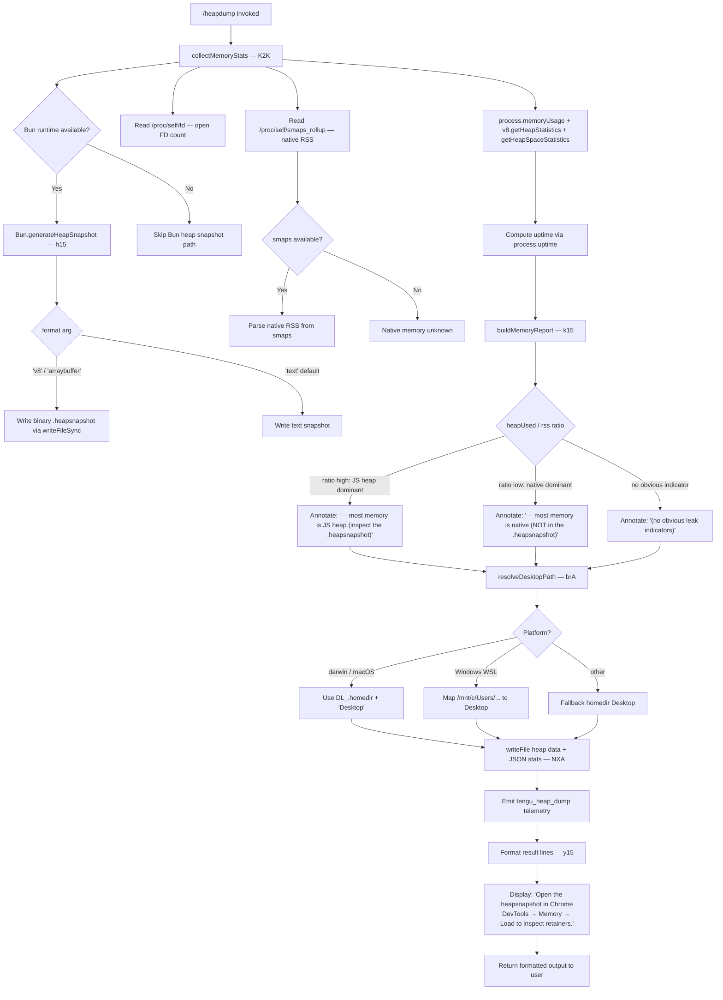

# `/heapdump`

> Analysis basis: CC v2.1.178 bundle.js (AST extraction + Claude interpretation)
> Minimum version: v2.1.178

---

## Overview

The `/heapdump` command is a hidden diagnostic utility that captures a snapshot of the Node.js (or Bun) JavaScript heap and writes it to the user's Desktop directory. It also collects supplementary memory statistics — including V8 heap figures, native memory, OS-level smaps, open file descriptors, and process uptime — then formats a human-readable diagnostic summary and emits a `tengu_heap_dump` telemetry event. The command is intended for internal debugging of memory leaks in the Claude Code process.

---

## Registration

| Field | Value |
|---|---|
| type | `local` |
| name | `heapdump` |
| description | `Dump the JS heap to ~/Desktop` |
| supportsNonInteractive | `true` |
| isHidden | `true` |
| module_id | `L2K` |
| load_inline | `true` |
| loc_byte | `12988823` |
| loc_byte_end | `12989251` |
| arbor_handler.name | `y15` |
| arbor_handler.fqn | `claude-2.1.178::y15` |
| arbor_handler.kind | `AsyncFunction` |
| arbor_handler.resolution_path | `module_id` |
| arbor_handler.n_hits | `0` |

Analysis basis: CC v2.1.178 bundle.js:+12988823

---

## Input Branching

The command has 3+ distinct branches based on runtime conditions (runtime engine detection, platform detection, memory ratio analysis, and heap-snapshot format selection), so a Mermaid flowchart is used.



---

## Behavioral Spec

### Handler Entry Point (`y15`)

The top-level async handler (`y15`, resolved via `module_id` path by Arbor) orchestrates the full dump sequence. It calls the memory-collection routine, invokes the heap-snapshot writer, resolves the output path, persists both files, emits telemetry, then assembles the text result returned to the terminal.

```
async function heapdumpHandler(context):
    stats       = await collectMemoryStats()          // K2K
    outputDir   = resolveDesktopPath()                // brA
    filename    = buildTimestampedFilename()           // vXA.join
    await writeFile(path.join(outputDir, filename + ".json"), JSON.stringify(stats))
    await writeHeapSnapshot(outputDir, filename)       // NXA → h15
    report      = buildMemoryReport(stats)             // k15
    lines = []
    lines.push("Open the .heapsnapshot in Chrome DevTools → Memory → Load to inspect retainers.")
    lines.push(...report)
    return lines.join("\n")
```

Analysis basis: CC v2.1.178 bundle.js:+12987692

---

### Memory Statistics Collection (`K2K`)

Gathers all available memory signals from the Node/Bun process and the OS, with timeout thresholds applied. Process uptime is recorded in seconds with 3600 as a reference constant, and memory sizes are divided by 1 048 576 (1 MiB) for display.

```
async function collectMemoryStats():
    result = {}
    result.memoryUsage        = process.memoryUsage()            // +12983855
    result.heapStatistics     = v8Module.getHeapStatistics()     // +12983879
    result.resourceUsage      = process.resourceUsage()          // +12983905
    result.uptime             = process.uptime()                 // +12983931
    result.heapSpaceStats     = v8Module.getHeapSpaceStatistics()// +12983956
    result.activeHandles      = process._getActiveHandles().length// +12983998
    result.activeRequests     = process._getActiveRequests().length// +12984035

    // Linux: open file-descriptor count
    try:
        fds = await fs.readdir("/proc/self/fd")                  // +12984086, +12984098
        result.openFds = fds.length
    catch: result.openFds = null

    // Linux: native RSS from smaps
    try:
        smaps = await fs.readFile("/proc/self/smaps_rollup", "utf8") // +12984148, +12984161, +12984187
        result.nativeRss = parseSmapsRss(smaps)
    catch: result.nativeRss = null

    // Bun JSC module (if running under Bun)
    try:
        jsc = require("bun:jsc")                                 // +12984246
        result.jscStats = jsc.getHeapStatistics()
    catch: result.jscStats = null

    return result
```

Key numeric constants:
- Uptime reference: **3600** seconds (bundle.js:+12984387)
- MiB divisor: **1 048 576** (bundle.js:+12984392)
- Native-memory anomaly threshold produces message: `"Native memory > heap - leak may be in native addons (node-pty, sharp, etc.)"` (bundle.js:+12984625)
- Display rounding: **500** MiB boundary (bundle.js:+12984780)

Analysis basis: CC v2.1.178 bundle.js:+12986354

---

### Heap Snapshot Writer (`h15`)

Writes the actual heap snapshot to disk. Detects whether the Bun runtime is present and calls `Bun.generateHeapSnapshot` with either `'v8'`/`'arraybuffer'` format or the default `'text'` format. Triggers garbage collection before snapshotting.

```
async function writeHeapSnapshot(outputDir, baseFilename):
    if typeof Bun !== "undefined":                               // +12987392
        Bun.gc(true)                                            // +12987449  (force GC before snapshot)
        snapshot = Bun.generateHeapSnapshot({ format: "v8", encoding: "arraybuffer" }) // +12987417, +12987422
        fs.writeFileSync(path.join(outputDir, baseFilename + ".heapsnapshot"), snapshot) // +12987372
    else:
        // Node.js path via v8.writeHeapSnapshot or equivalent
        // (no Bun API available)
        writeNodeHeapSnapshot(outputDir, baseFilename)
```

Analysis basis: CC v2.1.178 bundle.js:+12986893

---

### Desktop Path Resolution (`brA`)

Determines the correct Desktop folder across macOS, native Linux, and Windows WSL environments.

```
function resolveDesktopPath():
    home = os.homedir()                                          // +1097413
    platform = detectPlatform()

    if platform == "windows":                                    // +1097477
        // WSL: scan /mnt/c/Users for non-system user dirs
        candidates = listDir("/mnt/c/Users")                    // +1097681
        skip = ["Public", "Default", "Default User", "All Users"] // +1097725-1097789
        user = candidates.find(c => !skip.includes(c))
        if user:
            return path.join("/mnt/c/Users", user, "Desktop")
    
    // macOS / Linux default
    return path.join(home, "Desktop")                           // +1097449, "Desktop" +1097459
```

Analysis basis: CC v2.1.178 bundle.js:+12986650

---

### Memory Report Builder (`k15`)

Formats the collected statistics into a columnar human-readable block. Selects the diagnostic annotation based on the ratio of heap memory to RSS, and indicates whether most memory is in the JS heap (inspect the snapshot) or in native code (outside the snapshot).

```
function buildMemoryReport(stats):
    lines = []
    maxLabelWidth = Math.max(...labelLengths)                    // +12988067
    
    // Format each metric with right-padded label column
    for metric in [heapUsed, heapTotal, rss, external, ...heapSpaces]:
        lines.push(formatMetricRow(metric, maxLabelWidth))       // J56 +12988379
    
    // Diagnostic annotation
    ratio = stats.memoryUsage.heapUsed / stats.memoryUsage.rss
    if ratio > THRESHOLD_HIGH:
        lines.push("— most memory is JS heap (inspect the .heapsnapshot)")  // +12988135
    elif ratio < THRESHOLD_LOW:
        lines.push("— most memory is native (NOT in the .heapsnapshot)")    // +12988195
    else:
        lines.push("  (no obvious leak indicators)")                         // +12988332
    
    return lines
```

Memory ceiling constant: **1 073 741 824** bytes (1 GiB) used as an upper-bound reference (bundle.js:+12988741).
Column padding width: **8** characters (bundle.js:+12988467).

Analysis basis: CC v2.1.178 bundle.js:+12987811

---

### Output Logging (`NXA`)

Writes both the JSON statistics file and the heap snapshot file to the resolved Desktop path. Uses file permission mode **384** (octal `0o600`, owner read/write only) when writing the snapshot file (bundle.js:+12986837). Wraps the operation in structured error handling via `jA` (error wrapper) and `RH` (result handler). On success, finalises the result with display text `"text"` format (bundle.js:+12987724).

```
async function writeOutputFiles(outputDir, filename, stats, heapSnapshot):
    statsPath    = path.join(outputDir, filename + ".json")     // vXA.join +12986759
    await fs.writeFile(statsPath, JSON.stringify(stats, null, 2))// +12986802
    // heap snapshot already written by h15 via writeFileSync
    serialized   = JSON.stringify(stats)                        // xH +12986818
    
    // Emit telemetry
    emit("tengu_heap_dump", { path: outputDir })                // +12986944

    // macOS-specific: trigger platform notification
    if platform == "darwin":                                    // +12985898
        showMacOSNotification(outputDir)

    return { format: "text", path: outputDir }
```

No-leak fallback message: `"No obvious leak indicators. Check heap snapshot for retained objects."` (bundle.js:+12985744).
Platform string for macOS: `"macos"` (bundle.js:+12985479), runtime check against `"darwin"` (bundle.js:+12985898).

Analysis basis: CC v2.1.178 bundle.js:+12986354

---

### Result Formatting (`y15` post-write)

After all files are written, the handler pushes the Chrome DevTools instruction and joins lines for terminal display.

```
function formatFinalOutput(reportLines, outputPath):
    result = []
    result.push("Open the .heapsnapshot in Chrome DevTools → Memory → Load to inspect retainers.") // +12987848
    result.push(...reportLines)
    return result.join("\n")                                    // +12987960
```

Analysis basis: CC v2.1.178 bundle.js:+12987838

---

## State & Side Effects

| Item | Detail |
|---|---|
| Telemetry | `tengu_heap_dump` (bundle.js:+12986944) — fired after successful file write |
| Telemetry (indirect, call graph) | `tengu_daemon_control` (+17104063), `tengu_bg_dispatch_sigkill_escalate` (+17066047), `tengu_bg_dispatch_low_mem` (+17066648), `tengu_bg_spare_enable` (+17067352), `tengu_bg_spare_claim` (+17067480), `tengu_bg_spare_claim_fail` (+17067746), `tengu_scheduled_task_missed` (+16547141) — these are in reached functions but not directly on the heapdump path |
| File output (heap snapshot) | `~/Desktop/<timestamp>.heapsnapshot` — written with mode `0o600` (384 decimal) |
| File output (JSON stats) | `~/Desktop/<timestamp>.json` — JSON of all memory metrics |
| GC trigger | `Bun.gc(true)` called before snapshot when running under Bun (+12987449) |
| Platform detection | Checks `process.platform === "darwin"` (+12985898) and Windows WSL path `/mnt/c/Users` (+1097681) |
| appState changes | None detected in depth-2 traversal |
| Sound | None detected in depth-2 traversal |
| Hook registration | None on the heapdump path; `F9` → `XSA.register` is in log-writer subtree (+66308), not heapdump-specific |

---

## Version History

| Version | Change |
|---|---|
| v2.1.178 | Initial analysis |

---

## Common Mistakes

1. **Expecting the command to be visible in `/help`**: The command is registered with `isHidden: true` — it will not appear in the slash-command menu or help output; it must be typed explicitly.
2. **Running on non-desktop Linux servers**: The Desktop path (`~/Desktop`) may not exist on headless servers; the `writeFile` call will fail with `ENOENT`. Create the directory first or ensure a Desktop folder exists.
3. **Confusing the two output files**: The command writes both a `.json` file (raw process statistics) and a `.heapsnapshot` file (heap graph). Only the `.heapsnapshot` is loadable in Chrome DevTools → Memory; the `.json` is a supplementary statistics dump.
4. **Misreading the native-memory annotation**: The message `"— most memory is native (NOT in the .heapsnapshot)"` indicates native addon leaks (e.g. node-pty, sharp) that will not appear in the heap snapshot and require native profiling tools instead.
5. **Expecting the command to work in non-interactive pipelines without verification**: Although `supportsNonInteractive: true`, the Desktop path resolution depends on `os.homedir()` being meaningful in the execution environment; CI/container environments may have no valid Desktop.
6. **Assuming Bun.generateHeapSnapshot is always called**: The Bun snapshot path is only taken when the Bun runtime is detected. Under Node.js, the Node heap snapshot path is used instead.

---

## Appendix — Identifier Mapping

> For bundle debugging only. Identifiers change across versions.

| Identifier | Role |
|---|---|
| `y15` | Top-level async handler for `/heapdump` (Arbor-resolved entry point) |
| `NXA` | Output orchestrator — writes JSON stats + heap snapshot files, emits telemetry |
| `K2K` | Memory statistics collector (process, V8, smaps, FDs) |
| `h15` | Heap snapshot writer (Bun.generateHeapSnapshot / Bun.gc path) |
| `brA` | Desktop path resolver (macOS, Linux, Windows WSL) |
| `k15` | Memory report builder / formatter |
| `R6` | Utility: logger or structured-result factory (called by NXA and K2K) |
| `TT` | Lower-level output helper called by R6 |
| `a6` | Platform detection helper |
| `n6` | File-system ensure-dir / mkdirp utility |
| `d` | Diagnostic line formatter helper |
| `jA` | Error wrapper / normaliser |
| `D5` | Result-type constructor |
| `RH` | Result handler / finaliser |
| `L6` | String coercion utility |
| `qq` | Queue or buffer helper |
| `biA` | Buffer item accumulator |
| `RQ4` | Rotating queue (shift/push) |
| `k15` | Report builder (Math.max column layout + J56 row formatter) |
| `J56` | Individual metric row formatter |
| `xH` | JSON.stringify wrapper |
| `vXA` | Path module reference used for path.join in output |
| `j56` | File-system module reference (readdir, readFile, writeFile) |
| `q2K` | Synchronous file-system module reference (writeFileSync) |
| `DL_` | OS module reference (homedir) |
| `wM` | Path module reference used in brA |
| `Xc8` | V8 module reference (getHeapStatistics, getHeapSpaceStatistics) |
| `IhA` | OS module reference (freemem) — used in background dispatch path |
| `G` | Main REPL/UI keyboard event dispatcher (in call graph via NXA → G) |
| `N` | Logging / output writer reached from NXA |
| `AM4` | Log-entry constructor |
| `LM4` | Log file writer / appender |

---

Note: index built via Arbor fallback; some signals (telemetry, literals) may be missing — see arbor-fallback.js.