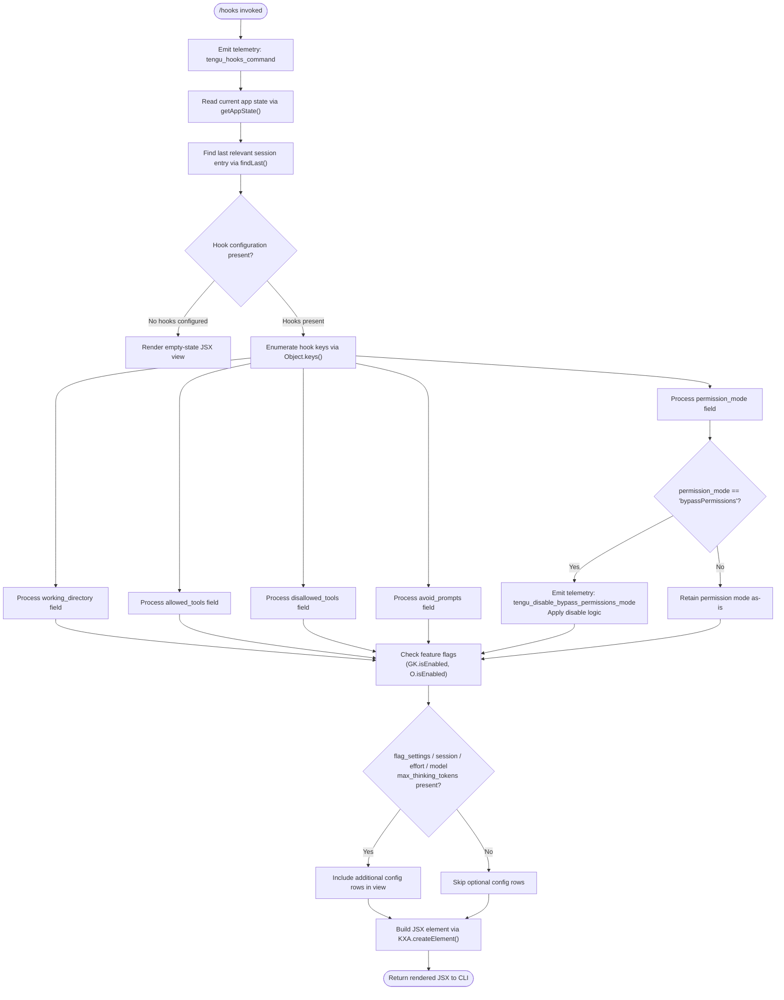

# `/hooks`

> Analysis basis: CC v2.1.178 bundle.js (AST extraction + Claude interpretation)
> Minimum version: v2.1.178

---

## Overview

The `/hooks` command displays the current hook configurations for tool events in the active Claude Code session. It renders a read-only JSX view of all registered hooks derived from the current app state, organized by hook event categories such as allowed tools, disallowed tools, working directory, and permission mode. The command is classified as `local-jsx`, meaning it renders an inline UI component rather than dispatching a prompt to the model.

---

## Registration

| Field | Value |
|---|---|
| type | `local-jsx` |
| name | `hooks` |
| description | `View hook configurations for tool events` |
| loc_byte | `12876749` |
| loc_byte_end | `12876899` |
| loc_line | `8882` |
| immediate | `true` |
| module_id | `rJK` |
| load_inline | `true` |
| arbor_handler.name | `a_5` |
| arbor_handler.fqn | `claude-2.1.178::a_5` |
| arbor_handler.kind | `AsyncFunction` |
| arbor_handler.resolution_path | `module_id` |
| arbor_handler.n_hits | `0` |

Analysis basis: CC v2.1.178 bundle.js:+12876749

---

## Input Branching

The `/hooks` command handler (`a_5`) involves more than three distinct branches across app-state inspection, hook configuration enumeration, permission-mode checking, and JSX rendering. A Mermaid flowchart is used below.



Analysis basis: CC v2.1.178 bundle.js:+12876547, +12876581, +12876589, +12876619

---

## Behavioral Spec

### 1. Command Entry and Telemetry Emission

When `/hooks` is invoked, the async handler `a_5` fires immediately (registration field `immediate: true`). The first operation is emitting the `tengu_hooks_command` telemetry event, which records that the user opened the hooks viewer.

```
async function hooksCommandHandler(context):
    emit_telemetry("tengu_hooks_command")
    appState = readAppState()
    sessionEntry = findLastSessionEntry(appState)
    hookConfig = extractHookConfig(sessionEntry)
    render hookConfigView(hookConfig, featureFlags)
```

Analysis basis: CC v2.1.178 bundle.js:+12876547, +12876549

---

### 2. App State and Session Resolution

The handler reads the current application state and locates the most recent relevant session record using a `findLast`-style scan. This determines which hook configuration block is currently active.

```
function resolveActiveSession(appState):
    entry = appState.findLast(item => item is relevant session)
    if entry is null:
        return emptyConfig
    return entry.hookConfig
```

Configuration fields inspected include:
- `"working_directory"` (bundle.js:+10800701)
- `"allowed_tools"` (bundle.js:+10800756)
- `"disallowed_tools"` (bundle.js:+10800811)
- `"avoid_prompts"` (bundle.js:+10800872)
- `"permission_mode"` (bundle.js:+10800974)
- `"bypassPermissions"` (bundle.js:+10801005)
- `"session"` (bundle.js:+10801304)
- `"effort"` (bundle.js:+10801329)
- `"model"` (bundle.js:+10801342)
- `"max_thinking_tokens"` (bundle.js:+10801354)
- `"flag_settings"` (bundle.js:+10801380)

Analysis basis: CC v2.1.178 bundle.js:+10800596, +10800676

---

### 3. Permission Mode and Bypass Handling

If the resolved configuration includes a `permission_mode` of `"bypassPermissions"`, the handler triggers a bypass-permissions disable path and emits an additional telemetry event before rendering.

```
function handlePermissionMode(config):
    if config.permission_mode == "bypassPermissions":
        emit_telemetry("tengu_disable_bypass_permissions_mode")
        applyDisable(config)
    else:
        passthrough(config)
```

The literal `"disable"` appears at bundle.js:+4309116, associated with this disable path (`O6` → `Nx` call chain).

Analysis basis: CC v2.1.178 bundle.js:+10800974, +10801005, +4309012, +4309015, +4309116

---

### 4. Tool-Allowlist and Deny-List Inspection

The handler uses `tp8` and `ep8` (both calling into `K1`) to process the `allowed_tools` and `disallowed_tools` hook lists respectively. These normalize and prepare the tool lists for display.

```
function normalizeToolList(rawAllowedTools):
    return processToolEntries(rawAllowedTools, K1)

function normalizeDisallowedTools(rawDisallowedTools):
    return processToolEntries(rawDisallowedTools, K1)
```

Additional tool-permission logic found in the call graph involves the string literals `"deny"` (bundle.js:+11221384), `"cliArg"` (bundle.js:+11222124), `"toolsNarrowing"` (bundle.js:+11222145), and `"blocked"` (bundle.js:+10263752).

Analysis basis: CC v2.1.178 bundle.js:+10800774, +10800832, +10793610, +10793758

---

### 5. Feature Flag Gating

Before assembling the final view, the handler checks feature-flag states using `GK.isEnabled` and `O.isEnabled`. Certain rows in the hooks display (such as `flag_settings`, `effort`, `model`, `max_thinking_tokens`) are conditionally included based on these flags.

```
function buildConfigRows(config, featureFlags):
    rows = []
    rows.append(renderRow("working_directory", config.working_directory))
    rows.append(renderRow("allowed_tools", config.allowed_tools))
    rows.append(renderRow("disallowed_tools", config.disallowed_tools))
    rows.append(renderRow("avoid_prompts", config.avoid_prompts))
    rows.append(renderRow("permission_mode", config.permission_mode))
    if featureFlags.GK.isEnabled():
        rows.append(renderRow("flag_settings", config.flag_settings))
    if featureFlags.O.isEnabled():
        rows.append(renderRow("model", config.model))
        rows.append(renderRow("effort", config.effort))
        rows.append(renderRow("max_thinking_tokens", config.max_thinking_tokens))
    return rows
```

Analysis basis: CC v2.1.178 bundle.js:+10264669, +10264799

---

### 6. Hook File Validation

The call graph reaches `hVH` (hook-file validator), which uses `MZK.stat` to check file existence, validates the file is a regular file (`L.isFile`), enforces a maximum file size of **1,048,576 bytes** (bundle.js:+13348454), and rejects missing files with an `ENOENT` error string (bundle.js:+13348394).

```
async function validateHookFile(filePath):
    try:
        stat = await filesystem.stat(filePath)
    except ENOENT:
        return Promise.reject("ENOENT")
    if not stat.isFile():
        return Promise.reject("not a file")
    if stat.size > 1048576:
        return Promise.reject("exceeds size limit")
    content = await readFile(filePath)
    return content
```

Maximum hook file size: **1,048,576 bytes** (bundle.js:+13348454)

Analysis basis: CC v2.1.178 bundle.js:+13348363, +13348394, +13348435, +13348454

---

### 7. JSX Rendering

The final step calls `KXA.createElement` to produce the JSX output displayed inline in the CLI. The view is built from the assembled configuration rows. No model call is made; the command is entirely client-side.

```
function renderHooksView(configRows):
    return KXA.createElement(HooksViewComponent, { rows: configRows })
```

Analysis basis: CC v2.1.178 bundle.js:+12876619

---

## State & Side Effects

| Item | Detail |
|---|---|
| Telemetry | `tengu_hooks_command` (emitted on every invocation, bundle.js:+12876549); `tengu_disable_bypass_permissions_mode` (emitted when bypassPermissions mode is active, bundle.js:+4309015); `tengu_slate_harbor` (emitted in feature-path traversal, bundle.js:+4950069); `tengu_daemon_config_reload` (emitted on daemon config reload path, bundle.js:+17081946); `tengu_workflows_enabled` (emitted when workflows flag is on, bundle.js:+2544554); `tengu_cobalt_ridge` (emitted in platform-check path, bundle.js:+4946211); `tengu_feature_ok` (emitted on successful feature check, bundle.js:+1020153); `tengu_feature_bad` (emitted on failed feature check, bundle.js:+1020220); `tengu_daemon_control` (emitted on daemon control events, bundle.js:+17104063) |
| Hook registration | Reads existing hook configs; does not register new hooks |
| appState changes | Read-only; no mutations to appState observed in depth-2 traversal |
| Sound | None observed |
| Immediate rendering | `immediate: true` — renders without waiting for user confirmation |
| File validation | Validates hook script files exist, are regular files, and are ≤ 1,048,576 bytes |
| Permission mode side effect | If `bypassPermissions` is active, triggers a disable path during display |

---

## Version History

| Version | Change |
|---|---|
| v2.1.178 | Initial analysis |

---

## Common Mistakes

1. **Expecting model output**: `/hooks` is a `local-jsx` command and never sends a prompt to Claude. It renders a static view of current hook configuration. No AI response is generated.
2. **Assuming hook files can exceed 1 MB**: The command's underlying file validator enforces a hard cap of 1,048,576 bytes on any hook script file. Files larger than this will be rejected.
3. **Confusing `/hooks` with hook registration**: This command is view-only. It does not allow editing, adding, or removing hooks from within the CLI. Hook configuration changes must be made externally (e.g., via config files).
4. **Expecting `bypassPermissions` to remain silently active**: When the displayed configuration includes `bypassPermissions` mode, the command actively emits a disable telemetry event and may apply a disable action, not just display the setting.
5. **Ignoring feature-flag gating**: Fields such as `model`, `effort`, `max_thinking_tokens`, and `flag_settings` are only shown when their respective feature flags are enabled. Absence of these rows does not mean they are unset — they may simply be gated.

---

## Appendix — Identifier Mapping

> For bundle debugging only. Identifiers change across versions.

| Identifier | Role |
|---|---|
| `a_5` | Main async handler for the `/hooks` command (arbor_handler) |
| `d` | Utility function called at handler entry (bundle.js:+12876547) |
| `b_` | App-state reader / session resolver |
| `H` | App state container / event emitter (context-dependent) |
| `A` | Session/tool list array utility |
| `L` | File/stream handle or lifecycle manager |
| `q` | Queue or set data structure |
| `f` | Set-manipulation helper (add/delete/finally) |
| `tp8` | Allowed-tools normalizer (calls `K1`) |
| `K1` | Core tool-list processing function |
| `ep8` | Disallowed-tools normalizer (calls `K1`) |
| `Nx` | Permission-mode / bypass handler dispatcher |
| `O6` | Bypass-permissions disable logic |
| `vG6` | Sub-function within bypass disable path |
| `NG6` | Sub-function within bypass disable path |
| `Xp` | Helper within bypass disable path |
| `o$8` | Set-membership check / cache manager |
| `S6` | Timestamp / date handler in disable path |
| `ah` | Hook configuration assembly / view builder |
| `eT` | Config field serializer |
| `Ul` | Serialization utility |
| `DK` | String conversion / coercion helper |
| `L6` | String conversion helper |
| `Y` | Supervisor / watcher lifecycle manager |
| `hVH` | Hook file validator (stat, size, type checks) |
| `Z8` | File read helper |
| `f9` | Store accessor (`P2f.getStore`) |
| `b2A` | File content processor (`C2A`) |
| `TH` | String coercion wrapper |
| `K` | Column-padding / display formatter |
| `$ZK` | Hook display column-width calculator (`Math.max`) |
| `T` | Watcher stop controller |
| `ch6` | Watcher sub-component |
| `j36` | Watcher teardown helper |
| `E` | Spinner / progress indicator controller |
| `W` | MCP/connection manager |
| `R14` | Heartbeat registration helper |
| `h1H` | Heartbeat handler |
| `V` | Scroll / pagination controller |
| `S` | Input event / keystroke handler |
| `f7A` | Process / daemon lifecycle helper |
| `x_` | Module loader / bootstrap helper |
| `ec6` | Bound callback helper |
| `P2` | Configuration reader |
| `B78` | Config parser sub-component |
| `GT` | Config transformation utility |
| `kc1` | Config key validator |
| `M9` | Feature flag set membership checker |
| `d0_` | Config derivation helper |
| `ghf` | Config field builder |
| `Fhf` | Config finalizer |
| `J4H` | Hook list filter and dispatcher |
| `Xu6` | Hook source resolver |
| `sd` | FlatMap hook entries utility |
| `G$A` | Hook entry builder |
| `T$A` | Hook entry type resolver |
| `L7A` | Platform / OS environment helper |
| `ek` | Platform-detection utility |
| `jf` | Shared config field accessor |
| `z` | Daemon event array |
| `SH` | Daemon-stop success handler |
| `dH` | Daemon event sub-handler |
| `bH` | Daemon-stop failure handler |
| `AR` | Daemon control event dispatcher |
| `qp` | Promise/callback wrapper |
| `pkH` | First-party daemon identifier |
| `m0_` | UUID-generating daemon event emitter |
| `aB` | Graceful shutdown orchestrator (`Promise.race/all`) |
| `f5H` | Shutdown signal sender |
| `L5H` | Timeout clear helper |
| `o8` | Abort/timeout manager |
| `Fd` | Full hook-display renderer (top-level view builder) |
| `x_6` | Local-agent config helper |
| `F2` | Config string builder |
| `_J` | String coercion wrapper (DK-based) |
| `Kf6` | Hook section renderer |
| `jh` | Thinking-mode config helper |
| `yV6` | Effort/model string resolver |
| `N` | Model-name normalizer |
| `S_` | Bedrock/Vertex provider string builder |
| `Y7` | Provider config serializer |
| `m4` | Misc config accessor |
| `O` | Feature-flag checker (O.isEnabled) |
| `C8` | Feature-flag state container |
| `$` | Session includes / xGK-based session checker |
| `xGK` | Daemon status reader |
| `zt` | Cache/lock helper |
| `XF6` | Daemon status file path builder (`daemon.status.json`) |
| `xH` | JSON stringify wrapper |

---

Note: index built via Arbor fallback; some signals (telemetry, literals) may be missing — see arbor-fallback.js.