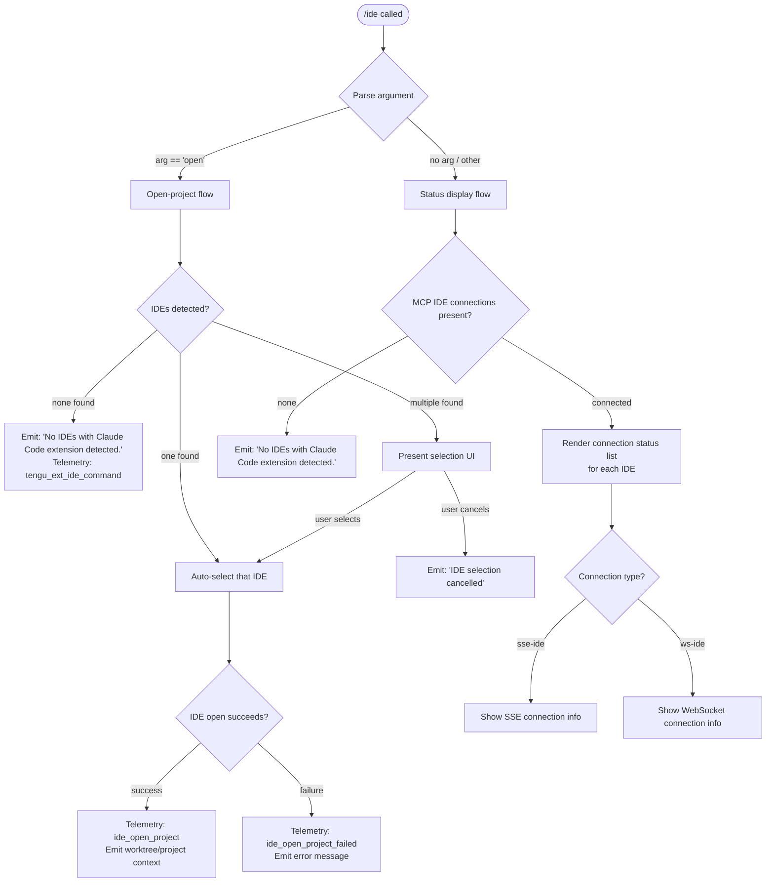

# `/ide`

> Analysis basis: CC v2.1.178 bundle.js (AST extraction + Claude interpretation)
> Minimum version: v2.1.178

---

## Overview

`/ide` manages IDE integrations for Claude Code, providing the ability to detect connected IDEs, display their status, and optionally open the current project in a selected IDE. Its core mechanism detects running IDE processes (VS Code, Cursor, Windsurf, JetBrains family, etc.) via system process enumeration and MCP connection state, then either shows connection status or—when called with `open`—spawns or focuses the IDE on the current project directory.

---

## Registration

| Field | Value |
|---|---|
| type | `local-jsx` |
| name | `ide` |
| description | `Manage IDE integrations and show status` |
| argumentHint | `[open]` |
| module_id | `K4K` |
| load_inline | `true` |
| loc_byte | `11938367` |
| loc_byte_end | `11938523` |
| loc_line | `7466` |
| arbor_handler.name | `ucL` |
| arbor_handler.fqn | `claude-2.1.178::ucL` |
| arbor_handler.kind | `AsyncFunction` |
| arbor_handler.resolution_path | `module_id` |
| arbor_handler.n_hits | `0` |

Analysis basis: CC v2.1.178 bundle.js:+11938367

---

## Input Branching

The command has 4+ distinct branches based on argument parsing and IDE detection state.



---

## Behavioral Spec

### Main Handler — IDE Command Entry Point

The handler is the `AsyncFunction` identified as `ucL` (resolved via `module_id` path to module `K4K`).

```
async function ideCommandHandler(args, context):
    emit telemetry: tengu_ext_ide_command

    argument = args[0]  // e.g. "open" or undefined

    if argument == "open":
        return openProjectFlow(context)
    else:
        return statusDisplayFlow(context)
```

Analysis basis: CC v2.1.178 bundle.js:+11934482

---

### Sub-feature: IDE Detection (`detectRunningIDEs`)

Calls the process-scan helper (identified as `d08`) which:

1. Reads current process list via a platform-appropriate command:
   - On **Linux/WSL**: runs `ps aux | grep -E "code|cursor|windsurf|devin-desktop|idea|pycharm|webstorm|phpstorm|rubymine|clion|goland|rider|datagrip|dataspell|aqua|gateway|fleet|android-studio" | grep -v grep` (Analysis basis: CC v2.1.178 bundle.js:+6633864)
   - On **macOS**: uses a platform-native mechanism via `ul8` helper
2. Normalizes process names to lowercase for matching
3. Identifies IDE family from the process name:
   - `windsurf` → Windsurf
   - `devin` / `Devin Desktop` → Devin
   - `cursor` → Cursor
   - `insiders` → VS Code Insiders
   - `vscode` / `vs code` / `visual studio code` → VS Code
   - `vscodium` / `code - oss` / `codium` → VSCodium
   - `jetbrains` / `appcode` → JetBrains family (via `jetbrains`-flavored detection at bundle.js:+6625588)
4. Resolves IDE executable paths, handling WSL path translation (detects `/mnt/c/Users` paths, skips system accounts `Public`, `Default`, `Default User`, `All Users`) (Analysis basis: CC v2.1.178 bundle.js:+6627229)
5. Emits `ide_detect` telemetry on success, `ide_detect_failed` on failure (Analysis basis: CC v2.1.178 bundle.js:+6630493, +6630557)

```
function detectRunningIDEs(platform):
    processes = runProcessScan(platform)
    results = []
    for proc in processes:
        name = proc.name.toLowerCase()
        family = matchIDEFamily(name)
        if family != null:
            path = resolveExecutablePath(proc, platform)
            if path is valid:
                results.push({ family, path, proc })
    return results
```

Analysis basis: CC v2.1.178 bundle.js:+6629138 (handler `d08`), +6629227 (helper `aS7`)

---

### Sub-feature: IDE Name Normalization (`normalizeIDEName`)

Helper identified as `c08`:

```
function normalizeIDEName(rawName):
    lower = rawName.toLowerCase()
    if lower.includes("windsurf"):  return "windsurf"
    if lower.includes("devin"):     return "devin"
    if lower.includes("cursor"):    return "cursor"
    if lower.includes("insiders"):  return "insiders"
    if lower.includes("vscode") or lower.includes("vs code")
       or lower.includes("visual studio code"):
                                    return "vscode"
    if lower.includes("vscodium") or lower.includes("codium"):
                                    return "vscodium"
    basename = path.basename(lower)
    if basename.endsWith(".cmd"):   strip ".cmd" suffix
    return normalizedBasename
```

Analysis basis: CC v2.1.178 bundle.js:+6632377

---

### Sub-feature: Executable Path Resolution (`resolveIDEPath`)

Helper identified as `tS7`:

1. Checks if the path begins with `ide` marker (bundle.js:+6626944)
2. For WSL environments (detected via `wsl` literal at bundle.js:+6627067), skips paths under `/mnt/c/Users` that belong to `Public`, `Default`, `Default User`, or `All Users` accounts
3. Resolves symlinks via `realpath`
4. Checks `lstat` to confirm the entry `isDirectory` or `isSymbolicLink`
5. Deduplicates by tracking seen real paths in a Set
6. Returns the validated list of IDE executable paths

Analysis basis: CC v2.1.178 bundle.js:+6626931

---

### Sub-feature: MCP IDE Connection Status (`getIDEConnectionStatus`)

Inspects live MCP connections filtered for the `sse-ide` and `ws-ide` channel types (Analysis basis: CC v2.1.178 bundle.js:+11932469, +11932489):

```
function getIDEConnectionStatus(mcpConnections):
    ideConnections = mcpConnections.filter(conn =>
        conn.type == "sse-ide" or conn.type == "ws-ide"
    )
    return ideConnections.map(conn => ({
        type: conn.type,
        name: conn.name,
        status: conn.status,   // "connected", "pending", etc.
        tools: filterMCPIDETools(conn)  // tools with "mcp__ide__" prefix
    }))
```

The `mcp__ide__` prefix (bundle.js:+11937176) is used to identify tools contributed by the IDE extension specifically.

Analysis basis: CC v2.1.178 bundle.js:+11936092 (handler `IcL`), +11937383 (`j.startsWith` check)

---

### Sub-feature: Open Project Flow (`openProjectInIDE`)

Triggered when argument is `"open"` (bundle.js:+11934590):

```
async function openProjectInIDE(context):
    detectedIDEs = await detectRunningIDEs(platform)
    if detectedIDEs.length == 0:
        print "No IDEs with Claude Code extension detected."
        return

    if detectedIDEs.length == 1:
        selectedIDE = detectedIDEs[0]
    else:
        selectedIDE = await promptUserToSelectIDE(detectedIDEs)
        if selectedIDE == null:
            print "IDE selection cancelled"
            return

    projectPath = resolveProjectPath(context)  // worktree or project root
    result = await launchIDEWithPath(selectedIDE, projectPath)

    if result.success:
        emit telemetry: ide_open_project  (with {type: "worktree"|"project"})
        print bold(selectedIDE.name) + " opening project..."
    else:
        emit telemetry: ide_open_project_failed
        if result.exitedWithoutOpening:
            print "Exited without opening IDE"
        else:
            print error details
            advise: "restart your IDE"  // (bundle.js:+11935701)
```

Analysis basis: CC v2.1.178 bundle.js:+11934604 (`z3`), +11934628 (`u6`), +11934870 (`Ea9`), +11935035 (telemetry `ide_open_project`)

---

### Sub-feature: Status Display / JSX Rendering (`q4K` component)

The JSX render component (identified as `q4K`) uses React hooks:
- `useState` for connection state
- `useRef` for stable references
- `useEffect` for side effects (e.g., connecting/disconnecting IDE watchers)
- `useCallback` for stable callbacks
- `useMemo` / `useSyncExternalStore` via `z6` / `TA` context hooks

Renders a live status panel showing:
1. Connected IDE name and connection type (SSE or WebSocket)
2. Available IDE tools (prefixed `mcp__ide__`)
3. Connection state (`pending`, `connected`, `ide_connect`, etc.)

Emits telemetry events:
- `ide_connect` on successful IDE connection (bundle.js:+11936586)
- `ide_connect_failed` on failure (bundle.js:+11936673)
- `ide_connect_timeout` on timeout (bundle.js:+11936780)
- `ide_disconnect` when IDE disconnects (bundle.js:+11937279)

Analysis basis: CC v2.1.178 bundle.js:+11936369

---

### Sub-feature: IDE List Truncation for Display (`yYA`)

When listing detected IDEs in output, applies truncation:

```
function formatIDEList(ideList, maxItems = 100):
    normalized = ideList
        .slice(0, 100)                       // cap at 100 entries
        .map(ide => A.normalize(ide, "NFC")) // Unicode NFC normalization

    displayed = normalized.slice(0, 3)      // show first 3
    rest      = normalized.slice(3)         // remaining

    if rest.length > 0:
        return displayed.join(", ") + ", …"
    else:
        return displayed.join(", ")
```

Numeric cap: 100 items (bundle.js:+11937825); display cap: 3 items with `", …"` suffix (bundle.js:+11938137); uses NFC normalization (bundle.js:+11937966).

Analysis basis: CC v2.1.178 bundle.js:+11937861

---

## State & Side Effects

| Item | Detail |
|---|---|
| Telemetry: `tengu_ext_ide_command` | Fired on every invocation of `/ide` (bundle.js:+11934484) |
| Telemetry: `ide_detect` | Fired after successful IDE process scan (bundle.js:+6630493) |
| Telemetry: `ide_detect_failed` | Fired when IDE process scan fails (bundle.js:+6630557) |
| Telemetry: `ide_open_project` | Fired when project opens successfully in IDE; carries `{type:"worktree"|"project"}` (bundle.js:+11935035) |
| Telemetry: `ide_open_project_failed` | Fired when IDE open fails (bundle.js:+11935142) |
| Telemetry: `ide_connect` | Fired when IDE MCP connection is established (bundle.js:+11936586) |
| Telemetry: `ide_connect_failed` | Fired when IDE MCP connection fails (bundle.js:+11936673) |
| Telemetry: `ide_connect_timeout` | Fired when IDE MCP connection times out (bundle.js:+11936780) |
| Telemetry: `ide_disconnect` | Fired when IDE disconnects (bundle.js:+11937279) |
| Telemetry: `tengu_feature_ok` / `tengu_feature_bad` / `tengu_feature_sad` | General feature outcome tracking (bundle.js:+1020153, +1020220, +1020301) |
| Telemetry: `tengu_mcp_skills` | Fired when MCP IDE skills/tools are enumerated (bundle.js:+6670836) |
| MCP connections | Reads and subscribes to live MCP connection state via `sse-ide` and `ws-ide` channel types |
| appState changes | Reads IDE state from app context via `useAppState` hook (raises `ReferenceError` if called outside `<AppStateProvider />`) (bundle.js:+3946280) |
| Process scan side effect | Runs OS-level process listing (`ps aux`) on Linux/WSL or native API on macOS to detect IDEs |
| File system side effect | May create `.claude` directory under the project root when installing IDE extension config (bundle.js:+4903125) |
| Sound | None observed |

---

## Version History

| Version | Change |
|---|---|
| v2.1.178 | Initial analysis |

---

## Common Mistakes

1. **Calling `/ide open` when no IDE has the Claude Code extension installed** — The command detects IDEs via process scan *and* requires the Claude Code extension to be active; a running VS Code without the extension will not appear in the list.
2. **Expecting instant connection after `/ide open`** — There is a connection pending/timeout cycle; if the IDE does not respond, `ide_connect_timeout` is emitted and the user sees "Error connecting to IDE." The recommended recovery is to restart the IDE.
3. **Running on a remote SSH session without X11/display forwarding** — The process scan may detect a server-side IDE process that cannot receive a GUI open request; `ide_open_project_failed` will fire with "Exited without opening IDE".
4. **WSL path confusion** — On WSL, paths under `/mnt/c/Users/Public`, `/mnt/c/Users/Default`, `/mnt/c/Users/Default User`, and `/mnt/c/Users/All Users` are explicitly excluded from IDE detection to avoid matching system accounts (bundle.js:+6627323).
5. **Assuming one entry per IDE family** — Multiple instances of the same IDE (e.g., two VS Code windows) may appear as separate selectable entries; the user must pick one from the selection UI.

---

## Appendix — Identifier Mapping

> For bundle debugging only. Identifiers change across versions.

| Identifier | Role |
|---|---|
| `ucL` | Main `/ide` command async handler (Arbor-resolved) |
| `yYA` | IDE list formatter / truncator (display helper) |
| `d08` | IDE detection orchestrator (process scan + path resolution) |
| `tS7` | IDE executable path resolver (symlink + stat + dedup) |
| `Q08` | IDE scan runner (parallel map over candidate processes) |
| `aS7` | Per-process IDE candidate evaluator |
| `sP_` | Shell command runner for process listing |
| `Q_` | Shell execution helper |
| `c08` | IDE name normalizer (lowercase + family mapping) |
| `Ea9` | IDE type classifier (windsurf/devin/cursor/vscode/etc.) |
| `SG` | IDE basename extractor and secondary normalizer |
| `LR7` | Linux IDE detection via ps-aux output parser |
| `_l_` | IDE detection entry point (platform dispatch) |
| `GW` | Detection orchestration wrapper |
| `shH` | Low-level shell execution with timeout |
| `PHH` | Post-detection helper for display formatting |
| `IcL` | MCP IDE connection status reader |
| `q4K` | JSX render component for `/ide` status display |
| `z6` | App state context hook reader |
| `lC_` | AppState context accessor (raises ReferenceError outside provider) |
| `TA` | App state context hook (alternative accessor) |
| `b7` | Composite state hook (useContext + useRef + useMemo) |
| `RG` | MCP skill/tool enumerator with hash-based dedup |
| `$_6` | Hash-based tool config deduplicator |
| `z0H` | JSON-based hash computation for tool configs |
| `Nh` | MCP skills collector (calls `O6`) |
| `O6` | MCP connection state reader |
| `u6` | App state getter (reads current state slice) |
| `Pe6` | State store accessor (via `Xe6.getStore`) |
| `W_` | State subscriber / watcher |
| `TT` | Low-level state notification dispatcher |
| `D` | Background session / IDE process manager |
| `b` | IDE daemon/session lifecycle manager |
| `yCH` | Config file reader (UTF-8 json via `_.readFile`) |
| `NH6` | Config writer (creates `.claude` dir, writes JSON) |
| `D3H` | Config path builder |
| `i9H` | IDE config sync orchestrator |
| `X_H` | Config set membership checker |
| `khA` | IDE session state manager (blocked/working/bg/daemon) |
| `ZhA` | IDE socket claim/connect handler |
| `SGA` | IDE socket auth file writer |
| `JU6` | Auth directory path builder |
| `jU6` | Auth file path builder |
| `$b5` | Connection retry/timeout wrapper |
| `Ob5` | Raw socket connector |
| `Mb5` | Claim frame builder |
| `MV` | MCP channel manager |
| `NqK` | MCP channel path builder |
| `Fv` | Binary frame encoder (Buffer operations) |
| `sB8` | Binary frame decoder (Buffer operations) |
| `Gb5` | PTY/terminal session dispatcher (large handler) |
| `lL` | PTY output line writer |
| `P` | Buffer/stream reader with indexOf |
| `S` | File stat + realpath resolver |
| `x14` | OS realpath + stat wrapper |
| `Y` | Supervisor session writer and config updater |
| `hVH` | Supervisor file stat and IPC handler |
| `$ZK` | Column width calculator for status table |
| `R14` | Heartbeat interval setup |
| `MtK` | Scheduled task display formatter |
| `Dh` | Cron expression parser |
| `c` | Background job lifecycle handler |
| `EV6` | Execution time window checker |
| `NX8` | Next-run time calculator |
| `LtK` | Boolean coercion helper |
| `Q` | Idle/daemon exit timer |
| `F` | Background PTY reconnect loop |
| `ul8` | macOS memory / system info helper |
| `O6` | MCP connection state map reader |
| `S6` | MCP telemetry/skill event emitter |
| `dRH` | Roster file reader and state parser |
| `aE6` | Roster entry path builder |
| `IZ` | Jobs directory path builder |
| `yf7` | Directory scanner for roster entries |
| `LG9` | Roster entry directory creator |
| `b3` | Roster entry type checker |
| `Mq` | File watcher / pin state manager |
| `HO` | Active session detector |
| `rT` | Session state reader |
| `f2H` | File diff/change set builder |
| `Vf7` | File change detail extractor |
| `SL` | Atomic file writer (rename-based) |
| `yO` | Atomic write with random temp name |
| `eJ` | Cache entry deleter |
| `HL6` | Roster entry sync loop |
| `Lc` | Single roster entry loader/validator |
| `KdL` | Roster entry directory initializer |
| `lI` | PTY PID file manager |
| `HYA` | PTY header reader |
| `e76` | PTY file path builder |
| `lv` | Late-entry marker writer |
| `XU6` | Auth path builder (variant) |
| `hzH` | PID tracking path builder |
| `xBH` | PTY PID file path builder |
| `zt` | Process kill helper with delay |
| `cLH` | Timed process termination |
| `Pa9` | Process signal sender |
| `Za9` | String replacement helper |
| `Z9` | String slice helper (indexOf-based) |
| `D29` | Regex match helper |
| `Ia9` | <!-- TODO: not found in depth-2 traversal; needs --depth 4 --> |
| `d6` | Feature flag / state reader (calls `d` + `dH`) |
| `L6` | String coercion wrapper |
| `g8` | Shell runner with context |
| `z3` | Argument parser / "open" flag extractor |
| `g08` | <!-- TODO: not found in depth-2 traversal; needs --depth 4 --> |
| `vH6` | Schedule validity checker |
| `Ah9` | Schedule filter (active windows) |
| `hVH` | File stat and IPC read helper |
| `w4` | Jobs path builder |
| `Xp` | MCP connection lookup |
| `o$8` | MCP connection cache accessor |
| `vG6` | MCP connection type filter |
| `NG6` | MCP connection name filter |
| `n6` | Logger / debug printer |
| `xH` | JSON serializer wrapper |
| `sk` | Text trimmer with line splitting |
| `TH` | String converter |
| `hL` | Error logger / warn emitter |
| `RH` | Error handler with log push |
| `O1` | OS/platform detector |
| `Z8` | Error code extractor (errno field) |
| `x8` | Known-error code checker |
| `i6` | JSON parser wrapper |
| `W` | MCP server connection manager |
| `j36` | MCP server list builder |
| `OA4` | MCP server config key enumerator |
| `jA` | Error string formatter |
| `bX` | Forced shutdown trigger |
| `SH` | Daemon stop handler (calls `d` + `dH`) |
| `bH` | Daemon stop-failed handler |
| `AR` | Daemon control event emitter |
| `qp` | Daemon event queue |
| `pkH` | Daemon task scheduler |
| `m0_` | Daemon event dispatcher (UUID + emit) |
| `aB` | Graceful shutdown orchestrator |
| `f5H` | MCP server shutdown caller |
| `L5H` | Timeout cleaner with `Xk_` |
| `o8` | Abort signal / timeout wrapper |

---

Note: index built via Arbor fallback; some signals (telemetry, literals) may be missing — see arbor-fallback.js.