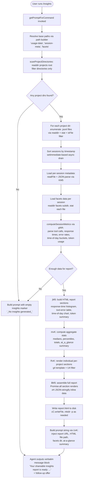

# `/insights`

> Analysis basis: CC v2.1.178 bundle.js (AST extraction + Claude interpretation)
> Minimum version: v2.1.178

---

## Overview

The `/insights` command generates a comprehensive HTML usage-analytics report from the user's Claude Code session data, then instructs the agent to output a fixed confirmation message pointing the user to the report. It operates by scanning session directories for `.jsonl` transcript files and structured facets data, assembling and computing usage metrics, writing a self-contained `report.html` file to disk, and finally returning a prompt that constrains the agent's reply to a verbatim `<message>` block.

---

## Registration

| Field | Value |
|---|---|
| type | `prompt` |
| name | `insights` |
| description | Generate a report analyzing your Claude Code sessions |
| loc_byte | `13574423` |
| loc_byte_end | `13575727` |
| loc_line | `10552` |
| handler_method | `getPromptForCommand` |
| handler_method_start | `13574597` |
| handler_method_end | `13575726` |
| prompt_body.length | `513` characters |
| prompt_body.trace | `call→UvK(...) (1 literals)` |
| arbor_handler.name | `getPromptForCommand` |
| arbor_handler.kind | `Method` |
| arbor_handler.fqn | `claude-2.1.178::getPromptForCommand` |
| arbor_handler.resolution_path | `direct` |
| arbor_handler.n_hits | `1` |

Analysis basis: CC v2.1.178 bundle.js:+13574423

---

## Input Branching

The command has more than three distinct logical branches (session directory scan → facets enumeration → per-session data loading → report generation → prompt assembly), so a Mermaid flowchart is used.



Analysis basis: CC v2.1.178 bundle.js:+13574603 (handler entry), +13561360 (directory scanner), +13561963 (report assembler)

---

## Behavioral Spec

### 1. Handler Entry — `getPromptForCommand`

The Arbor-resolved handler is `getPromptForCommand` (Method, direct resolution). At invocation it calls the session-data pipeline function (obfuscated: `pvK`) and then constructs the prompt string by passing assembled report data through `UvK`.

```
async function getPromptForCommand(context):
    reportData = await buildInsightsReport(context)
    promptText = buildPromptString(reportData)   // calls UvK
    return promptText
```

Analysis basis: CC v2.1.178 bundle.js:+13574603

---

### 2. Directory Discovery — `scanProjectDirectories`

Resolves the projects root via a path-join helper (`Xr`), then reads the directory listing (`cC.readdir`), filters entries that are directories (`K.isDirectory`), and returns sorted project paths. Batching uses `setImmediate` with concurrency constants of 10 and 9 (Analysis basis: CC v2.1.178 bundle.js:+13561237/+13561242) and slice limits of 50 and 200 (Analysis basis: CC v2.1.178 bundle.js:+13561379/+13561384).

```
async function scanProjectDirectories(baseDir):
    entries = await fs.readdir(baseDir)
    dirs = entries.filter(e => e.isDirectory())
    sorted = dirs.sort()
    return sorted
```

The literal `"projects"` is used as the subdirectory name (Analysis basis: CC v2.1.178 bundle.js:+5142645).

---

### 3. Session File Enumeration — `enumerateFacetFiles`

For each project directory, `o56` reads the facets subdirectory (`"facets"` — Analysis basis: CC v2.1.178 bundle.js:+13500298), filters for `.jsonl` files (literal `".jsonl"` — Analysis basis: CC v2.1.178 bundle.js:+13655371), stats each file (`iK.stat`), and populates a results array via `Promise.all`.

```
async function enumerateFacetFiles(projectDir):
    facetsPath = path.join(projectDir, "facets")
    entries = await fs.readdir(facetsPath)
    jsonlFiles = entries.filter(e => e.isFile() && matchesJsonlExtension(e))
    stats = await Promise.all(jsonlFiles.map(f => fs.stat(f)))
    return jsonlFiles.map((f, i) => ({ name: basename(f), stat: stats[i] }))
```

Analysis basis: CC v2.1.178 bundle.js:+13655265

---

### 4. Per-Session Metadata Loading — `loadSessionMeta`

`KM5` builds the path using the `"session-meta"` literal (Analysis basis: CC v2.1.178 bundle.js:+13500344) and the `"usage-data"` literal (Analysis basis: CC v2.1.178 bundle.js:+13500248), reads the file as UTF-8 (literal `"utf-8"` — Analysis basis: CC v2.1.178 bundle.js:+13506379), then parses it through JSON.parse via `i6`.

```
async function loadSessionMeta(sessionId, baseDir):
    metaPath = buildMetaPath(baseDir, "usage-data", "session-meta", sessionId)
    raw = await fs.readFile(metaPath, "utf-8")
    return JSON.parse(raw)
```

Analysis basis: CC v2.1.178 bundle.js:+13506312

---

### 5. Session Metrics Computation — `computeMetrics`

`gWA` and `bvK` parse raw transcript entries, classifying tool calls, computing response-time buckets (2–10 s, 10–30 s, 30 s–1 m, 1–2 m, 2–5 m, 5–15 m, >15 m — Analysis basis: CC v2.1.178 bundle.js:+13517530–13517590), and tallying token counts up to 3600 s per session (Analysis basis: CC v2.1.178 bundle.js:+13501745). Time-of-day classification divides into Morning 6–12, Afternoon 12–18, Evening 18–24, Night 0–6 (Analysis basis: CC v2.1.178 bundle.js:+13518378–13518531).

Tool-outcome classification recognises the following error categories (Analysis basis: CC v2.1.178 bundle.js:+13502072–13502429):
- `"string to replace not found"` → Edit Failed
- `"no changes"` → Edit Failed
- `"modified since read"` → File Changed
- `"exceeds maximum"` / `"too large"` → File Too Large
- `"file not found"` / `"does not exist"` → File Not Found
- `"rejected"` / `"doesn't want"` → User Rejected
- `"exit code"` / `"Command Failed"` → Command Failed
- `"[Request interrupted by user"` → Interrupted

```
function computeMetrics(transcriptEntries):
    toolCalls = []
    responseTimes = []
    timeOfDayBuckets = { morning:0, afternoon:0, evening:0, night:0 }
    for entry in transcriptEntries:
        if entry.type == "tool_use":
            classify and append to toolCalls
        compute responseTime bucket
        classify hour into timeOfDayBucket
    return { toolCalls, responseTimes, timeOfDayBuckets, tokenSums }
```

Analysis basis: CC v2.1.178 bundle.js:+13503018

---

### 6. Aggregate Statistics — `computeAggregateStats`

`mvK` computes medians via a sort-then-index approach (`q.sort`, `q.at`, `Math.floor` — Analysis basis: CC v2.1.178 bundle.js:+13511976–13512150), percentiles (`uvK` using Number.isFinite guard — Analysis basis: CC v2.1.178 bundle.js:+13508593), and a token-budget split (`$.split` at `13509184`). Maximum context window used in report generation: 4096 tokens (Analysis basis: CC v2.1.178 bundle.js:+13508261). Session warm-up timeout: 30000 ms (Analysis basis: CC v2.1.178 bundle.js:+13505568); fallback: 25000 ms (Analysis basis: CC v2.1.178 bundle.js:+13505589). Median computation ceiling for response data slices: 500 items (Analysis basis: CC v2.1.178 bundle.js:+13504791). The `"at_a_glance"` key holds the summary block injected into the prompt (Analysis basis: CC v2.1.178 bundle.js:+13514557).

```
function computeAggregateStats(allSessionMetrics):
    sorted = allSessionMetrics.sort(byTimestamp)
    median = sorted[Math.floor(sorted.length / 2)]
    percentiles = computePercentiles(sorted)   // uvK
    atAGlance = formatAtAGlance(median, percentiles)
    return { median, percentiles, atAGlance, tokenTotals }
```

Analysis basis: CC v2.1.178 bundle.js:+13510148

---

### 7. HTML Report Generation — `buildHtmlReport`

`jM5` constructs the full HTML document. It:
- Escapes HTML entities via `XL`/`RL` (replacing `&`, `<`, `>`, `"`, `'` with their HTML entity equivalents — Analysis basis: CC v2.1.178 bundle.js:+5179694–5179817)
- Renders response-time histograms using colour palette `#2563eb`, `#0891b2`, `#10b981`, `#8b5cf6` (Analysis basis: CC v2.1.178 bundle.js:+13555195–13555648)
- Renders tool-error bars with colours `#dc2626` (errors), `#16a34a` (success), `#eab308` (warning) (Analysis basis: CC v2.1.178 bundle.js:+13558911–13559653)
- Generates bullet points (`"• "` — Analysis basis: CC v2.1.178 bundle.js:+13519279) and line breaks (`"<br>"` — Analysis basis: CC v2.1.178 bundle.js:+13519309)
- Bolds headings with `"<strong>$1</strong>"` (Analysis basis: CC v2.1.178 bundle.js:+13519236)
- Adds a `"Add to CLAUDE.md"` suggestion link (Analysis basis: CC v2.1.178 bundle.js:+13522874)
- Uses `8192` as the HTML section character limit (Analysis basis: CC v2.1.178 bundle.js:+13516699)
- Outputs `<p class="empty">No data</p>` when a section has no rows (Analysis basis: CC v2.1.178 bundle.js:+13517021)

The final output filename is `"report.html"` (Analysis basis: CC v2.1.178 bundle.js:+13563617).

```
function buildHtmlReport(aggregateStats, perProjectSections):
    htmlParts = []
    htmlParts.push(renderResponseTimeHistogram(aggregateStats))
    htmlParts.push(renderToolErrorTable(aggregateStats))
    htmlParts.push(renderTimeOfDayChart(aggregateStats))
    htmlParts.push(renderTokenSummary(aggregateStats))
    for section in perProjectSections:
        htmlParts.push(renderProjectSection(section))
    return assembleFullDocument(htmlParts)   // $M5
```

Analysis basis: CC v2.1.178 bundle.js:+13519164

---

### 8. Report File Writing — `writeReportFile`

`pvK` creates the output directory with `cC.mkdir` (Analysis basis: CC v2.1.178 bundle.js:+13563358), constructs a timestamp-based filename using `Date` getters (`getFullYear`, `getMonth`, `getDate`, `getHours`, `getMinutes`, `getSeconds` — Analysis basis: CC v2.1.178 bundle.js:+13563449–13563547), joins the path with `vc.join`, then writes via `cC.writeFile` (Analysis basis: CC v2.1.178 bundle.js:+13563645). Intermediate facets per session are written via `fM5` / `qM5` using a 384-byte buffer allocation (Analysis basis: CC v2.1.178 bundle.js:+13507028).

```
async function writeReportFile(htmlContent, outputDir):
    now = new Date()
    filename = "report.html"
    dirPath = buildTimestampedPath(outputDir, now)
    await fs.mkdir(dirPath, { recursive: true })
    await fs.writeFile(path.join(dirPath, filename), htmlContent)
    return { filePath: path.join(dirPath, filename), url: fileUrl(dirPath) }
```

Analysis basis: CC v2.1.178 bundle.js:+13563358

---

### 9. Prompt Assembly — `buildPromptString`

The handler calls `UvK` (traced as `call→UvK(...) (1 literals)`) to construct the final 513-character prompt. The prompt:
1. States the user ran `/insights`.
2. Embeds the full insights data blob.
3. Includes the report URL, HTML file path, and facets directory.
4. Includes the at-a-glance summary (marked as agent-only context).
5. Instructs the agent to output the text inside `<message>` tags verbatim — no omissions permitted.
6. The `<message>` block tells the user their shareable insights report is ready (with the report URL) and offers to dig into any section or try suggestions.

When no insights data is available, the literal `"_No insights generated_"` is substituted (Analysis basis: CC v2.1.178 bundle.js:+13575494).

The separator `" · "` appears in the at-a-glance summary formatting (Analysis basis: CC v2.1.178 bundle.js:+13575055).

```
function buildPromptString(reportData):
    if reportData.isEmpty:
        atAGlance = "_No insights generated_"
    else:
        atAGlance = reportData.atAGlance
    return interpolateTemplate(
        insightsData   = reportData.serialized,
        reportUrl      = reportData.url,
        htmlFilePath   = reportData.filePath,
        facetsDir      = reportData.facetsDir,
        atAGlance      = atAGlance
    )
```

Analysis basis: CC v2.1.178 bundle.js:+13575629

---

## State & Side Effects

| Item | Detail |
|---|---|
| Telemetry | `tengu_mcp_skills` (bundle.js:+6670836); `tengu_transcript_phantom_parent` (bundle.js:+13640646); `tengu_relink_walk_broken` (bundle.js:+13619704); `tengu_transcript_parent_cycle` (bundle.js:+13644550); `tengu_chain_parent_cycle` (bundle.js:+13621481); `tengu_chain_timestamp_fallback` (bundle.js:+13621630); `tengu_chain_parallel_tr_recovered` (bundle.js:+13623496); `tengu_daemon_config_reload` (bundle.js:+17081946); `tengu_daemon_idle_exit` (bundle.js:+17087199); `tengu_daemon_control` (bundle.js:+17104063); `tengu_bg_dispatch_sigkill_escalate` (bundle.js:+17066047); `tengu_bg_dispatch_low_mem` (bundle.js:+17066648); `tengu_bg_spare_enable` (bundle.js:+17067352); `tengu_bg_spare_claim` (bundle.js:+17067480); `tengu_bg_spare_claim_fail` (bundle.js:+17067746); `tengu_scheduled_task_fire` (bundle.js:+16547892); `tengu_scheduled_task_expired` (bundle.js:+16548235); `tengu_bg_retire_pinned_low_mem` (bundle.js:+17070758); `tengu_bg_prewarm_per_sweep` (bundle.js:+17070879); `tengu_daemon_yield` (bundle.js:+17086169) |
| Filesystem writes | Creates `report.html` in a timestamped subdirectory of the insights output path; creates intermediate `"usage-data"` / `"session-meta"` / `"facets"` directories as needed via `cC.mkdir` |
| Filesystem reads | Reads project directories, `.jsonl` transcript files, session-meta JSON, and facets data files |
| appState changes | None directly; MCP state updates (`applyMcpUpdate`, `applyConnectionResult`) are reachable via the shared MCP connection manager traversed in the call graph but are not triggered by this command |
| Hook registration | None specific to `/insights` |
| Sound | None |
| Agent output constraint | The prompt strictly requires the agent to reproduce the `<message>` block verbatim — the model is not permitted to paraphrase or omit lines |

---

## Version History

| Version | Change |
|---|---|
| v2.1.178 | Initial analysis |

---

## Common Mistakes

1. **Expecting interactive output before report is written**: The command writes `report.html` to disk before returning any agent message. If the write fails (permissions, disk full), the agent will receive an empty or error prompt and may output the `"_No insights generated_"` fallback instead of the report URL.
2. **Confusing the at-a-glance summary visibility**: The prompt explicitly marks the at-a-glance summary as "for your context only — the user has not seen any output yet". The agent must not repeat or paraphrase it; it must only output the `<message>` block.
3. **Assuming `/insights` accepts arguments**: The registration has no `inputSchema` or argument definition. The command ignores any text typed after `/insights`.
4. **Running in a directory with no Claude Code sessions**: If no `.jsonl` facet files are found, the output falls through to the `"_No insights generated_"` path and no HTML file is written.
5. **Expecting real-time data**: Metrics are computed from already-written `.jsonl` transcripts. Sessions still in progress at invocation time may not be fully reflected in the report.

---

## Appendix — Identifier Mapping

> For bundle debugging only. Identifiers change across versions.

| Identifier | Role |
|---|---|
| `pvK` | Main session-data pipeline and report orchestrator |
| `XM5` | Project directory scanner (readdir + filter + sort) |
| `Xr` | Base path resolver (joins `"projects"` root) |
| `o56` | Facets file enumerator (readdir + stat `.jsonl` files) |
| `Hh` | `.jsonl` extension matcher (regex test) |
| `KM5` | Per-session metadata loader (readFile + JSON.parse) |
| `BWA` | Nested path builder for usage-data subdirectories |
| `Og6` | Inner path builder for `"usage-data"` segment |
| `xvK` | Session metadata validator/transformer |
| `i6` | JSON.parse wrapper |
| `gWA` | Top-level metrics computation dispatcher |
| `bvK` | Per-transcript-entry metric classifier (tool calls, response times, errors) |
| `o55` | File extension extractor (vc.extname) |
| `XWH` | Diff helper (KI9.diff) |
| `uf` | Index-of helper for classification |
| `a55` | NaN guard for numeric session values |
| `J$` | Rounding/formatting helper for metric values |
| `mvK` | Aggregate statistics computer (medians, percentiles, totals) |
| `uvK` | Percentile computation (Number.isFinite guard, sorted push) |
| `r56` | Object.entries-based stat aggregator |
| `Z9` | String slice/indexOf helper for metric keys |
| `$M5` | Full HTML report assembler (Promise.all section renders) |
| `RvK` | Per-project section renderer |
| `jM5` | HTML report document builder (histogram, charts, tables) |
| `DM5` | JSON-stringify inline data embedder (xH wrapper) |
| `OYH` | Response-time histogram section renderer |
| `YM5` | Token summary section renderer |
| `wM5` | Time-of-day chart renderer |
| `Hn8` | HTML section string formatter |
| `XL` | HTML entity escaper (dispatcher) |
| `RL` | HTML entity replacement implementation (replaceAll) |
| `fM5` | Facets-write helper (mkdir + writeFile per session) |
| `qM5` | Alternative facets-write helper (mkdir + writeFile, _n8 path) |
| `AM5` | Session cleanup/unlink helper |
| `_n8` | Path builder for `"session-meta"` subdirectory |
| `LM5` | Report-generation orchestrator (calls o46, g4, CvK, jA) |
| `_M5` | Batch-processing dispatcher for session slices |
| `t55` | Session-chunk assembler (gWA calls, join) |
| `o46` | Individual session report renderer |
| `g4` | Template base for session sections |
| `jU8` | Agent listing delta / SHA1 hash helper |
| `F8` | UUID generator wrapper |
| `wFH` | Assistant message extractor (pMA, tyK) |
| `CvK` | Path canonicalization wrapper (dw) |
| `dw` | File-system canonicalization (fkH) |
| `U4` | Filter helper for rendered sections |
| `jA` | Error/string wrapper |
| `PM5` | Object.keys-based report-key enumerator |
| `UvK` | Prompt string template builder (final prompt constructor) |
| `An8` | Insights data snapshot collector (state map getters) |
| `w4H` | Application state initializer / state-map setter |
| `CNK` | State-map value propagator (H.values → q.push) |
| `BOH` | Chain-parent resolver (cycle detection, timestamp fallback) |
| `eM5` | NaN-guarded session-value aggregator |
| `H35` | Parallel transcript recovery handler |
| `sM5` | Session-shift/sort helper |
| `m46` | Simple map helper (H.map) |
| `j0A` | Compact-summary string builder (CB6, replaceAll) |
| `CB6` | Compact-summary content assembler |
| `X0A` | Content-type validator (_35, A35) |
| `_35` | Trim+some validator for string content |
| `A35` | Array-some validator for content blocks |
| `Xn8` | State-map getter/setter for snapshot keys |
| `Pn8` | Array.from(H.values()) helper |
| `ebH` | MCP connection orchestrator (reached via shared state) |
| `INA` | MCP server reconnect / state-apply dispatcher |
| `hs8` | MCP connection result applier |
| `RG` | MCP connection cleanup helper |
| `$_6` | MCP error-state writer |
| `TH` | String coercion / error-message extractor |
| `RH` | Structured error logger (ElH.push + Us.logError) |
| `Y8` | MCP debug logger (ElH.push + Us.logMCPDebug) |
| `$7` | MCP error logger (ElH.push + Us.logMCPError) |
| `xH` | JSON.stringify wrapper |
| `FWA` | <!-- TODO: not found in depth-2 traversal; needs --depth 4 --> |
| `QE` | <!-- TODO: not found in depth-2 traversal; needs --depth 4 --> |
| `ZZ` | <!-- TODO: not found in depth-2 traversal; needs --depth 4 --> |
| `zNK` | Transcript relink / parent-chain walker |
| `Y35` | Binary transcript parser (Buffer-based JSONL reader) |
| `w35` | Synchronous file reader (openSync/readSync/closeSync) |
| `z35` | Binary buffer assembler for transcript chunks |
| `fyH` | File-type helper (ol4, al4, tl4, sl4) |
| `rzH` | Array.isArray + filter helper for transcript entries |
| `L6` | String coercion utility |
| `O1` | Z8-based error classifier |
| `BvK` | Session-validity checker |
| `GX` | <!-- TODO: not found in depth-2 traversal; needs --depth 4 --> |
| `YB` | <!-- TODO: not found in depth-2 traversal; needs --depth 4 --> |
| `UM5` | <!-- TODO: not found in depth-2 traversal; needs --depth 4 --> |

---

Note: index built via Arbor fallback; some signals (telemetry, literals) may be missing — see arbor-fallback.js.