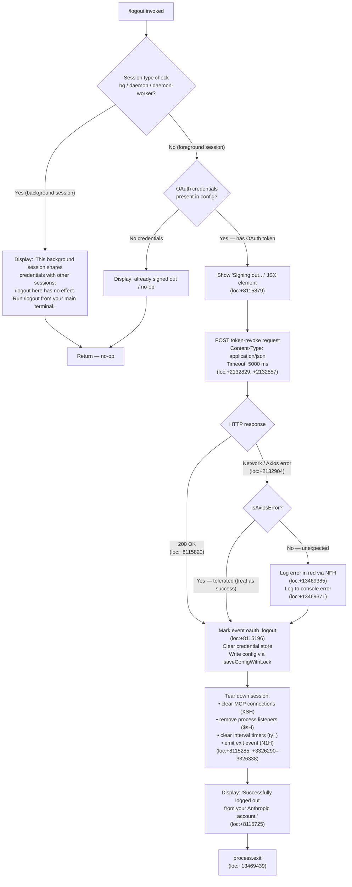

# `/logout`

> Analysis basis: CC v2.1.178 bundle.js (AST extraction + Claude interpretation)
> Minimum version: v2.1.178

---

## Overview

The `/logout` command signs the user out of their Anthropic account by revoking the active OAuth token, clearing stored credentials, tearing down the active session's daemon and process listeners, and then exiting the CLI process. It is a `local-jsx` command rendered with a React element that displays progress feedback during the sign-out sequence.

---

## Registration

| Field | Value |
|---|---|
| type | `local-jsx` |
| name | `logout` |
| description | Sign out from your Anthropic account |
| loc_byte | `11980660` |
| loc_byte_end | `11980944` |
| loc_line | `7950` |
| module_id | `nHA` |
| load_inline | `true` |
| arbor_handler.name | `G9L` |
| arbor_handler.fqn | `claude-2.1.178::G9L` |
| arbor_handler.kind | `AsyncFunction` |
| arbor_handler.resolution_path | `module_id` |
| arbor_handler.n_hits | `0` |

Analysis basis: CC v2.1.178 bundle.js:+11980660

---

## Input Branching

The handler has four distinct branches based on session type, token availability, HTTP response, and error conditions — a Mermaid flowchart is required.



---

## Behavioral Spec

### Top-level handler — `logoutCommandHandler` (G9L)

Analysis basis: CC v2.1.178 bundle.js:+8115416

```
async function logoutCommandHandler(context):
    sessionType = readSessionType()          // v9 → zkH  (loc:+8114015, +2295576)

    if sessionType in ["bg", "daemon", "daemon-worker"]:
        // Background sessions share the credential file with the
        // main terminal and must not revoke the shared token.
        renderJSX(backgroundSessionWarning)  // literal at loc:+8115526
        return                               // no further action

    config = readConfig(context)             // tK → KC1  (loc:+8114074)
    oauthToken = config.oauthToken

    if not oauthToken:
        return                               // already signed out; silent no-op

    renderJSX(createElement("Signing out…")) // lHA.createElement (loc:+8115700, literal loc:+8115879)

    await revokeToken(oauthToken)            // $k        (loc:+8114171)
    recordTelemetry("oauth_logout")          // SH        (loc:+8115193, literal loc:+8115196)

    await clearCredentialStore()             // $96 body  (loc:+8113960–8115193)
    await tearDownSession()                  // JS6       (loc:+8114027)

    setTimeout(() => {
        renderJSX(successMessage)            // literal "Successfully logged out…" (loc:+8115725)
    }, smallDelay)

    exitProcess(0)                           // via F1 → process.exit (loc:+13469439)
```

---

### OAuth token revocation — `revokeToken` ($k)

Analysis basis: CC v2.1.178 bundle.js:+8114171 → +2132699

```
async function revokeToken(token):
    endpoint = buildOAuthEndpoint(token)     // k1 (loc:+2132710)
    try:
        response = await httpClient.post(endpoint, {
            grant_type: "refresh_token",     // literal loc:+2132759
            token: token
        }, {
            headers: { "Content-Type": "application/json" },  // loc:+2132814, +2132829
            timeout: 5000                    // loc:+2132857
        })
        logDebug("oauth_token_revoke", response)  // literal loc:+2132867
    catch error:
        if isAxiosError(error):              // zA.isAxiosError (loc:+2132904)
            // network-level failure; treat as success and continue
            logNetworkError(error)           // literal "network" loc:+2132991
        else:
            // unexpected error: surface it and still continue
            logErrorInRed(error)             // NFH → J6.red (loc:+13469385)
            logToConsole(error)              // console.error (loc:+13469371)
```

---

### Credential / config clearing — `clearCredentialStore` ($96 inner)

Analysis basis: CC v2.1.178 bundle.js:+8113960

```
async function clearCredentialStore():
    // Reads current config, strips auth fields, writes back
    currentConfig = await configStore.readAsync()   // f.readAsync (loc:+8114113)
    updatedConfig  = removeAuthFields(currentConfig) // As (loc:+8114326)

    // Attempt secure-storage deletion
    try:
        deleteKeychainEntry("claude-code-user")     // py_ → TZ1 → Ok (loc:+8114341, literal loc:+2147019)
    catch:
        logWarning("Failed to delete keychain entry")  // literal loc:+2147778

    configStore.mutate(updatedConfig)               // K.mutate (loc:+8114512)
    await saveConfigWithLock(updatedConfig)          // W8 (loc:+8114740)
    // saveConfigWithLock guards against auth-loss regression (GH #3117)
    // literal: "saveConfigWithLock: re-read config is missing auth…" (loc:+3349239)
```

---

### Session teardown — `sessionTearDown` (JS6)

Analysis basis: CC v2.1.178 bundle.js:+8115279

```
function sessionTearDown():
    clearActiveToolCalls()       // kE8   (loc:+8115273)
    flushPendingOutput()         // $5H   (loc:+8115279)
    clearMcpConnections()        // XSH → T79.clear  (loc:+8115285, +3275848)
    cancelDaemonHeartbeat()      // kJH   (loc:+8115291)
    shutDownNotificationSystem() // N1H   (loc:+8115316) — see below
    cleanUpProcessFiles()        // Q9q   (loc:+8115370) — unlinks temp files
    stopDaemonServer()           // pr_   (loc:+8115382)
```

#### Notification-system shutdown — `shutDownNotifications` (N1H)

Analysis basis: CC v2.1.178 bundle.js:+3326014

```
function shutDownNotifications():
    terminateSubscriptions()     // Xp → qp → ib  (loc:+3326014)
    clearAllListeners()          // $sH            (loc:+3326030)
        // • process.off("exit")                 (loc:+3326164, literal loc:+3326222)
        // • clear uXH, i$8, ZG6, ny_, xg maps  (loc:+3326290–3326338)
        // • clearInterval via ty_               (loc:+3326924)
        // • process.removeListener("beforeExit") (loc:+3326959, literal loc:+3326982)
    emitSessionEndEvent()        // LsH.emit        (loc:+3326036)
    flushErrorLog()              // RH              (loc:+3326075)
    logFinalError()              // jA              (loc:+3326078)
```

#### Temp-file / process-file cleanup — `cleanUpProcessFiles` (Q9q)

Analysis basis: CC v2.1.178 bundle.js:+7213547

```
function cleanUpProcessFiles():
    removeLockFile()             // l9q  (loc:+7213547)
    cleanUpSockFile()            // Ok6 → ftA  (loc:+7213553)
    buildPathForRemoval()        // a7H  (loc:+7213576)
    joinPaths()                  // ZH8 → KtA.join  (loc:+7213599)
    unlinkProcessFile()          // ZA6.unlink  (loc:+7213611)
```

---

### Error display helper — `displayErrorInRed` (NFH)

Analysis basis: CC v2.1.178 bundle.js:+13469371

```
function displayErrorInRed(error):
    console.error(error)         // (loc:+13469371)
    render(J6.red(error.message))// J6.red (loc:+13469385)
    writeConfig("cli_error", …)  // cX — literal "cli_error" (loc:+13469426)
    process.exit(1)              // (loc:+13469439)
```

---

## State & Side Effects

| Item | Detail |
|---|---|
| Telemetry — oauth_logout | Fired after token revocation succeeds; string literal `"oauth_logout"` at bundle.js:+8115196 |
| Telemetry — tengu_feature_ok | Fired on successful credential write path (loc:+1020153) |
| Telemetry — tengu_feature_sad | Fired on credential write failure fallback (loc:+1020301) |
| Telemetry — tengu_feature_bad | Fired on credential write hard failure (loc:+1020220) |
| Telemetry — tengu_config_lock_contention | Emitted when saveConfigWithLock detects lock contention (loc:+3348912) |
| Telemetry — tengu_config_stale_write | Emitted when a stale write is detected during config save (loc:+3349048) |
| Telemetry — tengu_config_auth_loss_prevented | Emitted when the GH #3117 guard prevents an auth-wiping write (loc:+3349391) |
| Telemetry — tengu_config_fallback_write | Emitted when the config falls back to an alternative write path (loc:+3348528) |
| Telemetry — tengu_config_parse_error | Emitted on config JSON parse failure (loc:+3351487) |
| OAuth HTTP call | POST to revoke endpoint; timeout 5000 ms; `Content-Type: application/json` (loc:+2132829, +2132857) |
| Keychain / secure storage | Deletes entry keyed `"claude-code-user"` (loc:+2147019) |
| Config file write | Strips auth fields and rewrites `~/.claude.json` via saveConfigWithLock; GH #3117 guard active (loc:+3349239) |
| Config backup | Up to 5 rolling backups created under `backups/` subdirectory (literal `"backups"` loc:+3350424; limit `5` loc:+3349842) |
| Process event listeners | All `exit` and `beforeExit` listeners removed (loc:+3326222, +3326982) |
| Interval timers | All active intervals cleared via `clearInterval` (loc:+3326924) |
| MCP connections | Cleared via `T79.clear` (loc:+3275848) |
| Process exit | `process.exit` called after teardown; exit code `1` on hard CLI error, implicit `0` on success (loc:+13469439) |
| JSX rendering | Two React elements rendered: "Signing out…" (loc:+8115879) then "Successfully logged out…" (loc:+8115725) |
| Background-session guard | Sessions of type `"bg"`, `"daemon"`, or `"daemon-worker"` receive an informational message and the command returns immediately — credentials are never touched (literals loc:+2295499, +2295509, +2295523) |

---

## Version History

| Version | Change |
|---|---|
| v2.1.178 | Initial analysis |

---

## Common Mistakes

1. **Running `/logout` from a background or daemon session** — The command silently no-ops in `bg`, `daemon`, and `daemon-worker` session types (loc:+2295499–2295523). Users must run `/logout` from the primary foreground terminal session for the revocation to take effect.
2. **Expecting the process to stay alive after logout** — After a successful sign-out `process.exit` is called unconditionally. Any work in progress in the current session is lost; save work before issuing `/logout`.
3. **Assuming network failure cancels sign-out** — An Axios/network error during the token-revocation POST is treated as tolerable; the credential store is cleared locally regardless. Only truly unexpected (non-Axios) errors surface in red and halt the flow.
4. **Ignoring the GH #3117 auth-loss guard** — If the config re-read detects that the in-memory auth is absent from the on-disk version, the write is refused and `tengu_config_auth_loss_prevented` is emitted (loc:+3349391). This can leave the user apparently signed out in the UI while credentials remain on disk; a manual file edit or re-login resolves it.
5. **Confusing `/logout` scope with API key authentication** — The command revokes OAuth tokens and clears the OAuth credential store. Claude Code instances configured with a raw `ANTHROPIC_API_KEY` environment variable are unaffected; the key must be removed separately.

---

## Appendix — Identifier Mapping

> For bundle debugging only. Identifiers change across versions.

| Identifier | Role |
|---|---|
| `G9L` | Top-level async logout command handler (Arbor-resolved handler, `module_id` path) |
| `$96` | Inner sign-out execution function (clears credentials, orchestrates teardown) |
| `T9L` | JSX rendering wrapper / result component for the logout UI |
| `q` | Session/process data reader called early in handler |
| `F1` | Error-surfacing and process-exit orchestrator |
| `NFH` | Error display helper — prints red error, writes `cli_error` config key, calls `process.exit` |
| `cX` | Config key writer (`cli_error` path) |
| `v9` | Session-type detector (reads `bg` / `daemon` / `daemon-worker`) |
| `zkH` | Session-type value resolver |
| `JS6` | Session teardown coordinator |
| `kE8` | Active tool-call canceller |
| `$5H` | Pending output flusher |
| `XSH` | MCP connection map clearer (`T79.clear`) |
| `kJH` | Daemon heartbeat canceller |
| `N1H` | Notification-system shutdown orchestrator |
| `Xp` | Subscription terminator |
| `qp` | Subscription helper |
| `$sH` | Process-listener and timer cleaner |
| `ty_` | Interval and `beforeExit` listener remover |
| `RH` | Error-log flusher / final error logger |
| `jA` | Error object builder / logger |
| `L6` | String-to-error converter |
| `qq` | Essential-traffic queue reference |
| `RQ4` | Error log ring-buffer manager |
| `Q9q` | Temp / process-file cleanup coordinator |
| `l9q` | Lock-file remover |
| `Ok6` | Socket-file cleaner |
| `ftA` | Socket path builder |
| `a7H` | Path argument helper |
| `ZH8` | Path joiner for process files |
| `pr_` | Daemon server stopper |
| `ur_` | Daemon server stop inner function |
| `Ur_` | Daemon teardown sub-step |
| `M5H` | Daemon mode / include-list checker |
| `xJH` | Daemon socket path builder |
| `S_` | Provider/auth-type string resolver (bedrock / foundry / vertex / etc.) |
| `tK` | Config reader entry point |
| `KC1` | Core config store accessor (read/write/delete/update) |
| `H` | Primary storage backend (read / readAsync / update / delete) |
| `_` | Secondary / fallback storage backend |
| `XkH` | Storage read-through cache layer |
| `BTf` | Async storage context builder |
| `SH` | Telemetry / event recording helper |
| `d` | Low-level storage write primitive |
| `dH` | Storage write helper |
| `d6` | Storage update helper |
| `bH` | Storage delete helper |
| `f` | Async file reader with connection tracking |
| `L` | Connection lifecycle manager |
| `A` | HTTP / connection object |
| `$k` | OAuth token revocation HTTP caller |
| `k1` | OAuth endpoint URL builder |
| `JgA` | OAuth environment selector |
| `ON4` | OAuth URL formatter |
| `N` | HTTP request dispatcher / logger |
| `AM4` | HTTP request builder |
| `WSA` | HTTP transport layer |
| `xH` | JSON serialiser helper |
| `d4` | URL path manipulator |
| `sCA` | Content-type mapper |
| `VdH` | Response writer helper |
| `FCA` | Stream write wrapper |
| `LM4` | Log-file writer / rolling-log manager |
| `sQH` | Log queue / batch-write scheduler |
| `G7H` | Log directory resolver |
| `n6` | `mkdirSync` / directory-creation helper |
| `INH` | EISDIR error handler |
| `_bA` | Log path builder |
| `P__` | Log file rotator |
| `fM4` | Log file appender |
| `F9` | XSA (stream) registration helper |
| `As` | Auth-field stripper (removes OAuth fields from config object) |
| `py_` | Keychain / secure-storage deletion coordinator |
| `b79` | Keychain deletion sub-orchestrator |
| `TZ1` | Keychain entry lookup and delete |
| `Ok` | Keychain key hasher (SHA-256 / NFC) |
| `GW` | Keychain backend dispatcher |
| `xN` | System user-info resolver |
| `TH` | String coercion utility |
| `W8` | Global config save with lock (`saveGlobalConfig`) |
| `wO8` | Config file writer with lock acquisition |
| `tR1` | Lock-state initialiser |
| `Z8` | Synchronous file-read helper |
| `_MH` | Config JSON parser with backup logic |
| `JsH` | Config backup writer |
| `zk_` | Backup path builder |
| `V` | Terminal/UI viewport helper |
| `P` | Binary stream / buffer processor |
| `E` | Numeric range / math helper |
| `ED6` | Atomic file-write helper (temp + rename + fchmod) |
| `gXH` | Config lock helper |
| `PL9` | Config entry enumerator |
| `CG6` | Lock timestamp recorder |
| `YO8` | Config write sub-step (validates and writes) |
| `U48` | Keychain availability checker |
| `K` | React/Ink store / state atom |
| `MNH` | Config key deleter |
| `T9L` | JSX logout result renderer |
| `tRH` | Error type classifier (auth / timeout / network / http) |
| `RJ` | Error code extractor |
| `t4` | Session config + event emitter |
| `sRH` | Session resource initialiser |
| `Yg` | Session ID generator |
| `R6` | Terminal colour / format helper |
| `Nj8` | OTEL attribute builder |
| `YZ6` | OTEL string converter |
| `Ql` | Blocked-traffic set checker |
| `Z4` | Session state accessor |
| `oG9` | OTEL attribute pair builder |
| `s$6` | Config snapshot helper |
| `WH_` | Session event dispatcher |
| `M` | MCP server manager / update dispatcher |
| `ebH` | MCP connection builder |
| `hs8` | MCP connection result applier |
| `$` | MCP client map accessor |
| `INA` | MCP client enumerator / reconnector |
| `GH_` | Session teardown finaliser |
| `F4` | Ink/React application exit driver |
| `S9` | Ink app shutdown and cleanup runner |
| `bxH` | Ink unmount and final write helper |
| `PR` | Ink render pipeline flusher |
| `rY8` | Terminal restore-cursor writer |
| `zo_` | Terminal cleanup / ANSI reset writer |
| `l0` | Terminal stream reference |
| `Om` | Terminal output buffer |
| `fk6` | Working-directory stat helper |
| `Y$` | Path formatter helper |
| `u1q` | ANSI escape helper |
| `Yo_` | Forced-exit watchdog (SIGKILL fallback) |
| `tQH` | XSA stream drainer |
| `Y` | Ink supervisor / MCP watcher |
| `hVH` | File-stat promise helper |
| `$ZK` | File diff / column-width calculator |
| `T` | Ink component stop controller |
| `R14` | Heartbeat timer starter |
| `n1q` | Graceful-shutdown all-settled waiter |
| `Yz6` | Startup profiling helper |
| `I__` | Profiling mark recorder |
| `JbA` | Profiling report writer |
| `uE8` | Scroll-summary telemetry emitter |
| `x1q` | Scroll position reader |
| `b1q` | Scroll metrics calculator |
| `C1` | Terminal capability / fullscreen detector |
| `X$6` | Cache-eviction hint emitter |
| `H6` | c36 module initialiser |
| `c36` | Low-level native binding / bootstrap |
| `uxH` | Ink render-loop resolver |
| `bE8` | Ink render finaliser |

---

Note: index built via Arbor fallback; some signals (telemetry, literals) may be missing — see arbor-fallback.js.