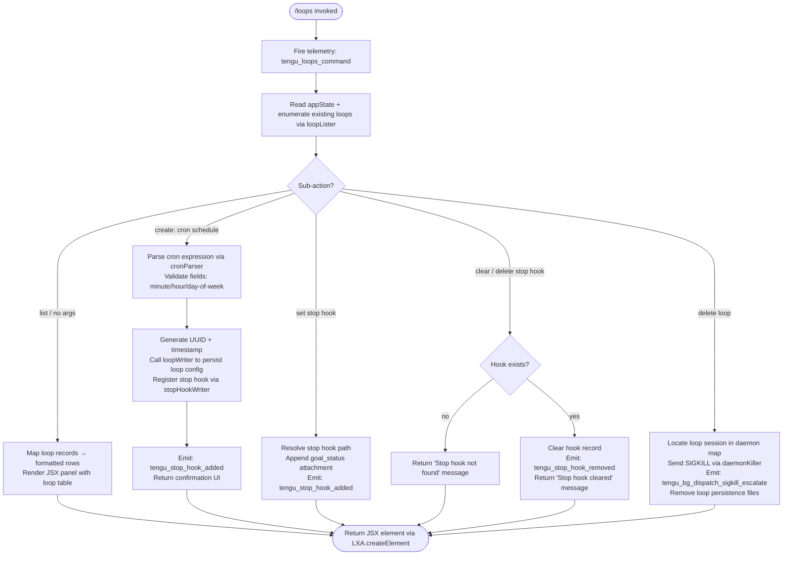

# `/loops`

> Analysis basis: CC v2.1.178 bundle.js (AST extraction + Claude interpretation)
> Minimum version: v2.1.178

---

## Overview

The `/loops` command provides a terminal UI surface for listing, creating, and deleting **background loop sessions** (scheduled or recurring autonomous Claude Code agents). It is implemented as an immediate `local-jsx` command that renders a React-based interactive panel, giving users management access to the daemon-backed loop subsystem from within the CLI.

---

## Registration

| Field | Value |
|---|---|
| type | `local-jsx` |
| name | `loops` |
| description | `List, create, and delete loops` |
| loc_byte | `12886260` |
| loc_byte_end | `12886417` |
| loc_line | `8882` |
| immediate | `true` |
| module_id | `AXK` |
| load_inline | `true` |
| arbor_handler.name | `AA5` |
| arbor_handler.fqn | `claude-2.1.178::AA5` |
| arbor_handler.kind | `AsyncFunction` |
| arbor_handler.resolution_path | `module_id` |
| arbor_handler.n_hits | `0` |

Analysis basis: CC v2.1.178 bundle.js:+12886260

---

## Input Branching

The handler `AA5` covers five major flow paths depending on the sub-action requested (list, create loop with cron schedule, set/clear stop hook, delete loop, and render the JSX panel). This warrants a flowchart.



---

## Behavioral Spec

### 1. Command Entry Point — `loopsCommandHandler` (`AA5`)

```
async function loopsCommandHandler(context):
    emit telemetry("tengu_loops_command")            // bundle.js:+12885217
    appState = context.getAppState()                 // bundle.js:+12885267
    rawLoops  = await loopLister(appState)           // bundle.js:+12885255
    loopRows  = rawLoops.map(formatLoopRow)          // bundle.js:+12885295

    subAction = parseSubAction(context.args)         // bundle.js:+12885346

    if subAction == "create":
        result = await createLoop(context, appState)
    else if subAction == "stophook":                 // literal "stophook" bundle.js:+12885399
        result = await manageStopHook(context, appState)
    else if subAction == "delete":
        result = await deleteLoop(context, appState) // bundle.js:+12885502
    else:
        result = buildLoopListUI(loopRows)

    return LXA.createElement(result)                 // bundle.js:+12886020
```

Analysis basis: CC v2.1.178 bundle.js:+12885215

---

### 2. Loop Enumeration — `loopLister` (`r9H`)

```
async function loopLister(appState):
    sessions = await readLoopSessions(appState)   // calls yCH, bundle.js:+12885255
    formatted = sessions.map(sessionFormatter)    // calls cE, bundle.js:+4903981
    return formatted
```

`readLoopSessions` (`yCH`) reads the loop state files with encoding `"utf-8"` (bundle.js:+4901984), then applies path utilities (`D3H` / `VX8.join`) to resolve loop directories within `.claude` (literal bundle.js:+4903125). It also normalises lines via `sk` (trim + split), which internally uses `Sz7` to parse schedule tokens (splitting on delimiters, matching integer fields with `parseInt`, collecting results into a Set via `K.add`; bundle.js:+4898042–4898103).

Analysis basis: CC v2.1.178 bundle.js:+4903945

---

### 3. Loop Row Formatting — `loopColumnFormatter` (`nf6`)

```
function loopColumnFormatter(loops):
    colWidths = computeColumnWidths(loops)   // VTH: K.set, bundle.js:+8939883
    rows = colWidths.map(padColumns)         // LNq: H.map, bundle.js:+8939652
    padEnd width = 40                        // literal bundle.js:+17093864
    separator = "  "                         // literal bundle.js:+17091893
    return rows
```

Column widths are calculated by mapping over loop entries and right-padding each column to a fixed maximum of 40 characters (bundle.js:+17093864).

Analysis basis: CC v2.1.178 bundle.js:+10665306

---

### 4. Cron Schedule Parsing — `cronParser` (`Dh`)

```
function cronParser(scheduleString):
    trimmed = scheduleString.trim()           // bundle.js:+4899728
    if trimmed matches "Every minute":        // literal bundle.js:+4899848
        return { minute: "*", ... }
    if trimmed matches "Every hour":          // literal bundle.js:+4900065
        return { hour: "*", ... }
    parts = trimmed.match(cronRegex)          // bundle.js:+4899869
    minute  = parseInt(parts[minute_field])   // bundle.js:+4899904
    // day-of-week range: literal "1-5" (Mon–Fri) bundle.js:+4900772
    dayOfWeek = date.getUTCDay()              // bundle.js:+4900605
    date.setUTCDate(...)                      // bundle.js:+4900624
    date.setUTCHours(0, 0, 0, 0)             // bundle.js:+4900655
    // also handles getDay() for local-time checks bundle.js:+4900684
    return parsedSchedule
```

The parser handles at least two human-readable aliases ("Every minute", "Every hour") and a range token `"1-5"` for weekday constraints (Monday–Friday). The `toString()` step (bundle.js:+4900102) converts the parsed result to a canonical cron string stored in loop configuration.

Analysis basis: CC v2.1.178 bundle.js:+4899728

---

### 5. Loop Creation — `loopWriter` (`hH6`)

```
async function loopWriter(context):
    uuid = crypto.randomUUID()                 // tN9.randomUUID, bundle.js:+4903284
    timestamp = Date.now()                     // bundle.js:+4903346
    loopRecord = buildLoopRecord(uuid, timestamp, context)  // ONH, bundle.js:+4903392
    await writeLoopSessions(loopRecord)        // yCH, bundle.js:+4903436
    sessionList.push(loopRecord)               // bundle.js:+4903449
    await confirmationWriter(context)          // R6, bundle.js:+4903481
    await schedulerSetup(loopRecord)           // zt, bundle.js:+4903530
    await persistLoopDir(loopRecord)           // NH6, bundle.js:+4903543
```

`persistLoopDir` (`NH6`) calls `ZX8.mkdir` (bundle.js:+4903104) and `VX8.join` (bundle.js:+4903114) to create a directory under `.claude` (bundle.js:+4903125), then writes configuration files via `ZX8.writeFile` (bundle.js:+4903201).

Analysis basis: CC v2.1.178 bundle.js:+4903284

---

### 6. Stop Hook Management — `stopHookSetter` (`rf6`) and `stopHookClearer` (`if6`)

```
// Set stop hook
async function stopHookSetter(context, appState):
    current = appState.getAppState()             // bundle.js:+10666110
    appState.setAppState({ ...current,
        stopHook: buildGoalRecord() })           // bundle.js:+10666239
    messageOp = buildAttachment("goal_status")   // literal bundle.js:+10666528
    appState.applyMessageOp(messageOp,
        opType="append")                         // literal bundle.js:+10666331
    uuid = hrq()                                 // Vrq.randomUUID, bundle.js:+10666459
    emit telemetry("tengu_stop_hook_added")      // bundle.js:+10665993
    notify(H6)                                   // bundle.js:+10666396

// Clear stop hook
async function stopHookClearer(context, appState):
    trustGate = checkGate("trust_gate")          // literal bundle.js:+10665557
    hooksGate = checkGate("hooks_gate")          // literal bundle.js:+10665503
    current = appState.getAppState()             // bundle.js:+10665692
    if not current.stopHook:
        return message("Stop hook not found")    // literal bundle.js:+12885659
    appState.setAppState({ ...current, stopHook: null })  // bundle.js:+10665894
    appState.applyMessageOp(...)                 // bundle.js:+10665936
    emit telemetry("tengu_stop_hook_removed")    // bundle.js:+10666365
    return message("Stop hook cleared")          // literal bundle.js:+12885681
```

After setting a stop hook the command emits the literal `"Stop hook set"` (bundle.js:+12885977) as confirmation. Clearing uses the literal `"skip"` flag (bundle.js:+12886126) to bypass further processing when no hook is present.

Analysis basis: CC v2.1.178 bundle.js:+10666099

---

### 7. Loop Deletion — `loopDeleter` (`i9H`) and Daemon Kill Path (`D` / `b`)

```
async function loopDeleter(loopId, appState):
    sessionMap = await readLoopSessions(appState)    // yCH, bundle.js:+4903664
    filtered   = sessionMap.filter(s => s.id != loopId)  // bundle.js:+4903673
    if not sessionSet.has(loopId):                   // A.has, bundle.js:+4903688
        return  // already gone
    await persistLoopDir(filtered)                   // NH6, bundle.js:+4903737

async function daemonSessionKiller(sessionId):
    entry = daemonMap.get(sessionId)                 // A.get, bundle.js:+17065929
    if entry.state == "closed":                      // literal bundle.js:+17065909
        return
    entry.kill("SIGKILL")                            // literal bundle.js:+17066095, bundle.js:+17066088
    emit telemetry("tengu_bg_dispatch_sigkill_escalate")
    freemem = IhA.freemem()                          // bundle.js:+17066478
    if freemem low: emit("tengu_bg_dispatch_low_mem")
    memCheck = Math.round(freemem / 1024 / 1024)     // bundle.js:+17066529
```

The kill path first checks that the session is not already `"closed"`, then sends `SIGKILL` (bundle.js:+17066095). Memory is checked via `IhA.freemem` and, if low, the `tengu_bg_dispatch_low_mem` event fires (bundle.js:+17066648).

Session lifecycle states observed in literals: `"closed"`, `"spare"`, `"exec"`, `"claimed"`, `"crashed"`, `"blocked"`, `"working"`, `"bg"`, `"daemon"`, `"idle"`, `"active"`, `"done"`, `"killed"`, `"failed"`, `"resuming"`.

Analysis basis: CC v2.1.178 bundle.js:+17065909

---

### 8. Scheduled Task Dispatch — `scheduledTaskRunner` (`c`)

This function, reached via the daemon background layer (`F` → `c`), handles firing and expiry of loop tasks:

```
function scheduledTaskRunner(task, context):
    if task.runPolicy == "never":                    // literal bundle.js:+16547767
        return
    if task.isLoopDefaultSentinel():                 // ek5.isLoopDefaultSentinel, bundle.js:+16547981
        label = task.label + " (recurring)"          // literal bundle.js:+16547869
    nextFireMs = Math.floor(nextScheduleMs / 60)     // literal 60, bundle.js:+16548122
    emit telemetry("tengu_scheduled_task_fire")      // bundle.js:+16547892
    if task expired:
        emit telemetry("tengu_scheduled_task_expired")  // bundle.js:+16548235
    if task missed:
        emit telemetry("tengu_scheduled_task_missed")   // bundle.js:+16547141
    scheduleQueue.push(task)                         // Q.push, bundle.js:+16548364
    if done: sessionDeleter(task)                    // i9H, bundle.js:+16548447
```

Analysis basis: CC v2.1.178 bundle.js:+16547522

---

### 9. Sub-action Argument Parsing — `subActionParser` (`_A5`)

```
function subActionParser(args):
    raw = args.match(scheduleRegex)             // bundle.js:+12884803
    minute  = parseInt(raw.minute)              // bundle.js:+12884840
    maxVal  = Math.max(minute, 0)               // bundle.js:+12884925
    ceiled  = Math.ceil(maxVal)                 // bundle.js:+12884936
    rounded = Math.round(ceiled)                // bundle.js:+12885009
    // Boundary constants (from literals):
    // 59 (max minute)  bundle.js:+12884982
    // 23 (max hour)    bundle.js:+12885053
    // 31 (max day)     bundle.js:+12885106
    parsed = cronParser(rounded)                // sk, bundle.js:+12885173
    return parsed
```

The parser enforces cron-field maxima: minutes ≤ 59 (bundle.js:+12884982), hours ≤ 23 (bundle.js:+12885053), day-of-month ≤ 31 (bundle.js:+12885106).

Analysis basis: CC v2.1.178 bundle.js:+12884803

---

### 10. Loop Session Persistence Writer — `loopPersistenceWriter` (`NH6`)

```
async function loopPersistenceWriter(sessions):
    basePath = pathJoin(VX8, ".claude")          // literals bundle.js:+4903125
    await mkdir(basePath, { recursive: true })   // ZX8.mkdir, bundle.js:+4903104
    filePath = pathJoin(basePath, loopFile)      // VX8.join,  bundle.js:+4903114
    content  = sessions.map(serialize)           // H.map,     bundle.js:+4903165
    await writeFile(filePath, content)           // ZX8.writeFile, bundle.js:+4903201
    configBlock = buildConfig(sessions)          // D3H, bundle.js:+4903215
    await writeConfig(configBlock)               // xH, bundle.js:+4903222
```

Analysis basis: CC v2.1.178 bundle.js:+4903093

---

## State & Side Effects

| Item | Detail |
|---|---|
| Telemetry: `tengu_loops_command` | Fired once on every invocation of `/loops` (bundle.js:+12885217) |
| Telemetry: `tengu_stop_hook_added` | Fired when a stop hook is successfully registered (bundle.js:+10665993) |
| Telemetry: `tengu_stop_hook_removed` | Fired when a stop hook is cleared (bundle.js:+10666365) |
| Telemetry: `tengu_scheduled_task_fire` | Fired when a loop's scheduled task triggers (bundle.js:+16547892) |
| Telemetry: `tengu_scheduled_task_missed` | Fired when a scheduled execution was missed (bundle.js:+16547141) |
| Telemetry: `tengu_scheduled_task_expired` | Fired when a loop task passes its expiry deadline (bundle.js:+16548235) |
| Telemetry: `tengu_bg_dispatch_sigkill_escalate` | Fired when a loop process is force-killed via SIGKILL (bundle.js:+17066047) |
| Telemetry: `tengu_bg_dispatch_low_mem` | Fired when background free memory is critically low at kill time (bundle.js:+17066648) |
| Telemetry: `tengu_bg_low_mem_mb` | Memory level telemetry emitted from macOS path (bundle.js:+13436992) |
| Telemetry: `tengu_daemon_config_reload` | Fired when daemon configuration is reloaded (bundle.js:+17081946) |
| Telemetry: `tengu_daemon_control` | Fired on daemon stop/control operations (bundle.js:+17104063) |
| Telemetry: `tengu_bg_spare_enable` | Fired when a spare background session slot is enabled (bundle.js:+17067352) |
| Telemetry: `tengu_bg_spare_claim` | Fired when a spare session is claimed (bundle.js:+17067480) |
| Telemetry: `tengu_bg_spare_claim_fail` | Fired when spare session claim fails (bundle.js:+17067746) |
| Telemetry: `tengu_bg_sendclaim_failed` | Fired when the socket claim handshake times out (bundle.js:+17042597) |
| Telemetry: `tengu_bg_state_read_transient` | Fired on transient daemon state read errors (bundle.js:+4274823) |
| Telemetry: `tengu_feature_ok` / `tengu_feature_bad` / `tengu_feature_sad` | Feature gate check results (bundle.js:+1020153, +1020220, +1020301) |
| Telemetry: `tengu_mcp_skills` | MCP skill enumeration event reached through loop context (bundle.js:+6670836) |
| Telemetry: `tengu_daemon_bg_session_create` | Emitted when a new background loop session is spawned (literal bundle.js:+17066363) |
| appState changes | `setAppState` called to store stop hook record and goal attachment; `applyMessageOp` appends `"goal_status"` attachment with op type `"append"` (bundle.js:+10666239, +10666308) |
| Filesystem side effects | Loop configuration written under `.claude/` directory via `mkdir` + `writeFile`; files removed via `XO.rm` / `XO.unlink` on deletion (bundle.js:+4903104, +17072357, +17073408) |
| Process signals | Deletion path sends `SIGKILL` to the loop daemon process (bundle.js:+17066095) |
| Daemon socket | Loop creation connects via Unix socket using `ls8.connect`; authentication uses `yc.claim` + `yc.buildClaimFrame`; claim timeout: 5000 ms (literal bundle.js:+17043031) |
| Reconnect / retry | On `ECONNREFUSED` the daemon waits 500 ms (literal bundle.js:+17043235) before retry |
| Session idle timeout | Idle sessions may be removed after 300,000 ms (5 minutes; literal bundle.js:+17073980) |
| Sound | <!-- TODO: not found in depth-2 traversal; needs --depth 4 --> |
| Hook registration | Stop hooks stored as `"goal"` type records (literal bundle.js:+10666399) with UUID generated by `Vrq.randomUUID` |

---

## Version History

| Version | Change |
|---|---|
| v2.1.178 | Initial analysis |

---

## Common Mistakes

1. **Providing an invalid cron expression**: The sub-action parser (`_A5`) enforces hard limits — minutes must be ≤ 59, hours ≤ 23, day-of-month ≤ 31. Values outside these ranges are clamped or rejected before the loop is persisted.
2. **Attempting to delete a loop that has already terminated**: The deleter (`i9H`) checks session membership before acting. If the session UUID is not present in the active set, the deletion is a no-op and no SIGKILL is sent.
3. **Expecting the stop hook to survive a `/loops` clear**: Issuing a clear sub-action unconditionally removes the stop hook entry from appState. If the hook did not exist, the literal message `"Stop hook not found"` is returned rather than an error — this is informational, not fatal.
4. **Confusing `"Every minute"` and `"Every hour"` aliases**: These two human-readable schedule strings are special-cased in the parser and bypass numeric field validation. Using slight variations in capitalisation or spelling will fall through to the regex parser and may fail.
5. **Assuming immediate session availability after creation**: Loop sessions are registered and written to disk, but the daemon claim handshake (socket auth + `yc.claim`) has a 5,000 ms timeout. If the daemon is not running the session will not become `"active"` until the daemon starts.
6. **Running `/loops` in a context with the `"trust_gate"` or `"hooks_gate"` feature flag disabled**: The stop-hook clear path checks both gates before proceeding; if either is disabled the operation may be silently skipped.

---

## Appendix — Identifier Mapping

> For bundle debugging only. Identifiers change across versions.

| Identifier | Role |
|---|---|
| `AA5` | Main handler for `/loops` command (loopsCommandHandler) |
| `r9H` | Loop lister — enumerates existing loop sessions |
| `yCH` | Loop session file reader — reads and parses session state files |
| `n6` | Path utility used during session file resolution |
| `D3H` | Config block builder — assembles loop configuration structure |
| `$4` | Utility called by config builder (wraps `TT`) |
| `O1` | Error-code wrapper (wraps `Z8`) |
| `Z8` | Error normaliser / classifier |
| `RH` | Scheduler or state-watcher for loop process stdio |
| `jA` | Error formatter (wraps Error + String) |
| `L6` | String conversion utility |
| `qq` | Traffic-classification helper (essential-traffic literal) |
| `RQ4` | Queue shift/push manager for scheduled items |
| `N` | API-call / network-send helper |
| `AM4` | Sub-helper of N; calls `my`, `D__`, `WSA` |
| `H` | Namespace / global context object |
| `xH` | JSON serialise helper (wraps `JSON.stringify`) |
| `d4` | Content-redaction utility (emits `[REDACTED]` literal) |
| `VdH` | Wraps `FCA` — likely a validation or filter helper |
| `LM4` | File-read-and-chunk pipeline (reads, splits, buffers, sends) |
| `sk` | Line tokeniser — trims and splits schedule strings |
| `Sz7` | Cron token parser (split, match, parseInt, Set.add) |
| `A` | Array-like accumulator used throughout call graph |
| `f` | Promise/stream helper with add/finally/delete lifecycle |
| `q` | Queue or Set used for pending operations |
| `L` | Stream or resource with close/finally lifecycle |
| `cE` | Loop session formatter / display renderer |
| `TT` | Low-level terminal or React rendering primitive |
| `nf6` | Loop column formatter — computes and pads table columns |
| `VTH` | Column-width calculator (K.set) |
| `K` | Map used for column-width state |
| `LNq` | Row mapper for formatted loop table |
| `R6` | Confirmation/result renderer (wraps `TT`) |
| `Dh` | Cron schedule parser (cronParser) |
| `D` | Daemon session manager — tracks lifecycle and signals |
| `b` | Background session runner — orchestrates daemon child |
| `Y` | Supervisor sub-process controller |
| `zt` | Scheduler setup helper (wraps `cLH`) |
| `NH6` | Loop persistence writer — mkdir + writeFile |
| `Ah9` | Session-filter helper (filter + `vH6`) |
| `P` | PTY buffer handler with concat/indexOf/subarray |
| `z` | Daemon state emitter (stopped/background session states) |
| `S` | Session stdio pipe manager |
| `X` | Socket/timeout wrapper |
| `l` | Event-emitter or readable stream for daemon events |
| `MtK` | Loop display table builder (calls `Dh`, `Math.max`, `q.join`) |
| `i9H` | Loop deleter — filters sessions and removes persisted files |
| `o8` | Async timeout helper with abort/clearTimeout |
| `O` | Helper wrapping `C8` for daemon state |
| `bH` | Feature-flag helper: emits `tengu_feature_bad` |
| `dH` | Feature gate check helper (calls `c36`) |
| `SH` | Feature-flag helper: emits `tengu_feature_ok` |
| `ul8` | Low-memory check utility (macOS path) |
| `O6` | Platform-specific memory / gate check |
| `dRH` | File-state reader (lstat, readFile, filter, rm) |
| `aE6` | Path joiner for daemon state files |
| `i6` | JSON.parse wrapper |
| `x8` | Error-state wrapper (wraps `Z8`) |
| `yf7` | Directory walker (readdir, lstat, filter, push) |
| `F` | Daemon PTY connection manager (connect/close/reconnect) |
| `c` | Scheduled task runner / loop dispatcher |
| `C` | Write-after-clearTimeout helper for daemon output |
| `B` | Set tracking active daemon connections |
| `MV` | Notification helper (wraps `NqK`) |
| `u` | Utility used alongside `Fv` in frame encoding |
| `Fv` | Binary frame encoder (Buffer.from/allocUnsafe/writeUInt32BE) |
| `sB8` | Binary frame decoder (Buffer.alloc/concat/readUInt32BE) |
| `ZhA` | Daemon socket claim orchestrator |
| `SGA` | Session directory and config file writer |
| `$b5` | Claim timeout / retry logic (5000 ms timeout, 500 ms retry) |
| `Mb5` | Claim frame builder (yc.buildClaimFrame) |
| `hL` | Error-value wrapper (wraps `Z8`) |
| `TH` | String coercion helper |
| `khA` | Daemon session lifecycle manager (full create/retire/delete) |
| `w4` | Path builder for daemon session directories |
| `Mq` | Session state file reader with cache (lstat/readFile/Ce cache) |
| `HO` | Session status resolver (wraps `rT` → "active") |
| `f2H` | Permission / ignore-list classifier for file paths |
| `SL` | Path resolver using `yO` + path.join |
| `HL6` | Session latency / timing recorder |
| `XU6` | Path builder using `g$.join` + `jU6` |
| `hzH` | Path builder for hash/id files |
| `lI` | Session roster entry writer |
| `lv` | Notification helper variant (wraps `NqK`) |
| `JU6` | Session directory initialiser (g$.join + jU6) |
| `w` | Forced-shutdown handler (process.exit + z.abort) |
| `bX` | Shutdown message emitter |
| `j` | Session kill helper (A.values + S.kill) |
| `$` | Wrapper holding `xGK` for session context |
| `xGK` | Session context builder (zt, Date.now, f9, XF6) |
| `f9` | Async-local-storage store getter |
| `XF6` | Daemon status file path builder |
| `J` | Date wrapper for UTC schedule calculations |
| `rf6` | Stop-hook setter (goal record + applyMessageOp + emit) |
| `hrq` | UUID generator wrapper (Vrq.randomUUID) |
| `H6` | Notification dispatcher (wraps `c36`) |
| `c36` | Core notification primitive |
| `_A5` | Sub-action / schedule argument parser |
| `hH6` | Loop creator (randomUUID, Date.now, ONH, yCH, NH6) |
| `ONH` | Loop record builder |
| `M` | MCP server state manager |
| `ebH` | MCP connection executor |
| `UQ` | MCP tool call dispatcher |
| `BZ` | MCP response packager |
| `i8` | Utility wrapping `_` |
| `ch6` | MCP channel helper |
| `Te9` | MCP tool result processor |
| `o28` | MCP result wrapper (r28 + NP) |
| `n28` | MCP notification wrapper (tK) |
| `Y8` | MCP debug logger (ElH.push + Us.logMCPDebug) |
| `I08` | MCP tool invocation handler (OAuth-aware) |
| `S08` | MCP OAuth callback handler |
| `Ie9` | MCP tool-result resolver |
| `pc_` | MCP error packager (NP + tK + Y8 + TH) |
| `Nh` | MCP skill-set enumerator (calls O6) |
| `Ec_` | MCP include-list checker |
| `k` | Backoff/retry timer with Math.min |
| `$7` | MCP error logger (ElH.push + Us.logMCPError) |
| `Ne9` | MCP pending-call tracker |
| `z_6` | MCP integer parser variant |
| `IG8` | MCP integer parser variant 2 |
| `hs8` | MCP update applier (applyMcpUpdate) |
| `tbH` | MCP table builder (z0H) |
| `RG` | MCP cleanup runner ($\_6 + K.cleanup + Nh) |
| `INA` | MCP server sync — filters, connects, applies results |
| `j08` | MCP allow-list checker (GI7 + Ic\_) |
| `$_6` | MCP state-change emitter (z0H) |
| `if6` | Stop-hook clearer (trust\_gate + hooks\_gate checks + applyMessageOp) |
| `y5A` | Policy settings loader |
| `zx` | Policy settings reader (wraps b8) |
| `b8` | Settings store reader (K68 + pb) |
| `x1H` | Settings store reader variant (b8 + rA) |
| `R_` | Policy flag resolver |
| `tL` | Trust-gate evaluator (wraps Mnf) |
| `Mnf` | Trust resolution pipeline (L6, iQH, v9, S6, S1H, nl, u6) |
| `d6` | Feature-sad emitter (wraps d + dH) |
| `WD` | Output-token budget helper (xQH + Object.values) |

---

Note: index built via Arbor fallback; some signals (telemetry, literals) may be missing — see arbor-fallback.js.