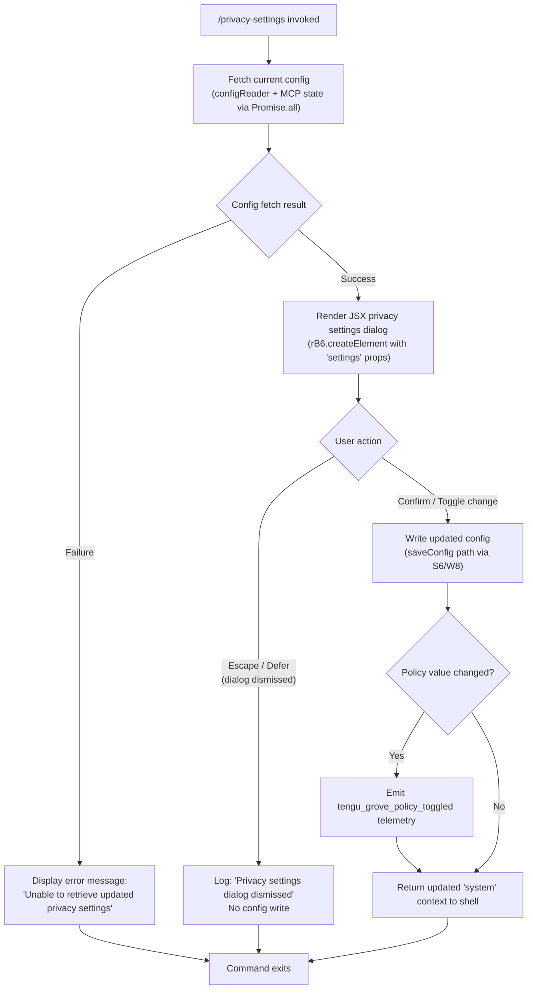

# `/privacy-settings`

> Analysis basis: CC v2.1.178 bundle.js (AST extraction + Claude interpretation)
> Minimum version: v2.1.178

---

## Overview

The `/privacy-settings` command opens an interactive JSX dialog that allows users to view and update their privacy-related configuration settings within Claude Code. It reads the current privacy policy state from the configuration system, renders a settings UI component, and persists any changes the user makes — emitting a telemetry event when a policy toggle occurs. The dialog can be dismissed via an escape/defer action without writing changes.

---

## Registration

| Field | Value |
|---|---|
| type | `local-jsx` |
| name | `privacy-settings` |
| description | `View and update your privacy settings` |
| module_id | `EJK` |
| load_inline | `true` |
| loc_byte | `12845465` |
| loc_byte_end | `12845657` |
| loc_line | `8794` |
| arbor_handler.name | `B_5` |
| arbor_handler.fqn | `claude-2.1.178::B_5` |
| arbor_handler.kind | `AsyncFunction` |
| arbor_handler.resolution_path | `module_id` |
| arbor_handler.n_hits | `0` |

Analysis basis: CC v2.1.178 bundle.js:+12845465

---

## Input Branching

The command has 3+ distinct execution paths based on: (1) whether the initial config fetch succeeds or fails, (2) whether the user dismisses the dialog (escape/defer) versus confirms a change, and (3) whether a privacy policy toggle actually occurred (triggering telemetry) versus a no-op close.



---

## Behavioral Spec

### Handler Entry Point — privacySettingsHandler (B_5)

The Arbor-resolved handler is the async function `B_5` (`claude-2.1.178::B_5`), reached via module `EJK` with `resolution_path: module_id`.

```
async function privacySettingsHandler(context):
    // Phase 1: Parallel data fetch
    [configSnapshot, mcpState] = await Promise.all([
        fetchCurrentConfig(),       // hHH
        fetchMcpConnectionState()   // fGH
    ])

    // Phase 2: Dialog rendering
    dialogResult = await renderJsxDialog(
        rB6.createElement("settings", {
            config: configSnapshot,
            mcpState: mcpState
        })
    )

    // Phase 3: Dismissal path
    if dialogResult.action in ["escape", "defer"]:
        log("Privacy settings dialog dismissed")
        return null   // no side effects

    // Phase 4: Persist changes
    await writeConfigWithPolicy(dialogResult.updatedConfig)  // via S6/W8

    // Phase 5: Conditional telemetry
    if policyValueChanged(configSnapshot, dialogResult.updatedConfig):
        emitTelemetry("tengu_grove_policy_toggled")

    return { role: "system", content: dialogResult.summary }
```

Analysis basis: CC v2.1.178 bundle.js:+12844456 (handler entry), +12844496 (Promise.all), +12844509 (hHH fetch), +12844515 (fGH fetch), +12844620 (escape literal), +12844634 (defer literal), +12844645 (dismissed log), +12844690 (system role), +12844999 (d — config diffing), +12845062 (H6 — settings prop), +12845112 (rB6.createElement)

---

### Config Read Pipeline — configCacheReader (JA6)

`JA6` is the config-reading orchestrator invoked by the handler. It implements a three-tier cache strategy, logging cache state decisions:

```
async function configCacheReader():
    if noCache:
        log("Grove: No cache, fetching config in background (dialog skipped this session)")
        // background fetch; return default
    elif cacheStale:
        log("Grove: Cache stale, returning cached data and refreshing in background")
        // return stale, trigger background refresh
    else:
        log("Grove: Using fresh cached config")
        return cachedConfig

    // Background config path via S6 (config file writer/reader)
    // Timestamped via Date.now()
    // Async notification via N (notify subsystem)
    return bestAvailableConfig
```

Analysis basis: CC v2.1.178 bundle.js:+7184037 (o5H call), +7184058 (Z4 call), +7184097 (S6 call), +7184126 (Date.now), +7184150 (N notify), +7184152 (no-cache log literal), +7184272 (stale log literal), +7184378 (fresh log literal), +7184232 (e1q subflow), +7184468 (fGH subflow in e1q)

---

### Config File Writer — configFileSaver (S6)

`S6` is the file-persistence function responsible for durably writing config to disk. It orchestrates locking, backup rotation, and error-safe writes:

```
function configFileSaver(configData, options):
    acquireLock()              // n6
    validateKeyMaterial()     // kT
    buildOutputPayload()      // $k_

    backupCurrentFile()       // _MH — reads via q.readFileSync, rotates with
                               //   q.copyFileSync, respects ENOENT/EEXIST errors,
                               //   max 5 backup copies (literal: 5)
                               //   backup files tagged ".backup." prefix

    timestampWrite = Date.now()
    watchForChanges()         // wnf — uses $O8.watchFile / $O8.unwatchFile

    writeAtomically(configData)
    releaseLock()
```

Config access guard: if config is accessed before initialization is complete, throws with message `"Config accessed before allowed."` (bundle.js:+3350856).

Auth-loss protection (GH #3117): if a re-read of the config file is missing authentication data that the in-memory cache holds, the write is refused with log message beginning `"saveConfigWithLock: re-read config is missing auth..."` (bundle.js:+3349239). A separate guard for the global config path emits a similar refusal (bundle.js:+3345800, literal `"save_global"`).

File encoding: `"utf-8"` (bundle.js:+3350939). File errors handled: `ENOENT` (bundle.js:+3351086), `EEXIST` (bundle.js:+3351701), `EISDIR` (bundle.js:+182019).

Analysis basis: CC v2.1.178 bundle.js:+3347543 (n6), +3347557 (kT), +3347576 ($k\_), +3347580 (_MH), +3347633 (Date.now), +3347686 (wnf)

---

### Lock Contention & Write Safety — saveWithLock (wO8)

`wO8` is the lower-level locked-write function called when persisting config changes. It manages directory creation, file stat checks, and backup rotation:

```
async function saveWithLock(filePath, payload):
    ensure directory exists (f.mkdirSync, pD.dirname)
    timestamp = Date.now()

    if lock acquisition takes too long:
        log("Lock acquisition took longer than expected - another Claude instance may be running")
        emitTelemetry("tengu_config_lock_contention")

    stat = f.statSync(filePath)

    // Safety: refuse write if auth would be lost
    if reReadMissingAuth:
        emitTelemetry("tengu_config_auth_loss_prevented")
        return  // abort write

    // Backup rotation: up to 5 copies (literal: 5), named with ".backup." infix
    // Each backup prefixed with timestamp split on "." separator
    rotate backups using f.readdirStringSync, pD.basename, pD.join
    max age: 60000 ms (bundle.js:+3349593)
    max backup count: 5 (bundle.js:+3349842)
    file copy: f.copyFileSync; old removal: f.unlinkSync
    max file size before rotation: 384 bytes threshold (bundle.js:+3350124)

    write payload
    emitTelemetry("tengu_config_stale_write")  // if stale condition detected
    emitTelemetry("tengu_config_fallback_write")  // on fallback path
```

Analysis basis: CC v2.1.178 bundle.js:+3345593 (W8→wO8), +3348612 through +3350162 (wO8 body), +3348823 (lock log literal), +3349239 (auth-loss log literal), +3349593 (60000 ms), +3349842 (5 backup limit), +3350124 (384 byte threshold)

---

### Async Notification — notifySubsystem (N)

`N` is the notification/logging subsystem invoked by the config reader to propagate config-change signals. It uses `xNH` and `AM4` for subscriber dispatch, checks inclusion via `H.includes`, and formats output via `d4` (which redacts sensitive values with the string `"[REDACTED]"` at bundle.js:+204042). Log level in use: `"debug"` (bundle.js:+212689).

```
function notifySubsystem(event, payload):
    subscribers = AM4.getSubscribers()  // via my, D__, WSA
    if H.includes(event):
        formatted = formatPayload(payload)   // d4: redacts API keys, trims, uppercases
        writeOutput(formatted)               // VdH → FCA → H.write
        schedulePersist(formatted)           // LM4 → sQH (debounced, setTimeout/setImmediate)
        registerHook()                       // F9 → XSA.register
```

Analysis basis: CC v2.1.178 bundle.js:+212713 (xNH), +212731 (AM4), +212753 (H.includes), +212771 (xH/JSON.stringify), +212815 (_.toUpperCase), +212835 (d4), +212838 (H.trim), +212854 (py), +212860 (VdH), +212874 (LM4)

---

### MCP Connection State — mcpConnectionManager (M / ebH / INA)

`B_5` fetches MCP connection state in parallel with the config snapshot. `M` delegates to `ebH` (MCP hub orchestrator) and `INA` (MCP state aggregator):

```
async function fetchMcpConnectionState():
    allEntries = Object.entries(mcpServerMap)   // ebH
    for each [serverId, serverConfig] in allEntries:
        connectionResult = connectOrReuse(serverId, serverConfig)  // UQ → Rr
        // Rr handles: mcpAutoDiscovered, enterprise, mcp, user, project scopes
        // Transport types matched: stdio, sse, sse-ide, ws-ide, claudeai-proxy
        // Auth states: approved, pending, needs-auth, connected, failed
        // Skips: "Skipping connection (cached needs-auth)" (bundle.js:+6794469)
        // Skips: "Skipping connection (recent failure cached; retries automatically in 15 min...)" (bundle.js:+6794731)

    aggregated = INA.aggregateState(allEntries)
    return aggregated
```

MCP server status categories observed in literals: `unknown`, `local`, `migrated`, `native`, `installed`, `disabled`, `enabled`, `no_permissions`, `not_configured`, `global` (bundle.js:+3346252 through +3346458).

Analysis basis: CC v2.1.178 bundle.js:+16718878 (M→ebH), +16718888 (M→hs8), +16718897 (M→f.get), +16718937 (M→N), +16719015 (M→INA), +6793676 (ebH→Object.entries), +6793701 (ebH→UQ), +6794456 (ebH transport filter)

---

### Policy Toggle Detection

After the dialog confirms a change, the handler (`B_5`) calls the config-diff utility (`d` — identified as the diff/comparison helper) to determine whether the Grove policy value actually changed:

```
function detectPolicyToggle(before, after):
    if before.privacyPolicy !== after.privacyPolicy:
        return true
    return false
```

If `true`, `tengu_grove_policy_toggled` is emitted. The result message uses role `"system"` (bundle.js:+12844690) with content derived from the settings component output (`H6` → `c36` at bundle.js:+12845062, literal `"settings"` at bundle.js:+12845065).

Analysis basis: CC v2.1.178 bundle.js:+12844999 (d — diff call), +12845001 (tengu_grove_policy_toggled), +12845062 (H6), +12845065 (settings literal), +12845112 (rB6.createElement)

---

## State & Side Effects

| Item | Detail |
|---|---|
| Telemetry: tengu_grove_policy_toggled | Fired when a privacy policy toggle is confirmed by the user (bundle.js:+12845001) |
| Telemetry: tengu_config_lock_contention | Fired when config file lock takes longer than expected (bundle.js:+3348912) |
| Telemetry: tengu_config_stale_write | Fired when a stale-cache write is detected (bundle.js:+3349048) |
| Telemetry: tengu_config_auth_loss_prevented | Fired when a write is aborted to prevent auth credential loss (bundle.js:+3349391) |
| Telemetry: tengu_config_fallback_write | Fired on the fallback write path (bundle.js:+3348528) |
| Telemetry: tengu_config_parse_error | Fired when the config file cannot be parsed (bundle.js:+3351487) |
| Telemetry: tengu_mcp_oauth_flow_start | Fired when an MCP OAuth flow begins (bundle.js:+6563766) |
| Telemetry: tengu_mcp_oauth_flow_success | Fired on successful MCP OAuth completion (bundle.js:+6568744) |
| Telemetry: tengu_mcp_oauth_flow_error | Fired on MCP OAuth failure (bundle.js:+6570455) |
| Telemetry: tengu_daemon_config_reload | Fired when the daemon reloads config (bundle.js:+17081946) |
| Telemetry: tengu_mcp_skills | Fired when MCP skill set is computed (bundle.js:+6670836) |
| Telemetry: tengu_bg_retire_pinned_low_mem | Fired when background workers are retired due to low memory (bundle.js:+17070758) |
| Telemetry: tengu_bg_prewarm_per_sweep | Fired on each background prewarm sweep (bundle.js:+17070879) |
| Config file write | Writes updated privacy settings to `~/.claude.json` via locked atomic write; backs up up to 5 prior copies with `.backup.` infix |
| Auth-loss guard | Refuses write if re-read config is missing auth present in cache (GH #3117 reference in bundle) |
| Hook registration | `F9` → `XSA.register` — registers a change notification hook on config write (bundle.js:+66308) |
| File watcher | `wnf` activates `$O8.watchFile` / `$O8.unwatchFile` around writes (bundle.js:+3347041, +3347379) |
| appState changes | Privacy policy field updated in global config snapshot; MCP connection state refreshed via `INA` aggregator |
| JSX render | `rB6.createElement` renders the settings dialog component inline (bundle.js:+12845112) |
| Sound | <!-- TODO: not found in depth-2 traversal; needs --depth 4 --> |

---

## Version History

| Version | Change |
|---|---|
| v2.1.178 | Initial analysis |

---

## Common Mistakes

1. **Invoking the command while another Claude instance holds the config lock** — the lock-contention warning (`"Lock acquisition took longer than expected - another Claude instance may be running"`) will appear and the telemetry event `tengu_config_lock_contention` will fire; the write will eventually proceed or time out.
2. **Expecting an immediate write on escape/defer** — dismissing the dialog via Escape or the defer action produces no config write. The log message `"Privacy settings dialog dismissed"` confirms the no-op path; no settings are changed.
3. **Misinterpreting `tengu_grove_policy_toggled` as always firing** — this event fires only when the policy value actually changed. Confirming the dialog without toggling any setting does not emit it.
4. **Assuming MCP state is pre-cached** — the command fetches MCP connection state in parallel with the config snapshot at invocation time; servers in `needs-auth` or recent-failure states are skipped silently (with internal log lines, not user-visible errors).
5. **Editing `~/.claude.json` while `/privacy-settings` is open** — the auth-loss guard (GH #3117) may refuse the write if the file changed between the initial read and the attempted save, emitting `tengu_config_auth_loss_prevented` and logging a refusal message.

---

## Appendix — Identifier Mapping

> For bundle debugging only. Identifiers change across versions.

| Identifier | Role |
|---|---|
| `B_5` | Main async handler for `/privacy-settings` (Arbor-resolved, AsyncFunction) |
| `JA6` | Config cache reader / Grove cache orchestrator |
| `o5H` | Config tier selector (max/pro plan branching) |
| `Yq` | Config value extractor (calls ZJ\_, EJ\_, Hw, Y9) |
| `ZJ_` | Config field accessor — branch A |
| `EJ_` | Config field accessor — branch B |
| `Hw` | Config property reader (reads ANTHROPIC\_API\_KEY, apiKeyHelper, and related fields) |
| `ZA` | Config array validator (uses Array.isArray, H.includes) |
| `cb` | Array membership checker |
| `p79` | Config post-processor |
| `Z4` | Config read path — secondary branch (calls Hw, S6) |
| `S6` | Config file writer / lock+backup orchestrator |
| `n6` | Lock acquisition utility |
| `$k_` | Config payload builder |
| `_MH` | Config file backup rotator (readFileSync, copyFileSync, ENOENT/EEXIST handling) |
| `wnf` | File watcher registration/deregistration around config writes |
| `N` | Notification/logging subsystem dispatcher |
| `AM4` | Subscriber manager (calls my, D\_, WSA) |
| `WSA` | Subscriber list accessor (calls f74, L74) |
| `H` | Utility/state container with Math.random + setTimeout (context-dependent) |
| `xH` | JSON stringifier wrapper |
| `_` | Generic utility / string/path helper |
| `d4` | Payload formatter with redaction (emits "[REDACTED]" for sensitive values) |
| `sCA` | Format mapper (maps t54 entries) |
| `q` | File-system abstraction (readFileSync, statSync, etc.) / queue context |
| `A` | String utility (toLowerCase, lastIndexOf, slice) / array context |
| `VdH` | Output writer coordinator |
| `FCA` | Raw output writer (H.write) |
| `LM4` | Debounced log persistence scheduler |
| `sQH` | Debounce core (clearTimeout, setTimeout, setImmediate) |
| `G7H` | Log directory path builder (NdH, W7H.join, M\_, R6) |
| `INH` | Log entry formatter (calls Z8) |
| `_bA` | Log file path builder (W7H.join, R6) |
| `P__` | Log file rotator/renamer (WS.stat, WS.rename, WS.unlink, .txt suffix) |
| `fM4` | Log append worker (WS.mkdir, WS.appendFile, INH, \_bA, P\_\_, G\_\_) |
| `F9` | Hook registration trigger (XSA.register) |
| `e1q` | Cache-miss async config fetcher sub-flow |
| `W8` | Config save-global orchestrator (calls wO8, kT, H, gXH, PL9, CG6, N, \_MH, JsH, d, YO8) |
| `wO8` | Locked config write implementation (atomic write + backup rotation) |
| `gXH` | Config write pre-validator |
| `PL9` | Config entry serializer (Object.entries) |
| `CG6` | Write timestamp recorder (Date.now) |
| `JsH` | Config write journal helper |
| `d` | Config diff / comparison utility |
| `YO8` | Config write post-processor (CG6, kT, n6, pD.dirname, oX, xH, ED6, N, d, dH) |
| `M` | MCP state manager (delegates to ebH, hs8, INA) |
| `ebH` | MCP hub connection orchestrator |
| `UQ` | MCP single-server connector (C86, Rr, M0H, YU, $08, I86, oX, Object.assign) |
| `C86` | MCP connection type dispatcher (Eh, LLH) |
| `Rr` | MCP server resolver / capability merger |
| `YU` | MCP tool list builder (Object.entries, jHH, A.push) |
| `$08` | MCP error formatter (Tc\_, J6.red, J6.yellow) |
| `I86` | MCP tool deduplication registry (n28, Object.entries, BZ, o28, vg9, JqH) |
| `BZ` | MCP base connection handler (PY, Zc\_) |
| `PY` | Config-backed MCP state reader (S1H, S6, zq) |
| `Zc_` | MCP connection cleanup |
| `K` | Render/display row builder (f.map, L.padEnd) |
| `f` | Async task queue (q.add, L.finally, q.delete) |
| `L` | Stream/channel manager (A.close, q.close, f) |
| `i8` | Generic utility (context: iterator/item helper) |
| `ch6` | MCP server filter |
| `Te9` | MCP capability hash/fingerprint builder (Pn\_, z0H, r28, Date.now) |
| `Pn_` | MCP capability pre-processor (f9, kG8, i6) |
| `z0H` | MCP tool hash generator (xH, Array.isArray, Object.keys, or9.createHash sha256) |
| `r28` | MCP tool schema canonicalizer ($qH, Object.keys, mWH) |
| `o28` | MCP tool schema comparator (r28, NP) |
| `NP` | Content hash helper (xH, Vg9.createHash) |
| `n28` | MCP tool name normalizer (tK) |
| `tK` | Tool key formatter (KC1) |
| `Y8` | MCP debug log emitter (ElH.push, Us.logMCPDebug) |
| `I08` | MCP server connection lifecycle manager (iI7, \_n, cI7, LqH, MqH, PqH, U86, R08, ur, um, Y, $7, TH, Promise.race, rI7, nI7, UZ, Y8) |
| `iI7` | MCP server initialization step |
| `_n` | Generic async utility (um, A4) |
| `LqH` | MCP connection log handler (bF9, JZ7) |
| `MqH` | MCP message queue handler |
| `PqH` | MCP OAuth/HTTP connection handler (full OAuth PKCE flow, local callback server) |
| `U86` | MCP pending-connection registry (E08.set/get/delete) |
| `w` | Process exit / abort wrapper (bX, process.exit, z.abort) |
| `R08` | MCP reconnect entry (f9, kG8) |
| `ur` | MCP reconnect orchestrator (Nn, RG, rR, Y8, $\_6, d6, Ie9, pc\_, Promise.all, hh, gr, Nh, NG8, dx, Ec\_, m4, SH, bH, $7, TH) |
| `um` | Async utility (A4) |
| `Y` | Terminal output writer / supervisor (hVH, q.write, $ZK, L.get/delete/set, T.stop, E.stop/updateConfig/start, R14, V.start, d) |
| `$7` | MCP error log emitter (ElH.push, Us.logMCPError) |
| `TH` | String coercion helper (String) |
| `rI7` | MCP connection race timeout |
| `nI7` | SSH/remote connection detector (nH.isSSH, L6, Jq) |
| `S08` | MCP OAuth complete-authentication tool handler (\_n, lI7, p86, B86, f, TH) |
| `p86` | MCP pending-auth token reader (T08.get) |
| `B86` | MCP active-connection reader (E08.get) |
| `Ie9` | MCP needs-auth cache checker (vG8.then, Pn\_, f9, kG8, xH) |
| `f9` | Async-local-storage store reader (P2f.getStore) |
| `kG8` | MCP server path builder (yG8.join, M\_) |
| `pc_` | MCP auth-check / token validator (NP, tK, Y8, TH) |
| `j` | Process signal handler list (A.values, S.kill) |
| `S` | Worker/child-process manager (x14, D5, N, RH, Ub5, Y.write) |
| `Nh` | MCP skill set reporter (O6) |
| `O6` | MCP server skill enumerator (vG6, NG6, Xp, uXH.has, o$8, ZG6.add, xg.has/get, S6) |
| `Ec_` | MCP active-connection filter (W8, A.includes) |
| `k` | Background worker sweep scheduler (Xi, Date.now, Math.min, I, y, QoK) |
| `Xi` | Worker pool state reader |
| `I` | Background worker lifecycle manager (Date.now, k.values, c.shiftGraceClocksForward, R, oF6, uVK, dRH, RH, B.has, c.respawnIfIdleStale, Promise.all, c.retireIfSettled, i8, H, d, l.retireIfSettled, ml8, O6, n.respawnIfIdleStale) |
| `y` | Worker state accessor |
| `QoK` | Away-summary generator (H.at, "away\_summary") |
| `Ne9` | MCP integer parser wrapper (zQ) |
| `zQ` | Safe-integer / stream mapper (TypeError, Number.isSafeInteger, W, f, P, L, K.addEventListener, J.next, AggregateError, G, M.entries, O.get/set, y.push, \_, T, $.push) |
| `z_6` | MCP integer parser A (parseInt, radix 10) |
| `IG8` | MCP integer parser B (parseInt, radix 20) |
| `hs8` | MCP apply-update handler (H.applyMcpUpdate, tbH, Y8, A.cleanup, RG, ew) |
| `tbH` | MCP update hash validator (z0H) |
| `RG` | MCP cleanup + skill-report orchestrator ($\_6, K.cleanup, Nh) |
| `$_6` | MCP tool hash refresher (z0H) |
| `$` | Daemon status writer (xGK) |
| `xGK` | Daemon status file writer (zt, Date.now, f9, XF6, xH) |
| `zt` | Config path resolver (cLH) |
| `XF6` | Daemon status file path builder (bGK.join, M\_) |
| `INA` | MCP state aggregator (Object.entries, A.filter, \_.getClients, j08, q, o8, N, $\_6, ebH, hs8, Object.fromEntries, K.map) |
| `j08` | MCP server filter — checks GI7 and Ic\_ sets |
| `o8` | Async retry/timeout wrapper (K, Error, q, setTimeout, O, clearTimeout, f.unref) |
| `O` | Background session container (C8) |
| `H6` | Settings result builder (c36) |
| `c36` | Settings result formatter |

---

Note: index built via Arbor fallback; some signals (telemetry, literals) may be missing — see arbor-fallback.js.