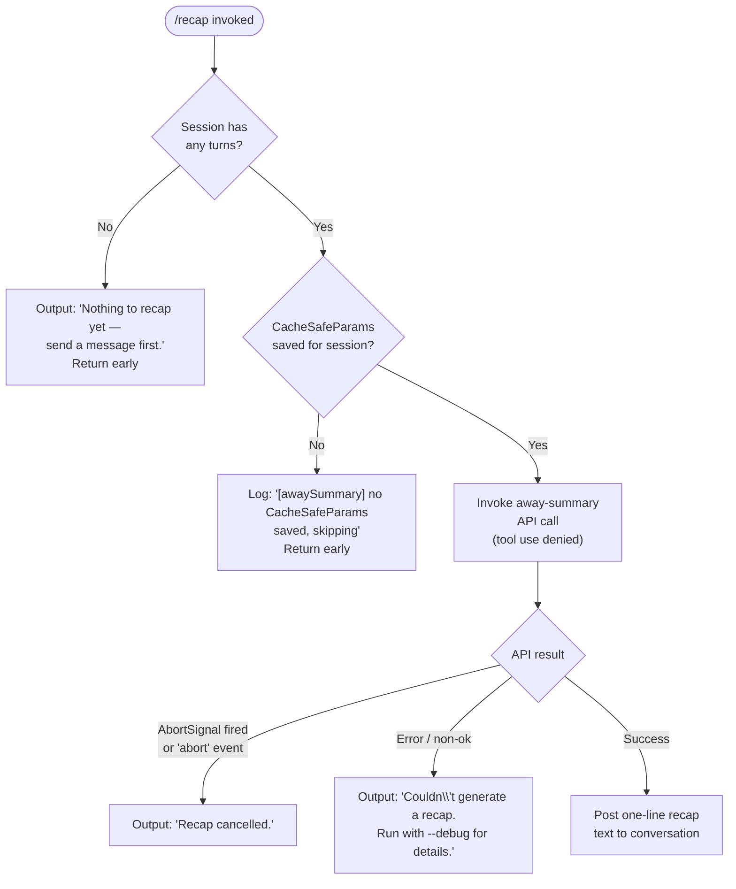

# `/recap`

> Analysis basis: CC v2.1.178 bundle.js (AST extraction + Claude interpretation)
> Minimum version: v2.1.178

---

## Overview

The `/recap` command triggers an immediate, on-demand generation of a one-line summary of the current session. It works by invoking the "away summary" subsystem — the same mechanism used for background session summaries — but driven synchronously from a user-typed slash command rather than from an idle timer. The resulting recap text is posted as a plain-text message in the conversation.

---

## Registration

| Field | Value |
|---|---|
| type | `local` |
| name | `recap` |
| description | `Generate a one-line session recap now` |
| loc_byte | `13391897` |
| loc_byte_end | `13392113` |
| supportsNonInteractive | `false` |
| thinClientDispatch | `post-text` |
| load_inline | `true` |
| load_ident | `$L5` |
| arbor_handler.name | `$L5` |
| arbor_handler.kind | `AsyncFunction` |
| arbor_handler.fqn | `claude-2.1.178::$L5` |
| arbor_handler.resolution_path | `load_ident` |
| arbor_handler.n_hits | `0` |

The handler was inlined as `load: () => Promise.resolve({ call: $L5 })` inside the registration object; there is no separate `module_id`. The Arbor symbol graph resolved the handler via the `load_ident` path.

Analysis basis: CC v2.1.178 bundle.js:+13391897

---

## Input Branching

The command produces four distinct user-visible outcomes depending on session state and the result of the API call. A Mermaid flowchart is used.



Analysis basis: CC v2.1.178 bundle.js:+13391647, +13391739, +13391797, +6999457, +6999515, +6999571

---

## Behavioral Spec

### Handler Entry — `recapCommandHandler` (`$L5`)

```
async function recapCommandHandler(context):
    result = await awaySummaryRunner(context)
    return result
```

The handler is an `AsyncFunction` resolved at `load_ident` path. It immediately delegates to the away-summary execution function (`Zy6`).

Analysis basis: CC v2.1.178 bundle.js:+13391505

---

### Away-Summary Runner — `awaySummaryRunner` (`Zy6`)

```
async function awaySummaryRunner(context):
    // 1. Resolve cached API parameters
    params = getCacheSafeParams(context)           // xqH
    if params is null:
        log("[awaySummary] no CacheSafeParams saved, skipping")
        return { kind: "no-turn" }

    // 2. Set up abort controller tied to session lifecycle
    abortController = new AbortController()
    context.addEventListener("abort", () => abortController.abort("abort"))

    // 3. Run the agent query with tool-use denied
    queryResult = await runAgentQuery(params, {    // AE
        signal: abortController.signal,
        toolPolicy: "deny",
        toolDenyReason: "Away summary cannot use tools"
    })

    // 4. Handle result
    match queryResult.status:
        case "ok":
            postRecapText(queryResult.text)
            return { kind: "away_summary" }
        case "api-error":
            findAndDisplayError(queryResult)       // M_q
            return { kind: "api-error" }
        case "abort":
            return { kind: "abort" }
```

Key literal constants observed:
- Log message `"[awaySummary] no CacheSafeParams saved, skipping"` — Analysis basis: CC v2.1.178 bundle.js:+6999457
- No-turn sentinel string `"no-turn"` — Analysis basis: CC v2.1.178 bundle.js:+6999515
- Abort event name `"abort"` — Analysis basis: CC v2.1.178 bundle.js:+6999571
- Tool-deny reason `"Away summary cannot use tools"` — Analysis basis: CC v2.1.178 bundle.js:+6999763
- Result kind tag `"away_summary"` — Analysis basis: CC v2.1.178 bundle.js:+6999831
- Error kind tag `"api-error"` — Analysis basis: CC v2.1.178 bundle.js:+7000064
- Success kind tag `"ok"` — Analysis basis: CC v2.1.178 bundle.js:+7000125

---

### Early-Exit Message Rendering

Three distinct user-visible strings are emitted depending on the failure mode:

| Condition | Output string |
|---|---|
| No turns in session | `"Nothing to recap yet — send a message first."` |
| Recap was aborted | `"Recap cancelled."` |
| API call failed | `"Couldn't generate a recap. Run with --debug for details."` |

Analysis basis: CC v2.1.178 bundle.js:+13391647, +13391739, +13391797

---

### Agent Query Core — `runAgentQuery` (`AE`)

This is a large, reusable agent query function shared with the main interactive loop. For `/recap`, it is called with specific constraints:

```
async function runAgentQuery(params, options):
    startTime = Date.now()

    // Build conversation context
    sessionContext = buildSessionContext(params)    // GR8

    // Set up interaction channel (no tool use allowed)
    interactionChannel = setupInteractionChannel(options)  // iKH

    // Execute main agent loop
    loopResult = await runMainAgentLoop(sessionContext, interactionChannel)  // CSL (via _B)

    // Collect sub-agent results if any
    subResults = collectSubAgentResults()          // HOH

    // Build and return result object
    return buildResult(loopResult, subResults)
```

Analysis basis: CC v2.1.178 bundle.js:+10797813, +10797936, +10798205, +10798247, +10798267, +10798902

The tool policy for `/recap` is enforced by the literal `"deny"` and the deny reason `"Away summary cannot use tools"`. When the model attempts to use a tool, the attempt is rejected before execution.

---

### Session Context Builder — `buildSessionContext` (`GR8`)

```
function buildSessionContext(params):
    appState = context.getAppState()
    // Processes conversation history
    // Applies avoid_prompts setting
    // Sets role to "assistant" for the summary
    // Generates a unique request ID via randomUUID
    // Calls setAppState with updated context
    return builtContext
```

Key literal: `"avoid_prompts"` setting is consulted (Analysis basis: CC v2.1.178 bundle.js:+10795129).
Role literal `"assistant"` used in context building (Analysis basis: CC v2.1.178 bundle.js:+10797481).

---

### Recap Text Writer — `writeRecapText` (`VdH` → `FCA`)

When the API call succeeds, the one-line recap text is written back to the conversation output channel. The writer (`FCA`) calls `H.write` to emit the text.

Analysis basis: CC v2.1.178 bundle.js:+199029, +199093

---

### Session Transcript Logger — `sessionTranscriptLogger` (`LM4`)

The away-summary call (and by extension `/recap`) is wired into the session transcript logger. This subsystem:

1. Resolves the transcript directory via `W7H.dirname` (Analysis basis: CC v2.1.178 bundle.js:+212234)
2. Appends a new entry via `WS.appendFile` (Analysis basis: CC v2.1.178 bundle.js:+212014)
3. Rotates log files when they exceed limits (via `P__` which checks file size and renames with `.txt` suffix) (Analysis basis: CC v2.1.178 bundle.js:+211619, +211641, +211682)
4. Schedules deferred writes using `setImmediate` and `setTimeout` (Analysis basis: CC v2.1.178 bundle.js:+64960, +64867)
5. Uses `Buffer.byteLength` to track log size (Analysis basis: CC v2.1.178 bundle.js:+212409)

Rotation threshold literal: `4` (number of backup files kept) — Analysis basis: CC v2.1.178 bundle.js:+211652

---

### Error Flattener — `errorMessageFlattener` (`M_q`)

When the API call returns an error status, this function flattens multi-part error messages into a displayable form using `H.flatMap`.

Analysis basis: CC v2.1.178 bundle.js:+7000291

---

## State & Side Effects

| Item | Detail |
|---|---|
| Telemetry | See telemetry events listed below — emitted by the shared agent query loop (`CSL`), not by the recap handler itself |
| appState changes | `getAppState` / `setAppState` called during session context construction (`GR8`) |
| Abort signal | An `AbortController` is created; its signal is wired to the session's `"abort"` event |
| Session transcript | A log entry is appended via `WS.appendFile`; rotation may rename old log files |
| Tool use | All tool calls are denied with reason `"Away summary cannot use tools"` |
| Sound | <!-- TODO: not found in depth-2 traversal; needs --depth 4 --> |
| Hook registration | `XSA.register` called via `F9` (telemetry/feature hook registration) — Analysis basis: CC v2.1.178 bundle.js:+66308 |
| Non-interactive | `supportsNonInteractive: false` — command cannot run in `--print` / headless mode |
| thinClientDispatch | `"post-text"` — in thin-client mode the recap result is posted as plain text |

### Telemetry Events (from shared agent query loop)

These events are emitted by functions reachable within depth-2 of the `/recap` call graph. They are not recap-specific but fire during any invocation of the agent query machinery:

| Event | Approximate trigger |
|---|---|
| `tengu_auto_compact_rapid_refill_breaker` | Rapid context refill guard tripped |
| `tengu_auto_compact_succeeded` | Auto-compact completed successfully |
| `tengu_ptl_surfaced_to_user` | Prompt-too-long error shown |
| `tengu_refusal_fallback_suppressed` | Refusal fallback suppressed |
| `tengu_rotunda_pennant_applied` | Model pennant applied |
| `tengu_rotunda_pennant_tools` | Tool pennant applied |
| `tengu_refusal_fallback_dialog_suppressed` | Refusal dialog suppressed |
| `tengu_refusal_fallback_prompt_shown` | Refusal fallback prompt shown |
| `tengu_refusal_fallback_prompt_choice` | User made a refusal fallback choice |
| `tengu_fallback_credit_forfeited` | Fallback credit forfeited |
| `tengu_convolute_arcades_retry` | Retry attempt in arcades path |
| `tengu_refusal_fallback_triggered` | Refusal fallback triggered |
| `tengu_orphaned_messages_tombstoned` | Orphaned messages cleaned up |
| `tengu_refusal_fallback_supersedes` | Refusal fallback superseded |
| `tengu_convolute_arcades_retry_outcome` | Retry outcome recorded |
| `tengu_model_fallback_triggered` | Model fallback triggered |
| `tengu_query_error` | Query error recorded |
| `tengu_model_response_keyword_detected` | Model response keyword detected |
| `tengu_malformed_tool_use_retry_outcome` | Malformed tool use retry outcome |
| `tengu_malformed_tool_use_response` | Malformed tool use response |
| `tengu_stop_hook_block_count` | Stop hook block count recorded |
| `tengu_loop_dynamic_wakeup_ends_turn` | Dynamic wakeup ended the turn |
| `tengu_post_autocompact_turn` | Turn after auto-compact |
| `tengu_query_before_attachments` | Query state before attachments |
| `tengu_query_after_attachments` | Query state after attachments |
| `tengu_mcp_tools_refreshed_mid_turn` | MCP tools refreshed mid-turn |
| `tengu_feature_ok` | Feature gate passed |
| `tengu_feature_bad` | Feature gate failed |
| `tengu_forked_agent_default_turns_exceeded` | Forked agent turn limit exceeded |
| `tengu_fork_agent_query` | Fork agent query event |

---

## Version History

| Version | Change |
|---|---|
| v2.1.178 | Initial analysis |

---

## Common Mistakes

1. **Running `/recap` before any conversation turns**: The command returns `"Nothing to recap yet — send a message first."` and produces no API call. At least one user turn must exist in the session.
2. **Expecting tool use in the recap**: The away-summary mechanism explicitly denies all tool calls. The model cannot read files, run commands, or call MCP tools while generating the recap — it operates on conversation context only.
3. **Using in non-interactive / `--print` mode**: `supportsNonInteractive` is `false`. Attempting to invoke `/recap` in a headless pipeline will not work.
4. **Expecting a long summary**: The description says "one-line" — the recap is intentionally brief. Users seeking a full summary should consider the `/compact` command instead.
5. **Interpreting absence of output as a bug**: If `CacheSafeParams` have not yet been saved (e.g., the session context is still being initialized), the command silently skips and logs a debug message rather than producing visible output. Run with `--debug` to see this log.

---

## Appendix — Identifier Mapping

> For bundle debugging only. Identifiers change across versions.

| Identifier | Role |
|---|---|
| `$L5` | Recap command handler (async entry point, resolved via `load_ident`) |
| `Zy6` | Away-summary runner; orchestrates the full recap flow |
| `xqH` | Cache-safe params resolver; fetches saved API parameters for the session |
| `N` | Conversation message formatter / normalizer |
| `AM4` | Message assembly helper |
| `WSA` | Write stream adapter |
| `xH` | JSON serializer wrapper |
| `d4` | Path/string manipulation utility |
| `sCA` | Content-array mapper |
| `VdH` | Recap text write dispatcher |
| `FCA` | File/channel writer (calls `H.write`) |
| `LM4` | Session transcript logger (append, rotate, flush) |
| `sQH` | Deferred write scheduler (uses `setTimeout` / `setImmediate`) |
| `G7H` | Log path builder |
| `INH` | EISDIR error guard |
| `_bA` | Log path joiner |
| `P__` | Log file rotation handler (stat, rename, unlink) |
| `fM4` | Log file appender (mkdir + appendFile) |
| `F9` | Feature/telemetry hook registrar (`XSA.register`) |
| `AE` | Agent query executor (main runner for recap API call) |
| `GR8` | Session context builder (getAppState / setAppState) |
| `HI` | Primary key / session identity helper |
| `v3H` | State serializer (load/dump) |
| `DWH` | Conversation history processor |
| `Po9` | Request parameter assembler |
| `M` | Message dispatcher / router |
| `sp8` | Streaming setup helper |
| `CR` | Nonce / random-bytes generator |
| `TR8` | Turn result builder |
| `iKH` | Interaction channel setup |
| `Wf` | Feature registration wrapper |
| `eUH` | Message filter (filters by `ant` origin, etc.) |
| `_B` | Agent loop entry / subagent coordinator |
| `CSL` | Main agent query loop (large; handles streaming, fallbacks, tool execution) |
| `qp8` | Subagent exit / cleanup handler |
| `SH` | Feature-ok telemetry emitter |
| `bH` | Feature-bad telemetry emitter |
| `QE` | Query-end signal handler |
| `km6` | Tool-use summary state checker |
| `c6H` | Client-side context handler |
| `HU8` | Header/usage builder |
| `Laq` | Post-turn state applicator |
| `D` | Background daemon dispatch manager |
| `d` | Generic async deferred / promise utility |
| `b` | Background session lifecycle controller |
| `o8` | Timeout-with-abort utility |
| `ul8` | OS-specific (macOS) memory utility |
| `dRH` | Disk-based cache reader (lstat / readFile / rm) |
| `RH` | Error logger (logError) |
| `F` | Background PTY socket manager |
| `O6` | Background session spawner / router |
| `ZhA` | Background session claim/connect handler |
| `khA` | Background job lifecycle manager |
| `f` | Promise finalization wrapper |
| `w` | Forced shutdown / abort / process.exit handler |
| `Z8` | Async utility (deferred resolution) |
| `dH` | Low-level debug logger |
| `B` | UI / app-state interface |
| `HOH` | Sub-agent result collector |
| `GX` | Result grouper |
| `BLL` | Result finder |
| `oSL` | Forked agent query runner |
| `F8` | Background message framing / UUID generator |
| `P` | Buffer/stream protocol parser |
| `X` | Stream timeout manager |
| `j` | Session kill controller |
| `lL` | Stream end / flush handler |
| `Gb5` | Background PTY attach/message handler (large) |
| `TH` | String coercion utility |
| `M_q` | Error message flattener (flatMap over multi-part errors) |

---

Note: index built via Arbor fallback; some signals (telemetry, literals) may be missing — see arbor-fallback.js.