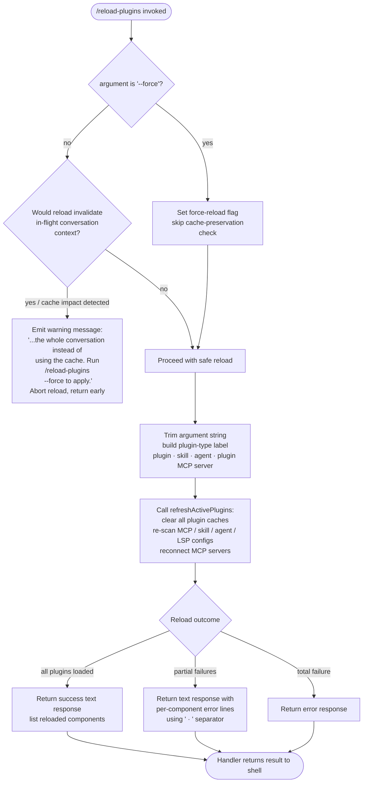

# `/reload-plugins`

> Analysis basis: CC v2.1.178 bundle.js (AST extraction + Claude interpretation)
> Minimum version: v2.1.178

---

## Overview

`/reload-plugins` activates pending plugin changes (MCP servers, skills, agents, LSP servers, and hooks) within the currently running Claude Code session, without requiring a full restart. When invoked without arguments it performs a safe reload that preserves any cached conversation context; passing `--force` bypasses that cache-preservation heuristic and forces a complete plugin stack refresh even if doing so would invalidate the current context.

---

## Registration

| Field | Value |
|---|---|
| type | `local` |
| name | `reload-plugins` |
| description | `Activate pending plugin changes in the current session` |
| argumentHint | `[--force]` |
| supportsNonInteractive | `false` |
| thinClientDispatch | `control-request` |
| module_id | `rPK` |
| load_inline | `true` |
| loc_byte | `12982297` |
| loc_byte_end | `12982541` |
| loc_line | `8997` |
| arbor_handler.name | `G15` |
| arbor_handler.fqn | `claude-2.1.178::G15` |
| arbor_handler.kind | `AsyncFunction` |
| arbor_handler.resolution_path | `module_id` |
| arbor_handler.n_hits | `0` |

Analysis basis: CC v2.1.178 bundle.js:+12982297

---

## Input Branching

The handler has four distinct input paths determined by the presence of `--force`, whether any plugin cache will be impacted, and whether the reload fully or partially succeeds.



Analysis basis: CC v2.1.178 bundle.js:+12981381, +12981417, +12980880, +12981046, +12981202, +12981229

---

## Behavioral Spec

### Entry point — handler `reloadPluginsHandler` (bundle: `G15`)

The handler is an `AsyncFunction` resolved via `module_id → rPK`. The Arbor symbol graph confirms the handler as `G15` (`claude-2.1.178::G15`).

```
async function reloadPluginsHandler(args, context):
    # 1. Parse --force flag
    rawArg = args.trim()                          # bundle:+12981381
    forceFlag = (rawArg includes "--force"        # bundle:+12981417
                 OR rawArg includes "force")      # bundle:+12981432

    # 2. Cache-impact gate (only when force is absent)
    if not forceFlag:
        impact = computeCacheImpact(context)      # calls iPK  bundle:+12981601
        emit telemetry("tengu_reload_plugins_cache_impact", impact)  # bundle:+12980289
        if impact.wouldInvalidateContext:
            return textResult(
                "...the whole conversation instead of using the cache."
                + " Run /reload-plugins --force to apply."  # bundle:+12980880
            )

    # 3. Determine which plugin subsystems are present
    pluginTypes = detectPluginTypes(context)      # calls nPK  bundle:+12981449
    # nPK checks for: "plugin", "skill", "agent", "plugin MCP server"
    #                  bundle:+12981111  +12981142  +12981170  +12981202

    # 4. Refresh all active plugins
    result = await refreshActivePlugins(context)  # calls lzH  bundle:+12981727
    # lzH logs: "refreshActivePlugins: clearing all plugin caches"  bundle:+12977966

    # 5. Format and return response
    label = buildLabel(pluginTypes, " · ")        # separator  bundle:+12981229
    if result.totalFailure:
        return errorResult("error", result)       # bundle:+12981284
    return textResult(label, result)              # bundle:+12981359
```

Analysis basis: CC v2.1.178 bundle.js:+12981091 (`ja`), +12981013 (`z7`), +12980995 (`Ij`)

---

### Cache-impact probe — `computeCacheImpact` (bundle: `iPK`)

```
function computeCacheImpact(context):
    # Inspects live conversation state to determine whether re-loading
    # plugins at this moment would force the model to re-process
    # the whole conversation rather than use the prompt cache.
    # Returns a struct with `wouldInvalidateContext` boolean.
    d = inspectConversationState(context)         # calls d  bundle:+12980287
    return { wouldInvalidateContext: d.active }
```

Analysis basis: CC v2.1.178 bundle.js:+12981601

---

### Plugin-type detector — `detectPluginTypes` (bundle: `nPK`)

```
function detectPluginTypes(context):
    types = []
    if context.has("plugin"):   types.push("plugin")     # bundle:+12980063
    if context.has("skill"):    types.push("skill")      # bundle:+12981142
    if context.has("agent"):    types.push("agent")      # bundle:+12981170
    if context.has("MCP"):      types.push("plugin MCP server")  # bundle:+12981202
    resolveMarketplaceSources(context)   # calls jh  bundle:+12980146
    resolveInstalledPluginMap(context)   # calls Mr  bundle:+12980152
    lookupOutputTokenQuota(context)      # calls WD  bundle:+12980173
    return types
```

Analysis basis: CC v2.1.178 bundle.js:+12980013

---

### Core refresh — `refreshActivePlugins` (bundle: `lzH`)

This is the most significant subroutine. It orchestrates a full plugin stack rebuild.

```
async function refreshActivePlugins(context):
    log("refreshActivePlugins: clearing all plugin caches")  # bundle:+12977964

    # Step A — clear installed-plugins cache
    clearInstalledPluginsCache()    # calls U$  → tp  bundle:+12978024
    # logs "Cleared installed plugins cache"  bundle:+10997118

    # Step B — re-scan plugin configuration sources in parallel
    [mcpConfig, skillConfig, lspConfig] = await Promise.all([
        reloadMcpConfiguration(),   # calls DHH  bundle:+12978270
        reloadSkillIndex(),         # calls Xv → yU  bundle:+10960926
        reloadLspConfig(),          # calls _xH  bundle:+12978432
    ])

    # Step C — rebuild per-type plugin records
    pluginRecords = await assemblePluginLoadResult(mcpConfig, skillConfig, lspConfig)
    # calls p3A (skills-dir scan)    bundle:+11052510
    # calls U3A (MCP server connect) bundle:+11072247
    # telemetry events emitted by U3A:
    #   "plugin_load_all"           bundle:+11073568
    #   "plugin_load_total_failure" bundle:+11073586
    #   "plugin_load_partial_failures" bundle:+11073655

    # Step D — merge LSP extension records, detect conflicts
    mergedLsp = mergeLspExtensions(pluginRecords)   # calls xG8  bundle:+12978560
    # logs "lsp-extension-conflict" on duplicate file-type handlers bundle:+6844182

    # Step E — rebuild hook registry (skip if --safe-mode active)
    if not safeModeActive():
        registerHooks(pluginRecords)    # calls k3H  bundle:+12978827
        # logs "Safe mode: skipping plugin hook registration" when skipped
        #       bundle:+5137300
    else:
        log("Safe mode: skipping plugin hook registration")

    # Step F — compute diff versus previous state, emit event
    diff = computeDiff(previousState, pluginRecords)  # calls P15, W15 bundle:+12978643
    context.emit("QR", diff)   # QR.emit  bundle:+12979073

    # Step G — format result rows
    rows = formatResultRows(pluginRecords, diff)  # calls K.map  bundle:+12978185
    return { rows, totalFailure: (rows.length == 0), diff }
```

Analysis basis: CC v2.1.178 bundle.js:+12977964

---

### MCP server reconnect — `assembleMcpConnections` (bundle: `Rr`)

Called transitively from `lzH` via `DHH`.

```
async function assembleMcpConnections(mcpConfig):
    # Load config from all scopes: projectSettings, userSettings,
    # localSettings, policySettings                     bundle:+6534035
    sources = loadAllMcpSources(mcpConfig)  # calls hP  bundle:+6535871
    # Reads .mcp.json files                             bundle:+6534295
    # logs "MCP config file not found" when absent      bundle:+6534424

    serverMap = buildServerMap(sources)     # calls jHH  bundle:+6535944
    filteredMap = filterByPolicy(serverMap) # calls UD   bundle:+6536045

    for each server in filteredMap:
        if server.status == "approved":     # bundle:+6536722
            connect(server)
        elif server.status == "pending":    # bundle:+6536749
            defer(server)

    # Suppress duplicates
    deduplicateServers(serverMap)  # "mcp-server-suppressed-duplicate"  bundle:+6537480

    # Kill stale connections
    terminateStaleConnections()    # calls D   bundle:+6536710
    # SIGKILL sent to unresponsive children  bundle:+17066095

    return assembledMap
```

Analysis basis: CC v2.1.178 bundle.js:+6535761

---

### Skill-index reload — `reloadSkillIndex` (bundle: `yU`, via `Xv`)

```
async function reloadSkillIndex(context):
    await Promise.resolve()                       # bundle:+13581362
    context.clearSkillIndexCache()               # bundle:+13581414
    # logs "Cleared installed plugins cache"     # via BYA
    return freshIndex
```

Analysis basis: CC v2.1.178 bundle.js:+10960926

---

### Plugin load assembly — `assemblePluginLoadResult` (bundle: `p3A`)

```
async function assemblePluginLoadResult(configs):
    # Enumerate plugin roots from skills-dir   bundle:+11052780
    entries = Object.entries(configs)           # bundle:+11052569

    results = await Promise.allSettled(
        entries.map(async ([name, cfg]) => loadOnePlugin(name, cfg))
    )                                           # bundle:+11052948

    for result of results:
        if result.status == "fulfilled":        # bundle:+11054365
            recordSuccess(result.value)
        elif result.status == "rejected":       # bundle:+11054421
            classifyFailure(result.reason)
            # Failure categories (literals):
            # "marketplace-blocked-by-policy"   bundle:+11053056
            # "marketplace-not-found"           bundle:+11053610
            # "marketplace-load-failed"         bundle:+11053802
            # "cache-miss"                      bundle:+11053858
            # "plugin-not-found"                bundle:+11053896
            # "generic-error"                   bundle:+11054537

    if originalCwdChangedMidScan():
        log("assemblePluginLoadResult: originalCwd changed mid-scan; "
            + "skipping side-effects (stale early-kick)")  # bundle:+11073721
        return earlyReturn

    emitTelemetry("plugin_load_all",             {})  # bundle:+11073568
    if totalFailure:
        emitTelemetry("plugin_load_total_failure", {}) # bundle:+11073586
    if partialFailures:
        emitTelemetry("plugin_load_partial_failures", {}) # bundle:+11073655

    return { successes, failures }
```

Analysis basis: CC v2.1.178 bundle.js:+11052510

---

### MCP server connection lifecycle — `connectMcpServer` (bundle: `U3A`)

```
async function connectMcpServer(serverCfg):
    transport = serverCfg.transport   # "stdio" | "sse" | "sse-ide" | "ws-ide"
                                      # bundle:+6793876
    path  = serverCfg.path            # bundle:+11072611
    url   = serverCfg.url             # bundle:+11072716

    connection = await Promise.all([
        setupTransport(transport, path, url),
        authenticateIfNeeded(serverCfg),
    ])                                # bundle:+11072828

    if connection.status == "connected":    # bundle:+6794915
        recordSuccess(serverCfg)
    elif connection.status == "failed":     # bundle:+6794707
        cacheFailure(serverCfg)
        # logs "Skipping connection (recent failure cached; retries automatically
        #        in 15 min, or edit the plugin config to retry now)"  bundle:+6794731
    elif connection.status == "needs-auth": # bundle:+6794535
        # logs "Skipping connection (cached needs-auth)"              bundle:+6794469
        deferForAuth(serverCfg)

    markIneffectiveDisableWarning()   # "ineffective-disable"  bundle:+11073453
```

Analysis basis: CC v2.1.178 bundle.js:+11072247

---

## State & Side Effects

| Item | Detail |
|---|---|
| Telemetry — `tengu_reload_plugins_cache_impact` | Fired once per invocation before cache gate; records whether reload would invalidate conversation cache (bundle.js:+12980289) |
| Telemetry — `tengu_plugin_state_file_error` | Emitted when plugin state file on disk is unreadable (bundle.js:+10997297) |
| Telemetry — `tengu_daemon_config_reload` | Emitted when the daemon configuration is reloaded as a side-effect (bundle.js:+17081946) |
| Telemetry — `tengu_mcp_list_changed` | Emitted when MCP server tool lists change after reconnect (bundle.js:+16831758) |
| Telemetry — `tengu_mcp_auth_config_clear` | Emitted when MCP OAuth config is cleared during reload (bundle.js:+12084824) |
| Installed-plugins cache | Cleared unconditionally on every reload (bundle.js:+10997118) |
| Skill index cache | Cleared via `clearSkillIndexCache()` (bundle.js:+13581414) |
| Hook registry | Re-registered from fresh plugin records; skipped entirely in `--safe-mode` (bundle.js:+5137300) |
| MCP server connections | Stale connections terminated (SIGKILL escalation possible); new connections established; duplicates suppressed with `"mcp-server-suppressed-duplicate"` tag (bundle.js:+6537480) |
| LSP servers | Restarted if config changed; extension-conflict warnings emitted for duplicate file-type handlers (bundle.js:+6844182) |
| QR event | `QR.emit` fires with plugin diff payload after every successful reload (bundle.js:+12979073) |
| `thinClientDispatch` | `"control-request"` — the command is dispatched as a control message when running in thin-client mode; not available in non-interactive sessions (`supportsNonInteractive: false`) |
| appState changes | Plugin type list updated; MCP server map replaced in-place |
| Sound | None observed in traversal |

---

## Version History

| Version | Change |
|---|---|
| v2.1.178 | Initial analysis — `--force` flag, cache-impact gate, `thinClientDispatch: "control-request"`, multi-subsystem reload (MCP, skills, agents, LSP, hooks) |

---

## Common Mistakes

1. **Omitting `--force` when cache impact is detected.** Without the flag, if the current session has an active prompt cache that would be invalidated, the command aborts and prints a hint. Users must explicitly pass `--force` to proceed in that case.
2. **Expecting non-interactive use.** `supportsNonInteractive: false` means `/reload-plugins` cannot be used in batch (`--no-interactive`) pipelines; it will be rejected before the handler runs.
3. **Assuming instant reconnection.** MCP servers that previously failed are cached as failed for 15 minutes. A plain `/reload-plugins` will skip those servers. Edit the plugin config or remove the cached failure before reloading to force a fresh connection attempt.
4. **Using `--force` indiscriminately.** Force-reload clears the entire prompt cache, causing the model to re-process the full conversation on the next turn, which increases latency and cost.
5. **Running in `--safe-mode`.** When Claude Code is started with `--safe-mode`, hook registration is silently skipped even on a successful reload. Plugin tools and MCP servers are still reloaded, but hook callbacks will not fire.
6. **Expecting LSP servers to restart immediately.** LSP server restart is asynchronous; editor-side language features may lag behind the command returning a success message.

---

## Appendix — Identifier Mapping

> For bundle debugging only. Identifiers change across versions.

| Identifier | Role |
|---|---|
| `G15` | Main handler — `reloadPluginsHandler` (AsyncFunction) |
| `Ij` | Argument normalisation helper |
| `z7` | Plugin-type string resolver |
| `YNH` | String constant table for plugin type names |
| `ja` | Label builder (`"plugin · skill · agent …"`) |
| `C8` | Text-result constructor |
| `nPK` | Plugin-type detector / context probe |
| `hc_` | MCP configuration loader orchestrator |
| `WwH` | MCP config source enumerator |
| `kc_` | MCP config collector — calls `U3A` and `p3A` |
| `U3A` | Individual MCP server connection handler |
| `p3A` | Plugin-load assembly / `assemblePluginLoadResult` |
| `Rr` | Full MCP reconnect orchestrator |
| `v4` | MCP scope resolver |
| `hP` | Per-source `.mcp.json` file reader and parser |
| `jHH` | Server-map builder |
| `UD` | Policy-filter for MCP servers |
| `q08` | MCP config entry validator |
| `nr9` | MCP server deduplication registry |
| `D` | Stale-connection terminator / process manager |
| `w` | Forced-shutdown helper (`process.exit`) |
| `BZ` | MCP connection status helper |
| `qw` | Unknown — reached from `Rr`, role unclear <!-- TODO: not found in depth-2 traversal; needs --depth 4 --> |
| `N` | Logging / notification emitter |
| `iPK` | Cache-impact probe |
| `T15` | Argument splitter (splits raw arg string) |
| `lzH` | `refreshActivePlugins` — core reload orchestrator |
| `Stq` | Logging helper inside `lzH` |
| `U$` | Installed-plugins cache manager |
| `PbL` | Plugin cache subsystem initialiser |
| `eW` | Cache-clear coordination helper |
| `DF_` | Plugin root filter (checks `pluginRoot` key) |
| `RH` | Error logger / structured error builder |
| `Xv` | Skill-index reload coordinator |
| `yU` | Skill index cache clear |
| `RUH` | Skill-index fetch helper |
| `zzH` | BU8 wrapper — secondary cache clear |
| `tp` | `Um6.clear` — installed-plugins Map clear |
| `DHH` | MCP config file discovery and parsing |
| `mQ` | `.mcpb` / `.dxt` suffix detector |
| `jc_` | Individual config file reader (UTF-8, `manifest.json`) |
| `Sr9` | Plugin-status aggregator |
| `cN6` | MCPB archive extractor and manifest reader |
| `_xH` | LSP config reader (`.lsp.json`) |
| `eb7` | LSP config entry validator / path-traversal checker |
| `tb7` | LSP path resolver (relative-within-plugin check) |
| `xGK` | Daemon status file writer (`daemon.status.json`) |
| `zt` | Structured log helper |
| `xH` | JSON serialiser (`JSON.stringify`) |
| `xG8` | LSP extension map builder / conflict detector |
| `M` | MCP server manager — apply-update orchestrator |
| `ebH` | Per-server connection applicator |
| `hs8` | `applyMcpUpdate` — live MCP slot updater |
| `INA` | MCP update propagator |
| `P15` | Plugin diff calculator (added side) |
| `W15` | Plugin diff calculator (removed side) |
| `lPK` | Plugin-diff filter predicate |
| `k3H` | Hook-registration entry point |
| `CK` | Hook registry initialiser |
| `kn6` | `--safe-mode` detector |
| `IzH` | Per-plugin record builder / dependency resolver |
| `Uv` | Known-marketplace loader |
| `hM` | `known_marketplaces.json` reader |
| `rU8` | Marketplace path resolver |
| `_CH` | Object-entries iterator for plugin map |
| `b8` | Plugin config validator |
| `K68` | Plugin schema validator |
| `pb` | Plugin descriptor builder |
| `Yv` | Managed-scope guard (`"Cannot install plugins to managed scope"`) |
| `L1` | Plugin ID splitter / namespace parser |
| `kP` | Plugin source type router |
| `u6q` | Git URL `://` prefix detector |
| `fy6` | Marketplace source resolver |
| `AT8` | Plugin config object validator |
| `m6q` | Host-pattern matcher |
| `p6q` | Path-pattern matcher |
| `nx7` | GitHub/npm source type classifier |
| `kqH` | Plugin config object validator (secondary) |
| `B6q` | Combined host+path+extra-pattern matcher |
| `yB` | `marketplace.json` reader for a plugin directory |
| `om6` | `.claude-plugin` directory resolver |
| `Z3A` | Marketplace JSON parser and validator |
| `dZ` | Plugin-file loader (reads plugin.json / marketplace.json) |
| `v3A` | Plugin root file reader |
| `llL` | Plugin cache hit-check |
| `Lp6` | MCP plugin record constructor (very large — installs, versions, LSP, hooks) |
| `CG` | Plugin config object builder |
| `KB8` | Plugin ID/version parser |
| `Oj6` | Local-source path prefix checker (`"./"`) |
| `z` | App-state accessor |
| `SH` | `tengu_feature_ok` emitter |
| `bH` | `tengu_feature_bad` emitter |
| `AR` | Notification push helper |
| `aB` | Process-exit race helper |
| `u6` | Async context-store getter |
| `Pe6` | Store resolver |
| `pv` | Plugin filesystem loader (`load-from-disk`) |
| `N3A` | Sync plugin JSON reader |
| `h3A` | Plugin entry enumerator |
| `em6` | Plugin load-error emitter |
| `J` | Plugin active-set tracker |
| `G` | Editor key-binding handler (unrelated to plugin reload) |
| `T` | UI component helper |
| `hl` | Unicode width helper |
| `j` | Background-process killer |
| `auK` | Vim find-motion handler |
| `RuK` | Vim yank handler |
| `uuK` | Vim visual-replace handler |
| `UuK` | Vim visual-case handler |
| `b` | Session/register accessor |
| `FuK` | Vim paste handler |
| `yuK` | Vim join handler |
| `kuK` | Vim indent handler |
| `P` | PTY buffer reader |
| `oEA` | Vim operator dispatcher |
| `S` | Vim command executor |
| `Kh` | Plugin ID parser |
| `oT` | Plugin option transformer |
| `Rj8` | Semver validity checker |
| `MT9` | Plugin dependency cycle detector |
| `hN` | Flag-settings helper |
| `Utq` | Plugin install-set tracker |
| `C` | Terminal output writer |
| `U` | Stream end/emit helper |
| `YA` | Settings writer |
| `yM_` | Settings file path resolver |
| `XW` | Settings write helper |
| `m5_` | Settings timestamp updater |
| `YyH` | Settings descriptor builder |
| `ED6` | Atomic file writer |
| `Oz` | Cache clear (Ul6, We8) |
| `zH8` | Git-ignore / settings annotation writer |
| `pm` | `.claude/settings.json` path builder |
| `d6` | `tengu_feature_sad` emitter |
| `dF` | Settings diff helper |
| `Kp6` | Plugin path boundary validator |
| `c` | Notification scheduler / recurring-task manager |
| `B` | Notification content builder |
| `X` | Notification timer manager |
| `EV6` | Display width calculator |
| `NX8` | Display width calculator (wide chars) |
| `LtK` | Boolean coercion helper |
| `Q` | Render/write scheduler |
| `X_H` | Flag presence checker |
| `i9H` | Notification filter |
| `OH` | Process-exit guard |
| `zH` | Session orchestrator (large — session init, resume, MCP lifecycle) |
| `Wd8` | Session wait helper |
| `QW` | Terminal encoding detector |
| `n` | Key-event preventDefault helper |
| `UOH` | Live-session lister |
| `z4H` | Session loader / resume handler |
| `H6` | `c36` error constructor |
| `x_` | Module bootstrap helper |
| `uH` | History splice / tombstone helper |
| `BH` | Tool-result renderer |
| `r4` | UUID generator |
| `IJ` | KSA/qSA initialiser |
| `yw` | Async flag |
| `dQ6` | Project-directory rename helper |
| `_a` | Session metadata helper |
| `SR8` | Session-state serialiser |
| `sUH` | Session metadata writer |
| `kYH` | Model resolver |
| `DgH` | Model setting handler |
| `jgH` | Fork/restore handler |
| `UH` | Timeout race helper |
| `QH` | Message queue processor |
| `Rn` | Performance timestamp helper |
| `JfH` | Session file writer |
| `rQ6` | Session initialiser (chdir, hooks, etc.) |
| `jfH` | Session metadata re-appender |
| `dH` | `c36` error variant |
| `jA` | Error stringifier |
| `hH` | History-event batch handler |
| `GZA` | History-fetch (latest events) |
| `TZA` | History-fetch (older events) |
| `VZA` | History worker |
| `EZA` | History-fetch (older, variant) |
| `YH` | MCP server state map |
| `Hh6` | MCP OAuth token revocation handler |
| `RG` | MCP connection cleanup |
| `X08` | MCP tool filter |
| `x86` | MCP tool filter (secondary) |
| `JZ6` | Plugin version-range validator |
| `Pu_` | Semver range helper |
| `_B8` | Git subdir source handler |
| `S3A` | Git source entry-point |
| `Ap6` | Git clone/fetch helper |
| `qB8` | npm/git URL version resolver |
| `g8` | npm registry query helper |
| `jQ` | Semver integer validator |
| `AB8` | Git URL normaliser |
| `fp6` | Plugin install/update orchestrator |
| `E76` | Plugin archive extractor |
| `aU8` | Plugin cache reader |
| `h4H` | Plugin source hasher |
| `gI` | Plugin directory initialiser |
| `eU8` | Plugin node_modules scanner |
| `od` | Plugin `L6` path resolver |
| `LZH` | Plugin directory initialiser (variant) |
| `dU8` | Plugin cleanup helper |
| `y3A` | Plugin list updater |
| `F` | Background PTY / IPC socket handler |
| `l` | IPC socket instance |
| `MV` | IPC error handler |
| `Fv` | Binary frame encoder |
| `sB8` | Binary frame decoder |
| `i` | PTY write wrapper |
| `a` | PTY output stream |
| `Zb5` | ANSI strip helper |
| `JH` | MCP server connection manager (stdio/WebSocket) |
| `hl8` | Voice-stream / WebSocket client |
| `fH` | MCP elicitation handler |
| `yE5` | MCP message type discriminator |
| `LH` | MCP client session handler |
| `t` | Voice-toggle silence-timeout helper |
| `so8` | Voice performance tracker |
| `vH` | History array (with clearTimeout) |
| `PH` | MCP tools/list_changed notification handler |
| `Y8` | MCP debug logger |
| `XA` | Async message queue |
| `tA` | MCP error handler (mirrors `PH`) |
| `um` | Tool result formatter |
| `EH` | Session event concat helper |
| `Ac` | Session Wf helper |
| `R6` | `TT` wrapper |
| `r` | MCP server state tracker / `applyMcpUpdate` caller |
| `QbL` | Plugin dependency resolver (QbL path) |
| `e` | MCP server state map manager |
| `zQ` | Async iterable mapper |
| `z_6` | Integer parser (MCP) |
| `IG8` | Integer parser (MCP, variant) |
| `AH` | Async helper wrapper |
| `tbH` | `z0H` MCP state helper |
| `zv` | Platform/cDH lower-case checker |
| `h$` | `L6` path formatter |
| `t4` | OTEL metrics attribute builder |
| `sRH` | OTEL resource attribute assembler |
| `KH` | Terminal key-sequence classifier |
| `Z9H` | Plugin dependency descriptor formatter |