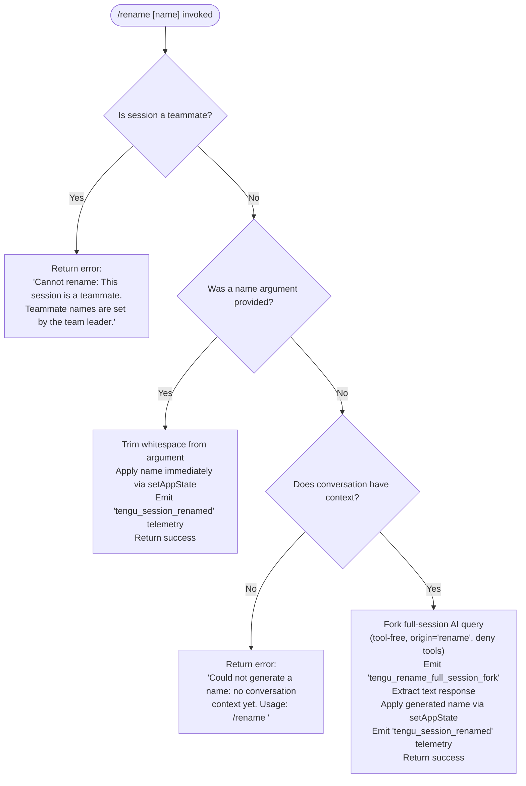

# `/rename`

> Analysis basis: CC v2.1.178 bundle.js (AST extraction + Claude interpretation)
> Minimum version: v2.1.178

---

## Overview

The `/rename` command sets or auto-generates a display name for the current conversation session. When called with an explicit name argument the label is applied immediately; when called without arguments the command invokes an AI-assisted name-generation flow that derives a short title from the existing conversation context. The command is also aliased as `/name`.

---

## Registration

| Field | Value |
|---|---|
| type | `local-jsx` |
| name | `rename` |
| description | `Rename the current conversation` |
| argumentHint | `[name]` |
| immediate | `true` |
| aliases | `["name"]` |
| module_id | `B3K` |
| load_inline | `true` |
| loc_byte | `12407690` |
| loc_byte_end | `12407889` |
| loc_line | `8277` |
| arbor_handler.name | `ZaL` |
| arbor_handler.fqn | `claude-2.1.178::ZaL` |
| arbor_handler.kind | `AsyncFunction` |
| arbor_handler.resolution_path | `module_id` |
| arbor_handler.n_hits | `0` |

Analysis basis: CC v2.1.178 bundle.js:+12407690

---

## Input Branching

Four distinct execution paths exist depending on the session type and whether an explicit name was supplied.



Analysis basis: CC v2.1.178 bundle.js:+12406834, +12406854, +12406953, +12407065, +12405526, +12405529

---

## Behavioral Spec

### Entry point — main handler (`ZaL`)

The Arbor-resolved handler is `ZaL` (AsyncFunction, resolved via `module_id` path).

```
async function sessionRenameHandler(args, context):
    rawInput = args.trim()
    sessionContext = getAppState()

    // Teammate guard
    if sessionContext.isTeammateSesssion:
        return renderError(
            "Cannot rename: This session is a teammate. " +
            "Teammate names are set by the team leader."
        )

    if rawInput is non-empty:
        applyName(rawInput, sessionContext)
        return success
    else:
        return autoGenerateName(sessionContext)
```

Analysis basis: CC v2.1.178 bundle.js:+12406834, +12406854, +12407386

---

### Sub-feature: Immediate name application (`kQ8`)

When a non-empty name string is available (either supplied by the user or produced by auto-generation), the implementation:

1. Trims the string (`H.trim`, bundle.js:+12406953).
2. Calls `setAppState` with the new conversation name field (bundle.js:+12407193).
3. Calls the path-computation helper (`HX`) to derive a display basename for logging (bundle.js:+12407239).
4. Invokes the logging/persistence layer (`KzH`) which writes a `custom-title` marker to the session log (bundle.js:+12407179, literal `"custom-title"` at bundle.js:+13628833).

```
function applyConversationName(trimmedName, appState):
    appState.conversationTitle = trimmedName
    setAppState(appState)
    logTitle = computeBasename(trimmedName)   // HX
    writeSessionLog(logTitle, kind="custom-title")  // KzH → VB → YYH
    emit telemetry: tengu_session_renamed
```

Analysis basis: CC v2.1.178 bundle.js:+12407193, +12407239, +13628833, +13628925

---

### Sub-feature: Auto-name generation via forked session query (`xL6` / `EaL`)

When no name argument is supplied and conversation context exists, the command spawns a constrained AI sub-query to generate a short session title.

```
async function autoGenerateName(sessionContext):
    if conversationMessages is empty:
        return renderError(
            "Could not generate a name: no conversation context yet. " +
            "Usage: /rename <name>"
        )

    emit telemetry: tengu_rename_full_session_fork

    queryConfig = {
        origin: "rename",
        toolPermission: "deny",            // literal "deny" at +12404971
        toolAccessMessage: "Session name generation cannot use tools",
        abortSignal: AbortController,
        outputKind: "text"
    }

    // Fork a lightweight session-scoped query (EaL)
    // Uses json_schema output schema (+12405901) and flatMap over message list
    response = await forkSessionQuery(sessionContext.messages, queryConfig)

    if response has assistant text:
        nameCandidate = extractText(response)
        applyConversationName(nameCandidate.trim(), sessionContext)
    else:
        // No assistant message was produced
        return renderError("No assistant message found")
```

Analysis basis: CC v2.1.178 bundle.js:+12404971, +12404986, +12405050, +12405065, +12405089, +12405526, +12405529, +12405586, +13866984

---

### Sub-feature: Session-log title persistence (`KzH` / `VB` / `YYH`)

Regardless of whether the name was user-supplied or AI-generated, the implementation writes a structured log entry. The `YYH` helper appends a file record (using `appendFileSync`) tagged `custom-title` for manual renames and `ai-title` for AI-generated ones (literals at bundle.js:+13628833 and +13629002). Filesystem operations include `mkdirSync` to ensure the log directory exists.

```
function writeSessionLog(titleValue, titleKind):
    logPath = computeLogPath()               // Qd → L6 + ZNK
    ensureDirectory(logPath.dir)             // A.mkdirSync
    appendFileSync(logPath.file, serialize({ kind: titleKind, value: titleValue }))
    emit event: Gg6.emit("session-renamed")
```

Analysis basis: CC v2.1.178 bundle.js:+13627865, +13627904, +13628833, +13628912, +13629002, +13628925

---

### Sub-feature: Teammate guard

The teammate check runs unconditionally before any rename logic. The error message is a fixed string literal.

- Error literal: `"Cannot rename: This session is a teammate. Teammate names are set by the team leader."` (bundle.js:+12406854)
- Checked via `k5` → `J2` → `_2_.getStore` context-store lookup (bundle.js:+12406834, +2293432, +2292144).

---

### Sub-feature: HTML-entity normalisation in display rendering (`PB8`)

When the final name is rendered in the terminal UI, certain HTML entities in the string are replaced with their plain-text equivalents. The following substitutions are applied (via `H.replaceAll`, bundle.js:+11126762):

| Entity | Replacement |
|---|---|
| `&amp;` | `&` |
| `&lt;` | `<` |
| `&gt;` | `>` |
| `&#13;` | CR |
| `&#10;` | LF |

Analysis basis: CC v2.1.178 bundle.js:+11126762, +11126779, +11126803, +11126826, +11126850, +11126874

---

## State & Side Effects

| Item | Detail |
|---|---|
| Telemetry | `tengu_rename_full_session_fork` (bundle.js:+12405529) — fired when auto-generation path is taken |
| Telemetry | `tengu_session_renamed` (bundle.js:+13628925) — fired after any successful rename |
| Telemetry | `tengu_agent_name_set` (bundle.js:+13632462) — fired when an agent sub-session name is recorded |
| appState changes | `setAppState` updates the conversation title field (bundle.js:+12407193); `getAppState` read (bundle.js:+10794899) |
| Filesystem writes | Session log file appended via `appendFileSync`; directory created via `mkdirSync` if absent (bundle.js:+13627865, +13627904) |
| Event emission | `Gg6.emit` fires a rename notification consumed by other UI subsystems (bundle.js:+13628912) |
| AbortController | An `AbortController` is created and registered for the auto-generation query; abort signal is wired to `"abort"` event (bundle.js:+12404794) |
| Tool permission | Auto-generation query runs with `"deny"` tool permission; any tool attempt returns `"Session name generation cannot use tools"` (bundle.js:+12404971, +12404986) |
| JSON schema output | Auto-generation query uses `"json_schema"` output type (bundle.js:+12405901) |

---

## Version History

| Version | Change |
|---|---|
| v2.1.178 | Initial analysis |

---

## Common Mistakes

1. **Calling `/rename` with no argument before any messages exist** — the command will return `"Could not generate a name: no conversation context yet. Usage: /rename <name>"` rather than silently failing; supply an explicit name in this case.
2. **Attempting to rename a teammate session** — the command is blocked at the teammate guard and returns a fixed error; only the team leader can set teammate names.
3. **Expecting tool use during auto-generation** — the AI sub-query that generates names runs with all tools denied; any prompt or hook that expects tool availability will not fire during the name-generation call.
4. **Assuming `/rename` and `/name` have different behaviour** — both aliases resolve to the same handler (`ZaL`); they are functionally identical.
5. **Treating the stored title as raw HTML** — the display layer applies HTML-entity unescaping (`&amp;`, `&lt;`, `&gt;`, `&#13;`, `&#10;`) before rendering; inserting literal `&lt;` in a name will appear as `<` in the UI.

---

## Appendix — Identifier Mapping

> For bundle debugging only. Identifiers change across versions.

| Identifier | Role |
|---|---|
| `ZaL` | Main async handler for `/rename` (Arbor-resolved entry point) |
| `yQ8` | Display-rendering helper called from `ZaL`; applies entity normalisation |
| `PB8` | HTML-entity replacement utility (`replaceAll` for `&amp;` etc.) |
| `T0` | UI render output helper used after name display |
| `kQ8` | Name-application function: trims, sets appState, calls log writer |
| `k5` | Context-store accessor used for teammate check |
| `J2` | AsyncLocalStorage `getStore` wrapper |
| `xL6` | Auto-generation orchestrator; forks session query when no name provided |
| `O6` | Session query fork scheduler / dispatcher |
| `EaL` | Forked sub-query executor; sets up AbortController and fires the AI request |
| `AE` | Core API query function used by forked session |
| `GR8` | App-state getter/setter coordinator inside query |
| `NQ8` | Message list builder for the rename query context |
| `U3K` | Text-extraction helper; pulls assistant text from query response |
| `ub` | String trim utility |
| `TH` | String-coercion / display helper |
| `N` | Logger / debug output function |
| `KzH` | Session-log write orchestrator; dispatches to `VB` / `cUH` |
| `VB` | Log-entry writer for user-supplied (custom) title |
| `cUH` | Log-entry writer for AI-generated title |
| `YYH` | Low-level `appendFileSync` log writer |
| `qy` | Log-line serialiser |
| `Qd` | Log-path computation helper |
| `HX` | Display basename computation (`oj.basename`) |
| `g6H` | AI-title log writer (fires `ai-title` marker) |
| `Wf` | Log-flush / finalise helper |
| `dH` | `c36`-based structured data helper |
| `Rn` | Persistent state read/write helper (reads/writes session file) |
| `$P6` | File-based session state persistence (readFile / writeFile) |
| `lB8` | `Object.keys`-based state key enumerator |
| `$2H` | File-watching and job-management coordinator for session state |
| `Mq` | Job-state file loader with caching (`Ce`) |
| `xL6` | (same as above) auto-generation orchestrator |
| `PMA` | Pre-query timestamp / probability gate |
| `xH` | `JSON.stringify` wrapper |
| `i6` | `JSON.parse` wrapper |
| `Z8` | Error-logging / error-capture utility |
| `CR` | Request-ID / idempotency-key generator (uses `fj8.randomBytes`) |
| `iKH` | Hook notification helper |
| `_B` | Command lifecycle state recorder |
| `HOH` | Message-filter helper for forked query context |
| `oSL` | Fork result handler / post-processing |
| `F8` | Streaming response reader |
| `XC` | Conversation message normaliser / formatter |
| `jU8` | Message-set builder with hashing (`Cm6.createHash`) |
| `NG` | Full tool-schema builder used in query construction |
| `uRL` | Message map/transform utility |
| `wFH` | Response wrapper; raises error when no assistant message found |
| `pMA` | Fallback request message builder |
| `tyK` | Core streaming API loop |
| `D2` | Backend/provider selector |
| `S_` | Provider-type resolver (`L6`) |
| `Y7` | Model-alias resolver |
| `iP_` | Managed-key / API-key prefix detector |
| `KzH` | (see above) session-log orchestrator |
| `nM` | Log-line format builder |
| `zb` | Log-token helper |
| `W_` | Log separator helper |
| `DJ` | Hook dispatcher |
| `M` | MCP connection manager |
| `ebH` | MCP server connection executor |
| `INA` | MCP state reconciler |
| `hs8` | MCP update applier |
| `RG` | MCP cleanup helper |
| `o8` | Timeout/retry wrapper |
| `j08` | MCP permission set membership checker |
| `p0_` | Growthbook experiment event emitter |
| `o$8` | Experiment deduplication gate |
| `ay_` | Experiment data emission helper |
| `S6` | Config read/write helper with backup |
| `_MH` | Config file reader with ENOENT/EEXIST handling |
| `wnf` | Config file watcher |
| `xGK` | MCP debug snapshot helper |
| `Nh` | MCP skill telemetry emitter |
| `$7` | MCP error logger |
| `Y8` | MCP debug logger |
| `Te9` | MCP connection timing helper |
| `Ie9` | MCP pending-connection helper |
| `pc_` | MCP log-line writer |
| `z7` | CCR integration helper |
| `uW` | Additional session utility |
| `HU8` | Hook-context builder |
| `Laq` | Tombstone / special-message type checker |
| `km6` | Message-type membership checker |
| `c6H` | Conversation-turn context builder |
| `QE` | Queue/execution helper |
| `ET` | `TT`-based terminal output helper |
| `TT` | Low-level terminal write primitive |
| `AR` | Session-store append helper |
| `aB` | Process-exit / shutdown race helper |
| `SH` | `tengu_feature_ok` telemetry emitter |
| `bH` | `tengu_feature_bad` telemetry emitter |
| `hL` | `Z8`-based error capture shorthand |
| `b3` | State-check helper with `kNH` membership test |
| `RH` | Error log emitter (`Us.logError`) |
| `jA` | Error constructor wrapper |
| `L6` | `String`-coercion utility |
| `qq` | `biA`-based binary helper |
| `RQ4` | Shift/push queue manager |
| `hVH` | File-stat / size-check helper |
| `$ZK` | Directory key-width formatter |
| `R14` | Heartbeat helper |
| `SL` | Atomic file-write helper (`yO`) |
| `yO` | Atomic write via temp-file rename |
| `eJ` | Cache-invalidation helper |
| `x8` | `Z8`-based error-capture alias |
| `Faq` | `pRL`-based request helper |
| `F1` | Process-exit logger |
| `g4` | UI grid/layout helper |
| `ZZ` | Render finaliser |
| `U4` | Message-filter pass for UI rendering |
| `FLH` | `gP_`-based format helper |
| `d1` | Inline-content builder |
| `BZ` | `PY`/`Zc_` branch helper |
| `UQ` | MCP config entry merger |
| `ch6` | Spinner / progress indicator |
| `Ne9` | `zQ`-based connection-state helper |
| `z_6` | `parseInt`-based port parser |
| `IG8` | `parseInt`-based numeric field parser |
| `tbH` | `z0H`-based MCP timestamp helper |
| `$_6` | `z0H`-based connection-state reset |
| `j4H` | Hook finaliser |
| `cUH` | AI-title log writer (see above) |