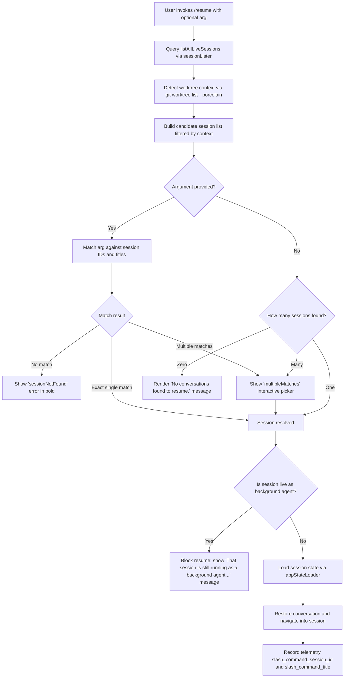

# `/resume`

> Analysis basis: CC v2.1.178 bundle.js (AST extraction + Claude interpretation)
> Minimum version: v2.1.178

---

## Overview

The `/resume` command (also accessible as `/continue`) allows users to resume a previously saved Claude Code conversation by conversation ID or a free-text search term. It queries all known sessions, matches the argument against conversation metadata, and either navigates directly into the matched session or presents an interactive picker when multiple matches exist. If the target session is currently live as a background agent, the user is blocked from resuming it in-place and is directed to `claude agents` instead.

---

## Registration

| Field | Value |
|---|---|
| type | `local-jsx` |
| name | `resume` |
| description | Resume a previous conversation |
| argumentHint | `[conversation id or search term]` |
| aliases | `["continue"]` |
| module_id | `jYK` |
| load_inline | `true` |
| loc_byte | `12585220` |
| loc_byte_end | `12585417` |
| loc_line | `8457` |
| arbor_handler.name | `NH5` |
| arbor_handler.fqn | `claude-2.1.178::NH5` |
| arbor_handler.kind | `AsyncFunction` |
| arbor_handler.resolution_path | `module_id` |
| arbor_handler.n_hits | `0` |

Analysis basis: CC v2.1.178 bundle.js:+12585220

---

## Input Branching

The command has more than three distinct execution paths depending on session lookup results and session state. A Mermaid flowchart is used below.



Analysis basis: CC v2.1.178 bundle.js:+12583706, +12583820, +12584255, +12581463, +12581534, +12584517, +12584742

---

## Behavioral Spec

### Session Candidate Enumeration

```
async function enumerateCandidateSessions(context):
    liveSessions = await listAllLiveSessions()        // UOH
    worktreeInfo = await detectWorktree()             // mOH: runs git worktree list --porcelain
    // Filter sessions to those matching current worktree if applicable
    candidates = filterByWorktree(liveSessions, worktreeInfo)
    return candidates
```

Analysis basis: CC v2.1.178 bundle.js:+9857234, +9846649

The worktree detection helper (`mOH`) runs `git worktree list --porcelain` and emits a `tengu_worktree_detection` telemetry event. It slices and normalises paths (including Unicode NFC normalisation via `zz`) and uses `localeCompare` to sort candidates.

Analysis basis: CC v2.1.178 bundle.js:+9846667, +9846830, +9846891, +9847073, +9846749

---

### Argument Matching and Session Resolution

```
function resolveSession(candidates, userArg):
    if userArg is empty:
        if candidates.length == 0:
            return { kind: "empty" }
        if candidates.length == 1:
            return { kind: "single", session: candidates[0] }
        return { kind: "multipleMatches", sessions: candidates }

    // Match by ID prefix or title substring (case-insensitive)
    matches = candidates.filter(s =>
        s.id.startsWith(userArg) OR
        s.title.toLowerCase().includes(userArg.toLowerCase())
    )

    if matches.length == 0:
        return { kind: "sessionNotFound" }
    if matches.length == 1:
        return { kind: "single", session: matches[0] }
    return { kind: "multipleMatches", sessions: matches }
```

Analysis basis: CC v2.1.178 bundle.js:+12583706, +12583736, +12581463, +12581534

---

### Background-Agent Guard

When the resolved session is currently active as a live background agent (session mode `"interactive"` checked against live sessions), the handler blocks resumption:

```
function checkNotLiveBackgroundAgent(session, liveSessions):
    liveEntry = liveSessions.find(s => s.id == session.id AND s.status == "interactive")
    if liveEntry exists:
        throw BlockedResumeError(
            "That session is still running as a background agent. " +
            "Open `claude agents` to attach to it, or stop it there first to resume here."
        )
```

Analysis basis: CC v2.1.178 bundle.js:+12583820, +9857325

The error message is a fixed string literal. The user must either stop the background agent via `claude agents` or attach to it there before resuming interactively.

---

### History Loading and State Restoration

Once a valid, non-live session is identified, the handler loads the conversation transcript and reconstructs application state:

```
async function loadAndRestoreSession(session):
    // Load persisted conversation history
    history = await loadConversationHistory(session.id)    // p46 / FOH / w4H path

    // Filter valid history entries (user, assistant, system, attachment roles)
    validMessages = history.filter(m =>
        m.role in ["user", "assistant", "system", "attachment"]
    )

    // Restore app state
    appState = await buildAppStateFromHistory(validMessages)  // mOH, Q_

    // Render JSX conversation view
    element = createElement(ConversationView, {
        sessionId: session.id,
        history: validMessages,
        startTime: Date.now()
    })

    return element
```

Analysis basis: CC v2.1.178 bundle.js:+12584106, +12584132, +12584177

Conversation history entries carry typed roles: `"user"`, `"assistant"`, `"system"`, `"attachment"`. The literal `"compact_boundary"` marks summary boundaries in compacted transcripts. The `"skip"` literal is used to skip certain history entries during reconstruction.

Analysis basis: CC v2.1.178 bundle.js:+13593636, +13593658, +13593681, +11151537, +12584023

---

### No-Match and Empty-State Rendering

```
function renderEmptyState():
    return JSXText("No conversations found to resume.")

function renderSessionNotFound(arg):
    return JSXText("sessionNotFound", styled bold via YYK)

function renderMultipleMatches(sessions):
    return InteractivePicker(sessions)   // via Ha / pNK
```

The "No conversations found to resume." literal is emitted when the candidate list is empty.
Analysis basis: CC v2.1.178 bundle.js:+12584255

The `YYK` helper applies bold formatting using `J6.bold` for session-not-found messaging.
Analysis basis: CC v2.1.178 bundle.js:+12584792, +12581498

---

### Session Picker UI (Multiple Matches)

When multiple sessions match, `Ha` renders an interactive list. It delegates to `pNK` which:

- Reads session directories via filesystem (`iK.readdir`, `iK.realpath`)
- Sorts entries (`$.localeCompare`, `Y.sort`)
- Presents formatted rows with path basename, summary, last-prompt, custom-title, and ai-title metadata
- Allows the user to select one entry, which is then passed back through the resolution flow

Analysis basis: CC v2.1.178 bundle.js:+13635949, +13649602, +13649527, +13641941, +13642037, +13642115

Session metadata tags recognised in the store: `"summary"`, `"last-prompt"`, `"custom-title"`, `"ai-title"`, `"tag"`, `"agent-name"`, `"agent-color"`, `"agent-setting"`, `"mode"`, `"permission-mode"`.

Analysis basis: CC v2.1.178 bundle.js:+13641874, +13641941, +13642037, +13642115, +13642185, +13642246, +13642320, +13642396, +13642476, +13642539

---

### Telemetry Recording on Successful Resume

```
function recordResumeSuccess(session):
    telemetry.record("slash_command_session_id", session.id)
    telemetry.record("slash_command_title", session.title)
```

Analysis basis: CC v2.1.178 bundle.js:+12584517, +12584742

---

## State & Side Effects

| Item | Detail |
|---|---|
| Telemetry — `tengu_worktree_detection` | Fired during worktree path detection (bundle.js:+9846749) |
| Telemetry — `tengu_daemon_control` | Fired during daemon interaction (bundle.js:+17104063) |
| Telemetry — `tengu_bg_attach` | Fired when attaching to a background session (bundle.js:+17057277) |
| Telemetry — `tengu_bg_attach_kick` | Fired when an existing attacher is kicked (bundle.js:+17059462) |
| Telemetry — `tengu_bg_attach_stall_respawn` | Fired when a stalled session is respawned during attach (bundle.js:+17058470) |
| Telemetry — `tengu_bg_attach_stall_gave_up` | Fired when attach stall recovery is abandoned (bundle.js:+17058200) |
| Telemetry — `tengu_bg_proto_mismatch` | Fired when daemon protocol mismatch detected (bundle.js:+17051832) |
| Telemetry — `tengu_transcript_phantom_parent` | Fired when transcript has an unresolvable parent reference (bundle.js:+13640646) |
| Telemetry — `tengu_chain_parent_cycle` | Fired when a parent cycle is detected in the conversation chain (bundle.js:+13621481) |
| Telemetry — `tengu_chain_timestamp_fallback` | Fired when timestamp ordering falls back (bundle.js:+13621630) |
| Slash-command telemetry | `slash_command_session_id` and `slash_command_title` recorded on successful resume (bundle.js:+12584517, +12584742) |
| appState changes | Conversation history, session ID, and start timestamp are injected into application state |
| Filesystem reads | Session transcript files read via `iK.readFile`, `iK.readdir`, `iK.stat`, `iK.realpath` |
| Git subprocess | `git worktree list --porcelain` executed for worktree context detection |
| JSX rendering | Returns a JSX element (`JJ.createElement`) representing the resumed conversation view |
| Sound | <!-- TODO: not found in depth-2 traversal; needs --depth 4 --> |
| Hook registration | <!-- TODO: not found in depth-2 traversal; needs --depth 4 --> |

---

## Version History

| Version | Change |
|---|---|
| v2.1.178 | Initial analysis |

---

## Common Mistakes

1. **Trying to resume an active background agent session**: If the target conversation is currently running as a background agent, `/resume` will refuse and display a message directing the user to `claude agents`. The session must be stopped there first.
2. **Ambiguous search terms producing a multi-match picker**: Providing a short or generic search term may match multiple sessions and present an interactive picker rather than resuming immediately. Use the full session UUID prefix for deterministic selection.
3. **Running `/resume` outside any project directory**: Without a worktree context, all sessions across all projects may be listed rather than only project-local ones, making the picker harder to navigate.
4. **Confusing `/resume` with `/continue`**: Both names resolve to the same command; `/continue` is a registered alias. Either spelling is valid.
5. **Expecting live streaming state to be preserved**: The command restores the persisted transcript and metadata but does not restore live streaming tool state or in-flight API calls from the original session.

---

## Appendix — Identifier Mapping

> For bundle debugging only. Identifiers change across versions.

| Identifier | Role |
|---|---|
| `NH5` | Main async handler for `/resume` command (arbor_handler) |
| `DYK` | Pre-handler filter/setup function called before NH5 |
| `J$` | Session navigation / jump-to-session helper |
| `UOH` | Live session lister (`listAllLiveSessions` wrapper) |
| `mOH` | Worktree context detector and session context builder |
| `Q_` | App state builder / conversation state restorer |
| `shH` | Subprocess spawner utility |
| `RH` | Error reporter / logger |
| `jA` | Error construction helper |
| `L6` | String coercion utility |
| `qq` | Telemetry feature-flag checker |
| `biA` | Telemetry routing helper (calls L6) |
| `RQ4` | Queue management for error reporting |
| `TH` | String-to-display-name formatter |
| `Ol4` | String padding/formatting for display |
| `D5` | App state dispatcher |
| `N` | Process/command spawner |
| `AM4` | Sub-process argument builder |
| `xH` | JSON serialiser wrapper |
| `d4` | Command-line argument formatter |
| `VdH` | Path sanitiser |
| `LM4` | Conversation loader / file reader |
| `Z8` | Session store reference |
| `xGK` | Daemon status file reader (`daemon.status.json`) |
| `zt` | Low-level IPC channel helper |
| `f9` | Async local store accessor |
| `XF6` | Path joiner for daemon status file |
| `zz` | Unicode NFC path normaliser |
| `W_` | Working directory resolver |
| `TT` | Terminal/TTY utility |
| `Gd8` | Conversation list formatter |
| `Eg6` | Session entry renderer |
| `pNK` | Session picker / filesystem enumerator |
| `Xr` | Projects directory path builder |
| `K1` | Session key builder |
| `uVH` | Session metadata extractor |
| `L0A` | Directory recursive reader for session files |
| `wg6` | Session metadata cache manager |
| `cY` | Conversation title formatter |
| `SFH` | Session file header parser (binary format) |
| `E35` | Session file content parser |
| `Hh` | Session ID validator (regex test via `Gf7`) |
| `S6H` | Session state initialiser |
| `FOH` | Full session loader (aggregates all session maps) |
| `w4H` | Session store map manager (sets all session metadata maps) |
| `UM5` | Session update notifier |
| `YB` | Session change broadcaster |
| `Si6` | Message content parser |
| `yi6` | Content type detector |
| `ki6` | Content sanitiser |
| `GX` | Session index updater |
| `ebH` | MCP connection builder |
| `hs8` | MCP connection result applier |
| `INA` | MCP server manager |
| `Gb5` | Background PTY session manager |
| `o8` | Timeout-with-abort helper |
| `bH` | Daemon feature-bad telemetry emitter |
| `SH` | Daemon feature-ok telemetry emitter |
| `ul8` | Memory usage checker (macOS) |
| `dRH` | Session file cleanup / reader |
| `O6` | Background session spawn helper |
| `ZhA` | Background session socket claim helper |
| `khA` | Background session lifecycle manager |
| `dH` | Low-level file descriptor helper |
| `rzH` | Array filter for session record types |
| `EV6` | Scheduled-task execution context builder |
| `NX8` | Scheduled-task timing helper |
| `LtK` | Boolean coercion for scheduled tasks |
| `X_H` | Set membership test helper |
| `i9H` | Client state tracker |
| `oF6` | Memory check + background retire helper |
| `uVK` | Background worker spawn helper |
| `i8` | Reflect helper |
| `ml8` | Background worker memory-retire helper |
| `Y35` | Session file binary parser |
| `uNK` | Buffer index utility |
| `i6` | JSON.parse wrapper |
| `O35` | Buffer compare helper |
| `BwH` | JSON parse with error guard |
| `w35` | Session lock file reader |
| `zNK` | Session chain walker / parent-link resolver |
| `aM5` | Chain relink walker |
| `$1` | Low-level channel primitive |
| `z35` | Binary transcript frame parser |
| `fyH` | File encoding detector (BOM/UTF-8) |
| `ol4` | Encoding probe helper |
| `al4` | UTF-8 byte-order-mark scanner |
| `tl4` | JSON-line transcript reader |
| `sl4` | Text-line transcript reader |
| `U` | IPC socket teardown helper |
| `O1` | Session store initialiser |
| `Jn8` | Date.parse wrapper for session timestamps |
| `BOH` | Session chain builder |
| `eM5` | NaN-safe numeric comparator for sessions |
| `H35` | Session graph builder (parent/child links) |
| `sM5` | Session dequeue helper |
| `CNK` | Session map consolidator |
| `m46` | Session list mapper |
| `j0A` | Compact-summary content extractor |
| `CB6` | Message content normaliser |
| `IK` | Inline command-arg parser |
| `X0A` | Attachment type validator |
| `_35` | Attachment array check helper |
| `A35` | Attachment some-check helper |
| `Xn8` | Session entry getter/setter cache |
| `Pn8` | Session values extractor |
| `p46` | Session data aggregator (calls BOH, Xn8, Pn8, etc.) |
| `mNK` | Session initialiser (calls D35, w4H) |
| `D35` | Session directory scanner |
| `zb` | TTY check helper |
| `HG` | Directory listing helper |
| `K0A` | Session metadata reader (calls j0A, m46, X0A) |
| `pzH` | Pre-render state validator |
| `Ha` | Interactive session picker renderer |
| `YYK` | Bold text formatter for error messages |
| `DYK` | Pre-invocation candidate filter |

---

Note: index built via Arbor fallback; some signals (telemetry, literals) may be missing — see arbor-fallback.js.