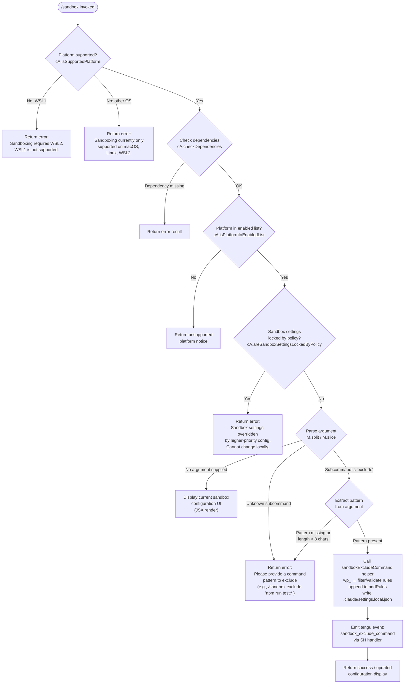

# `/sandbox`

> Analysis basis: CC v2.1.178 bundle.js (AST extraction + Claude interpretation)
> Minimum version: v2.1.178

---

## Overview

The `/sandbox` command configures Claude Code's sandboxing behavior for shell command execution. It allows users to view the current sandbox configuration and to add exclusion rules — specifying shell command patterns that should be exempted from sandboxing constraints. The command enforces platform compatibility checks before applying any configuration changes, and writes approved exclusions to `.claude/settings.local.json`.

---

## Registration

| Field | Value |
|---|---|
| type | `local-jsx` |
| name | `sandbox` |
| description | ` ...   ...  (⏎ to configure)` |
| argumentHint | `exclude "command pattern"` |
| immediate | `true` |
| isHidden | `null` |
| module_id | `B2K` |
| load_inline | `true` |
| loc_byte | `13020996` |
| loc_byte_end | `13021645` |
| loc_line | `9015` |
| arbor_handler.name | `o15` |
| arbor_handler.fqn | `claude-2.1.178::o15` |
| arbor_handler.kind | `AsyncFunction` |
| arbor_handler.resolution_path | `module_id` |
| arbor_handler.n_hits | `2` |

Analysis basis: CC v2.1.178 bundle.js:+13020996

---

## Input Branching

The handler has 5+ distinct logical branches based on platform checks, argument parsing, and policy enforcement, so a Mermaid flowchart is used.



Analysis basis: CC v2.1.178 bundle.js:+13019615 – +13020629

---

## Behavioral Spec

### 1. Entry Point — Main Handler (`o15`)

```
async function sandboxCommandHandler(args, context):
    # Step 1: Theme / rendering context
    theme = getTheme(context)                      # calls rA
    appState = getAppState(context)                # calls a6

    # Step 2: Platform gate
    if not platformSupport.isSupportedPlatform():
        wslVersion = detectWSL()
        if wslVersion == "wsl" and wslMajor < 2:
            return renderError("Error: Sandboxing requires WSL2. WSL1 is not supported.")
        else:
            return renderError("Error: Sandboxing is currently only supported on macOS, Linux, and WSL2.")

    # Step 3: Dependency and enablement checks
    depResult = await platformSupport.checkDependencies()
    if depResult.kind == "error":
        return renderError(depResult.message)

    if not platformSupport.isPlatformInEnabledList():
        return renderUnsupportedNotice()

    # Step 4: Policy lock check
    if platformSupport.areSandboxSettingsLockedByPolicy():
        return renderError(
            "Error: Sandbox settings are overridden by a higher-priority configuration and cannot be changed locally."
        )

    # Step 5: Argument dispatch
    parts = args.split(...)        # tokenise input
    subcommand = parts[0]

    if subcommand == "exclude":
        pattern = parts.slice(1).join(" ")
        if len(pattern) < 8:           # minimum length constant
            return renderError(
                'Error: Please provide a command pattern to exclude (e.g., /sandbox exclude "npm run test:*")'
            )
        result = await addExcludeRule(pattern, appState)
        return renderResult(result)
    else:
        # No recognised subcommand → show configuration UI
        return renderConfigUI(appState, theme)
```

Analysis basis: CC v2.1.178 bundle.js:+13019615, +13019637, +13019646, +13019823, +13020052, +13020338

---

### 2. Platform Support Module (`cA` — `platformSupport`)

```
function isSupportedPlatform():
    # Returns true on macOS, Linux, and WSL2
    # Returns false on WSL1 or Windows without WSL2
    # Literal "wsl" used to detect WSL environment

function checkDependencies():
    # Async; resolves to { kind: "ok" } or { kind: "error", message }
    # Checks required sandbox binaries are present

function isPlatformInEnabledList():
    # Checks an allow-list of supported platforms

function areSandboxSettingsLockedByPolicy():
    # Returns true when enterprise or higher-priority config
    # has locked sandbox settings; blocks local changes
```

Analysis basis: CC v2.1.178 bundle.js:+13019646, +13019863, +13019890, +13020052

---

### 3. Exclude Rule Addition (`wp_` — `addExcludeRuleFlow`)

```
async function addExcludeRuleFlow(rawPattern, appState):
    # Load current settings layers
    localSettings = loadSettings("localSettings")   # b8 → K68 → settings reader

    # Filter existing rules
    existingRules = localSettings.addRules.filter(r => r matches valid pattern)

    # Validate pattern not already present
    if existingRules.includes(rawPattern):
        return { status: "already_present" }

    # Match pattern against d$7 (pattern validator via H.match)
    if not patternValidator.match(rawPattern):
        return { status: "invalid_pattern" }

    # Append rule
    newRules = existingRules + [rawPattern]

    # Persist to .claude/settings.local.json
    saveSettings(path=".claude/settings.local.json", addRules=newRules)

    # Telemetry
    emitTelemetry("sandbox_exclude_command")    # via SH / wp_ exit

    return { status: "success" }
```

Analysis basis: CC v2.1.178 bundle.js:+13020571, +13020584, +13020608, +13020621, +4747322, +4747413, +4747699, +13020629

Minimum pattern length: 8 characters (bundle.js:+13020386)

Settings file written: `.claude/settings.local.json` (bundle.js:+13020629)

---

### 4. Colour / Theme Helper (`mA` / `OPH`)

```
function resolveColorForTheme(colorSpec, theme):
    # theme == "light" → apply light-mode palette
    # Dispatches to J6.* color methods:
    #   named colours: black, red, green, yellow, blue, magenta, cyan, white
    #   bright variants: *Bright
    #   extended: hex(#rrggbb), ansi256(n), rgb(r,g,b)
    # Prefix detection:
    #   "rgb("      → parse three components
    #   "ansi256("  → parse index
    #   "ansi:"     → parse ANSI code
    # Falls back to foreground colour when spec unrecognised
```

Analysis basis: CC v2.1.178 bundle.js:+13019823, +3911804, +3911848, +3911861, +3911902, +3911928

---

### 5. Settings Persistence Layer (`YA` / `wp_` / `zH8`)

```
function persistLocalSettings(path, data):
    # Resolve absolute path via path utilities
    # Ensure parent directory exists (UDH.mkdir)
    # Write atomically: write temp file → fsync → rename
    # On ENOENT / EISDIR: surface appropriate error
    # Emits internal event via YnH.emit after write
```

Analysis basis: CC v2.1.178 bundle.js:+1326208, +1162005, +1162330, +1162392

---

## State & Side Effects

| Item | Detail |
|---|---|
| Telemetry | `tengu_feature_ok` (bundle.js:+1020153), `tengu_feature_bad` (bundle.js:+1020220), `tengu_feature_sad` (bundle.js:+1020301); `sandbox_exclude_command` literal event at +4747699 |
| File write | `.claude/settings.local.json` updated with new `addRules` entry when exclude subcommand succeeds (bundle.js:+13020629) |
| appState changes | `addRules` array in local settings updated; settings cache invalidated and reloaded via `Oz` (clears `Ul6`, `We8`) |
| Settings cache clear | `Ul6.clear` and `We8.clear` called on settings reload (bundle.js:+27695, +27707) |
| Platform dependency check | Async check performed on every invocation before any UI or mutation (bundle.js:+13019863) |
| Hook registration | <!-- TODO: not found in depth-2 traversal; needs --depth 4 --> |
| Sound | None observed in traversal |

---

## Version History

| Version | Change |
|---|---|
| v2.1.178 | Initial analysis |

---

## Common Mistakes

1. **Invoking `/sandbox exclude` without quoting patterns containing wildcards or spaces** — the argument hint (`exclude "command pattern"`) requires the pattern in quotes; unquoted shell glob characters may be interpreted incorrectly before reaching the handler.
2. **Running on WSL1** — the command explicitly rejects WSL1 with a hard error; upgrading to WSL2 is required before sandboxing is available.
3. **Expecting to override enterprise policy** — when `areSandboxSettingsLockedByPolicy()` returns true, no local change is persisted. The error message is explicit, but users sometimes miss it when automation pipelines invoke the command.
4. **Supplying a pattern shorter than 8 characters** — the handler enforces a minimum pattern length of 8 characters (bundle.js:+13020386); very short patterns (e.g., `"*"`) are rejected with a usage error.
5. **Editing `.claude/settings.local.json` manually while a session is active** — the settings layer caches values; the `/sandbox` command re-reads from disk before writing, but concurrent external edits may be overwritten.

---

## Appendix — Identifier Mapping

> For bundle debugging only. Identifiers change across versions.

| Identifier | Role |
|---|---|
| `o15` | Main sandbox command handler (AsyncFunction) |
| `mA` | Colour/theme resolution dispatcher |
| `OPH` | Low-level ANSI colour method mapper (J6 palette) |
| `Ji` | Colour context helper called from mA |
| `cA` | Platform support module (isSupportedPlatform, checkDependencies, isPlatformInEnabledList, areSandboxSettingsLockedByPolicy) |
| `M` | MCP server manager / settings accessor used in argument parsing |
| `ebH` | MCP connection orchestrator |
| `UQ` | MCP server slot configuration processor |
| `C86` | MCP slot validator |
| `Rr` | MCP server registry manager |
| `YU` | MCP SDK type enumerator |
| `$08` | MCP status colour formatter (red/yellow) |
| `I86` | MCP server state tracker |
| `BZ` | MCP connection state helper |
| `PY` | MCP connection result wrapper |
| `Zc_` | MCP connection disposal helper |
| `K` | Process/stream pad/map utility |
| `f` | Promise lifecycle tracker |
| `L` | Stream/connection closer |
| `i8` | Internal utility (underscore passthrough) |
| `ch6` | MCP filter helper |
| `Te9` | MCP tool schema builder |
| `Pn_` | MCP tool entry constructor |
| `z0H` | MCP config hash generator (sha256) |
| `r28` | MCP manifest reader |
| `o28` | MCP cache reader |
| `NP` | MCP hash verifier |
| `n28` | MCP config key normaliser |
| `tK` | MCP config key resolver |
| `Y8` | MCP debug logger |
| `I08` | MCP connection flow orchestrator |
| `iI7` | MCP transport initialiser |
| `_n` | Internal error wrapper |
| `LqH` | MCP binary download resolver |
| `MqH` | MCP binary extractor |
| `PqH` | MCP OAuth / HTTP server handler |
| `U86` | MCP active-connection registry |
| `w` | Process exit / abort controller |
| `R08` | MCP file watcher setup |
| `ur` | MCP reconnection manager |
| `um` | Async error handler utility |
| `Y` | MCP supervisor daemon writer |
| `$7` | MCP error logger |
| `TH` | String coercion utility |
| `rI7` | MCP rate-limit helper |
| `nI7` | MCP SSH/remote environment detector |
| `S08` | MCP complete_authentication tool handler |
| `p86` | MCP pending-auth token reader |
| `B86` | MCP active-connection getter |
| `Ie9` | MCP tool response processor |
| `f9` | AsyncLocalStorage store getter |
| `kG8` | MCP cache path builder |
| `xH` | JSON stringifier wrapper |
| `pc_` | MCP persisted-config writer |
| `j` | MCP server kill list |
| `A` | MCP server name lowercaser |
| `S` | MCP subprocess spawn manager |
| `Nh` | MCP skills telemetry emitter |
| `O6` | MCP skills event builder |
| `Ec_` | MCP config applicator |
| `W8` | Global config save helper |
| `k` | MCP blur/focus sweep scheduler |
| `Xi` | Sweep scheduler init |
| `I` | Background worker sweep controller |
| `y` | Sweep state tracker |
| `QoK` | Sweep history reader |
| `Ne9` | Async queue processor |
| `zQ` | Async iterator/queue implementation |
| `z_6` | MCP slot index parser (parseInt, base 10) |
| `IG8` | MCP slot count parser (parseInt, base 20) |
| `hs8` | MCP connection result applicator |
| `tbH` | MCP config hash applicator |
| `RG` | MCP server cleanup orchestrator |
| `$_6` | MCP server slot hash updater |
| `N` | Log writer / output formatter |
| `AM4` | Log message assembler |
| `WSA` | Log sink dispatcher |
| `d4` | Log message redactor |
| `sCA` | Log redaction pattern mapper |
| `VdH` | Log output writer |
| `FCA` | Raw terminal writer |
| `LM4` | Conversation/transcript logger |
| `sQH` | Debounced log flusher |
| `G7H` | Transcript directory builder |
| `INH` | Transcript file initialiser |
| `_bA` | Transcript path resolver |
| `P__` | Atomic file rename helper |
| `fM4` | Transcript append writer |
| `F9` | Log sink register |
| `$` | MCP status broadcast helper |
| `xGK` | Daemon status file writer |
| `zt` | Daemon status formatter |
| `XF6` | Daemon status path builder |
| `INA` | MCP connection apply-result dispatcher |
| `j08` | MCP connection authority checker |
| `o8` | Timeout/abort race helper |
| `O` | Background session marker |
| `z` | Daemon stop/control helper |
| `SH` | Feature-ok telemetry emitter |
| `d` | Telemetry event builder |
| `dH` | Telemetry context enricher |
| `c36` | Telemetry base constructor |
| `bH` | Feature-bad telemetry emitter |
| `AR` | Daemon stop orchestrator |
| `qp` | Daemon shutdown initiator |
| `ib` | Daemon IPC message sender |
| `pkH` | Daemon stop command builder |
| `tV` | Daemon IPC channel opener |
| `m0_` | Daemon process spawner |
| `b78` | External process runner |
| `Yg` | Auth token generator |
| `aB` | Process exit race handler |
| `f5H` | SDK shutdown caller |
| `L5H` | Datadog flush/clearTimeout helper |
| `Xk_` | Datadog HTTP poster |
| `wp_` | Sandbox exclude-rule processor |
| `b8` | Settings loader entry point |
| `K68` | Settings cache manager |
| `SIA` | Settings cache read helper |
| `yM_` | Settings file parser |
| `RIA` | Settings cache write helper |
| `pb` | Settings layer merger |
| `W_` | Settings truthy-value normaliser |
| `m$6` | Settings migration helper |
| `QH_` | Settings schema validator |
| `b$6` | Settings default filler |
| `qNH` | Settings key normaliser |
| `KNH` | Settings key mapper |
| `U$6` | Settings layer deduplicator |
| `MAH` | Settings merge helper |
| `tDH` | Settings deprecation handler |
| `Y68` | Settings version checker |
| `UeA` | Settings upgrade applier |
| `ls` | Settings load status reporter |
| `Pj6` | Settings path builder |
| `d$7` | Exclude pattern validator (regex match) |
| `YA` | Settings write orchestrator |
| `a3` | Settings layer constructor |
| `aDH` | Settings path resolver |
| `XW` | Gitignore-aware settings writer |
| `Fs` | Gitignore rule reader |
| `x8` | File existence checker |
| `Z8` | Error code classifier |
| `m5_` | Write timestamp recorder |
| `YyH` | Settings path resolver variant |
| `A68` | Settings directory resolver |
| `ED6` | Atomic file write helper |
| `Oz` | Settings cache invalidator |
| `zH8` | Settings file I/O manager |
| `u6` | Settings file pre-checker |
| `G5_` | Gitignore pattern builder |
| `OH8` | Git check-ignore runner |
| `Fl4` | Git excludes-file resolver |
| `TsA` | Git ls-files tracker |
| `EsA` | Gitignore append helper |
| `pm` | Settings directory path constant builder |
| `d6` | Feature-sad telemetry emitter |
| `dF` | Settings load/save dispatcher |
| `GT` | Settings load telemetry helper |
| `Oq` | Settings load memory sampler |
| `kM_` | Settings watcher/reloader |
| `Bl6` | Settings load finaliser |
| `RH` | Error log emitter |
| `jA` | Error message formatter |
| `L6` | String coercion for errors |
| `qq` | Essential-traffic log filter |
| `RQ4` | Log ring-buffer rotator |
| `Yl` | Final UI renderer / result return |

---

Note: index built via Arbor fallback; some signals (telemetry, literals) may be missing — see arbor-fallback.js.