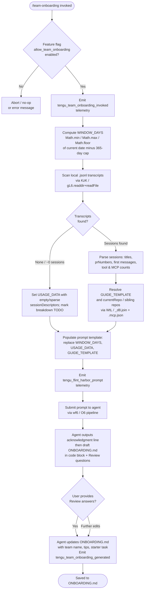

# `/team-onboarding`

> Analysis basis: CC v2.1.178 bundle.js (AST extraction + Claude interpretation)
> Minimum version: v2.1.178

---

## Overview

`/team-onboarding` generates a personalized `ONBOARDING.md` guide for new teammates by scanning the invoking user's local Claude Code session transcripts from the past configurable number of days, classifying their session history into work-type categories, and co-authoring the guide interactively with the user across multiple turns. The command is gated behind a feature flag (`allow_team_onboarding`) and is visible (non-hidden) in the command palette.

---

## Registration

| Field | Value |
|---|---|
| type | `prompt` |
| name | `team-onboarding` |
| description | `Help teammates ramp on Claude Code with a guide from your usage` |
| isHidden | `false` |
| handler_method | `getPromptForCommand` |
| handler_method_start (loc_byte) | `12485526` |
| handler_method_end (loc_byte) | `12486236` |
| loc_byte | `12485163` |
| loc_byte_end | `12486237` |
| loc_line | `8427` |
| prompt_body.length | `4539` characters |
| prompt_body.trace | `identifier→$ (local→1 ext vars)` |
| arbor_handler.name | `getPromptForCommand` |
| arbor_handler.fqn | `claude-2.1.178::getPromptForCommand` |
| arbor_handler.kind | `Method` |
| arbor_handler.resolution_path | `direct` |
| arbor_handler.n_hits | `2` |
| `handler_method_start` | `12485526` |
| `handler_method_end` | `12486236` |

Analysis basis: CC v2.1.178 bundle.js:+12485163

---

## Input Branching

The handler follows several distinct paths depending on feature-flag status, transcript data availability, and user interactions across turns. Five or more distinct branches are present.



Analysis basis: CC v2.1.178 bundle.js:+12485560, +12485786, +12485964, +12486082, +12486105

---

## Behavioral Spec

### 1. Feature-Flag Gate

Before any work begins, the handler checks the `allow_team_onboarding` feature flag (literal found at bundle.js:+10212525). If the flag is absent or false for the current account tier (`enterprise` / `team` literals at +2542445 and +2542480), the command does not proceed. The flag check is performed by `featureFlagChecker` (obfuscated: `wf6` / `M9`) which consults both a cached set and a live lookup.

```
function checkTeamOnboardingGate(accountContext):
    if not featureFlagChecker(accountContext, "allow_team_onboarding"):
        return abort()
    return proceed()
```

Analysis basis: CC v2.1.178 bundle.js:+10212525, +10212522

---

### 2. Window Computation

The handler computes the look-back window in days using clamped arithmetic:

```
function computeWindowDays(currentTimestampMs, configuredDays):
    rawDays = (currentTimestampMs - referenceMs) / MS_PER_DAY
    days = Math.floor(Math.min(Math.max(rawDays, 0), 365))
    return days
```

- The ceiling is **365 days** (literal at bundle.js:+12485775).
- `Math.min`, `Math.max`, and `Math.floor` are called directly in the handler at +12485729, +12485738, +12485747.
- `Date.now()` is called at +12485875 to anchor the computation.

Analysis basis: CC v2.1.178 bundle.js:+12485775, +12485729, +12485738, +12485747, +12485875

---

### 3. Transcript Scanning (`KzK`)

The transcript scanner (`transcriptScanner`, obfuscated: `KzK`) asynchronously reads the local Claude Code session log directory:

```
async function transcriptScanner(logDir, windowDays):
    entries = await fs.readdir(logDir)                     // gL6.readdir
    jsonlFiles = entries.filter(e => extname(e) == ".jsonl")  // Hd8.extname, literal ".jsonl" at +12474109
    results = await Promise.all(jsonlFiles.map(async file =>
        stat = await fs.stat(join(logDir, file))           // gL6.stat
        if not stat.isFile(): return null
        content = await fs.readFile(join(logDir, file))    // gL6.readFile
        return parseTranscriptFile(content)
    ))
    return results.filter(Boolean)
```

Within each transcript file the scanner:
- Splits content into lines and applies regex patterns (`DtL.exec` at +12474829, `jtL.exec` at +12474885, `JtL.exec` at +12475060) to extract session metadata.
- Detects MCP tool calls by scanning for the string fragment `"name":"mcp__` (literal at +12474688).
- Detects multi-content assistant turns via `"content":[` (literal at +12475038).
- Records messages where the `startsWith` prefix length is at least **3 characters** (literal at +12475141) as first-user-message candidates.
- Resolves the remote origin URL of the current repo by running `git config user.name` and `git remote get-url origin` (literals at +12476843, +12476859, +12476915, +12476924, +12476934) via the `gitRepoResolver` helper (`Q_`).
- Reads `.mcp.json` (literal at +12476220) from the project directory to enumerate MCP server names and URL origins (key `mcpServers` at +12476276).

Analysis basis: CC v2.1.178 bundle.js:+12474022, +12474092, +12474109, +12474128, +12474193, +12474365, +12474688, +12475038, +12475141, +12476220, +12476276

---

### 4. Prompt Assembly and Template Substitution

After scanning, the handler calls `replaceAll` (at +12485973) to substitute three template placeholders in the prompt body:

| Placeholder | Substitution |
|---|---|
| `{{WINDOW_DAYS}}` | Computed integer day count (literal at +12485986) |
| `{{USAGE_DATA}}` | JSON-serialized `sessionDescriptors` array (literal at +12486061) |
| `{{GUIDE_TEMPLATE}}` | Resolved `ONBOARDING.md` Markdown template string (literal at +12486026) |

The final assembled string is passed to the agent as the prompt body via the `submitPromptToAgent` pipeline (`wf6` → `O6`).

Analysis basis: CC v2.1.178 bundle.js:+12485973, +12485986, +12486026, +12486061, +12486082

---

### 5. Agent Instruction Sequence (from prompt body)

The prompt body (4539 characters, traced as `identifier→$ (local→1 ext vars)`) instructs the agent to execute the following ordered steps:

**Step 1 — Immediate acknowledgment line.** The agent must emit a single fixed blockquote line referencing the look-back window as the very first visible output — before any reasoning, tool calls, or classification work. This requirement is stated emphatically in the prompt to reduce perceived latency ("the guide creator is staring at a blank screen").

**Step 2 — Work-type classification.** The agent reads the `sessionDescriptors` array injected into `{{USAGE_DATA}}` and classifies each session into one of seven canonical task types:

| Task Type (internal) | Display Name | Description |
|---|---|---|
| `build_feature` | Build Feature | New functionality, scripts, tools, CI/env setup |
| `debug_fix` | Debug Fix | Investigating and fixing bugs |
| `improve_quality` | Improve Quality | Refactoring, tests, cleanup, code review |
| `analyze_data` | Analyze Data | Queries, metrics, number crunching |
| `plan_design` | Plan Design | Architecture, approach, design review, unfamiliar code |
| `prototype` | Prototype | Spikes, POCs, throwaway exploration |
| `write_docs` | Write Docs | PRDs, RFCs, READMEs, design docs, doc/copy review |

Classification rules:
- Use session title and first user message as primary signals; PR numbers and tool/MCP counts are enrichment only.
- New categories are invented only when no existing type fits.
- The agent selects the **top 3–5 types with rough percentages**.
- If `sessionDescriptors` is empty or near-empty, the breakdown section is left as `TODO`.
- Display names use spaces and title case in the rendered guide.

**Step 3 — Data gathering.** The agent resolves the team/repo name from `currentRepo`, scans workspace sibling directories, and infers MCP server access from the injected server list. Team Tips and Get Started sections are left as `TODO` placeholders pending the Review step.

**Step 4 — Write guide to `ONBOARDING.md`.** The agent fills in the `{{GUIDE_TEMPLATE}}` structure with real numbers. ASCII bar charts use `█` (filled) and `░` (empty) characters at 20 characters wide. The `generatedBy` field (from usage data) is used for the author name; if absent, the name is omitted. An HTML comment at the bottom of the template is preserved verbatim.

**Step 5 — Render and review turn.** The agent:
1. Renders the completed guide inside a fenced code block.
2. Appends a `---` horizontal rule and a `**Review**` heading.
3. Asks exactly three numbered questions: team name confirmation, a starter task link, and any team tips not already in `CLAUDE.md`.

**Step 6 — Incorporate feedback and save.** After the user responds, the agent updates `ONBOARDING.md` with supplied team name, tips, and starter task, then closes with the exact prescribed completion line referencing the saved file and instructing the user to share it.

Analysis basis: CC v2.1.178 bundle.js:+12485163 (prompt body, length 4539)

---

### 6. Prompt Submission Pipeline

```
function submitPromptToAgent(assembledPrompt, context):
    harborEvent = buildHarborEvent(context)          // O6 / flint harbor
    emitTelemetry("tengu_flint_harbor_prompt")       // at +12485563
    sessionRecord = createOrFetchSession(context)    // via S6 / wO8 pipeline
    result = sendPromptToSession(assembledPrompt, sessionRecord)
    emitTelemetry("tengu_team_onboarding_generated") // at +12486105 on success
    return result
```

The session layer (`S6` → `wO8`) handles transcript-file locking, config reads with lock-contention handling, and backup rotation (up to **5 backup copies**, literal at +3349842; backup filename contains `.backup.` at +3349709).

Analysis basis: CC v2.1.178 bundle.js:+12485563, +12485560, +12486082, +12486105, +3349842, +3349709

---

### 7. Git Identity and Repo Resolution (`Q_`)

```
async function resolveGitIdentity(workspaceDir):
    userName = await runGit(["config", "user.name"])         // literals at +12476859
    remoteUrl = await runGit(["remote", "get-url", "origin"]) // literals at +12476924, +12476934
    repoName  = basename(workspaceDir)                        // _d8.basename at +12477031
    return { userName, remoteUrl, repoName }
```

The `_yH` helper normalises remote URLs: strips a `git/` prefix (literal at +1149610), lowercases the result, and splits on `/` (taking the last 4 path segments, literal at +1149633).

Analysis basis: CC v2.1.178 bundle.js:+12476843, +12476850, +12476859, +12476915, +12476924, +12476934, +12477031, +1149610, +1149633

---

## State & Side Effects

| Item | Detail |
|---|---|
| Telemetry: `tengu_team_onboarding_invoked` | Fired at handler entry (bundle.js:+12485786) |
| Telemetry: `tengu_flint_harbor_prompt` | Fired when prompt is submitted to the agent pipeline (bundle.js:+12485563) |
| Telemetry: `tengu_flint_harbor_share` | Fired via `O6` share path (bundle.js:+10212587) |
| Telemetry: `tengu_team_onboarding_generated` | Fired when guide generation succeeds (bundle.js:+12486105) |
| Telemetry: `tengu_config_lock_contention` | Fired if config-file lock takes longer than expected (bundle.js:+3348912) |
| Telemetry: `tengu_config_stale_write` | Fired on stale config write attempt (bundle.js:+3349048) |
| Telemetry: `tengu_config_auth_loss_prevented` | Fired when a write that would erase auth credentials is blocked (bundle.js:+3349391) |
| Telemetry: `tengu_config_parse_error` | Fired on JSON parse failure in config (bundle.js:+3351487) |
| Telemetry: `tengu_config_fallback_write` | Fired when config falls back to a safe write path (bundle.js:+3348528) |
| File written | `ONBOARDING.md` in the current working directory (created/overwritten by agent tool call) |
| Config reads | Global config accessed via locked read (see `wO8` / `_MH`); up to 5 backup copies rotated |
| Feature flag check | `allow_team_onboarding` queried against account context before invocation proceeds |
| Hook registration | `F9` calls `XSA.register` (bundle.js:+66308) — file-watch hook registered on config file path |
| `.mcp.json` read | Project-level MCP server config read from `_d8.join(workspaceDir, ".mcp.json")` (bundle.js:+12476209, +12476220) |
| `ONBOARDING.md` backup | Existing file is backed up with `.backup.` infix and timestamp before overwrite (bundle.js:+3349709, +3351977, +3351995) |

---

## Version History

| Version | Change |
|---|---|
| v2.1.178 | Initial analysis |

---

## Common Mistakes

1. **Invoking without the feature flag enabled.** `/team-onboarding` is gated by `allow_team_onboarding`. Accounts on plans that do not include this flag will see no output or a silent abort. Check plan tier (`enterprise` or `team`) before expecting the command to function.

2. **Running from a directory with no `.jsonl` transcripts.** If Claude Code has no local session files in the expected log directory, `USAGE_DATA` will be empty and the guide's work-type breakdown will be left as `TODO`. Run the command from a workspace that has been actively used with Claude Code.

3. **Expecting an instant guide without engagement.** The command is deliberately interactive: it produces a draft and then asks three review questions before finalising `ONBOARDING.md`. Closing the session after the first response will leave the file without team name, tips, or a starter task.

4. **Confusing the look-back window cap.** The window is capped at **365 days** regardless of how long the user has been running Claude Code. Passing a larger value externally has no effect — the `Math.min` clamp enforces the ceiling.

5. **Editing `ONBOARDING.md` externally mid-session.** The config/file-write layer uses file locking and backup rotation. Concurrent external edits during the session may trigger `tengu_config_lock_contention` telemetry and could result in the agent's write being blocked or falling back to the safe-write path.

6. **Misinterpreting task-type display names.** The prompt uses underscore-delimited internal names (`build_feature`, `write_docs`, etc.) but instructs the agent to render them with spaces and title case in the final guide. A guide showing `build_feature` verbatim indicates the agent did not follow the rendering instruction.

---

## Appendix — Identifier Mapping

> For bundle debugging only. Identifiers change across versions.

| Identifier | Role |
|---|---|
| `__handler_team-onboarding` | Synthetic BFS entry point for the command handler (see `getPromptForCommand`) |
| `O6` | Flint Harbor prompt submission / session dispatch entry point |
| `vG6` | Session dispatch helper (depth-1 callee of O6) |
| `NG6` | Session dispatch helper (depth-1 callee of O6) |
| `Xp` | Session pipeline stage |
| `qp` | Inner session pipeline helper |
| `ib` | Session initialisation helper |
| `o$8` | Session deduplication / cache-check helper |
| `p0_` | Session record creation helper |
| `pkH` | Session key/ID helper |
| `Yg` | Random-bytes session ID generator |
| `xH` | JSON serialisation helper (wraps `JSON.stringify`) |
| `hhf` | Session hook/finalisation helper |
| `ay_` | Session async-flow coordinator |
| `Gd1` | Auth/config accessor for session |
| `d_` | File descriptor helper |
| `o79` | Session option resolver |
| `Ql` | Permission-set membership checker |
| `S6` | Config read-with-lock entry point |
| `n6` | Logger / diagnostic emitter |
| `$k_` | Config schema accessor |
| `_MH` | Config file reader (readFileSync, JSON parse, backup) |
| `q` | Filesystem module reference (readFileSync, statSync, etc.) |
| `i6` | JSON.parse wrapper |
| `Rm` | String prefix-strip helper |
| `_` | Filesystem / string utility reference |
| `Z8` | Error classification / throw helper |
| `WL9` | Directory-walk / sibling-repo scanner |
| `N` | Message/colour formatter |
| `d` | Async task or process handle |
| `zk_` | Path join + mkdir helper |
| `D` | Background daemon session manager |
| `wnf` | File-watch registration helper |
| `ug` | Watch callback / debounce helper |
| `F9` | Hook registrar (calls `XSA.register`) |
| `W8` | Transcript collection orchestrator (calls `wO8` per file) |
| `wO8` | Per-transcript-file reader and parser |
| `f` | Filesystem module (mkdirSync, statSync, etc. — distinct from `q`) |
| `L` | Stream / connection closer |
| `tR1` | Transcript record builder (calls `v2_`) |
| `v2_` | Low-level transcript record constructor |
| `JsH` | JSON schema validator |
| `A` | Case-normalisation / identity map helper |
| `V` | Viewport / UI dimension helper |
| `S` | Terminal output writer |
| `E` | Viewport boundary clamp helper |
| `P` | IPC / socket protocol handler |
| `X` | Socket read-buffer helper |
| `j` | Process group kill helper |
| `lL` | Stream-end / flush helper |
| `Gb5` | Daemon IPC message dispatcher |
| `TH` | String coercion helper |
| `ED6` | Atomic file write helper (write + fsync + rename) |
| `O` | Symbolic-link / stat helper |
| `x8` | Error status wrapper |
| `H` | Retry-with-jitter helper |
| `gXH` | Git-related helper |
| `PL9` | Object-entries iterator |
| `CG6` | Timestamp recorder |
| `YO8` | Config write helper (with auth-loss guard) |
| `dH` | Deferred / promise helper |
| `c36` | Micro-task scheduler |
| `GtL` | Top-level usage-data assembler (calls `KzK`, `WtL`, `Q_`, etc.) |
| `W_` | Terminal title helper |
| `TT` | Terminal title setter |
| `bb` | Project-path resolver |
| `cy` | Config directory path builder |
| `cY` | UUID-to-path converter |
| `Pd4` | Absolute-value / string-hash helper |
| `KzK` | Async transcript directory scanner (readdir + readFile + parse) |
| `O1` | Error status helper |
| `K` | Padded-string formatter |
| `$` | Session-stream / event emitter |
| `xGK` | Stream state helper |
| `z` | Daemon control interface |
| `SH` | Daemon feature-ok reporter |
| `bH` | Daemon feature-bad reporter |
| `AR` | Anthropic API request builder |
| `aB` | Process-exit / shutdown coordinator |
| `w` | Forced-shutdown abort controller |
| `bX` | Background session abort helper |
| `WtL` | `.mcp.json` reader / MCP server config parser |
| `PtL` | Post-transcript-load processor |
| `Q_` | Git identity and repo resolver (runs `git config`, `git remote get-url`) |
| `shH` | Child-process spawn wrapper |
| `gaA` | Process argument builder |
| `lL_` | Process stdin handler |
| `nL_` | Process stdout handler |
| `rL_` | Process stderr handler |
| `ooA` | Numeric validation helper |
| `VD6` | Child-process error classifier |
| `cL_` | Reflect-based property interceptor |
| `NaA` | Process exit-event listener |
| `roA` | Process timeout helper |
| `aoA` | Process kill coordinator |
| `noA` | Process signal handler |
| `ioA` | Process SIGKILL sender |
| `VaA` | Process stream collector |
| `yD6` | Process output transformer |
| `EaA` | Stdout pipe helper |
| `ZaA` | Stderr aggregator |
| `HaA` | Process lifecycle binder |
| `Ol4` | String coercion for process output |
| `D5` | Diagnostic / debug logger |
| `RH` | Error logger (logError) |
| `jA` | Error constructor helper |
| `L6` | String coercion helper |
| `qq` | Queue / ring-buffer helper |
| `RQ4` | Ring-buffer shift/push helper |
| `_yH` | Remote-URL normaliser (trim, match, lowercase, split) |
| `Ul4` | URL segment extractor |
| `Z9` | String index/slice helper |
| `wf6` | Feature-flag-gated prompt submission entry point |
| `M9` | Feature-flag checker (checks `allow_team_onboarding`) |
| `hc1` | Flag-result resolver |
| `Tt` | Flag-value accessor |
| `ab` | Auth/account context provider |
| `S_` | Account tier resolver |
| `Y7` | API credential helper |
| `SO` | Anthropic API client factory |
| `Qj` | API request executor |
| `eLH` | Error log formatter for API errors |
| `FW` | Final prompt delivery to session stream |

---

*Note: index built via Arbor fallback; some signals (telemetry, literals) may be missing — see arbor-fallback.js.*