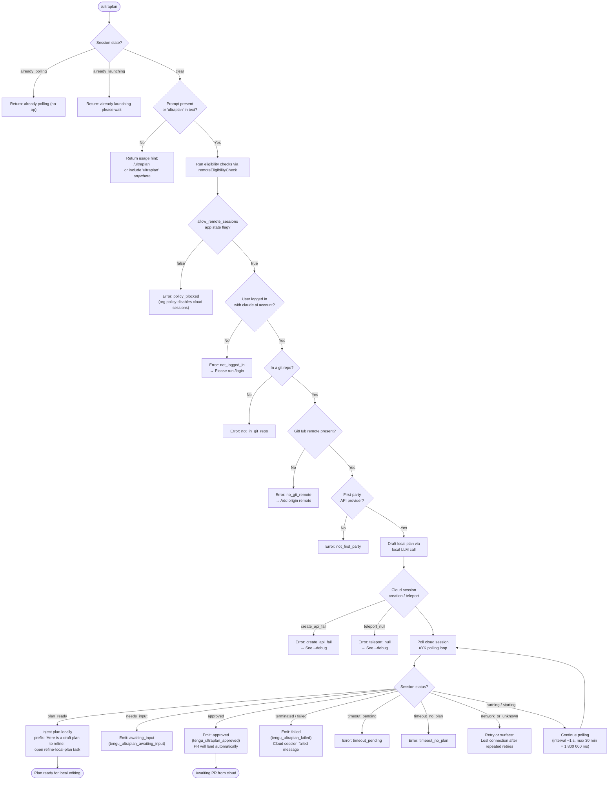

# `/ultraplan`

> Analysis basis: CC v2.1.178 bundle.js (AST extraction + Claude interpretation)
> Minimum version: v2.1.178

---

## Overview

`/ultraplan` drafts an editable planning document via a remote cloud session launched from Claude Code on the web. The command validates local preconditions (login, Git repository, GitHub remote, org policy), teleports the current repository state to a cloud environment, waits for the remote agent to produce a plan, then surfaces that plan locally as an editable artifact. The entire lifecycle — from preflight checks through cloud session polling and local plan injection — is managed by the async handler `oH5`.

---

## Registration

| Field | Value |
|---|---|
| type | `local-jsx` |
| name | `ultraplan` |
| description | `Draft an editable plan in Claude Code on the web ( ... ) · See ...` |
| argumentHint | `<prompt>` |
| load_inline | `true` |
| load_ident | `oH5` |
| loc_byte | `12617500` |
| loc_byte_end | `12617732` |
| loc_line | `8548` |
| arbor_handler.name | `oH5` |
| arbor_handler.fqn | `claude-2.1.178::oH5` |
| arbor_handler.kind | `AsyncFunction` |
| arbor_handler.resolution_path | `load_ident` |
| arbor_handler.n_hits | `1` |

Analysis basis: CC v2.1.178 bundle.js:+12617500

The handler is inlined via `load: () => Promise.resolve({ call: oH5 })`. Arbor resolved the symbol directly through the `load_ident` path with a single unambiguous hit.

---

## Input Branching

The command has more than three distinct branching paths (duplicate-session guard, usage-hint fallback, remote eligibility checks, cloud session lifecycle states), so a Mermaid flowchart is used.



Analysis basis: CC v2.1.178 bundle.js:+12615634 (handler entry), +12613081 (already_polling), +12613099 (already_launching), +12613146 (usage hint), +12615655 (allow_remote_sessions check)

---

## Behavioral Spec

### 1 — Handler Entry and Duplicate-Session Guard

```
async function ultraplanHandler(context):
    sessionState = getAppState("ultraplan")

    if sessionState == "already_polling":
        return  // silent no-op

    if sessionState == "already_launching":
        showMessage("ultraplan: already launching. Please wait for the session to start.")
        return

    promptText = extractPrompt(context.args)

    if not promptText and "ultraplan" not in context.fullMessage:
        showMessage(
            'Usage: /ultraplan <prompt>, or include "ultraplan" anywhere in your prompt'
        )
        return

    setAppState("ultraplan", "launching")
    result = await launchRemoteSession(promptText, context)
    setAppState("ultraplan", result.finalState)
```

Analysis basis: CC v2.1.178 bundle.js:+12615634, +12613081, +12613099, +12613146, +12615969, +12616191

---

### 2 — Prompt Extraction (extractArguments / normalizePrompt)

The handler calls `IU8` (argument extraction) which in turn calls `kU8` → `tMA`. The logic:

```
function extractArguments(rawInput):
    // tMA: scan rawInput for "ultraplan" keyword (case-insensitive, global flag "gi")
    if rawInput.startsWith(commandPrefix):
        tail = rawInput.slice(prefixLength)           // remove "/ultraplan"
        normalized = tail.replace(capturePattern, "$1$2")  // collapse whitespace
        if normalized.length <= 5:
            return null                               // too short → show usage
        return normalized

    // fallback: match all occurrences of "ultraplan" in free text
    matches = rawInput.matchAll(/ultraplan/gi)
    if any match exists:
        return rawInput   // pass full text through
    return null
```

Analysis basis: CC v2.1.178 bundle.js:+10898416 (startsWith), +10898814 (regex flag "gi"), +10899166 ("ultraplan" string), +10899491 ("$1$2" replacement), +10899514 (length ≤ 5 guard), +10898822 (matchAll)

---

### 3 — Remote Eligibility Checks (remoteEligibilityCheck)

`M9` performs a sequential gate-check before any network call is attempted:

```
function remoteEligibilityCheck(appState):
    // Gate 1: org policy
    if not appState.allow_remote_sessions:
        return { error: "policy_blocked",
                 message: "Cloud sessions are disabled by your organization's policy. ..." }

    // Gate 2: login / account type
    authStatus = getAuthStatus()   // hc1 → Tt
    if not authStatus.loggedIn:
        return { error: "not_logged_in",
                 message: "Please run /login and sign in with your Claude.ai account (not Console)." }

    // Gate 3: first-party provider
    if not authStatus.isFirstParty:
        return { error: "not_first_party",
                 message: "Cloud sessions are only available on the first-party Anthropic API provider." }

    // Gate 4: git repository present
    if not inGitRepo():
        return { error: "not_in_git_repo" }

    // Gate 5: GitHub remote
    remoteURL = getGitRemoteOriginURL()   // xb reads "remote.origin.url"
    if not remoteURL:
        return { error: "no_git_remote",
                 message: "Cloud agents require a GitHub remote. Add one with `git remote add origin REPO_URL`." }

    // Gate 6: GitHub app installed (ZxH)
    if not githubAppInstalled(authStatus):
        return { error: "github_app_not_installed" }

    return { ok: true }
```

Analysis basis: CC v2.1.178 bundle.js:+12615655 ("allow_remote_sessions"), +9899520 ("not_logged_in"), +9899542 (login message), +9885436 ("not_first_party" message), +9899621 ("not_in_git_repo"), +9899755 ("no_git_remote"), +9899777 (GitHub remote message), +9899868 ("github_app_not_installed"), +1146309 ("remote.origin.url")

---

### 4 — Local Plan Drafting (draftLocalPlan)

Before launching the remote session, `rH5` drives the local LLM to produce a draft plan that is prefixed with a fixed marker string:

```
function draftLocalPlan(prompt):
    fragments = []
    fragments.push("Here is a draft plan to refine:")   // fixed prefix
    planText  = callLocalLLM(prompt, taskType="plan")   // via dH5 → QH5 → BH5
    fragments.push(planText)
    return fragments.join("\n")
```

The plan fragment is tagged with a task-notification sub-type (`"task-notification"`) and a precondition category (`"precondition"`). The local-plan identifier carries the label `"Refine local plan"` with sub-type `"plan"`. Analysis basis: CC v2.1.178 bundle.js:+12608695 ("Here is a draft plan to refine:"), +12613674 ("precondition"), +12613850 ("task-notification"), +12614006 ("Refine local plan"), +12614041 ("plan"), +12608688 (q.push), +12608778 (q.join)

---

### 5 — Teleport / Cloud Session Launch (launchRemoteSession)

`uB6` orchestrates the full "teleport" sequence:

```
async function launchRemoteSession(prompt, context):
    // 5a. Eligibility re-check
    eligibility = remoteEligibilityCheck(appState)
    if eligibility.error:
        emit("tengu_ultraplan_create_failed", { reason: eligibility.error })
        return { error: eligibility.error }

    // 5b. Repository source decision (teleportSourceDecision)
    //     Tries in order: explicit_source_url → git_repository → bundle → no_source
    source = resolveRepositorySource()   // vd8 → Vd8 → O6
    emit("tengu_teleport_source_decision", { mode: source.type })

    // 5c. If git source: upload bundle (Z4A)
    if source.type == "git_repository":
        uploadResult = await uploadGitBundle(source)
        emit("tengu_ccr_bundle_upload", uploadResult)
        // bundle upload uses refs: refs/seed/stash, refs/seed/root
        // temporary file: ccr-seed.bundle / _source_seed.bundle

    // 5d. If byoc environment: skip preflight when "byoc_env_skip_preflight" is set
    //     Otherwise run GitHub preflight (ZxH)

    // 5e. Create remote session via POST (LB → zA.post)
    //     Headers include: anthropic-beta: "ccr-byoc-2025-07-29"
    //                      x-organization-uuid: <orgUUID>
    sessionResponse = await createCloudSession({
        prompt: prompt,
        source: source,
        branchName: detectedBranch,    // iy: reads symbolic-ref --short refs/remotes/origin/HEAD
    })

    if not sessionResponse.sessionId:
        return { error: "malformed_response",
                 message: "Server returned a malformed session response (no session id)" }

    emit("tengu_ultraplan_launched")
    return { sessionId: sessionResponse.sessionId }
```

Analysis basis: CC v2.1.178 bundle.js:+12612822, +12612857, +12612899, +12613235, +12613289, +12613349, +9886329 ("anthropic-beta"), +9886346 ("ccr-byoc-2025-07-29"), +9886368 ("x-organization-uuid"), +9869738 ("teleport_git_bundle_upload"), +9869839 ("refs/seed/stash"), +9869857 ("refs/seed/root"), +9871034 ("ccr-seed"), +9871341 ("_source_seed.bundle"), +12614566 (tengu_ultraplan_launched)

---

### 6 — Environment Selection (selectEnvironment)

`LB` implements a multi-step environment resolver that runs after source decisions:

```
async function selectEnvironment(orgUUID, accessToken, source):
    envList = await listEnvironments(orgUUID)  // NHH → zA.get
    // Timeout for env list: 15 000 ms (bundle.js:+7140789)

    if no envList or envList empty:
        // auto-create default environment (fA6 → zA.post)
        newEnv = await createDefaultEnvironment(orgUUID)
        // default env name: "Default" / "Default - trusted network access"
        // runtime: python 3.11, node 20, homedir /home/user
        if creation fails:
            warn("Could not create a cloud environment. Set one up at https://claude.ai/code/onboarding?magic=env-setup")
            return { error: "no_default_env" }

    // Prefer "bridge" type env if available
    selectedEnv = envList.find(e => e.type == "bridge") ?? envList[0]
    if not selectedEnv:
        return { error: "no_environments",
                 message: "No environments available for session creation" }
    return selectedEnv
```

Analysis basis: CC v2.1.178 bundle.js:+7140154 ("teleport_environments_list"), +7140789 (15000 ms timeout), +7141049 ("Default"), +7141074 ("teleport_default_environment_create"), +7141595 ("/home/user"), +7141657 ("python"), +7141674 ("3.11"), +7141688 ("node"), +7141703 ("20"), +9888568 (onboarding URL), +9889482 ("no_default_env"), +9889548 ("bridge"), +9889707 ("no_environments")

---

### 7 — Cloud Session Polling (pollCloudSession)

`cH5` drives a long-poll loop via `uYK`. Timing constants:

- Poll interval: **~1 000 ms** (bundle.js:+9906162)
- Max session duration: **1 800 000 ms (30 minutes)** (bundle.js:+9906169)
- Ultraplan-specific timeout: **5 400 s** (bundle.js:+12608388)

```
async function pollCloudSession(sessionId, timeoutSeconds):
    startTime = Date.now()
    while true:
        elapsed = Date.now() - startTime
        if elapsed > timeoutSeconds * 1000:
            emit("tengu_ultraplan_timeout_seconds", { elapsed })
            return { status: "timeout_no_plan" or "timeout_pending" }

        response = await fetchSessionStatus(sessionId)   // uYK → f.ingest
        status = response.status

        switch status:
            case "plan_ready":
                emit("tengu_ultraplan_plan_ready")
                return { status: "plan_ready", plan: response.plan }

            case "needs_input":
                emit("tengu_ultraplan_awaiting_input")
                // surface wait message to user

            case "approved":
                emit("tengu_ultraplan_approved")
                // inform user PR is landing; nothing further needed locally

            case "terminated" | "failed":
                emit("tengu_ultraplan_failed")
                return { status: "failed" }

            case "requires_action":
                // surface action prompt

            case "running" | "starting" | "idle":
                await sleep(1000)
                continue

            case "network_or_unknown":
                // retry up to threshold; then surface:
                // "Lost connection to the cloud session after repeated retries — the session may still be running"
                await sleep(backoff)
                continue
```

Analysis basis: CC v2.1.178 bundle.js:+12608388 (5400), +9906162 (1000 ms), +9906169 (1800000 ms), +12599216 (Date.now in poller), +12599355 (Error), +12599580 (LoH), +12599640 ("network_or_unknown"), +12599714 (lost connection message), +12600404 ("plan_ready"), +12600419 ("needs_input"), +12600027 ("approved"), +12600214 ("terminated"), +12600352 ("requires_action"), +12600757 ("timeout_pending"), +12600775 ("timeout_no_plan")

---

### 8 — Plan Injection and Local Refine Task

When polling returns `plan_ready`, the handler surfaces the plan locally:

```
function injectPlanLocally(plan, sessionState):
    // Inject plan text with marker prefix into local conversation
    // Opens "Refine local plan" sub-task (type="plan")
    // Label: "Ultraplan" (used in UI heading)
    // Post-injection message to agent:
    //   "Results will land as a pull request when the cloud session finishes.
    //    There is nothing to do here."
    showPlanEditor(plan, taskType="plan", label="Ultraplan")
    emit("tengu_ultraplan_plan_ready")
```

Analysis basis: CC v2.1.178 bundle.js:+12608695 ("Here is a draft plan to refine:"), +12614006 ("Refine local plan"), +12614730 ("Ultraplan"), +12609976 ("Results will land as a pull request…"), +12609066 (tengu_ultraplan_plan_ready), +12609486 (tengu_ultraplan_approved)

---

### 9 — Error Surface and Cleanup

```
function handleLaunchError(errorCode, details):
    switch errorCode:
        case "create_api_fail":
        case "teleport_null":
            showMessage("<error detail>. See --debug for details.")
            emit("tengu_ultraplan_create_failed")

        case "unexpected_error":
            // 1500 ms delay before surfacing
            showMessage("Ultraplan hit an unexpected error during launch. Wait for the user's next instructions.")

    // If an orphaned session is detected, attempt to archive it
    // Log: "ultraplan: failed to archive orphaned session" on failure

    // Clear state
    setAppState("ultraplan", "skip")
```

Analysis basis: CC v2.1.178 bundle.js:+12614242 ("create_api_fail"), +12614260 ("teleport_null"), +12614342 ("See --debug for details."), +12614986 ("unexpected_error"), +12615158 (unexpected error message), +12615319 ("ultraplan: failed to archive orphaned session"), +12614915 (1500 ms delay), +12616309 ("skip"), +12612859 (tengu_ultraplan_create_failed)

---

### 10 — GitHub App and Branch Detection

```
function checkGithubAppInstalled(accessToken, orgUUID):
    // ZxH: calls GET endpoint
    if not accessToken:
        log("checkGithubAppInstalled: No access token found, assuming app not installed")
        return false
    if not orgUUID:
        log("checkGithubAppInstalled: No org UUID found, assuming app not installed")
        return false
    response = await apiGet(endpoint)
    // HTTP 400 → treat as "is not" installed
    return response.installed   // logs "is" or "is not"

function detectCurrentBranch():
    // iy: git symbolic-ref --short refs/remotes/origin/HEAD
    // Falls back to "main" or "master" if not found
    // show-ref --quiet used to verify branch existence
    return branchName
```

Analysis basis: CC v2.1.178 bundle.js:+7142525 (no access token log), +7142638 (no org UUID log), +7143036 ("is"), +7143041 ("is not"), +7143296 (400), +1157467 ("symbolic-ref"), +1157482 ("--short"), +1157492 ("refs/remotes/origin/HEAD"), +1157605 ("main"), +1157612 ("master"), +1157674 ("show-ref"), +1157696 ("--quiet")

---

## State & Side Effects

| Item | Detail |
|---|---|
| Telemetry | `tengu_ultraplan_create_failed` (bundle.js:+12612859) |
| Telemetry | `tengu_ultraplan_prompt_identifier` (bundle.js:+12608521) |
| Telemetry | `tengu_ultraplan_launched` (bundle.js:+12614566) |
| Telemetry | `tengu_ultraplan_timeout_seconds` (bundle.js:+12608354) |
| Telemetry | `tengu_ultraplan_awaiting_input` (bundle.js:+12608998) |
| Telemetry | `tengu_ultraplan_plan_ready` (bundle.js:+12609066) |
| Telemetry | `tengu_ultraplan_approved` (bundle.js:+12609486) |
| Telemetry | `tengu_ultraplan_failed` (bundle.js:+12610375) |
| Telemetry | `tengu_ccr_bundle_seed_enabled` (bundle.js:+7145021) |
| Telemetry | `tengu_ccr_bundle_upload` (bundle.js:+9870031) |
| Telemetry | `tengu_teleport_bundle_mode` (bundle.js:+9886690) |
| Telemetry | `tengu_ccr_session_link` (bundle.js:+9880014) |
| Telemetry | `tengu_teleport_source_decision` (bundle.js:+9892153) |
| Telemetry | `tengu_config_parse_error` (bundle.js:+3351487) |
| Telemetry | `tengu_bg_dispatch_sigkill_escalate` (bundle.js:+17066047) |
| Telemetry | `tengu_scheduled_task_missed` (bundle.js:+16547141) |
| Telemetry | `tengu_feature_bad` / `tengu_feature_ok` (bundle.js:+1020220, +1020153) |
| Telemetry | `tengu_bg_low_mem_mb`, `tengu_bg_dispatch_low_mem` (bundle.js:+13436992, +17066648) |
| Telemetry | `tengu_bg_spare_enable`, `tengu_bg_spare_claim`, `tengu_bg_spare_claim_fail` (bundle.js:+17067352, +17067480, +17067746) |
| Telemetry | `tengu_bg_sendclaim_failed` (bundle.js:+17042597) |
| appState reads | `_.getAppState` — reads `"ultraplan"` and `"allow_remote_sessions"` flags (bundle.js:+12615969, +12615655) |
| appState writes | `_.setAppState` — writes session lifecycle state (`"launching"`, `"skip"`, etc.) (bundle.js:+12616191) |
| File I/O | Git bundle files: `ccr-seed.bundle`, `_source_seed.bundle`; unlinked after upload (bundle.js:+9871034, +9871341, +9871986) |
| File I/O | Config read via `readFileSync` with UTF-8 encoding; backup copies via `copyFileSync` (bundle.js:+2542530, +2542553, +3351995) |
| Network | `zA.post` for session creation; `zA.get` for environment list and GitHub checks; `zA.isAxiosError` / `zA.isCancel` for error classification (bundle.js:+9887555, +7140709, +9895199) |
| Background daemon | Spawns / claims spare background worker (`yc.spawn`, `yc.claim`); uses PTY socket with `ls8.connect` and kill signals `SIGTERM` / `SIGKILL` (bundle.js:+17067809, +17067459, +17042396, +17042835, +17066095) |
| Hook registration | `XSA.register` used by `F9` for task-notification hook wiring (bundle.js:+66308) |
| Sound / UI | No sound events found in depth-2 traversal; plan injected into local editor UI as `"Ultraplan"` label (bundle.js:+12614730) |
| Session timeout | Hard limit: 1 800 000 ms (30 min) cloud session; ultraplan poller timeout: 5 400 s; env-list timeout: 15 000 ms (bundle.js:+9906169, +12608388, +7140789) |

---

## Version History

| Version | Change |
|---|---|
| v2.1.178 | Initial analysis — full ultraplan lifecycle including teleport, bundle upload, cloud polling, and local plan injection |

---

## Common Mistakes

1. **Not logged in with a claude.ai account**: `/ultraplan` requires a Claude.ai account login (`/login`), not an API key. API key authentication is explicitly rejected with a descriptive message. Analysis basis: CC v2.1.178 bundle.js:+7140358
2. **No GitHub remote configured**: The command requires a GitHub remote (`origin`) even when the repository is otherwise valid. Running `/ultraplan` in a repo with no remote will fail with `no_git_remote`. Analysis basis: CC v2.1.178 bundle.js:+9899755
3. **Organization policy blocks cloud sessions**: If the `allow_remote_sessions` flag is `false` in app state (set by org admin), the command exits immediately with `policy_blocked`. Individual users cannot override this. Analysis basis: CC v2.1.178 bundle.js:+12615655, +9900045
4. **Invoking while a session is already launching**: Typing `/ultraplan` again before the first session completes returns the "already launching — please wait" guard message and takes no further action. Analysis basis: CC v2.1.178 bundle.js:+12613099, +12611634
5. **Empty or too-short prompt**: Providing a prompt of 5 characters or fewer after stripping the command prefix triggers the usage hint rather than launching a session. Analysis basis: CC v2.1.178 bundle.js:+10899514
6. **No commits in repository**: A repo with no commits produces an `empty_repo` error during bundle upload. You must run `git add . && git commit -m "initial"` first. Analysis basis: CC v2.1.178 bundle.js:+9869767, +9891582
7. **Third-party API provider**: If Claude Code is configured to use a non-Anthropic API endpoint, cloud sessions are unavailable (`not_first_party`). Analysis basis: CC v2.1.178 bundle.js:+9885436, +9885515

---

## Appendix — Identifier Mapping

> For bundle debugging only. Identifiers change across versions.

| Identifier | Role |
|---|---|
| `oH5` | Main async handler for `/ultraplan` (Arbor-resolved entry point) |
| `IU8` | Argument extraction / prompt normalizer |
| `kU8` | Inner argument parsing helper |
| `tMA` | Prompt scanning and "ultraplan" keyword matcher |
| `M9` | Remote eligibility check orchestrator |
| `hc1` | Auth status reader |
| `Tt` | Auth token / account type resolver |
| `ab` | Account type classifier (firstParty, enterprise, team) |
| `K26` | Config file reader (readFileSync, UTF-8) |
| `M5H` | Provider / plan type checker |
| `qq` | Telemetry level resolver |
| `biA` | Telemetry mode helper |
| `L6` | String converter utility |
| `eLH` | Error-log helper |
| `h6H` | App-state accessor shorthand |
| `uB6` | Remote session launch orchestrator ("teleport" outer shell) |
| `dYK` | Session deduplication / orphan cleanup |
| `vd8` | Repository source decision driver |
| `Vd8` | Source-decision inner resolver |
| `O6` | Git repository detection and classification |
| `FH5` | Source selection fallback handler |
| `rH5` | Full teleport-to-remote workflow (env select → bundle upload → POST → poll) |
| `K4H` | Precondition check aggregator |
| `L1q` | Background eligibility / byoc check runner |
| `j9` | Timeout/timer utility |
| `dH5` | Local plan fragment assembler |
| `QH5` | Local LLM plan generator |
| `BH5` | Plan generation inner call |
| `LB` | Core cloud session creation and management function |
| `u6` | App context / config accessor |
| `E4` | Session state builder |
| `V$` | Token refresh helper |
| `rx8` | Access token retriever |
| `RH` | HTTP response handler / error classifier |
| `lb` | Session creation payload builder |
| `k1` | Environment URL resolver (local / staging / prod) |
| `RD` | Org UUID retriever |
| `Z4A` | Git bundle upload handler |
| `R6` | Timer / interval utility |
| `N` | Log-level / debug formatter |
| `dH` | Async delay / sleep helper |
| `xb` | Git remote URL reader (`git config --get remote.origin.url`) |
| `Xpq` | Session request payload builder (randomUUID, control_request events) |
| `Qy6` | Session request finalizer |
| `xH` | JSON stringifier wrapper |
| `Jpq` | Session link builder |
| `OE8` | HTTP error extractor |
| `NHH` | Environment list fetcher (`teleport_environments_list`) |
| `fA6` | Default environment creator (`teleport_default_environment_create`) |
| `TH` | String coercion utility |
| `O` | Background session status formatter |
| `G0L` | Branch name / task title generator (`teleport_generate_title`) |
| `zR` | Repository state reader |
| `ZxH` | GitHub app installation checker |
| `iy` | Git branch detector (symbolic-ref) |
| `d1` | Plan task injector |
| `HAH` | Remote URL parser / normalizer |
| `i` | Output stream writer |
| `jA` | Error constructor utility |
| `wz` | Cancellation check |
| `gz` | Generic error logger |
| `HD` | Claude.ai base-URL resolver (localhost / staging / prod) |
| `x_` | HTTP client factory |
| `Jg_` | HTTP client options builder |
| `nH5` | Session notification handler |
| `COH` | Remote agent session poller (outer driver) |
| `JI` | Session ID generator (randomBytes) |
| `K46` | Temp file creator for session |
| `P0` | Session pending state initializer |
| `k0L` | Poll state encoder |
| `Tpq` | Session status polling inner loop |
| `mv` | Background task state machine |
| `ZVL` | Task "retain" state handler |
| `TVL` | Task "task_started" event handler |
| `VVL` | Task "task_updated" (with Date.now tracking) handler |
| `vVL` | Task property diff handler |
| `P4H` | Task lifecycle state classifier (active / aborted / user_typed) |
| `cH5` | Ultraplan-specific poll loop and plan injection driver |
| `uYK` | Low-level cloud session poll / ingest function |
| `UH5` | Session state updater |
| `iH5` | Plan ready handler |
| `Cx6` | Temp file cleanup (unlink) |
| `K` | Column/padding formatter |
| `MB` | POST retry handler with 10 000 ms timeout |
| `F9` | Hook registration helper (XSA.register) |
| `lH5` | Launch state setter |
| `S6` | CLAUDE.md / config watcher |
| `n6` | Config base-path resolver |
| `$k_` | Config key normalizer |
| `_MH` | Config file reader with backup/copy logic |
| `i6` | JSON.parse wrapper |
| `Rm` | Path prefix stripper |
| `Z8` | Generic set/map utility |
| `WL9` | Config directory walker |
| `zk_` | Config path joiner |
| `$` | General-purpose collection helper |
| `D` | Background session dispatcher |
| `b` | Background process manager |
| `o8` | Process timeout wrapper (setTimeout / clearTimeout) |
| `bH` | Feature-flag bad reporter |
| `SH` | Feature-flag ok reporter |
| `ul8` | macOS memory reporter |
| `dRH` | Temp file lstat/rm/read cycle |
| `F` | PTY socket connection manager |
| `ZhA` | Socket auth and connect handler |
| `khA` | Background session lifecycle manager (roster, done, killed, crashed states) |
| `w` | Forced-shutdown / process.exit handler |
| `B` | Background task queue entry |
| `wnf` | File watcher (watchFile / unwatchFile) |
| `ug` | File-watch debounce helper |
| `aL6` | Parallel prerequisite resolver (Promise.all over xb, zR, yf, u6, L6, ZxH) |