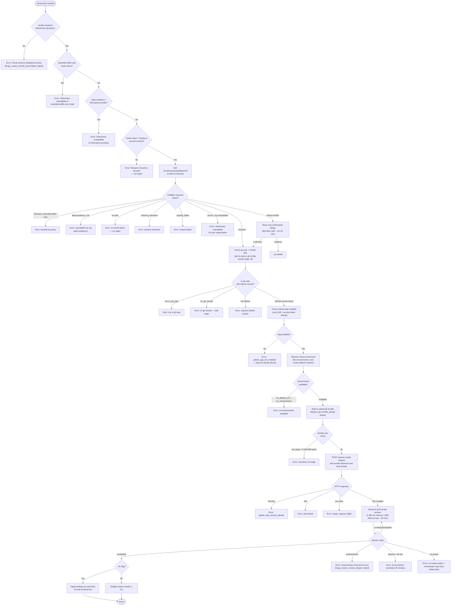

# `/ultrareview`

> Analysis basis: CC v2.1.178 bundle.js (AST extraction + Claude interpretation)
> Minimum version: v2.1.178

---

## Overview

`/ultrareview` starts a cloud-hosted agent session that performs deep bug-finding and verification on the current Git branch, running on Anthropic's infrastructure via Claude Code on the web. The command conducts a multi-stage preflight check (policy, authentication, provider, repository, GitHub app), packages the local repository as a Git bundle, uploads it to a remote cloud environment, and then streams results back to the local CLI. It optionally applies findings as code fixes to the local working tree when the `--fix` flag is passed.

---

## Registration

| Field | Value |
|---|---|
| type | `local-jsx` |
| name | `ultrareview` |
| description | `"Start a cloud agent that finds and verifies bugs in your branch ( ... , ... USD) · Runs in Claude Code on the web. See ..."` |
| loc_byte | `12629022` |
| loc_byte_end | `12629293` |
| loc_line | `8573` |
| module_id | `oYK` |
| load_inline | `true` |
| arbor_handler.name | `z65` |
| arbor_handler.fqn | `claude-2.1.178::z65` |
| arbor_handler.kind | `AsyncFunction` |
| arbor_handler.resolution_path | `module_id` |
| arbor_handler.n_hits | `1` |

Analysis basis: CC v2.1.178 bundle.js:+12629022

---

## Input Branching

The command has more than three distinct branching paths based on precondition checks, preflight API responses, and session lifecycle states. A Mermaid flowchart is used.



---

## Behavioral Spec

### Handler Entry — `asyncUltrareviewHandler` (bundle: `z65`)

The main async handler is resolved via `module_id` → `oYK` → `z65`.

```
async function asyncUltrareviewHandler(args, appState):

    # 1. Org-policy gate
    if appState.settings["allow_remote_sessions"] is not enabled:
        emit telemetry("tengu_review_remote_precondition_failed")
        display("Cloud sessions are disabled by your organization's policy.")
        return

    # 2. Jitter delay (avoids thundering herd on quick re-invocations)
    await jitterDelay(maxMs=2)          # Math.random * 2, then setTimeout

    # 3. Parse flags
    flags = parseFlagsFromArgs(args)    # recognises "fix", "comment" modes
    mode  = flags contains "fix"   ? "fix"
          : flags contains "comment" ? "comment"
          : default review mode

    # 4. Precondition suite (checkRemotePreconditions)
    preconditions = await checkRemotePreconditions(appState)
    if preconditions.blocked:
        display preconditions.message
        return

    # 5. Resolve git context
    gitContext = await resolveGitContext()
    # includes: isInsideWorkTree, remoteUrl, defaultBranch, currentBranch, mergeBase, diffShortstat

    # 6. Preflight API call
    preflightResult = await callPreflightApi(
        endpoint   = "/v1/ultrareview/preflight",
        headers    = { "teleport-org": orgUuid },
        timeoutMs  = 5000
    )
    handle preflightResult.status:
        "blocked"            → emit tengu_review_remote_precondition_failed; return error
        "essential-traffic-only" → return error (unavailable in ETO mode)
        "data-residency"/"zdr"   → return error (unavailable for third-party / DR)
        "no-auth"            → return error ("run /login")
        "schema_mismatch"    → return error
        "request_failed"     → return error
        "server" (org blocked) → return error ("unavailable for your organization")
        "needs-confirm"      → show cost/time confirmation dialog (see §Confirmation Dialog)
        "proceed"            → continue

    emit telemetry("tengu_review_bughunter_config")   # records estimated cost/time

    # 7. Cost/overage gate
    if overage condition detected:
        emit telemetry("tengu_review_overage_blocked")
        if org admin page available:
            show link to "/admin-settings/"
        emit telemetry("tengu_review_overage_dialog_shown") if dialog shown
        if user declines:
            return

    # 8. Resolve remote session (ojA → IYK → ajA)
    sessionResult = await resolveAndLaunchRemoteSession(gitContext, mode, flags)
    if sessionResult.failed:
        emit telemetry("tengu_review_remote_teleport_failed")
        display("Ultrareview failed to launch the cloud session.")
        return

    emit telemetry("tengu_review_remote_launched")

    # 9. Cancellation hook
    on cancel/abort:
        display("Ultrareview cancelled.")
```

Analysis basis: CC v2.1.178 bundle.js:+12626677

---

### Precondition Check — `checkRemotePreconditions` (bundle: `rjA`)

```
async function checkRemotePreconditions(appState):

    # Provider check
    provider = getActiveProvider(appState)
    if provider is not "firstParty":
        return blocked("Ultrareview runs in Claude Code on the web and is unavailable on third-party providers.")

    # Essential-traffic-only check
    trafficMode = getTrafficMode()
    if trafficMode is "essential-traffic-only":
        return blocked("Ultrareview runs in Claude Code on the web and is unavailable when essential-traffic-only mode is active.")

    # Data-residency check
    if provider includes "data_residency" or "data-residency":
        return blocked("Ultrareview runs in Claude Code on the web and is unavailable on third-party providers.")

    # Auth check
    oauthToken = getOAuthToken()
    if oauthToken is absent:
        return blocked("Ultrareview requires a Claude.ai account. Run /login to authenticate.")

    # Git repo check
    insideWorkTree = await runGit(["rev-parse", "--is-inside-work-tree"])
    if not insideWorkTree:
        return blocked(reason="not_in_git_repo")

    # Remote URL check
    remoteUrl = await runGit(["config", "--get", "remote.origin.url"])
    if not remoteUrl:
        return blocked(reason="no_git_remote", message="Cloud agents require a GitHub remote.")

    # GitHub host check
    if remoteUrl does not contain "github.com":
        if remoteUrl contains "anthropics" or "anthropic":
            # internal — allowed
        else:
            return blocked(reason="no_github_remote")

    # Pull-request / branch context
    prContext = await resolvePrContext(remoteUrl)   # detects "pr" mode

    # Merge-base / diff stat
    mergeBase   = await runGit(["merge-base", currentBranch, defaultBranch])
    diffStat    = await runGit(["diff", "--shortstat", mergeBase])

    return { ok: true, gitContext }
```

Analysis basis: CC v2.1.178 bundle.js:+12589381

---

### Git Bundle Size Gate — `checkBundleSize` (bundle: `wpq` → `O6`)

```
function checkBundleSize(gitCountObjects):
    # git count-objects -v output parsed to loose + pack bytes
    totalBytes = parseTotalBytes(gitCountObjects)
    emit telemetry("tengu_ccr_bundle_max_bytes", { bytes: totalBytes })
    if totalBytes > 5_000_000:
        return { tooLarge: true }
    if objectCount > 100:
        # warn but proceed
    return { tooLarge: false, bytes: totalBytes }
```

Maximum bundle size: 5 000 000 bytes (bundle.js:+9867180)
Object count warning threshold: 100 (bundle.js:+9867161)

Analysis basis: CC v2.1.178 bundle.js:+9866651

---

### Preflight API Call — `callPreflightApi` (bundle: `IYK`)

```
async function callPreflightApi(orgUuid, accessToken):
    response = await httpGet(
        url     = "/v1/ultrareview/preflight",
        headers = { "teleport-org": orgUuid },
        timeout = 5000
    )
    emit telemetry("api_ultrareview_preflight")

    status = response.data.status
    switch status:
        case "blocked":
            if response.data.reason is "essential-traffic-only":
                return EssentialTrafficOnlyError
            elif response.data.reason is "data_residency" / "data-residency" / "zdr":
                return DataResidencyError
            elif response.data.reason is "no-auth":
                return NoAuthError (message: "Ultrareview requires a Claude.ai account.")
            else:
                return OrgUnavailableError ("Ultrareview is unavailable for your organization.")
        case "needs-confirm":
            return NeedsConfirmResult (cost estimate included)
        case "proceed":
            return ProceedResult
        default:
            emit telemetry("api_ultrareview_preflight", { error: "schema_mismatch" })
            return SchemaError
```

Preflight endpoint: `/v1/ultrareview/preflight` (bundle.js:+12587733)
Preflight timeout: 5 000 ms (bundle.js:+12587790)

Analysis basis: CC v2.1.178 bundle.js:+12587658

---

### Cost Confirmation Dialog — `showCostConfirmation` (bundle: `ImH` → `kmH`)

```
function showCostConfirmation(preflightResult):
    estimatedCost    = "$10-$20"          # bundle.js:+8688847
    estimatedTime    = "~10–20 min"       # bundle.js:+8688940
    emit telemetry("tengu_review_bughunter_config", { cost: estimatedCost, time: estimatedTime })

    userResponse = promptUser(
        message = "This will cost approximately {estimatedCost} and take {estimatedTime}. Proceed?",
        options = ["confirm", "cancel"]
    )
    if userResponse is "confirm":
        return proceed
    else:
        return cancelled
```

Estimated cost range: `$10-$20` USD (bundle.js:+8688847)
Estimated duration: `~10–20 min` (bundle.js:+8688940)

Analysis basis: CC v2.1.178 bundle.js:+8688727

---

### Remote Session Launch — `resolveAndLaunchRemoteSession` (bundle: `ajA`)

```
async function resolveAndLaunchRemoteSession(gitContext, mode, flags):

    # Eligibility re-check (L1q)
    eligibility = await checkRemoteEligibility(appState)
    # Reasons: policy_blocked, not_logged_in, byoc, not_in_git_repo,
    #          no_git_remote, github_app_not_installed
    emit telemetry("bg_remote_eligibility_check", { reason: eligibility.reason })
    if not eligibility.ok:
        return failed(eligibility.reason)

    # Environment resolution (LB)
    env = await resolveCloudEnvironment(appState)
    # Checks: first-party, oauth token, org UUID, environment list
    # Auto-creates default env ("Default") if absent via teleport_default_environment_create
    if not env:
        return failed("no_environments")

    # Determine git source / bundle mode (teleport_teleport_bundle_mode)
    bundleMode = determineBundleMode(gitContext)
    # Modes: "head", "fallback_head", "squashed", "fallback_squashed",
    #        "explicit_env_bundle", "explicit_source_url",
    #        "byoc_no_git_source", "no_git_at_all"
    emit telemetry("tengu_teleport_bundle_mode", { mode: bundleMode })

    # GitHub app preflight (ZxH)
    githubCheck = await checkGithubAppInstalled(org, accessToken)
    emit telemetry(githubCheck.ok ? "github_preflight_ok" : "github_preflight_failed")

    # Upload git bundle (Z4A — teleport_git_bundle_upload)
    if bundleMode requires upload:
        bundleResult = await uploadGitBundle(gitContext)
        emit telemetry("tengu_ccr_bundle_upload", { result: bundleResult.status })
        if bundleResult.failed:
            return failed(bundleResult.reason)

    # Build task prompt
    taskPrompt = buildTaskPrompt(mode, gitContext, flags)
    # Includes: description, mode-specific instruction suffix
    # If --fix: appends instruction to apply findings to local working tree
    #           (literal fragment: " The user passed --fix: when the findings arrive, apply them...")
    sessionTitle = await generateTitle(taskPrompt)   # via G0L, model call

    # POST session creation (zA.post)
    payload = {
        type         : "remote_agent",
        source       : bundleReference or gitContext.remoteUrl,
        task         : taskPrompt,
        environment  : env.id,
        permissionMode: "set_permission_mode",
        flags        : appliedFlagSettings
    }
    response = await httpPost("/ultrareview", payload, {
        headers: {
            "anthropic-beta"     : "ccr-byoc-2025-07-29",
            "x-organization-uuid": orgUuid
        }
    })
    emit telemetry("tengu_ccr_session_link")

    if response.status is 401 or 403:
        return failed("github_repo_access_denied")
    if response.status is not 201:
        return failed("create_request_failed")

    sessionId = response.data.sessionId
    if not sessionId:
        return failed("malformed_response")

    # Poll / stream session (Tpq — COH)
    result = await pollRemoteSession(sessionId, {
        pollIntervalMs : 1000,         # bundle.js:+9906162
        maxDurationMs  : 1_800_000     # 30 min — bundle.js:+9906169
    })

    return result
```

Analysis basis: CC v2.1.178 bundle.js:+12592364, +12592986, +9885259

---

### Remote Session Polling — `pollRemoteSession` (bundle: `Tpq`)

```
async function pollRemoteSession(sessionId, options):
    startTime = Date.now()
    loop:
        if Date.now() - startTime > options.maxDurationMs:
            return error("cloud session exceeded 30 minutes")   # bundle.js:+9908810

        sessionData = await httpGet("/ultrareview/{sessionId}")
        state = sessionData.status

        switch state:
            case "pending", "starting", "running", "idle":
                # stream any partial assistant messages
                streamPartialOutput(sessionData)
                await sleep(options.pollIntervalMs)
                continue

            case "completed":
                resultMessages = extractResultMessages(sessionData)
                if resultMessages is empty:
                    return error("no review output — orchestrator may have exited early")
                return success(resultMessages)

            case "archived", "error":
                return error("cloud session returned an error")

        # Handle hook events mid-session
        if event is "hook_progress" or "hook_response" or "hook_started":
            forwardHookEventToLocalCli(event)

        # Handle SessionStart event
        if event is "SessionStart":
            recordSessionStart()

    emit telemetry("tengu_ccr_session_link", { sessionId })
```

Poll interval: 1 000 ms (bundle.js:+9906162)
Maximum session duration: 1 800 000 ms / 30 minutes (bundle.js:+9906169)

Analysis basis: CC v2.1.178 bundle.js:+9905006

---

### MCP / Provider State Update — `applyMcpUpdate` (bundle: `hs8`)

```
function applyMcpUpdate(update, state):
    # Called during environment resolution to reflect live MCP connection state
    if update causes slot config change mid-flight:
        log("applyConnectionResult: disposing orphaned connect (slot config changed mid-flight)")
        dispose orphaned connection
    if update causes slot removal mid-flight:
        log("applyConnectionResult: disposing orphaned connect (slot removed mid-flight)")
    update state.mcpConnections accordingly
    if all remote servers recovered:
        log("[MCP] Retry: all remote servers recovered, stopping")
```

Analysis basis: CC v2.1.178 bundle.js:+16719166

---

## State & Side Effects

| Item | Detail |
|---|---|
| Telemetry | `tengu_review_remote_precondition_failed` (bundle.js:+12589396) |
| Telemetry | `tengu_ccr_bundle_max_bytes` (bundle.js:+9866654) |
| Telemetry | `tengu_review_bughunter_config` (bundle.js:+8688730) — records cost/time estimate |
| Telemetry | `tengu_feature_sad` (bundle.js:+1020301) — feature failure signal |
| Telemetry | `tengu_feature_ok` (bundle.js:+1020153) — feature success signal |
| Telemetry | `tengu_review_overage_blocked` (bundle.js:+12627011) |
| Telemetry | `tengu_review_overage_dialog_shown` (bundle.js:+12627348) |
| Telemetry | `tengu_ccr_bundle_seed_enabled` (bundle.js:+7145021) |
| Telemetry | `tengu_ccr_bundle_upload` (bundle.js:+9870031) |
| Telemetry | `tengu_teleport_bundle_mode` (bundle.js:+9886690) |
| Telemetry | `tengu_ccr_session_link` (bundle.js:+9880014) |
| Telemetry | `tengu_teleport_source_decision` (bundle.js:+9892153) |
| Telemetry | `tengu_review_remote_teleport_failed` (bundle.js:+12595252) |
| Telemetry | `tengu_review_remote_launched` (bundle.js:+12595773) |
| Network I/O | GET `/v1/ultrareview/preflight` (5 000 ms timeout) |
| Network I/O | POST `/ultrareview` to create remote session |
| Network I/O | GET `/ultrareview/{sessionId}` polled every 1 000 ms, max 30 min |
| File I/O | Writes temporary git bundle file (`_source_seed.bundle`, `.bundle`) then unlinks after upload |
| Git operations | `rev-parse --is-inside-work-tree`, `config --get remote.origin.url`, `symbolic-ref --short refs/remotes/origin/HEAD`, `branch --abbrev-ref HEAD`, `merge-base`, `diff --shortstat`, `count-objects -v`, `stash create`, `for-each-ref`, `update-ref` |
| Auth side-effects | Reads OAuth token and org UUID from local credential store; refreshes if stale |
| `appState` changes | MCP connection state updated if remote environment connection changes during launch |
| Hook registration | Forwards `hook_progress`, `hook_response`, `hook_started` events from remote session to local CLI hook system |
| Sound | <!-- TODO: not found in depth-2 traversal; needs --depth 4 --> |
| Error exit | Calls `process.exit` on fatal CLI errors (via `F1` path) |
| UUID generation | `crypto.randomUUID()` used for session/request IDs (via `Xpq`) |
| Beta header | Sends `anthropic-beta: ccr-byoc-2025-07-29` on session-create request (bundle.js:+9886346) |

---

## Version History

| Version | Change |
|---|---|
| v2.1.178 | Initial analysis |

---

## Common Mistakes

1. **Not logged in with Claude.ai** — `/ultrareview` requires an OAuth token from a Claude.ai account, not an API key. Running without `/login` first produces "Ultrareview requires a Claude.ai account." Run `/login` and authenticate with claude.ai before invoking this command.
2. **No GitHub remote configured** — The command requires `remote.origin.url` to point to a `github.com` host. A repository with no remote, or a remote pointing to a non-GitHub host (e.g. GitLab, Bitbucket), will fail at the remote-URL check. Use `git remote add origin <GitHub URL>` to fix.
3. **Organization policy blocks cloud sessions** — The `allow_remote_sessions` policy must be enabled. If your org admin has disabled cloud sessions, the command will exit immediately. Contact your organization admin to enable it.
4. **Repository too large** — Repositories whose loose + pack object byte total exceeds 5 000 000 bytes will be rejected before upload. Consider using a shallow clone or splitting the repository.
5. **Essential-traffic-only mode** — Running CC in a network environment that enforces essential-traffic-only mode (e.g. strict enterprise proxy policies) disables `/ultrareview` entirely, since it needs to reach Anthropic cloud infrastructure.
6. **GitHub App not installed** — Even with a GitHub remote, the Anthropic GitHub App must be installed on the target organization/repository. If missing, the command will report `github_app_not_installed` and direct the user to `https://claude.ai/code` to complete setup.
7. **Expecting instant results** — The cloud agent typically takes approximately 10–20 minutes. The CLI will poll at 1-second intervals for up to 30 minutes before timing out.
8. **Using `--fix` without reviewing first** — Passing `--fix` will automatically apply findings as code changes to the local working tree. Users should commit or stash local changes beforehand to keep the diff clean and reversible.

---

## Appendix — Identifier Mapping

> For bundle debugging only. Identifiers change across versions.

| Identifier | Role |
|---|---|
| `z65` | Main async handler for `/ultrareview` (entry point, AsyncFunction) |
| `M9` | Remote precondition checker (policy, ETO, provider gates) |
| `hc1` | Inner precondition sub-check helper |
| `Tt` | Precondition aggregator / result builder |
| `ab` | Individual policy flag evaluator |
| `K26` | File-based config reader (readFileSync, UTF-8) |
| `M5H` | Provider/subscription plan checker (firstParty, includes check) |
| `qq` | Traffic / telemetry mode resolver |
| `biA` | Essential-traffic / no-telemetry mode lookup |
| `L6` | String coercion utility |
| `eLH` | Locale / string formatting helper |
| `q` | CLI data/config file accessor |
| `F1` | Fatal CLI error handler (console.error + process.exit) |
| `NFH` | Error message formatter (red terminal colour) |
| `cX` | Error state file writer (writeFileSync) |
| `H` | Jitter delay (Math.random + setTimeout) |
| `CYK` | Flag parser for `/ultrareview` args ("fix", "comment") |
| `Td8` | Arg string tokenizer (trim, split, replace) |
| `DN` | Shell-escape helper (replace for special chars) |
| `rjA` | Full precondition suite (git context, auth, provider, PR detection) |
| `LA6` | Git work-tree / repo detector (rev-parse) |
| `u6` | Async git command runner |
| `Pe6` | AsyncLocalStorage context reader |
| `W_` | Platform/terminal type resolver |
| `Q_` | Git subprocess executor with error handling |
| `shH` | Low-level git child-process spawner |
| `w` | Forced-shutdown / abort controller |
| `Ol4` | String-coerce for git output |
| `D5` | Git output parser helper |
| `Z8` | Git error classifier |
| `RH` | Git command result handler / log emitter |
| `d` | Generic error/state logger |
| `xb` | Remote-URL resolver and sanitizer (FlH cache, git config) |
| `ol` | Remote-URL cache accessor |
| `AH8` | Cache store getter (e_H.get, "remoteUrl" key) |
| `glH` | URL credential redactor (`://***@` replacement) |
| `HAH` | URL parser / protocol+host extractor |
| `OsA` | URL component splitter |
| `Z9` | Substring slicer (indexOf + slice) |
| `jpq` | Git object-count runner (count-objects -v) |
| `Dpq` | Git count-objects output parser (Number coercion) |
| `wpq` | Bundle-size gate dispatcher |
| `O6` | Bundle-size evaluator (thresholds: 100 objects / 5 000 000 bytes) |
| `g8` | Default-branch resolver (symbolic-ref HEAD) |
| `iy` | Default-branch name getter (symbolic-ref --short refs/remotes/origin/HEAD → "main"/"master") |
| `M5_` | Cache getter for "defaultBranch" key |
| `pw` | Current-branch resolver (branch --abbrev-ref HEAD) |
| `f5_` | Cache getter for "branch" key |
| `O` | Merge-base / diff-stat orchestrator |
| `C8` | Background-session-stopped state handler |
| `I1A` | Diff-stat integer parser (H.match + parseInt) |
| `GTq` | Bughunter config builder (cost/time estimate, Math.floor) |
| `kmH` | Token / cost calculator (O6 + Number.isFinite + Math.floor) |
| `ojA` | Preflight API caller + result router |
| `IYK` | Preflight HTTP GET executor (kYK, L9.get, ljA) |
| `i6` | JSON.parse wrapper |
| `ljA` | Preflight response status dispatcher |
| `d6` | Generic async task result recorder (sad path) |
| `dH` | Telemetry event emitter (sad/ok) |
| `SH` | Generic async task result recorder (ok path) |
| `ImH` | Confirmation-dialog invoker (uses kmH for cost) |
| `nq6` | Overage / spend-limit gate |
| `lV` | Spend-limit state reader |
| `xXH` | Subscription / plan type checker |
| `Z4` | Subscription plan resolver |
| `Hw` | Auth / API key / subscription state reader |
| `S6` | Plan-type cache accessor (Date.now for freshness) |
| `ZA` | Plan validity checker (Array.isArray + H.includes) |
| `cb` | Array-includes plan membership check |
| `bN` | Role/tier checker ("max","pro","admin","billing","owner","primary_owner") |
| `Yq` | Subscription type resolver (stripe, apple, google_play variants) |
| `A6H` | Cost/token total accumulator (uses kmH) |
| `O65` | Session-result renderer / output formatter |
| `ajA` | Remote-session creator and lifecycle manager |
| `K4H` | Session-creation orchestrator (calls L1q) |
| `L1q` | Remote eligibility + environment resolver |
| `E` | Batch message processor (Math.max/min clamp) |
| `W` | Individual message handler (RH, jA, Promise.all) |
| `h6H` | Session payload builder helper |
| `WTq` | Token-cost converter helper |
| `LB` | Full teleport-to-remote implementation (bundle upload + POST + poll) |
| `E4` | First-party provider assertion |
| `V$` | OAuth token refresh/check |
| `rx8` | OAuth token state reader (Y9, L6, eF) |
| `lb` | Session-creation result accumulator |
| `k1` | OAuth endpoint validator (local/staging/prod + custom URL check) |
| `RD` | HTTP client wrapper (axios base) |
| `Z4A` | Git-bundle upload implementation (teleport_git_bundle_upload) |
| `R6` | Platform/terminal capability resolver |
| `H6` | Low-level file descriptor helper |
| `Xpq` | Session-request UUID generator (crypto.randomUUID) |
| `Qy6` | Session-request payload finaliser |
| `xH` | JSON.stringify wrapper |
| `Jpq` | Session-link telemetry recorder |
| `OE8` | Output stream batcher |
| `NHH` | Environments list fetcher (teleport_environments_list) |
| `fA6` | Default cloud-environment creator (teleport_default_environment_create) |
| `TH` | String coercion / display formatter |
| `G0L` | Task-title generator (AI call: "claude/task", json_schema, teleport_generate_title) |
| `zR` | Session-create result handler / state transition |
| `ZxH` | GitHub App installation checker (checkGithubAppInstalled) |
| `d1` | Response-status decoder |
| `i` | Output write stream (a.write, P.write) |
| `jA` | Generic error coercer (Error + String) |
| `wz` | Cancellation detector |
| `gz` | Abort/cancel state reader |
| `COH` | Remote-agent session monitor / poller |
| `JI` | Random byte / session-token generator (KhK.randomBytes) |
| `K46` | Browser/socket opener for session URL (R8H.open) |
| `P0` | Pending-state timestamp recorder |
| `k0L` | Session-state string builder |
| `Tpq` | Core session-polling loop (1 000 ms interval, 1 800 000 ms max) |
| `f4H` | CLI output renderer for remote session (HD) |
| `HD` | Terminal output composer (x_, q, Jg_) |
| `$65` | Result-message mapper (H.map) |
| `ijA` | Post-session cleanup / cancellation finaliser |
| `ebH` | MCP server connection manager (multi-transport: stdio, sse, http, ws-ide) |
| `hs8` | MCP connection-state applier (applyMcpUpdate) |
| `INA` | MCP server registry iterator / reconnect orchestrator |
| `N` | Git-subprocess environment builder |