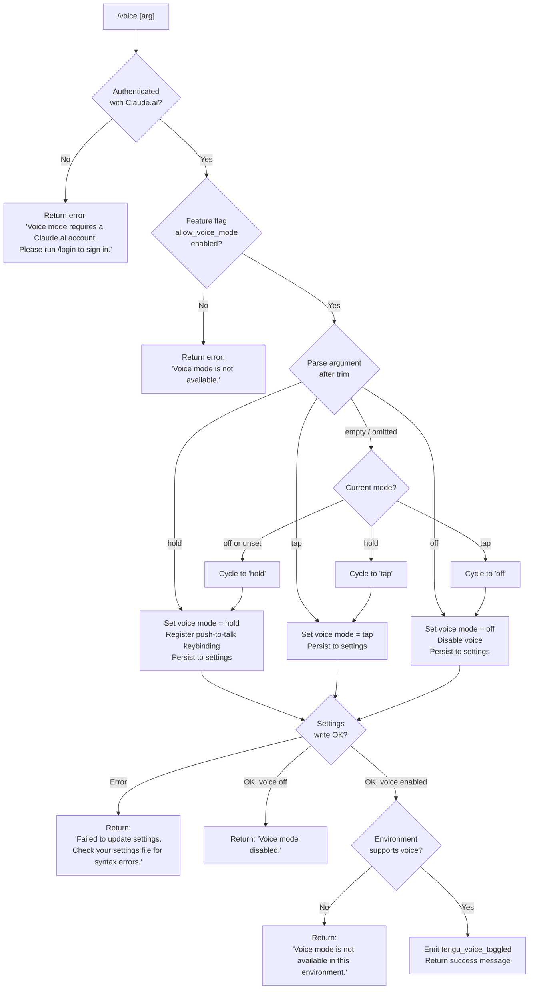

# `/voice`

> Analysis basis: CC v2.1.178 bundle.js (AST extraction + Claude interpretation)
> Minimum version: v2.1.178

---

## Overview

The `/voice` command toggles voice mode in Claude Code, cycling through three interaction sub-modes: `hold` (push-to-talk), `tap` (tap-to-toggle), and `off` (disabled). It enforces authentication and feature-flag prerequisites before persisting the desired mode to user settings, and optionally registers or removes a push-to-talk keybinding (`voice:pushToTalk` bound to `Space` in the `Chat` context).

---

## Registration

| Field | Value |
|---|---|
| type | `local` |
| name | `voice` |
| description | `Toggle voice mode` |
| argumentHint | `[hold\|tap\|off]` |
| supportsNonInteractive | `false` |
| isHidden | `null` |
| module_id | `gZK` |
| load_inline | `true` |
| loc_byte | `13391182` |
| loc_byte_end | `13391424` |
| loc_line | `9567` |
| arbor_handler.name | `fL5` |
| arbor_handler.fqn | `claude-2.1.178::fL5` |
| arbor_handler.kind | `AsyncFunction` |
| arbor_handler.resolution_path | `module_id` |
| arbor_handler.n_hits | `1` |

Analysis basis: CC v2.1.178 bundle.js:+13391182

---

## Input Branching

The command has 5+ distinct branches based on argument value, authentication state, and feature-flag state.



Analysis basis: CC v2.1.178 bundle.js:+13388584 (literals `hold`, `tap`, `off`, `invalid`), +13388667 (handler entry `fL5`→`m56`), +13388807 (unavailability string), +13389095 (settings failure string), +13389233 (disabled string), +13389477 (environment unavailability string)

---

## Behavioral Spec

### Main Handler — voiceCommandHandler (fL5)

```
async function voiceCommandHandler(commandArgs, context):

    // Step 1: Authentication gate
    authState = getAuthState(context)           // calls Hw via m56
    if authState does not include a Claude.ai account login:
        return { type: "text",
                 text: "Voice mode requires a Claude.ai account. Please run /login to sign in." }

    // Step 2: Feature flag gate
    settings = loadSettings()                  // calls vl8 → M9
    if NOT settings.allow_voice_mode:
        return { type: "text",
                 text: "Voice mode is not available." }

    // Step 3: Argument parsing
    rawArg = commandArgs.trim()                // calls KL5
    mode = parseVoiceArg(rawArg)              // resolves to: "hold" | "tap" | "off" | <cycle>

    // Step 4: Cycle logic when no explicit arg given
    if mode == <cycle>:
        current = getCurrentVoiceMode(settings)
        mode = cycleModeForward(current)
        // off/unset → hold → tap → off

    // Step 5: Persist to settings
    success = writeVoiceModeToSettings(mode)   // calls YA (settings writer)
    if NOT success:
        return { type: "text",
                 text: "Failed to update settings. Check your settings file for syntax errors." }

    // Step 6: Handle disabled case
    if mode == "off":
        emitTelemetry("tengu_voice_toggled", { mode: "off" })
        return { type: "text", text: "Voice mode disabled." }

    // Step 7: Environment capability check
    envSupportsVoice = checkVoiceEnvironment()  // calls c2A / gF6
    if NOT envSupportsVoice:
        return { type: "text",
                 text: "Voice mode is not available in this environment." }

    // Step 8: Push-to-talk keybinding registration
    if mode == "hold":
        registerKeybinding({
            action: "voice:pushToTalk",
            context: "Chat",
            key: "Space"
        })                                    // calls I2 (keybinding subsystem)

    // Step 9: MCP / environment setup for voice (calls M → ebH → INA chain)
    initializeMcpForVoice(context)

    // Step 10: Emit telemetry and return
    emitTelemetry("tengu_voice_toggled", { mode: mode })
    return { type: "text", text: <success message with current mode> }
```

Analysis basis: CC v2.1.178 bundle.js:+13388667 (`fL5`→`m56`), +13388678 (`fL5`→`Hw`), +13388845 (`fL5`→`d_`), +13388852 (`fL5`→`pF6`), +13388861 (`fL5`→`KL5`), +13388928 (`fL5`→`H.trim`), +13388997 (`fL5`→`YA`), +13389176 (`fL5`→`d`), +13389293 (`fL5`→`Promise.resolve`), +13389323 (`fL5`→`c2A`), +13389402 (`fL5`→`gF6`), +13389422 (`fL5`→`f`), +13389533 (`fL5`→`K`), +13389752 (`fL5`→`M`), +13389964 (`fL5`→`$`), +13390443 (`fL5`→`I2`), +13390904 (`fL5`→`W8`)

---

### Argument Validator — parseVoiceArg (KL5)

```
function parseVoiceArg(rawArg):
    trimmed = rawArg.trim()
    if trimmed == "hold": return "hold"
    if trimmed == "tap":  return "tap"
    if trimmed == "off":  return "off"
    if trimmed == "":     return <cycle sentinel>
    // Any other value is treated as invalid → cycle sentinel or error feedback
    return <cycle sentinel>
```

Valid literal tokens: `"hold"` (+13388584), `"tap"` (+13388596), `"off"` (+13388607). The string `"invalid"` (+13388628) appears adjacent, used internally for unrecognized arguments.

Analysis basis: CC v2.1.178 bundle.js:+13388537 (`KL5`→`H.trim`), +13388584–13388628 (literals)

---

### Settings Loader — voiceSettingsLoader (vl8 → M9)

```
function loadVoiceSettings():
    rawSettings = readSettingsFromDisk()      // M9 calls hc1, ab, Tt
    featureFlags = extractFeatureFlags(rawSettings)
    return {
        allow_voice_mode: featureFlags["allow_voice_mode"],  // literal at +13377908
        ...otherSettings
    }
```

The flag key `"allow_voice_mode"` is checked at `+13377908`.

Analysis basis: CC v2.1.178 bundle.js:+13377950 (`m56`→`Vl8`), +13377905 (`vl8`→`M9`), +13377908 (literal `allow_voice_mode`)

---

### Auth State Checker — getAuthState (Hw)

```
function getAuthState(context):
    profile = readProfileState()             // Hw → vL → L6, kn6
    oauthToken = readOAuthToken()            // Hw → Qj → user_oauth path
    return { hasClaudeAiAccount: oauthToken != null, profile, ... }
```

Relevant literals encountered: `"profile-implicit"` (+3280134), `"user_oauth"` (+3280207), `"firstParty"` (+2121033).

Analysis basis: CC v2.1.178 bundle.js:+13388678 (`fL5`→`Hw`), +3281183 (`Hw`→`vL`), +3281281 (`Hw`→`Qj`)

---

### Settings Writer — writeSettingsWithVoiceMode (YA)

```
async function writeSettingsWithVoiceMode(mode):
    configPath = resolveConfigPath(".claude/settings.json")    // calls pm → Hk.join
    currentSettings = readCurrentSettings(configPath)          // calls zH8 → UDH.readFile
    updatedSettings = mergeVoiceMode(currentSettings, mode)
    success = atomicWriteSettings(configPath, updatedSettings) // calls ED6 (atomic write)
    if NOT success:
        logError("write_ineffective", ...)                     // literal at +1326429
        return false
    emitSettingsEvent()                                        // calls YnH.emit at +1326594
    return true
```

Key setting file paths: `settings.json` (+1306210), `settings.local.json` (+1306272), directory `.claude` (+1306200).

Analysis basis: CC v2.1.178 bundle.js:+13388997 (`fL5`→`YA`), +1325438 (`YA`→`a3`), +1325488 (`YA`→`OAH.dirname`), +1325516 (`YA`→`pb`), +1325565 (`YA`→`x8`), +1325869 (`YA`→`Bs`), +1326183 (`YA`→`Oz`), +1326350 (`YA`→`d6`), +1326570 (`YA`→`dF`), +1326594 (`YA`→`YnH.emit`)

---

### Keybinding Registration — registerPushToTalkBinding (I2)

```
function registerPushToTalkBinding():
    keybindingConfig = loadKeybindingConfig()    // I2 → Nw8 → vRH
    newBinding = {
        action: "voice:pushToTalk",              // literal at +13390446
        context: "Chat",                         // literal at +13390465
        key: "Space"                             // literal at +13390472
    }
    merged = mergeIntoBindings(keybindingConfig, newBinding)  // I2 → hw8 → Kb_
    persistKeybindings(merged)
```

This path is only traversed when mode equals `"hold"`. The keybinding subsystem validates config structure and emits `tengu_custom_keybindings_loaded` on success and `tengu_keybinding_fallback_used` on parse failure.

Analysis basis: CC v2.1.178 bundle.js:+13390443 (`fL5`→`I2`), +13390446–13390472 (action/context/key literals), +3977661 (`I2`→`Nw8`), +3977671 (`I2`→`hw8`)

---

### Privacy / Environment Capability Check

```
function checkVoiceEnvironment():
    // Checks whether microphone access is available in this runtime environment.
    // On macOS the user is informed to check:
    // "System Settings → Privacy & Security → Microphone"  (literal at +13389984)
    // Returns false in non-interactive or headless environments.
```

Literal `"System Settings → Privacy & Security → Microphone"` found at +13389984, used in the environment-unavailability message path.

Analysis basis: CC v2.1.178 bundle.js:+13389477 (unavailability message), +13389984 (macOS privacy path string), +13389323 (`fL5`→`c2A`), +13389402 (`fL5`→`gF6`)

---

## State & Side Effects

| Item | Detail |
|---|---|
| Telemetry | `tengu_voice_toggled` (bundle.js:+13389178) — fired on every successful mode change |
| Telemetry (indirect) | `tengu_feature_ok` (+1020153), `tengu_feature_sad` (+1020301), `tengu_feature_bad` (+1020220) — emitted by shared feature-flag infrastructure touched during flag check |
| Telemetry (indirect) | `tengu_custom_keybindings_loaded` (+3968645), `tengu_keybinding_fallback_used` (+3977743) — emitted by keybinding subsystem when mode = `hold` |
| Settings write | Persists `voiceMode` (or equivalent key) to `.claude/settings.json` via atomic write (ED6 path) |
| Keybinding side effect | When switching to `hold`: registers `voice:pushToTalk → Space` in the `Chat` keybinding context. When switching away from `hold`: that registration is removed. |
| Event emission | `YnH.emit` fires a settings-changed event to notify other subsystems of the voice mode update (+1326594) |
| appState changes | Voice mode state in the global app state is updated; downstream UI components re-render accordingly |
| Sound | No direct sound output at command invocation; sound capture begins only after the mode is set and the user engages the configured trigger |
| MCP pipeline | `fL5`→`M`→`ebH`→`INA` chain may re-evaluate MCP server availability in the context of voice mode changes |

---

## Version History

| Version | Change |
|---|---|
| v2.1.178 | Initial analysis |

---

## Common Mistakes

1. **Running `/voice` without logging in.** Voice mode requires a Claude.ai account (OAuth). Running the command in an API-key-only session produces the message "Voice mode requires a Claude.ai account. Please run /login to sign in." — use `/login` first.

2. **Ignoring the `allow_voice_mode` feature flag.** Even when authenticated, voice mode is gated by the `allow_voice_mode` flag in the policy/user settings. If the flag is absent or `false`, the command returns "Voice mode is not available." regardless of login state.

3. **Passing an unrecognized argument.** The only accepted positional arguments are `hold`, `tap`, and `off`. Any other value is treated as an empty argument (cycle behaviour), not as an error — this can produce unexpected mode transitions.

4. **Expecting voice in non-interactive environments.** `/voice` sets `supportsNonInteractive: false` and performs an environment capability check. Running it in a headless or piped context will succeed at the settings-write level but report "Voice mode is not available in this environment."

5. **Corrupted settings file.** If `.claude/settings.json` contains a JSON syntax error, the settings write fails and the command returns "Failed to update settings. Check your settings file for syntax errors." — the mode is not changed.

6. **Microphone permission not granted (macOS).** After enabling voice mode, if the microphone is not authorized, the user must navigate to System Settings → Privacy & Security → Microphone to grant access.

---

## Appendix — Identifier Mapping

> For bundle debugging only. Identifiers change across versions.

| Identifier | Role |
|---|---|
| `fL5` | Main async handler for `/voice` (arbor_handler; AsyncFunction) |
| `m56` | Auth + settings pre-check orchestrator |
| `Vl8` | Auth state resolver sub-step |
| `Hw` | Authentication state fetcher |
| `vL` | Profile reader |
| `Qj` | OAuth token / credential resolver |
| `E4` | First-party auth helper |
| `tP` | Token presence checker |
| `SO` | API key / auth environment validator |
| `wG6` | Auth helper wrapper |
| `eaH` | Auth environment accessor |
| `FW` | Auth flow finalizer |
| `mF6` | Settings module loader |
| `vl8` | Voice-settings loader (calls M9) |
| `M9` | Settings reader with feature-flag extraction |
| `hc1` | Settings cache initializer |
| `ab` | Settings merge helper |
| `qq` | Essential-traffic flag checker |
| `eLH` | Settings log helper |
| `Tt` | Settings tier processor |
| `d_` | Telemetry / diagnostics initializer |
| `dF` | Performance-mark and settings-from-disk loader |
| `GT` | Performance-mark writer |
| `Oq` | Memory-usage sampler |
| `Jm` | `perf_hooks` require wrapper |
| `kM_` | Settings load orchestrator (emits `settings_load_started` / `settings_load_completed`) |
| `u8` | File append / mkdir helper for log |
| `Fl6` | Settings flag-layer loader |
| `Xj6` | Flag-set manager |
| `ZeA` | Settings key enumerator |
| `K` | Pad-end formatter / push accumulator (context-dependent) |
| `aDH` | User-settings path builder |
| `L` | Connection / file-handle registry (context-dependent) |
| `QF` | Flag settings loader |
| `TeA` | SDK inline settings loader |
| `pb` | Settings-layer registry builder |
| `W_` | WSL detector |
| `Pj6` | Platform-specific settings resolver |
| `KL5` | Argument trimmer and voice-mode parser |
| `H` | Random / timer utility (context-dependent) |
| `YA` | Settings writer (persists voice mode) |
| `a3` | Settings path + layer resolver |
| `n6` | Node `path` module alias |
| `yM_` | Settings update orchestrator |
| `XW` | Settings file watcher |
| `Fs` | File reader with encoding detection |
| `rL` | Real-path resolver |
| `N` | Config-line normalizer / parser |
| `We6` | Directory walker for settings |
| `Ge6` | File-slice helper |
| `x8` | Temp-file helper (Z8 wrapper) |
| `Z8` | Temp-file creator |
| `m5_` | Cache timestamp updater |
| `YyH` | Settings path helper |
| `A68` | Resolved settings path builder |
| `ED6` | Atomic file writer |
| `O` | Symbolic-link stat wrapper |
| `C8` | Stopped-session marker |
| `xH` | JSON stringifier wrapper |
| `Oz` | Cache clearer (Ul6 + We8) |
| `zH8` | Gitignore / file-ignore checker |
| `u6` | AsyncLocalStorage store accessor |
| `Pe6` | Store-get helper |
| `G5_` | Git executable resolver |
| `OH8` | Gitignore rule evaluator |
| `Q_` | Git command runner |
| `Fl4` | Gitignore path resolver |
| `TsA` | Git `ls-files` runner |
| `EsA` | Gitignore parse helper |
| `pm` | `.claude` directory path builder |
| `SH` | Global-config read helper |
| `d` | Config accessor (context-dependent) |
| `dH` | Config-read wrapper |
| `c36` | Config bootstrap |
| `d6` | Local config reader |
| `bH` | Global config writer |
| `RH` | Error logger / log-ring manager |
| `jA` | Error stringifier |
| `L6` | String coercer |
| `RQ4` | Log-ring rotator |
| `M` | MCP supervisor / manager |
| `ebH` | MCP connection applicator |
| `UQ` | MCP server connector |
| `C86` | MCP server config validator |
| `Rr` | MCP stdio/SSE transport connector |
| `YU` | SDK MCP server lister |
| `$08` | MCP error colorizer |
| `I86` | MCP server-state updater |
| `BZ` | MCP tool-list builder |
| `PY` | Tool-list formatter |
| `Zc_` | Tool schema compiler |
| `i8` | MCP client wrapper |
| `ch6` | MCP connection result classifier |
| `Te9` | MCP connection executor |
| `Pn_` | MCP needs-auth cache reader |
| `z0H` | MCP tool hash generator |
| `r28` | MCP capability checker |
| `o28` | MCP tool-fingerprint builder |
| `NP` | SHA-256 tool hasher |
| `n28` | MCP tool key normalizer |
| `tK` | Tool-key canonicalizer |
| `Y8` | MCP debug logger |
| `I08` | MCP server connection lifecycle manager |
| `iI7` | MCP server initializer |
| `_n` | MCP auth-tool injector |
| `LqH` | Claude.ai proxy connector |
| `MqH` | MCP server-info fetcher |
| `PqH` | MCP OAuth callback server |
| `U86` | MCP pending-connection tracker |
| `w` | Process-exit / abort controller (context-dependent) |
| `R08` | MCP needs-auth cache writer |
| `ur` | MCP reconnect orchestrator |
| `um` | MCP auth-state reader |
| `Y` | Supervisor output writer / config updater (context-dependent) |
| `$7` | MCP error emitter |
| `TH` | String coercer / error formatter |
| `rI7` | MCP auth retry helper |
| `nI7` | SSH session detector |
| `S08` | MCP `complete_authentication` tool handler |
| `p86` | MCP pending-connection getter |
| `B86` | MCP established-connection getter |
| `Ie9` | MCP reconnect helper |
| `f9` | AsyncLocalStorage store getter |
| `kG8` | MCP needs-auth cache path builder |
| `pc_` | MCP connection result finalizer |
| `j` | Process kill iterator |
| `S` | Background process runner |
| `Nh` | MCP skills telemetry emitter |
| `O6` | MCP skills aggregator |
| `Ec_` | MCP environment builder |
| `W8` | Global config saver |
| `k` | Background-session lifecycle manager |
| `Xi` | Background session state machine |
| `I` | Background session sweep loop |
| `y` | Background session state holder |
| `QoK` | Background session queue head accessor |
| `Ne9` | MCP message-batch processor |
| `zQ` | MCP stream multiplexer |
| `z_6` | MCP response-slot parser (parseInt) |
| `IG8` | MCP message-ID parser (parseInt) |
| `hs8` | MCP update applier |
| `tbH` | MCP tool re-hasher |
| `RG` | MCP server cleanup orchestrator |
| `$_6` | MCP tool hash invalidator |
| `$` | MCP supervisor state accessor |
| `xGK` | Daemon status file writer |
| `zt` | Claude config accessor |
| `XF6` | Daemon status file path builder |
| `INA` | MCP connection result applicator |
| `j08` | MCP tool availability checker |
| `o8` | Timeout / abort helper |
| `I2` | Keybinding registration handler |
| `Nw8` | Keybinding config loader |
| `vRH` | Keybinding file parser |
| `eC_` | Keybinding schema validator |
| `AQ` | Keybinding default resolver |
| `v4` | Platform resolver |
| `IMH` | Keybinding file path builder |
| `i6` | JSON parser wrapper |
| `Zw8` | Keybinding array validator |
| `Gw8` | Keybinding block expander |
| `uJ9` | Keybinding error reporter |
| `sC_` | Keybinding duplicate detector |
| `tC_` | Keybinding entry normalizer |
| `hw8` | Keybinding merger |
| `Kb_` | Keybinding conflict resolver |
| `qb_` | Keybinding QuickTrie builder |
| `yJ9` | Keybinding serializer |
| `Z_7` | Keybinding entry formatter |
| `H6` | Config write helper |
| `uQH` | Language/locale normalizer |
| `S6` | Settings file watcher registrar |
| `$k_` | Settings watcher debouncer |
| `_MH` | Settings-from-disk reader (full) |
| `Rm` | Settings comment stripper |
| `WL9` | Settings directory enumerator |
| `zk_` | Settings backup path builder |
| `D` | Background-worker dispatcher |
| `b` | Background-worker process wrapper |
| `ul8` | Low-memory reporter |
| `dRH` | Stale-context file cleaner |
| `F` | Background PTY socket manager |
| `ZhA` | Background-worker socket claim handler |
| `khA` | Background-worker lifecycle controller |
| `B` | Background-worker pool |
| `wnf` | Settings file-change watcher |
| `ug` | Settings watcher callback |
| `F9` | Signal handler registrar |