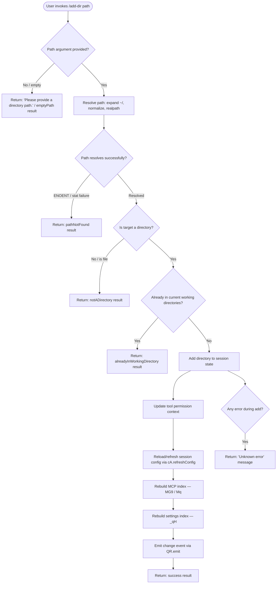

# `/add-dir`

> Analysis basis: CC v2.1.178 bundle.js (AST extraction + Claude interpretation)
> Minimum version: v2.1.178

---

## Overview

The `/add-dir` command adds a new working directory to the current Claude Code session. It accepts a filesystem path argument, validates the path (resolving home-directory shorthand, checking existence and directory type), and—if valid—registers the directory as an additional working context, updates tool permission contexts, refreshes session configuration, and rebuilds the MCP server index for the newly added scope.

---

## Registration

| Field | Value |
|---|---|
| type | `local-jsx` |
| name | `add-dir` |
| description | `Add a new working directory` |
| argumentHint | `<path>` |
| module_id | `N6K` |
| load_inline | `true` |
| loc_byte | `11290264` |
| loc_byte_end | `11290412` |
| loc_line | `7210` |
| arbor_handler.name | `$mL` |
| arbor_handler.fqn | `claude-2.1.178::$mL` |
| arbor_handler.kind | `AsyncFunction` |
| arbor_handler.resolution_path | `module_id` |
| arbor_handler.n_hits | `0` |

Analysis basis: CC v2.1.178 bundle.js:+11290264

---

## Input Branching

The command has more than three distinct outcome branches (empty path, not a directory, path not found, already in working directory, success, unknown error), so a Mermaid flowchart is used.



Analysis basis: CC v2.1.178 bundle.js:+11289034, +3944147, +3944245, +3944390, +3944515, +3944591, +3944676

---

## Behavioral Spec

### Path Resolution (`v1` / `pathResolve`)

The handler begins by examining the raw string argument supplied after `/add-dir`.

```
async function resolveDirectoryPath(rawInput):
    if rawInput is null or empty:
        return { kind: "emptyPath" }

    trimmed = rawInput.trim()

    if trimmed contains null bytes:
        raise TypeError("Path contains null bytes")

    if trimmed starts with "~/":
        trimmed = os.homedir() + trimmed.slice(2)   // expand tilde

    normalized = path.normalize(trimmed)

    if platform is "windows":
        apply Windows-specific path normalization

    if not path.isAbsolute(normalized):
        normalized = path.resolve(normalized)        // make absolute

    return normalized
```

Analysis basis: CC v2.1.178 bundle.js:+1088965, +1089018, +1089115, +1089133, +1089146, +1089275, +1089329

---

### Filesystem Validation (`mtH` / `validateDirectoryTarget`)

After the path string is resolved, the handler stats the filesystem entry.

```
async function validateDirectoryTarget(resolvedPath):
    try:
        stat = await fs.stat(resolvedPath)
    catch error:
        if error.code == "ENOENT":
            return { kind: "pathNotFound" }
        raise error

    if not stat.isDirectory():
        return { kind: "notADirectory" }

    return { kind: "ok", resolvedPath }
```

Error codes explicitly checked: `ENOENT` (path not found).
Analysis basis: CC v2.1.178 bundle.js:+3944200, +3944308, +3944245, +3944390

---

### Duplicate Check and App-State Update (`b_` / `getAppStateAndAdd`)

The handler reads current app state to check whether the resolved path is already tracked.

```
async function addDirectoryToSession(resolvedPath, appState):
    existingDirs = appState.getAppState()

    // find the most-recently active working directory entry
    lastEntry = existingDirs.findLast(entry => ...)

    // check "working_directory", "allowed_tools", "disallowed_tools",
    // "avoid_prompts", "permission_mode", "bypassPermissions" fields
    // on the existing session state

    if resolvedPath already present in working directories:
        return { kind: "alreadyInWorkingDirectory" }

    // mutate session: append new directory under "addDirectories" key
    // also record "localSettings" reference
    appState.addDirectories([resolvedPath])

    return { kind: "success" }
```

Relevant session state keys observed: `"working_directory"`, `"allowed_tools"`, `"disallowed_tools"`, `"avoid_prompts"`, `"permission_mode"`, `"bypassPermissions"`, `"addDirectories"`, `"localSettings"`.
Analysis basis: CC v2.1.178 bundle.js:+10800596, +10800676, +10800701, +10800756, +10800811, +10800872, +10801005, +11289034, +11289081

---

### Tool Permission Context Update (`_.setToolPermissionContext`)

Immediately after the directory is registered, the handler synchronises the tool permission layer:

```
function updatePermissionContext(newDir):
    _.setToolPermissionContext(newDir)

    // If setMode is "bypassPermissions" but bypassPermissions mode
    // is unavailable (disableBypassPermissionsMode flag set, or session
    // was not launched in bypassPermissions mode), the update is silently
    // ignored with a log:
    //   "Ignoring permission update: setMode 'bypassPermissions' rejected …"

    // Nx / disableBypassPermissions check:
    if bypass permissions mode is disabled:
        emit telemetry: tengu_disable_bypass_permissions_mode
```

Analysis basis: CC v2.1.178 bundle.js:+11289108, +5166483, +5166395, +4309012, +4309015

---

### Session Configuration Refresh (`dO` / `applySessionConfig`)

```
async function applySessionConfig(context):
    // Writes updated session flags into the config store
    // Handles: "addRules", "replaceRules", "removeRules",
    //          "alwaysAllowRules", "alwaysDenyRules", "alwaysAskRules",
    //          "addDirectories", "removeDirectories"
    // Applies setMode mutations ("allow", "deny")
    // Serialises changes via xH / JSON.stringify

    // On bypassPermissions rejection, logs the warning literal
    // "Ignoring permission update: setMode 'bypassPermissions' rejected …"

    configStore.set(updatedConfig)
    configStore.delete(obsoleteEntries)
```

Analysis basis: CC v2.1.178 bundle.js:+11289140, +5166481, +5166759, +5166944, +5166952, +5166984, +5166991, +5167009, +5167107, +5167764, +5168074, +5168148

---

### MCP Index Rebuild (`MG9` / `mcpIndexRebuild`)

Once the directory is added, the MCP server index is rebuilt to pick up any server definitions present in the new directory.

```
async function rebuildMcpIndex(newDir):
    // eJ: clear stale cache entries (Ce.delete)
    clearStaleMcpCache()

    // Mq: for each MCP config candidate under newDir:
    //     - lstat the file
    //     - if not a regular file, warn and skip
    //     - read file contents (tJ.readFile, utf-8)
    //     - parse JSON (i6 / JSON.parse)
    //     - merge into Ce (config entry cache) via Ce.set
    //     - track in L2H set
    //     - emit tengu_bg_state_read_transient on transient reads

    // SL: write consolidated MCP config atomically
    //     - generate random suffix (yO / RJ_.randomBytes)
    //     - write to temp file, rename into place

    // b3: error reporter — wraps errors with TH / Z8
```

Analysis basis: CC v2.1.178 bundle.js:+11289244, +4278058, +4278076, +4274103, +4274177, +4274244, +4274421, +4275022, +4275568, +4273575, +4273593, +4273625, +4273653

---

### Settings Index Rebuild (`_qH` / `rebuildSettingsIndex`)

In parallel, the local settings indexes are rebuilt to include any `.claude/settings.json` or `.claude/settings.local.json` files under the new directory.

```
async function rebuildSettingsIndex(dirs):
    // NF_: enumerate candidate setting files across all working dirs
    // qS9: for each candidate:
    //   - yv6 / b8: load policy settings ("policySettings")
    //   - hJ7: resolve real path, trim, call zq for dedup
    //   - k3: parse settings content
    //       - handles "flagSettings" key
    //       - replaces escape sequences: "\\", "\\(", "\\)"
    //   - YA: apply loaded settings:
    //       - reads .claude/settings.json and .claude/settings.local.json
    //       - checks "gitignore_global_rule", "already_tracked",
    //         "excludesfile_not_read" markers
    //       - calls zH8 to track file changes
    //       - emits "write_ineffective" if write has no effect

    // Filter: only include dirs not already in working set
    //   (A.includes / q.has checks)

    return mergedSettingsIndex
```

Settings file paths observed: `".claude"`, `"settings.json"`, `"settings.local.json"`.
Analysis basis: CC v2.1.178 bundle.js:+11289278, +5168615, +5164628, +5164737, +5165712, +5165783, +1306192, +1306200, +1306210, +1306272, +1325398, +1326288

---

### Skill / Memory Index Refresh (`Xv` / `refreshSkillIndex`)

```
async function refreshSkillIndex():
    // yU: attempt to use cached resolve
    //   - if cache valid: Promise.resolve(cached)
    //   - else: BYA re-scan, then H.clearSkillIndexCache()
    // gU8, ftq: supplementary index helpers
    // RUH / pu6: fetch from Vm8 store; call uu6 on result
```

Analysis basis: CC v2.1.178 bundle.js:+11289192, +13581361, +13581392, +13581414, +13581461

---

### Background Config Flush (`zzH` / `bgConfigFlush`)

```
function flushBackgroundConfig():
    // BU8: clear the Um6 pending-write queue (tp / Um6.clear)
    // Triggers immediate persistence of any queued config mutations
```

Analysis basis: CC v2.1.178 bundle.js:+11289197, +11281846, +10928988

---

### Event Emission and UI Update

```
function finalizeAddDir(resolvedPath):
    QR.emit(/* directory-added event */)
    cA.refreshConfig()
    // Render success or error feedback to the JSX UI layer:
    //   - On success: bold-formatted path via J6.bold
    //   - On error:   dim hint "· /permissions to manage" via J6.dim
    //   - On no-op:   "Did not add a working directory."
    //   - On unknown error: "Unknown error"
```

Literal feedback strings observed:
- `"Did not add a working directory."` (bundle.js:+11289725)
- `"· /permissions to manage"` (bundle.js:+11289589)
- `"Please provide a directory path."` (bundle.js:+3944676)
- `"Unknown error"` (bundle.js:+11289481)

Analysis basis: CC v2.1.178 bundle.js:+11289208, +11289218, +11289296, +11289582, +11289589, +11289725

---

### CLI Flag (`--add-dir`)

The string literal `"--add-dir"` appears at bundle.js:+11289248, indicating the command also has a corresponding CLI flag form that the handler recognises, allowing programmatic invocation outside of the interactive REPL.

Analysis basis: CC v2.1.178 bundle.js:+11289248

---

## State & Side Effects

| Item | Detail |
|---|---|
| Telemetry | `tengu_disable_bypass_permissions_mode` (emitted when bypass-permissions mode is rejected, bundle.js:+4309015); `tengu_daemon_config_reload` (bundle.js:+17081946); `tengu_feature_ok` (bundle.js:+1020153); `tengu_feature_bad` (bundle.js:+1020220); `tengu_feature_sad` (bundle.js:+1020301); `tengu_daemon_control` (bundle.js:+17104063); `tengu_bg_state_read_transient` (bundle.js:+4274823) |
| App state changes | New directory appended under `"addDirectories"` key; session working-directory list extended |
| Config persistence | Background config queue flushed (`Um6.clear`); `cA.refreshConfig()` called |
| Tool permission context | `_.setToolPermissionContext` called with new directory |
| MCP index | Rebuilt via `MG9`/`Mq` — scans new dir for MCP config files, merges into cache |
| Settings index | Rebuilt via `_qH`/`qS9` — scans `.claude/settings.json` and `.claude/settings.local.json` under new dir |
| Skill index | Refreshed via `Xv`/`yU` |
| Event emission | `QR.emit` fires a directory-change event |
| UI rendering | JSX (`local-jsx` type) renders inline feedback text with bold/dim styling |
| Sound | <!-- TODO: not found in depth-2 traversal; needs --depth 4 --> |
| Hook registration | <!-- TODO: not found in depth-2 traversal; needs --depth 4 --> |

---

## Version History

| Version | Change |
|---|---|
| v2.1.178 | Initial analysis |

---

## Common Mistakes

1. **Providing a file path instead of a directory path** — The command explicitly checks `isDirectory()` and returns a `notADirectory` result if a regular file path is given. Always pass a directory.
2. **Providing a non-existent path** — The command stats the target before accepting it. The path must exist on disk at invocation time. Symlinks are followed via `realpath`.
3. **Adding a directory already in the working set** — The handler detects duplicates and returns `alreadyInWorkingDirectory` without making any change; this is not an error but is a no-op.
4. **Omitting the argument entirely** — Without a path argument, the command immediately returns `"Please provide a directory path."` and exits.
5. **Expecting bypass-permissions rules to apply** — If the session was not launched in `bypassPermissions` mode (or `disableBypassPermissionsMode` is set), any `setMode: 'bypassPermissions'` permission context update will be silently ignored.
6. **Assuming the CLI flag `--add-dir` and the `/add-dir` slash command are independent** — Both are handled by the same `$mL` async function and produce identical side effects.

---

## Appendix — Identifier Mapping

> For bundle debugging only. Identifiers change across versions.

| Identifier | Role |
|---|---|
| `$mL` | Main async handler for `/add-dir` command (arbor_handler) |
| `b_` | Get app state and add directory to session |
| `tp8` | Read/apply `allowed_tools` from session state |
| `ep8` | Read/apply `disallowed_tools` from session state |
| `Nx` | Bypass-permissions mode gate / disable check |
| `O6` | Permission-mode dispatcher |
| `vG6` | Permission variant resolver (sub-helper of O6) |
| `NG6` | Permission variant resolver (sub-helper of O6) |
| `Xp` | Permission sub-helper calling `qp` |
| `o$8` | Permission cache helper (ny\_, uXH) |
| `S6` | Permission state recorder (calls Date.now, wnf) |
| `dO` | Apply session config / rule mutation engine |
| `N` | Config normaliser / writer (calls xNH, AM4, xH, d4, VdH, LM4) |
| `AM4` | Config apply helper (my, D__, WSA) |
| `WSA` | Config write sub-helper (f74, L74) |
| `xH` | JSON.stringify wrapper |
| `d4` | Path/string manipulation helper (sCA, H.replace, q.at) |
| `sCA` | String-case array mapper (t54.map) |
| `VdH` | File write helper (FCA) |
| `FCA` | Raw write executor (H.write) |
| `LM4` | Log/metrics append helper (sQH, G7H, W7H, my, n6, INH, _bA, P__, fM4, F9) |
| `sQH` | Batched write queue (clearTimeout, setTimeout, setImmediate) |
| `G7H` | Log path resolver (NdH, W7H.join, M\_, R6) |
| `INH` | Internal log helper (Z8) |
| `_bA` | Log path join helper (W7H.join, R6) |
| `P__` | Log file rotation helper (WS.stat, WS.rename, WS.unlink) |
| `fM4` | Log file append executor (WS.mkdir, WS.appendFile) |
| `F9` | Feature flag registration (XSA.register) |
| `e5` | String replacement utility (rn4) |
| `rn4` | replaceAll wrapper |
| `K` | Padding/map utility (f.map, L.padEnd) |
| `lE` | List / enumeration helper |
| `Y` | Supervisor / watcher controller (hVH, q.write, $ZK, T, E, R14, V, d) |
| `hVH` | File-stat based validator (MZK.stat, Z8, Promise.reject, L.isFile, f9, b2A, TH, zq, C2A) |
| `Z8` | Error wrapper / normaliser |
| `f9` | Async-local-storage store getter (P2f.getStore) |
| `b2A` | C2A caller |
| `TH` | String coercion helper |
| `$ZK` | Key-count / max calculator (Object.keys, Math.max, hD) |
| `T` | Timer/stop controller (ch6, j36) |
| `ch6` | Timer channel identifier |
| `j36` | Stop-job dispatcher (OA4) |
| `OA4` | Object.keys based job map accessor |
| `E` | Rate limiter / throttle (Math.max, Math.min, W) |
| `W` | Stop / teardown orchestrator (j36, rR, hh, Promise.all, gr, dx, RH, jA) |
| `RH` | Retry/error handler (jA, L6, qq, RQ4, ElH.push, Us.logError) |
| `jA` | Error stringifier (Error, String) |
| `R14` | Heartbeat helper (h1H) |
| `h1H` | Heartbeat inner helper |
| `V` | Scroll/view controller (Math.max, Math.floor, S, E) |
| `S` | Path-change event handler (x14, D5, N, RH, Ub5, Y.write) |
| `x14` | Realpath+stat validator (os8.realpath, os8.stat, x8) |
| `Ub5` | Change notifier (Cx8) |
| `hwH` | Hook / watcher setup helper |
| `Xv` | Skill/memory index refresher (yU, gU8, ftq, RUH) |
| `yU` | Skill index cache resolver (Promise.resolve, BYA, H.clearSkillIndexCache) |
| `gU8` | Supplementary skill index helper |
| `ftq` | Supplementary skill index helper |
| `RUH` | Remote skill fetch (pu6) |
| `pu6` | Vm8 store getter + uu6 caller |
| `uu6` | Skill post-processor |
| `zzH` | Background config flush trigger (BU8) |
| `BU8` | Config flush executor |
| `tp` | Pending-write queue clearer (Um6.clear) |
| `d$A` | Persistent config writer / directory appender (Qd, zz, iK.realpath, x8, N, zb, LO, W\_, c$.join, iK.readFile, O1, RH, iK.mkdir, iK.appendFile) |
| `Qd` | Config environment selector (L6, ZNK, Om, $kH) |
| `L6` | String coercer |
| `ZNK` | Config zone helper |
| `Om` | Config object merger |
| `$kH` | Config key resolver (l0, k5, fTf) |
| `l0` | Config lookup helper |
| `k5` | Key validator (J2) |
| `fTf` | Config field transformer (LTf) |
| `zz` | Path normaliser (H.normalize, NFC) |
| `x8` | Error code extractor (Z8) |
| `zb` | Boolean-like flag helper (TT) |
| `W_` | Write-guard / flag check (TT) |
| `O1` | Permission error mapper (Z8, EACCES/EPERM/ENOTDIR/ELOOP/EROFS) |
| `MG9` | MCP index rebuild orchestrator (eJ, Mq, SL, x8, b3) |
| `eJ` | MCP cache entry deleter (Ce.delete) |
| `Mq` | MCP config file reader/merger (oj.join, tJ.lstat, tJ.readFile, Ce.set, L2H) |
| `M` | MCP connection manager (ebH, hs8, f.get, N, f.values, $, INA) |
| `ebH` | MCP server connector (Object.entries, UQ, BZ, K.push, i8, Te9, o28, n28, Y8, rR, Ie9, pc\_, Promise.all, hh, gr, Nh, NG8, dx, Ec\_, $7, TH, Ne9, z\_6, IG8) |
| `hs8` | MCP connection result applier (H.applyMcpUpdate, tbH, Y8, A.cleanup, RG, ew) |
| `$` | xGK caller |
| `INA` | MCP client update dispatcher (Object.entries, A.filter, \_.getClients, j08, q, o8, N, $\_6, ebH, hs8, Object.fromEntries, K.map) |
| `z` | Daemon control wrapper (SH, bH, AR, aB) |
| `SH` | Daemon start helper (d, dH) |
| `bH` | Daemon stop helper (d, dH) |
| `AR` | Daemon push helper (qp, Bn.push, pkH, m0\_) |
| `aB` | Daemon race/all executor (Promise.race, Promise.all, f5H, L5H, o8, process.exit) |
| `hL` | Error wrapping utility (Z8) |
| `i6` | JSON.parse wrapper |
| `SL` | Atomic MCP config writer (yO, oj.join, xH, eJ) |
| `yO` | Atomic file write helper (RJ\_.randomBytes, Vn.writeFile, Vn.rename, Vn.copyFile, Vn.chmod, Vn.unlink) |
| `b3` | MCP error reporter (Z8, kNH.has, N, TH, RH) |
| `_qH` | Settings index rebuild orchestrator (NF\_, N, qS9, b8, YA, k3, e5) |
| `NF_` | Settings file enumerator |
| `qS9` | Settings file loader/parser (yv6, hJ7, IJ7, k3, e5, YA) |
| `yv6` | Policy settings loader (b8) |
| `b8` | Settings raw reader (K68, pb) |
| `hJ7` | Settings path resolver (a3, rL, n6, XW, zq) |
| `a3` | Settings entry builder (aDH, pb) |
| `rL` | Real-path sync resolver (s5, ED, H.realpathSync) |
| `XW` | File system helper (Fs) |
| `IJ7` | Settings index helper |
| `k3` | Settings content parser (an4, AZ, sn4, H.substring, on4) |
| `an4` | Settings parse sub-helper |
| `AZ` | Object.hasOwn wrapper |
| `sn4` | Settings normalise helper |
| `on4` | replaceAll escape helper (H.replaceAll) |
| `YA` | Settings applier (a3, n6, OAH.dirname, yM\_, pb, XW, x8, zq, N, Bs, m5\_, YyH, ED6, xH, Oz, zH8, pm, W\_, SH, d6, bH, dF, RH, YnH.emit) |
| `yM_` | Settings merge helper (ZeA, aDH, QF, TeA, Bs) |
| `pb` | Settings object builder (W\_, m$6, QH\_, b$6, qNH, KNH, U$6, MAH, tDH, Y68, UeA, ls, Pj6) |
| `m5_` | Settings timestamp recorder (XH8.set, Date.now) |
| `YyH` | Settings entry updater (A68, pb) |
| `ED6` | Symlink/stat resolver (n6, q.readlinkSync, wM.isAbsolute, wM.resolve, wM.dirname, wM.resolve, YM.closeSync, YM.openSync, Z8, q.lstatSync, O.isSymbolicLink, x8, wL\_.randomBytes, q.statSync, YM.writeFileSync, YM.fchmodSync, YM.fsyncSync, q.renameSync, q.unlinkSync) |
| `Oz` | Cache clearer (Ul6.clear, We8.clear) |
| `zH8` | Git-ignore / file-tracking helper (u6, G5\_, H.replaceAll, A.endsWith, OH8, Fl4, o7H.dirname, UDH.mkdir, UDH.readFile, TsA, N, EsA, UDH.appendFile, Z8, UDH.writeFile, String) |
| `pm` | Claude settings path builder (Hk.join) |
| `d6` | Config delta applier (d, dH) |
| `dF` | Settings load dispatcher (GT, Oq, kM\_, pb, Bl6) |
| `mtH` | Top-level path validation entry point (Dw8.resolve, v1, GJ9.stat, Z8, Px, kZ) |
| `v1` | Path normalise/resolve utility (u6, W\_, n6, TypeError, H.includes, A.includes, Error, H.trim, zz, ly.normalize, Ce6.homedir, q.startsWith, ly.join, q.slice, a6, q.match, nhH, ly.isAbsolute, ly.resolve) |
| `u6` | Async-local-storage context getter (Pe6, W\_) |
| `Pe6` | Store getter (Xe6.getStore, Yl) |
| `Px` | Write-guard checker (W\_) |
| `kZ` | Path alias substitutor (v1, q.replace, K.replace, zBH, u3, r\_H) |
| `zBH` | Alias resolver (a6, BV) |
| `u3` | toLowerCase wrapper |
| `r_H` | Alias replacement finaliser |
| `ptH` | Error-state UI renderer (J6.bold, Dw8.dirname) |

---

Note: index built via Arbor fallback; some signals (telemetry, literals) may be missing — see arbor-fallback.js.