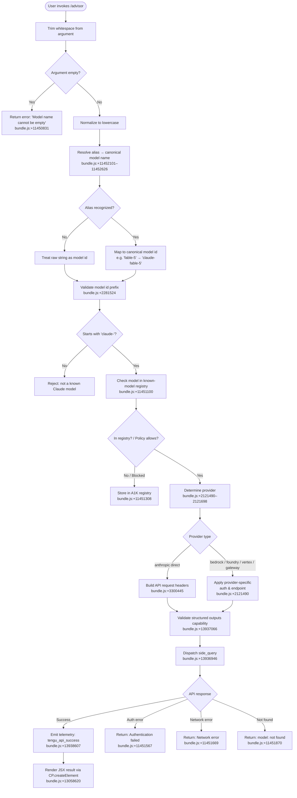

# `/advisor`

> Analysis basis: CC v2.1.179 bundle.js (AST extraction + Claude interpretation)
> Minimum version: v2.1.179

---

## Overview

The `/advisor` command enables Claude Code to consult a stronger or more capable model at strategically chosen moments during a session. It accepts a model name (or alias) as its argument, validates and normalizes that name against a known model registry, then dispatches a side-query to the selected model via the standard API pipeline — effectively giving the primary agent access to a more powerful "advisor" on demand.

---

## Registration

| Field | Value |
|---|---|
| type | `local-jsx` |
| name | `advisor` |
| description | `Let Claude consult a stronger model at key moments` |
| argumentHint | `[ ... ]` |
| isHidden | `null` (not hidden) |
| module_id | `A0K` |
| load_inline | `true` |
| loc_byte | `13059136` |
| loc_byte_end | `13059392` |
| loc_line | `9030` |
| arbor_handler.name | `cq5` |
| arbor_handler.fqn | `claude-2.1.179::cq5` |
| arbor_handler.kind | `AsyncFunction` |
| arbor_handler.resolution_path | `module_id` |
| arbor_handler.n_hits | `2` |

Analysis basis: CC v2.1.179 bundle.js:+13059136

---

## Input Branching

The command has multiple distinct branching paths: argument trimming and empty-string checks, model-name normalization through alias tables, provider-specific handling, capability/policy checks, and the final side-query dispatch. This warrants a Mermaid flowchart.



---

## Behavioral Spec

### 1. Handler Entry — Argument Parsing and Model Resolution

The async handler `cq5` is the primary entry point resolved by Arbor via `module_id` path.

```
async function advisorHandler(args, appState):
    rawInput = args.trim()                          // bundle.js:+13058584
    if rawInput is empty:
        return error("Model name cannot be empty")  // bundle.js:+11450831

    normalized = rawInput.toLowerCase()             // bundle.js:+11450979

    // Check advisory model cache/registry
    if advisorModelRegistry.has(normalized):        // bundle.js:+11451100
        advisorModelRegistry.set(normalized, ...)   // bundle.js:+11451308

    canonicalName = resolveModelAlias(normalized)   // bundle.js:+11452101
    render JSX element via createElement            // bundle.js:+13058620
    return dispatchSideQuery(canonicalName, appState)
```

Analysis basis: CC v2.1.179 bundle.js:+13058584

---

### 2. Model Alias Resolution

The function `resolveModelAlias` (bundle identifier: `KFL`) maps short aliases to canonical model identifiers. It performs case-insensitive matching and an inclusion check.

```
function resolveModelAlias(lowerCaseInput):
    // Check provider utility string for model tier
    tier = getModelTier(lowerCaseInput)             // bundle.js:+11452101

    alias_map = {
        "fable-5"   : "claude-fable-5",            // bundle.js:+2270506
        "fable_5"   : "claude-fable-5",            // bundle.js:+11452172
        "opus-4-8"  : "claude-opus-4-8",           // bundle.js:+2282428
        "opus_4_8"  : "claude-opus-4-8",           // bundle.js:+11452273
        "opus-4-7"  : "claude-opus-4-7",           // bundle.js:+2282485
        "opus_4_7"  : "claude-opus-4-7",           // bundle.js:+11452342
        "opus-4-6"  : "claude-opus-4-6",           // bundle.js:+2282542
        "opus_4_6"  : "claude-opus-4-6",           // bundle.js:+11452411
        "opus-4-5"  : "claude-opus-4-5",           // bundle.js:+2282599
        "opus_4_5"  : "claude-opus-4-5",           // bundle.js:+11452480
        "sonnet-4-6": "claude-sonnet-4-6",         // bundle.js:+2282777
        "sonnet_4_6": "claude-sonnet-4-6",         // bundle.js:+11452551
        "sonnet-4-5": "claude-sonnet-4-5",         // bundle.js:+2282838
        "sonnet_4_5": "claude-sonnet-4-5",         // bundle.js:+11452626
        "opus"      : "claude-opus-4-0",           // bundle.js:+2282745
        "sonnet"    : "claude-sonnet-4-0",         // bundle.js:+2282933
        "haiku"     : "claude-haiku-4-5",          // bundle.js:+2282967
        "best"      : (best available model),      // bundle.js:+2285859
        "opusplan"  : (opus plan model),           // bundle.js:+2285706
        "fable"     : "claude-fable-5",            // bundle.js:+2285644
    }

    if lowerCaseInput in alias_map:
        return alias_map[lowerCaseInput]
    if lowerCaseInput.startsWith("claude-"):       // bundle.js:+2281559
        return lowerCaseInput                      // pass through as-is
    return lowerCaseInput                          // attempt raw use
```

Analysis basis: CC v2.1.179 bundle.js:+11452101

---

### 3. Model Validation — Provider and Feature Checks

Before dispatching, the system validates the model against known providers and capability lists.

```
function validateModel(canonicalModelId):
    // Provider detection
    providerStr = detectProvider(canonicalModelId)  // bundle.js:+2121490

    known_providers = [
        "bedrock", "foundry", "mantle",
        "vertex", "anthropicAws", "gateway",
        "firstParty"                                // bundle.js:+2122314
    ]

    if providerStr not in known_providers:
        use direct Anthropic endpoint

    // Known model list check (subset)
    knownModels = [
        "claude-mythos-5",    // bundle.js:+2282371
        "claude-opus-4-8",    // bundle.js:+2282428
        "claude-sonnet-4-0",  // bundle.js:+2282933
        "claude-haiku-4-5",   // bundle.js:+2282967
        "claude-3-7-sonnet",  // bundle.js:+2283026
        "claude-3-5-sonnet",  // bundle.js:+2283087
        "claude-3-5-haiku",   // bundle.js:+2283148
        "claude-3-opus",      // bundle.js:+2283207
        "claude-3-sonnet",    // bundle.js:+2283260
        "claude-3-haiku",     // bundle.js:+2283317
        // ... and others
    ]

    if canonicalModelId not in knownModels:
        log warning: "model:" + canonicalModelId   // bundle.js:+11451870

    checkStructuredOutputsCapability(canonicalModelId) // bundle.js:+13937066
    return providerStr
```

Analysis basis: CC v2.1.179 bundle.js:+2121490

---

### 4. Side Query Dispatch

The `dispatchSideQuery` function (bundle identifier: `rU`) builds and sends the API request, tagged as a side query.

```
async function dispatchSideQuery(canonicalModelId, appState):
    // Build request context
    headers = buildRequestHeaders({                  // bundle.js:+3300445
        "x-app"                      : "cli",
        "User-Agent"                 : <agent string>,
        "X-Claude-Code-Session-Id"   : <session id>,
        "x-client-app"               : <app name>,
        "x-claude-code-agent-id"     : <agent id>,
    })

    requestTag = "side_query"                        // bundle.js:+13936946

    // Advisor-specific model validation
    validateModelName(canonicalModelId)              // bundle.js:+11450865

    // Check if model is marked as "off" or "unset"
    if advisorSetting == "off" or "unset":           // bundle.js:+13058660
        return noOp

    // Apply cache control
    cacheControl = "ephemeral"                       // bundle.js:+11451289

    // Dispatch to API
    response = await callAnthropicAPI({
        model   : canonicalModelId,
        headers : headers,
        tag     : requestTag,
        cache   : cacheControl,
        timeout : 600000,                            // bundle.js:+3301400
    })

    // Handle errors
    if response.error.type == "not_found_error":     // bundle.js:+11451788
        return error("model: " + canonicalModelId)   // bundle.js:+11451870
    if response is auth failure:
        return error("Authentication failed...")     // bundle.js:+11451567
    if response is network failure:
        return error("Network error...")             // bundle.js:+11451669

    emit telemetry("tengu_api_success")              // bundle.js:+13938607
    return response
```

Analysis basis: CC v2.1.179 bundle.js:+13936946

---

### 5. Advisor State Management and UI Rendering

After a successful dispatch the handler creates a JSX component and manages the advisor state.

```
function renderAdvisorResult(response, modelId):
    // createElement call for result display
    element = CP.createElement(AdvisorComponent, {  // bundle.js:+13058620
        model   : modelId,
        result  : response,
    })

    // Build completion entry through model entry pipeline
    completionEntry = buildModelEntry(response)     // bundle.js:+13058738
    filteredEntries = filterEntries(                // bundle.js:+13058899
        completionEntry,
        entrySelector
    )

    return { element, filteredEntries }
```

Analysis basis: CC v2.1.179 bundle.js:+13058620

---

### 6. Advisor Setting States

The advisor feature supports three explicit configuration states observed in literals:

- `"off"` — advisor consultation is disabled (bundle.js:+13058660)
- `"unset"` — advisor has not been configured by the user (bundle.js:+13058671)
- Active (any valid model name) — advisor is enabled with the specified model

```
function getAdvisorState(config):
    if config.advisor == "off":
        return DISABLED
    if config.advisor == "unset" or config.advisor is null:
        return NOT_CONFIGURED
    return ACTIVE(config.advisor)
```

Analysis basis: CC v2.1.179 bundle.js:+13058660

---

## State & Side Effects

| Item | Detail |
|---|---|
| Telemetry | `tengu_api_success` (bundle.js:+13938607) — fired on successful advisor API response |
| Telemetry | `tengu_lone_surrogate_sanitized` (bundle.js:+13938303) — fired when lone surrogates are cleaned from input |
| Telemetry | `tengu_prompt_cache_1h_config` (bundle.js:+13881629) — fired when 1-hour prompt cache is configured |
| Telemetry | `tengu_bg_retire_pinned_low_mem` (bundle.js:+17072013) — background memory management event |
| Telemetry | `tengu_bg_prewarm_per_sweep` (bundle.js:+17072134) — background worker prewarm event |
| Model registry write | `advisorModelRegistry.set(key, value)` (bundle.js:+11451308) — caches resolved model name |
| API side-query | Tagged `"side_query"` (bundle.js:+13936946), separate from primary agent request stream |
| appState changes | Advisor model field updated from `"unset"` → resolved canonical model name |
| Cache control | Request uses `"ephemeral"` cache type (bundle.js:+11451289) |
| Timeout | API call timeout set to 600,000 ms (10 minutes) (bundle.js:+3301400) |
| Hook registration | <!-- TODO: not found in depth-2 traversal; needs --depth 4 --> |
| Sound | <!-- TODO: not found in depth-2 traversal; needs --depth 4 --> |

---

## Version History

| Version | Change |
|---|---|
| v2.1.179 | Initial analysis |

---

## Common Mistakes

1. **Passing an unrecognized model alias** — Only aliases mapped in the alias table (e.g., `opus`, `sonnet`, `haiku`, `fable-5`, `opus-4-8`) are resolved automatically. Unknown strings are passed through as-is and will fail with a `not_found_error` if the API does not recognize them.
2. **Omitting the model argument** — Invoking `/advisor` with no argument (or only whitespace) will produce the "Model name cannot be empty" error immediately, before any API call is made. (bundle.js:+11450831)
3. **Using underscore variants in some contexts** — The alias table includes both hyphen (`opus-4-5`) and underscore (`opus_4_5`) forms, but these only work after the lowercase normalization step. Using mixed case (e.g., `Opus-4-5`) will be normalized correctly.
4. **Expecting advisor to work when set to `"off"`** — If the advisor configuration is `"off"`, the command silently returns without dispatching any API call. Check your settings if the command appears to do nothing. (bundle.js:+13058660)
5. **Assuming provider-agnostic behavior** — Depending on the active provider (Bedrock, Vertex, Azure Foundry, etc.), the model identifier may need to match the provider's specific naming scheme. The alias table resolves to Anthropic canonical names, which may require further provider translation. (bundle.js:+2121490)
6. **Using `claude-3-` era models** — While these models appear in the known-model registry (e.g., `claude-3-opus`, `claude-3-5-sonnet`), the advisor is designed to consult *stronger* models; using older generation models may not provide the intended benefit.

---

## Appendix — Identifier Mapping

> For bundle debugging only. Identifiers change across versions.

| Identifier | Role |
|---|---|
| `cq5` | Primary async handler for `/advisor` command (Arbor-resolved, FQN: `claude-2.1.179::cq5`) |
| `ap6` | Model name validation and alias pre-processing function |
| `KFL` | Alias-to-canonical-model-name resolution function |
| `qFL` | Alias resolution wrapper; calls `KFL` and handles string coercion |
| `rU` | Side-query dispatch function (API call orchestrator) |
| `Vg` | Core API request builder / Anthropic SDK call function |
| `D1` | Model-tier and provider determination utility |
| `TK` | Model policy/settings lookup function |
| `kTH` | Entry filtering and model completion pipeline |
| `LK6` | Entry selector / filter combinator |
| `QAA` | Model completion assembler |
| `eS8` | Single entry builder function |
| `gR1` | Model registry resolver |
| `kAH` | Model capability checker |
| `TAH` | Model include-list checker |
| `pY` | Model policy handler |
| `PJH` | Policy resolution with user/provider context |
| `o0` | Model tier output builder |
| `O48` | Tier resolver combining model version info |
| `CLH` | Completion entry with provider context |
| `eP_` | Provider-enriched completion builder |
| `oF` | Output format normalizer |
| `ts` | Tool/schema builder for model requests |
| `tP_` | Primary tool parameter packer |
| `v5` | Tool schema validator |
| `Dn` | Tool definition builder |
| `_P6` | Parameter replacement/patching utility |
| `iX6` | Model ID prefix validator and normalizer |
| `RLH` | Model restriction list checker |
| `IrH` | Format identifier resolver |
| `pTf` | Provider string lowercaser |
| `uS` | Provider detection orchestrator |
| `lA` | Model family/version parser |
| `Qz` | Model string normalizer (lowercase, include, replace) |
| `Dz` | Provider type classifier |
| `zX6` | Provider string builder |
| `OX6` | Provider enum resolver |
| `_Wf` | Prefix-based provider detector |
| `EN` | Model exclusion/exception checker |
| `YyH` | Block-list inclusion checker |
| `xTf` | Model exception handler |
| `uTf` | Provider-prefixed model handler |
| `M48` | Model metadata builder |
| `BR1` | Policy entry combinator |
| `HrH` | Header entry processor |
| `UR1` | Model index finder |
| `mXH` | SDK error logger |
| `NF` | Feature flag / gate checker |
| `cw` | API response processor |
| `onf` | HTTP streaming response handler |
| `rnf` | Response line parser |
| `Qnf` | Response chunk dispatcher |
| `hJH` | Timing / latency tracker |
| `XO8` | SSE/event-stream content parser |
| `fG6` | Header authorization extractor |
| `aw` | Auth token provider |
| `Uj` | OAuth flow controller |
| `iJH` | Token exchange handler |
| `UoH` | Credential resolution (WIF/fetch) |
| `kA8` | API key helper evaluator |
| `VSH` | Provider-specific auth selector |
| `tk` | Auth token builder |
| `nAH` | Foundry resource resolver |
| `aG_` | Foundry resource name normalizer |
| `CmH` | Teammate mailbox message reader |
| `Ow5` | Message finder utility |
| `nGA` | SHA-256 hash generator |
| `W48` | Request context builder |
| `X48` | AsyncLocalStorage store accessor |
| `xM` | Store retrieval wrapper |
| `uk_` | URL parser / splitter |
| `V9` | Extended header resolver |
| `kn` | Issue reporter / version info block |
| `I6` | Output terminal writer |
| `L2_` | URL encoder/replacer |
| `N` | Message formatter |
| `X$` | OAuth token refresher |
| `oR1` | Boolean flag resolver |
| `gnf` | Background poll handler |
| `p_` | Settings accessor |
| `S` | Supervisor stream writer |
| `y` | Focus/blur idle manager |
| `I` | Background worker lifecycle manager |
| `v` | Scroll / viewport math handler |
| `O_H` | Model prefix searcher |
| `WW` | Worker killer |
| `Z` | Token math (max/min) |
| `X` | Worker connection manager |
| `M` | Worker registry |
| `G` | Message list manager |
| `cmH` | Prompt cache and request preparer |
| `vA` | Request wrapper builder |
| `F6_` | Cache flag setter |
| `Y6` | Worker dispatch controller |
| `g6_` | Request flag builder |
| `yN` | HIPAA compliance filter |
| `ik_` | Compliance token builder |
| `ESH` | HIPAA-safe formatter |
| `VO8` | Temperature/sampling builder |
| `VW` | Message array mapper |
| `i0H` | Tool input normalizer |
| `_g` | Random bytes / ID generator |
| `E4` | Tool block builder |
| `bH` | JSON stringifier wrapper |
| `EbA` | Message content flattener |
| `Ci6` | Content block type checker |
| `_S` | Deep clone (structuredClone) wrapper |
| `ui6` | Content array updater |
| `bi6` | Content block replacer |
| `d` | Request finalizer |
| `q6` | Metric/timing emitter |
| `tG_` | Tool schema serializer |
| `Zi1` | Tool definition parser |
| `sG_` | Tool call tracker |
| `WYH` | Response watcher |
| `a_` | Timing accumulator |
| `Xj` | Metric sender |
| `w1` | Metric emitter helper |
| `jE6` | Retry/backoff controller |
| `VZ9` | Retry state machine |
| `reH` | Retry event emitter |
| `DE6` | Retry decision maker |
| `Fi` | Agent identity resolver |
| `V57` | Built-in agent name parser |
| `ub` | Agent thread type checker |
| `SH` | Error logger with stack |
| `T$6` | Cache tag builder |
| `Dw` | Provider lookup dispatcher |
| `xLH` | Provider string mapper |
| `f6` | String coercion utility |
| `O4` | Model string cleaner |
| `u7` | User context accessor |
| `u_` | Utility token builder |
| `j7` | JWT-like token helper |
| `WJH` | Schema array helper |
| `Nj6` | Thread header builder |
| `hj6` | Policy object serializer |
| `R8` | Policy row renderer |
| `Iq8` | Token formatter |
| `p1` | Process exit handler |
| `A` | Input handler / session closer |
| `L` | Stream lifecycle manager |
| `q` | Data event handler |
| `f` | Queue manager |

---

Note: index built via Arbor fallback; some signals (telemetry, literals) may be missing — see arbor-fallback.js.