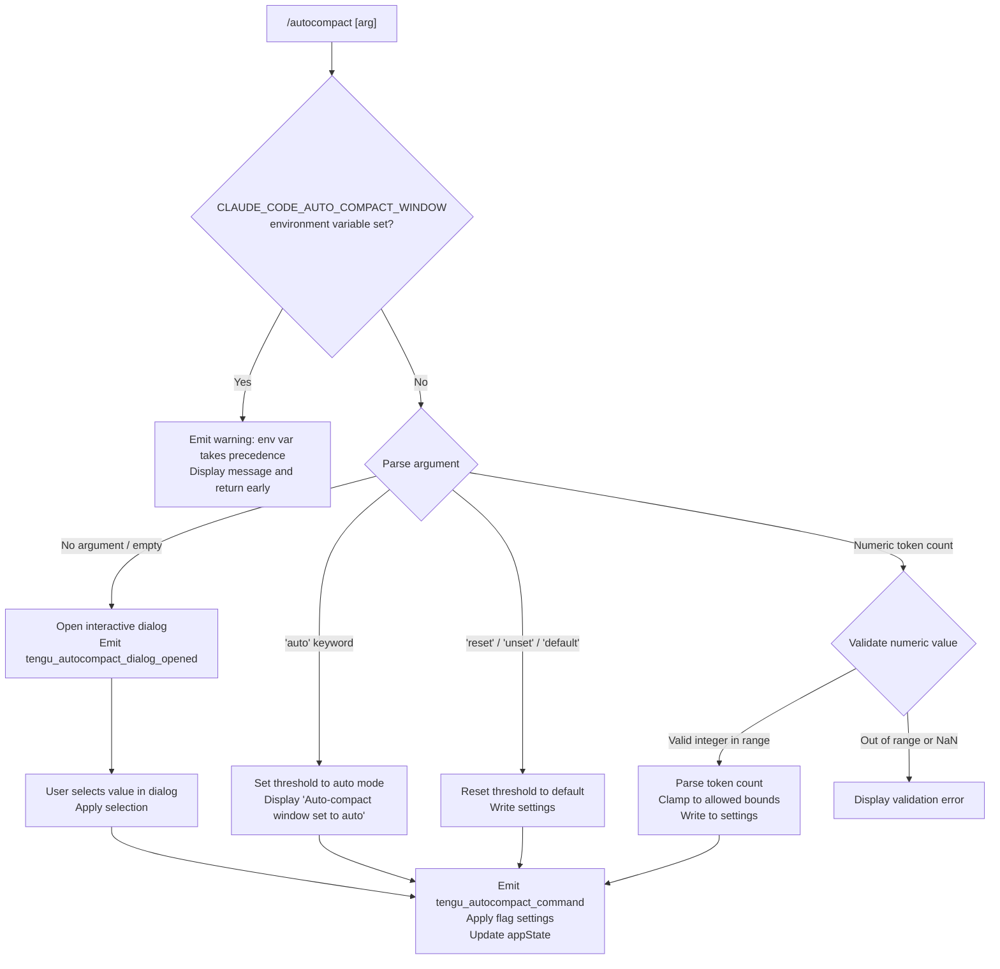

# `/autocompact`

> Analysis basis: CC v2.1.179 bundle.js (AST extraction + Claude interpretation)
> Minimum version: v2.1.179

---

## Overview

`/autocompact` configures the context-window compaction threshold for Claude Code sessions. It allows the user to set an explicit token count, switch to automatic mode (`auto`), or reset the threshold to its default value. When invoked without arguments, or with a special keyword, it may open an interactive dialog for threshold selection.

---

## Registration

| Field | Value |
|---|---|
| type | `local-jsx` |
| name | `autocompact` |
| description | `Set how full the context gets before auto-summarizing` |
| argumentHint | `[auto\|<tokens>]` |
| isHidden | `false` |
| module_id | `BAK` |
| load_inline | `true` |
| loc_byte | `11421118` |
| loc_byte_end | `11421382` |
| loc_line | `7367` |
| arbor_handler.name | `ZBL` |
| arbor_handler.fqn | `claude-2.1.179::ZBL` |
| arbor_handler.kind | `AsyncFunction` |
| arbor_handler.resolution_path | `module_id` |
| arbor_handler.n_hits | `1` |

Analysis basis: CC v2.1.179 bundle.js:+11421118

---

## Input Branching

The command exhibits 5+ distinct branches based on the argument value, requiring a flowchart representation.



Analysis basis: CC v2.1.179 bundle.js:+11415478, +11415512, +11415643, +11415686, +11416115, +11416319, +11420835

---

## Behavioral Spec

### Top-Level Handler

The primary handler is the async function `ZBL` (Arbor-resolved), reached via the `module_id` resolution path through module `BAK`.

```
async function autocompactHandler(args, context):
    // Check environment variable override
    if CLAUDE_CODE_AUTO_COMPACT_WINDOW environment variable is set:
        display warning: "CLAUDE_CODE_AUTO_COMPACT_WINDOW is set and takes precedence..."
        return early

    // Delegate to core implementation
    result = await coreAutocompactLogic(args, context)
    return result
```

Analysis basis: CC v2.1.179 bundle.js:+11420800, +11415512

### Environment Variable Precedence Check

Before processing any argument, the handler checks for the `CLAUDE_CODE_AUTO_COMPACT_WINDOW` environment variable. If present, a fixed warning string is displayed and the command exits without modifying any settings.

```
function checkEnvOverride():
    if env["CLAUDE_CODE_AUTO_COMPACT_WINDOW"] exists:
        emit message: "CLAUDE_CODE_AUTO_COMPACT_WINDOW is set and takes precedence. Unset it to change this setting."
        return BLOCKED
    return PROCEED
```

Analysis basis: CC v2.1.179 bundle.js:+10835296, +11415512

### Argument Parsing (`tMA`)

The argument string is trimmed and classified before dispatch.

```
function parseAutocompactArg(rawArg):
    trimmed = rawArg.trim()

    if trimmed == "" or trimmed is absent:
        return { mode: "dialog" }

    if trimmed == "auto":
        return { mode: "auto" }

    if trimmed in ["reset", "unset", "default"]:
        return { mode: "reset" }

    // Attempt numeric parse
    if trimmed.endsWith("%"):
        value = parseFloat(trimmed)
        // percentage path
    else:
        value = parseInt(trimmed)

    if not Number.isFinite(value):
        return { mode: "error", reason: "not a number" }

    rounded = Math.round(value)
    return { mode: "numeric", value: rounded }
```

Analysis basis: CC v2.1.179 bundle.js:+11415614, +11415643, +11415656, +11415669, +11415686, +10834470, +10834529, +10834547, +10834621, +10834667, +10834714

### Numeric Threshold Validation (`xJ` / `dL9` / `Qk_` / `cL9`)

When a numeric argument is provided, the value is validated and clamped within permitted bounds.

```
function validateAndNormalizeThreshold(rawValue):
    parsed = parseInt(rawValue)

    if isNaN(parsed):
        return { valid: false }

    // Minimum base value: 10 (bundle.js:+3313493)
    // Floor clamp: 0   (bundle.js:+3313513)
    // Maximum: 1000000 (bundle.js:+3313625)
    clamped = Math.max(0, Math.min(1000000, parsed))

    return { valid: true, value: clamped }
```

Analysis basis: CC v2.1.179 bundle.js:+3313286, +3313441, +3313501, +3313493, +3313513, +3313625

### Auto Mode Detection (`n9H`)

Classifies the parsed result as `"valid"`, `"invalid"`, or `"capped"` for downstream handling.

```
function classifyResult(value):
    parsed = parseInt(value)

    if isNaN(parsed):
        return "invalid"         // bundle.js:+5122969

    // Apply capping logic via N()
    status = applyCapLogic(parsed)

    if status == "capped":
        return "capped"          // bundle.js:+5123099
    else:
        return "valid"           // bundle.js:+5122894
```

Analysis basis: CC v2.1.179 bundle.js:+5122894, +5122909, +5122927, +5122969, +5123099

### Settings Write Pipeline (`jB` → `WCL` / `vsq`)

Once the argument is validated, the new threshold is persisted through the settings layer.

```
function writeAutocompactSetting(resolvedValue, source):
    // Determine source layer
    // Layers checked in order: env → settings → experiment → clientdata → model-default
    // (bundle.js:+10835488, +10835558, +10835732, +10835643, +10835829)

    // Validate integer requirement
    if not Number.isInteger(resolvedValue):
        reportError()
        return

    // Write via settings layer (WCL)
    settingsWriter(resolvedValue)

    // Check autoCompactEnabled flag (bundle.js:+10838411)
    if autoCompactEnabled flag exists in settings:
        updateFlag(autoCompactEnabled, resolvedValue)

    // Bounds-clamping with Math.max / Math.min
    finalValue = Math.max(lowerBound, Math.min(upperBound, resolvedValue))
    // (bundle.js:+10835414, +10835454)

    // Persist to disk via DA (settings save pipeline)
    saveSettings(finalValue)
```

Analysis basis: CC v2.1.179 bundle.js:+10835223, +10835230, +10835292, +10835414, +10835454, +10835488, +10835558, +10835576, +10835643, +10835663, +10835732, +10835757, +10835769, +10835829, +10835853, +10835859, +10838408, +10838411

### Settings Persistence (`DA` and subordinates)

The settings save pipeline loads current settings from disk, merges the new value, and writes back through an atomic file operation.

```
async function saveSettingsToDisk(key, value):
    // Load current merged settings from all layers
    // Layers: policySettings, flagSettings, userSettings, projectSettings, localSettings
    // (bundle.js:+1326121, +1326143)

    currentSettings = loadMergedSettings()

    // Merge new autocompact value
    currentSettings[key] = value

    // Validate write will be effective (write_ineffective guard)
    if writeWouldBeIneffective(currentSettings):
        emitWarning("write_ineffective")   // bundle.js:+1327174
        return

    // Atomic write via ED6 (temp file + rename)
    atomicWriteFile(settingsPath, JSON.stringify(currentSettings))

    // Clear caches
    clearSettingsCache()       // bundle.js:+27695, +27707

    // Reload settings from disk
    reloadSettings()

    // Emit gitignore global rule check
    checkGitignoreRule()       // bundle.js:+1327033
```

Analysis basis: CC v2.1.179 bundle.js:+1326121, +1326143, +1326183, +1326218, +1326233, +1326255, +1326291, +1326310, +1326343, +1326371, +1326445, +1326462, +1326614, +1326698, +1326733, +1326763, +1326786, +1326792, +1326928, +1326953, +1326957, +1326977, +1327030, +1327095, +1327137, +1327315, +1327329, +1327339

### Dialog Path (`ZBL` → `KO.createElement`)

When no argument is supplied, the handler renders a JSX dialog component for interactive threshold selection.

```
async function openAutocompactDialog(context):
    // Emit telemetry before rendering
    emit("tengu_autocompact_dialog_opened")   // bundle.js:+11420835

    // Render dialog element
    element = KO.createElement(AutocompactDialogComponent, props)
    // type: "dialog" (bundle.js:+11420880)

    return element
```

Analysis basis: CC v2.1.179 bundle.js:+11420833, +11420877, +11420880, +11420892

### Flag Settings Application (`np6` → `XK`)

After a successful write, flag settings are applied to the running session.

```
function applyFlagSettings(newSettings):
    // Telemetry event "apply_flag_settings" emitted (bundle.js:+11416054)
    emit("tengu_autocompact_command")         // bundle.js:+11416117

    // Apply new settings object to current session state
    applyFlagsToSession(newSettings)

    // If result type is "set", update display
    if resultType == "set":                   // bundle.js:+11416174
        displayConfirmation()

    // If mode was "auto", display specific confirmation
    if mode == "auto":
        displayMessage("Auto-compact window set to auto")  // bundle.js:+11416335
```

Analysis basis: CC v2.1.179 bundle.js:+11415854, +11416054, +11416115, +11416117, +11416153, +11416174, +11416319, +11416335

### Model Name Normalization (`lA` / `Qz`)

During settings loading, model identifier strings are normalized for comparison. Known model name patterns encountered in traversal include: `claude-fable-5`, `claude-mythos-5`, `claude-opus-4-*` variants, `claude-sonnet-4-*` variants, `claude-haiku-4-5`, and several Claude 3.x identifiers. Also handles `application-inference-profile` type identifiers.

```
function normalizeModelName(modelId):
    lower = modelId.toLowerCase()
    if lower.includes(knownPrefix):
        return lower.replace(pattern, canonical)
    return modelId
```

Analysis basis: CC v2.1.179 bundle.js:+2282289, +2282305, +2282316, +2282371, +2282428, +2282485, +2282542, +2282599, +2282656, +2282745, +2282777, +2282838, +2282933, +2282967, +2283026, +2283087, +2283148, +2283207, +2283260, +2283317, +2283365, +2283433, +2283442, +2283453, +2283493, +2283497

---

## State & Side Effects

| Item | Detail |
|---|---|
| Telemetry: `tengu_autocompact_command` | Fired after successful argument processing and settings update (bundle.js:+11416117) |
| Telemetry: `tengu_autocompact_dialog_opened` | Fired when the interactive dialog is opened (no-argument path) (bundle.js:+11420835) |
| Telemetry: `tengu_amber_redwood2` | Fired during the `vsq`/`Y6` path — compaction feature-flag check (bundle.js:+10834885) |
| Telemetry: `tengu_feature_ok` | Fired on successful feature check in `IH`/`d` pipeline (bundle.js:+1020479) |
| Telemetry: `tengu_feature_bad` | Fired on a blocked/bad feature state in `CH`/`d` pipeline (bundle.js:+1020546) |
| Telemetry: `tengu_feature_sad` | Fired on an unavailable feature state in `U6`/`d` pipeline (bundle.js:+1020627) |
| Settings write | Persists `autoCompactThreshold` (or equivalent key) to the user or project settings JSON file via an atomic rename operation |
| Settings cache clear | Both `dl6` and `Se8` caches are cleared after write (bundle.js:+27695, +27707) |
| Settings reload | Full settings reload from disk is triggered after write (bundle.js:+1326953) |
| gitignore check | Checks global gitignore rule (`gitignore_global_rule`) after settings update (bundle.js:+1327033) |
| `write_ineffective` guard | Detects when a write would have no effect and emits a warning rather than writing (bundle.js:+1327174) |
| JSX dialog render | In the no-argument path, renders a `dialog`-typed JSX element via `KO.createElement` (bundle.js:+11420892) |
| Environment variable block | `CLAUDE_CODE_AUTO_COMPACT_WINDOW` env var, when set, completely blocks all setting changes (bundle.js:+10835296) |
| `autoCompactEnabled` flag | Boolean flag in settings layer read/written as part of threshold update (bundle.js:+10838411) |

---

## Version History

| Version | Change |
|---|---|
| v2.1.179 | Initial analysis |

---

## Common Mistakes

1. **Setting a token count while `CLAUDE_CODE_AUTO_COMPACT_WINDOW` is set in the environment**: The command will silently refuse to apply the change and display a precedence warning. Unset the environment variable before using `/autocompact`.
2. **Providing a non-integer or out-of-range value**: Values outside the permitted range (0–1,000,000) are clamped, and non-numeric strings yield a validation error. Use `/autocompact auto` to delegate threshold selection to the system.
3. **Expecting immediate effect without a session restart**: The settings reload is synchronous within the command handler, but some in-flight operations may still use the old threshold value until the next compaction evaluation.
4. **Confusing `reset`/`unset`/`default` with `auto`**: These keywords remove an explicit threshold override (reverting to compiled defaults), whereas `auto` sets a specific automatic-calculation mode. They are distinct behaviors.
5. **Assuming the dialog always opens**: The interactive dialog only appears when no argument is passed. Passing any argument — including whitespace-only strings that trim to empty — triggers the argument-parse path instead.

---

## Appendix — Identifier Mapping

> For bundle debugging only. Identifiers change across versions.

| Identifier | Role |
|---|---|
| `ZBL` | Primary async handler for `/autocompact` (Arbor-resolved entry point) |
| `np6` | Core autocompact logic: argument dispatch, env-var check, settings write orchestration |
| `jB` | Settings merge and threshold value resolution function |
| `lA` | Model name lookup / normalization utility |
| `HrH` | Model entry iterator (uses `Object.entries`) |
| `Qz` | Model identifier string normalization (toLowerCase / includes / replace) |
| `H` | Random delay utility (Math.random + setTimeout); also reused as generic string variable |
| `a$6` | Auxiliary helper called during model normalization |
| `aL` | String replacement helper (H.replace wrapper) |
| `wD` | Settings source resolver (delegates to `OT`) |
| `OT` | Low-level settings object accessor |
| `xJ` | Argument validation dispatcher (calls `dL9`, `Qk_`, `cL9`) |
| `dL9` | Raw integer parse + NaN check (parseInt / isNaN) |
| `Qk_` | Intermediate validation combinator (`cQH`, `dL9`, `cL9`) |
| `cL9` | Range enforcement and state writer (`Dw`, `sF`, `uS`, `GO8`) |
| `n9H` | Result classifier returning `"valid"` / `"invalid"` / `"capped"` |
| `N` | Display/formatting utility (uppercase, trim, color codes) |
| `WCL` | Settings write coordinator (validates integer, calls `gG` and `lL9`) |
| `gG` | Flag-setting reader (`f6`, `d4` accessors) |
| `lL9` | Setting layer writer (delegates to `h6`) |
| `vsq` | Feature-flag / experiment lookup (`gG`, `p_`, `Y6`, `tMA`) |
| `p_` | Feature flag state accessor |
| `Y6` | Experiment feature resolver (IG6, SG6, fp, QXH, mO8, kG6, hg, h6) |
| `tMA` | Argument string parser: trim, endsWith, parseFloat, parseInt, Number.isFinite, Math.round |
| `DA` | Settings save pipeline orchestrator |
| `g3` | Settings path resolver (`oDH`, `vb`) |
| `oDH` | Settings file path builder (join, M68, $r4, ym, Mr4) |
| `vb` | Settings object constructor (G_, p$6, H6_, x$6, JNH, XNH, B$6, t_H, sDH, X68, PH1, us, Wj6) |
| `c6` | File existence / stat utility |
| `BM_` | Settings disk loader (_H1, oDH, CF, eeA, ys) |
| `_H1` | Settings object key enumerator (UM_, Object.keys, ys) |
| `CF` | Settings merge function (ZSA, _S, uM_, ESA) |
| `eeA` | SDK inline settings loader (_S, r7H, ZS, JnH) |
| `$W` | Settings layer wrapper (delegates to `Is`) |
| `Is` | File-based settings reader (c6, iL, N, Ve6, readFileSync, ve6, f.slice, f.replaceAll) |
| `x8` | File path resolver (G8) |
| `G8` | Low-level path normalization |
| `r5_` | Timestamp recorder (ZH8.set, Date.now) |
| `ZkH` | Resolved-path helper (M68, vb) |
| `M68` | Path resolution utility (lk.resolve, z_, lk.dirname) |
| `ED6` | Atomic file write utility (readlink, isAbsolute, resolve, dirname, randomBytes, writeFileSync, fchmodSync, fsyncSync, renameSync, unlinkSync) |
| `q` | Filesystem module proxy (delegates to `p1`) |
| `O` | File stat proxy (delegates to `y8`) |
| `L` | Low-level I/O handle (A.close, q.close, f) |
| `bH` | JSON serializer (JSON.stringify wrapper) |
| `Mz` | Settings cache invalidator (dl6.clear, Se8.clear) |
| `JH8` | Settings file writer with gitignore awareness (x6, R5_, H.replaceAll, A.endsWith, jH8, un4, F7H.dirname, pDH.mkdir/readFile/appendFile/writeFile, esA, N, HtA, G8, String) |
| `x6` | Path existence checker (Ee6, G_) |
| `R5_` | Retry/backoff helper (kf) |
| `A` | String utility proxy (L.toLowerCase) |
| `jH8` | Git check-ignore runner (o_) |
| `un4` | Git config excludesfile reader (o_, _.trim, q.startsWith, F7H.join, m5_.homedir, q.slice, F7H.isAbsolute) |
| `esA` | Git ls-files tracker checker (o_) |
| `HtA` | Gitignore warn logger |
| `ym` | `.claude` directory path builder (lk.join) |
| `G_` | App state accessor (OT) |
| `IH` | Feature-ok path handler (d, QH) |
| `d` | Feature state dispatcher |
| `QH` | Feature check core (n36) |
| `U6` | Feature-sad path handler (d, QH) |
| `CH` | Feature-bad path handler (d, QH) |
| `bF` | Settings load trigger ($T, Yq, FM_, vb, cl6) |
| `$T` | Settings load prerequisite check |
| `Yq` | Memory usage recorder (dbA.has/add, Lm, Q__.push, process.memoryUsage) |
| `FM_` | Full settings load orchestrator (Date.now, C8, ll6, ys, Pj6, _H1, f.has/add, K.push, oDH, lk.resolve, L.has/add, CF, eeA) |
| `cl6` | Post-load callback or cleanup |
| `SH` | Error display / history handler (WA, f6, fq, Nd4, hlH.push, ks.logError) |
| `WA` | Error formatter (Error, String) |
| `f6` | Boolean/string coercer (String) |
| `fq` | Traffic category filter (YrA) |
| `Nd4` | History queue manager (Xe6.shift/push) |
| `t_` | App state reader (bF) |
| `q6` | React/UI primitive (n36) |
| `n36` | Core UI node factory |
| `XK` | Flag settings applier (qf) |
| `qf` | Flag application executor (eM4) |
| `eM4` | Flag value setter |

---

Note: index built via Arbor fallback; some signals (telemetry, literals) may be missing — see arbor-fallback.js.