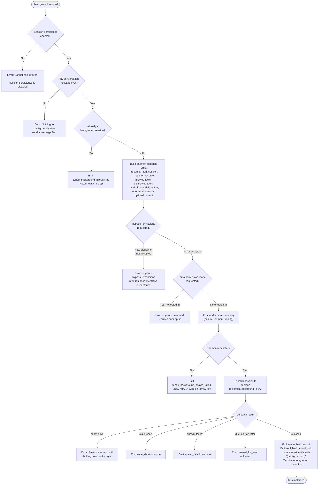

# `/background`

> Analysis basis: CC v2.1.179 bundle.js (AST extraction + Claude interpretation)
> Minimum version: v2.1.179

---

## Overview

`/background` (alias: `/bg`) sends the current interactive REPL session to the Claude Code background daemon, freeing the terminal for other use. It forks the session into a persistent background job managed by the daemon process, then terminates the foreground connection. An optional prompt argument can be appended to supply an initial message to the forked background job.

---

## Registration

| Field | Value |
|---|---|
| type | `local-jsx` |
| name | `background` |
| description | `Send this session to the background and free the terminal` |
| aliases | `["bg"]` |
| argumentHint | `[prompt]` |
| immediate | `null` |
| module_id | `XNK` |
| load_inline | `true` |
| loc_byte | `13515891` |
| loc_byte_end | `13516131` |
| arbor_handler.name | `iM5` |
| arbor_handler.fqn | `claude-2.1.179::iM5` |
| arbor_handler.kind | `AsyncFunction` |
| arbor_handler.resolution_path | `module_id` |
| arbor_handler.n_hits | `0` |

Analysis basis: CC v2.1.179 bundle.js:+13515891

---

## Input Branching

The command has 4+ distinct paths depending on session-persistence availability, conversation state, whether the session is already backgrounded, and daemon reachability. A Mermaid flowchart is used.



---

## Behavioral Spec

### Guard: Session Persistence Check

```
function checkSessionPersistenceEnabled(appState):
    if not appState.sessionPersistenceEnabled:
        return Error("Cannot background — session persistence is disabled, ...")
    return OK
```

Analysis basis: CC v2.1.179 bundle.js:+13515245

### Guard: Conversation Non-Empty Check

```
function checkHasMessages(conversationHistory):
    if conversationHistory is empty:
        return Error("Nothing to background yet — send a message first.")
    return OK
```

Analysis basis: CC v2.1.179 bundle.js:+13515421

### Guard: Already-Backgrounded Check

```
function checkNotAlreadyBackground(sessionContext):
    if sessionContext.isBackgroundSession == true:
        emit telemetry(tengu_background_already_bg)
        return NOOP
    return OK
```

Analysis basis: CC v2.1.179 bundle.js:+13515179

### Argument Construction (buildDispatchArgs)

```
function buildDispatchArgs(opts):
    args = []
    args.append("--resume", currentSessionId)
    args.append("--fork-session")
    if opts.replyOnResume:
        args.append("--reply-on-resume")
    if opts.allowedTools:
        args.append("--allowed-tools", opts.allowedTools)
    if opts.disallowedTools:
        args.append("--disallowed-tools", opts.disallowedTools)
    for dir in opts.addedDirs:
        args.append("--add-dir", dir)
    if opts.model:
        args.append("--model", opts.model)
    if opts.effort:
        args.append("--effort", opts.effort)
    if opts.permissionMode:
        args.append("--permission-mode", opts.permissionMode)
    if opts.userPrompt:
        args.append("--", opts.userPrompt)
    return args
```

Analysis basis: CC v2.1.179 bundle.js:+13510689 through +13510977

### Permission Pre-flight Checks

```
function checkPermissionPreflights(opts, settings):
    if opts.bypassPermissions:
        if not settings.bypassPermissionsDisclaimer:
            return Error("--bg with bypassPermissions requires accepting the disclaimer first...")
    if opts.permissionMode == "auto":
        if not settings.autoModeOptIn:
            return Error("--bg with auto mode requires opting in first...")
    return OK
```

Analysis basis: CC v2.1.179 bundle.js:+13508794 and +13508956

### Daemon Bootstrap (ensureDaemonRunning)

```
async function ensureDaemonRunning():
    status = checkDaemonStatus()   // via ensureDaemonRunning helper (RB)
    if status == "up":
        return OK
    if daemonServiceExecStale:
        emit tengu_bg_daemon_service_stale_exec
        fallback to transient spawn
    if no daemon running:
        ask user: "Install as a service now? [y/N/never, or 'once' just for now]"
        emit tengu_bg_daemon_cold_start_ask
        if answer in ["yes", "once"]:
            install / spawn daemon
        else:
            emit tengu_bg_daemon_cold_start_ask_answer
    if spawn fails:
        emit tengu_bg_daemon_spawn_failed
        return Error
```

Analysis basis: CC v2.1.179 bundle.js:+13443856 through +13446494

### Session Dispatch (dispatchBackground)

```
async function dispatchToBackground(args, sessionId):
    emit tengu_bg_dispatch
    socketPath = computeControlSocketPath()
    result = await socketDispatch(socketPath, args, timeout=6000ms)
    // Flush timeout for pending writes: 2000ms
    // ACK await timeout applied via r4 (Promise.race with setTimeout)
    match result.status:
        case "short_alive":
            emit tengu_bg_dispatch_rescued (if recovered)
            return Error("Previous session is still shutting down — try again in a moment")
        case "stale_short":
            return outcome("stale_short")
        case "daemon-unreachable" | "ack-timeout" | "dispatch-write" | "enoconn" | "estarting":
            emit tengu_bg_dispatch_fallback
            return Error(mapped message)
        case "spawn_failed":
            return outcome("spawn_failed")
        case "queued_for_later":
            return outcome("queued_for_later")
        case success:
            return OK(result)
```

Analysis basis: CC v2.1.179 bundle.js:+13483658 through +13485779; flush timeout literal at +13510633; ACK timeout at +13484166 (6000 ms)

### Post-Dispatch Foreground Teardown

```
function teardownForeground(sessionId, prompt):
    emit telemetry(tengu_background)
    emit telemetry(repl_background_fork)
    updateSessionTitle(sessionId + " (backgrounded)")
    sendDetachRequest()          // jzH / detach-request message
    terminateForegroundWorker()  // process.exit(1) or graceful close
```

Analysis basis: CC v2.1.179 bundle.js:+13512141 (tengu_background), +13511993 (repl_background_fork), +13512876 ("(backgrounded)"), +13515382 (zn8 / detach routing)

### Spawn-Failure Retry UI

```
function showRetryUI(errorMessage):
    emit tengu_background_spawn_failed
    display: "couldn't start in the background — press Enter to retry"
    register key handler for "left_arrow" / Enter → re-invoke dispatchToBackground
```

Analysis basis: CC v2.1.179 bundle.js:+13511333 (tengu_background_spawn_failed), +13511696 ("couldn't start in the background…"), +13511385 ("left_arrow")

### Worker-Side Detach Acknowledgement (iM5 / handler)

The Arbor-resolved handler `iM5` (AsyncFunction) runs inside the daemon worker that receives the forked session. Its responsibilities include:

```
async function backgroundSessionHandler(context):
    // Guard: already background?
    if context.isBackgroundSession:
        emit tengu_background_already_bg
        return NOOP
    // Guard: session persistence disabled
    if not context.persistenceEnabled:
        return renderError("Cannot background — session persistence is disabled, ...")
    // Guard: no messages yet
    if context.messages.length == 0:
        return renderError("Nothing to background yet — send a message first.")
    // Emit detach-request message to worker (jzH → "detach-request")
    sendDetachRequest(context.workerId)
    // Render JSX confirmation element in foreground (LwH.createElement)
    return JSX_element
```

Analysis basis: CC v2.1.179 bundle.js:+13515165 (V9/daemon-worker context check), +13515213 (H / session state), +13515217 (jzH → "detach-request"), +13515382 (zn8 render branch), +13515491 (LwH.createElement)

---

## State & Side Effects

| Item | Detail |
|---|---|
| Telemetry: tengu_background | Emitted on successful background dispatch (bundle.js:+13512141) |
| Telemetry: tengu_background_already_bg | Emitted when session is already a background session (bundle.js:+13515179) |
| Telemetry: tengu_background_spawn_failed | Emitted when daemon spawn/dispatch fails (bundle.js:+13511333) |
| Telemetry: tengu_bg_dispatch | Emitted at start of every background dispatch attempt (bundle.js:+13485779) |
| Telemetry: tengu_bg_dispatch_fallback | Emitted when dispatch falls back due to unreachability (bundle.js:+13486309) |
| Telemetry: tengu_bg_dispatch_rescued | Emitted when a rescued dispatch succeeds (bundle.js:+13492842) |
| Telemetry: tengu_bg_daemon_cold_start_ask | Emitted when user is prompted to install daemon (bundle.js:+13444942) |
| Telemetry: tengu_bg_daemon_cold_start_ask_answer | Emitted after user answers the install prompt (bundle.js:+13451669) |
| Telemetry: tengu_bg_daemon_spawn_failed | Emitted when daemon spawn ultimately fails (bundle.js:+13445513) |
| Telemetry: tengu_bg_daemon_service_stale_exec | Emitted when daemon binary path is stale (bundle.js:+13443994) |
| Telemetry: repl_background_fork | Emitted as part of post-dispatch accounting (bundle.js:+13511993) |
| appState changes | Session title suffixed with `"(backgrounded)"` (bundle.js:+13512876); foreground worker terminated |
| Daemon interaction | Opens a Unix domain control socket to the daemon; writes a dispatch record; awaits ACK (6000 ms timeout) |
| Flush timeout | 2000 ms flush wait for pending writes before dispatch (bundle.js:+13510633) |
| process.exit | Called on foreground process once detach is confirmed (bundle.js:+13487017) |
| Daemon install prompt | Interactive Y/N/never/once prompt; writes service config on "yes"/"once" (bundle.js:+13451594) |
| Hook registration | No direct hook registration found in depth-2 traversal |
| Sound | <!-- TODO: not found in depth-2 traversal; needs --depth 4 --> |

---

## Version History

| Version | Change |
|---|---|
| v2.1.179 | Initial analysis |

---

## Common Mistakes

1. **Running `/background` before sending any message** — the command exits immediately with "Nothing to background yet — send a message first." You must have at least one exchange in the conversation.
2. **No daemon installed and answering "never"** — answering "never" or "no" at the daemon install prompt prevents backgrounding entirely for this and future invocations. Run `claude daemon install` manually to set up the service.
3. **Using `/background` with `--dangerously-skip-permissions` without prior interactive acceptance** — the command blocks with an error; run the flag once interactively to accept the disclaimer before using it with `/bg`.
4. **Using `/background` in a session with persistence disabled** — sessions launched without persistence (e.g., certain non-interactive modes) cannot be backgrounded; the command exits with an error immediately.
5. **Retrying too quickly after a prior `/background`** — if the previous background job is still shutting down, the daemon returns a `short_alive` error; wait a moment and press Enter to retry via the built-in retry UI.
6. **Confusing `/background` with `--cloud`** — the daemon-based background (`/bg`) and cloud sessions (`--cloud`) are different backends; mixing flags produces an explicit error message (bundle.js:+13453994).

---

## Appendix — Identifier Mapping

> For bundle debugging only. Identifiers change across versions.

| Identifier | Role |
|---|---|
| `iM5` | Main background command handler (AsyncFunction; Arbor-resolved) |
| `On8` | Top-level background command orchestrator |
| `ja` | Background job setup / dispatch builder |
| `pM5` | Background session parameter assembly |
| `q0A` | Daemon dispatch executor |
| `RB` | Daemon ensure-running helper |
| `_g6` | Daemon cold-start / install flow |
| `ANK` | Dispatch acknowledgement handler |
| `JY` | Control socket connection helper |
| `R4H` | Control socket file reader |
| `$g8` | Socket connect with timeout helper |
| `pBH` | Control socket path builder |
| `lM5` | Argument list filter / allowed-tools processor |
| `fn8` | Flag argument parser (--resume, --fork-session, etc.) |
| `zNK` | Resume-ID flag parser |
| `nM5` | Session-ID flag resolver |
| `Ln8` | Session-ID long-form parser |
| `YNK` | Additional flag processor |
| `DNK` | Disallowed-tools flag processor |
| `D2H` | Allowed-tools flag processor |
| `wNK` | Add-dir flag processor |
| `UVH` | Flag value extractor |
| `Xc` | Argument classifier |
| `G8H` | Prefix-match argument tester |
| `Nb` | Settings loader for bypass-permissions |
| `R8` | Settings store reader |
| `FWA` | Cloud/remote flag conflict checker |
| `zn8` | JSX render router for background result |
| `UL6` | Fork-session UI renderer |
| `psL` | Session fork parameter builder |
| `lT` | Main agent query loop for forked session |
| `jC8` | Agent app-state manager |
| `sR` | Session-rename / post-fork handler |
| `IL8` | Config watcher initializer |
| `h6` | Config file reader |
| `r5H` | Config file parser |
| `brf` | Config file watcher |
| `jzH` | Detach-request message sender |
| `DB` | Raw write helper for detach message |
| `DAK` | Detach message type dispatcher |
| `V9` | Daemon-worker context accessor |
| `md` | Background mode renderer |
| `jyH` | tmux environment inspector |
| `HZf` | tmux spawnSync runner |
| `eTf` | tmux child-session check |
| `q0A` | Daemon dispatch state machine |
| `_0A` | Dispatch error classifier |
| `p1` | Foreground process exit helper |
| `r4` | Promise.race timeout helper (2000 ms flush) |
| `Gz` | Compact-boundary helper |
| `X2H` | Config persistence writer |
| `D0A` | Signal / interrupt registration |
| `Pf` | Signal handler |
| `U9` | Signal registration (oSA.register) |
| `iE` | Interrupt event emitter |
| `wNH` | Shutdown orchestrator |
| `Y` | Worker shutdown helper |
| `z` | Daemon-stop sequence |
| `QB` | Graceful daemon shutdown (Promise.race/all) |
| `tLH` | Shutdown finalizer |
| `eLH` | Cleanup-timeout handler |
| `n8` | Abort-with-timeout helper |
| `Lw` | Session list helper |
| `q3` | Boolean filter helper |
| `NA6` | Notification helper |
| `LGH` | Lifecycle event logger |
| `U6` | Feature-flag event emitter (tengu_feature_sad) |
| `IH` | Feature-ok telemetry emitter |
| `CH` | Feature-bad telemetry emitter |
| `QH` | Feature telemetry base |
| `GH` | String coercion helper |
| `G_` | Context store getter |
| `Ee6` | AsyncLocalStorage getter |
| `x6` | Storage context helper |
| `OT` | Storage context root |
| `SH` | MCP error log helper |
| `w7` | MCP error event emitter |
| `$8` | MCP debug event emitter |
| `KxH` | MCP connection manager |
| `M` | MCP server update dispatcher |
| `fhA` | MCP server config reconciler |
| `Us8` | MCP connection apply helper |
| `GG` | MCP connection cleanup helper |
| `KOH` | Teammate-mailbox mark-read helper |
| `CmH` | Mailbox lock handler |
| `N` | Message normalizer |
| `g4` | Message body formatter |
| `bH` | JSON stringify helper |
| `qx5` | Daemon IPC message processor |
| `P` | IPC stream reader |
| `cL` | IPC connection ender |
| `Lc6` | IPC write wrapper |
| `_94` | IPC dispatch tracker |
| `Ax5` | Worker lifecycle manager |
| `I` | Daemon health-check timer |
| `D` | Worker spawn/kill manager |
| `c` | Scheduled task runner |
| `y` | Worker state tracker |
| `oRH` | Stale-file cleaner |
| `zq` | Job state-file reader |
| `P4` | Jobs directory path builder |
| `GE` | Jobs base-path helper |
| `U_H` | Session file scanner |
| `Q0` | Directory scanner helper |
| `gw` | Realpath resolver |
| `yY` | Path validator |
| `Tb` | Path joiner |
| `zc4` | File line scanner |
| `rl8` | Attach-session helper |
| `Y6` | Screen/render scheduler |
| `_x5` | Stall detector |
| `yTK` | Background session timestamp helper |
| `R` | Daemon yield writer |
| `W` | MCP reconnect helper |
| `t` | MCP state updater |
| `a` | MCP apply helper |
| `o` | MCP notification sender |
| `T` | MCP tool-schema builder |
| `J36` | Tool schema helper |
| `Q` | Idle-exit timer |
| `g` | Permission classifier |
| `tq6` | Permission action router |
| `xd` | Permission deny handler |
| `nyK` | Main agent query engine |
| `XFH` | Fallback request handler |
| `z3A` | Non-streaming fallback builder |
| `DG` | Message delta processor |
| `vU8` | Agent listing builder |
| `iCL` | Content block mapper |
| `Ssq` | OCL stream helper |
| `sR` | Session rename handler |
| `B4` | Session rename base |
| `vU8` | File context builder |
| `M2` | Auth key type resolver |
| `u_` | Foundry key helper |
| `j7` | Iq8 key helper |
| `q2_` | Managed-key classifier |
| `Q1` | Key format validator |
| `CLH` | Credential loader |
| `vy` | Auth token verifier |
| `Hm` | Background mode flag |
| `XhK` | Environment-type classifier |
| `f6` | String coercion (String()) |
| `md` | Background render helper |

---

Note: index built via Arbor fallback; some signals (telemetry, literals) may be missing — see arbor-fallback.js.