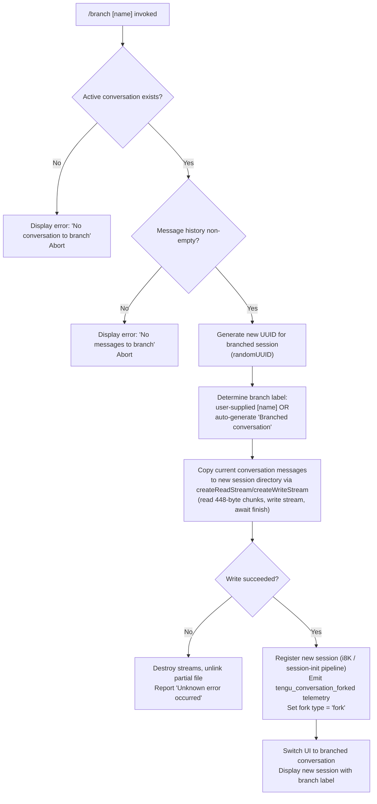

# `/branch`

> Analysis basis: CC v2.1.179 bundle.js (AST extraction + Claude interpretation)
> Minimum version: v2.1.179

---

## Overview

The `/branch` command creates a divergent copy of the current conversation at the moment it is invoked, preserving the existing message history up to that point while starting a new independent session. An optional name argument can be supplied to label the branched conversation. The command forks the active conversation context, writes the branched session data to disk, and emits a telemetry event confirming the fork.

---

## Registration

| Field | Value |
|---|---|
| type | `local-jsx` |
| name | `branch` |
| description | `Create a branch of the current conversation at this point` |
| argumentHint | `[name]` |
| module_id | `VOA` |
| load_inline | `true` |
| loc_byte | `12908777` |
| loc_byte_end | `12908954` |
| loc_line | `8895` |
| arbor_handler.name | `ppL` |
| arbor_handler.fqn | `claude-2.1.179::ppL` |
| arbor_handler.kind | `AsyncFunction` |
| arbor_handler.resolution_path | `module_id` |
| arbor_handler.n_hits | `0` |

Analysis basis: CC v2.1.179 bundle.js:+12908777

---

## Input Branching

Four distinct paths exist: no conversation present, no messages to branch, a successful fork with an optional user-supplied name, and an error during the fork operation. A Mermaid flowchart is used to represent these branches.



Analysis basis: CC v2.1.179 bundle.js:+11322601, +11323048, +11324167, +11325396, +11326065

---

## Behavioral Spec

### Top-Level Handler (`ppL`)

The Arbor-resolved handler for `/branch` is the async function `ppL` (FQN: `claude-2.1.179::ppL`, resolved via `module_id`). It orchestrates the entire branching workflow by calling `conversationFileWriter` (`n8K`) and `sessionInitializer` (`i8K`).

Analysis basis: CC v2.1.179 bundle.js:+11326181

```
async function branchCommandHandler(commandArgs):
    result = await conversationFileWriter(commandArgs)
    if result.ok:
        await sessionInitializer(result.newSessionData)
    else:
        displayError(result.error)
```

---

### Guard Checks and Pre-flight Validation (`n8K`)

Before any file I/O, the handler verifies that a conversation is active and that it contains at least one message.

```
async function conversationFileWriter(args):
    if not currentConversation:
        raise "No conversation to branch"      // bundle.js:+11323048

    messageList = getConversationMessages()
    if messageList is empty:
        raise "No messages to branch"          // bundle.js:+11324167

    branchName = args.name OR "Branched conversation"   // bundle.js:+11322601

    newSessionId = crypto.randomUUID()         // bundle.js:+11322840

    newSessionPath = buildSessionPath(newSessionId)
    await fs.mkdir(newSessionPath, { recursive: true })  // bundle.js:+11322902

    // Stream-copy conversation file in 448-byte chunks
    readStream  = fs.createReadStream(sourceFile,  { highWaterMark: 448 })  // bundle.js:+11322933
    writeStream = fs.createWriteStream(destFile)                            // bundle.js:+11323097

    writeStream.on("drain", ...)  // backpressure handling  // bundle.js:+11323408

    for each chunk from readStream:
        writeStream.write(chunk)

    await streamFinished(writeStream)          // bundle.js:+11324577

    return { ok: true, newSessionId, branchName }

  on error:
    readStream.destroy()
    await fs.unlink(destFile)
    return { ok: false, error: "Unknown error occurred" }  // bundle.js:+11326065
```

Analysis basis: CC v2.1.179 bundle.js:+11322840, +11322902, +11322933, +11322951, +11323097, +11323311, +11323380, +11324043, +11324577

---

### Session Initialization and UI Switch (`i8K`)

After the file copy succeeds, the session initializer sets up the new branch as a live conversation.

```
async function sessionInitializer(newSessionData):
    // Resolve git worktree context for the branch if applicable
    worktreeInfo = resolveWorktree()           // via lo / l$H at bundle.js:+11325259

    // Register the new session with the session roster
    registerSession(newSessionData)            // via YB / rUH at bundle.js:+11325363

    // Record fork metadata (type = "fork")
    setForkMetadata(newSessionData.id, type = "fork")  // bundle.js:+11325917

    // Emit telemetry
    emit("tengu_conversation_forked")          // bundle.js:+11325396

    // ISO timestamp for session record
    timestamp = new Date().toISOString()       // bundle.js:+11325486

    // Switch active UI context to branched conversation
    activateSession(newSessionData)

    // Resume any paused input stream
    inputStream.resume()                       // bundle.js:+11325904
```

Analysis basis: CC v2.1.179 bundle.js:+11325259, +11325332, +11325363, +11325381, +11325394, +11325396, +11325483, +11325486, +11325535, +11325904, +11325917

---

### Branch Name Normalization (`l8K`)

When the user supplies a `[name]` argument, it is sanitized before use as the branch label.

```
function normalizeBranchName(rawInput, existingNames):
    // Find if rawInput collides with any existing session name
    match = existingNames.find(n => n == rawInput)   // bundle.js:+11322653

    // Replace disallowed characters (filesystem-safe substitution)
    safeName = rawInput.replace(UNSAFE_CHARS_PATTERN, REPLACEMENT)  // bundle.js:+11322731

    return safeName
```

Analysis basis: CC v2.1.179 bundle.js:+11322653, +11322731

---

### Content Replacement During Copy (`n8K` continuation)

During the stream copy, a "content-replacement" pass is applied to the conversation data before writing to ensure correct metadata in the new session.

```
function applyContentReplacement(chunk):
    // Marker string "content-replacement" tags replaceable regions
    // bundle.js:+11323528
    processedChunk = substituteSessionMetadata(chunk, newSessionId)
    return processedChunk
```

Analysis basis: CC v2.1.179 bundle.js:+11323528

---

### Parallel Message Transform (`W`)

After the write stream is finalised, the call graph shows a parallel mapping step across message entries to build the final message list for the new session.

```
function buildNewSessionMessages(messages):
    transformed = messages.map(msg => transformMessageForBranch(msg))
    results = await Promise.all(transformed)
    return results
```

Analysis basis: CC v2.1.179 bundle.js:+11324043, +16905707

---

## State & Side Effects

| Item | Detail |
|---|---|
| Telemetry | `tengu_conversation_forked` (bundle.js:+11325396) — fired on successful fork; `tengu_worktree_detection` (bundle.js:+8526701) — fired when resolving git worktree context; `tengu_session_renamed` (bundle.js:+13646512) — fired if branch receives a custom title via `YB`; `tengu_agent_name_set` (bundle.js:+13650049) — fired when branch agent name is registered via `rUH` |
| File I/O | Creates a new directory under the sessions path (`fs.mkdir` at bundle.js:+11322902); writes a copy of the source conversation file via read/write streams (bundle.js:+11322951, +11323097); unlinks partial file on failure (bundle.js:+11323311) |
| Session roster | New session entry added with fork type `"fork"` (bundle.js:+11325917) and an ISO-8601 timestamp (bundle.js:+11325486) |
| UUID generation | New session ID generated via `crypto.randomUUID()` (bundle.js:+11322840) |
| Stream chunk size | Read stream high-water mark: **448 bytes** (bundle.js:+11322933) |
| Write buffer size | Write stream buffer: **384 bytes** (bundle.js:+11323143) |
| Progress events | `"progress"` event emitted during copy (bundle.js:+11324085) |
| Input stream | Conversation input stream is resumed after branch completes (bundle.js:+11325904) |
| appState changes | Active conversation context is switched to the newly created branch session |
| Sound | <!-- TODO: not found in depth-2 traversal; needs --depth 4 --> |
| Hook registration | <!-- TODO: not found in depth-2 traversal; needs --depth 4 --> |

---

## Version History

| Version | Change |
|---|---|
| v2.1.179 | Initial analysis |

---

## Common Mistakes

1. **Running `/branch` with no active conversation**: The command immediately errors with "No conversation to branch" (bundle.js:+11323048) if there is no current session; ensure a conversation is open before invoking it.
2. **Running `/branch` on a fresh empty conversation**: If no messages have been exchanged yet, the error "No messages to branch" (bundle.js:+11324167) is shown; at least one message must exist in the history.
3. **Expecting the original conversation to be modified**: `/branch` is a copy-on-fork — the source conversation is unchanged. Both conversations share the same history up to the branch point but diverge independently afterward.
4. **Omitting the optional `[name]` argument**: Without a name, the branch is labelled "Branched conversation" (bundle.js:+11322601). Supply a descriptive name to distinguish multiple branches from the same session.
5. **Assuming instant availability after command returns**: The branch session is written to disk via streaming I/O. If the process is interrupted mid-copy, the partial file is unlinked automatically (bundle.js:+11323311), but the branch will not appear.

---

## Appendix — Identifier Mapping

> For bundle debugging only. Identifiers change across versions.

| Identifier | Role |
|---|---|
| `ppL` | Top-level async handler for `/branch` (Arbor-resolved entry point) |
| `i8K` | Session initializer — registers new branch session and switches UI context |
| `n8K` | Conversation file writer — validates state, streams conversation copy to new path |
| `l8K` | Branch name normalizer — sanitizes user-supplied name argument |
| `mpL` | Branch metadata builder — assembles new session record with fork markers |
| `lo` | Git worktree resolver — detects and records worktree context for the branch |
| `l$H` | Worktree listing parser — runs `git worktree list --porcelain` and parses output |
| `RhK` | File tree scanner — traverses directory structure for session context |
| `xFH` | Buffer allocator used during conversation data processing |
| `YB` | Session title/rename handler — applies custom title if user supplied `[name]` |
| `OwH` | Session log writer — appends session metadata to log file |
| `rUH` | Agent-name registration handler — associates agent name with new branch session |
| `Vn` | Persistent store updater — reads and writes branch session state file |
| `$P6` | Config file read/write helper used during session state persistence |
| `HN` | String escape utility — escapes special characters in branch name |
| `Z9` | Substring extractor — slices identifiers (e.g., timestamps) from strings |
| `q$` | Session path resolver — computes filesystem path for a given session ID |
| `Pf` | Session format builder — constructs the on-disk session record structure |
| `U9` | AsyncLocalStorage registration helper |
| `I6` | Shared context accessor (AsyncLocalStorage store getter) |
| `G_` | Shared config/path accessor used across session helpers |
| `ch` | Session record constructor — builds the in-memory session object |
| `Fh` | Session field formatter |
| `FM` | Session metadata assembler — joins path components and resolves config |
| `sC` | Config reader used by session metadata assembler |
| `e$` | Environment/config value extractor |
| `bH` | JSON serializer wrapper (`JSON.stringify`) |
| `f6` | String coercion utility |
| `OT` | Core config/option accessor |
| `W` | Message transformation dispatcher — maps and `Promise.all`s message transforms |
| `J36` | Message batch processor |
| `eA4` | Object-key enumerator used in message batch processing |
| `d` | Generic async deferred/promise utility |
| `D` | Background session dispatch coordinator |
| `b` | Background process lifecycle manager |
| `g` | Permission/policy rule evaluator |
| `tq6` | Permission rule classifier |
| `xd` | Permission enforcement engine |
| `_kA` | IPC claim sender — sends session claim over Unix socket |
| `LTA` | Session directory writer — creates session directory and writes JSON |
| `nb5` | Claim timeout manager |
| `lb5` | Claim frame builder |
| `MkA` | Background session manager — orchestrates daemon lifecycle for session |
| `zq` | Session file watcher / state reader |
| `P4` | Path join helper (session files) |
| `i$` | Active-session checker |
| `D2H` | Diff/change detector for session files |
| `yL` | Session lock helper |
| `qL6` | Session polling loop |
| `vU6` | Session state path builder |
| `EzH` | Session error path builder |
| `aE` | Error token writer |
| `uI` | Session result path builder |
| `Cv` | Late-result token writer |
| `VU6` | Session output path builder |
| `EU6` | Session output path component builder |
| `oRH` | Session state file reader (pins.json and roster) |
| `_E6` | pins.json path resolver |
| `eL7` | Recursive session directory reader |
| `il8` | macOS memory pressure detector |
| `Y6` | Low-memory heuristic evaluator |
| `n8` | Child-process wait-with-timeout utility |
| `K` | Terminal column formatter |
| `CH` | Feature-flag OK reporter |
| `IH` | Feature-flag BAD reporter |
| `QH` | Feature-flag event emitter |
| `SH` | Network request sender with retry/telemetry |
| `fq` | Request retry wrapper |
| `YrA` | Retry helper using `f6` string coercion |
| `Nd4` | Request queue manager (shift/push) |
| `WA` | Error code extractor |
| `yTK` | Daemon status file writer |
| `VF6` | Daemon status path builder |
| `H9` | AsyncLocalStorage store reader |
| `bCH` | Session history file reader |
| `dH6` | `.claude` directory and config file writer |
| `pk9` | Session filter helper |
| `g9H` | Session roster builder |
| `ctK` | Changed-file message formatter |
| `Ht` | macOS notification sender |
| `P` | IPC socket data receiver (buffer + delimiter logic) |
| `z` | Daemon stop/control dispatcher |
| `S` | Background agent message sender |
| `X` | Socket connection state tracker |
| `J` | Background session kill dispatcher |
| `Y` | Forced-shutdown handler |
| `NX` | Shutdown notification helper |
| `dU` | Generic deferred/drain helper |
| `$` | Stream-destroy coordinator |
| `B` | Disposable resource handle |
| `j` | Session kill-all iterator |
| `c6` | File encoding helper (`utf-8`) |
| `md` | Session record formatter |
| `K$` | Completion-result cacher |
| `GH` | String coercion wrapper (`String(...)`) |
| `VL` | Error code `"ENOENT"` constant wrapper |
| `hv` | Binary frame encoder (Buffer operations for IPC) |
| `l6` | JSON parse wrapper |
| `x8` | `"ENOENT"` error class helper |
| `G8` | `"ENOENT"` error code constant |

---

Note: index built via Arbor fallback; some signals (telemetry, literals) may be missing — see arbor-fallback.js.