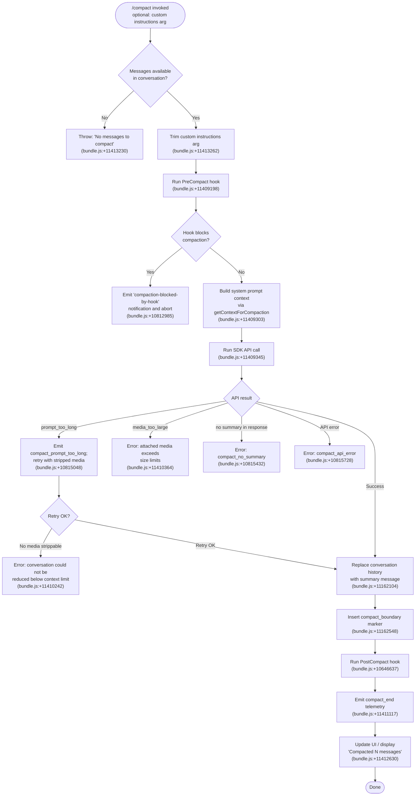

# `/compact`

> Analysis basis: CC v2.1.179 bundle.js (AST extraction + Claude interpretation)
> Minimum version: v2.1.179

---

## Overview

The `/compact` command frees up context window space by generating a structured summary of the current conversation and replacing the full message history with that summary. It supports an optional argument for custom summarization instructions, can run in non-interactive (CI/scripted) environments, and dispatches a `post-text` event to the thin client after completion.

---

## Registration

| Field | Value |
|---|---|
| type | `local` |
| name | `compact` |
| description | `Free up context by summarizing the conversation so far` |
| argumentHint | `<optional custom summarization instructions>` |
| supportsNonInteractive | `true` |
| thinClientDispatch | `post-text` |
| module_id | `xAK` |
| load_inline | `true` |
| loc_byte | `11414197` |
| loc_byte_end | `11414497` |
| loc_line | `7366` |
| arbor_handler.name | `DBL` |
| arbor_handler.fqn | `claude-2.1.179::DBL` |
| arbor_handler.kind | `AsyncFunction` |
| arbor_handler.resolution_path | `module_id` |
| arbor_handler.n_hits | `0` |

Analysis basis: CC v2.1.179 bundle.js:+11414197

---

## Input Branching

The command has four or more distinct branches based on message availability, hook interception, API outcomes, and model fallback, so a Mermaid flowchart is used.



---

## Behavioral Spec

### 1. Guard: Message Availability

```
async function compactHandler(userArg, appContext):
    messages = getCurrentConversationMessages(appContext)
    if messages is empty or null:
        throw Error("No messages to compact")
    customInstructions = userArg.trim()
```

Analysis basis: CC v2.1.179 bundle.js:+11413224 (Error throw), +11413262 (trim)

---

### 2. PreCompact Hook Dispatch

```
function runPreCompactHook(appContext):
    hookPayload = buildHookPayload("PreCompact", appContext)
    result = dispatchHook(hookPayload)          // via hookRunner
    if result.decision == "block":
        emitNotification("compaction-blocked-by-hook",
                         "compaction blocked by PreCompact hook")
        return BLOCKED
    return ALLOWED
```

The hook type `"PreCompact"` is dispatched through the standard hook runner (function `hookRunner`, bundle.js:+13733934). If the hook returns a block decision, compaction is aborted and a warning notification is surfaced.

Analysis basis: CC v2.1.179 bundle.js:+11409198 (`pre_compact` literal), +10812985 (`compaction-blocked-by-hook`), +10813019 (`compaction blocked by PreCompact hook`)

---

### 3. Context Assembly for Summarization

```
function assembleCompactionContext(appContext, customInstructions):
    systemPrompt   = buildSystemPromptSnapshot(appContext)   // tCL / NU8
    messageHistory = getAppStateMessages(appContext)         // B_ / getAppState
    sdkContext     = buildSDKContext(appContext)             // po → I7, sG
    return {systemPrompt, messageHistory, sdkContext, customInstructions}
```

This stage calls into a deep context-building pipeline (functions `contextBuilder`, `sdkContextAssembler`, `messageNormalizer`) that assembles the full system prompt, tool list, memory contents, environment info, and hook-produced context blocks before the API request is issued.

Analysis basis: CC v2.1.179 bundle.js:+11409303 (DP), +11409332 (Promise.all), +11409345 (po)

---

### 4. Summarization API Call

```
async function callSummarizationAPI(context, abortSignal):
    startMs = performance.now()
    emitProgress("compact_progress", {status: "compacting"})

    try:
        response = await apiClient.createMessage({
            model:            resolveCompactionModel(context),
            system:           buildCompactionSystemPrompt(context),
            messages:         truncateToSummarizableRange(context.messageHistory),
            customSummaryHint: context.customInstructions or null,
            abortSignal:      abortSignal
        })
    catch err:
        if err.type == "prompt_too_long":
            return {status: "prompt_too_long"}
        if err.type == "media_too_large":
            return {status: "media_too_large"}
        return {status: "api_error", error: err}

    summaryText = extractTextFromResponse(response)
    if summaryText is empty:
        return {status: "no_summary"}

    return {status: "ok", summary: summaryText}
```

The compaction model is resolved separately from the session model; it may differ (e.g. model fallback path at bundle.js:+10829219). A compaction system prompt instructs the assistant to only produce plain text summary output; tool use during compaction is denied (bundle.js:+10824708).

Analysis basis: CC v2.1.179 bundle.js:+11409260 (`compacting`), +10824708 (tool use denied), +10815432 (`compact_no_summary`), +10815461 (no valid text content error)

---

### 5. Media-Strip Retry

```
async function compactWithRetry(context, abortSignal):
    result = await callSummarizationAPI(context, abortSignal)
    if result.status == "prompt_too_long":
        emitTelemetry("tengu_compact_ptl_retry")
        strippedContext = stripMediaFromMessages(context)
        if strippedContext == null:
            return {status: "media_unstrippable"}
        result = await callSummarizationAPI(strippedContext, abortSignal)
    return result
```

Analysis basis: CC v2.1.179 bundle.js:+10815048 (`compact_prompt_too_long`), +10815088 (tengu_compact_ptl_retry)

---

### 6. History Replacement and Boundary Insertion

```
function replaceHistoryWithSummary(summary, appContext):
    boundaryMessage = {
        role:    "system",
        type:    "compact_boundary",
        content: summary,
        uuid:    generateUUID()
    }
    // values: "system" at +11162526, "compact_boundary" at +11162548
    setAppStateMessages(appContext, [boundaryMessage])
    emitSystemMessage("Conversation compacted")   // +11162104
```

The `compact_boundary` marker (bundle.js:+11162548) is inserted as a `system`-role message so that subsequent turns see only the summary. Indices 1 and 0 (bundle.js:+11162602, +11162607) represent the slice positions used when extracting the new message array.

Analysis basis: CC v2.1.179 bundle.js:+11162526, +11162548, +11162104

---

### 7. PostCompact Hook and Cleanup

```
async function runPostCompactHook(appContext):
    hookPayload = buildHookPayload("PostCompact", appContext)
    await dispatchHook(hookPayload)              // bundle.js:+10646637 post_compact
    runPostCompactCleanup(appContext)            // R6H → post_compact_cleanup
    updateTranscriptToggle(appContext)           // CAK → app:toggleTranscript
    emitTelemetry("tengu_compact")
    emitTelemetry("tengu_compact_end")
```

Analysis basis: CC v2.1.179 bundle.js:+10646637 (`post_compact`), +10640708 (`post_compact_cleanup`), +11411117 (`compact_end`), +10817026 (tengu_compact)

---

### 8. UI Notification

```
function showCompactionComplete(messageCount, appContext):
    label = "Compacted " + messageCount + " messages"   // +11412630
    toggleTranscriptKeybinding("ctrl+o", "Global")      // +11412523
    displayNotification(label, {type: "tip"})
```

Analysis basis: CC v2.1.179 bundle.js:+11412630, +11412523

---

### 9. Error Display

```
function handleCompactionError(err):
    if err.reason == "prompt_too_long":
        displayError("Compaction failed · conversation could not be reduced below the context limit")
    else if err.reason == "media_too_large":
        displayError("Compaction failed · attached media exceeds size limits")
    else if err.reason == "cancelled":
        displayMessage("Compaction canceled.")
    else:
        displayError("unknown error")
    emitTelemetry("tengu_compact_failed")
```

Analysis basis: CC v2.1.179 bundle.js:+11410242, +11410364, +11410488, +11413771, +10828899

---

### 10. Reactive (Automatic) Compact Path

The `/compact` command shares its core logic with the reactive compact subsystem triggered automatically near the context window ceiling. The reactive path (`compact_reactive` at bundle.js:+10647211) follows the same API call and history-replacement steps, but has additional guards:

```
function reactiveCompact(session):
    groups = groupMessagesForCompaction(session.messages)
    if groups.length < 2:
        emitWarning("too_few_groups")   // +5220216
        return SKIP
    summarizableSet = selectSummarizationWindow(groups)
    if summarizableSet has no assistant messages:
        emitWarning("no assistant messages in summarize set")
        return SKIP
    result = compactWithRetry(summarizableSet)
    if result.ok:
        emitTelemetry("tengu_reactive_compact_succeeded")
    else:
        emitTelemetry("tengu_reactive_compact_failed")
```

The minimum group count is 2; below that the reactive compact is skipped (bundle.js:+5220216). A seeded group reference appears at bundle.js:+5220468.

Analysis basis: CC v2.1.179 bundle.js:+10647211, +5220126, +5220216, +5220468, +10644757, +10647233

---

## State & Side Effects

| Item | Detail |
|---|---|
| Telemetry: tengu_compact | Fired on every successful manual or auto compact (bundle.js:+10817026) |
| Telemetry: tengu_compact_failed | Fired on any compact failure (bundle.js:+10828899) |
| Telemetry: tengu_compact_ptl_retry | Fired when prompt-too-long triggers media strip retry (bundle.js:+10815088) |
| Telemetry: tengu_reactive_compact_succeeded | Fired on successful reactive compact (bundle.js:+10647233) |
| Telemetry: tengu_reactive_compact_failed | Fired on failed reactive compact (bundle.js:+10644757) |
| Telemetry: tengu_reactive_compact_attempt | Fired when reactive compact begins (bundle.js:+5220935) |
| Telemetry: tengu_compact_cache_prefix | Cache prefix tracking for compaction (bundle.js:+10814612) |
| Telemetry: tengu_compact_cache_sharing_success | Cache sharing succeeded (bundle.js:+10825652) |
| Telemetry: tengu_compact_cache_sharing_fallback | Cache sharing fell back (bundle.js:+10826282) |
| Telemetry: tengu_precomputed_compact_consumed | A precomputed compact was used (bundle.js:+10639382) |
| Telemetry: tengu_precomputed_compact_discarded | A precomputed compact was discarded (bundle.js:+10640021) |
| Telemetry: tengu_compact_credits_clamp_rescue | Credit clamp rescue during reactive compact (bundle.js:+5220778) |
| Telemetry: tengu_compact_cache_prefix | (see above) |
| Hook registration | `PreCompact` hook dispatched before compaction; `PostCompact` hook dispatched after (bundle.js:+13733934, +13767695) |
| appState changes | Full message array replaced with single `compact_boundary` system message; `compactMetadata` field updated (bundle.js:+11162548, +11410572) |
| Sound / notification | `"Compacted N messages"` UI notification shown; `ctrl+o` keybinding registered for transcript toggle (bundle.js:+11412630, +11412523) |
| Progress events | `compact_progress` status events emitted with phases: `hooks_start`, `pre_compact`, `sdk_status`, `compacting`, `compact_start`, `compact_end` (bundle.js:+11409144–11411117) |
| Tool use during compaction | Denied: the compaction agent is restricted to text-only output (bundle.js:+10824708) |
| Autonomous loop reset | `resetAutonomousLoopDelivered` called after compact (bundle.js:+10640835) |

---

## Version History

| Version | Change |
|---|---|
| v2.1.179 | Initial analysis |

---

## Common Mistakes

1. **Invoking `/compact` on an empty conversation** — The handler immediately throws `"No messages to compact"` (bundle.js:+11413230). Ensure at least one message exists before calling.
2. **Expecting the full history to remain after compaction** — The entire message array is replaced by a single `compact_boundary` system message. Code or tests that reference earlier message indices will find them gone.
3. **Passing custom instructions that contain leading/trailing whitespace** — The argument is trimmed (bundle.js:+11413262), so surrounding whitespace is silently dropped.
4. **Assuming compaction always uses the active session model** — The compaction model is resolved independently and may differ (model fallback path, bundle.js:+10829219); do not assume a specific model is used.
5. **Forgetting the PreCompact hook can silently block compaction** — If a registered `PreCompact` hook returns a `block` decision, compaction is aborted without an API call; the only signal is the `compaction-blocked-by-hook` notification (bundle.js:+10812985).
6. **Assuming reactive compact always fires near 100% context** — The reactive path checks that there are at least 2 message groups; single-group conversations are skipped entirely (bundle.js:+5220216).

---

## Appendix — Identifier Mapping

> For bundle debugging only. Identifiers change across versions.

| Identifier | Role |
|---|---|
| DBL | Main compact command async handler (entry point) |
| Gz | Message slice / context window utility |
| IB8 | Inner context slice helper |
| wX | Context window token counter |
| mo | Amber-redwood telemetry emitter |
| Y6 | Session / app-state accessor |
| IG6 | Session state getter (inner) |
| SG6 | Session state setter (inner) |
| fp | Feature flag probe |
| im | Feature flag state reader |
| mO8 | Hook queue manager |
| PG_ | Hook event publisher |
| xy_ | Hook dispatch coordinator |
| h6 | Config file reader/watcher |
| c6 | Config path resolver |
| iy_ | Config file accessor |
| r5H | Config file I/O (read/write/mkdir) |
| brf | File watcher with fswatch |
| jBL | Compact orchestrator (outer loop) |
| DP | API pipeline dispatcher |
| tCL | System prompt context builder |
| AWH | Context chunk assembler |
| NU8 | Message normalizer for API payload |
| po | SDK context builder (top-level) |
| I7 | Effort/model selector |
| I6 | Model string resolver |
| vk | Model capability probe |
| Y2 | Model family classifier |
| kN | Model effort mapper |
| ch | Model context hint builder |
| x6 | Environment accessor |
| sG | Full API call handler (main turn loop) |
| ab | Policy settings reader |
| N | Message log / notify utility |
| wwH | Context header builder |
| EGA | Hook event aggregator |
| ZGA | Hook filter / matcher |
| bH | JSON serializer for hook payloads |
| SH | Hook result processor |
| CH | Hook output handler |
| BhH | Hook output error handler |
| hh | Abort controller for hooks |
| J | Hook callback dispatcher |
| xKH | Hook context injector |
| Nh | Hook result normalizer |
| Ai8 | Hook instruction processor |
| PGA | MCP tool invoker for hooks |
| fi8 | Hook output parser (plain-text vs JSON) |
| J4H | Hook permission-result transformer |
| XGA | HTTP hook executor |
| ckK | HTTP hook output parser |
| gzH | Hook env-var builder |
| Li8 | Shell hook executor (spawn) |
| wxH | Watch-path hook utility |
| IH | Hook feature flag outcome handler |
| KQ | Hook telemetry emitter |
| KxH | MCP server connection manager |
| Us8 | MCP update applier |
| fhA | MCP client connector |
| bAK | App-state context collector |
| QE | System prompt assembler |
| FGA | Growthbook feature gate |
| lA | Model family / inference profile resolver |
| iU8 | Memory tool context builder |
| t_ | Tool access checker |
| zsH | Pewter-owl tool probe |
| BG | Background session indicator |
| iO5 | Output-style prompt injector |
| rO5 | Confirmation-prompt injector |
| oO5 | Fable-identity injector |
| n48 | Model-fable prefix probe |
| aF | Agent kind probe |
| e59 | Cached config object reader |
| At | Agent type helper |
| cGA | Flag-settings prompt builder |
| hz5 | Flag-settings assembler |
| kd | Tool access wrapper |
| Oz5 | Schedule / routine prompt builder |
| KT6 | Memory loader (CLAUDE.md / team memory) |
| Wz5 | Environment info (static) builder |
| Pz5 | Environment info (simple) builder |
| Tz5 | Background-session prompt builder |
| WC8 | Scratchpad / context-management prompt builder |
| Ez5 | Brief-mode probe |
| Nz5 | Flag-settings renderer |
| Yz5 | Sparrow-ledger probe |
| eO5 | Heron-brook prompt builder |
| Hz5 | Amber-sextant injector |
| UFq | Compute-cached context fetcher |
| wz5 | Autonomy-append injector |
| Kz5 | Task-continuity injector |
| fz5 | Verified-vs-assumed injector |
| Lz5 | Flag-settings → cGA bridge |
| Mz5 | Tool-search state probe |
| zz5 | Compact-reminder injector |
| Y39 | Memory-dir loader |
| UXH | AWS Bedrock auth helper |
| OyK | Output-style builder |
| B_ | App-state message extractor |
| MU8 | Working-directory state reader |
| $U8 | Allowed-tools state reader |
| wx | Permission-mode state reader |
| lU | System-prompt builder (main) |
| lW | System-prompt config accessor |
| g_ | ESM module initializer |
| tO | System-prompt format selector |
| QH | Output printer (stdout helper) |
| q6 | Output printer (stderr helper) |
| wU8 | Notification message builder |
| lMA | Notification dispatcher |
| JBL | Compact turn executor |
| C5A | Precomputed compact consumer |
| Op8 | Precomputed compact store |
| Qf6 | Precomputed compact result applier |
| zp8 | Sepia-moth / precompute-enabled probe |
| W$ | Token count display helper |
| w1 | Output-line writer |
| x5A | Boundary UUID finder |
| Yp8 | Precomputed compact discard recorder |
| Xp8 | Reactive compact executor |
| FyH | Agent-type string classifier |
| ub | Agent-type prefix tester |
| sJ | Abort signal decorator |
| rI9 | Inner abort signal handler |
| Be | Abort error builder |
| _v6 | Headers-from-entries builder |
| nCH | Header normalizer |
| zr | DR9 retry classifier |
| DR9 | Retry-reason constant mapper |
| vv6 | Streaming fallback manager |
| tP8 | Streaming-start prefix probe |
| _bH | Cache-to-file writer |
| QQH | Query quota handler |
| lf6 | Pf tool caller |
| Pf | U9 utility caller |
| Hm6 | UUID generator for turns |
| Co | Tool-result collector |
| dCL | Tool-result type checker |
| QCL | Tool-result content assembler |
| sIL | Sub-agent context initializer |
| Wp8 | File-restore state loader |
| Ep8 | App-state object-values mapper |
| Gp8 | Plan-file reference loader |
| Zp8 | B_ + plan state combiner |
| Tp8 | Plan-state formatter |
| hOH | Hint-clears handler |
| iZH | In-progress tool-use tracker |
| dUH | Deferred tool-use handler |
| w9 | UUID + timestamp message factory |
| TQ | Hook session-start loader |
| rZH | Tool-result context runner |
| Q5A | Message mapper (post-compact) |
| qBH | Ant-filter / tool-result filter |
| gP8 | Token-round helper |
| FP8 | Message serialization + stats |
| DG | Full message deduplicator / aggregator |
| UM | Math.round token formatter |
| PX7 | Per-message metadata mapper |
| qE | Y2+kN model combo builder |
| S$ | App-state snapshot getter |
| g5A | Compact-reactive main executor |
| Y28 | Reactive compact message grouper |
| Cv6 | Gz + N66 slice combiner |
| QR9 | Group-count floor calculator |
| tP7 | Reactive compact API caller |
| eP7 | Gap-guided compaction fallback |
| Yv6 | Cancel-reason classifier |
| zv6 | AbortError sub-reason mapper |
| Bp | Output sanitizer (paths, PII) |
| uX7 | Truncation marker inserter |
| yX7 | URL sanitizer |
| SX7 | Home-dir path replacer |
| vX7 | IP address scrubber |
| TX7 | Email scrubber |
| WX7 | Home-dir tilde replacer |
| CX7 | Drive-path scrubber (Windows) |
| RX7 | UNC path scrubber |
| xX7 | API-error body scrubber |
| U6 | d+QH output composer |
| GH | String coercer for output |
| R6H | Post-compact cleanup runner |
| Dp8 | Precomputed compact store deleter |
| qv6 | cT retry-reason mapper |
| cT | Retry constant table |
| r$6 | Reset autonomous loop |
| s$6 | OT + H_H status flag setter |
| Mp8 | prq cache clearer |
| ys9 | jh6 + Tl_ cache clearer |
| Qkq | H (state) accessor for cleanup |
| uTH | H+_ state resetter |
| zD | FQH+Object.values state flusher |
| U5A | Cleanup finalizer |
| sCH | Ev6.setState caller |
| CAK | Transcript-toggle + keybinding registrar |
| KpH | YzL (model-alias) resolver |
| YzL | Model alias table (opus / sonnet variants) |
| V2 | Action dispatcher (V2) |
| wD8 | RRH action store writer |
| YD8 | Qb_+OP9+r6 action applier |
| h2H | o4 OTEL span emitter |
| o4 | qCH OTEL context builder |
| qCH | OTEL resource attribute builder |
| Q46 | Full compact main routine |
| Th6 | Tracing span starter |
| jqH | Span context accessor |
| wh | Span writer |
| CR | l3H.active span reader |
| v66 | Compact-type resolver (auto vs manual) |
| w28 | H.trim summary text normalizer |
| U8 | CI.randomUUID + X turn-ID builder |
| P | Buffer+line reader (IPC) |
| X | M + setTimeout timeout wrapper |
| cL | H.end + bH stream closer |
| qx5 | Full daemon IPC protocol handler |
| Ysq | Compact-state machine (main inner loop) |
| hcq | Zu6 cache getter |
| Zu6 | C7A.get cache reader |
| Ncq | Zu6 + f6 notification formatter |
| f6 | String coercer (short) |
| lT | Compact turn loop tick |
| jC8 | App-state updater for compact turn |
| JC8 | Post-turn state finalizer |
| WR | SSA-test + randomBytes nonce generator |
| lKH | Pf + qBH tool-loader for compact |
| sU | FRL+Dp8+IH+CH compact-stream handler |
| bZ | Stream boundary checker |
| Rm6 | ACL.has compaction-allowed probe |
| u6H | Usage-token counter |
| OU8 | Output token updater |
| iaq | Rm6 tombstone-aware checker |
| KOH | wX+H$L+filter message finalizer |
| qCL | d+QH+a_ compact-state output handler |
| Mg_ | Model-guess resolver |
| D28 | Array.isArray + GJH dispatch |
| GJH | wD+xJ display event dispatcher |
| E3H | pXH+n9H context-limit guard |
| pXH | lA+_if+Math.min token-cap lookup |
| n9H | parseInt+isNaN+N token-limit parser |
| Mv | H.findLast last-assistant-message finder |
| z28 | O28 boundary finder |
| O28 | H.findLast+_ boundary locator |
| s8 | _ (underscore) string utility |
| wCL | q6+QH compact output writer |
| sa | Compact spinner/status display |
| xm6 | s8+d+QH+JYH+_r tool-search mode builder |
| JYH | Tool-search hint formatter |
| _r | H.toLowerCase+bD7+_.includes type resolver |
| nAH | I$6+A.get+aG_ memory-state accessor |
| UZH | H.some+x4 tool-search availability probe |
| uV6 | ESH+LB_+RD7 tool-search enablement checker |
| cCL | FCL+ysq+L3A+gCL+Isq compaction-state combiner |
| Lg_ | H.map+$CL+Array.isArray message lister |
| $CL | Array.isArray list type checker |
| OCL | H.filter content-block filter |
| zCL | H.map+Array.isArray+cMA message mapper |
| bm6 | Binary media block stripper |
| cMA | Msq+Array.isArray+H.map content-part mapper |
| Msq | H.charCodeAt+H.slice surrogate-pair handler |
| D66 | L2+UL8+ZS9 display-line builder |
| L2 | O4+lA+aF label builder |
| UL8 | yG_ utility |
| ZS9 | ONH+zNH display-zone selector |
| bLH | NO+L2+pY+o0+CLH+xS+TK rich display builder |
| NO | D1+r0 display-object constructor |
| pY | PJH display padding helper |
| o0 | O48 display offset helper |
| CLH | eP_ display color helper |
| xS | QR1+TK+H.trim+O4+EN+u7 status-string builder |
| TK | Nj6+hj6+tA+q.map+O4 token-display formatter |
| _f6 | z3A+nyK full-turn renderer |
| z3A | VU8+_+vU8+A.push state aggregator |
| nyK | Full agent-turn processor (very large) |
| hS8 | h6+lA+Object.entries+A.includes history saver |
| zT | OT flag resolver |
| I | Date.now+y.values+c+R+Ag6+IvK+oRH+s8 bg-session sweeper |
| y | wi+Date.now+Math.min+I+k+NaK background worker scheduler |
| c | z+B.add+G.has+X.get daemon job controller |
| R | w.write+d output line writer |
| Ag6 | il8+yvK.freemem memory checker |
| IvK | Y6 session ID accessor |
| oRH | cJ.lstat+_E6+H.isFile+cJ.rm+cJ.readFile+Array.isArray stale-file cleaner |
| rl8 | Y6 retire-loop accessor |
| n | i.preventDefault+g input interceptor |
| hT | Xj+q6 hint-text printer |
| Xj | n36 hint-text formatter |
| a_ | Xj+q6 alt-hint printer |
| ZQ | Array.isArray message-type guard |
| Osq | H.slice+N66+h66+DP+Math token-window selector |
| N66 | _.push+A.push message accumulator |
| h66 | Z3H+TC6 boundary-version resolver |
| Z3H | Array.isArray+_.some message-array checker |
| TC6 | H.match+parseInt version-number parser |
| ry | H.startsWith start-prefix checker |
| p | tDK+FF+R.enqueue+HT.randomUUID+I6 rate-limit event emitter |
| FF | E4+h6 feature-flag usage reporter |
| E4 | aw+h6 feature record |
| FM | sC+e$+G_+RWH.join+I6 model-string formatter |
| sC | OT flag initializer |
| G_ | OT flag getter |
| QT | Wm+jK+f6+Y6 remote-model resolver |
| Wm | Remote model map |
| jK | String coercer (inner) |
| pV6 | REPL context getter |
| bv6 | sP7 prompt-body trimmer |
| sP7 | _.replace+_.match+q.trim+_.trim summary-text cleaner |
| $r | i9H+Be abort-result builder |
| i9H | O66.has tool-use probe |
| wsq | sa+GH+JP spinner writer |
| JP | p_+sv+J27+_.shift+_.push compact-queue manager |
| sv | Compact queue item |
| J27 | vC9+Wg_.get+Wg_.set compact-slot manager |
| Wh6 | Post-compact UI reset |
| abH | H.setStatus status-bar updater |
| H3A | f6 compact-metadata serializer |