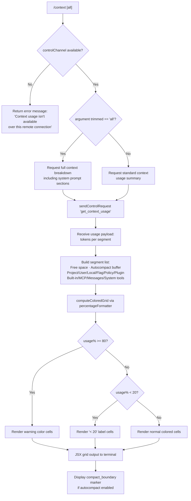

# `/context`

> Analysis basis: CC v2.1.179 bundle.js (AST extraction + Claude interpretation)
> Minimum version: v2.1.179

---

## Overview

`/context` visualizes the current context window usage as a colored grid rendered in the terminal. It dispatches a `get_context_usage` control request over the thinClient control channel, collects token-level breakdown data (system prompt, tools, messages, free space, autocompact buffer), and renders the result as a colored JSX grid using a 80-column layout, clamped and colored by usage percentage thresholds.

---

## Registration

| Field | Value |
|---|---|
| type | `local-jsx` |
| name | `context` |
| description | `Visualize current context usage as a colored grid` |
| argumentHint | `[all]` |
| thinClientDispatch | `control-request` |
| module_id | `JqK` |
| load_inline | `true` |
| loc_byte | `11827591` |
| loc_byte_end | `11827817` |
| loc_line | `7422` |
| arbor_handler.name | `wdL` |
| arbor_handler.fqn | `claude-2.1.179::wdL` |
| arbor_handler.kind | `AsyncFunction` |
| arbor_handler.resolution_path | `module_id` |
| arbor_handler.n_hits | `0` |

Analysis basis: CC v2.1.179 bundle.js:+11827591

---

## Input Branching

The command has 4 distinct paths: (1) remote/no-control-channel guard, (2) argument `"all"` flag branch, (3) normal grid rendering, and (4) compact-boundary display toggle. A Mermaid flowchart is required.



Analysis basis: CC v2.1.179 bundle.js:+11826185

---

## Behavioral Spec

### Handler: contextCommandHandler (wdL)

```
async function contextCommandHandler(args, appState):
    trimmedArg = args.trim()                         // +11826191
    channelMode = detectChannelMode(appState)         // mk → +11826239
    
    if channelMode != "controlChannel":              // literal "controlChannel" +11826242
        return errorResult(
            "Context usage isn't available over this remote connection"
        )                                            // literal +11826269
    
    showAll = (trimmedArg == "all")                  // literal "all" +11826216
    
    usagePayload = await sendControlRequest(         // K.sendControlRequest +11826351
        "get_context_usage",                         // literal +11826381
        { showAll: showAll }
    )
    
    segments = buildSegmentList(usagePayload)        // zU6 +11826521
    grid     = renderColoredGrid(segments, cols=80)  // literal 80 +11826727
    
    return JSX(grid)                                 // wU6.createElement +11826415
```

Analysis basis: CC v2.1.179 bundle.js:+11826185

---

### Sub-feature: Segment Builder (zU6)

```
function buildSegmentList(usagePayload):
    segments = []

    // Static named segments (filtered from payload)
    segments.append({ label: "Free space",          // literal +11824323
                      tokens: usagePayload.freeSpace })
    segments.append({ label: "Autocompact buffer",  // literal +11824346
                      tokens: usagePayload.autocompactBuffer })

    // Settings-layer segments
    for layer in ["projectSettings","userSettings","localSettings"]:
        // literals at +11825272, +11825312, +11825346
        if usagePayload[layer]:
            segments.append({
                label: layerDisplayName(layer),     // "Project"/"User"/"Local"
                tokens: usagePayload[layer]
            })

    // Policy / plugin layers
    // "Flag", "Policy", "Plugin", "Built-in" literals at +11825399…+11825497
    for layer in ["flagSettings","policySettings","plugin","built-in"]:
        if usagePayload[layer]:
            segments.append({ label: displayName(layer), tokens: usagePayload[layer] })

    // MCP / managed layer  ("MCP","mcp" literals at +1184648/+1184636)
    if usagePayload.mcp:
        segments.append({ label: "MCP", tokens: usagePayload.mcp })

    // Messages segment
    if usagePayload.messages:
        segments.append({ label: "Messages", tokens: usagePayload.messages })

    return segments.filter(s => s.tokens > 0)       // A.filter +11824288
```

Analysis basis: CC v2.1.179 bundle.js:+11824247

---

### Sub-feature: Percentage Formatter / Cell Colorizer (X_H)

```
function formatPercentageCell(tokenCount, totalTokens):
    pct = Math.round((tokenCount / totalTokens) * 100)   // Math.round +218662
    
    if pct < 20:                                          // literal 20 +218633
        label = "< 20"                                    // literal +218642
    else:
        label = String(pct) + ".0"                        // literal ".0" +218603
    
    // Pad label to fixed width using "en-US" locale      // literal +220615
    // Format style "compact"                             // literal +220633
    cellWidth = 10                                        // literal 10 +218675
    return { label: label.padEnd(cellWidth), pct: pct }
```

Analysis basis: CC v2.1.179 bundle.js:+218659

---

### Sub-feature: Compact Boundary Marker (zdL → Gz)

```
function computeCompactBoundary(contextHistory):
    // Scans history for the most recent autocompact event
    // marked with the "compact_boundary" literal           // +11162548
    boundaryIdx = findCompactBoundaryIndex(contextHistory) // IB8 +11162678
    if boundaryIdx >= 0:
        slice = contextHistory.slice(0, boundaryIdx)       // H.slice +11162701
        return slice
    return null
```

Analysis basis: CC v2.1.179 bundle.js:+11826694

---

### Sub-feature: Control-Request Dispatcher (v96)

```
function attachControlResponseListener(emitter, onData):
    emitter.on("write", callback)                    // K.on +8146879
                                                     // literal "write" +3990392
    rawBytes = collectResponseBytes(emitter)
    text = rawBytes.toString("utf8")                 // L.toString +8146916
    parsedGrid = parseGridResponse(text)             // ig +8146943
    return createElement(parsedGrid)                 // XKH.createElement +8146946
```

Analysis basis: CC v2.1.179 bundle.js:+11826411

---

### Sub-feature: Channel Detection (mk → D7)

```
function detectChannelMode(appState):
    // Checks whether a thinClient control channel is active
    channel = resolveChannel(appState)               // D7 +1133989; VNH +1133989
    if channel == null:
        return null
    return "controlChannel"                          // literal +11826242
```

Analysis basis: CC v2.1.179 bundle.js:+11826239

---

### Sub-feature: Full Context Loader (XU8) — called when `all` flag is set

When `/context all` is invoked, the handler triggers a deep context load (`XU8`) that enumerates:

- **System prompt** — labelled `"System prompt"` (literal +10851548), bordered by `"promptBorder"` (literal +10851579)
- **System tools** — `"System tools"` (literal +10851629) and `"System tools (deferred)"` (literal +10851856)
- **MCP tools** — `"MCP tools"` (literal +10851694) and `"MCP tools (deferred)"` (literal +10851770)
- **Custom agents** — `"Custom agents"` (literal +10851945)
- **Permission entries** — `"permission"` (literal +10851976)
- **Memory files** — `"Memory files"` (literal +10852012)
- **Skills** — `"Skills"` (literal +10852074)
- **Messages** — `"Messages"` (literal +10852553)

Segment token counts are accumulated via `Math.max` / `Math.min` guards (literals at +10852364/+10852375) and `Math.round` / `Math.floor` for display rounding (+10852972/+10853134).

Analysis basis: CC v2.1.179 bundle.js:+10850399

---

## State & Side Effects

| Item | Detail |
|---|---|
| Telemetry | No `tengu_*` events fire directly from the `wdL` handler; events in the call graph are from shared infrastructure (e.g., `tengu_amber_redwood2` at +10834885 from auto-compact window logic, `tengu_silent_harbor` at +13852720 from system-prompt builder) |
| Control channel I/O | Sends `"get_context_usage"` control request via `K.sendControlRequest` (+11826351); receives token-count payload |
| appState changes | None — read-only inspection of current context state |
| Hook registration | None from this command directly |
| Sound | None |
| Argument side-effect | Argument `"all"` expands the segment list to include per-section breakdown; without it, only the top-level summary is requested |
| Remote guard | Returns an inline error string (not a thrown exception) when the control channel is absent (+11826269) |

---

## Version History

| Version | Change |
|---|---|
| v2.1.179 | Initial analysis |

---

## Common Mistakes

1. **Running over a remote/SSH connection without a control channel** — the command silently returns `"Context usage isn't available over this remote connection"` instead of a grid; this is not a crash but an expected guard (+11826269).
2. **Expecting `/context` to show per-section detail by default** — the standard invocation shows only the high-level summary. Pass `/context all` to get the full per-layer breakdown (system prompt, tools, memory files, etc.).
3. **Confusing the 80-column grid width with a terminal width limit** — the column count (literal `80` at +11826727) is a fixed internal layout constant, not derived from the current terminal width.
4. **Misreading the `< 20` label** — cells displaying `"< 20"` mean the segment occupies less than 20 % of the context window (threshold literal at +218633), not that the absolute token count is below 20.
5. **Expecting live updates** — `/context` is a one-shot snapshot; it does not subscribe to streaming token updates.

---

## Appendix — Identifier Mapping

> For bundle debugging only. Identifiers change across versions.

| Identifier | Role |
|---|---|
| `wdL` | Main async handler for `/context` command |
| `m1` | Fullscreen/terminal-mode resolver used during handler init |
| `xl` | Feature-flag set membership check |
| `GS_` | Local-agent mode detector (`"local-agent"` literal) |
| `f6` | Generic string coercion / format helper |
| `it` | Settings accessor (reads config from disk state) |
| `xsf` | Terminal multiplexer probe (checks for tmux/screen/iTerm) |
| `bsf` | iTerm/screen prefix check (`H.startsWith`) |
| `N` | Logger / debug output writer |
| `nM4` | Settings loader orchestrator |
| `sSA` | Async settings value reader |
| `bH` | JSON serializer (`JSON.stringify`) |
| `g4` | Path/branch label formatter |
| `SbA` | Model-list mapper |
| `ydH` | Write-through settings persistence helper |
| `GbA` | File write helper |
| `aM4` | CLAUDE.md / memory-file writer |
| `AdH` | Debounced flush / batch write scheduler |
| `z7H` | Memory segment join helper |
| `z_H` | Settings directory resolver |
| `xbA` | Path join helper (wraps `O7H.join`) |
| `I__` | File rename/unlink helper |
| `oM4` | Memory-file append+rotate helper |
| `U9` | Hook registration helper (`oSA.register`) |
| `WS_` | Windows-over-SSH / ConPTY detector |
| `t_` | Settings loader from disk (used by fullscreen path) |
| `bF` | Settings-load main function |
| `Yq` | Memory-usage sampler (`process.memoryUsage`) |
| `FM_` | Settings-load telemetry reporter |
| `vb` | Model-availability enforcer |
| `cl6` | Settings cleanup helper |
| `usf` | Fullscreen / display-mode selector |
| `Y6` | Context-state reader / experiment gate |
| `mO8` | Experiment-gate membership resolver |
| `h6` | Hook-run scheduler |
| `D7` | Control-channel resolver |
| `VNH` | Channel type discriminator |
| `mk` | Channel-mode probe (returns `"controlChannel"` or null) |
| `K` | Control-channel emitter / request sender |
| `f` | Connection set manager |
| `L` | Stream closer |
| `v96` | Control-response listener / JSX renderer wrapper |
| `ig` | JSX grid element builder |
| `Vb_` | React createElement wrapper |
| `Ye` | Outer grid container component |
| `mPH` | Grid row renderer (uses settings + context state) |
| `zb_` | Alternate grid row renderer |
| `zU6` | Segment-list builder from usage payload |
| `XK` | Token-count formatter (locale `"en-US"`, style `"compact"`) |
| `qf` | Number-format factory |
| `eM4` | Intl.NumberFormat instance creator |
| `HnH` | Segment-label width normalizer |
| `X_H` | Percentage cell formatter (returns label + pct) |
| `GH` | Generic string coercion helper |
| `zdL` | Compact-boundary locator |
| `Gz` | History-slice extractor for compact boundary |
| `IB8` | Compact boundary index finder |
| `wX` | Boundary sentinel comparator |
| `XU8` | Full context-breakdown loader (triggered by `all` flag) |
| `HE` | System-prompt segment assembler |
| `Zn` | Prompt-section flattener |
| `TK` | Per-model prompt builder |
| `bJ` | Tool-list assembler |
| `xLH` | Tool-schema serializer |
| `uLH` | Prompt-text joiner |
| `u_` | Provider-type resolver |
| `vA` | Model-name label builder |
| `Lq` | Pro/plan tier label helper |
| `oF` | Regex replace helper for prompt text |
| `pY` | Prompt-section type tagger |
| `PJH` | Prompt-item type classifier |
| `xS` | System-prompt + tools assembler |
| `QR1` | Available-models enforcer |
| `O4` | Strip-bracket helper |
| `EN` | Wysiwyg-block detector |
| `u7` | Provider-context wrapper |
| `RLH` | Content-type filter list checker |
| `M48` | Model-metadata resolver |
| `D1` | Model-string normalizer / alias expander |
| `Dw` | Tool-schema resolver |
| `ts` | Tier+plan label builder |
| `Dn` | Provider-discriminator helper |
| `o0` | Model-class lookup |
| `CLH` | Context-length resolver |
| `gR1` | Prompt-section combiner |
| `IrH` | Tool-string validator |
| `pTf` | Case-fold helper |
| `uS` | Alias-expansion table |
| `gG` | Auto-compact config reader |
| `d4` | Legacy-global-config migrator |
| `DN` | Flag-settings filter |
| `H3_` | Async settings resolver |
| `R8` | Model-capability/tier lookup |
| `jB` | Auto-compact window calculator |
| `lA` | Token-count breakdown aggregator |
| `HrH` | Object.entries enumerator helper |
| `Qz` | Name-case normalizer |
| `aL` | Text-replace sanitizer |
| `wD` | OT (operational transform) dispatcher |
| `OT` | Low-level transport send |
| `xJ` | Window-size parser |
| `dL9` | Integer parser with NaN guard |
| `Qk_` | Window dimension resolver |
| `cL9` | Context-size record builder |
| `n9H` | Max-output-tokens parser |
| `WCL` | Auto-compact window evaluator |
| `lL9` | Hook-based window getter |
| `vsq` | Auto-compact source resolver |
| `p_` | Experiment-gate flag checker |
| `tMA` | Token-size string parser (`parseFloat`/`parseInt`/`Math.round`) |
| `QE` | Full system-prompt builder (calls all sub-builders) |
| `FGA` | Feature-gate / experiment resolver |
| `x6` | Async-local-storage context reader |
| `Ee6` | Store accessor |
| `G_` | OT-layer connector |
| `iU8` | Tool-schema enumerator |
| `zsH` | Pewter-owl-tool injection helper |
| `dk_` | Tool-presence gate |
| `BG` | Background-session system-prompt injector |
| `iO5` | Autonomy/output-style injector |
| `At` | Brief-mode checker |
| `nO5` | Brief-mode system-prompt variant |
| `rO5` | Confirmation-prompt builder |
| `oO5` | Task-continuity prompt builder |
| `qb1` | BGA prompt formatter |
| `n48` | Fable-model prefix check |
| `aF` | Output-style strip helper |
| `e59` | Schema validator helper |
| `cO8` | JSON-schema type checker |
| `cGA` | System-prompt caching helper |
| `jK` | String coercion (ID safe) |
| `hz5` | Cached prompt variant |
| `kd` | Settings-from-disk loader (slim) |
| `Oz5` | Memory/schedule section builder |
| `Ol` | Enabled-tools filter |
| `x2` | Feature-flag two-state resolver |
| `$z5` | Routine/schedule prompt builder |
| `JOA` | Session-guidance injector |
| `fr` | Feature-flag string resolver |
| `k7` | Tool-count helper |
| `zd` | KK6/bxH pair — keyword matcher |
| `pd` | Flat-map tool-list builder |
| `KT6` | Memory-files / CLAUDE.md prompt builder |
| `Tf` | CLAUDE.md file reader |
| `S1H` | Memory directory creator |
| `Rg` | Directory/file stat checker |
| `q6` | n36 — node-36 helper |
| `IH` | d/QH — generic resolve helper |
| `FM9` | Async memory-file loader |
| `faf` | eXH wrapper for file-existence check |
| `D` | Background-daemon process manager |
| `M` | MCP-server connection registry |
| `qT6` | Memory-path splitter / indexer |
| `gj` | Y6 gate — experiment helper |
| `_39` | CLAUDE.md joiner |
| `H39` | HPH — memory-heading builder |
| `eM9` | HPH — memory-entry builder |
| `j` | Agent-values / kill helper |
| `J` | D-wrapper — daemon job list |
| `yI_` | HPH — memory-section footer |
| `d` | Low-level I/O / file handle |
| `Wz5` | Environment-info section builder |
| `Yw` | Language / locale resolver |
| `gGA` | Static env-info builder |
| `Pz5` | Full env-info builder (OS, shell, worktree) |
| `dGA` | OS-info collector (`BFH.version/release/type`) |
| `q3` | Working-directory helper |
| `QGA` | Shell-type detector (zsh/bash/PowerShell) |
| `_z5` | Language-section builder |
| `Az5` | Output-style section builder |
| `Tz5` | Background-session section builder |
| `U9A` | Worktree-type resolver |
| `WC8` | Scratchpad / tmp-dir section builder |
| `Ja` | Y6 gate — scratch context |
| `zwH` | o$5/I6 — scratchpad path builder |
| `Ez5` | Brief-mode section injector |
| `Nz5` | Focus/context-management section builder |
| `xsH` | t_/h6 — context-management gate |
| `Yz5` | Reproduce-verify-workflow builder |
| `eO5` | Heron-brook section builder |
| `Hz5` | Amber-sextant section builder |
| `UFq` | Async resource-compute helper |
| `i$6` | Resource-compute initiator |
| `U6_` | Resource-result merger |
| `wz5` | Autonomy-append section builder |
| `qz5` | Act-don't-rederive section builder |
| `Kz5` | Tool-search context builder |
| `tO5` | Tool-search entry formatter |
| `fz5` | Verified-vs-assumed tracker |
| `Lz5` | Cached-system-prompt variant builder |
| `Mz5` | H.has — session-state gate |
| `QT` | Wm/jK/f6/Y6 — quoted-tool formatter |
| `zz5` | pd builder — flat tool lister |
| `Y39` | w39/yI_ — CLAUDE.md combined builder |
| `w39` | Tf/gj/gSH — memory+CLAUDE.md combiner |
| `UXH` | yN/j7/u_ — language-output injector |
| `yN` | ik_/ESH — lang-setting resolver |
| `j7` | Iq8 — async-context unwrapper |
| `OyK` | gU8/xJ/wD/QU8 — token-budget resolver |
| `QU8` | Math.max — max-token-budget enforcer |
| `lU` | B4/lW/qh/g_/M/tO/QH/q6 — agent/session loader |
| `B4` | Session-bootstrap helper |
| `lW` | f6/b0/Xq — low-level session wire-up |
| `b0` | Session buffer initializer |
| `Xq` | Session-queue helper |
| `g_` | avH/_e8/ql6/Kl6/$q4/RkA — module export bootstrapper |
| `Kl6` | Bound export helper |
| `tO` | Session timeout helper |
| `QH` | n36 — quick-hash helper |
| `n36` | CRC/hash primitive |
| `$66` | i9H — context-item deduplicator |
| `i9H` | O66.has — seen-item guard |
| `yCL` | ij/kCL/WU8/w76 — context-item collector |
| `kCL` | H.match/split/trim/slice — raw-text context parser |
| `WU8` | Gz5/D39/mGA/WC8 — full-context assembler |
| `Gz5` | Env-info + system-prompt parallel builder |
| `D39` | w39/KT6/jM/S1H/Rg/q6 — CLAUDE.md + memory full assembler |
| `mGA` | indexOf/slice/startsWith — content-header stripper |
| `w76` | WbH/N/GH/SH/hsq — tool-result formatter |
| `WbH` | Tool-result full renderer |
| `SH` | WA/f6/fq/Nd4 — stream-output helper |
| `hsq` | Tool-result condensed renderer |
| `ICL` | h1H/Kv6/YP — CLAUDE.md intersection processor |
| `h1H` | Boolean/N4/mZ — CLAUDE.md item filter |
| `N4` | pK/ZL — CLAUDE.md permission checker |
| `mZ` | CLAUDE.md merge resolver |
| `Kv6` | Y6/H.filter — AutoMem filter |
| `SCL` | eZH/Or/DQ/G/X — sub-agent context splitter |
| `eZH` | Promise.all/GU8/w76/N/L.slice — message-batch processor |
| `GU8` | Full message-item serializer |
| `z` | IH/CH/QS/QB — daemon-session manager |
| `CH` | d/QH — channel handler |
| `QS` | im/xn.push/lyH/XG_ — queue-and-send helper |
| `QB` | Promise.race/all/tLH/eLH/n8/process.exit — shutdown racer |
| `G` | CmH — MCP-server gate registry |
| `CmH` | SmH/N/hO/_OH/s8 — MCP-connection manager |
| `X` | M/q.setTimeout — connection-set with timeout |
| `bCL` | eZH/UM/bH/G.prompt/O.reduce — message-token batcher |
| `UM` | Math.round — token-rounding helper |
| `O` | y8 — output accumulator |
| `Y` | NX/process.exit/z.abort — forced-exit helper |
| `NX` | Clean-shutdown notifier |
| `xCL` | w76/_.entries/A.push — extra-context merger |
| `RCL` | lU_/x6/Nsq/eZH — resource-context loader |
| `lU_` | oJ/F9H/Ol — resource-permission filter |
| `F9H` | H.filter/_.some/eNK — resource-type gate |
| `Nsq` | ZK — nested-context resolver |
| `ZK` | Object.hasOwn/WM9/K/GM9/erf — context-key resolver |
| `UCL` | q.set/uCL/mCL/pCL/w76/DG — unified context-layout builder |
| `uCL` | bH/UM — user-message token counter |
| `mCL` | UM/bH/A.get — model-message token counter |
| `pCL` | bH/UM — prompt token counter |
| `DG` | Full conversation-graph builder / token-counter |
| `huL` | km6/K.push/Array.isArray/q.push/q.reverse — message-list flattener |
| `J$A` | Conversation-join helper |
| `dHK` | M6K — duplicate-message key builder |
| `RuL` | k$A/y$A/I$A/CB8/S$A/I76 — role-label set |
| `g` | tq6/xd — general getter |
| `uuL` | NU8/Array.isArray/_.has/A.add — block-deduplicator |
| `l` | Low-level lock/handle |
| `X$A` | Array.isArray/A.some/_.has — content-block filter |
| `CuL` | Array.isArray/_.some — content-union checker |
| `buL` | Array.isArray/_.get/K.startsWith/A.add — block-tag collector |
| `o` | PU6/MKK — output-key registry |
| `y76` | _.some — presence-in-list check |
| `$` | yTK — dynamic key resolver |
| `B` | Background-task tracker |
| `Q` | B/clearTimeout/setTimeout/w.write/Math.round/d/m.unref — supervisor timer |
| `ouL` | CI.randomUUID — UUID generator for tool-use blocks |
| `U8` | P/CI.randomUUID/X — message-ID generator |
| `$0` | Contextual zero-state initializer |
| `M9A` | Message-metadata annotator |
| `NB8` | hB8/iHK/BuL — nested-block builder |
| `_h` | uV6/N/u_/j7 — standard-tool context helper |
| `E$A` | Array.isArray/_.some/_.map/m6H — content-array normalizer |
| `kuL` | Array.isArray/A.some/m6H/_.has/nZ/A.map/N — block-kind mapper |
| `WHK` | Array.isArray/A.flatMap/_.has — block-hierarchy flattener |
| `m` | Low-level output stream |
| `yuL` | H.some/Array.isArray — has-thinking-block checker |
| `ruL` | Array.isArray/_.get/Z9/M.slice/nuL.has/$.toLowerCase/G$A/iuL.has/A.slice — block-reference resolver |
| `b` | bCH/w/N/Ht/dH6/Date.now/pk9/P.has/z/S/P.add/X.set/d/l.map/f/_/ctK/g9H — I/O buffer manager |
| `puL` | N/A.filter/q.some/lHK — block-priority filter |
| `lHK` | $I_/_ /d/H.filter — block-label classifier |
| `NU8` | GK/U8/TuL/VHK/QL/jp6/Dp6/aj/A.join/nU8/QmH/String/MU.formatDiagnosticsBlock/suL/q.push/$8/$0/K.push/K.join/q.join/A.push/ZU8/K.slice/fm/Error — full-message serializer |
| `S` | v94/mL/N/SH/Ex5/w.write — stdout stream writer |
| `auL` | _.push/G$A/_.join/A.trim — attribution-block joiner |
| `muL` | hB8/iHK/FuL — multi-block merger |
| `yR6` | Array.isArray/K.some/_.add/f.every/_.has/d/a_/H.slice — thinking-block filter |
| `fmL` | H.at/A.at/bm6/d/a_/A.slice — last-message extractor |
| `kR6` | Array.isArray/vHK/L.some/A.add/H.filter/A.has/d/a_/K.at/NB8/K.push — trailing-thinking-block filter |
| `LmL` | Array.isArray/d/a_/H.slice — whitespace-only message filter |
| `UuL` | _.at/H.slice/_.push/U8/$0/nHK — message-dedup+insert helper |
| `QHK` | H.map/Array.isArray/A.some/K.push/f.push/f.findLastIndex/P$A/f.slice — message-reorder helper |
| `nHK` | A.at/NB8/A.push — tool-use block appender |
| `SuL` | Array.isArray/$.every/$.filter/O.join/K.slice/H.slice — sub-message block slicer |
| `CCL` | pH6/x6/Nsq/eZH/$2/K.map/k7/pu6/oJ/SH/WA — cached-context loader |
| `pH6` | F9H/oJ/Ol — permission-filtered resource loader |
| `$2` | D1/O4/lA/dTf.has — model-context disambiguator |
| `pu6` | UM/ELA — usage-limit enforcer |
| `ELA` | Usage-limit action helper |
| `WA` | Error/String — error wrapper |
| `D4H` | Math.min/E3H/gG/jB — minimum-window auto-compact helper |
| `E3H` | pXH/n9H — context-length + output-token combiner |
| `pXH` | lA/_if/Math.min/gL9 — context-length resolver with cap |
| `AH` | e/_H/Z/k — top-level agent host |
| `e` | Promise.all/qQ/P.filter/T_6/T/FG8/SH/a.applyMcpUpdate/AH.has/qxH/GH/l/fhA — event-loop processor |
| `qQ` | TypeError/Number.isSafeInteger/H.undefined/W/f/P/L/K.addEventListener/J.next/AggregateError/G/M.entries/O.get/k.push/_/O.set/T/$.push — async-iterable mapper |
| `P` | Buffer.concat/X.indexOf/j.off/cL/j.setTimeout/X.subarray/qx5/GH — byte-stream reader |
| `T_6` | parseInt — frame-size parser |
| `T` | ih6/J36 — top-level timer |
| `FG8` | parseInt — secondary frame-size parser |
| `a` | W.current/c.setTimeout/N/o — voice/recording state manager |
| `qxH` | j0H — MCP-update applier |
| `fhA` | Object.entries/A.filter/_.getClients/N08/q/n8/N/W_6/KxH/Us8/Object.fromEntries/K.map — MCP-client refresher |
| `_H` | J — session-history holder |
| `Z` | W/Math.max/Math.min — zoom/scale helper |
| `W` | J36/xR/Dh/Promise.all/xr/Sx/SH/WA — session-wire connector |
| `k` | Generic key/counter |
| `mo` | p_/Y6 — experiment-gate quick-check |
| `oI9` | rI9/H.slice/DP/DG — context-item indexer |
| `rI9` | i9H/iI9 — item-seen pair |
| `iI9` | Item-index builder |
| `DP` | tCL/NU8 — display-packet builder |
| `tCL` | AWH/NU8 — token-count-label builder |
| `C6` | d/QH/CH — channel-6 connector |
| `ZH` | fH.map/Array.from/M_.has/b8.has/fH.some/z8.cleanup/kHq/H.sendMcpMessage/M1/$/k_.some/hm/LC9/dL8/Un/azK/HA4 — session-lifecycle manager |
| `fH` | m/performance.now/Cd8/uW/n/K$/i$H/c/hKH/xH/uH/e4/VJ/EY/rQ6/no/NC8/_BH/hwH/tQ6/PgH/WgH/FH/dH/sQ6/Vn/MfH/eQ6/LfH/Math.round/y/Q/QH/WA/SH/Boolean/aq — session-frame handler |
| `Cd8` | G_/A.some/K$/oq/EJA — capability-detection helper |
| `uW` | JT6/e$9/Nsf/YS_/N/XT6/_G/FY — terminal-write batch helper |
| `n` | i.preventDefault/g — keyboard event handler |
| `K$` | Key-state reader |
| `i$H` | Promise.resolve/Yq6/A.listAllLiveSessions — live-session lister |
| `c` | z/B.add/G.has/X.get/IV6/OP8/X.set/N/d/pI5.isLoopDefaultSentinel/K/_/dtK/Math.floor/Q.push/L_H/X.delete/G.add/g9H/G.delete — session-loop controller |
| `hKH` | BI8/Promise.resolve/Yq6/J/X.flatMap/K$/D.has/jTq/Xq6/eLL/U6/BHH/o$H/FI8/EY/xI8/A_A/NR6/DTq/q_A/e8A/performance.now/TQ/q$/I6/H7/V66/EmH/K.push/jq6/IH/CH/SH — session-resume handler |
| `xH` | vH.findLastIndex/vH.splice/d/QH/Vg6 — tombstone-removal helper |
| `uH` | Array.isArray — content-type guard |
| `e4` | CI.randomUUID — event UUID generator |
| `VJ` | pSA/mSA — voice-UI pair |
| `EY` | Event emitter |
| `rQ6` | xu.join/z_/Fw/G_/I6/xu.basename/bo8.rename/N — project-path rename helper |
| `no` | Pf — notification helper |
| `NC8` | X9A/N$6 — node-cleanup helper |
| `_BH` | Pf — secondary notification helper |
| `hwH` | $l/zvH/N/Lw/D1/UY/TK/VY — model-handshake helper |
| `tQ6` | Session-tick helper |
| `PgH` | K/Lw/u7/OFK/q/d/QH/w1/FLH/aL — per-turn prompt builder |
| `WgH` | gG5/VY/uo8/d/QH/QG5/aL/TYH/LF/$NH — fork/restore prompt builder |
| `FH` | OqH/aH/r86/Promise.race/A6.then/tH.then — race-completion helper |
| `dH` | Tg6/Math.max/Promise.resolve/vH.slice/j8H/s4H/I6H — deferred-message sender |
| `sQ6` | Session-status query helper |
| `Vn` | $P6/Date.now — time-marker helper |
| `MfH` | Pf — message-file helper |
| `eQ6` | q3/KB/x6/process.chdir/Tz/EV/cT/IZH/Fl/$J/Oi8 — working-directory changer |
| `LfH` | Pf/FM/aK.utimes/H.reAppendSessionMetadata — session-metadata reattacher |
| `y` | wi/Date.now/Math.min/I/k/NaK — idle-timer helper |
| `M_` | H6/SH — session-map manager |
| `H6` | dzH/$wH/LJ/UwH.cwd/dH.filter/_5/w7H — cwd-based session filter |
| `b8` | d_.includes — session-blacklist checker |
| `d_` | Q — blacklist store |
| `z8` | Y — cleanup-on-exit helper |
| `kHq` | Promise.allSettled/Object.entries/O.connect/O.getServerCapabilities/O.getInstructions/Km/$8/O.close/Dh/j.push/IH/CH/w7/A.push/q.push/A.some/q.some/x4 — MCP-server connector |
| `Km` | H.slice/A.charCodeAt/A.slice — surrogate-pair safe slicer |
| `$8` | hlH.push/ks.logMCPDebug — MCP debug logger |
| `w7` | hlH.push/ks.logMCPError — MCP error logger |
| `x4` | Generic cross-reference resolver |
| `M1` | Session-map updater |
| `k_` | Session-key set |
| `hm` | M4 — text-mask helper |
| `M4` | H.replace/H.startsWith/_.replace — text sanitizer |
| `LC9` | H.find/Yg_/d/Y6/z27/N — experiment-lookup helper |
| `z27` | Y6 — experiment-branch resolver |
| `dL8` | Un/lL8 — MCP-tool-list hydrator |
| `Un` | MCP-tool unpacker |
| `lL8` | h6 — MCP-tool-hook runner |
| `azK` | ojA/JSON.stringify/K5H/u_/Og/Jy — MCP-message serializer |
| `ojA` | u_/kAH/TK/ts/K5H — MCP outbound-message builder |
| `K5H` | Y6/_If — MCP-tool metadata resolver |
| `Og` | K5H/AIf/WH_ — MCP-tool output builder |
| `Jy` | u_/vA/ZJH/nm — MCP-response formatter |
| `HA4` | H.find/Yg_/GC5.has/_9/d/BB/yhA — feedback/rating handler |
| `_9` | Mn1/ryf.has/pb/oyf.has/fq/lLH/zt/q.includes — rating-gate checker |
| `BB` | String — safe-string coercer |
| `yhA` | _9/nLH/d/BB/o4/lLH — thumbs-up/down handler |
| `XH` | rd/I6/Boolean/e.has — tool-reference resolver |
| `rd` | I6/Pf — read-path helper |
| `I6` | OT — I/O-6 transport |
| `Pf` | U9 — Pf-to-hook bridge |
| `vH` | q$/I6/XH — versioned-history manager |
| `q$` | I6/Pf — quick-path helper |
| `aH` | Io/nY/JFH/vk/dH.find/tHH/G6.filter/x4/Pn6/aH6 — agent-host manager |
| `Io` | ph/L4H/K.concat/K.sort/nY — tool-order resolver |
| `ph` | QT/w.push/y7A/w2/L4H/I7A/Df/z.push/xd/A.has/K.some/x4/NK.isEnabled/K.filter/tH6.has/K.map/O.isEnabled/x2/$.includes — tool-listing builder |
| `L4H` | H.filter/Tu6 — allowed-tool filter |
| `JFH` | hhH/nY/K.sort/q.sort/QXA.isCoordinatorMode/wPK — coordinator-mode tool sorter |
| `wPK` | f.trim/H.some/PG/$PK/IH/H.filter/hB_.has/zPK/rI8/S15.has/q.has — tool-permission-key builder |
| `vk` | OT — validation key lookup |
| `tHH` | hAA/kAA/$.filter/w/NAA/T3/R.split/p.trim/J.set/_.map/QT/O.has/J.get/T3/J.has/G.push/TT/WkH/v.has/Z.push/v.add/tH6.has/z.has/Y/X.has/T.push/W.push/x2/Z.some/x4/y.push/W.splice — tool-permission-grant handler |
| `hAA` | H.filter/PG/x4/OWH.has/NB_.has/QV6.has/xM/GK/vT/Gy9.has — permission-allowlist checker |
| `kAA` | T3/_.add/A.add/TT/q.add/q.has/WkH/_.has/f — permission-set builder |
| `w` | bVH/q.write/AVK/L.get/T.stop/L.delete/Z.stop/Z.updateConfig/Z.start/Z94/L.set/v.start/d — output-stream writer |
| `NAA` | H.includes/T3/_.push/K.split/f.trim — permission-name parser |
| `T3` | li4/nZ/ni4/H.substring/ci4 — tag-string builder |
| `R` | w.write/d — raw-write helper |
| `p` | tDK/FF/R.enqueue/HT.randomUUID/I6 — rate-event enqueuer |
| `TT` | H.split/K.join — tag-split/join helper |
| `WkH` | il — tool-key hasher |
| `v` | Math.max/Math.floor/S.preventDefault/Z — viewport/scroll helper |
| `G6` | a.push/pH — task-group manager |
| `pH` | N/A6.abort — abort-controller manager |
| `Pn6` | Agent-notification helper |
| `aH6` | Oy9.get/FD7/Oy9.set — schema-validator cache |
| `FD7` | _.validateSchema/_.errorsText/_.compile/q/String — AJV schema validator |

---

Note: index built via Arbor fallback; some signals (telemetry, literals) may be missing — see arbor-fallback.js.