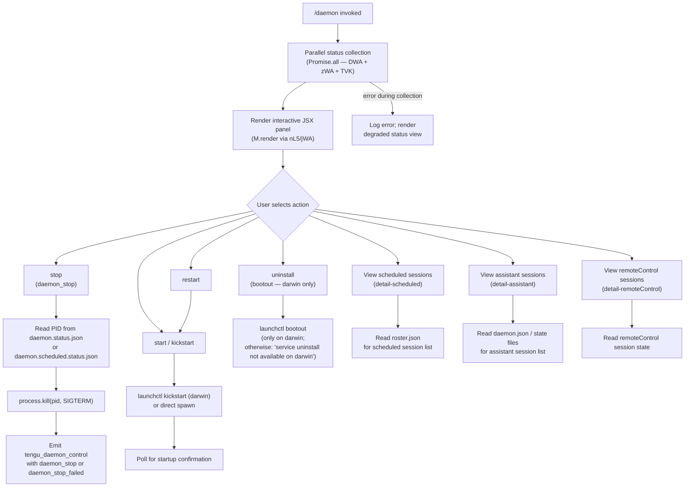

# `/daemon`

> Analysis basis: CC v2.1.179 bundle.js (AST extraction + Claude interpretation)
> Minimum version: v2.1.179

---

## Overview

The `/daemon` command provides an interactive management interface for the Claude Code background daemon process and its associated subsystems. It collects live status from multiple service registries in parallel, then renders an interactive terminal UI panel where the user can inspect, start, stop, restart, or uninstall the daemon and its scheduled/remote-control sessions. The command is classified `immediate`, meaning it runs without first invoking the AI model.

---

## Registration

| Field | Value |
|---|---|
| type | `local-jsx` |
| name | `daemon` |
| description | Manage background services and routines |
| loc_byte | 13395131 |
| loc_byte_end | 13395299 |
| loc_line | 9567 |
| immediate | `true` |
| module_id | `JWA` |
| load_inline | `true` |
| arbor_handler.name | `UL5` |
| arbor_handler.fqn | `claude-2.1.179::UL5` |
| arbor_handler.kind | `AsyncFunction` |
| arbor_handler.resolution_path | `module_id` |
| arbor_handler.n_hits | 0 |

Analysis basis: CC v2.1.179 bundle.js:+13395131

---

## Input Branching

The `/daemon` command has more than three distinct execution paths based on the sub-command or UI action chosen. A Mermaid flowchart is used below.



---

## Behavioral Spec

### Top-level Handler (`UL5`)

The Arbor-resolved handler is the async function `UL5` (FQN `claude-2.1.179::UL5`, resolved via `module_id`). It orchestrates parallel data collection and then delegates rendering to the React/Ink component tree.

```
async function daemonCommandHandler(context):
    [statusData, networkStatus, taskStatus] = await Promise.all([
        collectDaemonStatus(),       // DWA
        collectNetworkConfig(),      // zWA
        collectScheduledTaskStatus() // TVK
    ])
    renderPanel(statusData, networkStatus, taskStatus)
    // M.render call at bundle.js:+13394504
```

Analysis basis: CC v2.1.179 bundle.js:+13383881

---

### Status Collection (`DWA` — `collectDaemonStatus`)

Gathers state from several sources in parallel, producing a unified status object. Internally delegates to six sub-collectors:

```
async function collectDaemonStatus():
    [
        configFileResult,        // jVK — reads daemon.json
        daemonStatusResult,      // MVK — reads daemon.status.json
        daemonProcessStatus,     // lG  — checks PID liveness
        daemonStatusFile,        // STK — reads daemon.status.json path via VF6
        scheduledStatusFile,     // qEK — reads daemon.scheduled.status.json
        rosterResult,            // td  — reads roster.json
        launchctlStatus,         // so  — queries launchctl (macOS)
        mcpManagerStatus         // (Object.keys call at +13383673)
    ] = await Promise.all([...])
    return merged status object
```

Analysis basis: CC v2.1.179 bundle.js:+13383402

---

### Config File Reader (`jVK` + `R56` + `W2A`)

Reads and validates the daemon configuration file.

```
async function readDaemonConfig():
    entries = await Promise.all([readDaemonConfigFile(), ...])
    // R56: iterates config entries, pushes "scheduled" tagged items
    //      (string literal "scheduled" at bundle.js:+13271121)
    for entry in entries:
        if entry.type == "scheduled":
            push to scheduled list
    return config entries
```

- File size limit for config reads: **1 048 576 bytes** (1 MiB) — Analysis basis: CC v2.1.179 bundle.js:+13178010
- Encoding: `"utf8"` — Analysis basis: CC v2.1.179 bundle.js:+13178129
- Parses content with `JSON.parse` after trimming.
- If file is not a regular file: throws an error (checked via `K.isFile`).
- Config array validation uses `Array.isArray`.

Analysis basis: CC v2.1.179 bundle.js:+13271109

---

### PID Liveness Check & Process Kill (`lG` + `PU6` + `vwA`)

Checks whether the daemon process identified in the PID file is alive and, on stop actions, sends signals.

```
async function checkDaemonLiveness(pidFilePath):
    stat = await fs.lstat(pidFilePath)  // PU6, +11865632
    if not stat.isFile():
        await fs.rm(pidFilePath, {force:true, maxRetries:65536})
        //                         ^ constant at bundle.js:+11865671
        return { alive: false }

    raw = await fs.readFile(pidFilePath)
    lines = raw.split(newline)              // vwA: _.split at +11866566
    pidLine = lines.slice(...)              // vwA: A.slice at +11866613
    pid = parseInt(pidLine)

    // Confirm process name contains "claude daemon"
    // string literal at bundle.js:+11866596
    // field offset 4 at bundle.js:+11866623
    // field "daemon"  at bundle.js:+11866635

    try:
        process.kill(pid, 0)   // existence check
        return { alive: true, pid }
    catch:
        return { alive: false }
```

Analysis basis: CC v2.1.179 bundle.js:+11866677

---

### Status File Readers (`STK` / `qEK`)

Two parallel readers for named JSON status files:

| File | Constant | loc_byte |
|---|---|---|
| `daemon.status.json` | bundle.js:+13177190 | 13177190 |
| `daemon.scheduled.status.json` | bundle.js:+13269616 | 13269616 |

Each reader:
1. Reads the file via a path helper that joins the config directory with `z_` (home-directory resolver).
2. Parses JSON with `Dq` (JSON decode helper).
3. On an active process, may call `process.kill(pid, SIGTERM)` — signal constant `"SIGTERM"` at bundle.js:+17069257.
4. Follows up with a `vW` call (a wait/poll helper).

Analysis basis: CC v2.1.179 bundle.js:+13177476 (STK), +13269823 (qEK)

---

### Roster File Reader (`td`)

Reads `roster.json` to enumerate background worker sessions.

```
async function readRoster(rosterPath):
    stat = await fs.lstat(rosterPath)   // b4H.lstat at +11877938
    if not stat.isFile():
        log warning "is not a regular file — removing"
        //           ^ string at bundle.js:+11878085
        await fs.rm(rosterPath)
        return []

    raw = await fs.readFile(rosterPath)
    decoded = decode(raw)               // x8 at +11878408

    // Size-error codes checked: "E2BIG" (+11878211), "EFTYPE" (+11878223)
    if decode error:
        emit telemetry "tengu_bg_roster_parse_failed"
        //              ^ at bundle.js:+11878131
        rotate file via Og8 (renames with Date.now() suffix)
        return []

    data = JSON.parse(decoded)
    // Validate via VKK: Array.isArray or Object.keys check
    return normalised roster entries
```

Analysis basis: CC v2.1.179 bundle.js:+11877938

---

### launchctl Status Query (`so` + `g8` + `Ag8`)

On macOS, queries the `launchctl print` sub-command to determine service state.

```
async function queryLaunchctl():
    result = await spawnCommand("launchctl", ["print", ...])
    //   string literals: "launchctl" at +11870758, "print" at +11870771
    //   timeout: 5000 ms at bundle.js:+11870805

    uid = process.getuid()   // wKK at +11867554

    return parsed service state
```

Analysis basis: CC v2.1.179 bundle.js:+11870755

---

### Network/Auth Config Collector (`zWA`)

Inspects the user's home directory for authentication and network configuration relevant to the daemon.

```
async function collectNetworkConfig():
    homeDir = os.homedir()          // qVK.homedir at +13367764
    configPath = path.join(homeDir, ...) // HwH.join at +13367755

    try:
        stat = await fs.stat(configPath)  // FF6.stat at +13367808
    catch:
        return empty config             // x8 error handler at +13367832

    result = buildNetworkStatus(configPath, stat)
    // GH: string-coerce helper at +13367895
    // role "assistant" tagged at string literal +13367785
    return result
```

Analysis basis: CC v2.1.179 bundle.js:+13367725

---

### Scheduled Task Status (`TVK` + `boH` + `X26`)

Collects scheduled task definitions and their run status by consulting the task registry and the config pipeline.

```
async function collectScheduledTaskStatus():
    taskRegistry = await loadTaskRegistry()  // boH at +13383764
    entries = await resolveTaskEntries(taskRegistry)  // X26

    // X26 checks _.has, _.add (Set membership/addition)
    // calls D1 (normalises task names: trim + toLowerCase)
    // calls lA (checks "application-inference-profile" at +2283453)
    // calls NO (validation helper)
    // filters results: q.filter at +2613163

    return scheduledTaskList
```

Analysis basis: CC v2.1.179 bundle.js:+13383764

---

### Interactive Panel Renderer (`jWA` — JSX Component)

The main React/Ink component rendered by `M.render`. Manages local state for selected view tabs and refresh timing.

```
function DaemonPanel(props):
    [view, setView] = useState(...)       // fK.useState at +13384092
    clock = useClockContext()             // C1 at +13384109
    startTime = Date.now()               // +13384141

    // Refresh interval: L.now() polled at +13384158

    mcpManager = useMCPManager()         // M (MCP manager ref at +13394454)
    networkStatus = props.networkStatus  // zWA result
    scheduledTasks = props.taskStatus    // TVK result

    // Sub-views rendered by string key:
    //   "detail-scheduled"     (+13384712)
    //   "detail-assistant"     (+13384870)
    //   "detail-remoteControl" (+13384991)
    //   "new"                  (+13384810)

    // Action routing:
    //   "uninstall"  (+13384523) → e76 (bootout on darwin)
    //   "start"      (+11869607) → IwA kickstart
    //   "stop"       (+11869643) → IwA SIGTERM sequence
    //   "restart"    (+11869683) → IwA: stop then kickstart

    // Tabs rendered: "Scheduled", "Remote Control", "Claude daemon"
    //    string literals at +13385639, +13385960, +13386245

    // MCP subsystem rendered via M (KxH call tree)
    // Session pool rendered via D (bg worker manager)

    onUnmount: M.unmount()   // at +13394718
```

Analysis basis: CC v2.1.179 bundle.js:+13384092

---

### Start / Stop / Restart (`IwA` + `e76`)

Service lifecycle operations. These call into the launchctl wrapper on macOS (`darwin` platform string at bundle.js:+11870266).

```
async function controlDaemonService(action):
    // action in {"start", "stop", "restart", "kickstart", "bootout"}
    //            strings at +11869607, +11869643, +11869683, +11869618, +11869256

    if action == "uninstall" and platform == "darwin":
        await launchctl("bootout", ...)
    else if platform != "darwin":
        return error "service uninstall not available on darwin"
        // string at bundle.js:+11869387

    if action == "restart":
        await stopDaemon()       // SIGTERM + poll
        if not stopped within 10 seconds:
            abort with "daemon did not exit within 10s of SIGTERM; restart aborted before kickstart"
            // string at bundle.js:+11869940
        await launchctl("kickstart", ...)
        // poll every 50 ms at +11869911

    emit telemetry "tengu_daemon_control"   // at bundle.js:+17105376
    //   sub-events: "daemon_stop"          (+17105301)
    //               "daemon_stop_failed"   (+17105338)
```

Analysis basis: CC v2.1.179 bundle.js:+11869501 (IwA), +11869228 (e76)

---

### Background Worker / Session Pool (`D` + `MkA`)

The daemon manages a pool of background Claude sessions. The session manager (`D`) handles the full lifecycle: claim, spawn, retire, kill.

```
async function manageBackgroundSessions():
    // Worker states observed:
    //   "spare", "exec", "claimed", "spawned",
    //   "done", "killed", "crashed", "blocked",
    //   "working", "bg", "idle", "resuming"
    //   (+17068094, +17068217, +17068873, +17069241,
    //    +17073522, +17073540, +17073706, +17073760,
    //    +17073867, +17074031, +17074471, +17075449)

    // Memory pressure handling:
    //   Check os.freemem() ($kA.freemem at +17067733)
    //   Emit tengu_bg_dispatch_low_mem (+17067903)
    //   Emit tengu_bg_low_mem_mb       (+13454570) — platform "macos" (+13454543)
    //   If memory still low after shedding non-pinned:
    //     emit tengu_bg_retire_pinned_low_mem (+17072013)
    //     ("bg: low memory persists after shedding non-pinned..." at +17071902)

    // Escalation:
    //   SIGKILL escalation → tengu_bg_dispatch_sigkill_escalate (+17067302)
    //   30s / 15s timeout constants at +17067257 / +17067268

    // Spawn via Tc.spawn (+17069064)
    // Claim via Tc.claim (_kA, +17043651)

    // Prewarm sweep:
    //   emit tengu_bg_prewarm_per_sweep (+17072134)
    //   "prewarm" string at +17072738
    //   max 12 sessions per sweep at +17072168

    // Session connect via unix socket:
    //   qt8.connect (+17043999)
    //   send-claim timeout string (+17044342)
    //   ECONNREFUSED handling (+17044434)
    //   emit tengu_bg_sendclaim_failed (+17043852)
```

Analysis basis: CC v2.1.179 bundle.js:+17067184 (D), +17073450 (MkA)

---

### MCP Server Manager (`M` + `KxH` + `fhA`)

The daemon panel hosts the full MCP server lifecycle manager, connecting, reconnecting, and supervising MCP transports.

```
function manageMCPServers(config):
    // Transport types handled:
    //   "stdio", "sse", "sse-ide", "ws-ide", "claudeai-proxy", "http"
    //   (+6805298, +6539694, +6805397, +6805433, +6805705, +6539710)

    // Server states:
    //   "disabled", "connected", "needs-auth", "failed"
    //   (+6805196, +6803874, +6805957, +6804698)

    // Config scopes: "mcpAutoDiscovered", "enterprise", "mcp",
    //                "user", "project", "local"
    //   (+6547155, +6547265, +6547439, +6547480, +6547507, +6547537)

    // On reconnect: emit tengu_mcp_reconnect (+6803896)
    // Not connected: emit tengu_mcp_reconnect_not_connected (+6803912)
    // Needs-auth discovery: emit tengu_mcp_reconnect_needs_auth_discovery (+6804224)
    // Reconnect failed: emit tengu_mcp_reconnect_failed (+6804609)

    // Recent failure backoff:
    //   skip with message "Skipping connection (recent failure cached; retries automatically in 15 min...)"
    //   string at bundle.js:+6806153

    // OAuth sub-flow (OqH / F08):
    //   Start: tengu_mcp_oauth_flow_start (+6575190)
    //   Success: tengu_mcp_oauth_flow_success (+6580168)
    //   Error: tengu_mcp_oauth_flow_error (+6581879)
    //   Auth timeout: 300 000 ms (+6579742)
    //   OAuth callback: "/callback" endpoint (+6578243)
    //   Callback server port conflict: "EADDRINUSE" (+6579350)

    // Needs-auth cache file: "mcp-needs-auth-cache.json" (+6795736)
```

Analysis basis: CC v2.1.179 bundle.js:+16716552 (KxH), +16716689 (fhA)

---

## State & Side Effects

| Item | Detail |
|---|---|
| Telemetry: `tengu_daemon_control` | Fired on stop/restart actions; carries `daemon_stop` or `daemon_stop_failed` sub-event (bundle.js:+17105376) |
| Telemetry: `tengu_bg_roster_parse_failed` | Fired when `roster.json` cannot be decoded (bundle.js:+11878131) |
| Telemetry: `tengu_bg_dispatch_sigkill_escalate` | Fired when SIGTERM timeout forces SIGKILL escalation (bundle.js:+17067302) |
| Telemetry: `tengu_bg_dispatch_low_mem` | Fired when memory pressure triggers worker shedding (bundle.js:+17067903) |
| Telemetry: `tengu_bg_low_mem_mb` | Reports current free memory in MB on macOS (bundle.js:+13454570) |
| Telemetry: `tengu_bg_retire_pinned_low_mem` | Fired when pinned workers must be retired due to persistent low memory (bundle.js:+17072013) |
| Telemetry: `tengu_bg_prewarm_per_sweep` | Fired each prewarm sweep; max 12 sessions (bundle.js:+17072134) |
| Telemetry: `tengu_bg_spare_enable` | Fired when spare worker pool is enabled (bundle.js:+17068607) |
| Telemetry: `tengu_bg_spare_claim` | Fired when a spare worker is claimed (bundle.js:+17068735) |
| Telemetry: `tengu_bg_spare_claim_fail` | Fired when spare claim fails (bundle.js:+17069001) |
| Telemetry: `tengu_bg_sendclaim_failed` | Fired when unix-socket claim send fails (bundle.js:+17043852) |
| Telemetry: `tengu_bg_state_read_transient` | Fired on transient state file read errors (bundle.js:+4323451) |
| Telemetry: `tengu_mcp_oauth_flow_start` | MCP OAuth flow initiated (bundle.js:+6575190) |
| Telemetry: `tengu_mcp_oauth_flow_success` | MCP OAuth flow completed successfully (bundle.js:+6580168) |
| Telemetry: `tengu_mcp_oauth_flow_error` | MCP OAuth flow failed (bundle.js:+6581879) |
| Telemetry: `tengu_mcp_reconnect` | MCP server reconnect attempted (bundle.js:+6803896) |
| Telemetry: `tengu_mcp_reconnect_not_connected` | MCP server not connected at reconnect time (bundle.js:+6803912) |
| Telemetry: `tengu_mcp_reconnect_needs_auth_discovery` | Auth re-discovery triggered during reconnect (bundle.js:+6804224) |
| Telemetry: `tengu_mcp_reconnect_failed` | MCP reconnect failed (bundle.js:+6804609) |
| Telemetry: `tengu_mcp_skills` | MCP skill inventory reported (bundle.js:+6682260) |
| Telemetry: `tengu_daemon_config_reload` | Daemon configuration reloaded at runtime (bundle.js:+17083201) |
| Telemetry: `tengu_config_auth_loss_prevented` | Auth loss in config save prevented (bundle.js:+3394809) |
| Telemetry: `tengu_feature_ok` / `tengu_feature_bad` | Feature flag evaluation results (bundle.js:+1020479, +1020546) |
| Telemetry: `tengu_scheduled_task_missed` | A scheduled task was missed (bundle.js:+16544540) |
| File reads | `daemon.json`, `daemon.status.json`, `daemon.scheduled.status.json`, `roster.json`, `mcp-needs-auth-cache.json` |
| File writes | `roster.json` rotation on parse failure (rename with `Date.now()` suffix via `Og8`) |
| process signals | `process.kill(pid, SIGTERM)` for graceful stop; `SIGKILL` for escalation |
| launchctl (macOS) | `launchctl print`, `launchctl kickstart`, `launchctl bootout` — darwin only |
| Unix socket | Daemon claim sent over `qt8.connect` socket; ECONNREFUSED handled |
| appState changes | MCP server map updated via `H.applyMcpUpdate`; config supervisor `Z.updateConfig / Z.start / Z.stop` |
| Ink render | `M.render` mounts panel; `M.unmount` called on exit |
| Hook registration | `U9 → oSA.register` (signal/cleanup hook registration at bundle.js:+66377) |
| Sound | None observed |

---

## Version History

| Version | Change |
|---|---|
| v2.1.179 | Initial analysis |

---

## Common Mistakes

1. **Expecting the command on non-daemon builds**: `/daemon` is only fully functional when the Claude Code daemon process (`claude daemon`) is installed and running. Without it, status collection returns empty or error states.
2. **Assuming `uninstall` works cross-platform**: The `bootout` sub-command only works on macOS (`darwin`). On other platforms the command returns `"service uninstall not available on darwin"` (bundle.js:+11869387).
3. **Ignoring the 15-minute MCP failure backoff**: If an MCP server recently failed, the reconnect is silently skipped for 15 minutes unless the plugin config is edited to force a retry (bundle.js:+6806153).
4. **Expecting instant restart**: Restart waits up to 10 seconds for SIGTERM to take effect before issuing `kickstart`. If the daemon does not exit within that window, the restart is aborted (bundle.js:+11869940).
5. **File size assumptions**: The daemon config reader enforces a hard 1 MiB read limit (bundle.js:+13178010). Config files exceeding this will fail silently.

---

## Appendix — Identifier Mapping

> For bundle debugging only. Identifiers change across versions.

| Identifier | Role |
|---|---|
| `UL5` | Main async handler for `/daemon` (Arbor-resolved entry point) |
| `nL5` | Inner render orchestrator; calls parallel collectors and M.render |
| `jWA` | JSX React/Ink panel component (DaemonPanel) |
| `DWA` | Daemon status aggregator (calls jVK, MVK, lG, STK, qEK, td, so) |
| `jVK` | Config file collection coordinator (calls R56, SH, lG) |
| `R56` | Config entry processor; tags "scheduled" entries |
| `W2A` | Daemon config file reader (lstat + readFile + JSON.parse) |
| `l2A` | Config array validation helper (Array.isArray check) |
| `SH` | Shell command executor / log buffer writer |
| `lG` | Daemon PID liveness checker and process killer |
| `PU6` | PID file reader/validator (lstat + rm + readFile) |
| `vwA` | PID line parser (readFile + split + slice) |
| `vW` | Wait/poll helper after signal send |
| `MVK` | Daemon status file reader orchestrator |
| `bVH` | Status JSON file reader (stat + isFile + JSON decode) |
| `H9` | App state store accessor (YWf.getStore) |
| `OWA` | Status path helper ($WA) |
| `Gu` | Path join utility (NwA.join + z_) |
| `STK` | daemon.status.json reader + process.kill dispatcher |
| `VF6` | Status file path builder (kTK.join + z_) |
| `qEK` | daemon.scheduled.status.json reader + process.kill dispatcher |
| `AEK` | Scheduled status path builder (HEK.join + z_) |
| `td` | Roster file reader/validator (lstat + readFile + rotate on error) |
| `s6H` | Roster path builder |
| `ZzH` | Roster base directory resolver |
| `Og8` | Roster file rotator (rename with Date.now suffix) |
| `NU6` | Timestamp helper (Date.now wrapper) |
| `VKK` | Roster entry type validator (Array.isArray / Object.keys) |
| `PCA` | Roster entry normaliser |
| `so` | launchctl status query dispatcher |
| `g8` | launchctl spawn wrapper |
| `o_` | launchctl output parser |
| `Ag8` | UID resolver for launchctl domain (process.getuid) |
| `wKK` | UID fetch helper |
| `zWA` | Network/auth config collector (homedir + stat + buildNetworkStatus) |
| `Qe6` | Network config decoder |
| `TVK` | Scheduled task status collector |
| `boH` | Task registry loader |
| `X26` | Task entry resolver (Set membership + D1 normalisation) |
| `GIf` | Task definition parser |
| `Rn1` | Task name resolver |
| `lA` | Inference-profile type checker |
| `D1` | Task name normaliser (trim + toLowerCase + model-family map) |
| `M` | Ink render host / MCP manager reference (M.render, M.unmount) |
| `KxH` | MCP server manager core (connect/reconnect/transport dispatch) |
| `IQ` | MCP connection state machine |
| `vr` | MCP server connector (transport negotiation) |
| `HU` | MCP config scope collector |
| `G08` | MCP error colour formatter |
| `B86` | MCP server slot manager (Map get/set/has) |
| `IE` | MCP connection result handler |
| `Jw` | MCP result logger |
| `YHq` | MCP tool-hash and state snapshot builder |
| `Sn_` | MCP snapshot reader (H9 + BG8 + l6) |
| `j0H` | MCP tool fingerprint builder (JSON.stringify + sha256 hash) |
| `JL8` | MCP state writer |
| `XL8` | MCP state chain (JL8 + rX) |
| `DL8` | MCP state entry builder |
| `F08` | MCP transport orchestrator (stdio/SSE/OAuth) |
| `OqH` | MCP OAuth server (HTTP callback server, token exchange) |
| `r86` | MCP connection cache manager (C08 Map) |
| `yr` | MCP reconnect logic |
| `w` | MCP supervisor config updater (Z.stop/updateConfig/start) |
| `g08` | MCP tool-call executor |
| `ZHq` | MCP state snapshot subscriber |
| `BG8` | MCP needs-auth cache path builder |
| `ac_` | MCP connection attempt wrapper |
| `Us8` | MCP update applier (applyMcpUpdate + cleanup + GG) |
| `GG` | MCP connection cleanup coordinator |
| `W_6` | MCP fingerprint rebuilder |
| `fhA` | MCP server list refresher (Object.entries + getClients + KxH) |
| `N08` | MCP server suppression checker (SS7 + Qc_ sets) |
| `D` | Background session pool manager (claim/spawn/retire/kill) |
| `MkA` | Background session lifecycle handler (roster, socket, state files) |
| `_kA` | Background worker claim sender (unix socket connect + claim frame) |
| `LTA` | Claim file writer (mkdir + writeFile + JSON.stringify) |
| `lb5` | Claim frame builder (Tc.buildClaimFrame) |
| `nb5` | Claim send timeout handler |
| `hv` | Binary claim frame serialiser (Buffer.allocUnsafe + writeUInt32BE) |
| `zq` | Session state file reader/watcher |
| `qL6` | Session state poller (td + Date.now + GcL) |
| `vU6` | Session socket path builder |
| `EzH` | Session error socket path builder |
| `MkA` | Session entry lifecycle (done/killed/crashed/blocked/working/bg/idle states) |
| `oRH` | Pin file reader (pins.json + lstat + rm) |
| `eL7` | Pin directory scanner (readdir + lstat + isDirectory) |
| `g` | Worker permission classifier (deny/classify/ask) |
| `tq6` | Worker gate evaluator |
| `xd` | Worker execution dispatcher |
| `il8` | Memory platform reporter (r6 + Y6 for macOS) |
| `b` | Background session object (spawn, config, state, roster) |
| `bCH` | Session config file reader (readFile + JSON.parse) |
| `dH6` | Session scratch directory writer (mkdir + writeFile) |
| `g9H` | Session preparation helper (bCH + dH6 filter) |
| `ctK` | Session prompt formatter (H.map + Math.max + q.join) |
| `J` | Session dispatch orchestrator |
| `G` | Session group UI renderer (CmH) |
| `CmH` | Session list Ink component (SmH + _OH + H9 + bH) |
| `SmH` | Session row renderer |
| `Z` | Scrollable list component (Math.max + Math.min clamp) |
| `T` | Session tab strip component |
| `v` | Scroll position updater (Math.max + Math.floor) |
| `e76` | Service uninstall handler (launchctl bootout, darwin) |
| `ywA` | LaunchAgents plist path builder |
| `ZU6` | Service control dispatcher (IwA) |
| `IwA` | launchctl action executor (kickstart/stop with 50 ms poll) |
| `y` | UI focus/blur clock (blurred/focused states, 3 600 000 ms hour window) |
| `I` | Background sweep ticker (respawnIfIdleStale, retireIfSettled, prewarm) |
| `NaK` | Sweep history accessor |
| `QB` | Daemon shutdown sequence (Promise.race + process.exit) |
| `tLH` | Graceful shutdown initiator (sLH.shutdown) |
| `eLH` | Shutdown cleanup handler (clearTimeout + AI_) |
| `QS` | Daemon session event emitter (im + XG_) |
| `XG_ ` | Session event dispatcher (randomUUID + H.emit) |
| `n8` | Abort-signal aware timeout helper |
| `GH` | String coercion utility |
| `G8` | Error code tester |
| `x8` | Error type helper |
| `Dq` | JSON decode helper |
| `bH` | JSON.stringify wrapper |
| `l6` | JSON.parse wrapper |
| `z_` | Home-directory path resolver |
| `N` | HTTP request maker (fetch with retry + jitter) |
| `aM4` | Log file writer (appendFile + rotate + Buffer.byteLength) |
| `U9` | Cleanup hook registrar (oSA.register) |

---

Note: index built via Arbor fallback; some signals (telemetry, literals) may be missing — see arbor-fallback.js.