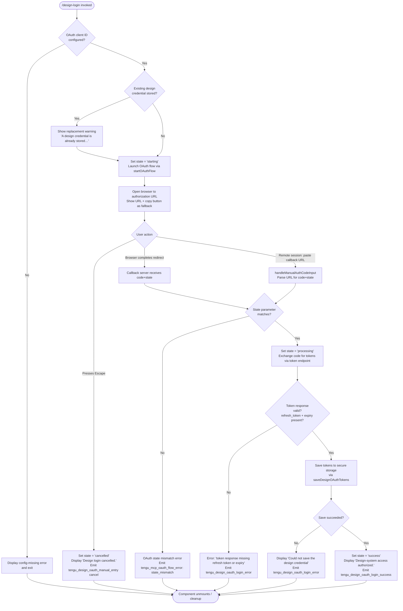

# `/design-login`

> Analysis basis: CC v2.1.179 bundle.js (AST extraction + Claude interpretation)
> Minimum version: v2.1.179

---

## Overview

`/design-login` launches an OAuth 2.0 authorization flow that grants Claude Code access to the user's claude.ai design-system account. It opens a browser-based consent screen, waits for the authorization code callback (or accepts a manually pasted callback URL on remote sessions), exchanges the code for tokens, and stores a durable design credential in secure storage so that `/design-sync` can operate without re-authenticating.

---

## Registration

| Field | Value |
|---|---|
| type | `local-jsx` |
| name | `design-login` |
| description | `Authorize design-system access for /design-sync with your claude.ai account` |
| module_id | `WfK` |
| load_inline | `true` |
| loc_byte | `11997236` |
| loc_byte_end | `11997435` |
| loc_line | `7963` |
| arbor_handler.name | `TfK` |
| arbor_handler.fqn | `claude-2.1.179::TfK` |
| arbor_handler.kind | `Function` |
| arbor_handler.resolution_path | `direct` |
| arbor_handler.n_hits | `1` |

Analysis basis: CC v2.1.179 bundle.js:+11997236

---

## Input Branching

The command's React component (`PfK`) drives a multi-stage state machine with more than three distinct branches — initial start, waiting-for-login, about-to-retry, manual-code entry, processing, success, and cancellation — making a Mermaid flowchart the appropriate representation.



Analysis basis: CC v2.1.179 bundle.js:+11990902 – +11993750

---

## Behavioral Spec

### 1. Component Initialization (`PfK` / handler `TfK`)

```
function designLoginComponent(props):
    authContext   = useAuthContext()          // C1 → IX9.useContext
    terminalSize  = useTerminalSizeContext()  // N_ → tX9.useContext

    [loginState, setLoginState] = useState("starting")
    authUrlRef = useRef(null)

    progressWidth = Math.max(50, terminalSize.columns - 4)

    return renderLoginUI(loginState, authUrlRef, progressWidth, props)
```

Analysis basis: CC v2.1.179 bundle.js:+11990902

---

### 2. OAuth Client ID Guard

Before initiating any network activity the component verifies that the design-system OAuth client ID is embedded in the build. If the environment variable `CLAUDE_CODE_DESIGN_OAUTH_CLIENT_ID` is absent and no baked-in client ID is present, the component immediately surfaces the message:

> "The Claude Design OAuth client is not configured in this build. Set `CLAUDE_CODE_DESIGN_OAUTH_CLIENT_ID` to the registered client id, or update to a build with the registered client."

Analysis basis: CC v2.1.179 bundle.js:+11992015

---

### 3. OAuth Flow Initiation (`startOAuthFlow` / `OqH`)

```
function startOAuthFlow(authContext, callbackServerRef):
    emit telemetry("tengu_mcp_oauth_flow_start")

    redirectUri = "http://localhost:<port>/callback"
    startLocalCallbackServer(port=random, bindAddr="127.0.0.1")
        // server listens; sets EADDRINUSE retry on Windows
        // times out after 300 000 ms ("Authentication timeout")

    authUrl = buildAuthorizationUrl(clientId, redirectUri, state=randomUUID())
    openBrowser(authUrl)
    store authUrl in authUrlRef for fallback display

    // Fallback display:
    show "Browser didn't open? Use the url below to sign in"
    offer copy-to-clipboard button  → shows "(Copied!)" on success
```

The callback server listens only on `127.0.0.1` and handles `/callback` exclusively. Any other path returns HTTP 404. On successful code receipt it renders:

> `<h1>Authentication Successful</h1><p>You can close this window. Return to Claude Code.</p>`

On a state-mismatch it returns HTTP 400 with an HTML error page.

Analysis basis: CC v2.1.179 bundle.js:+6575190, +6579645, +6578243, +6578902, +6579683

---

### 4. Remote-Session Manual Code Entry (`handleManualAuthCodeInput` / `PfK`)

For SSH or remote sessions where the browser redirect cannot reach `localhost`, the component accepts a pasted full callback URL. The parsing logic:

```
function handleManualAuthCodeInput(rawInput, expectedState):
    emit telemetry("tengu_design_oauth_manual_entry")
    trimmed = rawInput.trim()
    parts   = trimmed.split("?")

    if parts.length < 2:
        showError("Invalid code. Please make sure the full code was copied")
        return

    params = parseQueryString(parts[1])
    code   = params.get("code")
    state  = params.get("state")

    if not code or state != expectedState:
        showError("Invalid callback URL: missing authorization code. Ask the user to paste the full redirect URL…")
        return

    proceedWithCodeExchange(code, state)
```

Analysis basis: CC v2.1.179 bundle.js:+11991843, +11991646, +6607533

---

### 5. Token Exchange and Persistence (`afA` / `ek`)

```
async function exchangeCodeAndPersist(code, redirectUri, clientId):
    setLoginState("processing")

    response = await httpPost(tokenEndpoint, {
        grant_type:    "authorization_code",
        code:          code,
        redirect_uri:  redirectUri,
        client_id:     clientId
    }, {
        headers: { "Content-Type": "application/json" },
        timeout: 5000
    })

    if not response.refresh_token or not response.expiry:
        throw Error("The token response was missing a refresh token or expiry…")

    saved = await saveDesignOAuthTokens(response)   // lu8 → secure storage

    if not saved:
        emit telemetry("tengu_design_oauth_login_error")
        showError("Could not save the design credential to secure storage.")
        return

    emit telemetry("tengu_design_oauth_login_success")
    setLoginState("success")
    showMessage("Design-system access authorized.")
```

On an Axios network error the error class is captured as `"network"`. Token revocation is available separately via a `POST` to the revoke endpoint with `grant_type: refresh_token` (used by cleanup / logout paths, not this flow).

Analysis basis: CC v2.1.179 bundle.js:+11992238, +10138807, +10139112, +11992850, +11992946

---

### 6. Cancellation via Escape Key

```
function handleKeypress(key, loginState):
    if key == "escape" and loginState not in ["success", "processing"]:
        setLoginState("cancelled")
        displayMessage("Design login cancelled.")
        cleanup()
    if key == "return" and loginState == "success":
        cleanup()
        exitComponent()
```

Analysis basis: CC v2.1.179 bundle.js:+11991293, +11991382, +11991446

---

### 7. Token Persistence Helper (`saveDesignOAuthTokens` / `ru8` → `lu8`)

```
async function saveDesignOAuthTokens(tokens):
    record = buildTokenRecord(tokens)        // q4 → pC1
    result = await secureStorage.onlyIf(record)
    if result.error:
        logError("Failed to save design OAuth tokens")
        emit telemetry("tengu_design_oauth_login_error")
        return false
    return true
```

A 1 500 ms display delay is applied before the component transitions away from the success state to ensure the confirmation message is readable.

Analysis basis: CC v2.1.179 bundle.js:+11992741, +10135409, +10135638, +11993075

---

### 8. Cleanup (`q.cleanup` / `PfK`)

```
function cleanup():
    q.cleanup()           // close OAuth callback HTTP server
    v.forEach(dispose)    // clear all useEffect subscriptions
    v.clear()
```

Analysis basis: CC v2.1.179 bundle.js:+11993644

---

## State & Side Effects

| Item | Detail |
|---|---|
| Telemetry: `tengu_mcp_oauth_flow_start` | Fired when the OAuth callback server starts and the browser is opened (bundle.js:+6575190) |
| Telemetry: `tengu_mcp_oauth_flow_success` | Fired when the MCP-level OAuth handshake completes (bundle.js:+6580168) |
| Telemetry: `tengu_mcp_oauth_flow_error` | Fired on any OAuth-layer failure (state mismatch, timeout, provider denial, port unavailable, SDK failure) (bundle.js:+6581879) |
| Telemetry: `tengu_design_oauth_manual_entry` | Fired when the user submits a manual callback URL instead of using the browser redirect (bundle.js:+11991805) |
| Telemetry: `tengu_design_oauth_login_success` | Fired after tokens are successfully persisted to secure storage (bundle.js:+11992946) |
| Telemetry: `tengu_design_oauth_login_error` | Fired when token exchange or persistence fails (bundle.js:+11993099) |
| Telemetry: `tengu_feature_ok` | Generic feature-health OK event (bundle.js:+1020479) |
| Telemetry: `tengu_feature_sad` | Generic feature-health SAD event (bundle.js:+1020627) |
| Telemetry: `tengu_feature_bad` | Generic feature-health BAD event (bundle.js:+1020546) |
| Secure storage write | Design OAuth tokens (access_token, refresh_token, expiry) written to secure storage via `saveDesignOAuthTokens` |
| Local HTTP server | Ephemeral callback server bound to `127.0.0.1` on a random port; torn down after code receipt or timeout (300 000 ms) |
| Clipboard | Authorization URL copied to clipboard when user clicks the copy button; UI shows `"(Copied!)"` |
| appState changes | Login state machine transitions through: `starting` → `waiting_for_login` → `about_to_retry` → `processing` → `success` (or `cancelled` on Escape) |
| Sound | None detected in depth-2 traversal |

---

## Version History

| Version | Change |
|---|---|
| v2.1.179 | Initial analysis |

---

## Common Mistakes

1. **Missing OAuth client ID**: If the build does not include `CLAUDE_CODE_DESIGN_OAUTH_CLIENT_ID` (or a baked-in equivalent), the command fails immediately with a configuration error. This is not a user error — it requires a correctly built or configured binary.
2. **Remote-session URL pasting**: On SSH sessions the browser redirect to `localhost` will fail in the browser, but the URL in the address bar is still valid. Users must paste the *entire* URL (including `?code=…&state=…`) — pasting only the code portion will result in a parse error.
3. **Escaping too early**: Pressing Escape during `"processing"` is intentionally ignored. Cancellation is only available before code exchange begins.
4. **Stale credential warning**: Running `/design-login` when a credential already exists silently replaces it. Users who intend to keep the existing token should cancel immediately after reading the replacement warning.
5. **Port conflicts**: The callback server retries on `EADDRINUSE`. On Windows this may take longer. The overall timeout is 300 000 ms (5 minutes); if no port becomes available within that window, the error `"No available port"` is surfaced with telemetry code `"port_unavailable"`.
6. **Token response validation**: The token endpoint must return both a `refresh_token` and an expiry value. An access-token-only response is rejected and the credential is not saved.

---

## Appendix — Identifier Mapping

> For bundle debugging only. Identifiers change across versions.

| Identifier | Role |
|---|---|
| `MnL` | Top-level command entry / JSX render wrapper (handler_name) |
| `TfK` | Arbor-resolved handler function (arbor_handler.name) |
| `PfK` | Design-login React component (state machine + UI) |
| `C1` | `useClockContext` hook (clock provider context reader) |
| `N_` | `useTerminalSizeContext` hook (terminal dimensions context reader) |
| `v` | Scroll / viewport control object (preventDefault, start, split) |
| `S` | File-watch / daemon supervisor event handler |
| `v94` | File stat + realpath utility |
| `x8` | ENOENT error classifier |
| `mL` | Daemon messaging / IPC send helper |
| `N` | HTTP request builder / normalize helper |
| `nM4` | Config file write helper |
| `bH` | JSON stringify wrapper |
| `g4` | Path segment / redaction utility ("[REDACTED]") |
| `ydH` | Global config reader |
| `aM4` | Config file write with buffer-length guard |
| `SH` | Stdio / stream supervisor |
| `WA` | Error-to-string converter |
| `f6` | Boolean string normalizer ("yes"/"on") |
| `fq` | Essential-traffic queue manager |
| `Nd4` | Queue shift/push ring buffer |
| `Ex5` | Version-check utility ("claude versions") |
| `vI8` | Claude version fetcher |
| `w` | MCP server connection writer / supervisor slot |
| `bVH` | File write guard (stat + isFile check, 1 MiB limit) |
| `q` | MCP server client connection object |
| `AVK` | Column-width calculator for MCP tool table |
| `L` | MCP connection lifecycle handle (get/set/delete/close) |
| `T` | Spinner / progress indicator controller |
| `Z` | Rate-limiter / token-budget controller (start/stop/updateConfig) |
| `Z94` | Heartbeat T1H scheduler |
| `d` | Generic disposable / cleanup token |
| `f` | Promise set tracker (add/delete/finally) |
| `M` | MCP server slot manager (applyConnectionResult, fhA) |
| `KxH` | MCP connection orchestrator (top-level connect loop) |
| `IQ` | MCP tool discovery + registration |
| `Q86` | Tool schema builder |
| `vr` | MCP server connector (full connect pipeline) |
| `HU` | MCP header builder |
| `G08` | MCP error colour formatter (red/yellow) |
| `B86` | SSE/HTTP transport initializer |
| `IE` | MCP transport error wrapper |
| `Jw` | Dq / display-query helper |
| `uc_` | MCP unknown-transport error handler |
| `K` | Column padding formatter (padEnd) |
| `s8` | Generic sleep/delay utility |
| `ih6` | MCP idle-health ticker |
| `YHq` | Needs-auth cache manager |
| `Sn_` | Cache file path builder (`mcp-needs-auth-cache.json`) |
| `j0H` | Cache key hasher (SHA-256 / hex) |
| `JL8` | Cache record serializer |
| `XL8` | Cache record deserializer |
| `rX` | Cache entry hash verifier |
| `DL8` | Cache persistence driver |
| `q4` | Secure-storage read helper |
| `$8` | MCP debug logger (logMCPDebug) |
| `F08` | MCP OAuth flow orchestrator |
| `KR7` | OAuth redirect-URI builder |
| `il` | OAuth tool-registration helper ("authenticate") |
| `HqH` | claude.ai connector hint emitter |
| `_qH` | OAuth "allow" / "unsupported" decision |
| `OqH` | OAuth callback HTTP server + token exchange engine |
| `r86` | In-flight OAuth request tracker (C08 map) |
| `Y` | Forced-shutdown / process-exit orchestrator |
| `Q08` | Cache lookup after reconnect |
| `yr` | MCP reconnect sequencer |
| `hm` | M4 hook context helper |
| `w7` | MCP error logger (logMCPError) |
| `GH` | String coercion utility |
| `fR7` | OAuth result finalizer |
| `qR7` | SSH environment detector for OAuth URL strategy |
| `g08` | `complete_authentication` tool handler (manual callback URL) |
| `i86` | In-flight request lookup (R08.get) |
| `o86` | Pending OAuth request lookup (C08.get) |
| `ZHq` | Needs-auth reconnect trigger |
| `H9` | AsyncLocalStorage store reader |
| `BG8` | Cache path joiner |
| `ac_` | Auth token refresher |
| `j` | Process-pool killer (SIGTERM sweep) |
| `A` | toLowerCase normalizer |
| `Yh` | MCP skills telemetry emitter |
| `Y6` | MCP skills event builder (`tengu_mcp_skills`) |
| `xc_` | MCP connection state machine entry |
| `J8` | Global config save (with auth-loss guard) |
| `y` | Background worker pool manager |
| `wi` | Worker focus/blur state tracker |
| `I` | Background sweep scheduler (retire/respawn/prewarm) |
| `k` | Generic worker handle |
| `NaK` | Worker queue `.at()` accessor |
| `PHq` | MCP pagination helper |
| `qQ` | Async iterator / stream multiplexer |
| `T_6` | parseInt wrapper (radix 10) |
| `FG8` | parseInt wrapper (radix 20) |
| `Us8` | MCP slot apply-connection-result handler |
| `qxH` | Tool hash comparator |
| `GG` | MCP server cleanup coordinator |
| `W_6` | Tool list differ |
| `$` | Daemon status writer |
| `yTK` | Daemon status JSON builder |
| `Ht` | mLH metadata helper |
| `VF6` | Status file path builder (`daemon.status.json`) |
| `fhA` | MCP server reconnect-all orchestrator |
| `N08` | MCP server capability checker (SS7 / Qc_ sets) |
| `n8` | Generic timeout/abort helper |
| `O` | Background session stopper |
| `Mu6` | Design OAuth client-ID resolver |
| `ou8` | OAuth base-URL builder |
| `R1` | OAuth endpoint URL constructor |
| `rgA` | Production OAuth endpoint constant |
| `Hh4` | Staging OAuth endpoint constant |
| `ek` | Token revocation HTTP helper (jA.post) |
| `IH` | `tengu_feature_ok` emitter wrapper |
| `QH` | Feature telemetry dispatcher (n36) |
| `n36` | Core telemetry post function |
| `U6` | `tengu_feature_sad` emitter wrapper |
| `afA` | Token-exchange + validation pipeline |
| `ru8` | Design token persistence orchestrator |
| `m7` | Terminal context aggregator (useContext/useRef/useMemo) |
| `z` | Daemon control dispatcher (IH/CH/QS/QB) |
| `CH` | `tengu_feature_bad` emitter wrapper |
| `QS` | Session-event emitter (XG_) |
| `im` | xb session-state reader |
| `lyH` | hN session-listener helper |
| `XG_` | Event bus emit wrapper |
| `QB` | Graceful shutdown sequencer (Promise.race + process.exit) |
| `tLH` | MCP server shutdown coordinator |
| `eLH` | Shutdown timeout clearer |
| `uW` | Clipboard write orchestrator (platform dispatch) |
| `JT6` | Clipboard method selector (Mw) |
| `Mw` | Terminal type detector (screen/kitty/tmux) |
| `e$9` | macOS `pbcopy` clipboard writer |
| `g8` | Platform clipboard dispatcher (o_ / x6) |
| `o_` | Shell command executor with 1 MB stdout cap |
| `x6` | Ee6/G_ process spawner |
| `DS_` | Linux clipboard writer (wl-copy / xclip / xsel) |
| `P3` | sgA text encoder |
| `Nsf` | Clipboard read-back verifier |
| `YS_` | tmux / screen clipboard writer |
| `XT6` | Clipboard strategy router |
| `_G` | OSC-52 escape-sequence writer |
| `FY` | t$9 / H.join clipboard assembler |
| `t$9` | Kitty terminal clipboard writer |
| `Lu6` | Design token load helper |

---

Note: index built via Arbor fallback; some signals (telemetry, literals) may be missing — see arbor-fallback.js.