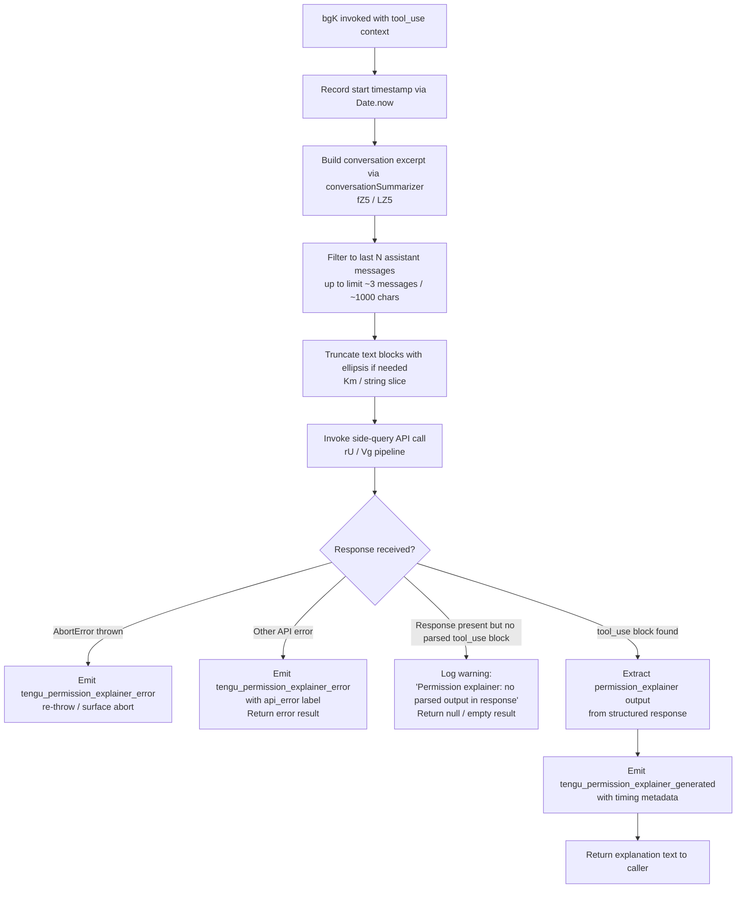

# `explain_command`

> Analysis basis: CC v2.1.179 bundle.js (AST extraction + Claude interpretation)
> Minimum version: v2.1.179

---

## Overview

The `explain_command` tool is an internal tool-type command that generates a human-readable explanation for why a specific tool use (or MCP tool call) requires a given permission. It operates as a "permission explainer" — it invokes a side-query API call using recent conversation context to produce a natural-language justification, which is then surfaced to the user when an approval prompt is displayed.

---

## Registration

| Field | Value |
|---|---|
| type | `tool` |
| name | `explain_command` |
| description | `null` |
| loc_byte | `14744945` |
| loc_byte_end | `14744981` |
| loc_line | `11280` |
| arbor_handler.name | `bgK` |
| arbor_handler.fqn | `claude-2.1.179::bgK` |
| arbor_handler.kind | `AsyncFunction` |
| arbor_handler.resolution_path | `direct` |
| arbor_handler.n_hits | `1` |

Analysis basis: CC v2.1.179 bundle.js:+14744945

---

## Input Branching

The handler has 4+ distinct branches: normal success path, abort/cancel path, API error path, and missing-output fallback path. A Mermaid flowchart is used.



---

## Behavioral Spec

### 1. Handler Entry — `permissionExplainerHandler` (`bgK`)

```
async function permissionExplainerHandler(toolUseContext):
    startTime = Date.now()                         // +14744664

    excerpt = buildConversationExcerpt(messages)   // fZ5, LZ5
    prompt  = buildPermissionExplainerPrompt(
                  toolName, toolArgs, excerpt)      // N, bH

    response = await sideQueryApiCall(prompt)      // rU

    if response is AbortError:                     // +14746098
        emit("tengu_permission_explainer_error")   // +14745640
        throw / propagate

    if response has api_error:                     // +14746169
        emit("tengu_permission_explainer_error")
        return errorResult

    parsedBlock = findToolUseBlock(response,
                      "permission_explainer")      // +14745003

    if parsedBlock is null:
        log("Permission explainer: no parsed output in response")
                                                   // +14745775
        return emptyResult

    emit("tengu_permission_explainer_generated",
         { durationMs: Date.now() - startTime })  // +14745428

    return parsedBlock.output
```

Analysis basis: CC v2.1.179 bundle.js:+14744640

---

### 2. Conversation Excerpt Builder — `conversationSummarizer` (`fZ5` / `LZ5`)

```
function buildConversationExcerpt(messages):
    // Serialize non-string content via JSON.stringify  // +190917
    // Filter to last N=3 assistant messages            // +14744264
    //   within a character budget of ~1000 chars       // +14744209
    recentAssistantMessages = messages
        .filter(m => m.role == "assistant")            // +14744244
        .reverse()                                      // LZ5 +14744289
        [0..2]                                          // limit: 3

    for each message:
        textBlocks = message.content
            .filter(block => block.type == "text")     // +14744347
        combined = textBlocks.join(...)
        if combined.length > budget:
            combined = truncate(combined, "...")        // +14744440
                       // Km handles surrogate-safe slicing
                       // surrogate range: 55296–56319  // +200489,+200499

    return combined excerpt string
```

Analysis basis: CC v2.1.179 bundle.js:+14744155, +14744221

---

### 3. Side-Query API Call — `sideQueryRunner` (`rU`)

```
async function sideQueryRunner(promptPayload, options):
    // Labelled internally as "side_query"             // +13936946
    // Constructs API request via Vg (apiRequestBuilder)
    // Sets request-type header: "x-app" = "cli-bg"   // +3300458
    // Attaches session/agent headers:
    //   X-Claude-Code-Session-Id                      // +3300491
    //   x-claude-remote-container-id                  // +3300535
    //   x-claude-code-agent-id                        // +3300649
    // Requests structured output for
    //   "permission_explainer" tool_use block         // +14745003, +14745158
    // Uses "permission_explainer_generate" as
    //   the inner tool name in the schema             // +14745530
    // Timeout budget pulled from config
    //   (default: 600000 ms)                          // +3301400
    // On success: emits tengu_api_success             // +13938607
    // Lone surrogates in output sanitized             // +13938303
    //   emits tengu_lone_surrogate_sanitized
    response = await globalThis.fetch(apiEndpoint,
                   headers, body)                      // +13936999
    return parseStructuredResponse(response)
```

Analysis basis: CC v2.1.179 bundle.js:+13936914, +13937031

---

### 4. Config / Filesystem Access — `configReader` (`h6`, `r5H`)

```
function getConfig(context):
    // Guards: "Config accessed before allowed."       // +3399762
    //   throws if config not yet initialised
    raw = fs.readFileSync(configPath, "utf-8")        // +3399818, +3399845
    parsed = JSON.parse(raw)                           // l6 → +191694
    // Backup logic: copies config file with
    //   Date.now() timestamp suffix                   // +3400883
    //   into "backups/" subdirectory                  // +3399330
    // On ENOENT: returns default config               // +3399992
    // On parse error:
    //   emits tengu_config_parse_error                // +3400393
    //   falls back to cached value
    // Watches file for changes via brf / oO8.watchFile
    return config
```

Analysis basis: CC v2.1.179 bundle.js:+3396449, +3399756

---

### 5. MCP Tool Detection — `mcpToolChecker` (`Oq`)

```
function isMcpTool(toolName):
    // Checks Object.hasOwn on tool registry           // +2557443
    if toolName.startsWith("mcp__"):                   // +2557512
        classify as "mcp_tool"                         // +2557531
    else:
        classify as regular tool
    // Used in bgK to adjust prompt framing
    // for MCP vs built-in tools
```

Analysis basis: CC v2.1.179 bundle.js:+14745478, +2557499

---

## State & Side Effects

| Item | Detail |
|---|---|
| Telemetry: `tengu_permission_explainer_generated` | Emitted on successful explanation generation, with duration metadata (bundle.js:+14745428) |
| Telemetry: `tengu_permission_explainer_error` | Emitted on AbortError or API error (bundle.js:+14745640) |
| Telemetry: `tengu_api_success` | Emitted by the underlying side-query API layer on HTTP success (bundle.js:+13938607) |
| Telemetry: `tengu_lone_surrogate_sanitized` | Emitted when lone Unicode surrogates are found and stripped from the response (bundle.js:+13938303) |
| Telemetry: `tengu_config_parse_error` | Emitted if the config JSON file is unparseable (bundle.js:+3400393) |
| Telemetry: `tengu_config_auth_loss_prevented` | Emitted if a config save would have lost auth credentials (bundle.js:+3394809) |
| Telemetry: `tengu_feature_ok` / `tengu_feature_bad` / `tengu_feature_sad` | Emitted by the feature-flag evaluation layer during request setup (bundle.js:+1020479, +1020546, +1020627) |
| File system | Config file read via `fs.readFileSync`; backup copy written with timestamp on mutation (bundle.js:+3399818, +3400901) |
| File watch | `oO8.watchFile` registered on config path; `oO8.unwatchFile` on cleanup (bundle.js:+3395952, +3396285) |
| Network | One `globalThis.fetch` POST to the Anthropic API endpoint (bundle.js:+13936999) |
| appState changes | None observed in depth-2 traversal |
| Sound | None observed in depth-2 traversal |
| Hook registration | `oSA.register` called in the file-watcher path (`U9`) (bundle.js:+66377) |

---

## Version History

| Version | Change |
|---|---|
| v2.1.179 | Initial analysis — `explain_command` tool registered as `bgK` (`AsyncFunction`, direct resolution) |

---

## Common Mistakes

1. **Treating `explain_command` as a user-facing slash command.** It is registered as a `tool` (not a `prompt` command), so it is invoked programmatically by the permission approval flow, not typed by the user.
2. **Expecting a description string.** The `description` field is `null` in the registration object (bundle.js:+14744945). Do not rely on it for display purposes.
3. **Assuming the tool always returns text.** When no `permission_explainer` tool-use block is found in the API response, the handler returns an empty/null result rather than throwing — callers must guard for this case.
4. **Confusing the `permission_explainer_generate` inner tool name with the outer registration name `explain_command`.** These are two different identifiers at different layers of the call stack (bundle.js:+14744963 vs +14745530).
5. **Assuming MCP tools are handled identically to built-in tools.** The `mcpToolChecker` (`Oq`) detects the `mcp__` prefix and adjusts prompt framing accordingly (bundle.js:+2557512).

---

## Appendix — Identifier Mapping

> For bundle debugging only. Identifiers change across versions.

| Identifier | Role |
|---|---|
| `bgK` | Main async handler for `explain_command` (permission explainer entry point) |
| `dVA` | Intermediate dispatch wrapper called by `bgK` |
| `h6` | Config accessor / watcher initialiser |
| `c6` | Low-level config primitive / path resolver |
| `iy_` | Config initialisation guard |
| `r5H` | Config file reader with backup and parse-error handling |
| `l6` | JSON parse wrapper |
| `Vm` | String prefix-strip utility (used on config paths) |
| `G8` | Config merge / update helper |
| `fM9` | Filesystem directory listing helper (config backups) |
| `N` | Log-level / severity classifier |
| `d` | Generic async deferred / promise utility |
| `ay_` | Backup subdirectory path builder |
| `D` | Background daemon session manager |
| `brf` | Config file-watcher registration function |
| `kg` | Watcher callback scheduler |
| `U9` | Hook registration wrapper (`oSA.register`) |
| `fZ5` | Conversation message serialiser (JSON stringify + String coerce) |
| `bH` | JSON stringify wrapper |
| `LZ5` | Conversation excerpt builder (filter, reverse, truncate) |
| `H` | Generic randomisation / retry-delay utility (Math.random + setTimeout) |
| `A` | String lower-case utility / array helper |
| `L` | File-handle / stream close utility |
| `f` | Promise / Set lifecycle manager |
| `Km` | Surrogate-safe string truncator |
| `Q1` | Prompt assembly entry point |
| `Zn` | Prompt section combiner |
| `Lw` | Prompt preamble builder |
| `LF` | Prompt formatting helper |
| `TK` | CLAUDE.md / system-prompt parser |
| `Nj6` | Markdown heading detector |
| `hj6` | CLAUDE.md section extractor |
| `O4` | Text normaliser / whitespace stripper |
| `$` | Async task queue / rate-limiter |
| `K` | Column-padding formatter |
| `YyH` | Blocklist membership checker |
| `EN` | Extended model-name resolver |
| `M48` | Model-tier selector |
| `BR1` | Policy-settings entry renderer |
| `R8` | Feature-flag reader |
| `HrH` | Header normaliser |
| `UR1` | User-steering model override detector |
| `xTf` | Extended-thinking flag evaluator |
| `D1` | Model identifier resolver (tier → canonical ID) |
| `iX6` | Model-string parser (prefix detection, case-fold) |
| `uTf` | Prefix-based model shorthand expander |
| `NO` | Prompt config normaliser |
| `r0` | Request object builder |
| `H2_` | Request-body field assembler |
| `w48` | Full request payload builder |
| `rU` | Side-query API call runner |
| `Vg` | API request builder (headers, auth, endpoint) |
| `xM` | AsyncLocalStorage context accessor (`lR1`) |
| `uk_` | Query-string parser |
| `V9` | Session-context accessor |
| `kn` | Daemon session store accessor (`X48`) |
| `I6` | Output formatter |
| `OT` | Terminal output emitter |
| `L2_` | URL-safe encoder (`H.replace` + `encodeURIComponent`) |
| `f6` | String coercion utility |
| `X$` | OAuth token refresh coordinator |
| `SO8` | Token refresh state machine |
| `oR1` | Boolean coercion wrapper |
| `aw` | Auth credential resolver |
| `ZL` | Auth credential loader |
| `Uj` | OAuth credential validator |
| `$4` | First-party auth type checker |
| `lP` | Auth profile loader |
| `kO` | Auth orchestrator (env vars, API key, OAuth) |
| `PG6` | Auth profile getter |
| `JsH` | Auth session loader |
| `uz` | Auth state logger |
| `gnf` | API outbound-request logger |
| `OsH` | Request timestamp / latency tracker |
| `p_` | Proxy config accessor |
| `kA8` | Proxy auth helper invoker |
| `QkH` | Proxy helper path resolver |
| `jw1` | Proxy helper config reader |
| `wLf` | Integer parser with NaN guard |
| `yS` | Proxy URL builder |
| `wW` | MKH proxy credential wrapper |
| `onf` | HTTP request executor (stream, headers, SSE) |
| `u_` | First-party provider type resolver |
| `xL9` | Request-ID generator |
| `M` | In-flight request registry |
| `GYH` | Request-start event emitter |
| `fi1` | Config accessor inside request pipeline |
| `Uk_` | Config watcher inside request pipeline |
| `anf` | Response header scrubber |
| `uL9` | Response-body line emitter |
| `bL9` | SSE chunk parser |
| `nnf` | Token / byte budget calculator |
| `inf` | Streaming byte-watchdog and ReadableStream consumer |
| `Dz` | Provider type detector |
| `zX6` | Provider string parser |
| `_Wf` | `anthropic.` domain prefix checker |
| `OX6` | Provider enum normaliser (toLowerCase) |
| `NF` | Network-feature flag reader |
| `dhH` | Network feature descriptor |
| `cw` | Proxy resolver |
| `jK` | String builder utility |
| `On` | URL parser / hostname extractor |
| `EnH` | Proxy credential builder |
| `Jw1` | Proxy auth header assembler |
| `tw_` | Proxy bypass checker (`sw_.isIP`, split) |
| `_Y_` | URL host extractor |
| `rnf` | Request abort / cleanup handler |
| `RL9` | Response-body reader pipeline |
| `Qnf` | API endpoint resolver |
| `XO8` | Bedrock / gateway endpoint builder |
| `fdH` | Endpoint feature descriptor |
| `O_H` | Vertex AI endpoint selector |
| `oG_` | Foundry resource ID builder |
| `R1` | Custom OAuth URL validator |
| `hJH` | Gateway JWT refresh initiator |
| `$6_` | Refresh-lock guard |
| `QZf` | Gateway JWT refresh executor (HTTP POST) |
| `wn6` | Refresh-result logger |
| `M6_` | Request timestamp stamper |
| `fG6` | Response header extractor (toLowerCase) |
| `mXH` | Anthropic SDK error / warning logger |
| `S` | IPC / supervisor write channel |
| `v94` | Filesystem realpath / stat helper |
| `mL` | IPC message formatter |
| `SH` | Stats/metrics reporter |
| `Ex5` | vI8 exporter |
| `w` | Supervisor write-stream manager |
| `y` | Background worker lifecycle scheduler |
| `wi` | Worker lifecycle state label |
| `I` | Background worker pool sweeper |
| `k` | Worker pool Map |
| `NaK` | Worker pool tail accessor (`H.at`) |
| `v` | Scroll / viewport math helper |
| `Z` | Clamp-to-viewport helper |
| `WW` | Auth-change watcher that delegates to `kO` |
| `iJH` | WIF (Workload Identity Federation) token exchanger |
| `UoH` | WIF credential resolver (fetch-based) |
| `IH` | Feature-flag "bad" reporter |
| `CH` | Feature-flag "sad" reporter |
| `SIf` | WIF invalid_grant classifier |
| `X` | Request timeout setter |
| `VSH` | Vertex / Bedrock model compatibility checker |
| `lA` | Claude-3 series model normaliser |
| `Qz` | Model-string replace normaliser |
| `a$6` | Model alias resolver |
| `aL` | Model-string suffix replacer |
| `tk` | Provider subtype resolver |
| `nAH` | Foundry resource map accessor |
| `I$6` | Foundry resource ID formatter |
| `aG_` | Foundry resource prefix builder |
| `G` | Request-group / batch container |
| `CmH` | TeammateMailbox message reader / lock manager |
| `SmH` | Mailbox file path builder |
| `hO` | Mailbox Object.assign merge helper |
| `_OH` | Mailbox reader with JSON parse |
| `s8` | Underscore utility proxy |
| `Cq6` | Mailbox message classifier |
| `H9` | AsyncLocalStorage context accessor (`YWf`) |
| `Ow5` | Model-capability finder (H.find / A.find) |
| `nGA` | SHA-256 hash builder (`XyK.createHash`) |
| `W48` | User-agent / session-context header builder |
| `K2_` | Subagent context header builder |
| `Kz8` | Auth token header builder |
| `cmH` | Main API request composer (model, tools, cache) |
| `vA` | Auth+profile packager for request |
| `Rb` | Array/string include checker |
| `F6_` | Tool-list formatter |
| `Y6` | Cache-control block appender |
| `IG6` | Cache-write marker |
| `SG6` | Cache-read marker |
| `fp` | Cache-slot allocator |
| `mO8` | Cache-hit deduplicator |
| `g6_` | File-extension suffix checker |
| `yN` | HIPAA / compliance flag resolver |
| `ik_` | Compliance flag type resolver |
| `ESH` | Compliance environment builder |
| `$yH` | Compliance list membership checker |
| `iyK` | Request-ID injector |
| `VO8` | Temperature / sampling parameter builder |
| `VW` | Tool-schema mapper |
| `i0H` | Response parser (tool_use block extractor) |
| `_g` | Sub-agent session spawner |
| `J8` | Session initialiser |
| `E4` | Sub-agent auth+config packager |
| `EbA` | Message content normaliser (pop/push) |
| `Ci6` | Content-block type tagger |
| `_S` | Structured-clone deep-copy wrapper |
| `ui6` | Alternate message content normaliser |
| `bi6` | Content-block text replacer |
| `q6` | n36 call wrapper / utility |
| `n36` | Low-level numeric constant / registry |
| `tG_` | Tool-arguments sanitiser |
| `Zi1` | Tool-argument token splitter / validator |
| `sG_` | Tool-use permission cache (Set + Map) |
| `WYH` | Permission-check result logger |
| `a_` | Permission registry accessor |
| `Xj` | Permission constant resolver |
| `w1` | n36-backed numeric helper |
| `jE6` | Agent-ID prefix resolver |
| `VZ9` | Built-in agent descriptor |
| `v57` | Agent capability checker |
| `reH` | Agent identifier builder |
| `DE6` | Custom agent descriptor |
| `YE6` | Agent hash generator (`WZ9.createHash`) |
| `Fi` | Agent-type prefix parser |
| `V57` | Agent prefix strip / classify |
| `qJ8` | Agent custom-prefix stripper |
| `P0_` | String index-split helper |
| `ub` | `repl_main_thread` prefix checker |
| `T$6` | Final request dispatch / cleanup |
| `Oq` | MCP tool prefix (`mcp__`) detector |
| `U6` | Feature-flag "ok" reporter |
| `QH` | n36-backed constant accessor |
| `GH` | String coercion output wrapper |