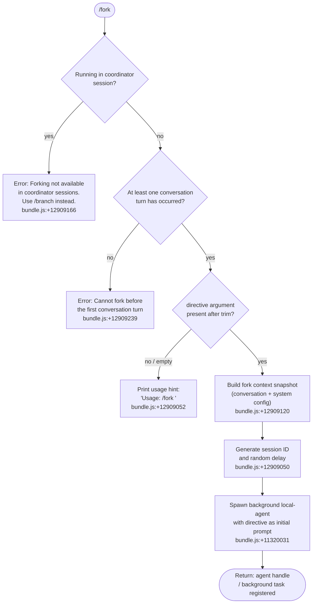

# `/fork`

> Analysis basis: CC v2.1.179 bundle.js (AST extraction + Claude interpretation)
> Minimum version: v2.1.179

---

## Overview

The `/fork` command spawns a background agent that inherits a full snapshot of the current conversation, then independently executes a user-supplied directive. The parent session continues uninterrupted while the forked agent runs asynchronously as a local sub-agent process. Forking is blocked inside coordinator sessions and before the first conversation turn.

---

## Registration

| Field | Value |
|---|---|
| type | `local-jsx` |
| name | `fork` |
| description | Spawn a background agent that inherits the full conversation |
| argumentHint | `<directive>` |
| module_id | `KPK` |
| load_inline | `true` |
| loc_byte | `12909469` |
| loc_byte_end | `12909672` |
| loc_line | `8895` |
| arbor_handler.name | `y15` |
| arbor_handler.fqn | `claude-2.1.179::y15` |
| arbor_handler.kind | `AsyncFunction` |
| arbor_handler.resolution_path | `module_id` |
| arbor_handler.n_hits | `0` |

Analysis basis: CC v2.1.179 bundle.js:+12909469

---

## Input Branching

Four distinct input-validation paths exist before the agent is actually launched, requiring a Mermaid flowchart.



---

## Behavioral Spec

### Top-level handler (`y15`)

```
async function forkCommandHandler(args, context):
    directive = args.trim()                    // bundle.js:+12909028

    if context.isCoordinatorMode():
        print("Forking is not available in coordinator sessions. Use /branch instead.")
        return                                 // bundle.js:+12909166

    if not context.hasAnyConversationTurn():
        print("Cannot fork before the first conversation turn")
        return                                 // bundle.js:+12909239

    if directive is empty:
        print("Usage: /fork <directive>")      // bundle.js:+12909052
        return

    forkContext = buildForkContext(context)    // bundle.js:+12909120
    sessionId   = generateSessionId(context)  // bundle.js:+12909050
    spawnBackgroundAgent(directive, forkContext, sessionId)  // bundle.js:+11320031
```

Analysis basis: CC v2.1.179 bundle.js:+12909028

---

### Fork context builder (`TOA`)

Constructs the full state snapshot passed to the child agent.

```
function buildForkContext(context):
    baseConfig  = loadBaseConfig()             // lW  bundle.js:+12909161
    systemParts = buildSystemPrompt(context)   // CH  bundle.js:+11320028
    appState    = getAppState()                // upL bundle.js:+11320135
    replContexts = getReplContexts()           // bundle.js:+11320262
    transcript  = sliceTranscript(context, limit=50)  // bundle.js:+11320410
    sessionId   = getOrCreateSessionId()      // xM  bundle.js:+11320477
    agentHandle = registerAgent(sessionId)    // l46 bundle.js:+11320494

    // Tag the fork with telemetry signals
    emit("subagent_launch")                   // bundle.js:+11320031
    emit("subagent_fork_coordinator_mode")    // bundle.js:+11320049

    if transcript is empty or missing directive:
        emit("subagent_fork_prompt_missing")  // bundle.js:+11320173

    return {
        system:    systemParts,               // "system" bundle.js:+12909092
        messages:  transcript,
        replContexts,
        appState,
        agentHandle,
        agentType: "fork",                    // bundle.js:+11320222
    }
```

Analysis basis: CC v2.1.179 bundle.js:+11320016

---

### Session ID generator (`H` / `Math.random` path)

```
function generateSessionId():
    r = Math.random()                         // bundle.js:+14230697
    // Combines random value with a timed backoff before registering
    setTimeout(callback, delay=2)             // bundle.js:+14230734
    return derivedId
```

Analysis basis: CC v2.1.179 bundle.js:+14230697

---

### Background agent spawner (`l46` → `ZUH` → `A0`)

Creates the isolated subprocess environment for the forked agent.

```
function spawnLocalAgent(directive, forkContext, sessionId):
    // Create symlinked workspace directory
    workdir = createSymlinkWorkdir()          // ZUH / zGA bundle.js:+13709148
    // Open transcript log files (JSONL)
    transcript = openTranscriptFile()         // Tq6 bundle.js:+13709403
    // Compose process metadata
    agentMeta = {
        type:    "local_agent",               // bundle.js:+10484026
        status:  "pending",                   // bundle.js:+13710198
        purpose: "general-purpose",           // bundle.js:+10484209
    }
    agentProcess = startChildProcess(directive, forkContext, agentMeta)
    // Register agent in global task registry
    registry.register(agentProcess)           // bundle.js:+10484401
    return agentProcess
```

Transcript files use the `.jsonl` extension (bundle.js:+13612108) and metadata is stored in `.meta.json` files (bundle.js:+13611952). Context references are stored under the key `"fork-context-ref"` (bundle.js:+13629416).

Analysis basis: CC v2.1.179 bundle.js:+10483979

---

### Transcript slice for fork context (`TOA` / `WR` path)

```
function sliceTranscript(context, limit):
    raw = context.getTranscript()
    // Truncate at `limit` messages (50 by default)
    sliced = raw.slice(0, limit)              // bundle.js:+11320410
    // Sanitize random chars: uses crypto.randomBytes(8,"hex")
    sanitized = sanitize(sliced)              // WR  bundle.js:+11320437
    return sanitized
```

Constants observed: slice limit 50 (bundle.js:+11320407), 49 (bundle.js:+11320420), random-bytes length 8 hex (bundle.js:+4311105 / 4311117).

Analysis basis: CC v2.1.179 bundle.js:+11320410

---

### Main agent execution loop (`Lu` / `FRL`)

The child agent runs the full REPL loop (`Lu`) which delegates to the primary query engine (`FRL`). Notable behavioural constraints found in literals:

- Agent threads always use absolute file paths; cwd is reset between bash calls (bundle.js:+13858589).
- The agent is tagged `"subagent"` / `"spawn"` (bundle.js:+11320952 / 11321017) and starts in mode `"fork"` (bundle.js:+11320222) with resume mode `"resume"` (bundle.js:+11320341).
- A stall watchdog fires at 600 000 ms (10 minutes) of inactivity (bundle.js:+8864654); telemetry `tengu_async_agent_stall_timeout` is emitted on expiry.
- Progress is reported via `"subagent_complete"` / `"subagent_stall_timeout"` events (bundle.js:+8865853 / 8865873).

Analysis basis: CC v2.1.179 bundle.js:+9148464

---

### Guard: coordinator-mode detection

```
function isCoordinatorMode(context):
    // Checks appState for coordinator flag
    // Literal "subagent_fork_coordinator_mode" used in telemetry path
    return context.mode === "coordinator"
```

When true, the command prints the literal `"Forking is not available in coordinator sessions. Use /branch instead."` (bundle.js:+12909166) and returns immediately without spawning anything.

Analysis basis: CC v2.1.179 bundle.js:+12909166

---

## State & Side Effects

| Item | Detail |
|---|---|
| Telemetry — launch | `tengu_feature_ok` / `tengu_feature_bad` (bundle.js:+1020479 / 1020546) |
| Telemetry — spawn | `subagent_launch` string used as event tag (bundle.js:+11320031); `subagent_fork_coordinator_mode` (bundle.js:+11320049) |
| Telemetry — missing prompt | `subagent_fork_prompt_missing` (bundle.js:+11320173) |
| Telemetry — agent lifecycle | `tengu_async_agent_stall_timeout`, `tengu_agent_tool_completed`, `tengu_agent_tool_terminated`, `tengu_forked_agent_default_turns_exceeded` |
| Telemetry — agent end | `subagent_completed`, `subagent_end`, `subagent_async_errored` |
| Telemetry — task registry | `task_local_agent` (bundle.js:+10483758), `task_local_agent_failed` (bundle.js:+10483777) |
| appState changes | Child agent writes its own appState copy; parent appState is read-only during snapshot (`upL` / `B_` bundle.js:+11321776) |
| Filesystem | Symlinked work directory created under `subagents/` (bundle.js:+5201628); transcript JSONL and `.meta.json` files written |
| Process | `process.exit` called on hard failure path (`p1` bundle.js:+13487017) |
| Stall watchdog | `setTimeout` 600 000 ms; `clearTimeout` on completion |
| Hook registration | `registry.register` for the local agent task; `M.register` (bundle.js:+10484401) |
| Sound | <!-- TODO: not found in depth-2 traversal; needs --depth 4 --> |

---

## Version History

| Version | Change |
|---|---|
| v2.1.179 | Initial analysis |

---

## Common Mistakes

1. **Running `/fork` before any conversation turn** — The command validates that at least one turn has completed. Invoking it at a fresh session returns the error `"Cannot fork before the first conversation turn"` and does nothing.
2. **Running `/fork` inside a coordinator session** — Coordinator mode explicitly blocks forking. Use `/branch` in that context instead.
3. **Omitting the directive argument** — Calling `/fork` with no argument (or only whitespace) prints the usage hint and exits without spawning an agent.
4. **Expecting synchronous results** — The forked agent runs fully in the background. Output is delivered asynchronously through the task-notification system (`"task-notification"` bundle.js:+10480848), not as an inline response.
5. **Assuming the fork shares cwd state** — The child agent's cwd is reset between bash calls; only absolute paths are reliable in forked agents (bundle.js:+13858589).
6. **Expecting unlimited turns** — The forked agent has a default-turns cap; `tengu_forked_agent_default_turns_exceeded` fires when it is reached (bundle.js:+10806870).

---

## Appendix — Identifier Mapping

> For bundle debugging only. Identifiers change across versions.

| Identifier | Role |
|---|---|
| `y15` | Top-level `/fork` command handler (AsyncFunction) |
| `TOA` | Fork-context builder — assembles system prompt, transcript slice, app state |
| `lW` | Base-config loader |
| `CH` | System-prompt builder |
| `upL` | App-state snapshot collector |
| `B_` | App-state reader / last-message finder |
| `MU8` | Message transformer (allowed_tools path) |
| `$U8` | Message transformer (disallowed_tools path) |
| `wx` | Permission-mode resolver |
| `QE` | Full system-prompt assembler (calls many sub-builders) |
| `lU` | Child REPL session initialiser |
| `Lu` | Main agent execution loop (REPL host) |
| `FRL` | Primary query/streaming engine driving the forked agent |
| `l46` | Background agent spawner entry point |
| `ZUH` | Workspace directory + symlink setup |
| `A0` | Agent-state initialiser (sets "pending" status) |
| `cn8` | Pending-task tracker (add / finally / delete) |
| `zGA` | Directory creator for agent workspace |
| `A$` | Path joiner for agent output files |
| `Tq6` | Transcript file opener |
| `WR` | Transcript sanitiser (randomBytes hex) |
| `xM` | AsyncLocalStorage session-ID getter |
| `omH` | Agent turn executor / streaming event handler |
| `gS8` | Agent-update dispatcher |
| `BLA` | Batch-update helper |
| `FLA` | Final-state recorder |
| `rmH` | Agent registry updater |
| `u46` | Task-state mutator (update / delete / Date.now) |
| `pUH` | REPL tool-call dispatcher |
| `uEq` | Agent-query planner |
| `lT` | Streaming event processor |
| `sU` | Sub-agent lifecycle coordinator |
| `Dp8` | Sub-agent cleanup / exit handler |
| `mK6` | Metadata file writer (.meta.json / .jsonl) |
| `Pf` | Fork-context-ref resolver |
| `lKH` | Fork-context loader |
| `qBH` | Context filter / slicing helper |
| `jC8` | Session-state restorer |
| `p1` | Hard-failure handler (calls `process.exit`) |
| `IFH` | CLI-error emitter ("cli_error" literal) |
| `bX` | Error formatter for exit path |
| `H` | Random-delay generator (Math.random + setTimeout) |
| `TOA` | (See above — fork-context builder) |
| `upL` | (See above — app-state collector) |
| `uu8` | REPL-context message injector |
| `HZL` | Assistant-message filter |
| `_ZL` | Tool-result filter |
| `eTL` | Code-block extractor from tool results |
| `AZL` | Multi-block aggregator |
| `F8K` | Directive trimmer for log annotation |
| `S1` | Stdout/output writer |
| `n5` | Node stream helper |
| `QHH` | System-prompt final assembler |
| `HE` | Model-config resolver |
| `Zn` | Context-window config |
| `TK` | Token-budget calculator |
| `D1` | Model-alias resolver (fable / sonnet / haiku / opus) |
| `o0` | Output-style selector |
| `kq8` | ARN prefix checker |
| `HWf` | ARN path parser |
| `Dz` | Provider-prefix router (bedrock / mantle / foundry / vertex) |
| `OX6` | Provider string normaliser |
| `tiH` | Model-string sanitiser |
| `BTq` | Model-list inclusion checker |
| `UTq` | Model-upgrade resolver |
| `sF` | Fast-mode toggle handler |
| `Dw` | Bedrock provider helper |
| `tF` | AsyncLocalStorage run-context setter |
| `dm` | Store-context getter |
| `O2` | Secondary store getter |
| `YVq` | Safety-classifier dispatcher |
| `GC6` | Tool-classifier runner |
| `SAA` | Handoff classifier coordinator |
| `xVq` | Classifier-result consumer |
| `VTH` | Agent-state version tracker |
| `CEq` | Session-cleanup orchestrator |
| `LOH` | Cleanup-task runner |
| `OOH` | Coordinator output formatter |
| `mOL` | Slice-and-index helper for coordinator messages |
| `SVq` | Subagent-output router |
| `tHH` | Transcript-diff merger |
| `hAA` | Visible-message filter |
| `kAA` | Active-tool-call tracker |
| `NAA` | Tool-call-name normaliser |
| `QT` | Tool-result wrapper |
| `T3` | Markdown token parser |
| `TT` | Heading normaliser |
| `WkH` | Heading-ID generator |
| `hS8` | Hook-entry checker |
| `h6` | Hook runner |
| `MY` | Skill-listing collector |
| `vuL` | Skill-page builder |
| `NuL` | Skill-description renderer |
| `PC8` | Permission-check dispatcher |
| `uK6` | Tool-progress emitter |
| `Zf6` | Tool-list validator |
| `y6H` | Tool-name trimmer |
| `kOH` | Sub-agent tool executor |
| `Rh` | Sub-agent result formatter |
| `ykK` | Tool-registry enumerator |
| `IkK` | Tool-input mapper |
| `I7` | Tool-definition loader |
| `F2` | Full tool-execution engine |
| `Pb6` | Tool-execution entry wrapper |
| `FH` | Async-tool-result collector |
| `OqH` | MCP OAuth flow manager |
| `aH` | Agent-message handler |
| `r86` | Concurrent-tool-call limiter |
| `A6` | Promise-race helper |
| `w9` | UUID + timestamp generator |
| `SD` | Permission-set evaluator |
| `e5H` | Nof-set membership checker |
| `bEq` | Tool-call dedup tracker |
| `lDL` | Session-bootstrap loader |
| `_U` | MCP-config source selector (enterprise/project/local) |
| `ceH` | Config-merge helper |
| `HU` | Config-entry accumulator |
| `pH` | Bridge-shutdown handler |
| `hOH` | Host-capability checker |
| `_h` | Standard-capability tester |
| `_r` | Lowercase-match checker |
| `UZH` | Deferred-tool-pool guard |
| `$3A` | Tool-pool state machine |
| `XC8` | MCP-tool refresh coordinator |
| `lm6` | MCP-tool filter (bundled) |
| `cm6` | MCP-tool dedup filter |
| `Vo` | MCP-tool set builder |
| `F9H` | Tool-name existence checker |
| `Ctq` | Tool-cache manager |
| `cU_` | Tool-ranking/scoring engine |
| `ypH` | Backoff calculator |
| `$2` | Tool-use classifier |
| `w9A` | Fork-context loader wrapper |
| `lKH` | Fork-context file reader |
| `qBH` | Context-slice filter |
| `mK6` | Metadata writer |
| `Mt9` | OpenTelemetry span manager |
| `CR` | OTel span active-check |
| `sbH` | Span-attribute setter |
| `V0H` | AsyncLocalStorage span setter |
| `$t9` | Span finaliser |
| `abH` | Span status setter |
| `v0H` | Span context restorer |
| `z9A` | Session-state serialiser |
| `kEq` | Session-cleanup entry |
| `nDL` | Post-session cleanup handler |
| `hEq` | Hook-event emitter |
| `dV6` | Diagnostic-variable emitter |
| `HGH` | Debug-header emitter |
| `IH` | Inline-handler caller |
| `G_` | OT output writer |
| `OT` | Low-level output target |
| `n36` | Config-value reader |
| `f6` | String formatter |
| `b0` | Binary serialiser |
| `Xq` | Encoder helper |
| `FGA` | Feature-flag getter |
| `x6` | Application-inference-profile checker |
| `lA` | Header-inclusion helper |
| `iU8` | Plugin-tool injector |
| `t_` | Buffer helper |
| `zsH` | Pewter-owl tool guard |
| `BG` | Brief-mode gate |
| `iO5` | Output-style builder |
| `rO5` | Irreversible-action confirmor |
| `oO5` | Task-continuity builder |
| `n48` | Fable-identity prefix checker |
| `aF` | Tool-param-JSON formatter |
| `e59` | Context-sanitiser |
| `At` | Text appender |
| `Y6` | Telemetry event emitter (silent_harbor etc.) |
| `cGA` | Memory-prompt builder |
| `hz5` | Memory-section wrapper |
| `kd` | Buffer-flush trigger |
| `Oz5` | Schedule/routine injector |
| `KT6` | Memory-file loader |
| `Wz5` | Static-env-info builder |
| `Pz5` | Worktree-env-info builder |
| `_z5` | Language-instruction injector |
| `Az5` | Output-style-instruction builder |
| `Tz5` | Background-session marker |
| `WC8` | Scratchpad-context builder |
| `Ez5` | Brief-enabled guard |
| `Nz5` | Flag-settings injector |
| `Yz5` | Growthbook-env injector |
| `eO5` | Heron-brook prompt builder |
| `Hz5` | Amber-sextant prompt builder |
| `UFq` | Additional-context fetcher |
| `wz5` | Autonomy-append injector |
| `qz5` | Act-dont-rederive injector |
| `Kz5` | Context-management injector |
| `fz5` | Verified-vs-assumed injector |
| `Lz5` | Memory-section appender |
| `Mz5` | SDK-prompt injector |
| `zz5` | Reproduce-verify injector |
| `Y39` | Tool-hints appender |
| `UXH` | First-party / AWS provider tagger |
| `OyK` | System-message assembler |