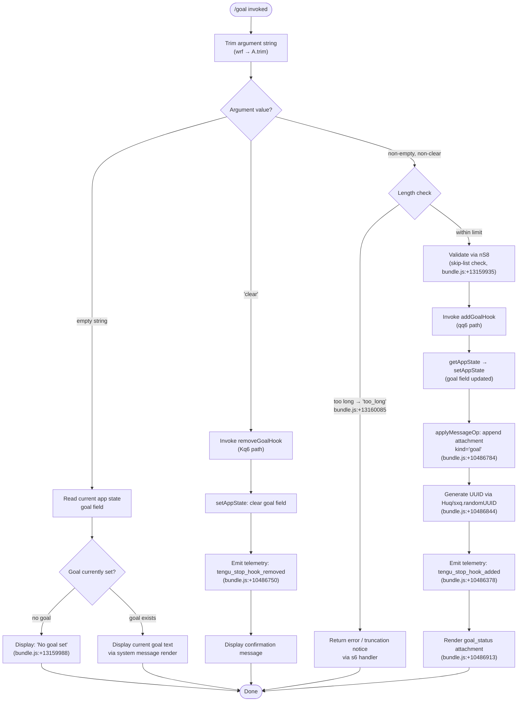

# `/goal`

> Analysis basis: CC v2.1.170 bundle.js (AST extraction + Claude interpretation)
> Minimum version: v2.1.170

---

## Overview

The `/goal` command sets a persistent goal condition that Claude evaluates before each stopping point in a session. When a goal is active, Claude checks whether the stated condition has been met before concluding work; the goal can be cleared explicitly with the `clear` sub-command. Internally, the command registers or removes a **stop hook** on the session's app state and injects the goal as a system-level message attachment.

---

## Registration

| Field | Value |
|---|---|
| type | `local-jsx` |
| name | `goal` |
| description | Set a goal Claude checks before stopping |
| argumentHint | `[<condition> \| clear]` |
| immediate | `true` |
| module_id | `EYK` |
| load_inline | `true` |
| loc_byte | `13161234` |
| loc_byte_end | `13161420` |
| loc_line | `9675` |
| arbor_handler.name | `wrf` |
| arbor_handler.fqn | `claude-2.1.170::wrf` |
| arbor_handler.kind | `AsyncFunction` |
| arbor_handler.resolution_path | `module_id` |
| arbor_handler.n_hits | `0` |

Analysis basis: CC v2.1.170 bundle.js:+13161234

---

## Input Branching

The handler resolves four distinct paths based on the trimmed argument value and whether a goal is already active — a Mermaid flowchart is required.



---

## Behavioral Spec

### Entry Point — `wrf` (goalCommandHandler)

The Arbor-resolved handler `wrf` is an `AsyncFunction` reached via `module_id` resolution through module `EYK`.

```
async function goalCommandHandler(context, argument):
    trimmedArg = argument.trim()                    // A.trim — bundle.js:+13159829

    if trimmedArg == "" or trimmedArg == undefined:
        currentGoal = readGoalFromAppState(context)
        if currentGoal is null or empty:
            displayMessage("No goal set")           // bundle.js:+13159988
        else:
            displayCurrentGoal(context, currentGoal)
        return

    if trimmedArg.toLowerCase() == "clear":         // f.toLowerCase — bundle.js:+16556490
        removeGoalHook(context)                     // Kq6 — bundle.js:+13159963
        return

    // Non-empty, non-clear: set new goal
    skipCheckResult = validateAgainstSkipList(trimmedArg)  // nS8 — bundle.js:+13159949
    if skipCheckResult == "skip":                   // bundle.js:+13159935
        return early

    // Jitter delay before registering hook
    applyJitter(context)                            // H — bundle.js:+13159917
                                                    //   uses Math.random * 2 — bundle.js:+13939350/13939352
                                                    //   and setTimeout — bundle.js:+13939389

    setGoalResult = setGoalHook(context, trimmedArg)  // qq6 — bundle.js:+13160197
    reportGoalSet(context, setGoalResult)           // s6 — bundle.js:+13160071
                                                    //   emits goal_set — bundle.js:+13160074
    renderGoalStatus(context)                       // iS8 — bundle.js:+13160310
```

Analysis basis: CC v2.1.170 bundle.js:+13159829

---

### Sub-feature: Skip-List Validation — `nS8` (validateAgainstSkipList)

```
function validateAgainstSkipList(input):
    normalized = input.toLowerCase()               // H.toLowerCase — bundle.js:+10485298
    if skipListSet.has(normalized):                // cwf.has — bundle.js:+10485290
        return "skip"                              // bundle.js:+13159935
    return null
```

If the normalized goal text is found in the internal skip-list set (`cwf`), the handler exits early without registering a hook.

Analysis basis: CC v2.1.170 bundle.js:+13159949

---

### Sub-feature: Jitter Delay — `H` (applyJitter)

```
function applyJitter():
    delay = Math.random() * 2                      // bundle.js:+13939350/13939352
    setTimeout(callback, delay)                    // bundle.js:+13939389
```

A small random delay (scaled by the constant `2`) is applied before hook registration to avoid thundering-herd behavior on simultaneous goal operations.

Analysis basis: CC v2.1.170 bundle.js:+13159917

---

### Sub-feature: Add Goal Hook — `qq6` (addGoalHook)

```
async function addGoalHook(context, goalText):
    currentState = context.getAppState()           // _.getAppState — bundle.js:+10486077
    timestamp = Date.now()                         // bundle.js:+10486241
    outputTokenMetric = computeOutputTokens(QD)    // bundle.js:+10486266

    // Build goal attachment record
    attachmentId = generateUUID()                  // Huq → sxq.randomUUID — bundle.js:+10486844
    attachment = {
        kind: "goal",                              // bundle.js:+10486784
        type: "attachment",                        // bundle.js:+10486826
        content: goalText
    }

    // Validate and format prompt entry
    validateHooksGate(context)                     // hooks_gate — bundle.js:+10485888
    validateTrustGate(context)                     // trust_gate — bundle.js:+10485942
    buildPromptEntries(yAA, eC, S_H)              // bundle.js:+10485992
    buildStopEntry(Aq6, $0H)                       // "Stop" — bundle.js:+10485699

    newState = {
        ...currentState,
        goal: goalText
    }

    context.setAppState(newState)                  // _.setAppState — bundle.js:+10486279
    context.applyMessageOp({                       // _.applyMessageOp — bundle.js:+10486321
        op: "append",                              // bundle.js:+10486716
        attachment: attachment
    })

    emit("tengu_stop_hook_added")                  // bundle.js:+10486378
    renderGoalStatus(context, "goal_status")       // bundle.js:+10486913
    invoke(d)                                      // bundle.js:+10486376
    invoke(f6 → ff6)                               // bundle.js:+10486429
```

Analysis basis: CC v2.1.170 bundle.js:+10486077

---

### Sub-feature: Remove Goal Hook — `Kq6` (removeGoalHook)

```
async function removeGoalHook(context):
    currentState = context.getAppState()           // H.getAppState — bundle.js:+10486495
    buildFormatEntries(v6 → xZ)                    // bundle.js:+10486484
    buildStopEntry(Aq6 → $0H)                      // bundle.js:+10486491
                                                   //   K.set — bundle.js:+9204446
                                                   //   V2q → H.map — bundle.js:+9204215

    newState = {
        ...currentState,
        goal: null
    }

    context.setAppState(newState)                  // H.setAppState — bundle.js:+10486624
    context.applyMessageOp({                       // H.applyMessageOp — bundle.js:+10486693
        op: "append",                              // bundle.js:+10486716
        attachment: { kind: "goal", content: null }
    })

    attachmentId = generateUUID()                  // Huq — bundle.js:+10486735
    emit("tengu_stop_hook_removed")                // bundle.js:+10486750
    invoke(d)                                      // bundle.js:+10486748
    invoke(f6 → ff6)                               // bundle.js:+10486781
```

Analysis basis: CC v2.1.170 bundle.js:+10486495

---

### Sub-feature: Goal Status Reporting — `s6` (reportGoalSet)

```
function reportGoalSet(context, result):
    invoke(d)                                      // bundle.js:+1014346
    if success:
        emit("tengu_feature_ok")                   // bundle.js:+1014205
        invoke(K6 → ff6)                           // bundle.js:+1014387/3628
    else:
        emit("tengu_feature_sad")                  // bundle.js:+1014348

    // Emit "goal_set" status marker
    emitGoalSet("goal_set")                        // bundle.js:+13160074
    // Check for too_long condition
    if result == "too_long":                       // bundle.js:+13160085
        reportTooLong()
```

Analysis basis: CC v2.1.170 bundle.js:+13160071

---

### Sub-feature: Prompt / Hook Gate Validation — `yAA` (buildPromptAndGates)

```
function buildPromptAndGates(context):
    // Evaluate policy settings
    policySettings = fetchPolicySettings(eC → y8) // "policySettings" — bundle.js:+3334877

    // hooks_gate: determines whether stop hooks are permitted
    hooksGateOk = evaluateHooksGate(S_H)          // "hooks_gate" — bundle.js:+10485888
                                                   //   y8 — bundle.js:+3334718
                                                   //   FA — bundle.js:+3334784

    // trust_gate: determines trust level for the goal
    trustGateOk = evaluateTrustGate(F_)            // "trust_gate" — bundle.js:+10485942

    // Construct prompt entry of kind "prompt"
    buildPromptEntry(If → xSL)                    // "prompt" — bundle.js:+10485806
                                                   //   bundle.js:+10485913

    // Assemble stop entries
    buildAndPushStopEntry(Aq6)                     // A.push — bundle.js:+10485815
```

Analysis basis: CC v2.1.170 bundle.js:+10485992

---

### Sub-feature: Session Close Handling — `f` (sessionCloseHandler)

```
function sessionCloseHandler():
    // On session close, flush pending items
    closeA()                                       // A.close — bundle.js:+16541762
    closeQ()                                       // q.close — bundle.js:+16541772

    // Register task in active-task set via L
    addTask(taskSet, task)                         // L → q.add — bundle.js:+16535711
    task.finally(() => taskSet.delete(task))       // L → q.delete — bundle.js:+16535734

    // Dispatch exit via Y1 if fatal
    Y1:
        callJpH()                                  // JpH — bundle.js:+13231108
        callAj()                                   // aj  — bundle.js:+13231115
        process.exit(1)                            // "cli_error" path — bundle.js:+13231118/13231131/13231144
```

Analysis basis: CC v2.1.170 bundle.js:+16541762

---

## State & Side Effects

| Item | Detail |
|---|---|
| Telemetry: `tengu_stop_hook_added` | Fired when a new goal is successfully registered as a stop hook (bundle.js:+10486378) |
| Telemetry: `tengu_stop_hook_removed` | Fired when the goal is cleared and the stop hook is deregistered (bundle.js:+10486750) |
| Telemetry: `tengu_feature_ok` | Fired on successful goal-set operation completion (bundle.js:+1014205) |
| Telemetry: `tengu_feature_sad` | Fired when goal-set operation encounters an error (bundle.js:+1014348) |
| `appState.goal` write | Set to the trimmed goal string on `/goal <text>` or `null` on `/goal clear` (bundle.js:+10486279 / +10486624) |
| `applyMessageOp` | Appends a goal attachment of kind `"goal"` / type `"attachment"` to the message stream (bundle.js:+10486321 / +10486693) |
| Stop hook registration | `qq6` registers a stop hook entry; `Kq6` removes it. The hook causes Claude to evaluate the goal condition before each stopping point. |
| UUID generation | Each goal attachment is assigned a UUID via `sxq.randomUUID` (bundle.js:+10486844) |
| Jitter delay | A `Math.random() * 2` jitter via `setTimeout` is applied during hook registration (bundle.js:+13939350) |
| Policy gate checks | `hooks_gate` (bundle.js:+10485888) and `trust_gate` (bundle.js:+10485942) are evaluated before adding a stop hook |
| `goal_status` render | A `goal_status` attachment is rendered in the UI after successful registration (bundle.js:+10486913) |
| `goal_set` status marker | Emitted as a status string after setting a goal (bundle.js:+13160074) |
| `too_long` error | Returned when the goal condition text exceeds the permitted length (bundle.js:+13160085) |
| Literal: `"No goal set"` | Display string shown when `/goal` is invoked with no argument and no goal is active (bundle.js:+13159988) |
| Literal: `"system"` | Goal is injected as a system-level message (bundle.js:+13160032) |
| Literal: `1024` | Internal buffer/queue constant in the session close pathway (bundle.js:+16436118) |
| Literal: `40` | Column-padding width used in status table formatting (bundle.js:+16556564) |
| Sound | <!-- TODO: not found in depth-2 traversal; needs --depth 4 --> |

---

## Version History

| Version | Change |
|---|---|
| v2.1.170 | Initial analysis |

---

## Common Mistakes

1. **Passing `clear` as a goal condition** — The string `"clear"` (case-insensitive) is reserved as the sub-command to remove the current goal. Passing it as a goal condition will remove the active goal rather than setting a new one.
2. **Exceeding goal text length** — If the condition string is too long the handler returns a `too_long` error (bundle.js:+13160085) and the goal is **not** registered. Keep conditions concise.
3. **Expecting immediate enforcement** — Because of the jitter delay (`Math.random() * 2` via `setTimeout`), the stop hook may not be registered synchronously; do not assume the goal is active the instant the command returns.
4. **Omitting the argument** — Running `/goal` with no argument displays the current goal (or "No goal set") but does **not** prompt for input; there is no interactive entry mode.
5. **Assuming the goal persists across sessions** — The goal is stored in `appState` and attached via `applyMessageOp`; if the session is restarted the stop hook must be re-registered.
6. **Ignoring policy gates** — Both `hooks_gate` and `trust_gate` are evaluated before a goal can be set. In environments where hooks are disabled by policy, `/goal` will not register a stop hook regardless of the argument supplied.

---

## Appendix — Identifier Mapping

> For bundle debugging only. Identifiers change across versions.

| Identifier | Role |
|---|---|
| `wrf` | Main goal command async handler (`goalCommandHandler`) — Arbor-resolved entry point |
| `A` | Trimmed argument string / generic accumulator variable (context-dependent) |
| `f` | Session / stream close handler (`sessionCloseHandler`) |
| `q` | Async task queue used by session close pathway |
| `Y1` | Fatal exit dispatcher (calls `JpH`, `aj`, then `process.exit`) |
| `L` | Task registration helper (adds to task set, registers `finally` cleanup) |
| `H` | Jitter delay utility (`Math.random * 2` + `setTimeout`) |
| `nS8` | Skip-list validation function (`validateAgainstSkipList`) |
| `Kq6` | Remove-goal-hook function (`removeGoalHook`) |
| `v6` | Format-entry builder (calls `xZ`) |
| `xZ` | Low-level format resolver |
| `Aq6` | Stop-entry builder (calls `$0H`, pushes to accumulator) |
| `$0H` | Stop-entry setter (`K.set`, then `V2q`) |
| `K` | Column-padded status map builder (`L.map`, `f.padEnd`) |
| `V2q` | Output-token map builder (`H.map`) |
| `Huq` | UUID generator wrapper (delegates to `sxq.randomUUID`) |
| `d` | Generic side-effect / notification dispatcher |
| `f6` | Post-operation finalizer (calls `ff6`) |
| `ff6` | Low-level finalization primitive |
| `s6` | Goal-set status reporter (`reportGoalSet`; emits `goal_set` / `too_long`) |
| `K6` | Success-path reporter (calls `ff6`) |
| `qq6` | Add-goal-hook function (`addGoalHook`) |
| `yAA` | Prompt and gate builder (`buildPromptAndGates`) |
| `eC` | Policy-settings fetcher (calls `y8`) |
| `y8` | Core policy evaluator (calls `Ro6`, `XB`) |
| `S_H` | Hooks-gate evaluator (calls `y8`, `FA`) |
| `F_` | Trust-gate evaluator |
| `If` | Prompt-entry constructor (calls `xSL`) |
| `xSL` | Prompt-entry assembler (calls `_6`, `CBH`, `X9`, `h6`, `vJH`, `fc`, `C6`, `$w.resolve`) |
| `_` | App-state accessor object (provides `getAppState`, `setAppState`, `applyMessageOp`) |
| `QD` | Output-token metric calculator (uses `TBH`, `Object.values`) |
| `SH` | Alternative status reporter (calls `d`, `K6`) |
| `iS8` | Final goal-status renderer (called after hook registration completes) |

---

Note: index built via Arbor fallback; some signals (telemetry, literals) may be missing — see arbor-fallback.js.