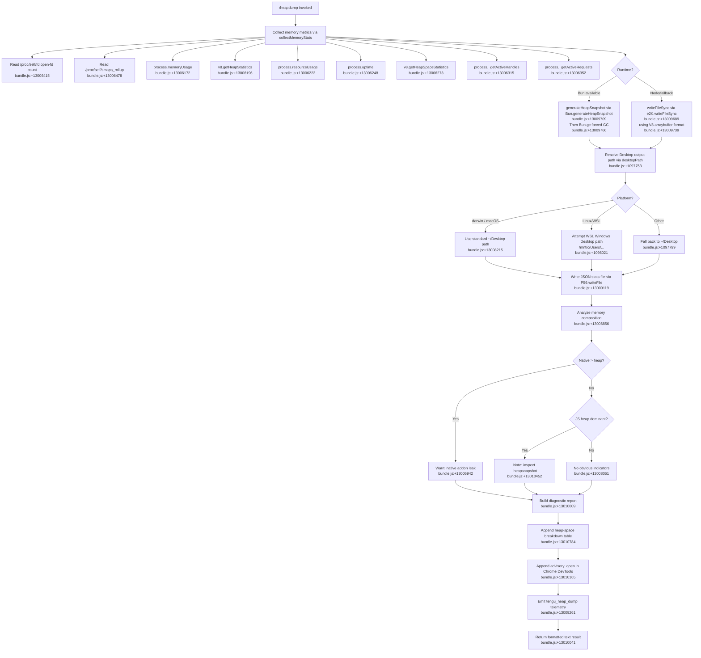

# `/heapdump`

> Analysis basis: CC v2.1.179 bundle.js (AST extraction + Claude interpretation)
> Minimum version: v2.1.179

---

## Overview

`/heapdump` is a hidden developer diagnostic command that captures a comprehensive snapshot of the Claude Code process's memory state and writes it to `~/Desktop`. It collects JS heap statistics, native memory metrics, open file descriptors, Linux smaps data, and generates a `.heapsnapshot` file (using Bun's native snapshot API where available, or V8's serialization otherwise), then prints a formatted diagnostic report with actionable leak indicators.

---

## Registration

| Field | Value |
|---|---|
| type | `local` |
| name | `heapdump` |
| description | `Dump the JS heap to ~/Desktop` |
| supportsNonInteractive | `true` |
| isHidden | `true` |
| module_id | `AWK` |
| load_inline | `true` |
| loc_byte | `13011140` |
| loc_byte_end | `13011568` |
| loc_line | `9017` |
| arbor_handler.name | `a95` |
| arbor_handler.fqn | `claude-2.1.179::a95` |
| arbor_handler.kind | `AsyncFunction` |
| arbor_handler.resolution_path | `module_id` |
| arbor_handler.n_hits | `0` |

Analysis basis: CC v2.1.179 bundle.js:+13011140

---

## Input Branching

The command has 3+ distinct execution branches based on runtime environment (Bun vs Node), platform (macOS/Linux), and memory composition analysis. A Mermaid flowchart is used.



---

## Behavioral Spec

### Top-Level Handler (`heapDumpHandler` / `a95`)

```
async function heapDumpHandler(commandArgs):
    lines = []
    
    # Phase 1: collect memory diagnostics
    report = await collectAndWriteHeapDump()   // calls dumpOrchestrator (LPA)
    
    lines.push(report)
    lines.push("Open the .heapsnapshot in Chrome DevTools → Memory → Load to inspect retainers.")
    // bundle.js:+13010165
    
    # Phase 2: format summary section
    summary = buildSummarySection()            // calls summaryFormatter (s95)
    lines.push(summary)
    
    return { type: "text", content: lines.join("\n") }
    // bundle.js:+13010041, +13010277
```

Analysis basis: CC v2.1.179 bundle.js:+13010009, +13010128, +13010155, +13010277

---

### Dump Orchestrator (`dumpOrchestrator` / `LPA`)

```
async function dumpOrchestrator():
    # Step 1: spawn subprocess for heap capture (uses run-command wrapper)
    subprocessResult = await runCommand("manual", 0)
    // literal "manual" at bundle.js:+13008647, literal 0 at bundle.js:+13008658

    # Step 2: collect comprehensive memory statistics
    stats = await collectMemoryStats()         // heapStatsCollector (HWK)

    # Step 3: resolve the Desktop output path (cross-platform)
    outputDir = await resolveDesktopPath()     // desktopPathResolver (YoA)

    # Step 4: write JSON stats companion file
    statsFilePath = path.join(outputDir, <timestamped_name>)
    // fPA.join at bundle.js:+13009076
    await fs.writeFile(statsFilePath, JSON.stringify(stats))
    // bundle.js:+13009119, +13009135

    # Step 5: generate the actual heap snapshot file
    await generateHeapSnapshotFile(outputDir)  // snapshotWriter (o95)
    // bundle.js:+13009210

    # Step 6: compose and return multi-line diagnostic text
    result = buildDiagnosticOutput(stats, statsFilePath)
    // uses errorFormatter (WA), logLine (mL), resultFormatter (SH)
    // bundle.js:+13009430, +13009439, +13009517

    return result
```

Analysis basis: CC v2.1.179 bundle.js:+13008671, +13008684, +13008730, +13008772, +13008967, +13008979

---

### Memory Statistics Collector (`heapStatsCollector` / `HWK`)

```
async function collectMemoryStats():
    data = {}

    # Node/Bun built-in metrics
    data.memoryUsage      = process.memoryUsage()           // bundle.js:+13006172
    data.heapStatistics   = v8.getHeapStatistics()          // bundle.js:+13006196
    data.resourceUsage    = process.resourceUsage()         // bundle.js:+13006222
    data.uptime           = process.uptime()                // bundle.js:+13006248
    data.heapSpaceStats   = v8.getHeapSpaceStatistics()     // bundle.js:+13006273
    data.activeHandles    = process._getActiveHandles()     // bundle.js:+13006315
    data.activeRequests   = process._getActiveRequests()    // bundle.js:+13006352

    # Linux-specific: open file descriptors
    try:
        fdEntries = await fs.readdir("/proc/self/fd")       // bundle.js:+13006403, +13006415
        data.openFdCount = fdEntries.length
    catch:
        data.openFdCount = null

    # Linux-specific: native RSS breakdown from smaps
    try:
        smapsContent = await fs.readFile("/proc/self/smaps_rollup", "utf8")
        // bundle.js:+13006465, +13006478, +13006504
        data.smaps = parseSmaps(smapsContent)               // uses runCommandHelper (G)
    catch:
        data.smaps = null

    # Bun JSC integration (loaded as "bun:jsc")
    // bundle.js:+13006563
    # (Bun runtime only; silently skipped on Node)

    # Compute uptime in hours, memory thresholds
    UPTIME_THRESHOLD_SECONDS = 3600                         // bundle.js:+13006704
    MEGABYTE = 1048576                                      // bundle.js:+13006709

    # Check if native memory exceeds JS heap
    if data.resourceUsage.maxRSS > data.heapStatistics.total_heap_size:
        data.nativeLeak = true
        // "Native memory > heap - leak may be in native addons (node-pty, sharp, etc.)"
        // bundle.js:+13006942

    # Open-fd count threshold
    FD_THRESHOLD = 100                                      // bundle.js:+13006856

    return data
```

Analysis basis: CC v2.1.179 bundle.js:+13006172 through +13007065

---

### Heap Snapshot Writer (`snapshotWriter` / `o95`)

```
async function generateHeapSnapshotFile(outputDir):
    if runtime is Bun:
        # Use Bun's native JSC heap snapshot
        snapshot = Bun.generateHeapSnapshot()               // bundle.js:+13009709
        // format: "v8" serialization, "arraybuffer" type
        // bundle.js:+13009734, +13009739
        e2K.writeFileSync(snapshotPath, snapshot)           // bundle.js:+13009689
        Bun.gc(true)  # force GC after snapshot             // bundle.js:+13009766
    else:
        # Node fallback — V8 heap serialization
        # writeHeapSnapshot or equivalent
        e2K.writeFileSync(snapshotPath, heapBuffer)
    
    # File permissions: 0o600 (owner read/write only)
    // literal 384 decimal = 0o600 at bundle.js:+13009154
    
    # Threshold: auto-trigger at 1.5 GB RSS
    // literal "auto-1.5GB" at bundle.js:+13009327
```

Analysis basis: CC v2.1.179 bundle.js:+13009689, +13009709, +13009734, +13009739, +13009766

---

### Desktop Path Resolver (`desktopPathResolver` / `YoA`)

```
function resolveDesktopPath():
    home = os.homedir()                                     // bundle.js:+1097753
    
    # Default: ~/Desktop
    candidate = path.join(home, "Desktop")                  // bundle.js:+1097789, +1097799
    
    if platform is Linux and home starts with "/root" or "/home":
        # Check for WSL Windows environment
        wslUsersBase = "/mnt/c/Users"                       // bundle.js:+1098021
        # Scan for a valid Windows user directory
        # Skip system folders: "Public", "Default", "Default User", "All Users"
        // bundle.js:+1098065, +1098084, +1098104, +1098129
        if validWindowsUser found:
            candidate = path.join(wslUsersBase, user, "Desktop")
    
    # Verify candidate exists; fall back to home if not
    try:
        stat(candidate)
        return candidate
    catch error:
        if error.code == "error":                           // bundle.js:+1098313
            return home
    
    return candidate
```

Analysis basis: CC v2.1.179 bundle.js:+1097746, +1097753, +1097789, +1097929, +1097966

---

### Summary Formatter (`summaryFormatter` / `s95`)

```
function buildSummarySection(stats):
    # Determine dominant memory category
    jsHeapUsed   = stats.memoryUsage.heapUsed
    nativeRSS    = stats.memoryUsage.rss - jsHeapUsed

    maxRatio = Math.max(jsHeapUsed / totalRSS, nativeRSS / totalRSS)
    // bundle.js:+13010384

    if jsHeapUsed is dominant:
        indicator = "— most memory is JS heap (inspect the .heapsnapshot)"
        // bundle.js:+13010452
    elif nativeRSS is dominant:
        indicator = "— most memory is native (NOT in the .heapsnapshot)"
        // bundle.js:+13010512
    else:
        indicator = "  (no obvious leak indicators)"
        // bundle.js:+13010649

    # Build heap-space breakdown table
    # Column width: 8 characters                            // bundle.js:+13010784
    table = formatHeapSpaceTable(stats.heapSpaceStats)      // calls W56

    # GiB threshold for "large heap" advisory
    GIB_1 = 1073741824                                      // bundle.js:+13011058

    return indicator + "\n" + table
```

Analysis basis: CC v2.1.179 bundle.js:+13010384, +13010452, +13010512, +13010649, +13010784, +13011058

---

### Platform Memory Analysis (macOS branch)

```
function parseMacOSMemory(stats):
    # On macOS, resourceUsage is in kilobytes (not bytes)
    if platform == "darwin":                                // bundle.js:+13008215
        rssKB = stats.resourceUsage.maxRSS / 1024          // literal 1024 at bundle.js:+13007806
        platform_label = "macos"                           // bundle.js:+13007796
    # toFixed for display formatting
    formatted = rssValue.toFixed(1)                        // bundle.js:+13007065
    return { rssKB, platform_label }
```

Analysis basis: CC v2.1.179 bundle.js:+13007789, +13007796, +13007806, +13008215

---

## State & Side Effects

| Item | Detail |
|---|---|
| Telemetry: `tengu_heap_dump` | Fired after the snapshot is written; bundle.js:+13009261 |
| Telemetry: `tengu_bg_proto_mismatch` | Background daemon protocol mismatch (daemon layer); bundle.js:+17053087 |
| Telemetry: `tengu_bg_dispatch_stale_drop` | Stale dispatch dropped (daemon layer); bundle.js:+17054486 |
| Telemetry: `tengu_bg_attach_legacy_autorespawn` | Legacy daemon client auto-respawn (daemon layer); bundle.js:+17057374 |
| Telemetry: `tengu_bg_attach` | Background attach event (daemon layer); bundle.js:+17058532 |
| Telemetry: `tengu_bg_attach_stall_gave_up` | Attach stall timeout (daemon layer); bundle.js:+17059455 |
| Telemetry: `tengu_bg_attach_stall_respawn` | Attach stall → respawn (daemon layer); bundle.js:+17059725 |
| Telemetry: `tengu_bg_attach_kick` | Attach kicked existing session (daemon layer); bundle.js:+17060717 |
| File written: `.heapsnapshot` | Written to `~/Desktop` (or WSL Windows Desktop); permissions 0o600 (bundle.js:+13009154) |
| File written: stats JSON companion | Written alongside `.heapsnapshot` via `P56.writeFile` (bundle.js:+13009119) |
| GC side-effect | `Bun.gc(true)` is called post-snapshot on Bun runtime (bundle.js:+13009766) |
| `isHidden` | Command does not appear in `/help` listing (bundle.js:+13011140) |
| `supportsNonInteractive` | Can be invoked in non-interactive (pipe/script) mode (bundle.js:+13011140) |
| appState changes | None identified at depth-2 traversal |
| Sound | None identified at depth-2 traversal |
| Hook registration | `oSA.register` called indirectly via `U9` (bundle.js:+66377) |

---

## Version History

| Version | Change |
|---|---|
| v2.1.179 | Initial analysis |

---

## Common Mistakes

1. **Expecting visible output in `/help`**: `/heapdump` is marked `isHidden: true` and will not appear in the command listing. Type it explicitly.
2. **Running on a system without `~/Desktop`**: On headless Linux servers the Desktop directory may not exist; the command falls back to `$HOME` but the snapshot may land in an unexpected location.
3. **Assuming Node heap tooling will read the file**: On Bun runtimes the snapshot is written via `Bun.generateHeapSnapshot()` in Bun's JSC format. Use Chrome DevTools (Memory → Load) or a compatible tool — the advisory message explicitly says so (bundle.js:+13010165).
4. **Interpreting "native > heap" as a JS leak**: The diagnostic output distinguishes native memory (node-pty, sharp, etc.) from JS heap. A native-dominant profile means the `.heapsnapshot` will NOT contain the leaked memory (bundle.js:+13006942, +13010512).
5. **Running during heavy load**: The command calls `process._getActiveHandles()` and `process._getActiveRequests()`, which are internal Node APIs; calling them in production-sensitive contexts may have minor side-effects on timing.
6. **Ignoring the GC note**: `Bun.gc(true)` is invoked after snapshot generation, which can introduce a latency spike if the heap is large.

---

## Appendix — Identifier Mapping

> For bundle debugging only. Identifiers change across versions.

| Identifier | Role |
|---|---|
| `a95` | Top-level heap-dump handler (`heapDumpHandler`); AsyncFunction; Arbor-resolved entry point |
| `LPA` | Dump orchestrator: coordinates stats collection, path resolution, file writes, and output formatting |
| `HWK` | Memory statistics collector: gathers process/V8/smaps/fd metrics |
| `o95` | Heap snapshot writer: branches on Bun vs Node runtime |
| `s95` | Summary/indicator formatter: classifies JS-heap-dominant vs native-dominant |
| `YoA` | Desktop path resolver: cross-platform (macOS, Linux, WSL) |
| `I6` | Run-command wrapper (used for subprocess invocation) |
| `OT` | Inner run helper called by `I6` |
| `G` | smaps/proc parsing helper |
| `CmH` | Teammate mailbox / message-read helper (reachable via `G`) |
| `N` | Logger / output emitter |
| `nM4` | Log-entry constructor |
| `sSA` | Log serialization helper |
| `bH` | JSON stringify wrapper |
| `g4` | String path/name formatter |
| `SbA` | Path map helper |
| `ydH` | Write-to-stream helper |
| `GbA` | Low-level stream write |
| `aM4` | Log-file append/rotate manager |
| `AdH` | Buffered-log flush scheduler |
| `z7H` | Log directory join helper |
| `z_H` | Path existence/mkdir helper |
| `xbA` | Log path constructor |
| `I__` | Log file rename/rotation helper |
| `oM4` | Log chunk append helper |
| `U9` | Hook/listener registrar (calls `oSA.register`) |
| `K` | Padding/table column formatter |
| `f` | Promise-set tracker |
| `L` | Promise finalizer with close hooks |
| `WA` | Error formatter/wrapper |
| `mL` | Multi-line log emitter |
| `SH` | Result formatter / structured output builder |
| `f6` | String coercion wrapper |
| `fq` | Output queue flusher |
| `YrA` | Queue-line builder |
| `Nd4` | Ring-buffer shift/push helper |
| `W56` | Heap-space table row formatter |
| `d` | Output dispatcher / sink |
| `P` | Subprocess/IPC message pump |
| `X` | Buffer accumulator for subprocess output |
| `j` | Active-process registry |
| `cL` | IPC channel close helper |
| `qx5` | Background daemon protocol handler (large multiplex router) |
| `GH` | String conversion helper |

Note: index built via Arbor fallback; some signals (telemetry, literals) may be missing — see arbor-fallback.js.