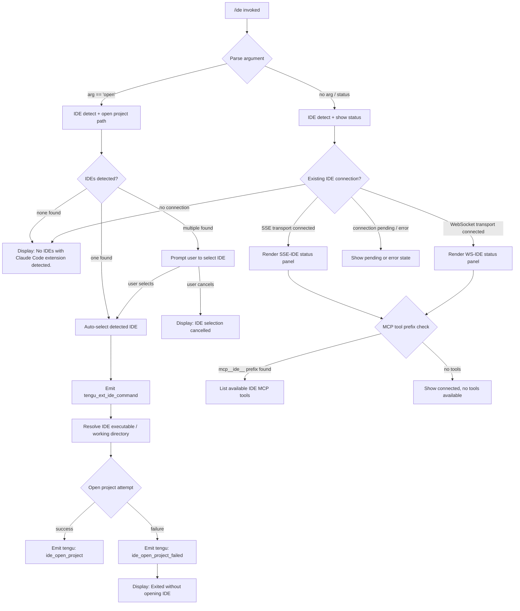

# `/ide`

> Analysis basis: CC v2.1.179 bundle.js (AST extraction + Claude interpretation)
> Minimum version: v2.1.179

---

## Overview

The `/ide` command manages IDE integrations for Claude Code, detecting running IDEs (VS Code, Cursor, Windsurf, JetBrains family, and others), establishing or refreshing connections to them via SSE or WebSocket transports, and displaying current connection status. When invoked with the `open` sub-argument, it additionally opens the current project in the detected or selected IDE.

---

## Registration

| Field | Value |
|---|---|
| type | `local-jsx` |
| name | `ide` |
| description | `Manage IDE integrations and show status` |
| argumentHint | `[open]` |
| module_id | `e4K` |
| load_inline | `true` |
| loc_byte | `11955461` |
| loc_byte_end | `11955617` |
| loc_line | `7479` |
| arbor_handler.name | `alL` |
| arbor_handler.fqn | `claude-2.1.179::alL` |
| arbor_handler.kind | `AsyncFunction` |
| arbor_handler.resolution_path | `module_id` |
| arbor_handler.n_hits | `0` |

Analysis basis: CC v2.1.179 bundle.js:+11955461

---

## Input Branching

The command exhibits 5+ distinct branches based on the argument provided, the IDE detection outcome, transport type, and connection status. A Mermaid flowchart is used.



Analysis basis: CC v2.1.179 bundle.js:+11951576 (handler entry `alL`), +11951684 (`"open"` literal), +11951793 (`"No IDEs with Claude Code extension detected."` literal), +11951931 (`"No IDE selected."` literal)

---

## Behavioral Spec

### 1. Handler Entry Point (`alL`)

The primary async handler `alL` is the Arbor-resolved entry point for `/ide`.

```
async function ideCommandHandler(args, appState, context):
    emit telemetry("tengu_ext_ide_command")

    subcommand = args[0] ?? null

    detectedIDEs = await detectRunningIDEs()        // calls ideDetectionFunction
    selectedIDE  = await resolveIDESelection(detectedIDEs, subcommand)

    if subcommand == "open":
        await openProjectInIDE(selectedIDE, context.workingDirectory)
    else:
        return renderIDEStatusPanel(selectedIDE, appState)
```

Analysis basis: CC v2.1.179 bundle.js:+11951576, +11951698, +11951722, +11951791

---

### 2. IDE Detection (`ideDetectionFunction` → `HG8`)

Scans the current environment to discover running IDE processes that have the Claude Code extension loaded.

```
async function detectRunningIDEs(environment):
    candidates = []

    // Resolve candidate process list
    rawProcessList = await gatherProcessList()     // platform-specific
    normalizedList = normalizeProcessEntries(rawProcessList)

    for each entry in normalizedList:
        ideType = classifyProcess(entry)           // checks name tokens
        if ideType != null:
            candidates.push({ type: ideType, pid, executablePath })

    // On Linux: run ps-based grep for known IDE process names
    // Literal grep pattern includes: code|cursor|windsurf|devin-desktop|idea|pycharm|...
    // (bundle.js:+6645288)

    candidates = deduplicateCandidates(candidates)
    return candidates
```

Recognised IDE type tokens (literals found in bundle):

| Token | IDE |
|---|---|
| `"windsurf"` | Windsurf |
| `"devin"` / `"Devin Desktop"` | Devin |
| `"cursor"` | Cursor |
| `"insiders"` | VS Code Insiders |
| `"vscode"` / `"vs code"` / `"visual studio code"` | VS Code |
| `"vscodium"` / `"code - oss"` / `"codium"` | VSCodium / Code-OSS |
| `"jetbrains"` / `"appcode"` | JetBrains family |
| `"IDE"` | Generic IDE label |

Analysis basis: CC v2.1.179 bundle.js:+6641917 (`"ide_detect"` telemetry event), +6643358–+6643839 (IDE name literals), +6645288 (Linux ps grep pattern), +6641981 (`"ide_detect_failed"`)

---

### 3. IDE Selection (`ideSelectionFunction` → `Ds9`, `_G8`)

Determines which IDE to act upon when multiple are detected.

```
function resolveIDESelection(candidates, subcommand):
    if candidates is empty:
        display("No IDEs with Claude Code extension detected.")
        return null

    if candidates.length == 1:
        return candidates[0]

    // Multiple: prompt user via interactive selector
    selected = await promptUserForIDEChoice(candidates)

    if selected == null:
        display("No IDE selected.")   // or "IDE selection cancelled"
        return null

    return selected
```

Analysis basis: CC v2.1.179 bundle.js:+11951793, +11951931, +11954843 (`"IDE selection cancelled"`)

---

### 4. Open Project Sub-command (`openProjectFunction` → `alL` open branch)

When `open` is passed as the argument, the handler opens the current worktree or project directory in the selected IDE.

```
async function openProjectInIDE(ide, workingDirectory):
    ideKind = classify(ide.type)   // "worktree" | "project"
    emit telemetry("ide_open_project", { ideType: ide.type, kind: ideKind })

    exitCode = await spawnIDEWithPath(ide.executablePath, workingDirectory)

    if exitCode != 0 or process exited without opening:
        emit telemetry("ide_open_project_failed")
        display("Exited without opening IDE")
        return

    // success — IDE window opens with the project
```

Analysis basis: CC v2.1.179 bundle.js:+11952129 (`"ide_open_project"`), +11952163 (`"worktree"`), +11952174 (`"project"`), +11952236 (`"ide_open_project_failed"`), +11952526 (`"Exited without opening IDE"`)

---

### 5. Connection Establishment (`ideConnectFunction` → `t4K` component)

The status panel component manages the IDE connection lifecycle using React hooks (`useState`, `useRef`, `useEffect`, `useCallback`).

```
function IDEStatusComponent(props):
    [connectionState, setConnectionState] = useState("pending")
    ideRef = useRef(null)

    useEffect(() => {
        connection = attemptIDEConnection(selectedIDE)  // SSE or WebSocket
        // Transport chosen based on IDE endpoint:
        //   "sse-ide"  → SSE transport  (bundle.js:+11949563)
        //   "ws-ide"   → WebSocket transport  (bundle.js:+11949583)

        connection.onSuccess(() => {
            emit telemetry("ide_connect")
            setConnectionState("connected")
        })
        connection.onFailure(() => {
            emit telemetry("ide_connect_failed")
            display("Error connecting to IDE.")
        })
        connection.onTimeout(() => {
            emit telemetry("ide_connect_timeout")
        })

        return () => {
            emit telemetry("ide_disconnect")
            connection.close()
        }
    }, [selectedIDE])

    mcpTools = filterToolsWithPrefix("mcp__ide__")  // bundle.js:+11954270

    render IDEStatusPanel(connectionState, mcpTools)
```

Analysis basis: CC v2.1.179 bundle.js:+11953463 (`useState`), +11953541 (`useRef`), +11953555 (`useEffect`), +11953962 (`useCallback`), +11953636 (`"pending"`), +11953680 (`"ide_connect"`), +11953767 (`"ide_connect_failed"`), +11953874 (`"ide_connect_timeout"`), +11953992 (`"Error connecting to IDE."`), +11954270 (`"mcp__ide__"` prefix), +11954373 (`"ide_disconnect"`)

---

### 6. IDE Disconnect Handling (`ideDisconnectFunction`)

When the IDE connection drops or the panel unmounts, cleanup is performed and the `ide_disconnect` telemetry event is fired. A reconnect prompt (suggesting `restart your IDE`) may be displayed.

```
function handleIDEDisconnect(connection, state):
    emit telemetry("ide_disconnect")
    connection.close()

    if state == "error":
        display("restart your IDE")   // bundle.js:+11952795
```

Analysis basis: CC v2.1.179 bundle.js:+11954373, +11952795

---

### 7. Available-IDE Normalisation (`normaliseAvailableIDEs` → `fYA`)

A utility function that normalises the raw list of available connected IDEs for display, including ellipsis truncation when more than 3 entries are present.

```
function normaliseIDEListForDisplay(ideList):
    normalised = ideList
        .map(entry => entry.normalize("NFC"))   // bundle.js:+11955060 ("NFC")
        .slice(0, 3)                             // bundle.js:+11954938 (0), +11954919 (100 display width)

    if ideList.length > 3:                       // bundle.js:+11954992 (literal 3)
        return normalised.join(", ") + ", …"     // bundle.js:+11955217, +11955231
    else:
        return normalised.join(", ")
```

Analysis basis: CC v2.1.179 bundle.js:+11954955, +11955048, +11955060, +11955069, +11955087, +11955109, +11955135, +11955194, +11955217, +11955231

---

## State & Side Effects

| Item | Detail |
|---|---|
| Telemetry: `tengu_ext_ide_command` | Fired at handler entry for every `/ide` invocation (bundle.js:+11951578) |
| Telemetry: `tengu_feature_ok` | Fired on successful feature execution (bundle.js:+1020479) |
| Telemetry: `tengu_feature_bad` | Fired on hard feature failure (bundle.js:+1020546) |
| Telemetry: `tengu_feature_sad` | Fired on soft/sad-path feature outcome (bundle.js:+1020627) |
| Telemetry: `ide_detect` | Fired after IDE detection completes successfully (bundle.js:+6641917) |
| Telemetry: `ide_detect_failed` | Fired when IDE detection fails (bundle.js:+6641981) |
| Telemetry: `ide_open_project` | Fired when open-project succeeds (bundle.js:+11952129) |
| Telemetry: `ide_open_project_failed` | Fired when open-project fails (bundle.js:+11952236) |
| Telemetry: `ide_connect` | Fired when IDE connection is established (bundle.js:+11953680) |
| Telemetry: `ide_connect_failed` | Fired when IDE connection attempt fails (bundle.js:+11953767) |
| Telemetry: `ide_connect_timeout` | Fired when IDE connection times out (bundle.js:+11953874) |
| Telemetry: `ide_disconnect` | Fired on IDE disconnection or panel unmount (bundle.js:+11954373) |
| Telemetry: `tengu_mcp_skills` | Fired when MCP skill set from IDE is enumerated (bundle.js:+6682260) |
| Telemetry: `tengu_daemon_control` | Fired during daemon-level control operations reached via call graph (bundle.js:+17105376) |
| Telemetry: `tengu_bg_dispatch_sigkill_escalate` | Fired during SIGKILL escalation in daemon background path (bundle.js:+17067302) |
| Transport registration | SSE transport keyed `"sse-ide"` (bundle.js:+11949563); WebSocket transport keyed `"ws-ide"` (bundle.js:+11949583) |
| MCP tool prefix | Filters available MCP tools by prefix `"mcp__ide__"` for display (bundle.js:+11954270) |
| appState changes | Connection state transitions: `"pending"` → `"connected"` / `"error"` managed via React `useState` in the status JSX component (bundle.js:+11953636) |
| React hooks used | `useState`, `useRef`, `useEffect`, `useCallback`, `useMemo`, `useSyncExternalStore` (via store hooks `X6`, `kA`) |
| Sound | None observed in traversal |

---

## Version History

| Version | Change |
|---|---|
| v2.1.179 | Initial analysis |

---

## Common Mistakes

1. **Invoking `/ide open` without a running IDE that has the Claude Code extension installed** — the command will report "No IDEs with Claude Code extension detected." and exit. Install the Claude Code extension in VS Code, Cursor, Windsurf, or a supported JetBrains IDE first.
2. **Expecting `/ide` to install the extension** — the command detects and connects to an already-installed extension; it does not install extensions itself.
3. **Running on a remote SSH session without forwarding the IDE socket** — IDE detection depends on local process inspection; connections over SSH without socket forwarding will fail with a connection error.
4. **Ignoring the `restart your IDE` suggestion after a disconnect** — when the IDE transport drops unexpectedly, the displayed hint to restart the IDE is the primary recovery path.
5. **Confusing `/ide` with `/mcp`** — IDE integration tools appear under the `mcp__ide__` prefix in the MCP tool namespace; `/ide` manages the transport-level connection while `/mcp` manages the broader MCP server list.

---

## Appendix — Identifier Mapping

> For bundle debugging only. Identifiers change across versions.

| Identifier | Role |
|---|---|
| `alL` | Primary async handler for `/ide` command (Arbor-resolved) |
| `fYA` | IDE list normalisation / display formatter utility |
| `t4K` | React JSX component rendering the IDE status panel |
| `HG8` | IDE detection orchestrator (dispatches per-platform detection) |
| `e08` | Per-IDE-candidate filesystem / socket path resolver |
| `OC7` | Platform-specific IDE process path finder (handles WSL, homedir) |
| `MC7` | IDE metadata builder from detected process entries |
| `M2_` | IDE record constructor / normaliser |
| `Ds9` | IDE name classifier (lowercases and matches known name tokens) |
| `_G8` | Secondary IDE classifier (basename + include checks, `.cmd` suffix) |
| `WG` | IDE display-name formatter (basename, lowercase normalisation) |
| `Z9` | String index/slice utility used in name normalisation |
| `jl_` | IDE selection prompt initiator |
| `PC7` | IDE selection interactive list builder |
| `wW` | Interactive prompt/select wrapper |
| `MkH` | Low-level prompt/select component |
| `g8` | IDE open-project executor (spawns IDE process) |
| `o_` | Process spawn helper |
| `js9` | IDE name replacement/sanitisation helper |
| `oW9` | Process name regex matcher |
| `Os9` | Process kill helper (used during IDE process management) |
| `MHH` | IDE status message formatter |
| `clL` | IDE connection cleanup handler |
| `GG` | MCP tool integration hook for IDE tools |
| `W_6` | MCP connection hash utility |
| `j0H` | MCP tool fingerprint / hash builder |
| `Yh` | MCP skills enumeration hook |
| `X6` | App-state store selector hook |
| `kA` | Secondary app-state selector hook |
| `Ib_` | App-state context access guard |
| `m7` | Zustand-style store hook (useSyncExternalStore bridge) |
| `x6` | Feature flag / gate check function |
| `Ee6` | Feature flag store getter |
| `Kl` | Feature flag default resolver |
| `G_` | Feature gate evaluation helper |
| `OT` | Core gate/permission evaluator |
| `q3` | IDE argument token parser |
| `D` | Background session / daemon process manager |
| `b` | Background session spawner and lifecycle controller |
| `MkA` | Daemon job lifecycle manager (claim, spawn, roster) |
| `_kA` | Daemon socket claim handler |
| `w` | Daemon supervisor process wrapper |
| `S` | Daemon worker process wrapper |
| `qx5` | Daemon protocol message dispatcher |
| `P` | Daemon IPC buffer/socket handler |
| `z` | Daemon abort/shutdown coordinator |
| `QB` | Daemon graceful shutdown sequencer |
| `Y` | Daemon session normaliser / forced-shutdown handler |
| `il8` | Low-memory detection helper |
| `Y6` | Low-memory event emitter |
| `mO8` | Low-memory deduplication tracker |
| `h6` | Low-memory event dispatch |
| `g` | Permission/tool classifier |
| `tq6` | Tool-use permission classifier dispatcher |
| `GC6` | Permission classification evaluator |
| `xd` | Permission rule matcher |
| `HG8` | (also) Port / PID integer parser for IDE detection |
| `U6` | Daemon control outcome reporter |
| `IH` | Daemon control success reporter |
| `CH` | Daemon control failure reporter |
| `QH` | Core telemetry emitter |
| `SH` | Structured logger |
| `GH` | Error-to-string coercer |
| `N` | Process environment / config reader |
| `bH` | JSON serialiser utility |
| `l6` | JSON parser utility |
| `x8` | Error wrapper / re-thrower |
| `G8` | Filesystem error classifier |
| `vO` | Atomic file write helper |
| `d` | Debug/trace logger |
| `f6` | String coercion utility |
| `r6` | Async retry helper |
| `VL` | No-op / void logger |
| `pT` | Job state sentinel |
| `ctK` | Scheduled task missed-event reporter |
| `Hh` | Cron expression parser |
| `g9H` | Background session synchronisation helper |
| `L_H` | Session registry has-check |
| `bCH` | Background process configuration reader |
| `dH6` | `.claude` directory writer |
| `pk9` | Stale background session cleaner |
| `QH6` | Session age evaluator |
| `dy` | Config file line parser |
| `oRH` | Pinned-job roster file reader |
| `_E6` | Roster path resolver |
| `GE` | Roster directory resolver |
| `eL7` | Roster directory recursive scanner |
| `QT9` | Roster entry atomic writer |
| `N3` | Roster entry validator |
| `zq` | Job state file reader/writer |
| `yL` | Job state atomic updater |
| `lJ` | Job state cache invalidator |
| `qL6` | Job state persistence scheduler |
| `td` | Job state file loader |
| `GcL` | Job state directory creator |
| `D2H` | Daemon notification routing classifier |
| `oL7` | Daemon notification secondary router |
| `i$` | Job active-state sentinel |
| `vU6` | Daemon socket path builder (variant) |
| `VU6` | Daemon socket path builder |
| `EU6` | Daemon auth-file path builder |
| `EzH` | PTY-pid file path builder |
| `UBH` | PTY-pid directory path builder |
| `TKK` | PTY-pid list parser |
| `uI` | PTY path resolver |
| `AL6` | PTY directory path builder |
| `CwA` | PTY config reader |
| `aE` | PTY-pid list loader |
| `Cv` | PTY-pid list builder |
| `LTA` | Daemon socket directory initialiser |
| `nb5` | Daemon claim sender with timeout |
| `ib5` | Daemon socket connect-and-claim helper |
| `lb5` | Daemon claim frame builder |
| `hv` | Binary frame encoder |
| `W` | Daemon worker process supervisor |
| `J36` | Worker health-check scheduler |
| `eA4` | Worker config key enumerator |
| `WA` | Error string normaliser |
| `v94` | Worker real-path / stat checker |
| `Z94` | Heartbeat interval initiator |
| `mLH` | Process uptime formatter |
| `Ht` | Process uptime display helper |
| `AVK` | Terminal column-width calculator |
| `bVH` | Terminal/PTY file stat checker |
| `T` | Spinner / progress indicator |
| `Z` | Animated progress bar |
| `v` | Keypress animation handler |
| `f1` | File existence checker |
| `Lf6` | Locale/format helper |
| `y7A` | API config resolver (wdq path) |
| `I7A` | API region resolver |
| `_h` | API provider standard/vertex branch |
| `aj` | JWT helper |
| `Pcq` | Token counter |
| `Df` | Rate-limit retry helper |
| `c_6` | API call wrapper with retry |
| `P4` | Jobs directory path builder |
| `M` | MCP server connection manager |
| `B` | MCP connection disposer |
| `fp` | MCP server connection initiator |
| `mO8` | MCP dedup tracker (also low-mem, see above) |
| `XG_` | MCP server registration helper |
| `lyH` | MCP heartbeat handler |
| `QS` | MCP server list manager |
| `im` | MCP client factory |
| `n8` | Async timeout/abort wrapper |

---

Note: index built via Arbor fallback; some signals (telemetry, literals) may be missing — see arbor-fallback.js.