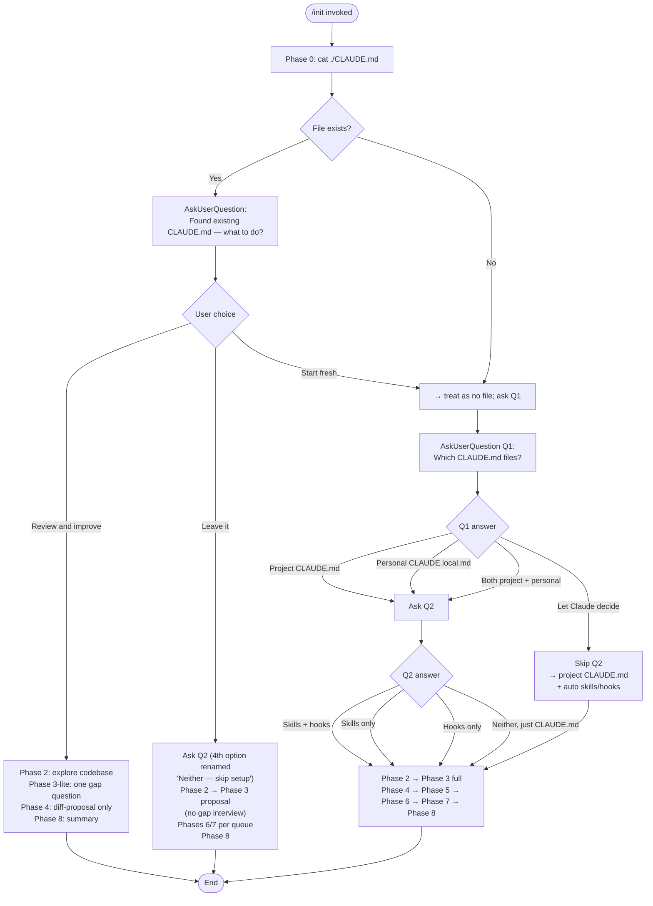

# `/init`

> Analysis basis: CC v2.1.178 bundle.js (AST extraction + Claude interpretation)
> Minimum version: v2.1.178

---

## Overview

The `/init` command bootstraps Claude Code configuration for a repository by guiding the user through a structured, multi-phase conversation that produces one or more of: a project-level `CLAUDE.md`, a personal `CLAUDE.local.md`, skill definitions under `.claude/skills/`, and lifecycle hooks in `.claude/settings.json` or `.claude/settings.local.json`. The command invokes a long-form prompt (22,519 characters) delivered to the agent via `getPromptForCommand`, which orchestrates codebase exploration, gap-fill interviews, artifact writing, and a final optimization summary across eight sequential phases.

---

## Registration

| Field | Value |
|---|---|
| type | `prompt` |
| name | `init` |
| description | `Initialize new CLAUDE.md file(s) and optional skills/hooks with codebase documentation \| Initialize a new CLAUDE.md file with codebase documentation` |
| loc_byte | `11961706` |
| loc_byte_end | `11962099` |
| loc_line | `7708` |
| handler_method | `getPromptForCommand` |
| handler_method_start | `11962022` |
| handler_method_end | `11962098` |
| prompt_body.length | `22519` characters |
| prompt_body.trace | `conditional; identifier→BcL (var template, 20920 chars); identifier→UcL (var template, 1592 chars)` |
| arbor_handler.name | `getPromptForCommand` |
| arbor_handler.fqn | `claude-2.1.178::getPromptForCommand` |
| arbor_handler.kind | `Method` |
| arbor_handler.resolution_path | `direct` |
| arbor_handler.n_hits | `2` |

Analysis basis: CC v2.1.178 bundle.js:+11961706

---

## Input Branching

The command has more than three distinct input branches driven by the Phase 0 filesystem check and the Phase 1 user-question answers; a Mermaid flowchart is required.



Analysis basis: CC v2.1.178 bundle.js:+11961706 (prompt body Phase 0–1 routing logic)

---

## Behavioral Spec

The handler is `getPromptForCommand` (Arbor resolution: `direct`, `claude-2.1.178::getPromptForCommand`), invoked as an inline ObjectMethod on the registration object. At runtime the handler selects between two template variables — the longer template (`BcL`, 20,920 chars) and a shorter template (`UcL`, 1,592 chars) — based on a conditional branch. The shorter template appears to be a legacy or fallback path (containing the simpler "Please analyze this codebase and create a CLAUDE.md" instruction block); the longer template encodes the full eight-phase workflow. The result is returned as a message of type `"text"`.

Analysis basis: CC v2.1.178 bundle.js:+11962028, +11962057, +11962070, +11962082

### Phase 0 — Existing-file detection

```
function checkForExistingClaudeMd():
    result = shell("cat ./CLAUDE.md")   # only project root counts
    if result.exitCode == 0:
        return EXISTS
    else:
        return MISSING
```

Analysis basis: CC v2.1.178 bundle.js:+11961706 (prompt Phase 0 section)

### Phase 1 — Scope elicitation via AskUserQuestion

```
function elicitScope(existingFileStatus):
    printPrimer()          # explains CLAUDE.md, Skills, Hooks terminology

    if existingFileStatus == EXISTS:
        answer = AskUserQuestion("Found existing CLAUDE.md — what to do?",
                                 options=["Review and improve it",
                                          "Leave it, set up other things",
                                          "Start fresh (replace it)"])
        return routeExistingFile(answer)

    # No file or "Start fresh"
    q1 = AskUserQuestion("Which CLAUDE.md files should /init set up?",
                         options=["Project CLAUDE.md",
                                  "Personal CLAUDE.local.md",
                                  "Both project + personal",
                                  "Let Claude decide"])
    if q1 == "Let Claude decide":
        return Scope(files=["project"], extras="auto")

    q2 = AskUserQuestion("Also set up skills and hooks?",
                         options=["Skills + hooks", "Skills only",
                                  "Hooks only", "Neither, just CLAUDE.md"])
    return Scope(files=q1, extras=q2)  # Q2 is a hint, not a filter
```

Note: Q1 and Q2 are issued in **separate** `AskUserQuestion` calls; they must never be combined in a single call.

Analysis basis: CC v2.1.178 bundle.js:+11961706 (prompt Phase 1 section)

### Phase 2 — Codebase exploration (subagent)

```
function explorCodebase():
    subagent.read([
        "package.json", "Cargo.toml", "pyproject.toml", "go.mod", "pom.xml",
        "README*", "Makefile", "CI config", "CLAUDE.md", ".claude/rules/",
        "AGENTS.md", ".cursor/rules", ".cursorrules",
        ".github/copilot-instructions.md",
        ".devin/rules/", ".windsurf/rules/", ".windsurfrules",
        ".clinerules", ".mcp.json"
    ])
    detect(buildCommands, testCommands, lintCommands,
           languages, frameworks, packageManager,
           projectStructure, codeStyleDeviations,
           envVars, gotchas, existingSkillsAndRules,
           formatterConfig)
    shell("git worktree list")   # relevant only for personal CLAUDE.local.md
    return findings, gaps
```

Analysis basis: CC v2.1.178 bundle.js:+11961706 (prompt Phase 2 section)

### Phase 3 — Gap-fill interview and proposal synthesis

```
function fillGapsAndPropose(scope, findings, gaps):
    if scope.files includes "project" or "auto":
        askAboutCodebasePractices(gaps)  # non-obvious commands, branch conventions, env setup
    if scope.files includes "personal":
        askAboutUserPreferences(gaps)    # role, familiarity, sandbox URLs, communication prefs
    if worktreesFound and "personal" in scope:
        askWorktreeTopology()            # nested vs sibling/external

    proposal = buildProposal(findings, gapAnswers, scope)
    # Each item is classified as: file | hook | skill | note
    printProposal(proposal)              # printed as assistant text before AskUserQuestion
    confirmation = AskUserQuestion("Does this look right?",
                                   options=["Looks good — proceed",
                                            "Drop the hook", "Drop the skill"])
    preferenceQueue = buildQueue(confirmation, proposal)
    return preferenceQueue
```

If the user's Q2 hint conflicts with the proposal, a one-line deviation notice is printed before listing artifacts.

Analysis basis: CC v2.1.178 bundle.js:+11961706 (prompt Phase 3 section)

### Phase 4 — Write project CLAUDE.md

```
function writeProjectClaudeMd(path, findings, queue, mode):
    if mode == "review_and_improve":
        existing = readFile(path)
        diffs = computeDiffs(existing, findings, phase3LiteAnswer)
        printDiffs(diffs)
        answer = AskUserQuestion("Apply these edits?",
                                 options=["Apply all", "Let me pick which",
                                          "Skip — leave it as is"])
        if answer != "Skip":
            applySelectedDiffs(existing, diffs, answer)
        return

    content = buildMinimalClaudeMd(findings)
    # Include: non-standard commands, style deviations, testing quirks,
    #          repo etiquette, env vars, gotchas, existing AI tool configs
    # Exclude: file lists, standard conventions, generic advice,
    #          frequently-changing data (use @path/to/import refs instead)
    consumeNoteEntries(queue, target="CLAUDE.md", appendTo=content)
    prefixWith("# CLAUDE.md\n\nThis file provides guidance to Claude Code...")
    writeFile(path, content)
```

File mode bits used during write: `384` (octal `0600`). Config is written atomically via a lock-based helper that guards against concurrent Claude instances (lock-contention warning threshold: 100 ms; timeout: 60,000 ms).

Analysis basis: CC v2.1.178 bundle.js:+11961706 (prompt Phase 4), +3348817, +3349593, +3350124

### Phase 5 — Write personal CLAUDE.local.md

```
function writePersonalClaudeMd(projectRoot, findings, queue):
    localPath = projectRoot + "/CLAUDE.local.md"
    if fileExists(localPath):
        existing = readFile(localPath)
        proposeAdditions(existing)    # never silently overwrite
        return

    if worktreesAreExternalSiblings:
        homeFile = "~/.claude/<project-name>-instructions.md"
        writePersonalContent(homeFile)
        stub = "@" + homeFile
        writeFile(localPath, stub)
    else:
        content = buildMinimalLocalMd(userPreferences)
        consumeNoteEntries(queue, target="CLAUDE.local.md", appendTo=content)
        writeFile(localPath, content)

    addToGitignore("CLAUDE.local.md")
```

The import stub must never appear in the team-shared `CLAUDE.md`.

Analysis basis: CC v2.1.178 bundle.js:+11961706 (prompt Phase 5 section)

### Phase 6 — Create skills

```
function createSkills(queue, findings):
    for entry in queue where entry.type == "skill":
        name = deriveSkillName(entry)
        body = buildSkillBody(entry, findings)
        if mapsToExistingBundledSkill(name):
            notifyUser("bundled skill still exists; yours is additive")
        writeFile(".claude/skills/" + name + "/SKILL.md", skillFrontmatter + body)

    additionalSkills = suggestFromFindings(findings)
    for skill in additionalSkills:
        if not existsIn(".claude/skills/"):
            presentToUser(skill.name, skill.purpose, skill.rationale)
            if userApproves:
                writeFile(".claude/skills/" + skill.name + "/SKILL.md", ...)
```

Skills with side effects (deploy, fix-issue) must include `disable-model-invocation: true` and accept `$ARGUMENTS`.

Analysis basis: CC v2.1.178 bundle.js:+11961706 (prompt Phase 6 section)

### Phase 7 — Additional optimizations (hooks, GitHub CLI, linting)

```
function suggestOptimizations(scope, queue, findings):
    notifyUserOfSection()

    if "gh" not in PATH and projectUsesGitHub():
        AskUserQuestion("Install GitHub CLI?", ...)

    if noLintConfigFound(findings):
        AskUserQuestion("Set up linting?", ...)

    hookEntries = [e for e in queue if e.type == "hook"]
    if not hookEntries and findings.formatterFound:
        hookEntries.append(formatOnEditFallback(findings.formatter))

    if hookEntries:
        targetFile = resolveHookTargetFile(scope)
        # Once per /init run — do not re-invoke for subsequent hooks:
        invokeSkill("update-config", args="[hooks-only] " + hookSummary)

        for hook in hookEntries:
            event, matcher = classifyHookPreference(hook)
            # "after every edit"     → PostToolUse / Write|Edit
            # "when Claude finishes" → Stop
            # "before running bash"  → PreToolUse / Bash
            # "before committing"    → git pre-commit hook, NOT hooks.json
            buildAndValidateHook(event, matcher, targetFile)
            # dedup → construct → pipe-test → wrap → write JSON → jq -e validate
            # → live-proof (Pre|PostToolUse only) → cleanup → handoff
```

Analysis basis: CC v2.1.178 bundle.js:+11961706 (prompt Phase 7 section)

### Phase 8 — Summary and next-steps to-do list

```
function summarizeAndNextSteps(writtenArtifacts, findings):
    recapArtifacts(writtenArtifacts)
    remindUser("These files are a starting point — run /init again anytime to re-scan.")

    todoList = []
    if frontendDetected(findings):
        todoList.append("/plugin install frontend-design@claude-plugins-official")
        todoList.append("/plugin install playwright@claude-plugins-official")
    if phase7GapsDeclinedByUser:
        todoList.append(missedGapItems)
    if testsMissingOrSparse(findings):
        todoList.append("Set up a test framework")
    todoList.append("/plugin install skill-creator@claude-plugins-official")  # always
    todoList.append("Browse /plugin for official plugins")                     # always

    printTodoList(sortByImpact(todoList))
```

Analysis basis: CC v2.1.178 bundle.js:+11961706 (prompt Phase 8 section)

### Config file write path (shared infrastructure)

The file-writing infrastructure reached via `wO8` (safe-write helper) and `ED6` (atomic rename helper) implements a defensive write strategy:

```
function safeWriteConfig(path, content):
    acquireLock(path)               # spin; warn if > 100 ms
    reRead = readCurrentFile(path)
    if cacheHasAuth and reReadMissingAuth:
        emitTelemetry("tengu_config_auth_loss_prevented")
        raise "refusing to write to avoid wiping auth"  # GH #3117
    backupDir = dirname(path) + "/backups"
    mkdirIfMissing(backupDir)
    ts = Date.now()
    backupPath = backupDir + "/" + basename + ".backup." + ts
    copyFile(path, backupPath)
    pruneOldestBackupsKeepingLatest(5)
    atomicWrite(tempFile, content, mode=0o600)
    rename(tempFile, path)
    releaseLock()
```

Backup retention: latest 5 copies (literal `5` at bundle.js:+3349842). Lock-contention threshold: 100 ms (bundle.js:+3348817). Config timeout: 60,000 ms (bundle.js:+3349593). Auth-loss guard string: `"saveConfigWithLock: re-read config is missing auth…"` (bundle.js:+3349239). File mode: `384` = `0o600` (bundle.js:+3350124).

Analysis basis: CC v2.1.178 bundle.js:+3348697, +3348817, +3349239, +3349593, +3349842, +3350124

### Onboarding completion signal

After the full workflow, `KeH` calls `SH` which emits the string `"onboarding_project_complete"` (bundle.js:+4124410) to record that the project has been initialized.

Analysis basis: CC v2.1.178 bundle.js:+4124407, +4124410

### Workspace-level CLAUDE.md hint

The literal strings `"CLAUDE.md"` (bundle.js:+4123898) and `"workspace"` (bundle.js:+4123936) appear together with the hint text `"Run /init to create a CLAUDE.md file with instructions for Claude"` (bundle.js:+4124073) and `"Ask Claude to create a new app or clone a repository"` (bundle.js:+4123953), indicating the command also surfaces the `"claudemd"` (bundle.js:+4124057) onboarding entry point from the workspace landing screen.

Analysis basis: CC v2.1.178 bundle.js:+4123898, +4123936, +4123953, +4124057, +4124073

---

## State & Side Effects

| Item | Detail |
|---|---|
| Telemetry — `tengu_config_parse_error` | Fired when the on-disk config JSON cannot be parsed (bundle.js:+3351487) |
| Telemetry — `tengu_config_lock_contention` | Fired when lock acquisition exceeds the 100 ms threshold (bundle.js:+3348912) |
| Telemetry — `tengu_config_stale_write` | Fired when the re-read config is older than the in-memory cache (bundle.js:+3349048) |
| Telemetry — `tengu_config_auth_loss_prevented` | Fired when a write is blocked because the re-read config is missing auth that the cache holds (bundle.js:+3349391) |
| Telemetry — `tengu_config_fallback_write` | Fired when the primary write path fails and a fallback write is used (bundle.js:+3348528) |
| Telemetry — `tengu_feature_ok` | Feature-flag check passes (bundle.js:+1020153) |
| Telemetry — `tengu_slate_harbor_experiment` | Growthbook experiment enrollment recorded during prompt-template selection (bundle.js:+11938597) |
| Files written | `CLAUDE.md`, `CLAUDE.local.md`, `.claude/skills/<name>/SKILL.md`, `.claude/settings.json` or `.claude/settings.local.json` — depending on user choices |
| Config backups | Up to 5 timestamped backups kept in `<config-dir>/backups/` with prefix `".backup."` |
| `.gitignore` mutation | `CLAUDE.local.md` is appended to the project `.gitignore` after Phase 5 creates the file |
| Onboarding flag | `"onboarding_project_complete"` event emitted; `"save_project"` config key written (bundle.js:+3353185) |
| Subagent launch | Phase 2 spawns a subagent for codebase survey (`git worktree list`, manifest reads, AI-tool config reads) |
| Skill tool invocation | Phase 7 invokes the `update-config` skill exactly once per `/init` run to load the hooks schema |
| Sound | <!-- TODO: not found in depth-2 traversal; needs --depth 4 --> |
| appState changes | <!-- TODO: not found in depth-2 traversal; needs --depth 4 --> |

---

## Version History

| Version | Change |
|---|---|
| v2.1.178 | Initial analysis — full eight-phase workflow with skills, hooks, and CLAUDE.local.md support confirmed |

---

## Common Mistakes

1. **Running `/init` in a subdirectory** — Phase 0 only checks `./CLAUDE.md` relative to the current working directory; if invoked from a subdirectory, the project-root file will not be found and the agent will create a new file at the wrong location.
2. **Expecting Q1 and Q2 to appear together** — the prompt explicitly forbids combining Q1 and Q2 in a single `AskUserQuestion` call. Implementations that merge them will skip the "Let Claude decide" short-circuit that suppresses Q2.
3. **Treating Q2 as a hard filter** — Q2 is described as a "hint, not a filter." The agent may propose hooks even when the user chose "Skills only" if the codebase evidence warrants it; a deviation notice will appear at the top of the proposal.
4. **Manually editing config files during `/init`** — the safe-write path acquires a file lock and will emit `tengu_config_lock_contention` if another Claude instance is also running; concurrent edits risk triggering the auth-loss guard (GH #3117 protection).
5. **Assuming the shorter prompt body is the standard path** — the conditional template selection (`BcL` vs. `UcL`) means the shorter 1,592-character body (the legacy "create a CLAUDE.md" instruction) may be delivered under some conditions. The full eight-phase workflow is only guaranteed when the longer `BcL` template is selected.
6. **Putting the `@~/.claude/<project>-instructions.md` import in `CLAUDE.md`** — that import is only valid in `CLAUDE.local.md`. Placing it in the team-shared file checks a personal home-directory reference into source control.
7. **Re-invoking the `update-config` skill for each hook in Phase 7** — the prompt specifies the skill must be invoked exactly once per `/init` run; subsequent hooks reuse the already-loaded schema context.

---

## Appendix — Identifier Mapping

> For bundle debugging only. Identifiers change across versions.

| Identifier | Role |
|---|---|
| `__handler_init` | Synthetic BFS entry point for the `/init` command handler |
| `KeH` | Top-level `/init` orchestrator; calls prompt builder, CLAUDE.md locator, project-save helper, and onboarding-complete signal |
| `PY` | File-watch coordinator (watch setup + teardown wrapper) |
| `S6` | File-watch initializer; calls watcher registration and date-stamp logic |
| `_MH` | Config file reader; handles UTF-8 decode, ENOENT, parse errors, backup directory management |
| `wnf` | File-watch registration helper; sets up `watchFile` / `unwatchFile` lifecycle |
| `g29` | CLAUDE.md path resolution dispatcher |
| `mb_` | CLAUDE.md file locator; joins path, checks existence |
| `u6` | Path existence checker (delegates to `Pe6` and `W_`) |
| `pe6` | Lower-level path stat helper |
| `$P` | Project config save path; handles lock, re-read, auth-loss guard, fallback write |
| `wO8` | Safe atomic config writer; implements backup, lock, temp-file rename strategy |
| `tR1` | Config object merge helper (`Object.assign` wrapper) |
| `N` | Log/notify utility; formats and routes log messages |
| `d` | Async delay / debounce utility |
| `Z8` | JSON parse-with-error-reporting helper |
| `JsH` | Auth presence checker on config objects |
| `A` | String case-normalization utility (`toLowerCase`) |
| `xH` | JSON serialization helper (`JSON.stringify` wrapper) |
| `zk_` | Backup directory path builder; joins `"backups"` segment |
| `V` | Scroll/viewport math utility (unrelated to init core path) |
| `P` | Stream buffering / chunked-read utility |
| `E` | Array/range slice utility (`Math.max`, `Math.min`) |
| `ED6` | Atomic file rename helper; handles symlinks, temp files, `fchmod`, `fsync`, `rename` |
| `L` | Async queue / connection pool (close/open lifecycle) |
| `H` | Exponential-backoff retry helper (`Math.random`, `setTimeout`) |
| `gXH` | Config re-read utility used inside the save-with-lock path |
| `CG6` | Timestamp helper (`Date.now` wrapper) |
| `YO8` | Current project config writer (lower-level than `$P`); calls `ED6` for atomic write |
| `dH` | Initialization guard / once-runner (`c36`) |
| `SH` | Onboarding-complete signal emitter; calls `dH` and `d` |
| `pcL` | Prompt template selector; chooses between `BcL` and `UcL` based on experiment/condition |
| `L6` | String coercion helper |
| `O6` | Growthbook / feature-flag evaluator; checks `uXH`, `ZG6`, `xg` maps |
| `vG6` | Feature-flag value resolver |
| `NG6` | Feature-flag default-value provider |
| `Xp` | Experiment assignment dispatcher |
| `qp` | Core experiment evaluation logic |
| `o$8` | Experiment cache manager (`ny_` set, `uXH` map) |
| `p0_` | Experiment enrollment recorder; emits `"GrowthbookExperimentEvent"` and `"growthbook_experiment"` telemetry |
| `ay_` | Experiment result aggregator |

---

Note: index built via Arbor fallback; some signals (telemetry, literals) may be missing — see arbor-fallback.js.