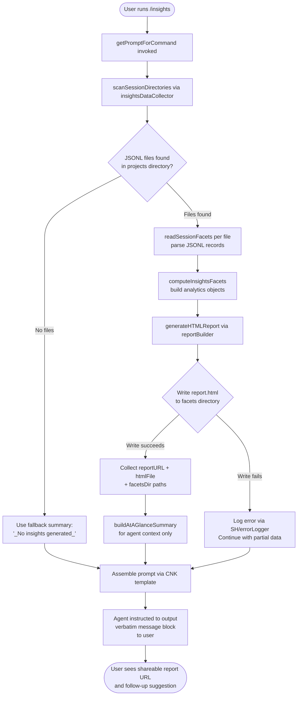

# `/insights`

> Analysis basis: CC v2.1.179 bundle.js (AST extraction + Claude interpretation)
> Minimum version: v2.1.179

---

## Overview

`/insights` generates a shareable HTML usage report by scanning the user's Claude Code session history, extracting structured facets from JSONL transcript files, and assembling a richly formatted report. The command is implemented as an inline `getPromptForCommand` handler that performs all data collection synchronously before constructing a prompt instructing the agent to deliver a fixed confirmation message to the user.

---

## Registration

| Field | Value |
|---|---|
| type | `prompt` |
| name | `insights` |
| description | `Generate a report analyzing your Claude Code sessions` |
| loc_byte | `13592010` |
| loc_byte_end | `13593314` |
| loc_line | `10563` |
| handler_method | `getPromptForCommand` |
| handler_method_start | `13592184` |
| handler_method_end | `13593313` |
| prompt_body.length | `513` |
| prompt_body.trace | `call→CNK(...) (1 literals)` |
| arbor_handler.name | `getPromptForCommand` |
| arbor_handler.fqn | `claude-2.1.179::getPromptForCommand` |
| arbor_handler.kind | `Method` |
| arbor_handler.resolution_path | `direct` |
| arbor_handler.n_hits | `1` |

Analysis basis: CC v2.1.179 bundle.js:+13592010

---

## Input Branching

The handler has 3+ distinct branches: (1) report data successfully collected and HTML file written, (2) report data collected but no sessions found (fallback summary), and (3) error / missing facets directory. A Mermaid flowchart is used.



---

## Behavioral Spec

### 1. Session Directory Discovery (`insightsDataCollector` / `RNK` → `sessionDirectoryScanner` / `u35`)

The handler begins by locating the Claude Code projects directory. It resolves the base path using the `projects` subdirectory constant (Analysis basis: CC v2.1.179 bundle.js:+5201412) and calls the filesystem `readdir` operation (Analysis basis: CC v2.1.179 bundle.js:+13578574). Only entries that pass the `isDirectory` check are retained (Analysis basis: CC v2.1.179 bundle.js:+13578642). The scanner batches directory traversal in groups of 10, with a delay of 9 units between batches, using `setImmediate` to avoid blocking the event loop (Analysis basis: CC v2.1.179 bundle.js:+13578824, +13578829, +13578854). Results are accumulated and sorted (Analysis basis: CC v2.1.179 bundle.js:+13578878). A limit of up to 50 or 200 items is applied depending on the scan stage (Analysis basis: CC v2.1.179 bundle.js:+13578966, +13578971).

```
function scanSessionDirectories(baseDir):
    projectsPath = path.join(baseDir, "projects")
    entries = fs.readdir(projectsPath)
    dirs = entries.filter(entry => entry.isDirectory())
    result = []
    batches = chunk(dirs, batchSize=10)
    for batch in batches:
        await setImmediate()  // yield to event loop
        for dir in batch:
            facets = await scanFacetsInDirectory(path.join(projectsPath, dir))
            result.push(facets)
    return result.sort(...)
```

Analysis basis: CC v2.1.179 bundle.js:+13578555, +13578574, +13578628

### 2. Facet File Collection (`facetsScanner` / `a56`)

Within each project directory, the facet scanner calls `readdir` again (Analysis basis: CC v2.1.179 bundle.js:+13672852), filters for files ending in `.jsonl` (Analysis basis: CC v2.1.179 bundle.js:+13672958) using a filename-test function (`QN` / `fileExtensionTester`, Analysis basis: CC v2.1.179 bundle.js:+13672983). For each qualifying file, the scanner reads `stat` information (Analysis basis: CC v2.1.179 bundle.js:+13673161), extracts the basename (Analysis basis: CC v2.1.179 bundle.js:+13672986), and pushes entry metadata to a collection queue (Analysis basis: CC v2.1.179 bundle.js:+13673031). All file stats are fetched in parallel via `Promise.all` (Analysis basis: CC v2.1.179 bundle.js:+13673093).

```
function scanFacetsInDirectory(dirPath):
    entries = fs.readdir(dirPath)
    jsonlFiles = entries.filter(e => e.isFile() && fileExtensionTester(e.name, ".jsonl"))
    stats = await Promise.all(jsonlFiles.map(f => fs.stat(path.join(dirPath, f))))
    return jsonlFiles.map((f, i) => ({ name: basename(f), path: join(dirPath, f), stat: stats[i] }))
```

Analysis basis: CC v2.1.179 bundle.js:+13672852, +13672929, +13672958

### 3. Session Data Loading (`sessionFileReader` / `V35`)

For each identified JSONL session file, the handler reads the file contents as UTF-8 (Analysis basis: CC v2.1.179 bundle.js:+13523966) via `fs.readFile` (Analysis basis: CC v2.1.179 bundle.js:+13523942). The raw content is passed to the JSON parser utility (`l6` / `jsonParseUtil`, Analysis basis: CC v2.1.179 bundle.js:+191694). The resolved path is built by composing the `usage-data` subdirectory (Analysis basis: CC v2.1.179 bundle.js:+13517835) and `session-meta` subdirectory (Analysis basis: CC v2.1.179 bundle.js:+13517931) constants. A per-session metadata object (`yNK`) is produced alongside the parsed content (Analysis basis: CC v2.1.179 bundle.js:+13523983).

```
async function loadSessionFile(sessionDir):
    usageDataPath = path.join(sessionDir, "usage-data")
    metaPath = path.join(usageDataPath, "session-meta")
    content = await fs.readFile(metaPath, "utf-8")
    parsed = JSON.parse(content)
    metadata = extractSessionMetadata(parsed)
    return { content: parsed, metadata }
```

Analysis basis: CC v2.1.179 bundle.js:+13517835, +13517931, +13523942, +13523966

### 4. Facet Computation (`facetsAggregator` / `jn8` → `transcriptStateBuilder` / `yKH`)

The aggregation pipeline reconstructs the full session state from JSONL records. The state builder (`yKH` / `transcriptStateBuilder`) sets numerous typed map entries including `summary`, `last-prompt`, `custom-title`, `ai-title`, `tag`, `agent-name`, `agent-color`, `agent-setting`, `mode`, `permission-mode`, `isolation-latch`, `worktree-state`, `pr-link`, `bridge-session`, `fork-context-ref`, `marble-origami-commit`, `marble-origami-snapshot`, `marble-origami-reset`, `file-history-snapshot`, `attribution-snapshot`, and `content-replacement` (Analysis basis: CC v2.1.179 bundle.js:+13659461 through +13661208). Telemetry events for phantom parents, parent cycles, and chain recovery are emitted during this phase (Analysis basis: CC v2.1.179 bundle.js:+13658233, +13662137, +13641083).

```
function buildTranscriptState(records):
    state = new Map()
    for record in records:
        switch record.type:
            case "summary": state.set("summary", record.value)
            case "last-prompt": state.set("last-prompt", record.value)
            case "tag": state.set("tag", record.value)
            case "mode": state.set("mode", record.value)
            // ... additional facet types
            default: handleUnknownFacetType(record)
    detectAndRepairParentCycles(state)
    return state
```

Analysis basis: CC v2.1.179 bundle.js:+13659183, +13659461, +13660063

### 5. Analytics Computation (`statisticsBuilder` / `SNK`)

The statistics builder (`SNK`) iterates all collected session facets and computes quantitative analytics:

- Tool usage counts and error rates (Analysis basis: CC v2.1.179 bundle.js:+13527735)
- Response time distribution bucketed into ranges: `2-10s`, `10-30s`, `30s-1m`, `1-2m`, `2-5m`, `5-15m`, `>15m` (Analysis basis: CC v2.1.179 bundle.js:+13535117–13535177)
- Time-of-day usage buckets: Morning (6–12), Afternoon (12–18), Evening (18–24), Night (0–6) (Analysis basis: CC v2.1.179 bundle.js:+13535965–13536118)
- Session duration and activity metrics using `Math.floor`, `Math.round`, and `Math.round` (Analysis basis: CC v2.1.179 bundle.js:+13529737, +13529916)
- Session count, median, and percentile computations via `INK` / `percentileCalculator` (Analysis basis: CC v2.1.179 bundle.js:+13526180–13526711)

```
function computeSessionStatistics(sessions):
    toolCounts = {}
    responseTimes = { "2-10s": 0, "10-30s": 0, "30s-1m": 0, "1-2m": 0, "2-5m": 0, "5-15m": 0, ">15m": 0 }
    timeOfDay = { "Morning (6-12)": 0, "Afternoon (12-18)": 0, "Evening (18-24)": 0, "Night (0-6)": 0 }
    for session in sessions:
        updateToolCounts(session, toolCounts)
        bucketResponseTime(session.duration, responseTimes)
        bucketTimeOfDay(session.startHour, timeOfDay)
    return { toolCounts, responseTimes, timeOfDay, percentiles: computePercentiles(sessions) }
```

Analysis basis: CC v2.1.179 bundle.js:+13528067, +13529466, +13530002

### 6. HTML Report Generation (`reportBuilder` / `b35`)

The HTML report builder (`b35`) generates a self-contained HTML file named `report.html` (Analysis basis: CC v2.1.179 bundle.js:+13581204). It applies HTML entity escaping (converting `&`, `<`, `>`, `"`, `'` to their HTML entities, Analysis basis: CC v2.1.179 bundle.js:+5238459–5238582), formats markdown-style bold as `<strong>$1</strong>` (Analysis basis: CC v2.1.179 bundle.js:+13536823), and uses bullet rendering with `• ` prefix (Analysis basis: CC v2.1.179 bundle.js:+13536866). Chart sections use four distinct colors: `#2563eb`, `#0891b2`, `#10b981`, `#8b5cf6` (Analysis basis: CC v2.1.179 bundle.js:+13572782–13573235). Error sections use `#dc2626` for errors and `#16a34a`/`#eab308` for success/warning states (Analysis basis: CC v2.1.179 bundle.js:+13576498, +13576747, +13577240). The maximum HTML buffer size is 8192 characters for certain section renders (Analysis basis: CC v2.1.179 bundle.js:+13534286). Empty data states display `<p class="empty">No data</p>` placeholders (Analysis basis: CC v2.1.179 bundle.js:+13534608). The report includes an "Add to CLAUDE.md" action suggestion (Analysis basis: CC v2.1.179 bundle.js:+13540461).

```
function generateHTMLReport(stats, facets):
    html = buildHTMLSkeleton()
    html += renderToolUsageSection(stats.toolCounts, colors=["#2563eb","#0891b2","#10b981","#8b5cf6"])
    html += renderResponseTimeSection(stats.responseTimes)
    html += renderTimeOfDaySection(stats.timeOfDay)
    html += renderErrorSection(stats.toolErrors, errorColor="#dc2626")
    html += renderSuggestionsSection(facets)  // includes "Add to CLAUDE.md"
    escaped = htmlEscape(html)
    return escaped
```

Analysis basis: CC v2.1.179 bundle.js:+13536751, +13536796, +13572760

### 7. Report File Writing (`reportFileWriter` / `v35` and `E35`)

The report is written under a timestamped directory path. The handler extracts the current date components (`getFullYear`, `getMonth`, `getDate`, `getHours`, `getMinutes`, `getSeconds`) to build the output path (Analysis basis: CC v2.1.179 bundle.js:+13581036–13581134). The `facets` subdirectory constant is used as the root (Analysis basis: CC v2.1.179 bundle.js:+13517885). The directory is created with `fs.mkdir` (recursive, Analysis basis: CC v2.1.179 bundle.js:+13524483, +13523726), and `report.html` is written with `fs.writeFile` (Analysis basis: CC v2.1.179 bundle.js:+13524564, +13523814). JSON metadata for each report is also serialized with a 384-byte indented JSON output limit per entry (Analysis basis: CC v2.1.179 bundle.js:+13524615). The `bH` / `jsonStringifier` utility handles JSON serialization (Analysis basis: CC v2.1.179 bundle.js:+190917).

```
function writeReport(htmlContent, baseDir):
    now = new Date()
    timestamp = formatTimestamp(now)  // uses getFullYear/getMonth/getDate/getHours/getMinutes/getSeconds
    reportDir = path.join(baseDir, "facets", timestamp)
    await fs.mkdir(reportDir, { recursive: true })
    await fs.writeFile(path.join(reportDir, "report.html"), htmlContent)
    await writeMetadataJSON(reportDir, metadata)
    return { reportURL, htmlFilePath: path.join(reportDir, "report.html"), facetsDir: reportDir }
```

Analysis basis: CC v2.1.179 bundle.js:+13581154, +13581204, +13581232

### 8. Prompt Construction and Agent Instruction (`getPromptForCommand` / `CNK` template)

After all data is collected, the handler formats the prompt via the `CNK` template function (Analysis basis: CC v2.1.179 bundle.js:+13593216). The prompt body (length: 513 characters, Analysis basis: CC v2.1.179 bundle.js:+13592010) embeds:

1. The full insights data object (for agent context).
2. The report URL, HTML file path, and facets directory path.
3. An "at-a-glance summary" visible only to the agent (the user has not yet seen any output).
4. A strict instruction: the agent must output the content between `<message>` tags verbatim, without omitting any line.

The `<message>` block confirms the report is ready, provides a shareable link or path, and ends with a follow-up invitation. The at-a-glance summary uses the `at_a_glance` key (Analysis basis: CC v2.1.179 bundle.js:+13532144). If no insights were generated, the fallback literal `_No insights generated_` is substituted (Analysis basis: CC v2.1.179 bundle.js:+13593081). A `Math.round` call formats numeric values in the summary (Analysis basis: CC v2.1.179 bundle.js:+13592571). The separator literal `" · "` is used in the summary line (Analysis basis: CC v2.1.179 bundle.js:+13592642).

```
function getPromptForCommand(insightsData, reportPaths, atAGlanceSummary):
    summaryText = atAGlanceSummary ?? "_No insights generated_"
    prompt = CNK_TEMPLATE({
        insightsData: insightsData,
        reportURL: reportPaths.reportURL,
        htmlFile: reportPaths.htmlFilePath,
        facetsDir: reportPaths.facetsDir,
        atAGlance: summaryText
    })
    // prompt instructs agent to respond ONLY with the <message> block verbatim
    return prompt
```

Analysis basis: CC v2.1.179 bundle.js:+13592184, +13593216, +13593234

### 9. Warmup / Minimal Mode Guard (`warmupMinimalChecker` / literal `warmup_minimal`)

The handler checks for the `warmup_minimal` mode literal (Analysis basis: CC v2.1.179 bundle.js:+13580762). In this mode, a reduced subset of facet computation is performed to satisfy prewarming requirements without triggering full report generation.

Analysis basis: CC v2.1.179 bundle.js:+13580762

---

## State & Side Effects

| Item | Detail |
|---|---|
| Telemetry: `tengu_transcript_phantom_parent` | Emitted when a JSONL record references a parent UUID not present in the transcript (Analysis basis: CC v2.1.179 bundle.js:+13658233) |
| Telemetry: `tengu_transcript_parent_cycle` | Emitted when a cycle is detected in transcript parent links (Analysis basis: CC v2.1.179 bundle.js:+13662137) |
| Telemetry: `tengu_chain_parent_cycle` | Emitted during chain-building when a parent cycle is detected (Analysis basis: CC v2.1.179 bundle.js:+13639068) |
| Telemetry: `tengu_chain_timestamp_fallback` | Emitted when timestamp data is missing and a fallback is used (Analysis basis: CC v2.1.179 bundle.js:+13639217) |
| Telemetry: `tengu_chain_parallel_tr_recovered` | Emitted when parallel transcript records are recovered during chain reconstruction (Analysis basis: CC v2.1.179 bundle.js:+13641083) |
| Telemetry: `tengu_relink_walk_broken` | Emitted when the relink walk encounters a broken parent reference (Analysis basis: CC v2.1.179 bundle.js:+13637291) |
| Telemetry: `tengu_mcp_skills` | Emitted during MCP skill refresh triggered as a side effect of the agent dispatch (Analysis basis: CC v2.1.179 bundle.js:+6682260) |
| Filesystem: write `report.html` | Written to a timestamped subdirectory under the `facets` folder (Analysis basis: CC v2.1.179 bundle.js:+13581204) |
| Filesystem: write JSON metadata | Per-report metadata serialized alongside the HTML (Analysis basis: CC v2.1.179 bundle.js:+13524564) |
| Filesystem: `mkdir` (recursive) | Creates the report output directory if it does not exist (Analysis basis: CC v2.1.179 bundle.js:+13524483) |
| appState changes | None directly; report data is passed inline through the prompt |
| Hook registration | None (prompt-type command; no persistent hook) |
| Sound | None detected in depth-2 traversal |
| Error logging | Errors during session parsing logged via `SH` / `errorLogger` using `ks.logError` (Analysis basis: CC v2.1.179 bundle.js:+1051417) |
| Agent output constraint | Agent is instructed to output the `<message>` block verbatim with no additions or omissions |

---

## Version History

| Version | Change |
|---|---|
| v2.1.179 | Initial analysis — prompt-type command with inline `getPromptForCommand` handler; full HTML report pipeline including JSONL facet scanning, statistics bucketing, timestamped file output, and verbatim agent message delivery |

---

## Common Mistakes

1. **Expecting interactive output immediately**: `/insights` triggers a data collection pipeline before the agent responds. On large session histories the command may take several seconds before the confirmation message appears.
2. **Looking for output in the working directory**: The report is written under the Claude Code `facets` subdirectory inside the internal data store, not the current working directory. The exact path is provided in the agent's confirmation message.
3. **Running in a session with no prior history**: If no `.jsonl` session files are found, the agent will receive a summary of `_No insights generated_` and the report file may be empty or absent.
4. **Expecting rich report content from a fresh install**: The analytics (response-time buckets, time-of-day breakdowns, tool error rates) require accumulated session JSONL data. A brand-new Claude Code installation will produce a minimal or empty report.
5. **Assuming the agent adds commentary**: The prompt instructs the agent to output the `<message>` block verbatim. The agent will not add analysis or commentary beyond the prepared template unless the user asks a follow-up question.
6. **Misidentifying the command type**: `/insights` is a `prompt`-type command (not a `local` or `tool` command). It works by constructing and sending a prompt to the agent rather than executing a standalone CLI function directly.

---

## Appendix — Identifier Mapping

> For bundle debugging only. Identifiers change across versions.

| Identifier | Role |
|---|---|
| `RNK` | Main insights data collector / report orchestrator |
| `u35` | Session directory scanner (reads project dirs, batches with setImmediate) |
| `wr` | Path join helper for projects directory resolution |
| `a56` | Per-directory JSONL facet file scanner |
| `QN` | File extension tester (`.jsonl` filter) |
| `V35` | Session file reader (reads UTF-8 JSONL, parses JSON) |
| `J0A` | Usage-data path resolver |
| `Xg6` | Base data directory resolver |
| `yNK` | Session metadata extractor |
| `l6` | JSON parse utility wrapper |
| `v35` | Report file writer (mkdir + writeFile for report) |
| `E35` | Alternate report/metadata writer |
| `Z35` | Session metadata file reader with unlink on migration |
| `Dn8` | Session-meta subdirectory path resolver |
| `bNK` | Session metadata validator/migrator |
| `jn8` | Facets aggregation pipeline coordinator |
| `yKH` | Transcript state builder (populates typed Map from JSONL records) |
| `q$5` | Transcript record type classifier |
| `dU` | Transcript deduplication utility |
| `ui6` | JSONL record unwrap/flatten helper |
| `wX` | State map merge/update helper |
| `nzH` | Array filter utility for node-type records |
| `KhK` | Session chain linker / relink walker |
| `I$5` | Binary JSONL index reader (Buffer-based) |
| `S$5` | Binary JSONL index writer (Buffer-based) |
| `R$5` | Binary index reader (readSync-based) |
| `JkH` | JSON-lines record emitter |
| `SH` | Error logger dispatcher (calls `ks.logError`) |
| `f1` | Filesystem error classifier |
| `hhK` | Chain accumulator (builds parent→child maps) |
| `r$H` | Chain parent resolver with cycle detection |
| `W$5` | Chain weight/scoring calculator |
| `G$5` | Chain group sorter and deduplicator |
| `X$5` | Chain candidate queue processor |
| `yn8` | Session node getter/setter helper |
| `In8` | Session node value enumerator |
| `Jq6` | Session record mapper |
| `c0A` | HTML/text content formatter |
| `FB6` | Prompt text extractor from message records |
| `n0A` | Attachment/image type checker |
| `T$5` | Content type validator (trim + some) |
| `Z$5` | Array content type validator |
| `SNK` | Statistics builder (tool counts, time buckets, percentiles) |
| `INK` | Percentile and distribution calculator |
| `o56` | Object entries iterator utility |
| `Z9` | String segment extractor |
| `k35` | Per-session report data builder |
| `NNK` | Per-session HTML section generator |
| `N35` | Insights pipeline runner (orchestrates k35, NNK, s46) |
| `T35` | Session batch processor |
| `P35` | Session slice/limit applier |
| `b35` | Full HTML report renderer |
| `JL` | HTML entity escaper |
| `IL` | HTML replaceAll entity helper |
| `Yn8` | Markdown-to-HTML inline formatter |
| `C35` | JSON serializer for report sections |
| `MwH` | Tool usage table HTML builder |
| `S35` | Response-time chart HTML builder |
| `R35` | Bar chart row HTML builder |
| `s46` | Session-level insights executor |
| `B4` | Session base data extractor |
| `vU8` | Agent listing delta / hash-based cache utility |
| `XFH` | Session assistant message extractor |
| `bZ` | Session identifier formatter |
| `zT` | Output type router |
| `vy` | Session result finalizer |
| `hNK` | Insights output directory resolver |
| `pY` | Platform-specific path joiner |
| `m4` | Message filter (removes non-relevant record types) |
| `WA` | Error string formatter |
| `m35` | Object key enumerator for report sections |
| `P0A` | Facet data normalizer and formatter |
| `kNK` | Per-record facet extractor (tool use, git commits, errors) |
| `J35` | NaN-safe numeric checker |
| `Jg6` | Tool-name categorizer |
| `j35` | File extension extractor |
| `NWH` | Diff utility caller |
| `pf` | String index-of utility |
| `K$` | Numeric formatting helper |
| `X0A` | Facet export formatter |
| `CNK` | Prompt template builder for `/insights` confirmation message |
| `bH` | JSON.stringify wrapper |
| `GH` | Error-to-string converter |
| `__handler_insights` | BFS synthetic entry point for the insights command handler |

---

Note: index built via Arbor fallback; some signals (telemetry, literals) may be missing — see arbor-fallback.js.