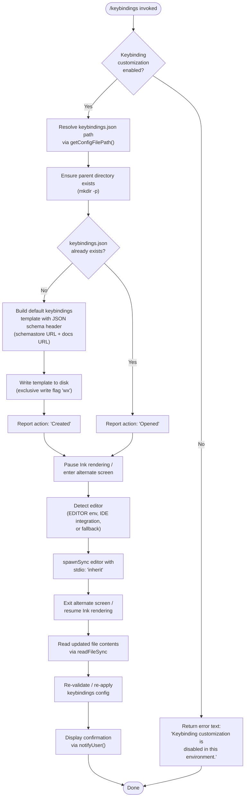

```markdown
---
type: feature-spec
feature: "keybindings"
cc_version: 2.1.179
updated: "2026-06-11"
tags: ["keybindings", "commands", "slash-commands"]
source: "bundle-analysis"
bundle_verified: true
inherited_from: 2.1.170
analysis_basis: "CC v2.1.170 bundle.js (AST extraction + Claude interpretation)"
author: "ryujaeuk <ryujaeuk@gmail.com>"
repository: "https://github.com/MyLittleLuckyDog/cc-gnothi"
license: "AGPL-3.0-only"
---

# `/keybindings`

> Analysis basis: CC v2.1.170 bundle.js (AST extraction + Claude interpretation)
> Minimum version: v2.1.170

---

## Overview

The `/keybindings` command opens (and, if necessary, creates) the user's `keybindings.json` configuration file, which controls keyboard shortcut customization for Claude Code. When invoked, the handler resolves the config file path, writes a schema-annotated template if the file does not yet exist, then launches the system editor in an alternate terminal screen so the user can edit bindings without leaving the CLI session.

---

## Registration

| Field | Value |
|---|---|
| type | `local` |
| name | `keybindings` |
| description | `Open your keyboard shortcuts file` |
| supportsNonInteractive | `false` |
| module_id | `loq` |
| load_inline | `true` |
| loc_byte | `11762102` |
| loc_byte_end | `11762279` |
| arbor_handler.name | `Akf` |
| arbor_handler.fqn | `claude-2.1.170::Akf` |
| arbor_handler.kind | `AsyncFunction` |
| arbor_handler.resolution_path | `module_id` |
| arbor_handler.n_hits | `0` |

Analysis basis: CC v2.1.170 bundle.js:+11762102

---

## Input Branching

The handler contains four or more distinct decision points (environment guard, file-existence check, editor detection, and post-edit reload), so a Mermaid flowchart is used.



---

## Behavioral Spec

### 1. Environment Guard

Before any file I/O, the handler calls `checkKeybindingCustomizationEnabled()` (identifier: `TF`, called at bundle.js:+11761362). If the function signals that keybinding customization is disabled for the current environment, the handler immediately returns a terminal text node containing the literal message `"Keybinding customization is disabled in this environment."` (bundle.js:+11761392) and exits.

```
async function keybindingsCommandHandler(context):
    if not checkKeybindingCustomizationEnabled():
        return { type: "text",
                 content: "Keybinding customization is disabled in this environment." }
```

Analysis basis: CC v2.1.170 bundle.js:+11761362, +11761379, +11761392

---

### 2. Config File Path Resolution

`resolveKeybindingsPath()` (identifier: `WfH`, called at bundle.js:+11761459) constructs the full path by joining a platform-appropriate Claude config base directory with the literal filename `"keybindings.json"` (bundle.js:+3918931). A telemetry event `tengu_keybinding_customization_release` is emitted during this resolution (bundle.js:+3918417).

```
function resolveKeybindingsPath():
    baseDir = getClaudeConfigDir()          // QM8.join internally
    return pathJoin(baseDir, "keybindings.json")
```

Analysis basis: CC v2.1.170 bundle.js:+11761459, +3918931, +3918417

---

### 3. Directory Scaffolding

The handler calls `fs.mkdir` (async, `recursive: true`) on the **dirname** of the resolved path (bundle.js:+11761476, +11761486) to ensure the parent directory exists before any write attempt.

```
async function ensureParentDir(filePath):
    dir = path.dirname(filePath)
    await fs.mkdir(dir, { recursive: true })
```

Analysis basis: CC v2.1.170 bundle.js:+11761476, +11761486

---

### 4. Default Template Generation

If the file does not yet exist, the handler builds a default keybindings template via `buildDefaultKeybindingsContent()` (identifier: `Qoq`, bundle.js:+11761543), which in turn calls `getDefaultKeybindings()` (identifier: `_kf`, bundle.js:+11761235) and `serializeToJson()` (identifier: `CH`, bundle.js:+11761252).

The generated JSON object includes a `$schema` field pointing to `"https://www.schemastore.org/claude-code-keybindings.json"` (bundle.js:+11761115) and a documentation reference to `"https://code.claude.com/docs/en/keybindings"` (bundle.js:+11761180).

```
function buildDefaultKeybindingsContent():
    defaults = getDefaultKeybindings()       // _kf: maps WW6 entries,
                                             //       trims whitespace via ZyH,
                                             //       filters via Object.entries + _.has
    return JSON.stringify({
        "$schema": "https://www.schemastore.org/claude-code-keybindings.json",
        // ... default bindings from defaults ...
    }, null, 2)
```

Analysis basis: CC v2.1.170 bundle.js:+11761543, +11761235, +11761252, +11761115, +11761180

---

### 5. File Write (Exclusive Mode)

The handler calls `fs.writeFile` (bundle.js:+11761527) with the flag `"wx"` (bundle.js:+11761572), which is the **exclusive create** flag — the write will fail if the file already exists. This prevents accidental overwrites if the file was created between the existence check and the write.

```
async function writeKeybindingsIfNew(filePath, content):
    try:
        await fs.writeFile(filePath, content, { flag: "wx", encoding: "utf-8" })
        return "Created"
    catch err if err.code == "EEXIST":
        return "Opened"        // file appeared concurrently; treat as pre-existing
```

The handler then reads the resulting action label — either `"Created"` (bundle.js:+11761694) or `"Opened"` (bundle.js:+11761685) — and uses it in the final status message.

Analysis basis: CC v2.1.170 bundle.js:+11761527, +11761572, +11761685, +11761694

---

### 6. Editor Launch (Alternate Screen)

Editor launch is handled by `openFileInEditor()` (identifier: `IQ`, bundle.js:+11761638).

```
async function openFileInEditor(filePath):
    inkInstance = getInkInstance()          // jL.get
    if not inkInstance:
        throw Error("Ink instance not found - cannot pause rendering")

    editor = resolveEditorCommand(filePath) // fU -> HD + TIf
    args   = buildEditorArgs(filePath)      // ZIf -> LLA, splits on spaces

    terminalInterface.enterAlternateScreen()
    terminalInterface.pause()
    terminalInterface.suspendStdin()

    result = child_process.spawnSync(editor, args, { stdio: "inherit" })

    terminalInterface.exitAlternateScreen()
    terminalInterface.resumeStdin()
    terminalInterface.resume()

    updatedContent = fs.readFileSync(filePath, "utf-8")
    return updatedContent
```

The `stdio: "inherit"` flag (bundle.js:+11700428) passes the terminal directly to the editor process. Ink rendering is suspended for the duration of the editor session to prevent display corruption.

Analysis basis: CC v2.1.170 bundle.js:+11761638, +11700073–11700821, +11700428

---

### 7. Editor Resolution

`resolveEditorCommand()` (identifier: `fU`, reached via `IQ`) inspects the current environment in priority order:

```
function resolveEditorCommand(filePath):
    // Check IDE integration first (identifier: HD)
    if runningInIDE():
        return ideEditorPath()

    // Then respect EDITOR / VISUAL environment variables (identifier: TIf)
    envEditor = process.env.EDITOR or process.env.VISUAL
    if envEditor:
        return envEditor

    // Fallback: platform default (e.g. "vi", "nano")
    return platformDefaultEditor()
```

When the environment type is `"IDE"` (bundle.js:+6551105), a dedicated code-editor binary path is resolved via `getIDEEditorPath()` (identifier: `y0`, bundle.js:+11700496), which lower-cases the application name and resolves its basename.

Analysis basis: CC v2.1.170 bundle.js:+11700178, +6551105, +11700496

---

### 8. Config Reload & Notification

After the editor closes, the handler calls `reloadConfig()` (identifier: `V8`, bundle.js:+11761591) to re-parse the (potentially modified) `keybindings.json`, and then `notifyUser()` (identifier: `xK`, bundle.js:+11761730) followed by `displayResult()` (identifier: `QJ`, bundle.js:+11761833) to render the outcome to the terminal.

```
function postEditActions(filePath, action):
    reloadConfig()                    // V8: re-reads and validates keybindings
    message = buildStatusMessage(action)   // "Created" or "Opened"
    notifyUser(message)               // xK -> _6 (string coercion) + Yg6 (render)
    displayResult(message)            // QJ -> Yg6
```

Analysis basis: CC v2.1.170 bundle.js:+11761591, +11761730, +11761833

---

### 9. Config Subsystem (Background)

The config read path (`B7H`) enforces a guard `"Config accessed before allowed."` (bundle.js:+3307966) and handles the following sentinel error codes during file operations:

- `"ENOENT"` (bundle.js:+3308196) — file not found; treated as empty config
- `"EEXIST"` (bundle.js:+3308811) — directory already exists; ignored during `mkdirSync`
- `"error"` severity (bundle.js:+3308517) — triggers `tengu_config_parse_error` telemetry (bundle.js:+3308597)

Backup rotation is also performed (`Date.now` + `copyFileSync`, bundle.js:+3309087, +3309105) when the config file is migrated or overwritten.

Analysis basis: CC v2.1.170 bundle.js:+3307966, +3308196, +3308597, +3308811, +3309087

---

## State & Side Effects

| Item | Detail |
|---|---|
| Telemetry | `tengu_keybinding_customization_release` (bundle.js:+3918417); `tengu_config_parse_error` (bundle.js:+3308597) |
| File created | `<claude-config-dir>/keybindings.json` — written with `wx` flag only when it does not already exist |
| Directory created | Parent directory of `keybindings.json` created recursively if missing |
| Config reload | `reloadConfig()` invoked after editor exits; in-memory keybinding state is refreshed |
| Ink / terminal | Ink rendering paused; alternate screen entered for editor session; restored on editor exit |
| Editor process | `spawnSync` with `stdio: "inherit"` blocks the Node.js event loop until the editor exits |
| JSON schema | `$schema` field pointing to schemastore URL injected into newly created files |
| Hook registration | `BSL` registers a `V78.watchFile` watcher on the keybindings file path; unwatched via `V78.unwatchFile` on cleanup (bundle.js:+3304217, +3304550) |
| appState changes | Keybindings map re-applied to runtime state after `reloadConfig()` |
| Sound | None detected |

---

## Version History

| Version | Change |
|---|---|
| v2.1.170 | Initial analysis |

---

## Common Mistakes

1. **Invoking in non-interactive mode**: The command has `supportsNonInteractive: false`. Calling it from a script or CI pipeline (where there is no TTY) will fail because the Ink instance and alternate-screen APIs are unavailable.
2. **Editing the file externally while the watcher is active**: The file watcher (`BSL`/`V78.watchFile`) will trigger a reload automatically on external changes; double-saving may cause a visible flicker or a brief config inconsistency if the watcher fires while the editor is still writing.
3. **Expecting immediate effect without editor exit**: The keybindings are reloaded only **after** `spawnSync` returns (i.e., after you close the editor). Changes are not applied live while the editor is open.
4. **Breaking JSON schema validation**: The generated template references the schemastore schema. Introducing unknown keys or wrong value types will cause `tengu_config_parse_error` telemetry to fire and may silently discard invalid entries on reload.
5. **Environment with disabled customization**: If the runtime environment flag causes `checkKeybindingCustomizationEnabled()` to return false, the command silently returns an explanatory message rather than throwing — callers should check the returned text type, not an exception.

---

## Appendix — Identifier Mapping

> For bundle debugging only. Identifiers change across versions.

| Identifier | Role |
|---|---|
| `Akf` | Main async handler for `/keybindings` command (arbor_handler) |
| `TF` | `checkKeybindingCustomizationEnabled` — environment feature-flag check |
| `Y6` | Config system initializer / feature-flag resolver |
| `uP6` | Feature-flag sub-resolver (path A) |
| `mP6` | Feature-flag sub-resolver (path B) |
| `Lm` | Config state accessor |
| `nu` | Low-level config getter utility |
| `D78` | Config entry dispatcher / cache lookup |
| `Gw_` | Config event emitter / experiment tracker |
| `WT_` | Config write helper |
| `h6` | File-watcher manager (open + watch cycle) |
| `n6` | Config path resolver |
| `hT_` | Config value transformer |
| `B7H` | Config file read/write with error handling and backup rotation |
| `BSL` | Keybindings file watcher (watchFile / unwatchFile lifecycle) |
| `WfH` | `resolveKeybindingsPath` — joins config base dir with `keybindings.json` |
| `Qoq` | `buildDefaultKeybindingsContent` — assembles JSON template |
| `_kf` | `getDefaultKeybindings` — maps and filters default binding entries |
| `ZyH` | String trimmer used on key names (trims spaces) |
| `H` | General string utility (also random/timeout helper in other contexts) |
| `_` | Low-level filesystem wrapper (`statSync`, `readFileSync`, `includes`) |
| `CH` | `serializeToJson` — wraps `JSON.stringify` |
| `V8` | `reloadConfig` — re-parses keybindings file and updates runtime state |
| `IQ` | `openFileInEditor` — alternate-screen + spawnSync orchestrator |
| `fU` | `resolveEditorCommand` — selects editor binary |
| `HD` | IDE editor path resolver |
| `ZIf` | Editor argument builder |
| `LLA` | Filename/extension analyzer for editor args |
| `f9` | String index/slice utility (used in extension parsing) |
| `A` | Terminal interface abstraction (alternate screen, pause, resume) |
| `f` | Ink instance wrapper (close, finally) |
| `q` | Ink/stream handle |
| `L` | Async cleanup tracker (add/delete/finally) |
| `y0` | `getIDEEditorPath` — resolves editor path within IDE integration |
| `xK` | `notifyUser` — renders post-edit status notification |
| `_6` | String coercion utility |
| `Yg6` | Terminal render helper (used by both `xK` and `QJ`) |
| `QJ` | `displayResult` — final result display function |

---

Note: index built via Arbor fallback; some signals (telemetry, literals) may be missing — see arbor-fallback.js.
```