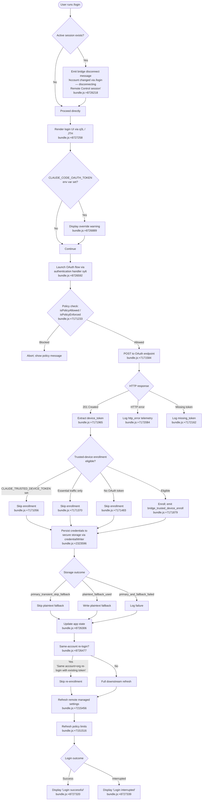

# `/login`

> Analysis basis: CC v2.1.178 bundle.js (AST extraction + Claude interpretation)
> Minimum version: v2.1.178

---

## Overview

The `/login` command initiates an interactive OAuth-based sign-in flow that authenticates the user with their Anthropic account, persists the resulting credentials to secure storage, and refreshes downstream subsystems (policy limits, remote managed settings, trusted-device enrollment) to reflect the newly active identity. It also handles account-switching: when invoked while a different session is already active, it disconnects any live Remote Control bridge before beginning the new authentication sequence.

---

## Registration

| Field | Value |
|---|---|
| type | `local-jsx` |
| name | `login` |
| description | `Switch Anthropic accounts \| Sign in with your Anthropic account` |
| loc_byte | `11980379` |
| loc_byte_end | `11980599` |
| loc_line | `7950` |
| module_id | `yEq` |
| load_inline | `true` |
| arbor_handler.name | `y4K` |
| arbor_handler.fqn | `claude-2.1.178::y4K` |
| arbor_handler.kind | `Function` |
| arbor_handler.resolution_path | `direct` |
| arbor_handler.n_hits | `2` |

Analysis basis: CC v2.1.178 bundle.js:+11980379

The registration occupies the byte range `(11980379, 11980599)`. The handler is resolved by Arbor as `y4K` via a `direct` resolution path (the symbol falls inside the registration byte range). The call-graph entry point `q3L` is the top-level JSX render component wrapping the authentication UI; it delegates to `jTH` (the core login logic function) and to `JTH` (the UI shell component).

---

## Input Branching

The command presents more than three distinct execution paths (new login vs. account-switch, OAuth env-var override detection, trusted-device enrollment eligibility, remote-settings and policy-limits refresh outcomes), so a Mermaid flowchart is used.



---

## Behavioral Spec

### Top-level render and state wiring

```
function loginCommandRenderer(props):
    // q3L — JSX shell; bundle.js:+8727258
    appState = getAppState()
    uiElement = createElement(loginShellComponent, props)
    return uiElement
```

Analysis basis: CC v2.1.178 bundle.js:+8727258

---

### Core login logic

```
function coreLoginHandler(context):
    // jTH — bundle.js:+8725808

    // 1. Notify existing API-key consumers of the impending change
    onChangeAPIKey()                         // bundle.js:+8725808
    applyMessageOp("update")                 // bundle.js:+8725827 (literal "update": +8725850)

    // 2. Disconnect Remote Control bridge if account is switching
    if remoteControlActive:
        log("[bridge:repl] Account changed via /login — disconnecting Remote Control session")
        // bundle.js:+8726218
        disconnectRemoteControl()            // via DE6, bundle.js:+8726438

    // 3. Snapshot current app state
    prev = getAppState()                     // bundle.js:+8726133

    // 4. Run authentication sequence
    authResult = runAuthSequence(context)    // sy6, bundle.js:+8726592

    // 5. On success, commit new state
    setAppState(authResult)                  // bundle.js:+8726306

    // 6. Trusted-device re-enrollment guard
    if sameAccountAndOrgReLogin(prev, authResult):
        log("[trusted-device] Same account+org re-login with existing token, skipping re-enrollment")
        // bundle.js:+8726485
    else:
        enrollTrustedDevice(authResult)

    // 7. Trigger downstream refreshes
    refreshRemoteSettings()                  // Lo_, bundle.js:+8726580
    refreshPolicyLimits()                    // sychronised via sy6/tK, bundle.js:+7172303

    // 8. Finalise UI state
    finaliseLoginUI()                        // KC6 + fC6, bundle.js:+8726663
```

Analysis basis: CC v2.1.178 bundle.js:+8725808

---

### Authentication sequence (OAuth flow)

```
function runAuthSequence(context):
    // sy6 — bundle.js:+8726592

    // Guard: policy enforcement
    if not isPolicyAllowed(context):          // bundle.js:+7171233
        abort("policy blocked")
    if isPolicyEnforced(context):             // bundle.js:+7171256
        enforceRestrictions()

    // Guard: env-var override
    if CLAUDE_TRUSTED_DEVICE_TOKEN is set:
        log("[trusted-device] CLAUDE_TRUSTED_DEVICE_TOKEN env var is set, skipping enrollment")
        // bundle.js:+7171056

    if essentialTrafficOnly:
        log("[trusted-device] Essential traffic only, skipping enrollment")
        // bundle.js:+7171370

    // Initiate OAuth POST
    response = httpPost(oauthEndpoint,
        headers: {
            "Content-Type": "application/json",   // bundle.js:+7171734
            "User-Agent": userAgent
        },
        timeout: 10000,                            // bundle.js:+7171777
        retryDelay: 500                            // bundle.js:+7171803
    )

    if response.status == 201:                     // bundle.js:+7171965
        token = extractToken(response)
        if token missing:
            logError("missing_token")              // bundle.js:+7172263
            raise MissingTokenError
        enrollTrustedDevice(token)                 // emits bridge_trusted_device_enroll
    elif response is HTTP error:
        logError("http_error")                     // bundle.js:+7172084
        raise HttpError
    elif no OAuth token after flow:
        log("[trusted-device] No OAuth token, skipping enrollment")
        // bundle.js:+7171483

    // Persist credentials
    writeCredentials(token)                        // tK → KC1, bundle.js:+7172303

    return authResult
```

Analysis basis: CC v2.1.178 bundle.js:+7171584

---

### Credential persistence

```
function writeCredentials(token):
    // tK → KC1 — bundle.js:+7172303 / +2323593

    attempt primarySecureStorage(token):
        on transient failure:
            emit "secure_storage_credentials_write" / "primary_transient_skip_fallback"
            // bundle.js:+2323694
            return  // do NOT fall back to plaintext

        on success:
            emit "secure_storage_credentials_write"
            return

    attempt plaintextFallback(token):
        on success:
            emit "secure_storage_credentials_write" / "plaintext_fallback_used"
            // bundle.js:+2323843
        on failure:
            emit "secure_storage_credentials_write" / "primary_and_fallback_failed"
            // bundle.js:+2323946
```

Analysis basis: CC v2.1.178 bundle.js:+2323596

---

### Remote managed settings refresh

```
function refreshRemoteSettings():
    // Lo_ → _GH → O6 / zF7 / c9q — bundle.js:+8726580

    // Immediately re-fetch using the new auth credentials
    fetchRemoteSettings(auth = newToken)

    // Expected log on success:
    //   "Remote settings: Refreshed after auth change"  (bundle.js:+7215456)

    // Background polling resumes via interval controller YE8
    // using setInterval / clearInterval (bundle.js:+7145509 / +7145577)
```

Analysis basis: CC v2.1.178 bundle.js:+7215456

---

### Policy limits refresh

```
function refreshPolicyLimits():
    // dy6 → PE8 → J1q / j1q — bundle.js:+8725918

    // Invalidate in-flight tracker
    clearInFlightRequests()

    // Fetch new policy-limits payload
    result = fetchPolicyLimits(auth = newToken)
    // telemetry: tengu_policy_limits_fetch (bundle.js:+7149707)

    // Log on success:
    //   "Policy limits: Refreshed after auth change"  (bundle.js:+7151516)

    // Outcomes:
    //   succeeded → "Policy limits: Applied new restrictions successfully" (+7150518)
    //   stale_cache_used → "Policy limits: Using stale cache after fetch failure" (+7150134)
    //   304 → "Policy limits: Cache still valid (304 Not Modified)" (+7150299)
    //   unexpected_error → "Policy limits: Using stale cache after error" (+7150710)
```

Analysis basis: CC v2.1.178 bundle.js:+7151516

---

### UI shell component

```
function loginUIShell(state):
    // JTH — bundle.js:+8727385

    [loginState, setLoginState] = useState()       // bundle.js:+8727415
    memoCache = useRef(Symbol.for("react.memo_cache_sentinel"))
                                                   // bundle.js:+8727444 / +8727455

    // Register keyboard handler (confirm:no binding)
    registerInputHandler("confirm:no")             // bundle.js:+8727722
    // Interrupt key: Esc → "cancel"               // bundle.js:+8727945 / +8727976

    // Render phases driven by loginState (integer flags 4–19):
    //   4  → initial prompt         bundle.js:+8727600
    //   5  → credentials entry      bundle.js:+8727632
    //   6–9, 11–19 → progress/error states
    // Final UI strings:
    //   "Login successful"           bundle.js:+8727320
    //   "Login interrupted"          bundle.js:+8727339
    //   "Login"                      bundle.js:+8728431
    //   "Press " + key + " again to exit"   bundle.js:+8727838

    // Warning banner (when env override detected):
    //   "Warning: CLAUDE_CODE_OAUTH_TOKEN is set..."  bundle.js:+8726889

    return createElement(loginPanel, { state: loginState })
```

Analysis basis: CC v2.1.178 bundle.js:+8727385

---

### API-key provider resolution (sub-flow of credential loading)

```
function resolveAPIKeyProvider(config):
    // sr — bundle.js:+7209443

    // Provider type literals (bundle.js:+2120705 – +2120962):
    //   "bedrock", "foundry", "anthropicAws", "mantle", "vertex", "firstParty"

    // Network-tier literals (bundle.js:+7209477 – +7209768):
    //   "gateway", "local-agent", "remote_cowork", "enterprise", "team"

    // Auth env vars checked in order (bundle.js:+3282205 – +3282677):
    //   ANTHROPIC_AUTH_TOKEN
    //   CLAUDE_CODE_OAUTH_TOKEN
    //   CLAUDE_CODE_OAUTH_TOKEN_FILE_DESCRIPTOR
    //   CCR_OAUTH_TOKEN_FILE
    //   ANTHROPIC_API_KEY (also CLAUDE_CODE_API_KEY_FILE_DESCRIPTOR: +2146163)

    // Required error if none set:
    //   "ANTHROPIC_API_KEY, ANTHROPIC_AUTH_TOKEN, CLAUDE_CODE_OAUTH_TOKEN,
    //    or WIF env vars (ANTHROPIC_FEDERATION_RULE_ID + ANTHROPIC_ORGANIZATION_ID) required"
    //    bundle.js:+3283902

    // Profile types: "profile", "user_oauth", "profile-implicit"  (+3282596, +3280207, +3280134)
    // claude.ai domain constant: bundle.js:+3282677

    return resolvedProvider
```

Analysis basis: CC v2.1.178 bundle.js:+7209443

---

## State & Side Effects

| Item | Detail |
|---|---|
| Telemetry — `tengu_policy_limits_fetch` | Emitted on each policy-limits network fetch (bundle.js:+7149707) |
| Telemetry — `tengu_policy_limits_cache_write_failed` | Emitted when local policy-limits cache write fails (bundle.js:+7149110) |
| Telemetry — `tengu_remote_settings_401_force_refresh_retry` | Emitted when remote-settings returns 401 and a forced retry is triggered (bundle.js:+7212913) |
| Telemetry — `tengu_managed_settings_security_dialog_shown` | Emitted when the managed-settings security consent dialog is displayed (bundle.js:+7208525) |
| Telemetry — `tengu_managed_settings_security_dialog_accepted` | Emitted when the user accepts the security dialog (bundle.js:+7208209) |
| Telemetry — `tengu_managed_settings_security_dialog_rejected` | Emitted when the user rejects the security dialog (bundle.js:+7208259) |
| Telemetry — `tengu_disable_bypass_permissions_mode` | Emitted when bypass-permissions mode is blocked during session init (bundle.js:+11251918) |
| Telemetry — `tengu_auto_mode_config` | Emitted when auto-mode configuration is evaluated post-login (bundle.js:+11249807) |
| Telemetry — `tengu_feature_ok` / `tengu_feature_bad` / `tengu_feature_sad` | Emitted by feature-flag evaluation layer touched during login context load (bundle.js:+1020153 / +1020220 / +1020301) |
| Telemetry — `tengu_daemon_config_reload` | Emitted when the daemon config is reloaded after credential change (bundle.js:+17081946) |
| Telemetry — `tengu_keybinding_fallback_used` | Emitted if the UI must fall back to a default key binding (bundle.js:+4236179) |
| Credential storage | Writes OAuth token to primary secure storage; falls back to plaintext if primary fails transiently (bundle.js:+2323596) |
| App state mutation | `setAppState` called with new auth payload (bundle.js:+8726306) |
| Remote Control bridge | Disconnected on account switch; log message emitted (bundle.js:+8726218) |
| Remote managed settings | Re-fetched immediately on auth change via `Lo_` / `zF7` / `c9q` (bundle.js:+7215456) |
| Policy limits | Re-fetched via `dy6` / `PE8` / `j1q` chain (bundle.js:+7151516) |
| Trusted-device enrollment | POST to enrollment endpoint; token stored; skipped when env var, essential-traffic flag, or no-OAuth-token conditions apply (bundle.js:+7171879) |
| Background polling | Remote-settings interval (`setInterval`/`clearInterval`) and policy-limits background polling restarted after auth change (bundle.js:+7145509) |
| Hook registration | Keyboard handler registered via `I_` → `f.registerHandler` for the `confirm:no` binding (bundle.js:+4192752) |
| Sound | <!-- TODO: not found in depth-2 traversal; needs --depth 4 --> |

---

## Version History

| Version | Change |
|---|---|
| v2.1.178 | Initial analysis |

---

## Common Mistakes

1. **`CLAUDE_CODE_OAUTH_TOKEN` environment variable left set after login** — The CLI displays a warning (bundle.js:+8726889) because the env var takes precedence over the stored token at runtime. After `/login` completes successfully, unset `CLAUDE_CODE_OAUTH_TOKEN` in the shell for the new credentials to take effect.

2. **Expecting immediate API availability after login on alternate auth providers** — When `ANTHROPIC_API_KEY` or WIF environment variables (e.g. `ANTHROPIC_FEDERATION_RULE_ID` + `ANTHROPIC_ORGANIZATION_ID`) are present, those override OAuth credentials; `/login` cannot displace them unless the env vars are first cleared.

3. **Interrupted login leaves partial state** — If the user cancels during the OAuth flow (Esc / Ctrl-C), the UI reports "Login interrupted" (bundle.js:+8727339) but previously stored credentials remain active. There is no automatic rollback; the prior session continues.

4. **Assuming trusted-device enrollment always runs** — Three distinct conditions suppress enrollment silently: the `CLAUDE_TRUSTED_DEVICE_TOKEN` env var being set, the "essential traffic only" network-tier flag being active, and the absence of an OAuth token at enrollment time. All three are logged but produce no user-visible error.

5. **Re-logging in to the same account and expecting a re-enrollment** — A same-account, same-organisation re-login with an existing valid token explicitly skips trusted-device re-enrollment (bundle.js:+8726477 / +8726485).

---

## Appendix — Identifier Mapping

> For bundle debugging only. Identifiers change across versions.

| Identifier | Role |
|---|---|
| `jTH` | Core login logic function (API-key change notification, state mutation, bridge disconnect, downstream refresh orchestration) |
| `y4K` | Arbor-resolved top-level handler for the `/login` command registration |
| `q3L` | JSX render wrapper (call-graph entry point); assembles the login UI tree |
| `JTH` | Login UI shell component (useState, keyboard handler, render-phase state machine) |
| `MJ` | Inner UI component beneath `JTH`; wires store subscription and memoisation |
| `VA6` | Post-authentication orchestrator: triggers remote-settings and policy-limits refresh chains |
| `sy6` | OAuth authentication sequence: policy guard, HTTP POST, token extraction, trusted-device enrollment |
| `Lo_` | Remote-settings refresh initiator (called after auth change) |
| `c9q` | Remote-settings poll controller (setInterval / clearInterval manager) |
| `zF7` | Remote-settings fetch-and-apply cycle |
| `dy6` | Policy-limits refresh initiator (called after auth change) |
| `PE8` | Policy-limits load orchestrator |
| `j1q` | Policy-limits fetch worker (HTTP, cache write, telemetry) |
| `J1q` | Policy-limits background-poll controller |
| `tK` | Credential write dispatcher (routes to `KC1`) |
| `KC1` | Secure-storage credential writer (primary + plaintext fallback) |
| `sr` | API-key / auth-provider resolver |
| `SO` | Auth-configuration loader (reads env vars, `flagSettings`, `apiKeyHelper`) |
| `Qj` | Auth-profile builder (`profile-implicit`, `user_oauth`) |
| `co_` | Remote managed-settings full fetch-and-validation cycle |
| `g9q` | Remote managed-settings HTTP fetch worker |
| `$F7` | Remote settings fetch orchestrator with retry/back-off |
| `HqH` | Exponential back-off calculator (`Math.min`, `Math.pow`, `Math.random`) |
| `u9q` | Managed-settings security-check and consent-dialog handler |
| `b9q` | Managed-settings approval state tracker |
| `HF7` | Managed-settings requester queue manager |
| `rDH` | Settings validation and merge helper |
| `F9q` | Settings cache file writer (atomic write via `datasync`) |
| `q9q` | Settings payload hasher (`sha256`) |
| `vo_` | Recursive settings-object normaliser |
| `s7H` | Credential cache clear helper (`Ul6.clear`, `We8.clear`) |
| `Oz` | Cache-map clearer |
| `alH` | Stale-cache invalidation helper |
| `N` | REPL / prompt executor (orchestrates sub-agent turns) |
| `LM4` | File-upload / context-injection helper |
| `d4` | Path sanitiser (replaces and redacts paths, `[REDACTED]` literal: +204042) |
| `VdH` | Feature-flag value resolver |
| `xH` | JSON serialiser wrapper (`JSON.stringify`) |
| `RH` | Message-queue writer / error logger |
| `jA` | Error-string normaliser |
| `qq` | Essential-traffic queue consumer |
| `RQ4` | Queue shift-and-push cycle manager |
| `N1H` | Session teardown handler (clears intervals, process listeners, caches) |
| `$sH` | Full cleanup sweep (clears `uXH`, `i$8`, `ZG6`, `ny_`, `xg` maps) |
| `ty_` | Interval and process-listener remover |
| `Xp` | Settings reader entry-point |
| `qp` | Settings object deserialiser |
| `ib` | Settings validator |
| `Z4` | Conversation-state snapshot helper |
| `Hw` | Conversation serialiser |
| `DE6` | Remote Control bridge disconnect trigger |
| `_GH` | Active-session state reader |
| `O6` | Session subscription manager |
| `o$8` | Per-subscriber notification helper |
| `zR` | Subscriber notification dispatcher |
| `a79` | Feature-value subscriber helper |
| `bB7` | React-render-context accessor |
| `_o_` | Alternative render-context accessor |
| `k1` | OAuth URL builder / validator |
| `JgA` | Environment-name resolver |
| `ON4` | OAuth client-ID resolver |
| `Ee6` | OAuth response parser |
| `TH` | String coercion utility |
| `KC6` | Post-login permission-mode applicator |
| `MS8` | Permission-mode bootstrap |
| `sy_` | Session permission-state reader |
| `$k6` | Permission-update dispatcher |
| `dO` | Permission rule mutator (`setMode`, `addRules`, `replaceRules`, `removeRules`) |
| `b_` | Init-flags reader (`working_directory`, `allowed_tools`, `disallowed_tools`, `permission_mode`, `effort`, `model`) |
| `tp8` | Allowed-tools initialiser |
| `ep8` | Disallowed-tools initialiser |
| `Nx` | Permission-mode gate |
| `fC6` | Feature-flag reload after login |
| `LC6` | Auto-mode configuration evaluator |
| `gn` | Feature-subscription helper |
| `a$8` | Feature-value accessor |
| `d1` | Model-tier resolver |
| `Y1` | Model-name normaliser |
| `kO` | Model-name → tier mapper |
| `BJH` | Model availability guard (claude-3-*, claude-opus-4-*, claude-sonnet-4-*, claude-haiku-4-*) |
| `f1` | Application-inference-profile detector |
| `KG6` | Model-string prefix builder |
| `k76` | Auto-mode gate notification dispatcher |
| `Um` | Auto-mode gate UI message builder |
| `Y` | Supervisor / heartbeat config writer |
| `hVH` | Config file stat and read helper |
| `$ZK` | Config diff calculator |
| `L` | Supervisor session handle |
| `T` | Heartbeat timer controller |
| `E` | Render-frame rate controller |
| `R14` | Heartbeat event emitter |
| `V` | Scroll / viewport controller |
| `oMH` | `permission_mode_changed` event emitter |
| `t4` | Structured event emitter (event.name, event.timestamp, event.sequence) |
| `WzH` | Bulk-event mapper |
| `FQH` | Timestamp stamper (`Date.now`) |
| `lC_` | AppState context reader |
| `$OH` | AppState reducer and effect coordinator |
| `Mi` | Store-subscription synchroniser |
| `c79` | Async-state resolver |
| `az` | Store-state selector |
| `LS8` | Input-parsing entry point (model / options text) |
| `lw` | Raw-input trimmer and tokeniser |
| `q4` | Input-string replacer |
| `zR1` | Token normaliser |
| `oS` | Options-block parser |
| `OR1` | Options-line tokeniser |
| `JK` | Model-options parser |
| `uN` | Unsupported-option detector |
| `_48` | Option-chain evaluator |
| `RW` | Full settings/model-request parser |
| `QP_` | Settings-block parser |
| `f48` | Settings-field extractor (model, effort, flag_settings, etc.) |
| `dD` | Dialog context reader |
| `I_` | Input-handler registrar |
| `QD` | REPL context reader |
| `C3` | Input-state machine |
| `y09` | Key-press dispatcher |
| `vx_` | UI interaction handler (Ctrl-C → `app:interrupt`, Ctrl-D → `app:exit`) |
| `RR` | Resize / layout helper |
| `s4` | Ref-and-effect input binder |
| `Ex` | Timeout-based interaction tracker |
| `w` | Forced-shutdown handler (`process.exit`, `z.abort`) |
| `FW` | Network-tier initialiser |
| `JG6` | Network-tier validator |
| `eaH` | Auth-field accessor |
| `wG6` | Auth-field batch setter |
| `LF7` | Remote-settings URL builder |
| `Fz` | Settings-schema validator |
| `vq8` | Provider feature-flag loader |
| `niH` | Feature-flag normaliser |
| `LNH` | Provider-config merger |
| `tE8` | Settings-change notifier (`wh.notifyChange`, `policySettings`) |
| `LtA` | Settings-notification payload builder |
| `M5H` | Auth-type classifier (`wif`, `oauth`, `api_key`) |
| `QS1` | Auth-token existence check |
| `$5H` | Auth-type fallback |
| `xJH` | Credentials file-path resolver |
| `K26` | Credentials file reader |
| `w1q` | File-freshness checker (`Date.now`, `statSync`) |
| `q26` | Credentials format validator |
| `qB7` | Credentials integrity hasher |
| `KB7` | Credentials-type dispatcher |
| `fB7` | Credentials-fetch retry scheduler |
| `MB7` | Credentials file writer (`NxH.writeFile`) |
| `$B7` | Credentials write finaliser |
| `OB7` | Policy-limits poll worker |
| `ur_` | Policy-limits timeout guard |
| `Ur_` | Policy-limits timeout constant holder |
| `JE8` | Policy-limits load-promise race |
| `ab` | Auth-state snapshot reader |
| `UqH` | Policy-limits load timeout message handler |
| `PE8` | Policy-limits load orchestrator |
| `F4` | Managed-settings rejection handler |
| `d9q` | Managed-settings empty-sentinel writer |
| `m9q` | Managed-settings outcome dispatcher |
| `GSH` | Auth-configuration error accumulator |
| `nb` | API-key slicer (last 20 chars: +2147845 → value 20) |
| `XX6` | `CLAUDE_CODE_API_KEY_FILE_DESCRIPTOR` reader |
| `E4` | Global-state accessor |
| `S6` | HTTP-request executor with retry |
| `S_` | Platform / capability detector |
| `L6` | String coercion helper |
| `n6` | URL builder |
| `kT` | HTTP-verb dispatcher |
| `$k_` | Request-header builder |
| `_MH` | Request-body serialiser |
| `wnf` | Response-body reader |
| `vL` | Config-object reader |
| `kn6` | `--bare` flag reader (literal: +68452) |
| `fv` | `flagSettings` extractor |
| `b8` | Flag-value normaliser |
| `rA` | Reactive-state signal updater |
| `OG6` | `apiKeyHelper` resolver |
| `tP` | `none` / provider-mode guard |
| `cQH` | `claude-vscode` client detector (literal: +56562) |
| `R_` | Client-type constant |
| `XZ1` | File-descriptor opener |
| `INH` | File read helper |
| `_bA` | Buffer-to-string converter |
| `P__` | Path sanitiser |
| `G__` | File-stream opener |
| `F9` | App-exit-hook registrar (`XSA.register`) |
| `fd` | Feature-detection helper |
| `x9q` | Remote-settings consent-pending detector |
| `AM4` | Sub-agent spawner (`my`, `D__`, `WSA`) |
| `py` | Prompt-string builder |
| `LM4` | File-upload / context-injection helper |
| `B9q` | Managed-settings diff applicator |
| `PA6` | Settings-key normaliser (`PeH.has`, `toUpperCase`) |
| `BE8` | Settings-schema key enumerator |
| `O9q` | Settings-merge validator |
| `l0` | Settings-apply dispatcher |
| `HQ` | Settings-write confirmer |
| `K` (call-graph) | Column-padding utility (`padEnd`) |
| `f` (call-graph) | In-flight-request tracker (`q.add`, `q.delete`) |
| `q` (call-graph) | Data-channel writer |
| `WI` | Timeout-based flush scheduler |
| `Qo_` | Remote-settings load-promise gater (consent-dialog pending guard) |
| `YE8` | Remote-settings background-poll interval controller |
| `vG6` | Subscription-state reader |
| `NG6` | Subscription-state writer |
| `KC1` | Secure-storage credential writer |
| `XkH` | Async credential read helper |
| `d6` | Secondary state-reader |
| `bH` | Feature-OK / feature-BAD evaluator |
| `dH` | Feature-table lookup |
| `SH` | State-update helper |
| `lw` | Input trimmer |
| `ErH` | Input error handler |
| `AGH` | Post-login trusted-device re-enrollment guard |

Note: index built via Arbor fallback; some signals (telemetry, literals) may be missing — see arbor-fallback.js.