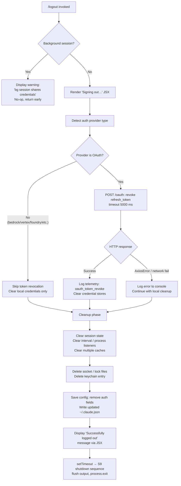

# `/logout`

> Analysis basis: CC v2.1.179 bundle.js (AST extraction + Claude interpretation)
> Minimum version: v2.1.179

---

## Overview

The `/logout` command signs the user out of their Anthropic account by revoking the OAuth refresh token, clearing stored credentials, and tearing down session state. It is a `local-jsx` command (renders a React component for its UI) and performs a multi-step async shutdown that includes token revocation via an HTTP POST, keychain credential removal, socket/lock file cleanup, and a timed process exit.

---

## Registration

| Field | Value |
|---|---|
| type | `local-jsx` |
| name | `logout` |
| description | `Sign out from your Anthropic account` |
| module_id | `D6A` |
| load_inline | `true` |
| loc_byte | `11997754` |
| loc_byte_end | `11998038` |
| loc_line | `7963` |
| arbor_handler.name | `UqL` |
| arbor_handler.fqn | `claude-2.1.179::UqL` |
| arbor_handler.kind | `AsyncFunction` |
| arbor_handler.resolution_path | `module_id` |
| arbor_handler.n_hits | `0` |

Analysis basis: CC v2.1.179 bundle.js:+11997754

---

## Input Branching

The command has four distinct execution branches based on session context and API response outcomes.



Analysis basis: CC v2.1.179 bundle.js:+8133580 (handler entry `UqL`), +8132124 (main executor `E96`)

---

## Behavioral Spec

### 1. Background-Session Guard

Before performing any logout action, the handler checks whether the current process is a background session (mode string `"bg"`, `"daemon"`, or `"daemon-worker"`).

```
function checkBackgroundSession(sessionMode):
    if sessionMode in ["bg", "daemon", "daemon-worker"]:
        display message:
            "This background session shares credentials with other sessions;
             /logout here has no effect. Run /logout from your main terminal
             to sign out."
        return  // early exit; no credential changes made
```

Analysis basis: CC v2.1.179 bundle.js:+8133688 (literal), +2296485–2296509 (mode strings)

---

### 2. Auth-Provider Detection

The handler reads the stored provider type to decide whether to attempt OAuth token revocation.

```
function detectAuthProvider(config):
    providerType = config.authProvider
    // Known non-OAuth providers (skip revocation):
    //   "bedrock", "foundry", "anthropicAws", "mantle", "vertex", "firstParty"
    if providerType is one of the above:
        return { skipRevocation: true }
    // Default path: treat as OAuth ("oauth" field present)
    return { skipRevocation: false, oauthConfig: config.oauth }
```

Analysis basis: CC v2.1.179 bundle.js:+2121450 (provider-type resolver `u_`), +2121490–2121707 (provider string literals)

---

### 3. OAuth Token Revocation

When revocation is needed, an HTTP POST is sent to the OAuth endpoint with the stored `refresh_token`. A 5000 ms timeout is applied.

```
async function revokeOAuthToken(oauthConfig):
    endpoint = resolveOAuthEndpoint(oauthConfig)   // uses R1 URL builder
    try:
        response = await httpClient.post(endpoint, {
            grant_type: "refresh_token",
            token: oauthConfig.refreshToken
        }, {
            headers: { "Content-Type": "application/json" },
            timeout: 5000
        })
        recordTelemetry("oauth_token_revoke")       // loc_byte 2133612
        return { success: true }
    catch AxiosError as err:
        if httpClient.isAxiosError(err):
            logError("network", err)                // continues; not fatal
        return { success: false }
```

Analysis basis: CC v2.1.179 bundle.js:+8132335 (`ek`), +2133444 (`jA.post`), +2133602 (5000 ms timeout), +2133612 (`oauth_token_revoke` literal), +2133649 (`isAxiosError`)

OAuth endpoint URL builder (`R1`) validates against an approved-endpoint list; supplying `CLAUDE_CODE_CUSTOM_OAUTH_URL` with an unapproved host throws: `"CLAUDE_CODE_CUSTOM_OAUTH_URL is not an approved endpoint."` (bundle.js:+860034).

---

### 4. Session-State Teardown (`ZS6` group)

After (or instead of) token revocation, a coordinated teardown runs across several subsystems.

```
function teardownSession():
    clearCacheStore(vSH)      // _59.clear
    clearCacheStore(SJH)
    runIntervalCleaner(vsH):
        // clearInterval on all tracked intervals
        // process.removeListener("exit"), process.removeListener("beforeExit")
        // QXH.clear, xO8.clear, kG6.clear, Sy_.clear, hg.clear
    emitShutdownEvent(EsH)    // G1H → EsH.emit
    flushErrorLog(SH)         // drains hlH queue, calls ks.logError
    cleanupSocketFiles(oqq):
        // Jy6 → UtA (socket index lookup)
        // mA6.unlink on socket file
    cleanupLockFiles(Ao_):
        // clearTimeout on lock timeout (Ho_)
        // CxH.unlink on lock file
        // gJH constructs lock path via Ln1.join + z_
```

Analysis basis: CC v2.1.179 bundle.js:+8132191 (`ZS6`), +3322876 (`_59.clear`), +3375055–3375815 (exit listener removal), +7231438 (`mA6.unlink`), +7169066 (`CxH.unlink`)

---

### 5. Credential Removal from Config and Keychain

```
async function removeCredentials(configPath):
    // Attempt to delete keychain entry (Py_ → tE1 → Hy)
    try:
        keychainService = "claude-code-user"          // loc_byte 2147764
        hashKey = sha256(normalize(configPath, "NFC")) // first 8 hex chars
        deleteKeychainEntry(keychainService, hashKey)
    catch err:
        log("Failed to delete keychain entry")        // loc_byte 2148523

    // Write updated config, removing auth fields (J8 → eO8)
    // Safety guard: if re-read config is missing auth that cache has,
    // refuse write to protect ~/.claude.json (GH #3117)
    config = reReadConfig()
    if cacheHasAuth AND not config.hasAuth:
        logTelemetry("tengu_config_auth_loss_prevented")
        throw Error("saveConfigWithLock: re-read config is missing auth…")
    config.auth = null
    writeConfigWithLock(configPath, config)
```

Analysis basis: CC v2.1.179 bundle.js:+8132505 (`Py_`), +2147764 (`claude-code-user`), +2147584 (`sha256`), +2148523 (keychain error string), +3398145 (GH #3117 guard string), +3397954 (`tengu_config_stale_write`), +3398297 (`tengu_config_auth_loss_prevented`)

---

### 6. Success Display and Process Exit (`UqL` / `U4` / `S9`)

```
async function renderLogoutUI(isOAuthMode):
    if isOAuthMode:
        render JSX element with:
            heading:  "Signing out…"           // loc_byte 8134043
            category: "logout"                 // loc_byte 8134076
            type:     "oauth"                  // loc_byte 8134107

    await doLogoutWork()   // steps 3–5 above

    display: "Successfully logged out from your Anthropic account."
             // loc_byte 8133889
    await flushOutput()    // FxH: J$H.writeSync, unmount Ink component
    setTimeout(() => shutdownProcess(), delay)   // loc_byte 8133952
```

The shutdown sequence (`S9`) performs:
1. `FxH` — flushes remaining output bytes to stdout (`J$H.writeSync`), unmounts the Ink React tree (`H.unmount`)
2. `Io_` — writes a final status line (`J$H.writeSync` + `J6.dim`)
3. `So_` — clears the exit timeout, then calls `process.exit` (or `process.kill("SIGKILL")` on timeout)
4. `a9q` — `Promise.allSettled` over remaining async tasks before exit
5. `qdH` — drains `oSA` output queue before exit

Analysis basis: CC v2.1.179 bundle.js:+8133864 (`Y6A.createElement`), +8133889 (success string), +8133952 (`setTimeout`), +7193080 (`J$H.writeSync`), +7193745 (`process.exit`), +7193770 (`process.kill`)

---

### 7. Storage Write Path (credential persistence)

The config write function (`pC1` / storage layer) uses exponential back-off locking (10 ms → 100 ms → 1000 ms → 15000 ms) and a `.storage-write` lock suffix.

```
async function writeWithLock(path, data):
    lockPath = path + ".storage-write"       // loc_byte 2323241
    retryDelays = [10, 100, 1000, 15000]    // loc_bytes 2323289–2323330
    for delay in retryDelays:
        acquired = tryAcquireLock(lockPath)
        if acquired: break
        await sleep(delay)
    if not acquired:
        emitTelemetry("tengu_config_lock_contention")
    writeFileSync(path, JSON.stringify(data))
    releaseLock(lockPath)
```

Analysis basis: CC v2.1.179 bundle.js:+2323241 (lock suffix), +2323289–2323330 (delay values), +3397818 (`tengu_config_lock_contention`)

---

## State & Side Effects

| Item | Detail |
|---|---|
| Telemetry: `oauth_token_revoke` | Fired on successful HTTP token revocation (bundle.js:+2133612) |
| Telemetry: `tengu_config_lock_contention` | Fired when config write lock cannot be acquired promptly (bundle.js:+3397818) |
| Telemetry: `tengu_config_stale_write` | Fired when a stale config write is detected (bundle.js:+3397954) |
| Telemetry: `tengu_config_auth_loss_prevented` | Fired when a write is blocked to prevent auth data loss (bundle.js:+3398297) |
| Telemetry: `tengu_config_parse_error` | Fired if config JSON cannot be parsed during re-read (bundle.js:+3400393) |
| Telemetry: `tengu_config_fallback_write` | Fired when fallback write path is used (bundle.js:+3397434) |
| Telemetry: `tengu_feature_ok` / `tengu_feature_sad` / `tengu_feature_bad` | Generic feature outcome tracking from storage layer (bundle.js:+1020479, +1020627, +1020546) |
| Telemetry: `tengu_scroll_summary` | Emitted during shutdown scroll-summary capture (bundle.js:+7194914) |
| Telemetry: `tengu_cache_eviction_hint` | Fired during session-end cache management (bundle.js:+7195857) |
| Telemetry: `tengu_daemon_config_reload` | Fired if daemon detects config reload during shutdown (bundle.js:+17083201) |
| Credential removal | OAuth `refresh_token` cleared from keychain (`claude-code-user` service) and `~/.claude.json` |
| Socket/lock file removal | Active socket files unlinked (`mA6.unlink`); lock files unlinked (`CxH.unlink`) |
| Cache clearing | Five in-memory caches cleared (`_59`, `QXH`, `xO8`, `kG6`, `Sy_`, `hg`) |
| Process event listeners | Removes `exit` and `beforeExit` listeners; clears tracked intervals |
| Process exit | `process.exit(0)` called after output flush and async drain |
| Config file | `~/.claude.json` rewritten without auth fields; guarded by GH #3117 auth-loss check |
| Sound | None observed |
| Hook registration | None observed for this command specifically |

---

## Version History

| Version | Change |
|---|---|
| v2.1.179 | Initial analysis |

---

## Common Mistakes

1. **Running `/logout` from a background or daemon session** has no effect. The command detects `"bg"`, `"daemon"`, and `"daemon-worker"` modes and exits immediately with an informational message. Always run `/logout` from the primary terminal session.
2. **Expecting instant credential re-use after logout** — the command issues an HTTP token revocation with a 5000 ms timeout. Network failures are swallowed and local cleanup still proceeds, but the server-side token may remain valid for a short window if revocation fails silently.
3. **Concurrent Claude instances during logout** — the config write is protected by a file lock (`.storage-write`). A second Claude instance holding the lock can delay the config write and trigger `tengu_config_lock_contention`. The logout will eventually complete but may be slow.
4. **Assuming the process stays alive** — the command calls `process.exit` after a short `setTimeout`. Any code expecting the process to remain running after `/logout` completes will not execute.
5. **Using a custom OAuth URL** — if `CLAUDE_CODE_CUSTOM_OAUTH_URL` is set to a non-approved endpoint, token revocation throws an error before the HTTP call is made. Local credential cleanup still runs.

---

## Appendix — Identifier Mapping

> For bundle debugging only. Identifiers change across versions.

| Identifier | Role |
|---|---|
| `UqL` | Main async logout handler (Arbor-resolved entry point) |
| `E96` | Core logout executor (performs revocation + cleanup sequence) |
| `BqL` | JSX render wrapper ("Signing out…" UI component) |
| `ZS6` | Session teardown coordinator (clears caches, listeners, files) |
| `q` | Data-stream / message-passing helper called early in logout |
| `p1` | Error formatter invoked on CLI error path |
| `IFH` | Console error display with red styling (`J6.red`) |
| `bX` | Config file writer (`Y_H.writeFileSync` + `P__.join`) |
| `V9` | Session-mode detector (bg / daemon / daemon-worker check) |
| `XyH` | Background-session identity resolver |
| `dZ8` | Cache-clear helper (first store) |
| `_5H` | Cache-clear helper (second store) |
| `vSH` | Cache clearer for `_59` store |
| `SJH` | Additional cache-clear step |
| `G1H` | Shutdown event emitter + error log flusher |
| `fp` | Ink React tree accessor |
| `im` | Internal ref resolver for React component |
| `vsH` | Interval and process-listener cleaner |
| `my_` | Interval clear + `process.removeListener` for exit events |
| `SH` | Error log queue flusher (`hlH.push`, `ks.logError`) |
| `WA` | Error construction helper |
| `f6` | String coercion utility |
| `fq` | Essential-traffic queue reference |
| `Nd4` | Queue shift/push manager (`Xe6`) |
| `oqq` | Socket file cleanup coordinator |
| `tqq` | Socket index lookup step |
| `Jy6` | Socket-to-address resolver |
| `UtA` | Socket address map |
| `g7H` | Path join helper |
| `kH8` | Socket path builder (`ptA.join`) |
| `Ao_` | Lock file cleanup coordinator |
| `Ho_` | Lock timeout canceller (`clearTimeout`) |
| `qo_` | Lock file path resolver |
| `H5H` | Lock state checker (`A.some`, `_.includes`) |
| `gJH` | Lock path builder (`Ln1.join` + `z_`) |
| `u_` | Auth provider type resolver |
| `q4` | Credential store reader |
| `pC1` | Storage read/write/update/delete with back-off locking |
| `EyH` | Async credential read with store context |
| `bZf` | Storage async-store run helper (`bC1.run`) |
| `IH` | Feature-ok telemetry emitter |
| `d` | Telemetry event data builder |
| `QH` | `n36` telemetry submission |
| `U6` | Feature-sad telemetry emitter |
| `CH` | Feature-bad telemetry emitter |
| `ek` | OAuth token revocation HTTP caller (`jA.post`) |
| `R1` | OAuth endpoint URL builder / validator |
| `rgA` | OAuth base URL resolver |
| `Hh4` | OAuth client-ID resolver |
| `N` | Network logger / header builder |
| `nM4` | Logger init helper |
| `sSA` | Log-level filter (`o74`, `a74`) |
| `bH` | JSON.stringify wrapper for log payloads |
| `g4` | Redacted-string builder (`[REDACTED]`) |
| `SbA` | Header map builder |
| `ydH` | Console output writer (`GbA → H.write`) |
| `GbA` | Raw stream write helper |
| `aM4` | File-based logger (append, rotate, lock) |
| `AdH` | Log-flush scheduler (setTimeout / setImmediate) |
| `z7H` | Log file path builder (`O7H.join` + `z_`) |
| `c6` | `try/catch` error-code checker |
| `z_H` | EISDIR error guard |
| `xbA` | Log directory path builder |
| `I__` | Log file rotation handler (`.txt` → rename → unlink) |
| `oM4` | Log append writer (`AS.appendFile`, `AS.mkdir`) |
| `U9` | Output-stream register (`oSA.register`) |
| `la` | Locale / display string resolver |
| `Py_` | Keychain entry deletion coordinator |
| `j59` | Keychain delete main flow |
| `tE1` | Keychain service + key builder |
| `Hy` | Keychain key hasher (sha256 / NFC normalize) |
| `wW` | Keychain backend selector |
| `ZN` | System username resolver (`nq8.userInfo`) |
| `GH` | String coercion helper |
| `J8` | Global config save coordinator |
| `eO8` | Config file writer with locking and backup |
| `RC1` | Config store constructor |
| `G8` | ENOENT / filesystem error handler |
| `r5H` | Config backup manager |
| `RsH` | Config re-read / integrity checker |
| `ay_` | Backup directory path builder |
| `v` | Terminal scroll input handler |
| `P` | Stream chunk reader / reassembler |
| `Z` | Math-bounded scroll position calculator |
| `ED6` | Atomic file writer (temp + rename + fchmod) |
| `rXH` | Config schema validator |
| `KM9` | Config field enumerator (`Object.entries`) |
| `pG6` | Config timestamp updater (`Date.now`) |
| `tO8` | Config update writer |
| `l48` | Legacy keychain migration helper |
| `K` | State store with `readAsync` / `mutate` / `delete` |
| `GNH` | State-change notifier |
| `KCH` | OTEL metrics context builder |
| `Pj` | Metric attribute string coercer |
| `o4` | OTEL event emitter (`M.emit`) |
| `qCH` | OTEL resource attribute assembler |
| `_g` | Session-ID generator (`oy_.randomBytes`) |
| `I6` | `OT` (OpenTelemetry) context accessor |
| `OJ8` | OTEL attribute object builder (`Object.freeze`) |
| `WE6` | Attribute value formatter |
| `xl` | Feature-flag checker (`CF4.has`) |
| `E4` | OTEL attribute writer (`aw`, `h6`) |
| `SZ9` | OTEL span builder (`C57`, `R57`) |
| `t$6` | Event-name attribute setter |
| `SH_` | Sequence-number tracker |
| `M` | MCP server manager (emit, update, cleanup) |
| `KxH` | MCP connection orchestrator |
| `Us8` | MCP connection result applicator |
| `$` | MCP async task scheduler (`yTK`) |
| `fhA` | MCP client filter and update dispatcher |
| `RH_` | OTEL cleanup step |
| `U4` | Post-logout UI sequencer |
| `S9` | Process shutdown sequencer (flush → exit) |
| `FxH` | Ink output flusher (`J$H.writeSync`, `H.unmount`) |
| `qR` | Cursor/terminal-state restorer |
| `xY8` | Terminal write + ANSI escape handler |
| `Io_` | Final status-line writer (`J$H.writeSync`, `J6.dim`) |
| `b0` | Scroll-position snapshot reader |
| `Hm` | Viewport height resolver |
| `zy6` | Working directory stat checker |
| `q$` | Path normalizer (`I6`, `Pf`) |
| `B9q` | Escape-sequence sanitizer (`\\\\`, `\\"`) |
| `So_` | Hard exit controller (`clearTimeout`, `process.exit`, `process.kill`) |
| `qdH` | Output drain (`oSA.drain`) |
| `w` | Supervisor / watcher state manager |
| `bVH` | File watcher with stat check |
| `AVK` | Watcher key-width calculator |
| `T` | Watcher stop controller |
| `Z94` | Heartbeat timer setup (`T1H`) |
| `a9q` | Parallel async drain (`Promise.allSettled`, `Array.from`) |
| `Yz6` | Startup profiler flusher |
| `g__` | Profiler data emitter |
| `rbA` | Profiler report writer (JSON.stringify + file write) |
| `aZ8` | Scroll summary emitter |
| `U9q` | Scroll summary data extractor |
| `p9q` | Scroll metrics calculator (`Date.now`, `Math.round`) |
| `m1` | Local-agent mode setup |
| `W$6` | Cache-eviction hint emitter |
| `q6` | `n36` session-end telemetry helper |
| `n36` | Base telemetry submission primitive |
| `a_` | Nonconforming-session handler |
| `Xj` | Nonconforming telemetry sub-emitter |
| `QxH` | Pre-exit async waiter (`rZ8`) |
| `rZ8` | Async-wait gate |

---

Note: index built via Arbor fallback; some signals (telemetry, literals) may be missing — see arbor-fallback.js.