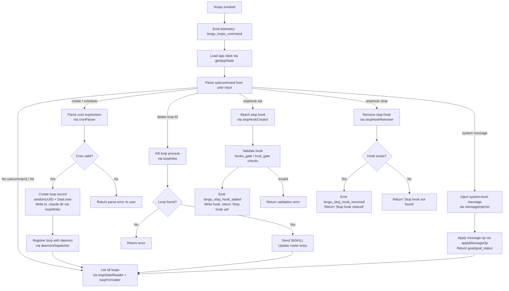

# `/loops`

> Analysis basis: CC v2.1.179 bundle.js (AST extraction + Claude interpretation)
> Minimum version: v2.1.179

---

## Overview

`/loops` is a local-jsx command that provides an interactive management interface for background task loops — recurring automated agents that Claude Code can schedule, monitor, and control. It renders a JSX UI and exposes sub-operations to list active loops, create new loops with cron-based scheduling, delete existing loops, and manage stop hooks attached to loops. The command reads and writes loop state from the filesystem under the `.claude` directory and interacts with the daemon process to spawn or terminate loop workers.

---

## Registration

| Field | Value |
|---|---|
| type | `local-jsx` |
| name | `loops` |
| description | `List, create, and delete loops` |
| loc_byte | `12908578` |
| loc_byte_end | `12908735` |
| loc_line | `8895` |
| immediate | `true` |
| module_id | `tXK` |
| load_inline | `true` |
| arbor_handler.name | `N15` |
| arbor_handler.fqn | `claude-2.1.179::N15` |
| arbor_handler.kind | `AsyncFunction` |
| arbor_handler.resolution_path | `module_id` |
| arbor_handler.n_hits | `0` |

Analysis basis: CC v2.1.179 bundle.js:+12908578

---

## Input Branching

The handler (`N15`) dispatches across several distinct sub-operations depending on parsed user input and the current loop state. Six or more distinct control paths are identifiable from the callGraph, warranting a Mermaid flowchart.



---

## Behavioral Spec

### 1. Command Entry and Telemetry

The async handler `N15` fires immediately upon `/loops` invocation. Its first two calls are to emit a telemetry event and to retrieve current app state.

```
async function loopsCommandHandler(context):
    emit telemetry("tengu_loops_command")          // bundle.js:+12907535
    appState = context.getAppState()               // bundle.js:+12907585
    subcommand = parseSubcommand(context.input)
    dispatch(subcommand, appState, context)
```

Analysis basis: CC v2.1.179 bundle.js:+12907533

### 2. Loop State Reading (`loopStateReader` / `bCH`)

Reading existing loop records involves reading a UTF-8 encoded state file from the `.claude` directory. The reader validates that the result is an array, handles filesystem errors (ENOENT, EACCES, EPERM, ENOTDIR, ELOOP, EROFS), and applies a network-traffic filter tagged `"essential-traffic"`.

```
async function loopStateReader(baseDir):
    path = pathJoin(baseDir, ".claude", loopStateFilename)
    try:
        raw = fs.readFile(path, encoding="utf-8")    // bundle.js:+4951385
        parsed = parseJSON(raw)
        if not Array.isArray(parsed):
            return []
        return parsed
    catch error:
        if error.code in ["ENOENT","EACCES","EPERM","ENOTDIR","ELOOP","EROFS"]:
            return []
        logError(error)
        return []
```

Analysis basis: CC v2.1.179 bundle.js:+4951366

### 3. Cron Expression Parsing (`cronParser` / `v15`)

User-supplied schedule strings are validated and normalized into structured cron fields. The parser uses regex matching, `parseInt`, `Math.max`, `Math.ceil`, and `Math.round`. It recognizes common human-readable shorthand (e.g., `"Every minute"`, `"Every hour"`) and a numeric range notation (e.g., `"1-5"`). Key numeric bounds observed: minutes 0–59, hours 0–23, days 1–31, and a 60-unit cycle base.

```
function parseCronExpression(input):
    trimmed = input.trim()
    if trimmed matches "Every minute" pattern:
        return { type:"cron", minute:"*", hour:"*", ... }
    if trimmed matches "Every hour" pattern:
        return { type:"cron", minute:0, hour:"*", ... }
    parts = tokenize(trimmed)
    minute = clamp(parseInt(parts.minute), 0, 59)    // bundle.js:+12907300
    hour   = clamp(parseInt(parts.hour),   0, 23)    // bundle.js:+12907371
    day    = clamp(parseInt(parts.day),    1, 31)    // bundle.js:+12907424
    cycle  = Math.ceil(Math.max(parts.interval, 1))  // bundle.js:+12907254
    return buildCronRecord(minute, hour, day, cycle)
```

Analysis basis: CC v2.1.179 bundle.js:+12907121

### 4. Loop List Formatting (`loopFormatter` / `of6` → `BTH` + `Gyq`)

The formatter maps each loop record to a display row using `padEnd` for column alignment (separator character: `"  "`) and `map` over the records array. The formatted table is pushed into the output accumulator.

```
function formatLoopList(loops):
    colWidths = computeColumnWidths(loops)           // bundle.js:+9118971
    rows = loops.map(loop =>
        formatRow(loop, colWidths, separator="  ")
    )
    return rows.join("\n")
```

Analysis basis: CC v2.1.179 bundle.js:+10671448

### 5. Loop Creation (`loopCreator` / `cH6`)

Creating a new loop generates a UUID and timestamp, constructs a loop record, writes it to the `.claude` directory, and registers it with the daemon. The UUID is generated via `randomUUID` (8 hex chars truncated, length: 8 characters — bundle.js:+4952738).

```
async function createLoop(cronExpr, context):
    id       = randomUUID()                          // bundle.js:+4952713
    created  = Date.now()                            // bundle.js:+4952775
    record   = buildLoopRecord(id, cronExpr, created)
    await writeLoopFile(record)                      // bundle.js:+4952865
    await registerWithDaemon(record)                 // via dH6 / daemonWriter
    return record
```

The loop file is written to a path constructed with `path.join(..., ".claude", ...)` (bundle.js:+4952554) using `LP8.mkdir` (recursive) and `LP8.writeFile`.

Analysis basis: CC v2.1.179 bundle.js:+4952713

### 6. Loop Deletion / Process Kill (`loopKiller` / `Hh` → `D`)

Deletion resolves the loop by ID, sends `SIGKILL` to its worker process (bundle.js:+17067350), updates its roster entry to `"closed"` status (bundle.js:+17067164), and removes the loop record. A 30-second and 15-second timeout window is observed in the lifecycle management (bundle.js:+17067257, bundle.js:+17067268).

```
async function deleteLoop(loopId, loops):
    loop = loops.find(l => l.id == loopId)          // bundle.js:+4949298
    if not loop:
        return error("loop not found")
    process = processMap.get(loopId)
    if process:
        process.kill("SIGKILL")                     // bundle.js:+17067350
    updateRoster(loopId, status="closed")
    removeLoopFile(loopId)
    return success
```

Analysis basis: CC v2.1.179 bundle.js:+4949157

### 7. Stop Hook Management (`stopHookCreator` / `af6` and `stopHookRemover` / `sf6`)

**Set stop hook:**
The user supplies a hook command; the handler validates it through `hooks_gate` and `trust_gate` checks (bundle.js:+10671645, bundle.js:+10671699), then writes the hook and emits `tengu_stop_hook_added`. On success, the UI reflects `"Stop hook set"` (bundle.js:+12908295).

```
async function setStopHook(loopId, hookSpec, appState):
    validated = validateHook(hookSpec, gates=["hooks_gate","trust_gate"])
    if not validated.ok:
        return error(validated.reason)
    writeStopHook(loopId, hookSpec)                 // bundle.js:+10672078
    emit telemetry("tengu_stop_hook_added")          // bundle.js:+10672135
    applyMessageOp(appState, op="append", type="attachment")
    return "Stop hook set"
```

**Clear stop hook:**
If a stop hook exists for the loop, it is removed; `tengu_stop_hook_removed` is emitted (bundle.js:+10672507) and the UI shows `"Stop hook cleared"` (bundle.js:+12907999). If no hook exists, the UI shows `"Stop hook not found"` (bundle.js:+12907977).

```
async function clearStopHook(loopId, appState):
    hook = findStopHook(loopId)
    if not hook:
        return "Stop hook not found"
    removeStopHook(loopId)
    emit telemetry("tengu_stop_hook_removed")
    return "Stop hook cleared"
```

Analysis basis: CC v2.1.179 bundle.js:+10671749, +10671777

### 8. System/Goal Message Injection (`messageInjector` / `sf6` path)

A `"system"` subcommand (bundle.js:+12907866) injects a goal-related message into the conversation. The operation uses `applyMessageOp` with op type `"append"` and message role `"goal"` or `"goal_status"`. A new UUID attachment ID is generated via `randomUUID` (bundle.js:+10672601).

```
async function injectSystemMessage(loopId, content, appState):
    uuid = randomUUID()
    op = buildMessageOp(type="goal", op="append", id=uuid, content=content)
    applyMessageOp(appState, op)                    // bundle.js:+10672450
    setAppState(appState)
    return goal_status record
```

Analysis basis: CC v2.1.179 bundle.js:+10672492

### 9. Daemon Interaction (`daemonDispatcher` / `g9H`)

Loop records are submitted to the running daemon via a filtered channel. The dispatcher reads current loop state, filters to only records not already tracked, then calls `loopWriter` (`dH6`) to persist and `loopStateReader` (`bCH`) to verify.

```
async function dispatchLoopsToDaemon(newLoops, existing):
    fresh = newLoops.filter(l => not existing.has(l.id))  // bundle.js:+4953102
    for loop in fresh:
        await writeLoopRecord(loop)                 // bundle.js:+4953166
    return readUpdatedState()
```

Analysis basis: CC v2.1.179 bundle.js:+4953043

### 10. JSX Render

After all async data operations complete, `N15` calls `gXA.createElement` (bundle.js:+12908338) to construct the JSX UI tree. The rendered output contains the loop list table, action affordances, and any status messages from the sub-operations above.

---

## State & Side Effects

| Item | Detail |
|---|---|
| Telemetry — `tengu_loops_command` | Fired on every `/loops` invocation (bundle.js:+12907535) |
| Telemetry — `tengu_stop_hook_added` | Fired when a stop hook is successfully attached (bundle.js:+10672135) |
| Telemetry — `tengu_stop_hook_removed` | Fired when a stop hook is removed (bundle.js:+10672507) |
| Telemetry — `tengu_bg_dispatch_sigkill_escalate` | Fired when a loop worker receives SIGKILL escalation (bundle.js:+17067302) |
| Telemetry — `tengu_daemon_config_reload` | Fired when daemon config is reloaded after loop change (bundle.js:+17083201) |
| Telemetry — `tengu_daemon_control` | Fired on daemon control operations (bundle.js:+17105376) |
| Telemetry — `tengu_scheduled_task_missed` | Fired when a scheduled loop tick is missed (bundle.js:+16544540) |
| Telemetry — `tengu_feature_bad` / `tengu_feature_ok` / `tengu_feature_sad` | Feature gate signals used internally (bundle.js:+1020546, +1020479, +1020627) |
| Telemetry — `tengu_bg_low_mem_mb` | Fired when memory is low for background worker (bundle.js:+13454570) |
| Telemetry — `tengu_bg_dispatch_low_mem` | Fired on low-memory dispatch condition (bundle.js:+17067903) |
| Telemetry — `tengu_bg_spare_enable` | Fired when a spare background slot is enabled (bundle.js:+17068607) |
| Telemetry — `tengu_bg_sendclaim_failed` | Fired when daemon claim send fails (bundle.js:+17043852) |
| Telemetry — `tengu_bg_state_read_transient` | Fired on transient state read errors (bundle.js:+4323451) |
| Telemetry — `tengu_bg_spare_claim` / `tengu_bg_spare_claim_fail` | Spare slot claim lifecycle events (bundle.js:+17068735, +17069001) |
| Telemetry — `tengu_mcp_skills` | MCP skill registration event reached transitively (bundle.js:+6682260) |
| Filesystem writes | Loop records written to `.claude/` directory using `LP8.writeFile` and `LP8.mkdir` (bundle.js:+4952533, +4952630) |
| Filesystem reads | Loop state read from `.claude/` via `_.readFile` with `"utf-8"` encoding (bundle.js:+4951385) |
| appState changes | `getAppState` / `setAppState` / `applyMessageOp` used for goal injection and hook management (bundle.js:+12907585, +10672036, +10672450) |
| Process signals | `SIGKILL` sent to loop worker processes on deletion (bundle.js:+17067350); `SIGTERM` used in daemon control (bundle.js:+17044090) |
| Hook registration | Stop hooks written and cleared in loop config; lifecycle tracked via `tengu_stop_hook_added` / `tengu_stop_hook_removed` |
| Sound | <!-- TODO: not found in depth-2 traversal; needs --depth 4 --> |
| Daemon IPC | Loop records dispatched to daemon via supervisor socket; `"supervisor"` channel tag observed (bundle.js:+17082408) |
| MCP side effects | MCP server connection/cleanup reached transitively through loop lifecycle management (`KxH`, `Us8`, `fhA`) |

---

## Version History

| Version | Change |
|---|---|
| v2.1.179 | Initial analysis |

---

## Common Mistakes

1. **Supplying an invalid cron expression**: The `cronParser` (`v15`) validates minute (0–59), hour (0–23), and day (1–31) ranges. Out-of-range values are clamped silently; completely unparseable strings return a parse error to the UI.
2. **Deleting a loop by name instead of ID**: The delete path (`Hh` → `D`) matches by loop ID, not by display name. Using a human-readable label without the correct ID will result in a "loop not found" error.
3. **Assuming stop hooks persist after loop deletion**: Stop hooks are stored alongside the loop record. Deleting a loop removes the associated stop hook as well; there is no separate hook persistence layer.
4. **Expecting immediate daemon effect**: After creation, loop records are written to disk and then dispatched to the daemon asynchronously. The daemon may not reflect the new loop until the next config reload (`tengu_daemon_config_reload`).
5. **Confusing `"system"` subcommand with system-prompt editing**: The `"system"` subcommand in `/loops` injects a goal/goal_status message into the active loop's conversation context — it is not the same as `/system-prompt` and does not modify the global system prompt.
6. **Ignoring the `.claude` directory requirement**: Loop state is read and written under `.claude/` relative to the project root. If this directory does not exist or is not writable, loop creation silently fails with an ENOENT or EACCES filesystem error.

---

## Appendix — Identifier Mapping

> For bundle debugging only. Identifiers change across versions.

| Identifier | Role |
|---|---|
| `N15` | Main async handler for `/loops` command (arbor_handler) |
| `d` | Utility / context helper called at handler entry |
| `Q9H` | Loop state fetch orchestrator |
| `bCH` | Loop state file reader (reads UTF-8 JSON from `.claude/`) |
| `c6` | Path construction helper |
| `f3H` | Filesystem path builder (uses `MP8.join`) |
| `D4` | Low-level OS/path utility |
| `f1` | File I/O wrapper (calls `G8`) |
| `G8` | Generic async I/O primitive |
| `SH` | Network/IPC channel handler (essential-traffic filter) |
| `WA` | Error wrapper / string coercer |
| `f6` | String coercion utility |
| `fq` | Traffic queue helper |
| `Nd4` | Queue shift/push manager |
| `N` | API request dispatcher |
| `nM4` | Request builder (`hk`, `N__`, `sSA`) |
| `H` | Random-delay / setTimeout scheduler |
| `bH` | JSON serializer (`JSON.stringify`) |
| `g4` | String normalization / redaction helper |
| `ydH` | Additional string transformer |
| `aM4` | Upload / byte-length tracker |
| `dy` | Input trimmer and subcommand pre-parser |
| `AD7` | Token/range parser (split, match, parseInt, Set operations) |
| `A` | String lowercaser / accumulator |
| `f` | Stream / connection object |
| `q` | Stream data source / Set |
| `L` | Stream lifecycle manager (close, finally) |
| `uZ` | OS-level utility (calls `OT`) |
| `OT` | Low-level OS primitive |
| `of6` | Loop list formatter orchestrator |
| `BTH` | Column-width setter (Map.set) |
| `K` | Column-map / padding helper |
| `Gyq` | Row mapper (H.map) |
| `I6` | Output primitive / display helper |
| `Hh` | Loop deletion / cron schedule parser |
| `D` | Loop process manager (get, kill, signal) |
| `b` | Loop spawn/worker entry point |
| `w` | Worker write / supervisor channel |
| `Ht` | Hook utility (`mLH`) |
| `dH6` | Loop record file writer (`LP8.mkdir`, `LP8.writeFile`) |
| `pk9` | Loop filter helper |
| `P` | Buffer/stream reader with ETOOLARGE guard |
| `z` | Daemon stop controller |
| `S` | Session/worker startup |
| `X` | Timeout-backed connection map |
| `l` | Loop record collection |
| `ctK` | Loop summary formatter (max, join, map) |
| `g9H` | Daemon dispatcher for new loop records |
| `n8` | Timer-backed async primitive (setTimeout/clearTimeout) |
| `O` | Abort/stop signal helper |
| `CH` | Feature-check "bad" path handler |
| `QH` | Feature gate primitive |
| `IH` | Feature-check "ok" path handler |
| `il8` | macOS memory-check helper |
| `Y6` | Memory / resource availability checker |
| `oRH` | Loop state file lifecycle manager (lstat, rm, readFile) |
| `_E6` | Path + `pins.json` resolver |
| `l6` | Safe JSON parser (`JSON.parse`) |
| `x8` | Async I/O error classifier |
| `eL7` | Directory recursive reader (readdir, lstat, filter) |
| `g` | Permission/retire policy evaluator |
| `tq6` | Policy action resolver (allow/deny/warn/classify) |
| `xd` | Permission decision engine |
| `_kA` | Daemon socket claim/connect handler |
| `LTA` | Loop metadata writer (mkdir, writeFile, JSON.stringify) |
| `nb5` | Claim-send timeout manager (5000 ms) |
| `lb5` | Claim frame builder |
| `VL` | Generic event emitter helper |
| `GH` | String coercer (String()) |
| `hv` | Binary frame encoder (Buffer.allocUnsafe, writeUInt32BE) |
| `MkA` | Loop session lifecycle manager (done/killed/failed/crashed/blocked/working states) |
| `P4` | Path join + `GE` helper |
| `zq` | Loop state file watcher / cache manager |
| `i$` | "Active" state resolver |
| `D2H` | Loop record diff/patch helper |
| `yL` | Loop config writer (`bH`, `lJ`) |
| `qL6` | Loop run scheduler (Date.now, GcL) |
| `vU6` | Path builder (`x$.join`, `EU6`) |
| `EzH` | Extended path builder (`UBH`) |
| `aE` | Error-type tagger ("err") |
| `uI` | Loop result writer ("late") |
| `Cv` | Late-result tagger ("late") |
| `VU6` | Directory path builder |
| `Y` | Forced-shutdown / process.exit handler |
| `NX` | Shutdown signal emitter |
| `B` | Disposable resource handle |
| `j` | Process value iterator / killer |
| `$` | yTK dispatcher |
| `yTK` | Status file writer (`daemon.status.json`) |
| `H9` | AsyncLocalStorage store reader |
| `VF6` | Status path builder |
| `J` | Date/time calendar helper (UTC day/date/hours) |
| `sf6` | Stop hook removal handler + message injector |
| `Doq` | UUID generator wrapper (`zoq.randomUUID`) |
| `q6` | Feature primitive (`n36`) |
| `n36` | Base feature flag evaluator |
| `v15` | Cron expression parser |
| `cH6` | Loop creation handler (UUID, Date.now, write) |
| `ZNH` | Loop record builder helper |
| `M` | MCP server manager (KxH, Us8) |
| `KxH` | MCP server connection orchestrator |
| `IQ` | MCP capability resolver |
| `IE` | MCP capability validator |
| `s8` | Settings reader |
| `ih6` | MCP server filter |
| `YHq` | MCP connection scheduler |
| `XL8` | MCP retry timer |
| `DL8` | MCP retry counter |
| `$8` | MCP debug logger (`ks.logMCPDebug`) |
| `F08` | OAuth flow initiator for MCP |
| `g08` | OAuth callback completer for MCP |
| `ZHq` | MCP auth-state tracker |
| `ac_` | MCP connection retry helper |
| `Yh` | MCP skill dispatcher (`Y6`) |
| `xc_` | MCP capability includer |
| `y` | MCP backoff timer (3600000 ms window, 0.8 factor) |
| `w7` | MCP error logger (`ks.logMCPError`) |
| `PHq` | MCP queue helper |
| `T_6` | MCP integer parser |
| `FG8` | MCP integer parser variant |
| `Us8` | MCP update applier (`applyMcpUpdate`) |
| `qxH` | MCP update helper |
| `GG` | MCP cleanup helper |
| `fhA` | MCP client roster manager |
| `N08` | MCP server set membership checker |
| `W_6` | MCP job formatter |
| `af6` | Stop hook creation handler |
| `e5A` | Hook validation orchestrator |
| `ab` | Policy settings reader |
| `R8` | Policy object parser |
| `k1H` | Policy sub-key extractor |
| `p_` | Hook path validator |
| `NL` | Hook trust evaluator |
| `yrf` | Hook trust resolver (f6, tQH, V9, h6, Ul, x6) |
| `U6` | Feature "sad" path handler |
| `zD` | Output token counter helper |

---

Note: index built via Arbor fallback; some signals (telemetry, literals) may be missing — see arbor-fallback.js.