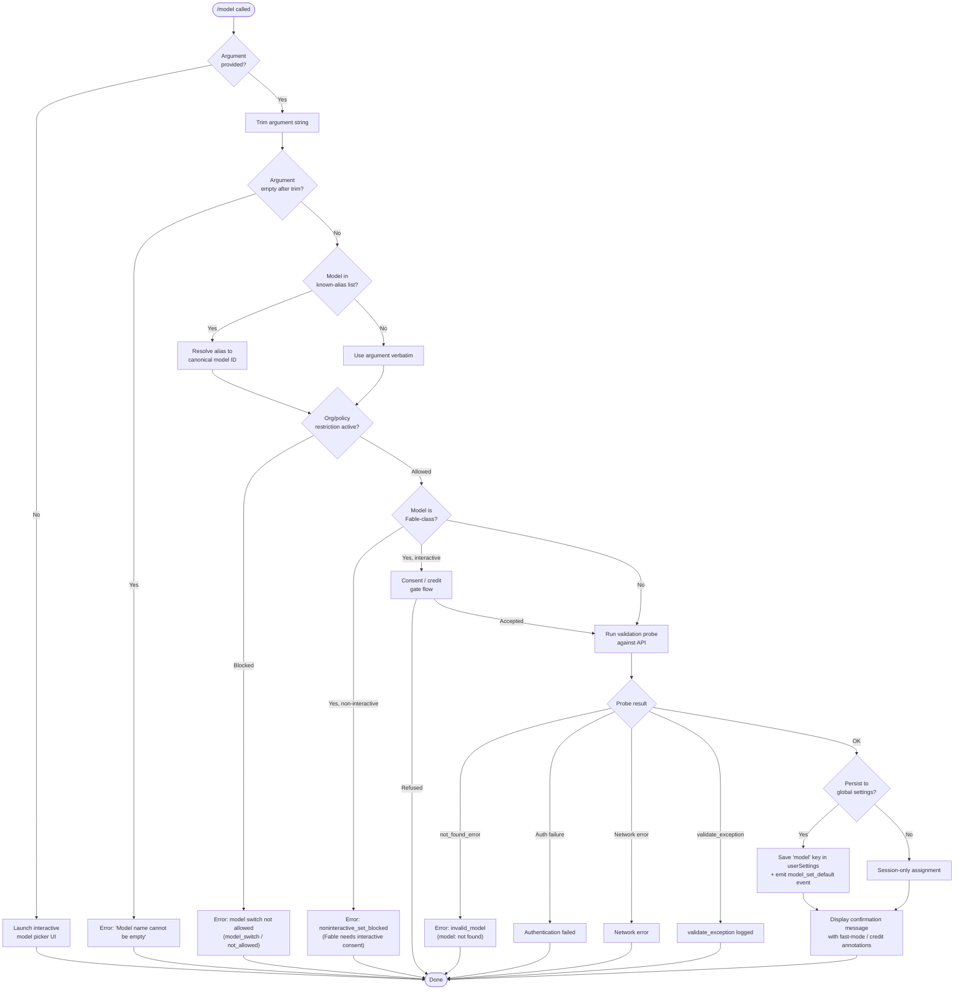

# `/model`

> Analysis basis: CC v2.1.179 bundle.js (AST extraction + Claude interpretation)
> Minimum version: v2.1.179

---

## Overview

The `/model` command allows users to inspect and change the AI model used by Claude Code for the current session or as a persistent default. When invoked without an argument it presents an interactive model picker; when invoked with a model name or shorthand alias it validates, optionally probes availability, and applies the selection — enforcing org-level policy, tier constraints, and (for certain models) usage-credit consent gates before confirming the change.

---

## Registration

| Field | Value |
|---|---|
| type | `local` |
| name | `model` |
| description | `Set the AI model for Claude Code` |
| argumentHint | `<model>` |
| supportsNonInteractive | `true` |
| module_id | `Q0K` |
| load_inline | `true` |
| loc_byte | `13127083` |
| loc_byte_end | `13127257` |
| loc_line | `9043` |
| arbor_handler.name | `hK5` |
| arbor_handler.fqn | `claude-2.1.179::hK5` |
| arbor_handler.kind | `AsyncFunction` |
| arbor_handler.resolution_path | `module_id` |
| arbor_handler.n_hits | `0` |

Analysis basis: CC v2.1.179 bundle.js:+13127083

---

## Input Branching

Five or more distinct paths exist depending on argument presence, policy state, model class, and session interactivity — a Mermaid flowchart is used.



Analysis basis: CC v2.1.179 bundle.js:+13091149 – +13091681

---

## Behavioral Spec

### 1. Entry point — handler dispatch (`hK5`)

```
async function modelCommandHandler(options, context):
    rawArg = options.args?.trim()           // H.trim — bundle.js:+13091149

    if rawArg is undefined or rawArg == "":
        launchInteractivePicker(context)    // GF8 path
        return

    // Inline telemetry for non-interactive invocations
    emit telemetry("tengu_model_command_inline")   // bundle.js:+13091300

    resolvedModel = resolveAliasOrPassthrough(rawArg)

    // Check org-level allowed-model list (ZlH)
    if not isModelAllowed(resolvedModel, context.policySettings):  // ZlH.includes — +13091165
        reportError("model_switch", "not_allowed")                 // +11452813, +11452828
        return

    appState = getAppState()                                       // _.getAppState — +13091188

    // Fable consent gate (non-interactive sessions)
    if isFableModel(resolvedModel) and not appState.interactive:   // +13091456
        emit telemetry("model_fable_consent")                      // +13091459
        emit telemetry("noninteractive_set_blocked")               // +13091481
        print("Fable 5 uses usage credits …")                     // +13091530
        return

    validatedModel = await validateModelViaProbe(resolvedModel, context)  // sp6 — +13091381
    if validatedModel == null:
        return   // error already reported inside probe

    applyModelToSession(validatedModel, context)                   // WF8 — +13091681
```

Analysis basis: CC v2.1.179 bundle.js:+13091149

---

### 2. Alias resolution (`resolveAliasOrPassthrough`, implemented in `D1`)

The runtime maintains a table of short-form aliases mapping to canonical model IDs. The resolution pipeline:

```
function resolveAliasOrPassthrough(input):
    normalized = input.trim().toLowerCase()           // D1 — +2285567

    // Short aliases (checked in order):
    // "sonnet"    → canonical sonnet ID              // +2285747
    // "haiku"     → canonical haiku ID               // +2285786
    // "opus"      → canonical opus ID                // +2285825
    // "best"      → highest capability model         // +2285859
    // "fable"     → claude-fable-5                   // +2285644
    // "opusplan"  → Opus in plan mode, else Sonnet   // +2284097
    // "sonnet-4-6" / "sonnet_4_6" / etc.            // +11452525 – +11452626
    // "opus-4-8"  / "opus_4_8"  / etc.              // +11452249 – +11452480
    // "fable-5"   / "fable_5"                        // +11452149 – +11452172

    if alias_table.has(normalized):
        return alias_table.get(normalized)

    // Pass-through: treat raw string as model ID
    return input.trim()
```

The full canonical model-ID set known to the bundle (used in the reverse lookup / display name table):

| Canonical ID | Display name |
|---|---|
| `claude-fable-5` | Fable 5 |
| `claude-mythos-5` | Mythos 5 |
| `claude-opus-4-8` | Opus 4.8 |
| `claude-opus-4-7` | Opus 4.7 |
| `claude-opus-4-6` | Opus 4.6 |
| `claude-opus-4-5` | Opus 4.5 |
| `claude-opus-4-1` | Opus 4.1 |
| `claude-opus-4-0` | Opus 4 |
| `claude-sonnet-4-6` | Sonnet 4.6 |
| `claude-sonnet-4-5` | Sonnet 4.5 |
| `claude-sonnet-4-0` | Sonnet 4 |
| `claude-haiku-4-5` | Haiku 4.5 |
| `claude-3-7-sonnet` | Sonnet 3.7 |
| `claude-3-5-sonnet` | Sonnet 3.5 |
| `claude-3-5-haiku` | Haiku 3.5 |
| `claude-3-opus` | (legacy Opus 3) |
| `claude-3-sonnet` | (legacy Sonnet 3) |
| `claude-3-haiku` | (legacy Haiku 3) |

Analysis basis: CC v2.1.179 bundle.js:+2282316 – +2285901

---

### 3. Policy / tier guard (`isModelAllowed`, `isTierPermitted`)

```
function isModelAllowed(modelId, policySettings):
    // policySettings key checked at +2267088
    if policySettings.allowedModels is set:
        return policySettings.allowedModels.includes(modelId)
    return true

function isTierPermitted(modelId, appState):
    // Tier disable reasons surfaced to UI:
    // "out_of_credits", "overage_not_provisioned",
    // "org_level_disabled", "org_level_disabled_until",
    // "seat_tier_level_disabled", "member_level_disabled",
    // "seat_tier_zero_credit_limit", "group_zero_credit_limit",
    // "member_zero_credit_limit", "org_service_level_disabled",
    // "no_limits_configured", "fetch_error", "unknown"
    // (all at bundle.js:+2598563 – +2598911)
    tierStatus = getTierStatus(appState)
    return tierStatus not in BLOCKING_REASONS
```

Analysis basis: CC v2.1.179 bundle.js:+13091165 (+2598563)

---

### 4. Model validation probe (`sp6` → `ap6` → `rU`)

The probe sends a minimal API call to verify the model is accessible for this account before committing the change.

```
async function validateModelViaProbe(modelId, context):
    // Step 1: check org-disabled list (disabled_by_org)  // +11453460
    if isOrgDisabled(modelId):
        reportBlockedReason("disabled_by_org")
        return null

    // Step 2: 1M-context availability checks
    if modelId ends with "[1m]":
        if isOpus1MUnavailable():                          // +11452975
            print("Opus with 1M context is not available…")  // +11453013
            emit("opus_1m_unavailable")
            return null
        if isSonnet1MUnavailable():                        // +11453192
            print("Sonnet 4.6 with 1M context is not available…")  // +11453232
            emit("sonnet_1m_unavailable")
            return null

    // Step 3: check A1K cache to avoid redundant probes  // ap6 — +11451100
    if probeCache.has(modelId):
        return probeCache.get(modelId)

    // Step 4: fire side-query API call via rU            // +11451145
    try:
        result = await sideQueryRequest(modelId, context)  // rU path
        probeCache.set(modelId, result)                    // A1K.set — +11451308
        return result
    catch AuthError:
        print("Authentication failed. Please check your API credentials.")  // +11451567
        return null
    catch NetworkError:
        print("Network error. Please check your internet connection.")      // +11451669
        return null
    catch ApiError where error.type == "not_found_error":  // +11451788
        reportError("invalid_model", "model: not found")   // +11451870
        return null
    catch Exception:
        emit("validate_exception")                          // +11454103
        return null
```

Fable-specific probe path additionally checks `fable_unavailable` and `fable_probe_failed` status codes (bundle.js:+11453711, +11453731).

Analysis basis: CC v2.1.179 bundle.js:+11450794

---

### 5. Session application and confirmation output (`WF8` / `kzA`)

```
function applyModelToSession(validatedModel, context):
    appState = getAppState()
    persistToGlobal = context.isInteractive and not context.sessionOnlyFlag

    if persistToGlobal:
        saveToUserSettings("model", validatedModel)        // model_set_default — +11454718
        suffix = " and saved as your default for new sessions"  // +11454360
    else:
        appState.model = validatedModel
        suffix = " for this session only"                  // +11454406

    // Build display name
    displayName = getDisplayName(validatedModel)           // D1 lookup

    // Annotation flags
    annotation = ""
    if isFastModel(validatedModel):
        annotation += " · Fast mode ON"                    // +11454524
    if isUsageCreditsModel(validatedModel):
        annotation += " · Draws from usage credits"        // +11454575
    if not isFastModel(validatedModel) and wasEverFast:
        annotation += " · Fast mode OFF"                   // +11454621

    // Managed-settings notice when org controls the model
    if managedByOrg:
        print("Managed settings" + …)                      // +11454927

    print(bold(displayName) + suffix + annotation)
    emit telemetry("model_set_default")                    // +11454718
```

Analysis basis: CC v2.1.179 bundle.js:+11454207

---

### 6. Interactive picker (`GF8` → `Iv` → `w48`)

When no argument is provided, the command delegates to an interactive selection component:

```
function launchInteractivePicker(context):
    // Build available-model list
    modelList = buildAvailableModelList(context)           // r0 path — +11455318

    // Render selection UI via w48 (model-list renderer)
    selection = await renderModelPicker(modelList)         // w48 — calls D1, Qz, XJH internally

    if selection == null:
        return  // user cancelled

    // Re-enter main flow with chosen model
    applyModelToSession(selection, context)
```

The picker respects the same policy guards and displays tier-status indicators (`refused`, `inactive`, `active`, `mantle`) for each listed model entry (bundle.js:+2274694, +2274732, +2274774, +2274456).

Analysis basis: CC v2.1.179 bundle.js:+13091188

---

### 7. Bootstrap model-list fetch (`V96` → `gqL`)

On session startup (not per `/model` invocation) the bundle may fetch the live model list from the API to populate the picker:

```
async function bootstrapModelList(context):
    if not CLAUDE_CODE_ENABLE_GATEWAY_MODEL_DISCOVERY:     // +8134999
        log("[Bootstrap] Skipped gateway /v1/models …")
        return cached

    if nonessentialTrafficDisabled:                        // essential-traffic — +1049870
        log("[Bootstrap] Skipped: Nonessential traffic disabled")  // +8135154
        return cached

    if thirdPartyProvider:
        log("[Bootstrap] Skipped: 3P provider")            // +8135245
        return cached

    log("[Bootstrap] Fetching")                            // +8135307
    response = await fetch(modelsEndpoint, {
        headers: { "Content-Type": "application/json",     // +8135392
                   "anthropic-version": "2023-06-01",      // +8137503
                   "anthropic-beta": … },
        timeout: between 1000 and 5000 ms                  // +8137549, +8137563
    })

    emit telemetry("api_bootstrap_fetch")                  // +8135628

    if parse fails:
        emit("parse_failed")                               // +8135650
    else:
        log("[Bootstrap] Fetch ok")                        // +8135680
        if cache unchanged:
            log("[Bootstrap] Cache unchanged, skipping write")   // +8136992
        else:
            log("[Bootstrap] Cache updated, persisting to disk") // +8137048
```

Analysis basis: CC v2.1.179 bundle.js:+8134922

---

## State & Side Effects

| Item | Detail |
|---|---|
| Telemetry — command | `tengu_model_command_inline` (non-interactive arg path) — bundle.js:+13091300 |
| Telemetry — feature flag | `tengu_feature_ok`, `tengu_feature_bad`, `tengu_feature_sad` — +1020479, +1020546, +1020627 |
| Telemetry — bootstrap | `api_bootstrap_fetch` — +8135628 |
| Telemetry — config | `tengu_config_lock_contention`, `tengu_config_stale_write`, `tengu_config_auth_loss_prevented`, `tengu_config_parse_error`, `tengu_config_fallback_write` |
| Telemetry — API | `tengu_api_success` — +13938607 |
| Telemetry — misc | `tengu_lone_surrogate_sanitized`, `tengu_prompt_cache_1h_config`, `tengu_saffron_lattice` |
| Telemetry — Fable consent | `model_fable_consent`, `noninteractive_set_blocked` — +13091459, +13091481 |
| Telemetry — validation | `invalid_model` (+11454006), `validate_exception` (+11454103), `model_set_default` (+11454718) |
| Telemetry — 1M context | `opus_1m_unavailable` (+11452975), `sonnet_1m_unavailable` (+11453192) |
| Telemetry — org | `disabled_by_org` (+11453460), `fable_unavailable` (+11453711), `fable_probe_failed` (+11453731) |
| appState changes | `appState.model` updated (session-only path) |
| Persistent settings | `userSettings.model` written via `saveToUserSettings` when interactive and default-save chosen (`model_set_default`) |
| Probe cache | `A1K` Map: populated per validated model ID to avoid repeat probes within session |
| Config lock | `saveConfigWithLock` used for all writes; contention logged at `tengu_config_lock_contention` |
| Sound | None observed in depth-2 traversal |
| Hook registration | None observed in depth-2 traversal |

---

## Version History

| Version | Change |
|---|---|
| v2.1.179 | Initial analysis — Fable 5 consent gate, 1M-context availability checks, `opusplan` alias, Mythos 5 canonical ID present |

---

## Common Mistakes

1. **Passing a partial alias in non-interactive mode without full model ID**: aliases like `"sonnet"` or `"opus"` are resolved, but arbitrary partial strings are passed through verbatim and will fail validation (`not_found_error`).
2. **Expecting Fable 5 to be settable non-interactively**: the command blocks all non-interactive Fable model switches (`noninteractive_set_blocked`) and requires running `/model` in an interactive session for the consent flow.
3. **Assuming the change persists by default in non-interactive/SDK mode**: without an interactive session flag, the model is set for the current session only and is not written to `userSettings`.
4. **Using underscore aliases in contexts that only accept hyphen forms**: both `opus_4_8` and `opus-4-8` are recognized, but tool integrations that construct the argument programmatically should prefer the canonical hyphenated `claude-opus-4-8` form to avoid alias-resolution edge cases.
5. **Omitting the `[1m]` suffix and expecting extended context**: the 1M-context window is only activated when the model argument explicitly ends with `[1m]` (e.g., `sonnet[1m]` or `sonnet-4-6[1m]`); omitting it selects the standard context window even if the account supports extended context.

---

## Appendix — Identifier Mapping

> For bundle debugging only. Identifiers change across versions.

| Identifier | Role |
|---|---|
| `hK5` | Main async handler for `/model` command (`arbor_handler`) |
| `GF8` | Interactive model picker launcher |
| `Iv` | Model list builder (feeds picker) |
| `tX6` | Model list entry constructor |
| `o5` | Model entry field builder (sub-component of `tX6`) |
| `D1` | Alias-to-canonical-ID resolver / display-name mapper |
| `r0` | Available-model list assembler |
| `H2_` | Per-model metadata builder |
| `w48` | Interactive picker renderer / model-list formatter |
| `d` | Logger / debug output utility |
| `YM` | SHA-256 hash utility (used for model ID fingerprinting) |
| `Xj` | Hash helper |
| `n36` | Low-level hash primitive |
| `sp6` | Model validation probe orchestrator |
| `TK` | Model list fetcher / resolver |
| `Nj6` | Model tier/status fetcher |
| `TH1` | Model filter helper |
| `GH1` | Model group builder |
| `hj6` | Model entry builder with remote-settings merge |
| `JSA` | Model status constant map |
| `e_H` | Model entry enricher |
| `X68` | Model field accessor |
| `rDH` | Remote managed settings reader |
| `vb` | Model object factory |
| `t_H` | Tier label resolver |
| `Ej6` | Model entry with tier extension |
| `XSA` | Model sort/filter helper |
| `p1` | CLI error exit helper |
| `O4` | String normaliser / model-ID cleaner |
| `yTK` | Timestamp / session metadata helper |
| `YyH` | Model feature-flag checker |
| `EN` | Provider-type checker (`wyH.includes` — checks allowed providers) |
| `M48` | Model switch policy enforcer |
| `iX6` | Model ID normaliser (prefix/suffix handling) |
| `BR1` | Policy-settings object reader |
| `R8` | Model-with-tier record builder |
| `O68` | Model availability status resolver |
| `HrH` | Model override entries merger |
| `t_` | Per-model policy entry builder |
| `UR1` | Model index-of lookup utility |
| `xTf` | Extended model info builder |
| `mR1` | Model index helper |
| `uTf` | Model prefix-match utility |
| `pR1` | Model starts-with helper |
| `CH` | Feature flag checker |
| `QH` | Feature flag sub-checker |
| `fFL` | 1M-context Sonnet availability guard |
| `Dt` | Tier/credit status decoder |
| `xLH` | Credit-limit status code mapper |
| `vA` | Account tier resolver |
| `Xn1` | Seat-tier resolver |
| `bJ` | Provider/context metadata builder |
| `uLH` | Tier label builder |
| `u_` | React/Ink render primitive |
| `Lq` | UI layout container |
| `LFL` | 1M-context Opus availability guard |
| `q5H` | Opus tier/context resolver |
| `XJH` | Per-model UI entry renderer |
| `j7` | Spinner / loading indicator |
| `Iq8` | Animated spinner helper |
| `Qz` | Model-ID normaliser (case + prefix) |
| `WJH` | Model tile renderer |
| `h6` | UI tile / card component |
| `lA` | Model display-name builder |
| `a$6` | Annotation string builder |
| `aL` | String replace utility |
| `kAH` | Keyboard shortcut handler for picker |
| `TAH` | Key-combo inclusion check |
| `EAH` | Model entry with 1M suffix handler |
| `z48` | Model entry with disabled overlay |
| `krH` | Disabled-model inclusion checker |
| `hrH` | Hover/focus state handler |
| `ap6` | Probe cache manager / API validation dispatcher |
| `rU` | Side-query API request executor |
| `Vg` | HTTP request builder (sets all request headers) |
| `VSH` | API response parser with claude-3 compat check |
| `nAH` | Auth token getter for probe |
| `Ow5` | Model-find helper in probe response |
| `nGA` | Probe response hash calculator |
| `W48` | User-agent / header builder |
| `Kz8` | Request cancellation token |
| `cmH` | Streaming response processor |
| `yN` | Rate-limit handler |
| `iyK` | Response iterator |
| `VO8` | Temperature / param extractor |
| `VW` | Token usage mapper |
| `i0H` | Content block processor |
| `EbA` | Message history appender |
| `_S` | Deep-clone utility |
| `ui6` | Conversation state updater |
| `q6` | Noop / resolved-promise helper |
| `tG_` | Auth-token refresh helper |
| `sG_` | Session token cache |
| `WYH` | Retry-after header parser |
| `a_` | Request retry scheduler |
| `w1` | Noop logger |
| `jE6` | Structured output builder |
| `Fi` | Stream finaliser |
| `T$6` | Cache-control param builder |
| `qFL` | Model-display-string formatter |
| `KFL` | Model label with tier-badge builder |
| `q1K` | Model lowercase normaliser for display |
| `V96` | Bootstrap model-list fetch orchestrator |
| `gqL` | Bootstrap HTTP fetch + cache writer |
| `N` | User-facing notification / log printer |
| `dqL` | Bootstrap response parser |
| `fq` | Essential-traffic gate |
| `F$` | JSON parse helper |
| `uk_` | Model-ID version parser |
| `xl` | Provider allowlist checker |
| `Q1` | Model-info record constructor |
| `U6` | Feature flag `tengu_feature_*` emitter |
| `WW` | Ink `Text` component |
| `Uj` | Ink `Box` layout component |
| `iJH` | WIF token exchange handler |
| `UoH` | WIF credentials resolver |
| `R1` | OAuth endpoint validator |
| `GW` | Model-array type-checker |
| `YE` | OAuth error classifier |
| `IH` | Feature flag reader |
| `SJq` | Config section accessor |
| `J8` | Global config save dispatcher |
| `eO8` | Config file write with lock |
| `rXH` | Config merge helper |
| `KM9` | Config entry serialiser |
| `pG6` | Lock file timestamp helper |
| `r5H` | Fallback config write |
| `RsH` | Config integrity checker |
| `tO8` | Config fallback write path |
| `pz` | Settings object merger |
| `SH` | Error logger / `ks.logError` caller |
| `WA` | Error constructor helper |
| `f6` | String coercion wrapper |
| `Nd4` | Circular log buffer (shift/push) |
| `GH` | String to String cast |
| `JzH` | Model-confirmation message builder |
| `TF8` | Model-info formatter for confirmation |
| `L2` | Display-name + annotation combiner |
| `aF` | Model canonical-ID getter |
| `UL8` | UI update scheduler |
| `yG_` | Ink rerender trigger |
| `WF8` | Session-apply and confirmation printer |
| `ifH` | Confirmation message suffix builder |
| `tp6` | Settings-persistence dispatcher |
| `DA` | User/project settings writer |
| `g3` | Settings key-path resolver |
| `BM_` | Settings merge writer |
| `$W` | Import/require helper |
| `x8` | Error-type checker |
| `r5_` | Settings write timestamp recorder |
| `ZkH` | Settings section updater |
| `ED6` | Atomic file writer (temp + rename) |
| `bH` | JSON serialiser |
| `Mz` | Settings cache invalidator |
| `JH8` | Project settings file writer |
| `ym` | Project settings path builder |
| `G_` | Output pipe helper |
| `bF` | Settings load dispatcher |
| `V4` | Ink render bootstrap |
| `jJH` | Bold-text span builder |
| `Q3` | Model confirmation line builder |
| `vEH` | Model display-line renderer |
| `NO` | Model canonical + display-name pair |
| `Jy` | Tier-aware model renderer |
| `ZJH` | Enterprise tier label |
| `nm` | Pro tier label |
| `Og` | Session-tier credit-status widget |
| `K5H` | Credit usage indicator |
| `AIf` | Credit countdown renderer |
| `WH_` | Credit-status icon selector |
| `Dw` | Provider-aware model renderer |
| `kzA` | Managed-settings notice + fast-mode annotation builder |
| `s7H` | Model-switch watcher / notification handler |
| `DN` | Watcher registration helper |
| `En` | Annotation concatenator |

---

Note: index built via Arbor fallback; some signals (telemetry, literals) may be missing — see arbor-fallback.js.