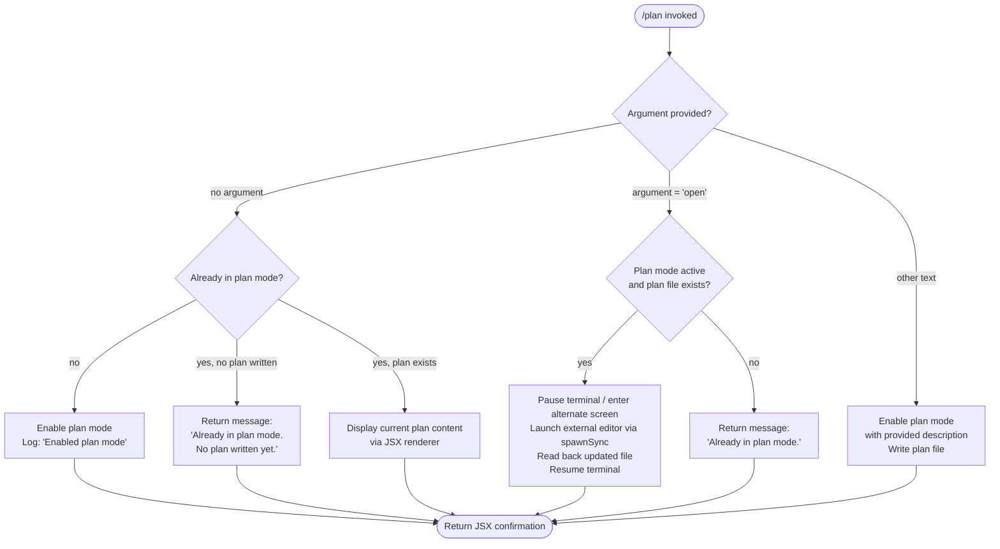

# `/plan`

> Analysis basis: CC v2.1.178 bundle.js (AST extraction + Claude interpretation)
> Minimum version: v2.1.178

---

## Overview

The `/plan` command enables **plan mode** in the current Claude Code session, or opens the existing plan document in an external editor if the `open` sub-command is supplied. When plan mode is already active, the command reports the current status rather than attempting re-activation, and optionally displays the written plan. The command is implemented as an async handler (`v_5`) that coordinates session-state mutations, file I/O, and terminal UI rendering.

---

## Registration

| Field | Value |
|---|---|
| type | `local-jsx` |
| name | `plan` |
| description | Enable plan mode or view the current session plan |
| argumentHint | `[open\|<description>]` |
| loc_byte | `12822004` |
| loc_byte_end | `12822203` |
| loc_line | `8784` |
| module_id | `_JK` |
| load_inline | `true` |
| arbor_handler.name | `v_5` |
| arbor_handler.fqn | `claude-2.1.178::v_5` |
| arbor_handler.kind | `AsyncFunction` |
| arbor_handler.resolution_path | `module_id` |
| arbor_handler.n_hits | `0` |

Analysis basis: CC v2.1.178 bundle.js:+12822004

---

## Input Branching

The handler has four distinct branches driven by the argument value and the current plan-mode state, making a Mermaid flowchart the appropriate representation.



Analysis basis: CC v2.1.178 bundle.js:+12821154, +12821306, +12821384, +12821403, +12821466, +12821513, +12821562, +12821663

---

## Behavioral Spec

### 1. Handler Entry and Argument Parsing

```
async function planCommandHandler(rawArgs, appContext):
    trimmedArgs = rawArgs.trim()                    // +12821384
    sessionState = getSessionState(appContext)
    planModeActive = checkPlanModeFlag(sessionState)
    planContent   = getCurrentPlanContent(sessionState)
```

The handler begins by trimming the raw argument string. It then reads the current session state to determine whether plan mode is already active.

Analysis basis: CC v2.1.178 bundle.js:+12821318, +12821384

---

### 2. No-Argument Path (Toggle / Status)

```
if trimmedArgs == "":
    if not planModeActive:
        enablePlanMode(sessionState)               // mutates session state via dO
        return renderMessage("Enabled plan mode")  // +12821322
    else if planContent == null or planContent == "":
        return renderMessage(
            "Already in plan mode. No plan written yet.")  // +12821562
    else:
        return renderJSXPlanView(planContent)
```

When invoked with no argument:
- If plan mode is **not active**, the session mode is set to `plan` and a confirmation message is returned.
- If plan mode is **already active** but no plan has been written, the string `"Already in plan mode. No plan written yet."` is returned (bundle.js:+12821562).
- If a plan document already exists, the current plan is rendered inline via the JSX rendering path (`rv.createElement`, bundle.js:+12821781).

Analysis basis: CC v2.1.178 bundle.js:+12821306, +12821322, +12821342, +12821562

---

### 3. `open` Sub-Command Path

```
if trimmedArgs == "open":                          // +12821403
    if not planModeActive:
        return renderMessage("Already in plan mode.")  // +12821342
    editor = resolveEditor(appContext)             // SG: checks IDE vs. system editor
    planFilePath = resolvePlanFilePath(appContext) // $cL / WYA
    pauseTerminalRendering():                      // $c sequence
        ink.enterAlternateScreen()                 // +11911503
        ink.pause()                                // +11911533
        ink.suspendStdin()                         // +11911543
    spawnSync(editor, [planFilePath],
              {stdio: "inherit"})                  // +11911625, +11911657
    updatedContent = readFileSync(planFilePath,
                                  encoding="utf-8") // +11911927, +13664550
    ink.exitAlternateScreen()                      // +11912005
    ink.resumeStdin()                              // +11912034
    ink.resume()                                   // +11912050
    return renderUpdatedPlanView(updatedContent)
```

The `open` sub-command suspends Ink's terminal rendering, launches an external editor synchronously, reads the updated file back, and then resumes the terminal. The editor resolution function (`SG`) checks whether the session is running inside an IDE environment (literal `"IDE"`, bundle.js:+6634703) before falling back to a system editor. File encoding is fixed to `"utf-8"` (bundle.js:+13664550).

Analysis basis: CC v2.1.178 bundle.js:+12821403, +11911503, +11911533, +11911543, +11911625, +11911657, +11911927, +11912005, +11912034, +11912050

---

### 4. Description / Free-Text Argument Path

```
if trimmedArgs != "" and trimmedArgs != "open":
    if not planModeActive:
        enablePlanMode(sessionState)
    writePlanContent(trimmedArgs, appContext)   // Cv → file write pipeline
    return renderMessage("Enabled plan mode")  // +12821322
```

Any non-empty, non-`"open"` argument is treated as an initial plan description. Plan mode is activated if not already active, and the argument text is written as the plan document via the file-write pipeline (`Cv` → `Rv` → `vEH` → `cX`).

Analysis basis: CC v2.1.178 bundle.js:+12821513, +12821520, +12821322

---

### 5. Plan Mode State Mutation (`dO`)

```
function setSessionMode(key, value, context):
    if key == "bypassPermissions" and modeNotAvailable(context):
        log("Ignoring permission update: setMode 'bypassPermissions' rejected …")
        // +5166483
        return
    currentRules = context.alwaysAllowRules   // +5166952
                 | context.alwaysDenyRules    // +5166991
                 | context.alwaysAskRules     // +5167009
    applyRuleDelta(key, value, currentRules)  // addRules / replaceRules / removeRules
    updatePermissionDirectories(context)      // addDirectories / removeDirectories
    serializeState(xH → JSON.stringify)       // +5166916
```

The session-state mutation function (`dO`) handles several permission-related sub-operations (`addRules` +5166759, `replaceRules` +5167107, `removeRules` +5167764, `addDirectories` +5167418, `removeDirectories` +5168148). For the `plan` command the relevant mutation is the mode key `"plan"` being set on the session context; the `bypassPermissions` guard (bundle.js:+5166417, +5166483) is a safety check that runs regardless of which mode is being set.

Analysis basis: CC v2.1.178 bundle.js:+5166395, +5166417, +5166483, +5166794, +5166916

---

### 6. File Write Pipeline (`Cv` / `Rv` / `vEH` / `cX`)

```
function writePlanFile(content, context):
    filePath = buildPlanFilePath(context)     // R6 + NwH
    existingData = readExistingPlan(filePath) // vEH: q.get cache lookup
    mergedContent = mergePlanContent(
                        existingData, content,
                        encoding="utf-8")     // +13664550
    if fileIsNew:
        createParentDirectories(filePath)     // fM4 → WS.mkdir
        appendToFile(filePath, mergedContent) // fM4 → WS.appendFile
    else:
        renameToTemp(filePath)               // P__ → WS.rename
        writeFileSync(filePath, mergedContent)// cX → E_H.writeFileSync
    updateFileCache(filePath, mergedContent)  // vEH → q.set
```

The write pipeline checks a file-path cache before performing I/O. It handles `.txt` suffix stripping (literal `".txt"`, bundle.js:+211630) and a 4-byte alignment boundary (literal `4`, bundle.js:+211652). On write failure the error handler (`NFH`) emits a red-colored error to `console.error` and then calls `process.exit(1)` (literals `"cli_error"` +13469426, `1` +13469452).

Analysis basis: CC v2.1.178 bundle.js:+198197, +198215, +211630, +211652, +211682, +211710, +211722, +212014, +13469371, +13469385, +13469426, +13469439, +13469452

---

### 7. Tool-Permission Context Build (`CK6` / `SB` / `WzH`)

```
function buildToolPermissionContext(sessionConfig):
    toolEntries = Object.entries(sessionConfig.tools)  // +11243157
    for each [toolName, toolConfig] in toolEntries:
        resolvedTool = resolveToolPermissions(toolName, toolConfig)
        // SB: maps permission rules per tool via k3 (escaping, substring ops)
        // WzH: applies current session mode overrides via dO
        // bpH: caches resolution in GCq map
    return mergedToolContext
```

The tool-permission context builder is called during plan-mode activation to ensure all tool permission rules are re-evaluated under the new mode. It respects `"session"` scope rules (bundle.js:+11242190) and a `"cliArg"` override path for `--allowed-tools` (bundle.js:+11240602, +11240651).

Analysis basis: CC v2.1.178 bundle.js:+11243157, +11243207, +11242190, +11240602, +11240651

---

### 8. JSX Rendering Path (`xjq` / `z96` / `N4`)

```
function renderPlanUI(content, context):
    output = z96(content)          // streams via K.on events
    stripped = N4(output,
        Bun.stripANSI)             // +3939931: remove ANSI escapes
    element = rv.createElement(
        PlanViewComponent,
        {content: stripped})       // +12821781
    return element
```

The JSX rendering path uses Ink (`rv.createElement`, bundle.js:+12821781) and strips ANSI escape codes from any captured terminal output before embedding it in the rendered component (`Bun.stripANSI`, bundle.js:+3939931). Column padding is applied with a width of 40 characters (literal `40`, bundle.js:+17093864) and a two-space separator (literal `"  "`, bundle.js:+17091893).

Analysis basis: CC v2.1.178 bundle.js:+12821781, +3939931, +17091872, +17091893, +17093864

---

## State & Side Effects

| Item | Detail |
|---|---|
| Telemetry | None detected in depth-2 traversal |
| Session mode mutation | Sets plan mode flag on session state object via `dO` (bundle.js:+12821216) |
| Permission rules re-evaluation | `CK6` / `SB` re-derive tool permission context on mode change (bundle.js:+12821219) |
| File I/O — plan document | `Cv` pipeline writes / appends plan content to a file in the project directory (bundle.js:+12821513) |
| File I/O — temp rename | `P__` renames existing plan file to temp before overwrite; deletes temp on success via `WS.unlink` (bundle.js:+211682, +211722) |
| Terminal suspend / resume | `$c` calls `enterAlternateScreen`, `pause`, `suspendStdin` before editor spawn; reverses on return (bundle.js:+11911503–+11912050) |
| External editor spawn | `hKK.spawnSync` with `stdio: "inherit"` (bundle.js:+11911625, +11911657) |
| Error on write failure | `NFH` prints red error via `J6.red` + `console.error`, then `process.exit(1)` (bundle.js:+13469371, +13469385, +13469439, +13469452) |
| Error logging | `Us.logError` called on rendering/write errors (bundle.js:+1051091) |
| Settings persistence | `LM4` / `fM4` append to settings file via `WS.appendFile` with `Buffer.byteLength` check (bundle.js:+212409, +212014) |
| Cache | Tool permission resolutions cached in `GCq` map (bundle.js:+9397808, +9397884) |

---

## Version History

| Version | Change |
|---|---|
| v2.1.178 | Initial analysis |

---

## Common Mistakes

1. **Invoking `/plan open` when plan mode is not yet active** — the handler returns the `"Already in plan mode."` message (bundle.js:+12821342) without opening an editor. Enable plan mode first with `/plan` or `/plan <description>`.
2. **Expecting `/plan` to re-initialize an existing plan** — if plan mode is already active and a plan document exists, the command only displays the current plan; it does not reset or overwrite it.
3. **Assuming the editor choice is always the system default** — the editor resolution function (`SG`) preferentially detects an IDE environment (bundle.js:+6634703) and may open the file inside the IDE rather than the terminal editor.
4. **Cancelling the editor without saving** — because the handler reads the file after `spawnSync` returns (bundle.js:+11911927), exiting the editor without saving leaves the plan file unchanged but the session continues in plan mode.
5. **Passing an argument of `"open"` when no plan file exists** — the branch guard checks for both plan mode being active and a plan file being present; an absent plan file may cause the open path to fall back to the status message rather than launching the editor.

---

## Appendix — Identifier Mapping

> For bundle debugging only. Identifiers change across versions.

| Identifier | Role |
|---|---|
| `v_5` | Main async handler for `/plan` command (arbor handler, `AsyncFunction`) |
| `q` | Data-stream / chunk accumulator helper |
| `F1` | CLI error dispatch and process-exit wrapper |
| `NFH` | Error formatter; emits red console error then exits |
| `cX` | Synchronous file-write helper (`writeFileSync` wrapper) |
| `K7H` | Session context accessor called at handler start |
| `K` | Map/pad utility for display column formatting |
| `f` | Connection/task set (add, delete, finally lifecycle) |
| `L` | Connection object (close, toLowerCase) |
| `A` | Generic accumulator / state object |
| `dO` | Session-mode mutation function (setMode dispatcher) |
| `N` | Telemetry / network transmission function |
| `AM4` | Transmission sub-handler (delegates to `my`, `D__`, `WSA`) |
| `WSA` | HTTP transport helper |
| `H` | Current argument / string under inspection |
| `xH` | JSON serialisation helper (`JSON.stringify` wrapper) |
| `_` | Misc string / array operand |
| `d4` | Path/string redaction and normalisation helper |
| `sCA` | Path segment mapper |
| `VdH` | File descriptor write wrapper |
| `FCA` | Low-level `H.write` dispatcher |
| `LM4` | Settings persistence manager (append, rotate, byte-length) |
| `sQH` | Debounced flush scheduler (setTimeout / setImmediate) |
| `G7H` | Settings directory builder |
| `n6` | Path normalisation utility |
| `INH` | Settings initialiser (calls `Z8`) |
| `_bA` | Settings file path builder |
| `P__` | Safe-rename / unlink helper for atomic file writes |
| `fM4` | Bound append-file handler (mkdir + appendFile) |
| `F9` | Hook / signal registration helper |
| `e5` | String escape / sanitisation utility |
| `rn4` | `replaceAll` wrapper for escape sequences |
| `CK6` | Tool permission context builder (top-level) |
| `m$A` | Tool resolution coordinator |
| `Um` | Tool list accessor |
| `j0` | Per-tool permission resolver |
| `R$A` | Rule applicator (`rA` delegate) |
| `BJH` | Model-family classifier (claude-3/opus/sonnet/haiku checks) |
| `d1` | Permission decision resolver |
| `rM_` | Settings layer merger (policy / flag / user / local) |
| `b8` | Settings layer iterator |
| `jb` | Auto-mode resolver |
| `WzH` | Session-mode override applicator (iterates `Object.entries`) |
| `SB` | Per-tool permission rule builder |
| `k3` | Rule string transformer (escape, substring, replaceAll) |
| `an4` | Rule prefix helper |
| `AZ` | `Object.hasOwn` guard wrapper |
| `sn4` | Rule suffix helper |
| `on4` | `replaceAll` rule normaliser |
| `y$A` | Allowed-tools list builder |
| `bpH` | Tool permission cache handler (`GCq` map) |
| `h$A` | Relative-path inclusion checker |
| `q6K` | Session-scope rule resolver |
| `luL` | Rule inclusion filter (`mb.includes`) |
| `M` | Message-store / session message accessor |
| `Ij` | Plan-mode flag reader |
| `z7` | Plan-mode state accessor |
| `YNH` | Underlying plan-mode flag store |
| `f56` | Plan file path builder (wraps `NwH`, `R6`) |
| `NwH` | Plan filename generator |
| `R6` | Base path resolver (`TT` delegate) |
| `TT` | Root directory constant provider |
| `Cv` | Plan file write orchestrator |
| `Rv` | Plan content merge and cache writer |
| `vEH` | Plan file read/write cache manager |
| `ey_` | Content sanitiser (`H.replace`) |
| `OsH` | Content formatter (`hG6` delegate) |
| `e$8` | Alternative content formatter (`hG6` delegate) |
| `x8` | Error-code classifier (ENOENT path) |
| `Z8` | Low-level async file operation executor |
| `O1` | Error-code classifier (EACCES/EPERM/ENOTDIR/ELOOP/EROFS) |
| `RH` | Error logger and history manager |
| `jA` | Error-to-string converter |
| `L6` | String coercion helper |
| `qq` | Error event emitter / `biA` delegate |
| `biA` | Error string builder (`L6` delegate) |
| `RQ4` | Error history ring-buffer (shift/push on `Ye6`) |
| `$c` | External editor launcher (terminal suspend/resume) |
| `CB` | Ink instance accessor |
| `Iw` | Ink instance store |
| `$cL` | Plan file path resolver (calls `WYA`) |
| `WYA` | Basename / extension resolver |
| `Z9` | String index/slice helper |
| `SG` | Editor resolver (IDE vs. system editor detection) |
| `xjq` | JSX output capture and render coordinator |
| `z96` | Event-stream renderer (`K.on` listener) |
| `HQ` | UI component composer |
| `BC_` | React element factory wrapper |
| `Ze` | Component renderer (`IPH`, `hC_`) |
| `N4` | ANSI-strip post-processor (`Bun.stripANSI`) |

---

Note: index built via Arbor fallback; some signals (telemetry, literals) may be missing — see arbor-fallback.js.