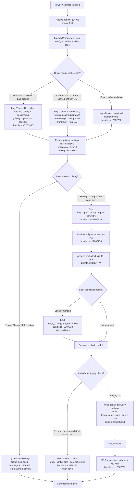

# `/privacy-settings`

> Analysis basis: CC v2.1.179 bundle.js (AST extraction + Claude interpretation)
> Minimum version: v2.1.179

---

## Overview

`/privacy-settings` opens an interactive JSX dialog that allows users to view and modify their Grove (telemetry/data-sharing) policy settings. The command is implemented as a `local-jsx` type, meaning it renders a React-based UI component inline rather than sending a prompt to the model. On invocation, it fetches the current configuration state, presents the privacy settings panel, and persists any user-made changes back to the global config file.

---

## Registration

| Field | Value |
|---|---|
| type | `local-jsx` |
| name | `privacy-settings` |
| description | `View and update your privacy settings` |
| module_id | `PXK` |
| load_inline | `true` |
| loc_byte | `12867783` |
| loc_byte_end | `12867975` |
| loc_line | `8807` |
| arbor_handler.name | `$15` |
| arbor_handler.fqn | `claude-2.1.179::$15` |
| arbor_handler.kind | `AsyncFunction` |
| arbor_handler.resolution_path | `module_id` |
| arbor_handler.n_hits | `0` |

Analysis basis: CC v2.1.179 bundle.js:+12867783

---

## Input Branching

The command's handler (`$15`) exhibits three or more distinct execution paths depending on configuration cache state and user interaction with the dialog. A Mermaid flowchart is used.



---

## Behavioral Spec

### Handler Entry (`$15` — AsyncFunction)

The primary handler is an async function resolved via `module_id` path `PXK`.

```
async function privacySettingsHandler(context):
    // Parallel initialization
    [configResult, xhhResult, zghResult] = await Promise.all([
        fetchGroveConfig(),          // IA6 — bundle.js:+12866774
        resolveXHH(),                // XHH — bundle.js:+12866827
        resolveZGH()                 // zGH — bundle.js:+12866833
    ])

    // Render JSX dialog
    element = createElement(PrivacySettingsDialog, {
        config: configResult,
        onDismiss: handleDismiss,
        onSave: handleSave
    })                               // bundle.js:+12867430

    userAction = await waitForDialogResult(element)

    if userAction.type in ["escape", "defer"]:
        log("Privacy settings dialog dismissed")  // bundle.js:+12866963
        return

    // User confirmed a change
    emitTelemetry("tengu_grove_policy_toggled")  // bundle.js:+12867319
    await savePrivacySettings(userAction.settings)
    await updateMCPSupervisor()      // M / KxH — bundle.js:+12867032
```

Analysis basis: CC v2.1.179 bundle.js:+12866774, +12866814, +12866827, +12866833, +12867032, +12867430

---

### Grove Config Cache Resolution (`IA6` → `Lqq`)

The config loading subsystem checks freshness of a local cache before deciding how to proceed.

```
function loadGroveConfig():
    cacheAge = Date.now() - cache.timestamp  // bundle.js:+7201954

    if cache is absent:
        log("Grove: No cache, fetching config in background (dialog skipped this session)")
        // bundle.js:+7201980
        triggerBackgroundFetch()
        return null

    if cacheAge > STALE_THRESHOLD:
        log("Grove: Cache stale, returning cached data and refreshing in background")
        // bundle.js:+7202100
        triggerBackgroundFetch()
        return cache.data

    log("Grove: Using fresh cached config")  // bundle.js:+7202206
    return cache.data
```

The background fetch path (`Lqq`) calls `zGH`, `h6` (config file reader), and `Date.now` to update the cache.

Analysis basis: CC v2.1.179 bundle.js:+7201954, +7201978, +7202060, +7202296, +7202352, +7202404

---

### Config File Read / Write (`h6`, `r5H`)

```
function readConfigFile(path):
    guard: config access allowed or throw Error("Config accessed before allowed.")
    // bundle.js:+3399762

    content = fs.readFileSync(path, "utf-8")  // bundle.js:+3399818, +3399845
    parsed = JSON.parse(content)

    on parse error:
        emitTelemetry("tengu_config_parse_error")  // bundle.js:+3400393
        if error.code == "ENOENT":                 // bundle.js:+3399992
            return defaultConfig()
        throw

    return parsed
```

```
function writeConfigWithBackup(path, data):
    // Create backup directory if needed
    if not exists(backupDir):
        fs.mkdirSync(backupDir, { recursive: true })   // bundle.js:+3400572

    // Rotate backups — keep at most 5
    existingBackups = fs.readdirStringSync(backupDir)
        .filter(f => f.startsWith(".backup."))         // bundle.js:+3400665, +3398615, literal 5 at bundle.js:+3398748
    if existingBackups.length >= 5:
        removeOldest(existingBackups)

    // Copy current file to backup slot
    timestamp = Date.now()                             // bundle.js:+3400883
    fs.copyFileSync(src, backupPath(timestamp))        // bundle.js:+3400901
    writeAtomic(path, data)
```

Analysis basis: CC v2.1.179 bundle.js:+3399762, +3399818, +3399845, +3399992, +3400393, +3400572, +3400883

---

### Config Save with Lock (`J8` → `eO8` / `tO8`)

```
async function saveConfigWithLock(updates):
    lockResult = await acquireLock()

    if lockResult.contention:
        emitTelemetry("tengu_config_lock_contention")  // bundle.js:+3397818
        log("Lock acquisition took longer than expected - another Claude instance may be running")
        // bundle.js:+3397729

    // Re-read config from disk to get latest state
    freshConfig = readConfigFile(globalConfigPath)

    // Auth-loss guard (GH #3117)
    if cache.hasAuth and not freshConfig.hasAuth:
        log("saveConfigWithLock: re-read config is missing auth that cache has; refusing to write...")
        // bundle.js:+3398145
        emitTelemetry("tengu_config_auth_loss_prevented")  // bundle.js:+3398297
        return

    mergedConfig = merge(freshConfig, updates)
    writeConfigWithBackup(globalConfigPath, mergedConfig)

    if staleConditionDetected:
        emitTelemetry("tengu_config_stale_write")  // bundle.js:+3397954

    // Fallback path for global config
    on fallback:
        log("saveGlobalConfig fallback: re-read config is missing auth...")
        // bundle.js:+3394681
        emitTelemetry("tengu_config_fallback_write")  // bundle.js:+3397434

    releaseLock()
```

Analysis basis: CC v2.1.179 bundle.js:+3394474, +3397729, +3397818, +3397954, +3398145, +3398297, +3397434

---

### Privacy Settings Persistence and Telemetry Gate

When the user confirms a change:

```
function onPrivacySettingsSaved(newSettings):
    // "settings" key used in config object
    configUpdate = { settings: newSettings }  // bundle.js:+12867383

    if policyChanged(currentSettings, newSettings):
        emitTelemetry("tengu_grove_policy_toggled")  // bundle.js:+12867319

    await saveConfigWithLock(configUpdate)

    // Error path
    on failure:
        displayMessage("Unable to retrieve updated privacy settings")
        // bundle.js:+12867090
```

Analysis basis: CC v2.1.179 bundle.js:+12867319, +12867383, +12867090

---

### MCP Supervisor Notification (`M` → `KxH`, `Us8`, `fhA`)

After saving, the MCP connection supervisor is notified to re-evaluate connections that may depend on privacy config.

```
async function notifyMCPSupervisor():
    // Iterate active MCP server slots
    for each [slotId, config] in Object.entries(mcpServerMap):
        connectionResult = await connectMCPServer(slotId, config)
        applyConnectionResult(slotId, connectionResult)

    // Guard: dispose orphaned mid-flight connections
    if slot.configChanged:
        log("applyConnectionResult: disposing orphaned connect (slot config changed mid-flight)")
        // bundle.js:+16716974
    if slot.removed:
        log("applyConnectionResult: disposing orphaned connect (slot removed mid-flight)")
        // bundle.js:+17059

    cleanup(staleConnections)
```

Analysis basis: CC v2.1.179 bundle.js:+12867032, +16716552, +16716562, +16717784, +16716974

---

### Dialog Dismissal Paths

Two dismissal signals are handled explicitly:

- **`"escape"`** key event (bundle.js:+12866938) — user pressed Escape; no changes saved.
- **`"defer"`** action (bundle.js:+12866952) — user explicitly chose to defer; no changes saved.
- Both paths log `"Privacy settings dialog dismissed"` (bundle.js:+12866963) and return without writing config.

---

## State & Side Effects

| Item | Detail |
|---|---|
| Telemetry | `tengu_grove_policy_toggled` (bundle.js:+12867319) — fired when user saves a privacy policy change |
| Telemetry | `tengu_config_parse_error` (bundle.js:+3400393) — config JSON failed to parse |
| Telemetry | `tengu_config_lock_contention` (bundle.js:+3397818) — lock took longer than expected |
| Telemetry | `tengu_config_stale_write` (bundle.js:+3397954) — config written with potentially stale data |
| Telemetry | `tengu_config_auth_loss_prevented` (bundle.js:+3398297) — aborted write to avoid wiping auth |
| Telemetry | `tengu_config_fallback_write` (bundle.js:+3397434) — fallback global config save path used |
| Telemetry | `tengu_mcp_oauth_flow_start` / `_success` / `_error` (bundle.js:+6575190, +6580168, +6581879) — MCP OAuth events triggered during MCP supervisor update |
| Telemetry | `tengu_daemon_config_reload` (bundle.js:+17083201) — daemon reloads config after changes |
| Telemetry | `tengu_mcp_skills` (bundle.js:+6682260) — MCP skills enumerated during supervisor refresh |
| Telemetry | `tengu_bg_retire_pinned_low_mem` / `tengu_bg_prewarm_per_sweep` — background worker lifecycle events, indirectly reachable via supervisor sweep |
| Config writes | Updates `~/.claude.json` (global config) with new privacy/Grove policy via locked atomic write with backup rotation |
| Backup rotation | Up to 5 backups retained in backup directory; oldest pruned (literal `5` at bundle.js:+3398748) |
| File watch | `brf` registers `oO8.watchFile` / `oO8.unwatchFile` on config file (bundle.js:+3395952, +3396285) |
| Hook registration | `U9` calls `oSA.register` (bundle.js:+66377) — registers a cleanup/lifecycle hook |
| appState changes | Grove policy key `"settings"` (bundle.js:+12867383) updated in global state on save |
| MCP side effects | MCP supervisor (`KxH`) re-evaluates all server connections after config change |
| Sound | None found in depth-2 traversal |
| Lock file | File locking via `J8`/`tO8`; write tagged `"save_global"` (bundle.js:+3394927) |
| Error display | `"Unable to retrieve updated privacy settings"` shown on config read failure (bundle.js:+12867090) |

---

## Version History

| Version | Change |
|---|---|
| v2.1.179 | Initial analysis |

---

## Common Mistakes

1. **Dismissing with Escape cancels all changes** — pressing Escape or selecting "defer" (bundle.js:+12866938, +12866952) exits the dialog without saving. Users who adjust toggles but then hit Escape will lose their changes silently.
2. **Concurrent Claude instances can cause lock contention** — if another Claude Code process is running and holds the config lock, the save will be delayed and a warning logged. Users should avoid running `/privacy-settings` while a long operation is ongoing in a second terminal.
3. **Missing cache does not mean settings are empty** — when no cache is present (cold start), the dialog still opens but is populated from a background fetch; changes made before the fetch completes may race with the fresh data.
4. **Auth loss prevention can block saves** — if the in-memory cache has authentication credentials but the on-disk config does not (e.g., file was externally modified), the write will be aborted to avoid wiping credentials (GH #3117 guard, bundle.js:+3398145). The user will see `"Unable to retrieve updated privacy settings"`.
5. **Backup directory is bounded to 5 entries** — the rotation is automatic, but on very constrained filesystems where the backup directory is unwritable, the entire save may fail rather than skip backup.

---

## Appendix — Identifier Mapping

> For bundle debugging only. Identifiers change across versions.

| Identifier | Role |
|---|---|
| `$15` | Main handler (AsyncFunction) for `/privacy-settings` command |
| `IA6` | Config initialization / Grove config loader orchestrator |
| `Q5H` | Config resolution helper (reads auth type `"max"`, `"pro"`) |
| `Lq` | Auth config accessor (reads `uJ_`, `xJ_`) |
| `uJ_` | Auth sub-field reader A |
| `xJ_` | Auth sub-field reader B |
| `aw` | API key / environment resolver (reads `ANTHROPIC_API_KEY`, `apiKeyHelper`) |
| `vA` | Config value accessor with array-inclusion check |
| `Rb` | Array inclusion validator (`Array.isArray` + `H.includes`) |
| `W59` | Fallback config value helper |
| `E4` | Config entry read helper |
| `h6` | Config file reader with watch support |
| `c6` | Config path resolver |
| `iy_` | Config key iterator |
| `r5H` | Low-level config file read with backup/rotation logic |
| `brf` | File watcher registration (`watchFile`/`unwatchFile`) |
| `N` | Telemetry logger / event emitter (debug level) |
| `nM4` | Telemetry batch dispatcher |
| `sSA` | Telemetry sink writer |
| `H` | Random jitter / delay helper (`Math.random`, `setTimeout`) |
| `bH` | JSON serializer (`JSON.stringify`) |
| `_` | General utility / string helper |
| `g4` | Path segment extractor / redactor (outputs `[REDACTED]`) |
| `SbA` | Path map helper |
| `q` | Data store / stream interface |
| `A` | String normalizer (lowercase) |
| `ydH` | Output writer via `GbA` |
| `GbA` | Stream write wrapper |
| `aM4` | Async config write orchestrator (manages lock, backup, atomic write) |
| `AdH` | Debounced write scheduler (`setTimeout`, `setImmediate`) |
| `z7H` | Config directory path builder |
| `z_H` | Filesystem error classifier (`EISDIR`) |
| `xbA` | Config path joiner |
| `I__` | Atomic rename helper (`.txt` extension, rename → unlink) |
| `oM4` | Async append/mkdir writer |
| `U9` | Lifecycle hook registrar (`oSA.register`) |
| `Lqq` | Grove cache refresh orchestrator (background fetch path) |
| `J8` | Config save with file lock (entry point) |
| `eO8` | Locked config write with backup rotation |
| `rXH` | Lock state resolver |
| `KM9` | Config entry enumerator (`Object.entries`) |
| `pG6` | Lock timestamp helper (`Date.now`) |
| `RsH` | Config auth guard |
| `d` | General async deferred / promise helper |
| `tO8` | Global config save fallback path |
| `M` | MCP supervisor state manager |
| `KxH` | MCP server connection orchestrator |
| `IQ` | MCP server slot evaluator |
| `Q86` | MCP slot state helper |
| `vr` | MCP server connector (full connect flow) |
| `HU` | MCP server capability enumerator |
| `G08` | MCP error color formatter (red/yellow) |
| `B86` | MCP server registry (Map-based, `sse`/`http` transport types) |
| `IE` | Config file event watcher wrapper |
| `Jw` | File change event dispatcher |
| `uc_` | File event cleanup helper |
| `K` | Output pad/map helper |
| `f` | Promise tracking Set (add/delete/finally) |
| `L` | Stream close manager |
| `s8` | General string utility |
| `ih6` | MCP server filter predicate |
| `YHq` | MCP needs-auth cache manager |
| `Sn_` | Cache key builder |
| `j0H` | Content hash builder (`sha256`, `hex`) |
| `JL8` | Cache entry serializer |
| `XL8` | Cache serializer wrapper |
| `rX` | Hash helper (`Il1.createHash`) |
| `DL8` | Cache deserializer |
| `q4` | Cache parse helper |
| `$8` | MCP debug log emitter (`ks.logMCPDebug`) |
| `F08` | MCP connection runner (stdio/sse/oauth) |
| `KR7` | MCP transport selector |
| `il` | MCP process launcher |
| `HqH` | MCP IDE connection helper |
| `_qH` | MCP connection option normalizer |
| `OqH` | MCP OAuth flow executor (full OAuth PKCE/callback server) |
| `r86` | MCP in-flight connection tracker (Map) |
| `Y` | Process exit / abort handler |
| `Q08` | MCP cache invalidator |
| `yr` | MCP reconnect orchestrator |
| `hm` | MCP process monitor |
| `w` | MCP supervisor write / daemon config reload |
| `w7` | MCP error log emitter (`ks.logMCPError`) |
| `GH` | String coercer (`String()`) |
| `fR7` | MCP fallback path |
| `qR7` | MCP SSH detection path (`cH.isSSH`) |
| `g08` | MCP tool result handler (OAuth `complete_authentication`) |
| `i86` | In-flight connection getter (`R08.get`) |
| `o86` | Cached connection getter (`C08.get`) |
| `ZHq` | Needs-auth cache reader |
| `H9` | Async-local-storage store getter (`YWf.getStore`) |
| `BG8` | Cache path builder (`mcp-needs-auth-cache.json`) |
| `ac_` | Auth cache writer |
| `j` | Process SIGTERM sender |
| `S` | Worker/subprocess lifecycle manager |
| `Yh` | MCP skills enumeration wrapper |
| `Y6` | Individual MCP skill connector |
| `xc_` | MCP server inclusion filter |
| `y` | Background worker pool manager (blur/focus, `3600000` ms stale threshold) |
| `wi` | Worker state classifier |
| `I` | Background worker pool sweeper |
| `k` | Worker pool entry |
| `NaK` | Away-summary worker selector |
| `PHq` | Async iterator / mapper wrapper |
| `qQ` | Async iterable pipeline (TypeError guard, `AggregateError`) |
| `T_6` | MCP timeout parser (`parseInt`, `10` radix) |
| `FG8` | MCP timeout secondary parser (`parseInt`, `20` radix) |
| `Us8` | MCP apply-connection-result handler |
| `qxH` | MCP update hash builder |
| `GG` | MCP cleanup orchestrator |
| `W_6` | MCP server entry hash builder |
| `$` | MCP daemon status writer |
| `yTK` | Daemon status file writer (`daemon.status.json`) |
| `Ht` | Status path resolver |
| `VF6` | Status path joiner |
| `fhA` | MCP full reconcile loop (entry: `Object.entries` → `KxH` → `Us8`) |
| `N08` | MCP server set membership check (`SS7.has`, `Qc_.has`) |
| `n8` | Async retry helper with `setTimeout`/`clearTimeout` |
| `O` | Background session tracker |
| `q6` | Dialog result decoder |
| `n36` | Dialog result constants |

---

Note: index built via Arbor fallback; some signals (telemetry, literals) may be missing — see arbor-fallback.js.