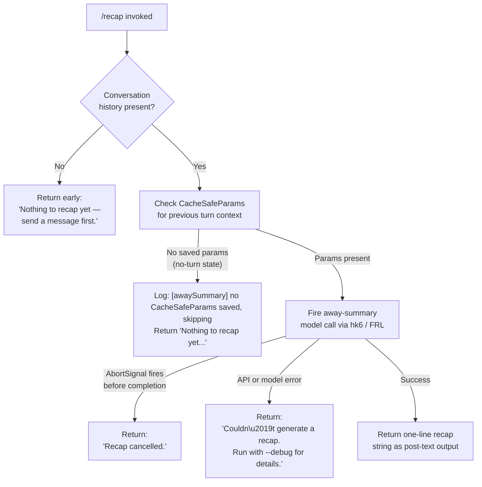

# `/recap`

> Analysis basis: CC v2.1.179 bundle.js (AST extraction + Claude interpretation)
> Minimum version: v2.1.179

---

## Overview

`/recap` triggers an on-demand, single-turn model call that produces a one-line summary of the current Claude Code session. It is a lightweight "away summary" request: it fires the same background-summary pipeline used for automatic session recaps, but invoked synchronously by the user, and delivers its result as post-text output. The command is non-interactive and does not accept user arguments.

---

## Registration

| Field | Value |
|---|---|
| type | `local` |
| name | `recap` |
| description | `Generate a one-line session recap now` |
| supportsNonInteractive | `false` |
| thinClientDispatch | `post-text` |
| load_inline | `true` |
| load_ident | `k55` |
| loc_byte | `13409475` |
| loc_byte_end | `13409691` |
| loc_line | `9578` |
| arbor_handler.name | `k55` |
| arbor_handler.fqn | `claude-2.1.179::k55` |
| arbor_handler.kind | `AsyncFunction` |
| arbor_handler.resolution_path | `load_ident` |
| arbor_handler.n_hits | `0` |

Analysis basis: CC v2.1.179 bundle.js:+13409475

The handler is inlined via `load: () => Promise.resolve({ call: k55 })`. There is no separate `module_id`; the call graph entry begins at `k55` via `"via":"load_ident"`.

---

## Input Branching

The command exhibits four distinct outcome branches depending on session state and the result of the model call. A Mermaid flowchart is used accordingly.



Analysis basis: CC v2.1.179 bundle.js:+13409225 (empty-history message), +13409317 (cancelled message), +13409375 (error message), +7016877 (no-CacheSafeParams log), +7016935 (no-turn literal).

---

## Behavioral Spec

### Top-level handler — `recapCommandHandler` (`k55`)

The handler is an `AsyncFunction` loaded inline.

```
async function recapCommandHandler(context):
    history = context.conversationHistory   // or equivalent app-state accessor
    if history is empty or unavailable:
        return "Nothing to recap yet — send a message first."

    abortController = new AbortController()
    registerAbortListener(context, abortController)

    result = await awaysSummaryQuery(context, abortController.signal)

    if result.status == "abort":
        return "Recap cancelled."
    if result.status == "api-error" or result.status == "error":
        return "Couldn't generate a recap. Run with --debug for details."

    return result.text   // one-line recap string
```

Analysis basis: CC v2.1.179 bundle.js:+13409083 (k55 → hk6 call edge), +13409225, +13409317, +13409375, +7017484 (api-error literal), +7017545 (ok literal).

---

### Away-summary query dispatcher — `awaySummaryQueryDispatcher` (`hk6`)

This function guards the summary pipeline with a "no-turn" check before delegating to the core query engine.

```
async function awaySummaryQueryDispatcher(context, signal):
    params = getCacheSafeParams(context)   // NqH
    if params is null:
        log.debug("[awaySummary] no CacheSafeParams saved, skipping")
        return { status: "no-turn" }

    // Register abort listener on the provided signal
    signal.addEventListener("abort", () => {
        abortOngoingQuery()
    })

    // Dispatch the actual model query
    queryResult = await coreQueryLoop(context, params, {
        systemPrompt: "Away summary cannot use tools",
        noTools: true,
        label: "away_summary"
    })   // delegates to mainQueryLoop (lT) → FRL

    return queryResult
```

Analysis basis: CC v2.1.179 bundle.js:+7016856 (hk6 → NqH), +7016875 (hk6 → N), +7016877 (log string), +7016935 (no-turn), +7016972 (addEventListener), +7017003 (abort), +7017050 (lT), +7017183 ("Away summary cannot use tools"), +7017251 (away_summary label).

---

### Core query loop entry — `mainQueryEntry` (`lT`)

`lT` is the top-level turn orchestrator invoked by the recap pathway. For the recap use-case it operates in a constrained single-turn mode (no tool execution, no multi-turn continuation).

```
async function mainQueryEntry(context, params, options):
    startTime = Date.now()
    sessionId = generateSessionId()   // WR — random hex bytes
    turnContext = buildTurnContext(context, params, options)   // jC8

    // Select model configuration
    modelConfig = resolveModelConfig(turnContext)   // lKH → Pf, qBH

    // Execute the streaming API request
    streamResult = await streamingQueryLoop(turnContext, modelConfig)   // sU → FRL

    // Post-turn cleanup
    cleanupSubagentProcesses()   // Dp8
    return streamResult
```

Analysis basis: CC v2.1.179 bundle.js:+10805213 (Date.now), +10805336 (jC8), +10805605 (JC8), +10805623 (WR), +10805647 (lKH), +10805667 (N), +10805798 (sU).

---

### Turn context builder — `buildTurnContext` (`jC8`)

Constructs the full request context by reading app state and injecting session metadata.

```
function buildTurnContext(context, params, options):
    appState = context.getAppState()
    threadContext = buildThreadContext(appState)   // J3H — load/dump
    promptMessages = assemblePromptMessages(appState, params)   // EWH, Oa9
    context.setAppState(updatedState)
    requestId = crypto.randomUUID()   // aaq.randomUUID
    return {
        messages: promptMessages,
        thread: threadContext,
        requestId,
        avoidPrompts: true   // "avoid_prompts" flag set
    }
```

Analysis basis: CC v2.1.179 bundle.js:+10802299 (getAppState), +10803042 (J3H), +10803216 (EWH), +10803322 (Oa9), +10803463 (setAppState), +10804592 (randomUUID), +10802529 ("avoid_prompts").

---

### Streaming query loop — `streamingQueryLoop` (`FRL`)

This is the large core query engine. For the recap command it runs in a restricted mode: no tool calls are enabled (`Away summary cannot use tools`), and the loop completes after the first assistant text response. Key sub-behaviors observed in the call graph at depth ≤ 2:

```
async function streamingQueryLoop(turnContext, modelConfig):
    // Setup phase
    emit("query_setup_start")
    resolveToolSet(turnContext, { noTools: true })   // yH.addTool skipped
    emit("query_setup_end")

    // API streaming phase
    emit("query_api_streaming_start")
    stream = await callModelAPI(turnContext, modelConfig)   // Y.callModel

    for each event in stream:
        if event.type == "message_delta":
            accumulateText(event)
        if event.type == "end":
            break
        // error / overloaded / model_not_found paths trigger fallback or abort

    emit("query_api_streaming_end")

    // Post-streaming
    finalizeResponse(turnContext)
    emit("query_setup_end")
    return { status: "ok", text: accumulatedText }
```

Analysis basis: CC v2.1.179 bundle.js:+10744672 (FRL entry via sU), +10746302 ("query_fn_entry"), +10746334 ("query_started"), +10753983 ("query_api_streaming_start"), +10766790 ("query_api_streaming_end"), +10754036 (Y.callModel), +10765934 ("message_delta"), +10767043 ("end").

---

### Session transcript writer — `sessionTranscriptWriter` (`aM4`)

Called during the query pipeline to persist transcript data for the away-summary turn.

```
async function sessionTranscriptWriter(context, turnData):
    dirPath = path.dirname(context.transcriptPath)   // O7H.dirname
    await ensureDirectoryExists(dirPath, hk)   // hk
    byteSize = Buffer.byteLength(turnData)
    targetFile = resolveTargetFile(context)   // xbA → O7H.join, I6

    // Rotate file if needed
    await rotateIfNeeded(targetFile)   // I__ → stat, endsWith(".txt"), rename, unlink

    // Append turn data
    await appendTurnData(targetFile, turnData)   // oM4 → mkdir, appendFile
    await registerFileHandle(context)   // U9 → oSA.register
```

Analysis basis: CC v2.1.179 bundle.js:+212270 (aM4 → AdH), +212295 (z7H), +212303 (O7H.dirname), +212333 (hk), +212423 (z_H), +212440 (xbA), +212472 (I__), +212478 (Buffer.byteLength), +212511 (R__), +212537 (oM4.bind), +212633 (U9).

---

### Result fan-out — `resultFlatMapper` (`YAq`)

After the model returns text, this function expands the response into the output record(s) that are written back to the terminal via `post-text` dispatch.

```
function resultFlatMapper(rawResult):
    return rawResult.flatMap(item => {
        // normalize item shape
        return [normalizedItem]
    })
```

Analysis basis: CC v2.1.179 bundle.js:+7017501 (hk6 → YAq), +7017711 (H.flatMap).

---

## State & Side Effects

| Item | Detail |
|---|---|
| Telemetry | Inherits from the shared query pipeline (see below); no recap-specific `tengu_*` event was found at depth ≤ 2 within `k55`/`hk6` themselves. Pipeline events fired include `tengu_auto_compact_succeeded`, `tengu_query_error`, `tengu_ptl_surfaced_to_user`, `tengu_model_fallback_triggered`, and others listed in the full telemetry array via `FRL`. |
| Hook registration | `oSA.register` is called (via `U9`) to register the transcript file handle (bundle.js:+66377). |
| appState changes | `setAppState` is called inside `buildTurnContext` (`jC8`) to record the new turn's request context (bundle.js:+10803463). `B.setAppState` is also called inside `FRL` after the streaming loop concludes (bundle.js:+10751604). |
| Transcript file I/O | `aM4` / `oM4` append the recap turn to the session transcript via `fs.appendFile`, with rotation logic (`I__` using `stat`, `rename`, `unlink`) if the file grows large (bundle.js:+212083, +211595). |
| Sound | Not observed in the depth-2 traversal. |
| AbortController | A new `AbortController` is created and an `abort` listener is attached to the signal to cancel the in-flight model call if the user interrupts (bundle.js:+7016991, +7017003). |
| Output dispatch | `thinClientDispatch: "post-text"` — the recap string is written to the terminal as a plain text message appended after the command prompt. |

---

## Version History

| Version | Change |
|---|---|
| v2.1.179 | Initial analysis |

---

## Common Mistakes

1. **Running `/recap` before any conversation turn**: The command returns `"Nothing to recap yet — send a message first."` if no prior user/assistant exchanges exist in the session. It requires at least one complete turn with saved `CacheSafeParams`.
2. **Expecting tool use or multi-turn output**: The recap pipeline explicitly disables tools (`"Away summary cannot use tools"`). The model is restricted to producing a single plain-text response; no tool calls will be executed or displayed.
3. **Using `/recap` in non-interactive (`--print` / pipe) mode**: `supportsNonInteractive` is `false`. Invoking the command in a non-interactive session is not supported and the command may silently no-op or error.
4. **Interrupting and expecting a partial recap**: If the `AbortController` fires before the model response completes (e.g., the user presses `Ctrl+C`), the output is the fixed string `"Recap cancelled."` — no partial summary is returned.
5. **Interpreting the recap as a persistent record**: The command generates a one-line summary for immediate display only. The output is not automatically stored to a named file or exported; it is delivered via `post-text` to the terminal.

---

## Appendix — Identifier Mapping

> For bundle debugging only. Identifiers change across versions.

| Identifier | Role |
|---|---|
| `k55` | Top-level recap command handler (`AsyncFunction`; handler resolved via `load_ident`) |
| `hk6` | Away-summary query dispatcher; guards with CacheSafeParams check, fires model call |
| `NqH` | CacheSafeParams retrieval function |
| `N` | Core message/turn assembler utility |
| `nM4` | Message normalization / turn formatting helper |
| `sSA` | Sub-step within message formatting |
| `bH` | JSON serializer wrapper (`JSON.stringify`) |
| `g4` | Text transformation / truncation helper |
| `SbA` | Array mapping step inside text transform |
| `ydH` | File write wrapper |
| `GbA` | Inner file write helper (`H.write`) |
| `aM4` | Session transcript writer (append-with-rotation) |
| `AdH` | Debounced write scheduler (`clearTimeout` / `setTimeout` / `setImmediate`) |
| `z7H` | Transcript path joiner / index resolver |
| `c6` | Directory creation helper |
| `z_H` | EISDIR-aware error handler |
| `xbA` | Target file path builder (`O7H.join` + `I6`) |
| `I__` | Transcript rotation logic (`stat` / `rename` / `unlink`) |
| `oM4` | Transcript append executor (`mkdir` + `appendFile`) |
| `U9` | File handle registration (`oSA.register`) |
| `lT` | Main query entry / turn orchestrator |
| `jC8` | Turn context builder (reads/writes app state, assembles messages) |
| `ny` | Low-level session initializer |
| `J3H` | Thread context builder (`load` / `dump`) |
| `EWH` | Prompt message assembler |
| `Oa9` | Additional prompt assembly step |
| `M` | App state accessor / map helper |
| `LU8` | Model selection helper |
| `WR` | Random hex token generator (uses `lj8.randomBytes`) |
| `JC8` | Session-level identifier builder |
| `lKH` | Model configuration resolver |
| `Pf` | Model registry accessor |
| `qBH` | Model list filter (filters by provider "ant") |
| `sU` | Streaming loop entry wrapper |
| `FRL` | Core streaming query loop (large; handles all API streaming, fallbacks, tool drain, compaction) |
| `Dp8` | Subagent process cleanup on turn end |
| `IH` | Feature-flag checker (emits `tengu_feature_ok`) |
| `CH` | Feature-flag checker (emits `tengu_feature_bad`) |
| `bZ` | Unknown utility reached from `lT` |
| `Rm6` | ACL-based capability check |
| `u6H` | Unknown post-turn helper |
| `OU8` | Unknown post-turn helper |
| `iaq` | Capability / ACL check wrapper (calls `Rm6`) |
| `D` | Background session / daemon process manager |
| `d` | Low-level logger / debug sink |
| `b` | Scheduled background task runner |
| `n8` | Timeout/retry utility |
| `il8` | macOS memory sampler |
| `oRH` | Temp-file cleanup utility (`lstat` / `rm` / `readFile`) |
| `SH` | Error logging helper (`ks.logError`) |
| `g` | Promise retire-if-settled helper |
| `Y6` | Background job registry lookup |
| `_kA` | Daemon socket connection handler |
| `MkA` | Daemon job lifecycle manager |
| `f` | Shared queue operation wrapper |
| `Y` | Forced-shutdown handler (`process.exit`) |
| `G8` | EISDIR error thrower |
| `QH` | Low-level I/O primitive |
| `B` | App-state bus / event emitter |
| `KOH` | MCP server filter / connection tracker |
| `wX` | MCP connection helper |
| `H$L` | Array find helper |
| `qCL` | Forked-agent query wrapper (emits `tengu_fork_agent_query`) |
| `a_` | Nonconforming-response handler |
| `U8` | Daemon attach context builder (`CI.randomUUID`) |
| `P` | IPC buffer/framing layer (`Buffer.concat`) |
| `X` | Socket timeout manager |
| `j` | Process kill helper |
| `cL` | Stream end/cleanup wrapper |
| `qx5` | Main daemon worker session handler (PTY resize, repaint, snapshot, etc.) |
| `GH` | String coercion utility |
| `YAq` | Result flat-mapper (expands model output into post-text records) |

---

Note: index built via Arbor fallback; some signals (telemetry, literals) may be missing — see arbor-fallback.js.