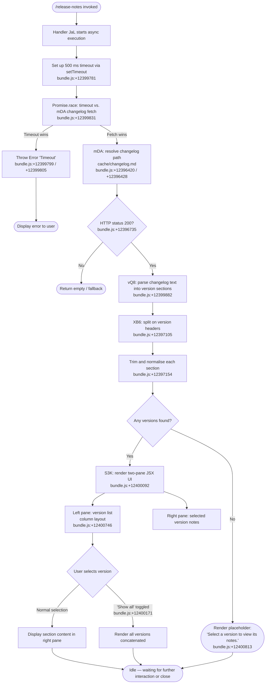

# `/release-notes`

> Analysis basis: CC v2.1.178 bundle.js (AST extraction + Claude interpretation)
> Minimum version: v2.1.178

---

## Overview

`/release-notes` opens an interactive, versioned release-notes browser directly inside the Claude Code CLI. It reads a bundled `changelog.md` file (served from a local cache path), parses it into per-version sections, and renders a two-pane UI: a version selector on the left and the corresponding notes on the right. The command is asynchronous and uses a `Promise.race` with a 500 ms timeout guard to ensure the UI always resolves promptly.

---

## Registration

| Field | Value |
|---|---|
| type | `local-jsx` |
| name | `release-notes` |
| description | `View release notes` |
| module_id | `R3K` |
| load_inline | `true` |
| loc_byte | `12401525` |
| loc_byte_end | `12401666` |
| loc_line | `8253` |
| arbor_handler.name | `JaL` |
| arbor_handler.fqn | `claude-2.1.178::JaL` |
| arbor_handler.kind | `AsyncFunction` |
| arbor_handler.resolution_path | `module_id` |
| arbor_handler.n_hits | `0` |

Analysis basis: CC v2.1.178 bundle.js:+12401525

---

## Input Branching

The command has more than three distinct execution paths (timeout race, successful fetch, parse error, empty changelog, version-selection UI state, "Show all" toggle), so a Mermaid flowchart is used.



---

## Behavioral Spec

### 1. Async Handler Entry (`JaL`)

The top-level handler is an `AsyncFunction` resolved via `module_id → R3K → JaL`.

```
async function releaseNotesHandler(context):
    timeoutPromise = createTimeout(500, "Timeout")   // +12399781, +12399805, +12399817
    fetchPromise   = fetchChangelog()                 // mDA — +12399845
    result = await Promise.race([timeoutPromise, fetchPromise])  // +12399831

    if result is Error("Timeout"):
        throw result                                  // +12399799

    sections = parseChangelog(result)                 // vQ8 — +12399882
    renderUI(sections)                                // ij — +12399913
```

Analysis basis: CC v2.1.178 bundle.js:+12399781

---

### 2. Changelog Fetch (`mDA`)

Resolves the on-disk path for the changelog, reads it through the config-layer cache, and returns the raw text.

```
async function fetchChangelog():
    basePath  = resolveConfigRoot()         // R_ — +12396666
    cachePath = joinPath(basePath, "cache", "changelog.md")   // +12396420, +12396428
    cached    = configCache.get(cachePath)  // vj.get — +12396711
    if cached and cached.status == 200:     // +12396735
        return cached.body
    fetched   = networkFetch(buildUrl())    // uDA — +12396777
    storeContext = getAsyncStore()          // f9 — +12396789
    timestamp  = Date.now()                 // +12396850
    writeConfig(fetched, timestamp)         // W8 — +12396861
    return fetched
```

Analysis basis: CC v2.1.178 bundle.js:+12396666

The `uDA` helper builds the remote URL by joining path segments (`jB6.join` — +12396406) and delegates to an internal fetch wrapper (`M_` — +12396415).

---

### 3. Changelog Parser (`vQ8` / `XB6`)

Splits the raw changelog Markdown into a map of version → content entries.

```
function parseChangelog(rawText):
    lines    = rawText.split(versionHeaderPattern)   // XB6 — +12397105
    sections = {}
    for each raw section in lines:
        trimmed = section.trim()                     // +12397154
        if trimmed is empty: continue
        [versionKey, body] = parseVersionLine(trimmed)   // Z9 — +12397231
        // Z9 splits on " - " separator (+12397236) using indexOf/slice
        body = body.trim()
        sections[versionKey] = body

    keys    = Object.keys(sections)                  // +12397775
    ordered = keys.filter(isValidVersion)            // +12397875
    return ordered
```

Analysis basis: CC v2.1.178 bundle.js:+12397105

`RH` handles low-level line reading with an internal queue (`RQ4` — +12397973) and error logging (`Us.logError`).

---

### 4. UI Renderer (`S3K` — JSX component)

The React component builds the interactive two-pane view.

```
function ReleaseNotesUI(props):
    [selectedVersion, setSelectedVersion] = useState(props.versions[0])
    [showAll, setShowAll]                 = useState(false)

    // Left column — version selector
    versionList = props.versions.map(v =>
        renderVersionItem(v, isSelected=(v == selectedVersion))
    )                                                  // +12400269

    // React memo cache uses sentinel symbol            // +12400661 / +12400672
    if showAll:                                        // +12400171
        rightPane = renderAllSections(props.sections)
    else if selectedVersion is null:
        rightPane = renderPlaceholder(
            "Select a version to view its notes."      // +12400813
        )
    else:
        rightPane = renderSection(props.sections[selectedVersion])

    // Outer layout: column flex                       // +12400746
    return Column(
        leftPane  = versionList,
        rightPane = rightPane
    )
```

Analysis basis: CC v2.1.178 bundle.js:+12400092

The "Show all" label literal (`"Show all"`) is found at +12400171. The placeholder string `"Select a version to view its notes."` is at +12400813.

---

### 5. Config-Write Safety Layer (`W8` / `wO8`)

When the fetched changelog is cached locally, the write path passes through the global config save infrastructure, which protects against concurrent writes.

```
function saveWithLock(data, path):
    lockResult = acquireLock(path)          // kT — wO8:+3345597
    if lockAcquisitionSlow (> 100 ms):      // +3348817
        emit telemetry("tengu_config_lock_contention")   // +3348912
        log("Lock acquisition took longer than expected…")  // +3348823

    reread = readConfigFromDisk(path)
    if reread is missing auth that cache holds:
        emit telemetry("tengu_config_auth_loss_prevented")  // +3349391
        abort("saveConfigWithLock: re-read config is missing auth…")  // +3349239

    writeAtomic(data, path)                 // ED6 — +3350082
    releaseLock()
```

Auth-loss detection prevents wiping `~/.claude.json` (see GH #3117 reference at +3349239 and the fallback variant at +3345800).

Analysis basis: CC v2.1.178 bundle.js:+3348912

---

### 6. Animated Delay Helper (`I3K` / `pDA`)

A lightweight animation helper uses `_.map` (+12399581) to produce a staggered-display sequence and `H.slice` (+12399656) to clip the array before passing it to the render function (`ij` — +12399682).

```
function animateItems(items, displayFn):
    mapped   = lodashMap(items, transform)   // pDA — +12399709
    clipped  = mapped.slice(0, limit)        // +12399656
    displayFn(clipped)                       // ij — +12399682
```

Analysis basis: CC v2.1.178 bundle.js:+12399581

---

## State & Side Effects

| Item | Detail |
|---|---|
| Telemetry: `tengu_config_lock_contention` | Fired when changelog cache write lock takes longer than expected (bundle.js:+3348912) |
| Telemetry: `tengu_config_stale_write` | Fired when a stale config write is detected during cache save (bundle.js:+3349048) |
| Telemetry: `tengu_config_parse_error` | Fired when the on-disk config cannot be parsed during cache validation (bundle.js:+3351487) |
| Telemetry: `tengu_config_auth_loss_prevented` | Fired when a write would have wiped auth credentials (bundle.js:+3349391) |
| Telemetry: `tengu_config_fallback_write` | Fired when fallback write path is used for the global config (bundle.js:+3348528) |
| Timeout guard | 500 ms `Promise.race` timeout on changelog fetch (bundle.js:+12399817) |
| File I/O | Reads `cache/changelog.md` from the config root; may write/update it via atomic rename (`ED6`) |
| Config backup | Up to 5 rolling backups kept in a `backups/` subdirectory (literal `"backups"` at +3350424, limit `5` at +3349842) |
| Lock file | File-system lock with 60 000 ms timeout (bundle.js:+3349593) for concurrent-instance protection |
| Error exit | `F1` calls `process.exit` with error code after logging `cli_error` (bundle.js:+13469426 / +13469439) |
| React memo cache | Uses `Symbol.for("react.memo_cache_sentinel")` (bundle.js:+12400661 / +12400672) |
| appState changes | None observed in depth-2 traversal |
| Sound | None observed in depth-2 traversal |

---

## Version History

| Version | Change |
|---|---|
| v2.1.178 | Initial analysis |

---

## Common Mistakes

1. **Invoking `/release-notes` in a non-interactive terminal** — The command renders a JSX two-pane UI that requires an interactive TTY. Running it in a piped or headless context will produce no visible output or may throw a render error.
2. **Stale cache causing outdated notes** — The changelog is cached locally. If the network fetch fails and a cached copy exists with a non-200 status, the command may silently show no notes. Deleting or invalidating the local `cache/changelog.md` forces a fresh fetch.
3. **Timeout on slow networks** — The 500 ms `Promise.race` guard (bundle.js:+12399817) means that on a very slow or firewalled connection the command will throw `"Timeout"` rather than waiting for the network. There is no user-configurable timeout override exposed by this command.
4. **Concurrent Claude instances causing lock contention** — If another Claude Code process is running and holds the config write lock, the cache-write step may be slow or log a `tengu_config_lock_contention` event, though the UI itself is still presented from any already-cached data.
5. **Misinterpreting "Show all" behaviour** — Selecting "Show all" concatenates every version's notes in the right pane; it does not paginate. Very large changelogs may produce a long scrollable output rather than a filtered list.

---

## Appendix — Identifier Mapping

> For bundle debugging only. Identifiers change across versions.

| Identifier | Role |
|---|---|
| `JaL` | Top-level async handler for `/release-notes` (arbor_handler) |
| `mDA` | Changelog fetch + cache-read orchestrator |
| `uDA` | URL builder and network fetch wrapper for changelog |
| `vQ8` | Changelog text parser — produces ordered version map |
| `XB6` | Low-level line splitter for version headers |
| `Z9` | Version-line tokeniser (splits on `" - "` separator) |
| `RH` | Line-reader with internal queue and error logging |
| `RQ4` | Internal FIFO queue used by line-reader |
| `jA` | Error constructor wrapper |
| `S3K` | JSX UI renderer (two-pane release-notes component) |
| `I3K` | Animated item display helper |
| `pDA` | Item transformation mapper (used by animation helper) |
| `W8` | Global config save with lock orchestrator |
| `wO8` | Atomic file-write engine (mkdir, copy, rename) |
| `_MH` | Config read/parse from disk |
| `ED6` | Atomic symlink-safe file writer |
| `YO8` | Save-global-config fallback path |
| `CG6` | Timestamp utility used during config writes |
| `PL9` | Config-entries iterator |
| `tR1` | Object-assign merge helper for config state |
| `zk_` | Backup-path builder (`backups/` subdirectory) |
| `JsH` | JSON serialiser for config write |
| `xH` | `JSON.stringify` wrapper |
| `N` | Log-level / debug-mode resolver |
| `gXH` | Lock-file acquisition helper |
| `kT` | Lock token / file-descriptor holder |
| `Z8` | File-existence / stat guard |
| `n6` | Node `fs` module alias used in config I/O |
| `f9` | Async-local-storage store getter |
| `R_` | Config root path resolver |
| `qq` | Telemetry / beacon sender |
| `biA` | Traffic-category classifier (`essential-traffic`, `no-telemetry`) |
| `L6` | String coercion utility |
| `JB6` | Secondary changelog accessor (shares `uDA` / `f9`) |
| `F1` | Fatal error handler (logs + `process.exit`) |
| `NFH` | Console error formatter (`J6.red`) |
| `cX` | CLI error state writer (`E_H.writeFileSync`) |
| `VQ8` | Version-list sort / ordering helper |
| `ij` | Render / display dispatcher |
| `dH` | Async helper (delegates to `c36`) |
| `xGK` | Telemetry event emitter with timestamp |
| `$` | Outer async wrapper (calls `xGK`) |
| `K` | Column-pad formatter (`padEnd`) |
| `V` | Scroll / viewport math helper |
| `P` | Buffered stream reader |
| `E` | Clamp / range math helper |
| `d` | Generic utility / side-effect helper |
| `L` | Promise-tracking set manager (add/delete/finally) |
| `A` | String normaliser (toLowerCase) |
| `q` | Active-promise set |
| `H` | Random delay generator (Math.random + setTimeout) |
| `_` | Lodash / utility map reference |
| `M_` | Internal fetch / HTTP client |
| `vj` | In-memory response cache (Map) |
| `WL9` | Config schema validator |
| `oX` | JSON parse helper |
| `Rm` | Config migration helper |
| `i6` | Config field accessor |

Note: index built via Arbor fallback; some signals (telemetry, literals) may be missing — see arbor-fallback.js.