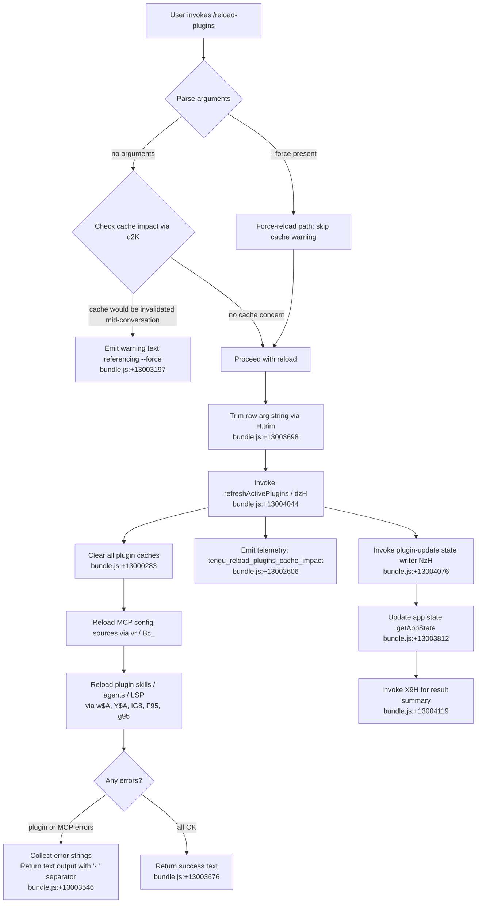

# `/reload-plugins`

> Analysis basis: CC v2.1.179 bundle.js (AST extraction + Claude interpretation)
> Minimum version: v2.1.179

---

## Overview

`/reload-plugins` activates pending plugin changes (MCP servers, skills, agents, and hooks) in the current session without restarting Claude Code. It optionally accepts a `--force` flag, which bypasses the cache-preservation heuristic that would otherwise warn users that a mid-conversation reload may require replaying the whole conversation context.

---

## Registration

| Field | Value |
|---|---|
| type | `local` |
| name | `reload-plugins` |
| description | `Activate pending plugin changes in the current session` |
| argumentHint | `[--force]` |
| supportsNonInteractive | `false` |
| thinClientDispatch | `control-request` |
| module_id | `c2K` |
| load_inline | `true` |
| loc_byte | `13004614` |
| loc_byte_end | `13004858` |
| loc_line | `9010` |
| arbor_handler.name | `Q95` |
| arbor_handler.fqn | `claude-2.1.179::Q95` |
| arbor_handler.kind | `AsyncFunction` |
| arbor_handler.resolution_path | `module_id` |
| arbor_handler.n_hits | `0` |

Analysis basis: CC v2.1.179 bundle.js:+13004614

---

## Input Branching

The handler has four or more distinct decision paths based on cache state, `--force` flag, and argument parsing. A Mermaid flowchart is required.



---

## Behavioral Spec

### 1. Entry Point — Handler `Q95` (reloadPluginsHandler)

The Arbor-resolved handler for `/reload-plugins` is the async function `Q95` in module `c2K`.

```
async function reloadPluginsHandler(args, context):
    # Step 1 — log the reload_plugins event
    callLoggingHelper(Nj, D7)            # bundle.js:+13003312, +13003330

    # Step 2 — determine plugin-type scope (plugin / skill / agent / plugin MCP server)
    pluginType = determineTypeLabel(fa)  # bundle.js:+13003408
    # fa → y8, literals: "plugin", "skill", "agent", "plugin MCP server"
    # bundle.js:+13003428, +13003459, +13003487, +13003519

    # Step 3 — check if --force was passed; parse arg string
    rawArg = args.trim()                 # bundle.js:+13003698
    forceFlag = rawArg.includes("--force") OR rawArg === "force"
    # literals: "--force" bundle.js:+13003734, "force" bundle.js:+13003749

    # Step 4 — evaluate cache impact
    cacheImpact = checkCacheImpact(Q2K)  # bundle.js:+13003766
    # Q2K checks _.has, A.has, _h, _r, zD

    # Step 5 — if reload would bust conversation cache and --force not set, warn
    if cacheImpact AND NOT forceFlag:
        return warnText(
            "…the whole conversation instead of using the cache. " +
            "Run /reload-plugins --force to apply."
        )                                 # bundle.js:+13003197

    # Step 6 — emit cache-impact telemetry
    emitTelemetry("tengu_reload_plugins_cache_impact", ...)  # bundle.js:+13002606

    # Step 7 — read current app state
    appState = context.getAppState()     # bundle.js:+13003812

    # Step 8 — perform the actual reload
    result = await refreshActivePlugins(dzH, appState)  # bundle.js:+13004044

    # Step 9 — write updated plugin state
    updatePluginStateStore(NzH)          # bundle.js:+13004076

    # Step 10 — build and return result summary
    summary = buildResultSummary(X9H)   # bundle.js:+13004119
    return { type: "text", content: summary }  # bundle.js:+13003676
```

Analysis basis: CC v2.1.179 bundle.js:+13003312

---

### 2. Cache-Impact Check — `Q2K` (checkCacheImpact)

Determines whether performing a reload mid-conversation would force context invalidation, which would require replaying the whole conversation.

```
function checkCacheImpact(registeredPlugins, conversationState):
    if NOT _.has(registeredPlugins):        # bundle.js:+13002380
        return false
    if NOT A.has(conversationState):        # bundle.js:+13002419
        return false
    # Further checks via _h (argument-style parser), _r (lowercase normalizer),
    # zD (output-token counter)
    return impactDetected
```

Analysis basis: CC v2.1.179 bundle.js:+13002330

---

### 3. Full Plugin Refresh — `dzH` (refreshActivePlugins)

The core reload logic. Clears all plugin caches, reloads MCP configuration, re-evaluates plugin skills, agents, LSP extensions, and applies the new state.

```
async function refreshActivePlugins(appState):
    log("refreshActivePlugins: clearing all plugin caches")  # bundle.js:+13000283

    # Clear installed-plugin cache
    clearPluginCache(Veq, R$, gp)        # bundle.js:+13000335–13000357

    # Reload MCP server configs (project / user / local / enterprise / policy scopes)
    mcpConfig = await reloadMcpConfig(vr)     # bundle.js:+13000341
    # vr → N4, XP, KHH, SD, S59, HY, N, j08, oeH, j, D, IE, Uo9

    # Re-scan plugins from disk
    pluginMap = await scanPluginSources(qHH)  # bundle.js:+13000587
    # qHH reads .mcpb / .dxt files, parses manifest.json

    # Read per-plugin config overrides
    pluginOverrides = readPluginOverrides(LxH) # bundle.js:+13000749

    # Build merged command map
    commandMap = reduceCommandMap($.reduce, O.reduce)  # bundle.js:+13000818, +13000843

    # Re-scan LSP extensions
    lspExtensions = scanLspExtensions(lG8)    # bundle.js:+13000877

    # Compute plugins with errors
    failedPlugins  = filterErrors(F95)         # bundle.js:+13000960
    skippedPlugins = filterSkipped(g95)        # bundle.js:+13000993

    # Register plugin hooks (safe-mode: skip)
    registerHooks(T3H, SH)                    # bundle.js:+13001119, +13001164

    # Emit reload event to internal bus
    yR.emit(reloadEvent)                       # bundle.js:+13001390

    return { commandMap, lspExtensions, failedPlugins, skippedPlugins }
```

Analysis basis: CC v2.1.179 bundle.js:+13000281

---

### 4. MCP Config Reload — `vr` (reloadMcpServerConfig)

Reads `.mcp.json` and settings-derived MCP server definitions from all scopes, reconciles running server processes, and updates the active server registry.

```
async function reloadMcpServerConfig():
    # Collect configs from all scopes
    autoDiscovered = collectAutoDiscovered(N4)   # bundle.js:+6547152
    # scopes: "projectSettings", "userSettings", "localSettings", "policySettings"
    # config file: ".mcp.json"  bundle.js:+6545686

    allSources = parseAllSources(XP)            # bundle.js:+6547262
    # XP walks ancestor dirs, parses B3H (path module), reads "project"/"user"/"local"/"enterprise" scopes

    serverEntries = Object.entries(allSources)  # bundle.js:+6547312
    normalized   = normalizeMcpEntries(KHH)     # bundle.js:+6547335
    # KHH normalizes transport types: "stdio", "sse", "sse-ide", "ws-ide", "claudeai-proxy"

    validated = validatePolicy(SD)              # bundle.js:+6547436
    # SD reads "policySettings" and checks Array.isArray / _.includes

    resolved  = resolveTransportKinds(S59)      # bundle.js:+6547553
    # S59 handles "http", "dynamic" transport types

    # Kill/replace servers whose config changed
    killOrphanedServers(j)                      # bundle.js:+6548114
    # j → A.values, S.kill

    updateServerRegistry(D)                     # bundle.js:+6548202
    # D manages process lifecycle: SIGTERM → SIGKILL escalation
    # timeout constants: 30s, 15s  bundle.js:+17067257, +17067268

    suppressDuplicates(markDuplicates)          # literal: "mcp-server-suppressed-duplicate" bundle.js:+6548896

    # Reconnect changed servers
    reconnectChanged(Uo9)                       # bundle.js:+6548761
```

Analysis basis: CC v2.1.179 bundle.js:+6547152

---

### 5. Plugin Skill/Agent Loader — `w$A` (loadPluginSources) and `Y$A` (assemblePluginLoadResult)

```
async function loadPluginSources(pluginEntries):
    for each [id, entry] in Object.entries(pluginEntries):
        type = resolveType(entry)    # "plugin", "skill", "agent"
        if type === "skills-dir":    # bundle.js:+11063792
            loadFromSkillsDir(...)
        else:
            loadFromMarketplace(...)

    results = await Promise.allSettled(loadPromises)  # bundle.js:+11063960

    for result in results:
        if result.status === "fulfilled":   # bundle.js:+11065376
            registerPlugin(result.value)
        else:                               # "rejected" bundle.js:+11065432
            recordLoadFailure(result.reason)

    # Telemetry for outcomes
    emit("plugin_load_all")               # bundle.js:+11084579
    emit("plugin_load_total_failure")     # bundle.js:+11084597
    emit("plugin_load_partial_failures")  # bundle.js:+11084666

    if originalCwd changed mid-scan:
        log("assemblePluginLoadResult: originalCwd changed mid-scan; skipping side-effects")
        # bundle.js:+11084732
        return earlyBailout

function assemblePluginLoadResult(allResults):
    # Classify per failure code:
    # "marketplace-blocked-by-policy"   bundle.js:+11064068
    # "marketplace-not-found"           bundle.js:+11064621
    # "marketplace-load-failed"         bundle.js:+11064813
    # "cache-miss"                      bundle.js:+11064869
    # "plugin-not-found"                bundle.js:+11064907
    # "ineffective-disable"             bundle.js:+11084464
    # "generic-error"                   bundle.js:+11065548
    return classifiedResults
```

Analysis basis: CC v2.1.179 bundle.js:+11063523

---

### 6. Plugin State Updater — `NzH` (updatePluginStateStore)

After reload completes, writes the new plugin state into the shared app store and rebuilds all dependent data structures (tool lists, hook registrations, MCP tool schemas).

```
function updatePluginStateStore(reloadResult):
    current = _.get(stateStore)           # bundle.js:+12133704
    next    = mergeState(current, reloadResult)
    _.set(stateStore, next)               # bundle.js:+12133740
    $.add(pendingUpdates, next)           # bundle.js:+12133762

    # Read marketplace known_marketplaces.json
    marketplaces = readMarketplaces(vv, GM)  # bundle.js:+12133866

    # Validate plugin config entries
    for each entry in fiL.map(reloadResult):  # bundle.js:+12133873
        validated = validateEntry(MCH, R8)
        if NOT validated: recordError(tV)     # bundle.js:+12133893

    # Re-register tool capabilities
    reRegisterTools(WP, $k6)              # bundle.js:+12134006

    # Re-read project config file
    projectConfig = readProjectConfig(PB) # bundle.js:+12134244

    # Re-read workspace/session config
    sessionConfig = readSessionConfig(CE) # bundle.js:+12134486

    # Update plugin-scope caches
    scopeCache = updateScopeCache(LiL)   # bundle.js:+12134524

    # Update per-plugin tool definitions
    toolDefs = updateToolDefs(wp6)       # bundle.js:+12134541
```

Analysis basis: CC v2.1.179 bundle.js:+12133704

---

### 7. Result Summary Builder — `X9H` (buildReloadResultSummary)

Converts the structured reload result into the text string returned to the user.

```
function buildReloadResultSummary(reloadResult):
    lines = reloadResult.map(...)         # bundle.js:+4391602
    joined = lines.join(" · ")           # literal " · " bundle.js:+13003546
    # Error items receive the "error" label bundle.js:+13003601
    # Successful items returned as plain text bundle.js:+13003676
    return joined || successMessage
```

Analysis basis: CC v2.1.179 bundle.js:+4391602

---

## State & Side Effects

| Item | Detail |
|---|---|
| Telemetry | `tengu_reload_plugins_cache_impact` (bundle.js:+13002606) |
| Telemetry | `plugin_load_all` (bundle.js:+11084579) |
| Telemetry | `plugin_load_total_failure` (bundle.js:+11084597) |
| Telemetry | `plugin_load_partial_failures` (bundle.js:+11084666) |
| Telemetry | `tengu_plugin_state_file_error` (bundle.js:+11007709) |
| Cache invalidation | Clears installed-plugin caches via `gp` (dm6.clear) and `Kv`/`XU` (H.clearSkillIndexCache) |
| MCP server processes | Running servers whose config changed are killed (SIGTERM → SIGKILL after 30s/15s) and restarted |
| App state | `context.getAppState()` is read pre-reload; `NzH` writes updated plugin/tool state post-reload |
| Hook registration | Re-registers plugin hooks unless `--safe-mode` is active (literal: "Safe mode: skipping plugin hook registration" bundle.js:+5196067) |
| Event bus | `yR.emit` fires an internal plugin-reload event after state is updated (bundle.js:+13001390) |
| Non-interactive support | `supportsNonInteractive: false` — command is blocked in non-interactive/headless mode |
| Thin-client dispatch | `thinClientDispatch: "control-request"` — forwarded to daemon as a control request in thin-client mode |
| Safe mode guard | When `--safe-mode` CLI flag is active, hook registration step is skipped |

---

## Version History

| Version | Change |
|---|---|
| v2.1.179 | Initial analysis |

---

## Common Mistakes

1. **Forgetting `--force` after editing plugins mid-conversation.** Without `--force`, `/reload-plugins` will warn that applying the change requires replaying the whole conversation context rather than silently applying it. If you understand the tradeoff, pass `--force`.
2. **Expecting non-interactive use.** `supportsNonInteractive` is `false`; calling this command in a headless/pipe invocation will be rejected at dispatch time.
3. **Assuming instant MCP server restart.** Servers whose configs changed are killed with SIGTERM (30-second grace window before SIGKILL). If a server is slow to shut down it may not be available immediately after the command returns.
4. **Using yarn or pnpm lockfiles in plugin packages.** The plugin loader explicitly skips `yarn.lock` and `pnpm-lock.yaml` (bundle.js:+11018157); use npm or bun lockfiles instead.
5. **Running `/reload-plugins` during an active tool call.** The `assemblePluginLoadResult` function detects if `originalCwd` changed mid-scan and bails out early to avoid stale state side-effects (bundle.js:+11084732).

---

## Appendix — Identifier Mapping

> For bundle debugging only. Identifiers change across versions.

| Identifier | Role |
|---|---|
| `Q95` | Main handler for `/reload-plugins` (reloadPluginsHandler, AsyncFunction) |
| `Nj` | Logging helper called at command entry |
| `D7` | Secondary logging dispatcher (called by Nj and directly by Q95) |
| `VNH` | Low-level log sink called by D7 |
| `fa` | Plugin-type label resolver ("plugin"/"skill"/"agent"/"plugin MCP server") |
| `y8` | Type-string helper called by fa |
| `Q2K` | Cache-impact checker — determines if reload busts conversation cache |
| `Bc_` | Top-level MCP + plugin batch reloader (calls vr and gc_) |
| `XYH` | Helper called at start of Bc_ |
| `gc_` | Plugin source scanner (calls Y$A and w$A) |
| `Y$A` | Plugin load-result assembler; classifies failures |
| `w$A` | Disk-level plugin source loader; calls Promise.allSettled |
| `vr` | MCP server config reloader — reads all config scopes and reconciles processes |
| `N4` | Auto-discovered MCP entry collector |
| `XP` | Per-scope MCP config file parser (reads .mcp.json) |
| `KHH` | MCP entry normalizer (transport types: stdio/sse/sse-ide/ws-ide) |
| `SD` | Policy-settings validator for MCP servers |
| `S59` | Transport-kind resolver ("http", "dynamic") |
| `HY` | Helper used in vr for host/URL validation |
| `N` | General-purpose string normalizer / log formatter |
| `j08` | MCP server entry reconciler |
| `oeH` | Orphan-detection helper in MCP reconciliation |
| `j` | Process-kill helper (A.values, S.kill) |
| `D` | MCP worker process lifecycle manager (spawn/SIGTERM/SIGKILL) |
| `IE` | Connection result applicator |
| `Uo9` | Server-reconnect coordinator |
| `I` | Worker clock/grace manager (shiftGraceClocksForward, respawnIfIdleStale) |
| `Y` | Forced-shutdown helper (process.exit, z.abort) |
| `R` | Write-stream wrapper for MCP server I/O |
| `q` | Plugin data-handler (calls p1) |
| `p1` | CLI-error process-exit helper |
| `_h` | Argument-style parser (called by Q2K) |
| `uV6` | Extended arg parser (startsWith "auto:", parseInt, Math.max/min) |
| `ESH` | Hipaa/standard flag parser |
| `LB_` | Auto-compute argument parser (handles "auto:" prefix) |
| `RD7` | Auto-flag prefix detector |
| `f6` | Boolean-string converter ("yes"/"on"/"no"/"off") |
| `jK` | Secondary string coercer |
| `u_` | Bedrock/foundry/vertex provider resolver |
| `j7` | Provider-type dispatcher |
| `Iq8` | Provider-type detail extractor |
| `_r` | Lowercase-normalizing arg validator (called by Q2K) |
| `bD7` | Array-or-string arg normalizer |
| `Y6` | Feature-gate / experiment flag reader |
| `zD` | Output-token counter reader (FQH, Object.values) |
| `d2K` | Cache-impact state accessor (calls `d`) |
| `d` | Raw state store primitive getter/setter |
| `d95` | Argument splitter (A.split) |
| `dzH` | refreshActivePlugins — core reload orchestrator |
| `Veq` | Plugin-cache clear helper (logs "Cleared installed plugins cache") |
| `R$` | Plugin registry reloader (calls yxL, Kv, KzH, nU_, gp) |
| `yxL` | Skill-index builder |
| `nW` | Plugin-roots enumerator |
| `tU8` | Plugin-path utility |
| `aU8` | Plugin-path secondary utility |
| `L28` | Plugin list utility |
| `sF_` | Hook-registration helper (reads "pluginRoot", skips in safe-mode) |
| `SH` | Error-logging utility (hlH.push, ks.logError) |
| `Kv` | Skill-index cache clearer (calls XU) |
| `XU` | H.clearSkillIndexCache caller |
| `gp` | dm6.clear — clears plugin-discovery cache |
| `G_` | Generic async utility / OT wrapper |
| `K` | Column-formatter (f.map, L.padEnd) |
| `qHH` | Plugin-manifest scanner (reads .mcpb/.dxt files, parses manifest.json) |
| `kQ` | File-extension checker (H.endsWith ".mcpb"/".dxt") |
| `kc_` | MCPB archive extractor (reads manifest.json, "utf-8") |
| `c6` | Path existence checker |
| `x8` | Error-code classifier |
| `l6` | JSON.parse wrapper |
| `Eo9` | Per-scope plugin-entry builder |
| `rN6` | Plugin-manifest file reader and hash verifier (MD5, sha256) |
| `GH` | String coercer (String(…)) |
| `LxH` | LSP config reader (reads .lsp.json) |
| `zu7` | LSP config entry validator (path-traversal guard) |
| `Ou7` | Relative-path validator for LSP entries |
| `$` | Daemon status tracker (calls yTK) |
| `yTK` | Daemon status file writer (daemon.status.json) |
| `Ht` | mLH — message log helper |
| `H9` | AsyncLocalStorage store accessor (YWf.getStore) |
| `bH` | JSON.stringify wrapper |
| `O` | Background session state (calls y8) |
| `lG8` | LSP-extension conflict detector |
| `M` | MCP server manager (calls KxH, Us8, fhA) |
| `KxH` | MCP server connection builder (all transport types) |
| `Us8` | MCP connection-result applicator (H.applyMcpUpdate) |
| `fhA` | MCP server list refresher (_.getClients, KxH, Us8) |
| `F95` | Failed-plugin filter (H.filter, q.has, g2K) |
| `g95` | Skipped-plugin filter (H.filter, q.has) |
| `T3H` | Hook-registration coordinator (calls pK, N, CR9) |
| `pK` | Hook-register primitive (f6, bn6) |
| `NzH` | Plugin state store updater (post-reload) |
| `vv` | Marketplace known-list reader (calls GM) |
| `GM` | known_marketplaces.json file reader |
| `fB8` | Marketplace cache-path builder (g7.join) |
| `MCH` | Plugin config entry validator (Object.entries, R8, Array.isArray) |
| `R8` | Config schema validator |
| `vb` | Validation schema primitives (G_, p$6, H6_, etc.) |
| `tV` | Validation error thrower |
| `$1` | String-inclusion / split helper |
| `WP` | Tool-registration updater (k8q, $k6, UQ, R8q) |
| `k8q` | URL-source parser (H.indexOf, H.slice, A.search) |
| `$k6` | Tool-capability classifier (DT8, y8q, I8q, qm7) |
| `DT8` | Tool-type discriminator (calls R8) |
| `UQ` | Tool schema validator (calls R8) |
| `PB` | Project config file reader (c6, fB8, _.readFile, l6) |
| `Hp6` | Marketplace.json reader (g7.join, a3A) |
| `a3A` | Marketplace config parser (c6, l6, GH, _.safeParse) |
| `CE` | Session config reader (t3A, $1, GM, gh) |
| `t3A` | Session config file reader ($1, c6, fB8, q.readFile, l6) |
| `LiL` | Scope-cache membership checker (q.has) |
| `wp6` | Per-plugin tool-definition updater (very broad call graph) |
| `TG` | Tool-registration schema helper (calls R8) |
| `JB8` | Semver-range parser ($1, WP, wB8) |
| `zj6` | Local-source path validator (H.startsWith "./") |
| `IH` | Info-level feature telemetry emitter (d, QH) |
| `CH` | Warn-level feature telemetry emitter (d, QH) |
| `QS` | Permission-request queuer |
| `QB` | Daemon shutdown handler (Promise.race, process.exit) |
| `Vv` | Plugin workspace config reader (e3A, H$A) |
| `e3A` | Config file sync reader (H.readFileSync) |
| `H$A` | Plugin config entries normalizer |
| `Kp6` | Config-write primitive (VL, d, QH) |
| `J` | Worker-job set (calls D) |
| `G` | Worker config registry (calls CmH) |
| `CmH` | Config-change handler / mailbox mark-read |
| `nN` | Plugin-scope argument normalizer ($1, UT) |
| `UT` | Scope-string uppercaser |
| `JJ8` | Semver coerce/valid/satisfies helper (ci.*) |
| `T` | Plugin-set registry (ih6, J36) |
| `ih6` | Plugin-set member helper |
| `J36` | Plugin-set async loader (eA4) |
| `QZ9` | Dependency-resolution graph builder |
| `DN` | Dependency-flag recorder (p$6, _.add, _.has) |
| `P` | MCP stdio transport buffer manager |
| `X` | MCP transport timeout manager |
| `cL` | Transport close helper |
| `qx5` | Daemon-worker PTY/socket message handler (very broad) |
| `S` | Worker file-system watcher (v94, mL) |
| `v94` | File realpath/stat helper |
| `Ex5` | File-change detector (vI8) |
| `w` | Config-watcher coordinator (Z.stop/updateConfig/start) |
| `b` | Plugin-settings watcher (bCH, dH6, pk9) |
| `bCH` | Plugin settings file reader |
| `dH6` | Plugin settings file writer (LP8.mkdir, LP8.writeFile) |
| `pk9` | Plugin settings filter (H.filter, QH6) |
| `ctK` | Settings-change formatter |
| `g9H` | Plugin settings change handler (bCH, dH6) |
| `m` | Scheduler/timer map |
| `Req` | Request-queue manager |
| `C` | Flush-timer manager (clearTimeout, O.write) |
| `p` | Rate-limit event emitter (tDK, FF, R.enqueue) |
| `DA` | Settings-write orchestrator (g3, vb, BM_, r5_, ZkH, ED6, JH8, ym) |
| `g3` | Settings diff helper (oDH, vb) |
| `BM_` | Settings-file atomic writer (_H1, oDH, CF, eeA) |
| `r5_` | Settings-write timestamp recorder (ZH8.set, Date.now) |
| `ZkH` | Settings-conflict resolver (M68, vb) |
| `ED6` | Atomic file write helper (locks, fchmod, fsync, rename) |
| `Mz` | Cache clear helper (dl6.clear, Se8.clear) |
| `JH8` | Git-tracking file writer (pDH.mkdir, pDH.readFile, pDH.appendFile, pDH.writeFile) |
| `ym` | Settings path resolver (lk.join) |
| `U6` | Sad-level feature telemetry emitter (d, QH) |
| `bF` | Settings-result builder ($T, Yq, FM_, vb) |
| `Op6` | Plugin-path security validator (WB.resolve, A.startsWith) |
| `c` | Plugin-activation session coordinator |
| `IV6` | Plugin-activation interval governor |
| `OP8` | Plugin-activation cooldown governor |
| `dtK` | Boolean coercer for plugin activation |
| `Q` | Render-interval manager (setTimeout, w.write) |
| `L_H` | Feature-flag lookup (_.has) |
| `fH` | Main session/REPL event loop handler (extremely broad) |
| `Cd8` | Capability-change detector |
| `uW` | Terminal-multiplexer passthrough handler |
| `K$` | Capability-set holder |
| `i$H` | Live-session lister (A.listAllLiveSessions) |
| `hKH` | Session-resume MCP connector |
| `q6` | Event-loop bootstrap (n36) |
| `g_` | Module-initialization helper |
| `xH` | Conversation-history trimmer |
| `uH` | Array.isArray guard |
| `e4` | UUID generator (CI.randomUUID) |
| `VJ` | Terminal-permission helpers (pSA, mSA) |
| `rQ6` | Project-directory rename helper |
| `no` | Session notification handler (Pf) |
| `NC8` | Context-size checker (X9A, N$6) |
| `_BH` | Session banner printer (Pf) |
| `hwH` | Voice/silence-detection handler |
| `PgH` | Model-setting dialog handler |
| `WgH` | Fork/restore dialog handler |
| `FH` | Timeout-race helper (Promise.race) |
| `dH` | Conversation-history slicer |
| `Vn` | Session-duration tracker (Date.now) |
| `MfH` | Session metadata appender (Pf) |
| `eQ6` | CWD-change handler (process.chdir) |
| `LfH` | Session-file touch handler (aK.utimes, H.reAppendSessionMetadata) |
| `y` | Focus-state tracker (blurred/focused, 3600000ms, 0.8 factor) |
| `QH` | n36 event-loop callback |
| `WA` | Error string normalizer |
| `yH` | Event-stream handlers (oEA, aEA, eEA, sEA) |
| `wH` | MCP-auth state manager (qh6, GG, D, k08, c86) |
| `qh6` | MCP OAuth token revoker |
| `GG` | MCP-server cleanup helper (W_6, K.cleanup) |
| `k08` | Tool-filter helper (M4, H.filter) |
| `c86` | Tool-list filter helper |
| `EE6` | Semver range-conflict detector (ci.validRange, ci.minVersion) |
| `Am_` | Range-conflict message builder |
| `YB8` | Plugin-source URL validator (K$A) |
| `K$A` | Source URL / git-subdir validator |
| `Mp6` | Plugin-source path normalizer (K$A) |
| `jB8` | Git-source tag resolver (wB8.clean, wB8.maxSatisfying) |
| `txL` | ls-remote invoker |
| `g8` | Git subprocess helper |
| `LQ` | Integer/string type coercer |
| `DB8` | Plugin-source string replacer |
| `zp6` | Plugin-install orchestrator (v76, MB8, RI, zB8, _$A) |
| `v76` | Plugin archive installer |
| `MB8` | Plugin build helper (CD6) |
| `P4H` | Plugin-hash verifier (sha256, yeq.createHash) |
| `RI` | Plugin-registry reader (GB8, QW) |
| `zB8` | Plugin-directory scanner (keq.readdir) |
| `gd` | Plugin-path string builder |
| `DEH` | Plugin-registry updater (RI) |
| `HB8` | Plugin-extraction cleanup (nE.rm) |
| `_$A` | Plugin-manifest merger (Vv, f.findIndex, fp6) |
| `g` | Permission-classifier (tq6, xd) |
| `tq6` | Permission-event emitter (GAA, GC6) |
| `xd` | Permission-classifier detail builder |
| `i` | PTY write handler (o.write, Lx5, P.write) |
| `Lx5` | Output-escape filter (H.includes, H.replace) |
| `JH` | MCP message dispatcher ($H.has, $8, bH, Vh6, vh6, Rr, JP) |
| `$H` | MCP pending-request set |
| `$8` | MCP debug logger (hlH.push, ks.logMCPDebug) |
| `Vh6` | MCP notification handler (Nh6, w7) |
| `vh6` | MCP response handler (hh6, Rr, w7) |
| `Rr` | MCP request router (I7, sG) |
| `JP` | MCP request queue manager (p_, sv, J27) |
| `TH` | Tool-name template expander (${CLAUDE_PROJECT_DIR} etc.) |
| `zH` | Tool-notification state machine (TH.has, TH.add, $8, Dh) |
| `U9H` | Template-variable resolver (vV6, c6) |
| `U3H` | Template-variable string replacer |
| `ZH` | MCP server orchestrator (kHq, z8.cleanup, H.sendMcpMessage, etc.) |
| `M_` | MCP-server status tracker |
| `b8` | MCP-server capability checker (d_.includes) |
| `z8` | MCP-server cleanup tracker (calls Y) |
| `kHq` | MCP SDK connect/disconnect handler |
| `hm` | M4 helper |
| `LC9` | Feedback/gate checker (H.find, Y6) |
| `dL8` | MCP-server disposal helper (Un, lL8) |
| `azK` | MCP message serializer (JSON.stringify, K5H) |
| `HA4` | MCP capability negotiation helper |
| `exL` | Plugin-dependency resolver (nN, $1, TG, JB8, CE) |
| `a` | Voice-recording timeout manager |
| `W` | MCP connection wrapper (J36, Dh, Promise.all) |
| `t` | MCP update applicator (Us8, a.applyMcpUpdate, qxH) |
| `qxH` | MCP update notification emitter (j0H) |
| `e` | MCP-server state machine (qQ, T_6, FG8, fhA) |
| `qQ` | Async-iterable / stream mapper |
| `T_6` | Integer parser for tool version |
| `FG8` | Integer parser for server version |
| `AH` | MCP-state composite (_H, Z, k) |
| `sV` | Plugin-scope validator (dDH.has, H.toLowerCase) |
| `G$` | String utility (f6) |
| `o4` | OTEL metrics recorder (qCH, t$6) |
| `qCH` | OTEL attribute builder |
| `X9H` | Reload result summary formatter (H.map, $1, q.join, q.slice, y8) |

---

Note: index built via Arbor fallback; some signals (telemetry, literals) may be missing — see arbor-fallback.js.