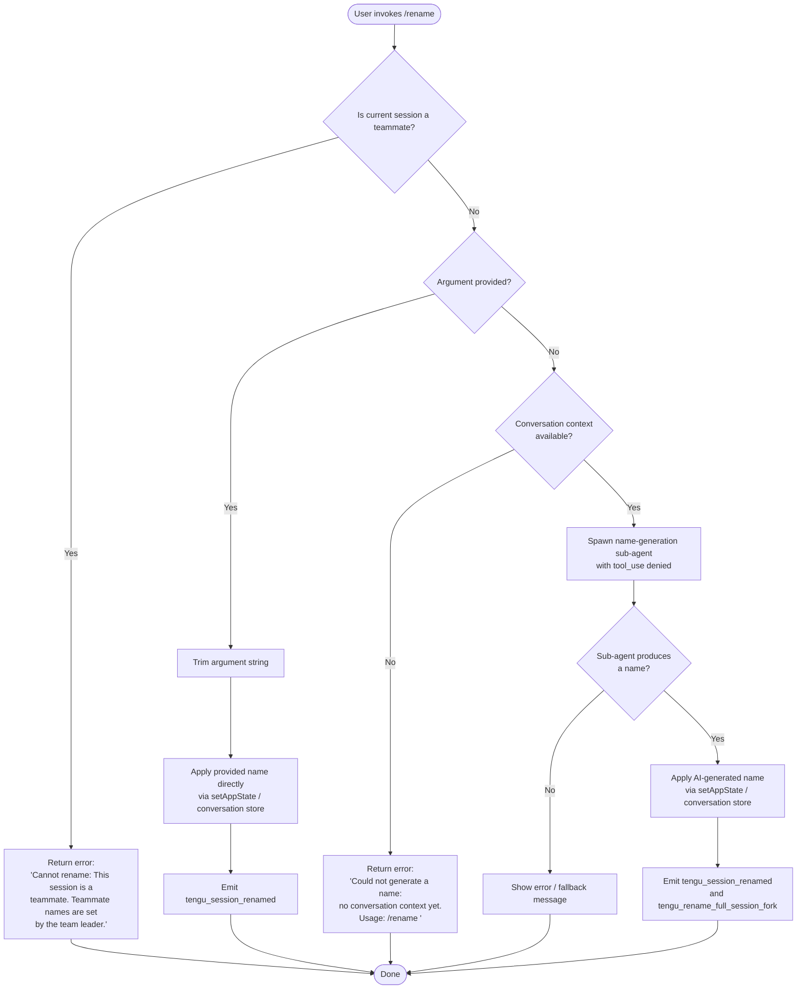

# `/rename`

> Analysis basis: CC v2.1.179 bundle.js (AST extraction + Claude interpretation)
> Minimum version: v2.1.179

---

## Overview

The `/rename` command (aliased as `/name`) renames the current conversation session. When called with an explicit name argument, it applies that name directly; when called without an argument, it uses an AI-driven sub-agent to auto-generate a name from the conversation history. The command updates application state and emits a `tengu_session_renamed` telemetry event upon success.

---

## Registration

| Field | Value |
|---|---|
| type | `local-jsx` |
| name | `rename` |
| description | `Rename the current conversation` |
| argumentHint | `[name]` |
| immediate | `true` |
| aliases | `["name"]` |
| module_id | `U$K` |
| load_inline | `true` |
| loc_byte | `12427387` |
| loc_byte_end | `12427586` |
| loc_line | `8290` |
| arbor_handler.name | `UsL` |
| arbor_handler.fqn | `claude-2.1.179::UsL` |
| arbor_handler.kind | `AsyncFunction` |
| arbor_handler.resolution_path | `module_id` |
| arbor_handler.n_hits | `0` |

Analysis basis: CC v2.1.179 bundle.js:+12427387

---

## Input Branching

The command has 4+ distinct branches based on argument presence, teammate status, conversation context availability, and whether tool-use is permitted during name generation. A Mermaid flowchart is required.



---

## Behavioral Spec

### Top-level handler (`UsL`)

`UsL` is an `AsyncFunction` resolved via the `module_id` path. It orchestrates the full rename flow.

Analysis basis: CC v2.1.179 bundle.js:+12427083

```
async function handleRenameCommand(args, context):
    rawArgument  = args            // passed through QQ8 input-normalizer
    appContext   = getAppContext()  // h5 → O2 → w2_.getStore (loc:2293130)

    // Teammate guard
    if isTeammateSession(appContext):
        return displayError(
            "Cannot rename: This session is a teammate. " +
            "Teammate names are set by the team leader."
        )

    // Delegate to core rename implementation (dQ8)
    return coreRename(rawArgument, appContext)
```

Analysis basis: CC v2.1.179 bundle.js:+12427083 (UsL → dQ8 edge at +12427083, teammate error literal at +12426551)

---

### Core rename implementation (`dQ8`)

```
async function coreRename(rawArgument, appContext):
    trimmedArg = rawArgument.trim()   // loc:12426650

    if trimmedArg is non-empty:
        // Manual rename path
        applyName(trimmedArg, appContext)   // _.setAppState (loc:12426890)
        updateFilesystemRecord(appContext)  // X2H (loc:12426932)
        updateProjectRecord(appContext)     // nJ → cj.basename (loc:12426936)
        return

    // Auto-generate path
    conversationMessages = getConversationContext(appContext)

    if conversationMessages is empty:
        return displayError(
            "Could not generate a name: no conversation context yet. " +
            "Usage: /rename <name>"
        )

    // Fork a restricted sub-agent (UL6)
    generatedName = await autoGenerateName(conversationMessages, appContext)

    if generatedName:
        applyName(generatedName, appContext)
        updateFilesystemRecord(appContext)
        updateProjectRecord(appContext)
```

Analysis basis: CC v2.1.179 bundle.js:+12426650, +12426684, +12426762, +12426890, +12426932

---

### Auto-name generation (`UL6`)

This function forks a constrained agent sub-query to derive a session name from conversation history.

```
async function autoGenerateName(conversationMessages, appContext):
    // Emit fork telemetry
    emit("tengu_rename_full_session_fork")    // loc:12425226

    // Record start timestamp
    startTime = Date.now()                     // dMA loc:10800612

    // Build restricted agent parameters (tool_use denied)
    agentConfig = buildAgentConfig(
        toolPolicy  = "deny",                  // literal "deny" loc:12424668
        taskLabel   = "rename_generate_name",  // literal loc:12424786
        origin      = "rename",                // literal loc:12424762
        messageType = "other"                  // literal loc:12424747
    )

    // Construct the name-generation prompt (psL)
    // The prompt includes conversation context messages
    // and instructs the model to produce a short session name.
    // Tool invocations are blocked: "Session name generation cannot use tools"
    //                               (literal loc:12424683)
    promptPackage = buildNamePrompt(conversationMessages, agentConfig)

    // Execute the constrained sub-query (lT)
    rawResult = await runSubQuery(promptPackage)

    // Extract text content from result (p$K → Eb → H.trim)
    candidateName = extractTextContent(rawResult)

    // Format messages for display (FQ8)
    // FQ8 filters by isMeta/origin/human fields (literals loc:12421635, 12421670, 12421710)
    // and joins array elements with appropriate separators

    // Apply result via sR (conversation store writer)
    if candidateName:
        saveConversationName(candidateName, appContext)  // sR → vU8 → AzH.writeFile
        return candidateName

    return null
```

Analysis basis: CC v2.1.179 bundle.js:+12425223, +12425264, +12425283, +12425335, +12424668, +12424683, +12424786

---

### Name application and filesystem persistence

When a name (manual or generated) is confirmed, the command:

1. Calls `_.setAppState` to update the in-memory conversation title (Analysis basis: CC v2.1.179 bundle.js:+12426890).
2. Calls the filesystem record updater `X2H` which uses the path join/stat utilities (`P4`, `GE`, `zq`) to locate and update the conversation's backing storage file (Analysis basis: CC v2.1.179 bundle.js:+12426932).
3. Calls `nJ` which uses `cj.basename` + `I6` to update the project-level name record (Analysis basis: CC v2.1.179 bundle.js:+12426936).
4. Emits the `tengu_session_renamed` telemetry event (Analysis basis: CC v2.1.179 bundle.js:+13646512).

The conversation store writer `vU8` uses `AzH.writeFile` and `AzH.mkdir` with JSON serialisation (`bH` → `JSON.stringify`) to persist the updated name to disk (Analysis basis: CC v2.1.179 bundle.js:+10862632, +10862679).

---

### HTML-entity sanitisation in name output (`yB8`)

String values passed through the display pipeline are HTML-entity-escaped via `H.replaceAll` using the following substitution table:

| Input sequence | Replaced with |
|---|---|
| `&` | `&amp;` (bundle.js:+11137790) |
| `<` | `&lt;` (bundle.js:+11137814) |
| `>` | `&gt;` (bundle.js:+11137837) |
| CR (U+000D) | `&#13;` (bundle.js:+11137861) |
| LF (U+000A) | `&#10;` (bundle.js:+11137885) |

Analysis basis: CC v2.1.179 bundle.js:+11137773

---

### Teammate guard detail

The teammate check is performed inside `dQ8` before any rename logic runs. The exact error string is:

> `"Cannot rename: This session is a teammate. Teammate names are set by the team leader."` (bundle.js:+12426551)

This check consults the app-context store via `h5` → `O2` → `w2_.getStore` with index `0` (Analysis basis: CC v2.1.179 bundle.js:+2294418, +2294430).

---

### JSON schema output from sub-agent

The auto-generation sub-query requests output in `json_schema` format (literal `"json_schema"` at bundle.js:+12425598). The schema constrains the model to return a structured object with a `"name"` key (literal `"name"` at bundle.js:+12424331), which is then extracted as a plain string (literal `"text"` at bundle.js:+12425009).

---

## State & Side Effects

| Item | Detail |
|---|---|
| Telemetry | `tengu_rename_full_session_fork` (loc:+12425226) — emitted when auto-generation path is taken |
| Telemetry | `tengu_session_renamed` (loc:+13646512) — emitted after any successful rename (manual or auto) |
| Telemetry | `tengu_agent_name_set` (loc:+13650049) — emitted when an agent-level name is recorded |
| appState changes | `_.setAppState` updates the in-memory conversation title (loc:+12426890) |
| Filesystem | `X2H` / `vU8` update the conversation's JSON backing file via `AzH.writeFile` (loc:+10862679) |
| Filesystem | `nJ` updates the project-level name record via `cj.basename` (loc:+12426936) |
| Sub-agent spawn | `lT` / `psL` fork a constrained sub-query with `tool_use = "deny"` (loc:+12424668) |
| Hook registration | No dedicated hook registration observed in depth-2 traversal |
| Sound | No sound side-effect observed in depth-2 traversal |

---

## Version History

| Version | Change |
|---|---|
| v2.1.179 | Initial analysis |

---

## Common Mistakes

1. **Providing a name with only whitespace** — the argument is trimmed (`H.trim` at +12426650) before the non-empty check; a whitespace-only argument is treated as absent and triggers the auto-generation path.
2. **Running `/rename` (no arg) before any messages exist** — the command returns the error `"Could not generate a name: no conversation context yet. Usage: /rename <name>"` (bundle.js:+12426762) rather than generating a name.
3. **Using `/rename` in a teammate session** — the command unconditionally rejects the request with the teammate error message (bundle.js:+12426551); the name cannot be changed from within the teammate session itself.
4. **Expecting tool usage during auto-generation** — the sub-agent is spawned with `"deny"` tool policy (bundle.js:+12424668); any attempt to call tools during name generation is blocked with the message `"Session name generation cannot use tools"` (bundle.js:+12424683).
5. **Assuming `/name` and `/rename` behave differently** — both aliases resolve to the same handler (`UsL`); the `aliases: ["name"]` field (registration) confirms they are fully equivalent.

---

## Appendix — Identifier Mapping

> For bundle debugging only. Identifiers change across versions.

| Identifier | Role |
|---|---|
| `UsL` | Main async handler for `/rename` (arbor_handler) |
| `QQ8` | Input argument normalizer called from `UsL` |
| `yB8` | HTML-entity sanitiser (replaceAll pipeline) |
| `dQ8` | Core rename implementation (argument dispatch, teammate guard, state update) |
| `h5` | App-context accessor (calls `O2`) |
| `O2` | App-context store reader (calls `w2_.getStore`) |
| `UL6` | Auto-name generation orchestrator (forks sub-agent, emits fork telemetry) |
| `Y6` | Conversation session store / fork utility |
| `IG6` | Session store helper (called from `Y6`) |
| `SG6` | Session store helper (called from `Y6`) |
| `fp` | Session utility (calls `im`) |
| `im` | Core session primitive (calls `xb`) |
| `mO8` | Session deduplication / queue helper |
| `PG_` | Session persistence helper (randomUUID, emit) |
| `xy_` | Session transform helper |
| `h6` | Conversation file I/O helper (Date.now, brf) |
| `c6` | Config/path utility |
| `iy_` | File watcher utility |
| `r5H` | Config file reader/writer (readFileSync, statSync, mkdirSync) |
| `brf` | File watch registration helper |
| `dMA` | Timestamp recorder for sub-agent fork |
| `G$6` | Sub-agent config builder helper |
| `psL` | Name-generation sub-query builder (addEventListener, abort, flatMap) |
| `NqH` | Sub-query helper |
| `A` | AbortController / signal holder |
| `L` | Connection/stream closer |
| `lT` | Sub-query executor (Date.now, setAppState, map, push) |
| `jC8` | App-state mutation helper (getAppState / setAppState) |
| `JC8` | Sub-query result handler |
| `WR` | Random-hex string generator (lj8.randomBytes) |
| `lKH` | Sub-query logging helper (Pf, qBH) |
| `N` | Log/notification helper (cNH, bH, trim, kk) |
| `sU` | Sub-agent exit handler (FRL, Dp8, IH, CH) |
| `bZ` | Sub-query state flag |
| `Rm6` | Message-type filter (ACL.has) |
| `u6H` | Sub-query utility |
| `OU8` | Sub-query utility |
| `iaq` | Message filter (calls `Rm6`) |
| `D` | Background process / daemon session manager |
| `KOH` | Message history filter (wX, H$L, f.has) |
| `d` | Generic async utility / deferred |
| `qCL` | Sub-query result collector (QH, a_) |
| `U8` | Request UUID generator (CI.randomUUID) |
| `P` | Buffer/stream concatenator |
| `X` | Stream timeout wrapper |
| `q` | Process / stream utility |
| `p1` | CLI error handler (IFH, bX, process.exit) |
| `p$K` | Text-content extractor (Dq, Eb) |
| `Eb` | String trimmer (H.trim) |
| `GH` | String-to-display converter (calls `String`) |
| `FQ8` | Message formatter / array joiner (isMeta/origin/human filter) |
| `_` | Generic array / utility |
| `sR` | Conversation store writer (B4, vU8, XFH) |
| `B4` | Storage base utility |
| `vU8` | Conversation file writer (AzH.writeFile, AzH.mkdir, JSON serialisation) |
| `VU8` | Conversation schema validator |
| `DG` | Full agent query engine (large fan-out) |
| `iCL` | Content block mapper |
| `x6` | Content helper (Ee6, G_) |
| `bH` | JSON serialiser (JSON.stringify) |
| `l6` | JSON parser (JSON.parse) |
| `Ssq` | Conversation storage helper (oCL) |
| `G8` | Error / result wrapper |
| `f` | Active-request tracker (q.add, q.delete) |
| `XFH` | Fallback-request handler (z3A, nyK, Error) |
| `z3A` | Fallback conversation loader (VU8, vU8) |
| `nyK` | Full main-loop query handler (very large fan-out) |
| `zT` | Generic async transition helper (OT) |
| `OT` | Promise/async primitive |
| `M2` | Backend resolver (u_, j7, q2_, Q1, CLH) |
| `u_` | Provider helper (f6) |
| `j7` | Provider helper (Iq8) |
| `q2_` | Key/auth classifier (H.startsWith "sk-ant-") |
| `Q1` | Auth-state resolver (Zn, D1, NO) |
| `CLH` | Config load helper (eP_) |
| `vy` | Store persistence helper |
| `m4` | Message filter (H.filter) |
| `tOH` | Turn orchestration handler (I6, Fh, FM, YB, C6H, M, rUH, D7, kW, Vn) |
| `I6` | React/JSX element factory |
| `Fh` | Fragment helper |
| `FM` | Formatted-message renderer (sC, e$, G_, RWH.join, I6) |
| `sC` | Style component helper |
| `G_` | Generic render helper |
| `YB` | Conversation session renderer (ch, OwH, I6, Pf, hg6.emit, QH) |
| `ch` | Conversation header component |
| `OwH` | Conversation log appender (md, c6, bH, appendFileSync, mkdirSync) |
| `md` | Conversation metadata formatter (f6, XhK, Hm, jyH) |
| `Pf` | Log-path resolver (U9) |
| `QH` | Async result normaliser (n36) |
| `n36` | Base async primitive |
| `C6H` | Conversation component variant (OwH, ch, I6, Pf, hg6.emit) |
| `$J` | JSX child helper |
| `v6H` | View state helper |
| `M` | MCP manager (KxH, Us8, f.get, f.values, fhA) |
| `KxH` | MCP connection orchestrator (large fan-out) |
| `IQ` | MCP tool registration helper |
| `IE` | MCP server identity helper (Jw, uc_) |
| `K` | MCP tool list container |
| `s8` | String formatter helper |
| `ih6` | MCP idle heartbeat helper |
| `YHq` | MCP health-check helper (Sn_, j0H, JL8, Date.now) |
| `XL8` | MCP status helper (JL8, rX) |
| `DL8` | MCP delay helper (q4) |
| `$8` | MCP debug logger (hlH.push, ks.logMCPDebug) |
| `F08` | MCP OAuth flow initiator |
| `g08` | MCP OAuth callback handler |
| `ZHq` | MCP connection completion helper |
| `ac_` | MCP auth-cache helper (rX, q4, $8, GH) |
| `j` | Subprocess kill list |
| `Yh` | MCP skill emitter (Y6) |
| `xc_` | MCP include-list checker |
| `y` | Focus/blur state tracker (wi, Date.now, Math.min) |
| `w7` | MCP error logger (hlH.push, ks.logMCPError) |
| `PHq` | MCP queue helper (qQ) |
| `T_6` | MCP parseInt helper |
| `FG8` | MCP parseInt helper (variant) |
| `Us8` | MCP connection-result applicator (applyMcpUpdate, cleanup) |
| `qxH` | MCP update helper (j0H) |
| `GG` | MCP cleanup coordinator (W_6, K.cleanup, Yh) |
| `$` | MCP tool-call tracker (yTK) |
| `yTK` | Tool-call timestamp tracker (Ht, Date.now, H9, VF6, bH) |
| `fhA` | MCP filter + re-connect helper (Object.entries, KxH, Us8) |
| `N08` | MCP server filter (SS7.has, Qc_.has) |
| `n8` | Retry/timeout helper (K, Error, setTimeout, clearTimeout) |
| `W_6` | MCP slot helper (j0H) |
| `f4H` | Turn state helper |
| `rUH` | Agent-name setter (ch, OwH, I6, Pf, r0A.emit) |
| `Vn` | Conversation metadata persister ($P6, Date.now) |
| `$P6` | Metadata file read/write helper (pS.readFile, pS.writeFile) |
| `D7` | Daemon helper (VNH) |
| `VNH` | Daemon IPC primitive |
| `AF8` | State-key lister (Object.keys) |
| `X2H` | Filesystem conversation record updater (P4, zq, lJ, yL, x8, N3) |
| `P4` | Path builder (cj.join, GE) |
| `GE` | Path builder variant (cj.join, z_) |
| `zq` | Conversation file stat/read/write orchestrator |
| `w` | File-watcher / supervisor helper |
| `bVH` | File stat helper (_VK.stat, L.isFile, OWA, GH) |
| `AVK` | Column-width calculator (Object.keys, Math.max, PD) |
| `T` | Spinner/progress indicator (ih6, J36) |
| `Z` | Rate-limiter / token bucket (W, Math.max, Math.min) |
| `Z94` | Heartbeat helper (T1H) |
| `v` | Scroll/cursor manager (Math.max, Math.floor, S.preventDefault) |
| `z` | Daemon stop helper (IH, CH, QS, QB) |
| `IH` | Daemon-stop OK path (d, QH) |
| `CH` | Daemon-stop error path (d, QH) |
| `QS` | Session-queue helper (im, xn.push, lyH, XG_) |
| `QB` | Daemon shutdown sequencer (Promise.race, Promise.all, n8, process.exit) |
| `x8` | Error code helper (G8) |
| `VL` | Generic result wrapper (G8) |
| `lJ` | Cache-entry deleter (Ee.delete) |
| `yL` | Cache-entry writer (vO, cj.join, bH, lJ) |
| `vO` | Atomic file writer (cJ_.randomBytes, Jn.writeFile, Jn.rename, Jn.chmod) |
| `N3` | Cache-miss handler (G8, BNH.has, N, GH, SH) |
| `SH` | Error logger + structured error emitter (WA, f6, fq, Nd4, hlH.push, ks.logError) |
| `WA` | Error constructor wrapper (Error, String) |
| `f6` | String coercer (String) |
| `fq` | Error formatter (YrA) |
| `Nd4` | Log-ring buffer manager (Xe6.shift, Xe6.push) |
| `nJ` | Project-name record updater (cj.basename, I6) |