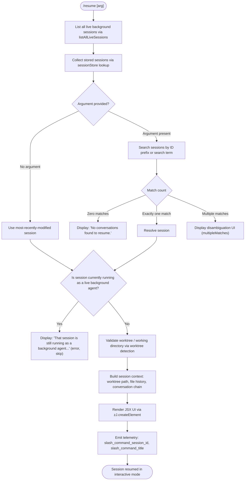

# `/resume`

> Analysis basis: CC v2.1.179 bundle.js (AST extraction + Claude interpretation)
> Minimum version: v2.1.179

---

## Overview

`/resume` (alias: `/continue`) allows the user to reopen a previously saved Claude Code conversation by providing a conversation ID or search term as an argument. The command resolves the target session from the local project transcript store, validates that it is not already running as a background agent, and then restores the full conversational context so the user can continue from where they left off.

---

## Registration

| Field | Value |
|---|---|
| type | `local-jsx` |
| name | `resume` |
| description | `Resume a previous conversation` |
| aliases | `["continue"]` |
| argumentHint | `[conversation id or search term]` |
| module_id | `zYK` |
| load_inline | `true` |
| loc_byte | `12606749` |
| loc_byte_end | `12606946` |
| loc_line | `8470` |
| arbor_handler.name | `r65` |
| arbor_handler.fqn | `claude-2.1.179::r65` |
| arbor_handler.kind | `AsyncFunction` |
| arbor_handler.resolution_path | `module_id` |
| arbor_handler.n_hits | `0` |

Analysis basis: CC v2.1.179 bundle.js:+12606749

---

## Input Branching

The command has more than three distinct resolution paths, so a Mermaid flowchart is used.



Analysis basis: CC v2.1.179 bundle.js:+12605339, +12605349, +12605784, +12605570, +12606046, +12606091

---

## Behavioral Spec

### 1. Session Listing and Live-Session Guard

```
async function resumeHandler(context, args):
    liveSessions = await listAllLiveSessions()          // i$H → A.listAllLiveSessions
    filter to sessions with status "interactive"        // literal "interactive" at +8537277

    storedSessions = await sessionStore.getAll()        // o$H, yKH, Xq6 chain

    if args is empty or blank:
        targetSession = mostRecentSession(storedSessions)
    else:
        matches = filterByIdOrSearchTerm(storedSessions, args)

        if matches.length == 0:
            return displayError("No conversations found to resume.")  // +12605784
        if matches.length > 1:
            return displayDisambiguation(matches)        // "multipleMatches" path +12603063

        targetSession = matches[0]

    if targetSession.id is in liveSessions:
        return displayError(
            "That session is still running as a background agent. " +
            "Open `claude agents` to attach to it, or stop it there first to resume here."
        )                                               // +12605349
```

Analysis basis: CC v2.1.179 bundle.js:+12605235, +12605265, +12605339, +12605349, +12605784

### 2. Worktree and Working-Directory Detection

```
function detectWorktree(sessionPath):
    run: git worktree list --porcelain    // literals "worktree","list","--porcelain" at +8526601..+8526619
    emit telemetry: tengu_worktree_detection  // +8526701
    parse output, normalize paths via NFC normalization (+65227)
    split on "worktree " prefix (+8526820), strip 9-char prefix (+8526854)
    find matching worktree entry for session's stored path
    sort candidates with localeCompare for determinism
    return resolvedWorktreePath
```

Analysis basis: CC v2.1.179 bundle.js:+8526557, +8526592, +8526701, +8526807, +8526820

### 3. Conversation Chain Reconstruction

The session store reader (`o$H` / `yKH` / `Xq6`) reconstructs the full conversation chain from the on-disk transcript files. Key metadata fields read from the store:

| Metadata key | Literal value (bundle) | Purpose |
|---|---|---|
| Summary | `"summary"` (+13659461) | Compact summary text |
| Last prompt | `"last-prompt"` (+13659528) | Most recent user prompt |
| Custom title | `"custom-title"` (+13659624) | User-assigned title |
| AI title | `"ai-title"` (+13659702) | Model-generated title |
| Tag | `"tag"` (+13659772) | Conversation tag |
| Agent name | `"agent-name"` (+13659833) | Associated agent name |
| Mode | `"mode"` (+13660063) | Conversation mode |
| Permission mode | `"permission-mode"` (+13660126) | Tool permission level |

```
function reconstructChain(sessionId):
    raw = readTranscriptFile(sessionId)          // yKH → aK.readFile +13661659
    entries = parseTranscriptEntries(raw)        // S$5, I$5, JkH, R$5
    chain = buildParentChain(entries)            // r$H, G$5, X$5, hhK
    detect and report phantom parents            // telemetry: tengu_transcript_phantom_parent +13658233
    detect and report parent cycles              // telemetry: tengu_transcript_parent_cycle +13662137
    resolve compact boundaries                  // literal "compact_boundary" +11162548
    return orderedChain
```

Analysis basis: CC v2.1.179 bundle.js:+13651707, +13659356, +13661659, +13661731

### 4. File-Based Session Enumeration (`bd8` / `yg6` / `RhK`)

When no session store cache is available, the command falls back to a filesystem scan:

```
function enumerateSessions(projectDir):
    dirs = await fs.readdir(projectsBaseDir)     // "projects" literal +5201412
    for each dir:
        resolveRealpath(dir)                     // aK.realpath +13668031
        readFiles in dir (m0A)
        filter files with matching prefix
        parse conversation metadata
        collect into result list
    sort by timestamp descending
    return sessions
```

Analysis basis: CC v2.1.179 bundle.js:+13666262, +13666301, +13666321, +13667189, +13668181

### 5. Background-Agent Conflict Handling

If the target session is currently live as a background agent (daemon status `"interactive"`), the command refuses to resume and emits a user-facing message directing the user to `claude agents`. The literal message is identified at +12605349. The call path is:

```
function checkLiveConflict(targetId, liveSessions):
    for each liveSession in liveSessions:
        if liveSession.id == targetId:
            display conflict message    // +12605349
            return result with role="user", type="skip"  // literals +12605490, +12605552
    return null  // no conflict
```

Analysis basis: CC v2.1.179 bundle.js:+12605339, +12605347, +12605490, +12605552, +12605570

### 6. JSX Rendering and Telemetry Emission

After the session is resolved and the chain reconstructed, the handler renders the resume UI:

```
function renderResumeUI(session, chain, worktree):
    timestamp = Date.now()                      // +12605661
    element = zJ.createElement(...)            // +12605635
    emitMetric("slash_command_session_id", session.id)   // +12606046
    emitMetric("slash_command_title", session.title)     // +12606271
    apply bold styling via MYK → J6.bold       // +12606321, +12603027
    return element
```

Analysis basis: CC v2.1.179 bundle.js:+12605599, +12605635, +12605661, +12606046, +12606271, +12606321

### 7. Session-Not-Found and Disambiguation Paths

```
function handleSearchResult(matches, arg):
    if matches.length == 0:
        // literal "sessionNotFound" path
        display: "No conversations found to resume."   // +12602992, +12605784
    elif matches.length > 1:
        // literal "multipleMatches" path
        display list of matches for user selection     // +12603063
        apply bold formatting to session titles        // J6.bold +12603027
```

Analysis basis: CC v2.1.179 bundle.js:+12602992, +12603063, +12605784, +12605885, +12605903

---

## State & Side Effects

| Item | Detail |
|---|---|
| Telemetry — daemon control | `tengu_daemon_control` (+17105376) |
| Telemetry — worktree detection | `tengu_worktree_detection` (+8526701) |
| Telemetry — background attach | `tengu_bg_attach` (+17058532) |
| Telemetry — attach stall gave up | `tengu_bg_attach_stall_gave_up` (+17059455) |
| Telemetry — attach stall respawn | `tengu_bg_attach_stall_respawn` (+17059725) |
| Telemetry — attach kick | `tengu_bg_attach_kick` (+17060717) |
| Telemetry — attach upgrade | `tengu_bg_attach_upgrade` (+13454760) |
| Telemetry — legacy attach auto-respawn | `tengu_bg_attach_legacy_autorespawn` (+17057374) |
| Telemetry — protocol mismatch | `tengu_bg_proto_mismatch` (+17053087) |
| Telemetry — dispatch stale drop | `tengu_bg_dispatch_stale_drop` (+17054486) |
| Telemetry — dispatch SIGKILL escalate | `tengu_bg_dispatch_sigkill_escalate` (+17067302) |
| Telemetry — spare enable | `tengu_bg_spare_enable` (+17068607) |
| Telemetry — spare claim | `tengu_bg_spare_claim` (+17068735) |
| Telemetry — spare claim fail | `tengu_bg_spare_claim_fail` (+17069001) |
| Telemetry — low memory | `tengu_bg_low_mem_mb` (+13454570) |
| Telemetry — dispatch low mem | `tengu_bg_dispatch_low_mem` (+17067903) |
| Telemetry — retire pinned low mem | `tengu_bg_retire_pinned_low_mem` (+17072013) |
| Telemetry — retire grace bridged min | `tengu_bg_retire_grace_bridged_min` (+13454688) |
| Telemetry — prewarm per sweep | `tengu_bg_prewarm_per_sweep` (+17072134) |
| Telemetry — daemon config reload | `tengu_daemon_config_reload` (+17083201) |
| Telemetry — daemon idle exit | `tengu_daemon_idle_exit` (+17088636) |
| Telemetry — daemon yield | `tengu_daemon_yield` (+17087606) |
| Telemetry — sendclaim failed | `tengu_bg_sendclaim_failed` (+17043852) |
| Telemetry — scheduled task fire | `tengu_scheduled_task_fire` (+16545291) |
| Telemetry — scheduled task missed | `tengu_scheduled_task_missed` (+16544540) |
| Telemetry — scheduled task expired | `tengu_scheduled_task_expired` (+16545634) |
| Telemetry — feature ok/bad | `tengu_feature_ok` (+1020479), `tengu_feature_bad` (+1020546) |
| Telemetry — transcript phantom parent | `tengu_transcript_phantom_parent` (+13658233) |
| Telemetry — transcript parent cycle | `tengu_transcript_parent_cycle` (+13662137) |
| Telemetry — chain parent cycle | `tengu_chain_parent_cycle` (+13639068) |
| Telemetry — chain timestamp fallback | `tengu_chain_timestamp_fallback` (+13639217) |
| Telemetry — chain parallel tr recovered | `tengu_chain_parallel_tr_recovered` (+13641083) |
| Telemetry — relink walk broken | `tengu_relink_walk_broken` (+13638574) |
| appState changes | Restores session transcript chain; updates active session reference; sets worktree path; registers session-store Maps for `summary`, `last-prompt`, `custom-title`, `ai-title`, `tag`, `agent-name`, `mode`, `permission-mode` |
| Hook registration | Background daemon attach hooks registered via `KsA` (event `"exit"` +1125373); file-history snapshot hooks; content-replacement hooks |
| Filesystem access | Reads project transcript files under `projects/` base directory; calls `git worktree list --porcelain`; reads `daemon.status.json` (+13177190) |
| Sound | <!-- TODO: not found in depth-2 traversal; needs --depth 4 --> |

---

## Version History

| Version | Change |
|---|---|
| v2.1.179 | Initial analysis |

---

## Common Mistakes

1. **Omitting the argument when multiple sessions exist** — Without an ID or search term, the command picks the most-recently-modified session. If that is not the intended one, users should pass at least a partial session ID or a keyword from the conversation title.

2. **Trying to resume a live background agent** — If the session is currently active as a background agent, `/resume` will refuse and display a conflict message. Use `claude agents` to attach to or stop the running session first.

3. **Ambiguous search terms producing multiple matches** — A vague search term may match several sessions, triggering the disambiguation UI. Use a more specific substring of the conversation ID or title.

4. **Expecting `/resume` and `/continue` to behave differently** — Both names are registered to the same handler (`r65`); they are exact aliases with identical behavior.

5. **Resuming in a mismatched working directory** — The command performs worktree detection via `git worktree list --porcelain`. Running from a directory outside the original worktree may result in unexpected path resolution or a failed worktree lookup.

---

## Appendix — Identifier Mapping

> For bundle debugging only. Identifiers change across versions.

| Identifier | Role |
|---|---|
| `r65` | Main async handler for `/resume` (arbor_handler) |
| `OYK` | Session list filter / entry-point helper called before `r65` |
| `K$` | Session selector / resolution helper |
| `i$H` | Live-session lister (calls `A.listAllLiveSessions`) |
| `l$H` | Worktree detection and path normalization |
| `o_` | Application launch / session start orchestrator |
| `MkH` | Child process / worker spawner |
| `o$H` | Session store reader (top-level) |
| `yKH` | Session store state hydrator (sets all store Maps) |
| `Xq6` | Session store accessor (get operations on all Maps) |
| `ShK` | Session store initializer / Object.assign wrapper |
| `C$5` | Conversation directory stat helper |
| `r$H` | Conversation chain builder |
| `G$5` | Chain metadata aggregator |
| `X$5` | Chain entry deduplicator / sorter |
| `hhK` | Chain walk helper (values + get/set) |
| `kn8` | Timestamp parser (Date.parse wrapper) |
| `yn8` | Session-entry getter/setter helper |
| `In8` | Session entry array enumerator (Array.from + values) |
| `Jq6` | Session map transform (H.map wrapper) |
| `c0A` | Conversation text cleaner (replaceAll + slice) |
| `n0A` | Conversation content type tester |
| `T$5` | Array/string type checker (trim + some) |
| `Z$5` | Array type checker (isArray + some) |
| `x0A` | Composite session metadata accessor |
| `FB6` | Conversation entry formatter |
| `xK` | Regex-based content parser for conversation entries |
| `S$5` | Binary transcript file parser (Buffer-level) |
| `I$5` | Transcript index parser |
| `R$5` | Transcript header reader |
| `JkH` | JSONL / transcript line parser dispatcher |
| `cn4` | JSONL chunk detector |
| `ln4` | JSONL line splitter |
| `in4` | JSON record extractor |
| `nn4` | JSONL record parser (indexOf + toString + parse) |
| `IhK` | Buffer array accessor (A.at wrapper) |
| `y$5` | Buffer compare helper |
| `lo` | Session listing and display orchestrator |
| `bd8` | Session directory scanner (calls `yg6`) |
| `yg6` | Per-project session enumerator |
| `RhK` | Filesystem conversation file walker |
| `m0A` | Recursive directory reader for session files |
| `QVH` | Session file content processor |
| `Gg6` | Session metadata map get/set/values helper |
| `xFH` | Session binary file reader (Buffer.alloc + push) |
| `F$5` | Individual session file parser |
| `wr` | Projects base-path resolver (`projects` dir join) |
| `SH` | Error formatter / error log helper |
| `WA` | Error constructor wrapper |
| `f6` | String coercer |
| `fq` | Telemetry config resolver |
| `YrA` | Telemetry config value helper |
| `Nd4` | Telemetry ring-buffer manager (shift + push) |
| `GH` | String-to-string converter |
| `G_` | Path / config base resolver |
| `OT` | OS/platform config accessor |
| `sC` | Config path helper (OT wrapper) |
| `Q0` | Directory listing helper (readdir + filter) |
| `Fw` | Path transformer (replace + slice + wc4) |
| `$z` | Path normalizer (H.normalize, NFC) |
| `QN` | Session ID validator (regex test via `lL7`) |
| `BHH` | Session background-agent state checker |
| `xzH` | Session context builder helper |
| `MYK` | Title bold-formatter (J6.bold) |
| `dU` | Session store delta applier |
| `wX` | Store write-through helper |
| `q$5` | Store queue helper |
| `KhK` | Store walk / re-index helper |
| `J$5` | Store chain-walk helper (get + has + add + push + reverse) |
| `w1` | Store utility (n36 wrapper) |
| `nzH` | Store filter helper (Array.isArray + H.filter) |
| `UI6` | Permission interval calculator |
| `OP8` | Permission interval upper bound |
| `dtK` | Boolean coercer for loop sentinel |
| `L_H` | Set membership tester (_.has wrapper) |
| `g9H` | Permission set manager |
| `s8` | Identity / pass-through wrapper |
| `MkA` | Background job lifecycle manager |
| `D` | Daemon session manager |
| `_kA` | Daemon socket connector |
| `Y6` | Session retirement / cleanup scheduler |
| `oRH` | Stale file cleaner (lstat + rm + readFile) |
| `il8` | Memory pressure checker |
| `Ag6` | Memory + file sweep helper |
| `IvK` | Retire-on-low-mem helper (Y6 wrapper) |
| `rl8` | Retire-if-settled helper (Y6 wrapper) |
| `MkH` | Process spawner (child process manager) |
| `TsA` | Process startup sequencer |
| `q5_` | Process stdio collector |
| `K5_` | Process stderr collector |
| `L5_` | Process stream finalizer |
| `yaA` | Numeric timeout validator |
| `vD6` | Process runner with bufferedData |
| `A5_` | Reflect.apply dispatcher |
| `KsA` | Exit-event hook registrar |
| `kaA` | Promise.race timeout wrapper |
| `IaA` | SIGTERM / kill finalizer |
| `NaA` | Stdout data handler |
| `haA` | H.kill caller |
| `AsA` | Parallel-stream promise aggregator |
| `yD6` | mL_ stream helper |
| `HsA` | Pipe setup helper |
| `_sA` | Set-add stream helper |
| `baA` | stdout bind helper (nL_) |
| `p` | Rate-limit / usage-event enqueuer |
| `FF` | Usage event formatter |
| `I6` | OT-based event helper |
| `f1` | G8 file-log helper |
| `tDK` | Rate-limit timer helper |
| `qH` | Voice/input parser (trim + parse) |
| `UYH` | JSON.parse wrapper |
| `e` | MCP update applier / connection orchestrator |
| `fhA` | MCP connection state reconciler |
| `KxH` | MCP slot connector |
| `Us8` | MCP connection result applier |
| `M` | MCP manager (top-level) |
| `P` | PTY / socket session handler |
| `qx5` | PTY protocol message dispatcher |
| `cL` | Socket end/cleanup helper |
| `Lx5` | PTY write helper |
| `Ax5` | PTY repaint helper |
| `_x5` | PTY DEC mode helper |
| `n8` | Async abort/timeout helper |
| `CH` | Feature flag checker (QH wrapper) |
| `IH` | Feature flag ok checker (QH wrapper) |
| `QH` | Feature flag store accessor (n36) |
| `c` | Scheduled task runner |
| `IV6` | Task interval lower-bound calculator |
| `OP8` | Task interval upper-bound calculator |
| `Q` | Output write queue |
| `R` | Render write helper |
| `S` | Supervisor render helper |
| `y` | Focus/blur clock manager |
| `I` | Idle sweep manager |
| `b` | Background worker registry entry |
| `g` | Worker retire-if-settled manager |
| `j` | Worker set manager |
| `N` | Git process runner / shell executor |
| `nM4` | Git command builder |
| `bH` | JSON.stringify wrapper |
| `g4` | Git output parser |
| `ydH` | GbA-based git helper |
| `aM4` | Git worktree metadata extractor |

---

Note: index built via Arbor fallback; some signals (telemetry, literals) may be missing — see arbor-fallback.js.