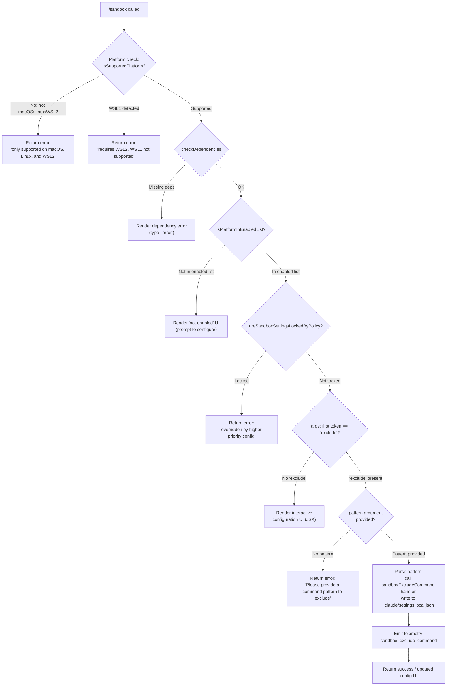

# `/sandbox`

> Analysis basis: CC v2.1.179 bundle.js (AST extraction + Claude interpretation)
> Minimum version: v2.1.179

---

## Overview

`/sandbox` is the interactive sandboxing configuration command for Claude Code. It allows users to inspect and modify the sandbox policy for shell command execution, and to add exclusion patterns for specific commands that should run outside the sandbox. The command enforces platform compatibility checks before performing any configuration changes, and respects enterprise policy locks.

---

## Registration

| Field | Value |
|---|---|
| type | `local-jsx` |
| name | `sandbox` |
| description | ` ...   ...  (⏎ to configure)` |
| argumentHint | `exclude "command pattern"` |
| immediate | `true` |
| isHidden | `null` (not hidden) |
| module_id | `uWK` |
| load_inline | `true` |
| loc_byte | `13043313` |
| loc_byte_end | `13043962` |
| loc_line | `9028` |
| arbor_handler.name | `Wq5` |
| arbor_handler.fqn | `claude-2.1.179::Wq5` |
| arbor_handler.kind | `AsyncFunction` |
| arbor_handler.resolution_path | `module_id` |
| arbor_handler.n_hits | `2` |

Analysis basis: CC v2.1.179 bundle.js:+13043313

---

## Input Branching

The handler has 5+ distinct branches based on platform checks, policy locks, and subcommand routing. A Mermaid flowchart is used.



Analysis basis: CC v2.1.179 bundle.js:+13041932 – +13042946

---

## Behavioral Spec

### Platform Eligibility Check

The handler (`Wq5`) begins by resolving the current platform context via `isSupportedPlatform` (from `nA`) and `checkDependencies` (`nA`).

```
async function sandboxCommandHandler(args, context):
    themeMode = resolveThemeMode()           # calls tA (theme accessor)
    colorizer = resolveColorizer(themeMode)  # calls r6

    supported = nA.isSupportedPlatform()
    if not supported:
        if platform == "wsl" and wsl_version == 1:
            return renderError("Error: Sandboxing requires WSL2. WSL1 is not supported.")
        else:
            return renderError("Error: Sandboxing is currently only supported on macOS, Linux, and WSL2.")

    depResult = await nA.checkDependencies()
    if depResult has errors:
        return renderErrorUI(type="error", depResult)

    enabledOnPlatform = nA.isPlatformInEnabledList()
    if not enabledOnPlatform:
        return renderConfigurationPromptUI()
```

Analysis basis: CC v2.1.179 bundle.js:+13041963, +13042005, +13042063, +13042140, +13042180, +13042207

---

### Policy Lock Guard

After confirming platform support and dependency availability, the handler checks enterprise policy before allowing any mutation:

```
    policyLocked = nA.areSandboxSettingsLockedByPolicy()
    if policyLocked:
        return renderError("Error: Sandbox settings are overridden by a higher-priority configuration and cannot be changed locally.")
```

Analysis basis: CC v2.1.179 bundle.js:+13042369, +13042428

---

### Subcommand Routing: `exclude`

The user-supplied argument string is split and the first token is compared to the literal `"exclude"` (offset 13042678). The token at index 8 (numeric literal at offset 13042703) is then used to extract the exclusion pattern.

```
    tokens = args.split(...)         # M.split
    subcommand = tokens[0]

    if subcommand == "exclude":
        pattern = tokens.slice(8)    # M.slice — strips leading 'exclude "' prefix
        if pattern is empty:
            return renderError('Error: Please provide a command pattern to exclude (e.g., /sandbox exclude "npm run test:*")')

        # Normalize pattern via z.replace (escaping/quoting logic)
        normalizedPattern = normalizePattern(pattern)

        # Delegate to settings writer
        result = await applyExcludePattern(normalizedPattern, localSettingsPath)
        # Writes to .claude/settings.local.json
        emitTelemetry("sandbox_exclude_command")
        return renderSuccess(result)
    else:
        return renderInteractiveConfigUI(context)
```

Analysis basis: CC v2.1.179 bundle.js:+13042655, +13042678, +13042695, +13042703, +13042740, +13042859, +13042888, +13042946

---

### Settings Persistence

The exclusion pattern is persisted by delegating to `ap_` (settings applier) which calls into the settings layer chain:

```
function applyExcludePattern(pattern, path):
    localSettings = loadSettingsLayer("localSettings")   # ap_ → R8 → localSettings key
    rules = localSettings.addRules                       # "addRules" literal at 4796203
    filteredRules = rules.filter(existingEntries)        # ap_ → _.filter
    matchResult = patternMatchCheck(pattern)             # ap_ → Jw7 → H.match
    if pattern not already in rules:
        rules.push(pattern)
    writeSettings(path, localSettings)                   # path = .claude/settings.local.json
    telemetry("sandbox_exclude_command")                 # IH path
```

The settings target path is the literal `".claude/settings.local.json"` (bundle.js:+13042946).

Analysis basis: CC v2.1.179 bundle.js:+13042888, +13042901, +13042925, +13042946, +4796109, +4796180, +4796203, +4796354, +4796393, +4796407, +4796486, +4796489

---

### Pattern Normalization and Relative Path Handling

After the raw pattern is extracted, a path relativization step is performed using `bWK.relative` (bundle.js:+13042925), suggesting that file-path-style patterns are converted to relative form before storage.

```
function normalizePattern(rawPattern):
    relativized = bWK.relative(currentWorkingDir, rawPattern)
    return relativized
```

Analysis basis: CC v2.1.179 bundle.js:+13042925

---

### MCP Settings Manager Integration (depth-2 side effects)

The call to `M` (MCP settings manager) at bundle.js:+13042655 pulls in a substantial subsystem (`KxH`, `Us8`, `fhA`, `GG`) responsible for syncing sandbox configuration changes with connected MCP servers and their tool permissions. This happens as a side effect of configuration changes but is not directly user-visible in the `/sandbox` command output.

```
function syncConfigWithMCPLayer(updatedSettings):
    for each mcpServerEntry in Object.entries(mcpServers):
        applyConnectionResult(entry, updatedSettings)   # Us8
        if server.cleanup needed:
            GG(server)                                  # cleanup + Yh broadcast
    fhA(mcpClients, updatedSettings)                    # fhA = full MCP reconnect cycle
```

Analysis basis: CC v2.1.179 bundle.js:+16716552, +16716562, +16716689, +16717171, +16717784

---

## State & Side Effects

| Item | Detail |
|---|---|
| Telemetry | `tengu_mcp_oauth_flow_start` (bundle.js:+6575190); `tengu_mcp_oauth_flow_success` (+6580168); `tengu_mcp_oauth_flow_error` (+6581879); `tengu_daemon_config_reload` (+17083201); `tengu_mcp_skills` (+6682260); `tengu_config_auth_loss_prevented` (+3394809); `tengu_bg_retire_pinned_low_mem` (+17072013); `tengu_bg_prewarm_per_sweep` (+17072134); `tengu_feature_ok` (+1020479); `tengu_feature_bad` (+1020546); `tengu_daemon_control` (+17105376); `tengu_feature_sad` (+1020627) |
| Direct telemetry key | `"sandbox_exclude_command"` (bundle.js:+4796489) — fired when an exclude pattern is successfully registered |
| Settings write | Writes `addRules` entry to `.claude/settings.local.json` (bundle.js:+13042946) |
| Policy enforcement | Reads `areSandboxSettingsLockedByPolicy` before any mutation; aborts with error if locked (bundle.js:+13042369) |
| MCP layer sync | Triggers MCP server reconnect/cleanup cycle via `fhA`/`KxH` when settings change (bundle.js:+16717784) |
| appState changes | Configuration update propagated via `Us8.applyMcpUpdate` (bundle.js:+16716840) |
| Sound | <!-- TODO: not found in depth-2 traversal; needs --depth 4 --> |
| Hook registration | <!-- TODO: not found in depth-2 traversal; needs --depth 4 --> |

---

## Version History

| Version | Change |
|---|---|
| v2.1.179 | Initial analysis |

---

## Common Mistakes

1. **Omitting quotes around patterns with wildcards.** The argument hint is `exclude "command pattern"` — the pattern must be passed as a quoted string (e.g., `/sandbox exclude "npm run test:*"`). Without quotes, shell globbing may consume the wildcard before Claude Code sees it.
2. **Running on an unsupported platform.** The command hard-errors on Windows (non-WSL), WSL1, or any non-Linux/macOS system. Check your environment before expecting interactive configuration to appear.
3. **Attempting to change settings under enterprise policy lock.** When `areSandboxSettingsLockedByPolicy` returns true, the command returns an error immediately. Local overrides are not possible — changes must be made at the enterprise configuration level.
4. **Expecting the pattern to apply globally.** Exclusion rules are written exclusively to `.claude/settings.local.json`, not to the user-level or project-level settings files. The pattern only applies in the current project directory context.
5. **Confusing `/sandbox` with a sandbox execution environment.** This command configures the Claude Code sandbox policy (which shell commands are sandboxed); it does not itself run commands inside a sandbox.

---

## Appendix — Identifier Mapping

> For bundle debugging only. Identifiers change across versions.

| Identifier | Role |
|---|---|
| `Wq5` | Main async handler for `/sandbox` (arbor_handler) |
| `pA` | Color/theme foreground resolver |
| `XPH` | ANSI color string parser / chalk-style color mapper |
| `zi` | Color utility (called by pA after color prefix parsing) |
| `M` | MCP settings manager / configuration state object |
| `KxH` | MCP server connection coordinator (connects/disconnects servers) |
| `IQ` | MCP server slot resolver |
| `Q86` | MCP slot config helper |
| `vr` | MCP server registration and dedup processor |
| `HU` | MCP server SDK-type entry collector |
| `G08` | MCP config validation error formatter |
| `B86` | MCP server type mapper (sse/http/stdio) |
| `IE` | MCP entry enablement checker |
| `Jw` | MCP enablement sub-check |
| `uc_` | MCP entry utility (called by IE) |
| `K` | MCP server list / process map |
| `f` | Active connection set / task queue |
| `L` | Stream/connection object |
| `s8` | Utility: underscore-style helper |
| `ih6` | MCP server filter predicate |
| `YHq` | MCP needs-auth cache loader |
| `Sn_` | Cache path resolver |
| `j0H` | Config hash generator (sha256) |
| `JL8` | Object key serializer |
| `XL8` | Config hasher entry point |
| `rX` | Hash computation utility |
| `DL8` | Config digest utility |
| `q4` | Low-level digest helper |
| `$8` | MCP debug logger |
| `F08` | MCP OAuth / connection flow orchestrator |
| `KR7` | OAuth redirect URI builder |
| `il` | OAuth token exchange helper |
| `HqH` | OAuth unsupported-connector error renderer |
| `_qH` | OAuth allow/block checker |
| `OqH` | OAuth server (HTTP callback) handler |
| `r86` | OAuth pending connection cache (C08 map) |
| `Y` | Process exit / abort handler |
| `Q08` | Needs-auth cache writer |
| `yr` | MCP reconnect orchestrator |
| `hm` | Spinner / progress indicator |
| `w` | MCP supervisor config updater |
| `w7` | MCP error logger |
| `GH` | String coercion / display formatter |
| `fR7` | OAuth flow initiator |
| `qR7` | SSH / remote session detector for OAuth |
| `g08` | MCP complete-authentication tool handler |
| `i86` | R08 map getter (pending auth state) |
| `o86` | C08 map getter (pending connect state) |
| `ZHq` | Async needs-auth cache loader with Sn_ |
| `H9` | AsyncLocalStorage store getter |
| `BG8` | Cache file path joiner |
| `bH` | JSON.stringify wrapper |
| `ac_` | MCP config logger / audit writer |
| `j` | Running process registry |
| `A` | Server name normalizer |
| `S` | Process supervisor entry |
| `Yh` | MCP skills/tools broadcast |
| `Y6` | Tool registration broadcaster |
| `xc_` | Tool inclusion checker (includes filter) |
| `J8` | Tool registration object builder |
| `y` | Background worker pool / sweep scheduler |
| `wi` | Worker pool idle checker |
| `I` | Background sweep executor |
| `k` | Worker pool slot |
| `NaK` | Pool slot accessor |
| `PHq` | MCP config integer parser wrapper |
| `qQ` | Promise-based concurrency limiter / mapper |
| `T_6` | Timeout integer parser |
| `FG8` | Port integer parser |
| `Us8` | MCP connection result applier |
| `qxH` | Config change fingerprinter |
| `GG` | MCP server cleanup + rebroad cast |
| `W_6` | Server slot config fingerprint helper |
| `N` | Settings node / config accessor with env logging |
| `nM4` | Nested config reader |
| `sSA` | Config truthy-value normalizer ("yes"/"on") |
| `g4` | Config value formatter / redactor |
| `SbA` | Config map formatter |
| `ydH` | Config write-through helper |
| `GbA` | Config raw writer |
| `aM4` | Settings file writer (append/rotate) |
| `AdH` | Debounced flush scheduler |
| `z7H` | Settings temp file namer |
| `c6` | Path existence checker |
| `z_H` | Directory stat helper |
| `xbA` | Settings path resolver |
| `I__` | Atomic rename-with-backup helper |
| `oM4` | Append-file writer with mkdir |
| `U9` | Worker thread registrar |
| `$` | MCP status snapshot collector |
| `yTK` | Daemon status file writer |
| `Ht` | Log message formatter |
| `VF6` | Daemon status path builder |
| `fhA` | Full MCP reconnect cycle orchestrator |
| `N08` | MCP server suppression checker |
| `n8` | Timed promise (timeout wrapper) |
| `O` | Background session sentinel |
| `z` | Daemon / background session controller |
| `IH` | Feature-flag OK reporter |
| `d` | Telemetry event emitter (low-level) |
| `QH` | Telemetry queue flusher |
| `n36` | Telemetry event ID generator |
| `CH` | Feature-flag BAD/SAD reporter |
| `QS` | MCP server lifecycle controller |
| `im` | MCP server connection bootstrapper |
| `xb` | MCP transport initializer |
| `lyH` | MCP server first-connect helper |
| `hN` | MCP initial tool fetch |
| `XG_` | MCP session token generator |
| `GL8` | MCP protocol handshake handler |
| `_g` | MCP auth token generator |
| `QB` | Daemon shutdown coordinator |
| `tLH` | MCP SDK shutdown caller |
| `eLH` | Datadog telemetry flush |
| `AI_` | Datadog HTTP poster |
| `ap_` | Settings applier for exclusion rules |
| `R8` | Settings reader entry point |
| `O68` | Settings file loader |
| `OSA` | Settings cache checker |
| `BM_` | Settings layer merger (policy/flag/local) |
| `zSA` | Settings cache setter |
| `vb` | Settings object builder |
| `G_` | OS trust check |
| `p$6` | Policy settings field extractor |
| `H6_` | Flag settings field extractor |
| `x$6` | Local settings field extractor |
| `JNH` | User settings field extractor |
| `XNH` | Project settings field extractor |
| `B$6` | Settings merge utility |
| `t_H` | Settings field type checker |
| `sDH` | Settings schema validator |
| `X68` | Settings path canonicalizer |
| `PH1` | Settings permission checker |
| `us` | Settings error reporter |
| `Wj6` | r6 / color init helper |
| `Jw7` | Pattern match helper (H.match) |
| `DA` | Settings write coordinator |
| `g3` | Settings writer core |
| `oDH` | Settings output path resolver |
| `$W` | gitignore-aware write helper |
| `Is` | gitignore rule reader |
| `x8` | Error type guard (ENOENT/EISDIR) |
| `G8` | fs error classifier |
| `r5_` | Write timestamp recorder |
| `ZkH` | Settings post-write verifier |
| `M68` | Settings path resolver (lk.resolve) |
| `ED6` | Atomic file writer (fchmod/fsync/rename) |
| `Mz` | Settings cache invalidator |
| `JH8` | gitignore rule file manager |
| `x6` | gitignore path resolver |
| `R5_` | gitignore rule formatter |
| `jH8` | git check-ignore runner |
| `un4` | git config excludesfile reader |
| `esA` | git ls-files checker |
| `HtA` | gitignore append helper |
| `ym` | .claude/settings.json path builder |
| `U6` | Feature-flag SAD reporter |
| `bF` | Settings load-from-disk entry point |
| `$T` | Settings load deduplicator |
| `Yq` | Memory usage sampler on load |
| `FM_` | Full settings load pipeline |
| `cl6` | Settings load cleanup |
| `SH` | Shell command executor |
| `WA` | Shell error formatter |
| `f6` | String coercer for shell output |
| `fq` | Shell output line filter |
| `Nd4` | Shell output ring buffer |
| `Kl` | Final UI renderer / return value builder for /sandbox |

---

Note: index built via Arbor fallback; some signals (telemetry, literals) may be missing — see arbor-fallback.js.