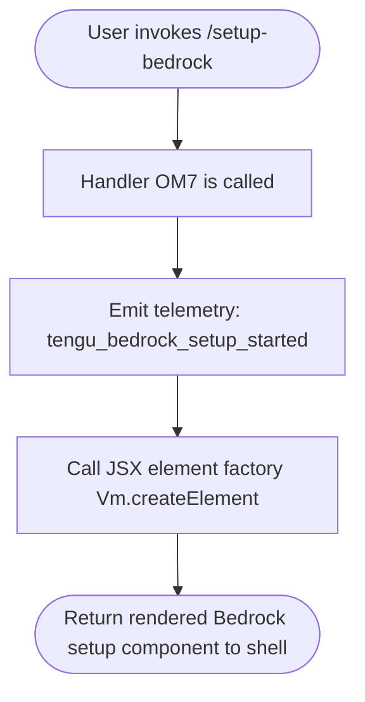

# `/setup-bedrock`

> Analysis basis: CC v2.1.132 bundle.js (AST extraction + Claude interpretation)
> Minimum version: v2.1.132

---

## Overview

`/setup-bedrock` is a local JSX command that launches an interactive reconfiguration wizard for Amazon Bedrock authentication, allowing the user to update credentials, AWS region, or pinned model identifiers. The command renders a JSX component as its response and fires a telemetry event at startup to record that the Bedrock setup flow was initiated.

---

## Registration

| Field | Value |
|---|---|
| type | `local-jsx` |
| name | `setup-bedrock` |
| description | `Reconfigure Amazon Bedrock authentication, region, or model pins` |
| isHidden | `null` (not hidden; appears in the command palette) |
| module_id | `RKq` |
| load_inline | `true` (handler resolved via inline `load:()=>Promise.resolve(…)` shape) |
| handler | `OM7` (AsyncFunction; resolved via `module_id` path in Arbor symbol graph) |
| `loc_byte_end` | `10916104` |
| `arbor_handler.name` | `OM7` |
| `arbor_handler.kind` | `AsyncFunction` |
| `arbor_handler.resolution_path` | `module_id` |
| `arbor_handler.fqn` | `claude-2.1.132::OM7` |
| `arbor_handler.n_hits` | `1` |

Analysis basis: CC v2.1.132 bundle.js:+10915872 – +10916104

---

## Input Branching

The depth-2 call graph for this command is compact: the handler (`OM7`) makes exactly two outward calls — a telemetry emission and a JSX element construction. No branching on user-supplied arguments was detected at this traversal depth.



> If argument-driven branching exists (e.g., `--region`, `--profile` flags), it resides inside the JSX component tree and was not surfaced at depth ≤ 2.
> <!-- TODO: not found in depth-2 traversal; needs --depth 4 -->

---

## Behavioral Spec

### Handler Entry Point — `setupBedrockHandler`

The primary handler is the AsyncFunction identified as `OM7` in the bundle, resolved unambiguously via the `module_id → RKq` path in the Arbor symbol graph.

```
async function setupBedrockHandler(context):

    // Step 1 — Announce setup start to telemetry
    emitTelemetry("tengu_bedrock_setup_started")

    // Step 2 — Construct the Bedrock configuration JSX element
    element = jsxElementFactory(BedrockSetupComponent, props(context))

    // Step 3 — Return the element for rendering in the CLI shell
    return element
```

Analysis basis: CC v2.1.132 bundle.js:+10915149 (telemetry call), +10915185 (JSX factory call)

### Telemetry Emission — `emitTelemetry`

At the very start of the handler, before any UI is rendered, a single telemetry event is dispatched. This event signals that a user has initiated the Bedrock reconfiguration flow and is used to measure feature adoption and funnel entry.

```
function emitTelemetry(eventName):
    // Calls the internal telemetry dispatch helper (identifier: d)
    // eventName = "tengu_bedrock_setup_started"
    dispatchAnalyticsEvent(eventName)
```

Analysis basis: CC v2.1.132 bundle.js:+10915151

### JSX Rendering — `buildSetupComponent`

After telemetry fires, the handler delegates all interactive configuration logic to a JSX component rendered inline in the CLI shell. The component is instantiated via the framework's element factory (`Vm.createElement`). The component is responsible for gathering Bedrock-specific configuration from the user (credentials, region, model pins) as described by the command's registered description.

```
function buildSetupComponent(context):
    props = derivePropsFromContext(context)
    return jsxElementFactory(BedrockSetupComponent, props)
    // jsxElementFactory corresponds to Vm.createElement in the bundle
```

Analysis basis: CC v2.1.132 bundle.js:+10915185

---

## State & Side Effects

| Item | Detail |
|---|---|
| Telemetry | `tengu_bedrock_setup_started` — fired once at handler entry (bundle.js:+10915151) |
| Hook registration | <!-- TODO: not found in depth-2 traversal; needs --depth 4 --> |
| appState changes | Presumed to occur inside the rendered JSX component (e.g., persisting updated Bedrock credentials/region/model pins); not surfaced at depth ≤ 2 |
| Sound | <!-- TODO: not found in depth-2 traversal; needs --depth 4 --> |
| Filesystem / config writes | Expected (re-configuration of Bedrock auth/region/model); not confirmed at this traversal depth |

---

## Version History

| Version | Change |
|---|---|
| v2.1.132 | Initial analysis |

---

## Common Mistakes

1. **Expecting a text response.** Because `type` is `local-jsx`, the command returns a rendered component, not a prose reply. Scripted consumers that parse stdout text will not receive structured output from this command.
2. **Assuming the command accepts CLI flags directly.** No argument-driven branching was detected at depth ≤ 2. Any sub-options (e.g., `--region`, `--profile`) are handled inside the JSX component itself and are not pre-validated at the handler level.
3. **Treating the command as idempotent without side effects.** The command is intended to _mutate_ Bedrock configuration (credentials, region, model pins). Running it unintentionally will launch the interactive wizard and may overwrite existing settings.
4. **Confusing `/setup-bedrock` with a first-time setup flow.** The description explicitly says "Reconfigure", implying it operates on an existing Bedrock installation. Using it before any Bedrock configuration exists may produce unexpected component state.
5. **Missing the telemetry event in offline/air-gapped environments.** The `tengu_bedrock_setup_started` event is emitted synchronously at handler entry. In environments where telemetry is blocked, ensure that the event dispatch failure does not halt the handler before the JSX component is returned.

---

## Appendix — Identifier Mapping

> For bundle debugging only. Identifiers change across versions.

| Identifier | Role |
|---|---|
| `OM7` | Primary async handler for `/setup-bedrock`; entry point resolved via `module_id → RKq` (Arbor resolution path: `module_id`) |
| `d` | Internal telemetry/analytics dispatch helper; called at bundle.js:+10915149 to emit `tengu_bedrock_setup_started` |