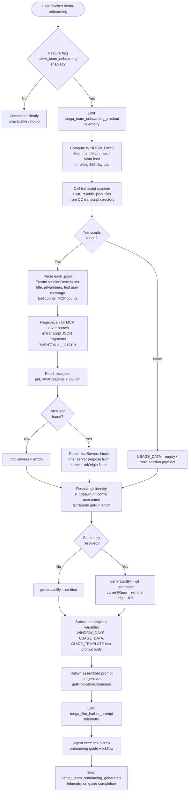

# `/team-onboarding`

> Analysis basis: CC v2.1.179 bundle.js (AST extraction + Claude interpretation)
> Minimum version: v2.1.179

---

## Overview

`/team-onboarding` is a `prompt`-type slash command that scans the invoking user's local Claude Code session transcripts from the past configurable window of days, then co-authors a personalized `ONBOARDING.md` guide for teammates who are new to Claude Code. The command assembles usage statistics, classifies sessions by task type, discovers MCP server configurations and repository context, then drives an interactive two-turn dialogue — first delivering a concrete draft guide, then incorporating the user's edits before writing the final file.

---

## Registration

| Field | Value |
|---|---|
| type | `prompt` |
| name | `team-onboarding` |
| description | `Help teammates ramp on Claude Code with a guide from your usage` |
| isHidden | `false` |
| handler_method | `getPromptForCommand` |
| handler_method_start (loc_byte) | `12505513` |
| handler_method_end (loc_byte) | `12506223` |
| loc_byte | `12505150` |
| loc_byte_end | `12506224` |
| loc_line | `8440` |
| prompt_body.length | `4539` characters |
| prompt_body.trace | `identifier→$ (local→1 ext vars)` |
| arbor_handler.name | `getPromptForCommand` |
| arbor_handler.fqn | `claude-2.1.179::getPromptForCommand` |
| arbor_handler.kind | `Method` |
| arbor_handler.resolution_path | `direct` |
| arbor_handler.n_hits | `2` |
| `handler_method_start` | `12505513` |
| `handler_method_end` | `12506223` |

Analysis basis: CC v2.1.179 bundle.js:+12505150

---

## Input Branching

The handler executes several distinct branches before constructing the final prompt string: it checks a feature-flag gate (`allow_team_onboarding`), collects transcript data across a rolling date window, discovers MCP configuration, resolves git identity, and substitutes three template variables. This yields more than three distinct paths (flag absent/present, transcripts found/empty, MCP config found/absent, git identity resolved/missing), so a flowchart is used.



Analysis basis: CC v2.1.179 bundle.js:+12505513

---

## Behavioral Spec

### 1. Feature-Flag Gate

```
function checkTeamOnboardingFeatureFlag(orgPlan):
    // Reads allow_team_onboarding from account/org feature set
    // Literal "allow_team_onboarding" confirmed at bundle.js:+10216206
    if featureFlags does not include "allow_team_onboarding":
        return COMMAND_UNAVAILABLE
    return PROCEED
```

The string literal `"allow_team_onboarding"` is present at bundle.js:+10216206 and is checked via `_9` / `jf6` before any transcript scanning begins.

Analysis basis: CC v2.1.179 bundle.js:+10216203

---

### 2. Rolling Window Calculation

```
function computeWindowDays(now, maxDays = 365):
    // Uses Math.min, Math.max, Math.floor to clamp the look-back window
    // Literal 365 confirmed at bundle.js:+12505762
    rawDays = Math.floor((now - referenceEpoch) / MS_PER_DAY)
    windowDays = Math.min(Math.max(rawDays, 1), maxDays)
    return windowDays
```

The handler calls `Math.min` (bundle.js:+12505716), `Math.max` (bundle.js:+12505725), and `Math.floor` (bundle.js:+12505734) in sequence, with the numeric constant `365` (bundle.js:+12505762) capping the look-back period. The result is substituted as `{{WINDOW_DAYS}}` in the prompt body.

Analysis basis: CC v2.1.179 bundle.js:+12505716

---

### 3. Transcript Discovery and Parsing (`HwK`)

```
function scanTranscripts(transcriptDir, windowDays):
    cutoffTime = Date.now() - windowDays * MS_PER_DAY
    allFiles = await lL6.readdir(transcriptDir)        // async readdir
    jsonlFiles = allFiles.filter(f => extname(f) === ".jsonl")
                                                        // ".jsonl" at +12494096
    results = await Promise.all(jsonlFiles.map(async file =>
        stat = await lL6.stat(join(transcriptDir, file))
        if not stat.isFile() or stat.mtime < cutoffTime:
            return null
        raw = await lL6.readFile(join(transcriptDir, file))
        lines = raw.split("\n")
        return parseTranscriptLines(lines)
    ))
    return results.filter(Boolean)
```

The transcript scanner (`HwK`) reads `.jsonl` files (confirmed literal `.jsonl` at bundle.js:+12494096) from the local CC transcript directory using async `lL6.readdir` (bundle.js:+12494009) and `lL6.readFile` (bundle.js:+12494352). It applies `Promise.all` (bundle.js:+12494115) over the file map. The look-back window uses numeric constants 24 and 60 (bundle.js:+12493981, +12493984) for hour/minute conversion. `Date.now()` is called at bundle.js:+12493968.

Analysis basis: CC v2.1.179 bundle.js:+12493968

---

### 4. Session Descriptor Extraction

```
function parseTranscriptLines(lines):
    sessionDescriptor = { title: null, prNumbers: [], firstUserMessage: null,
                          toolCounts: {}, mcpCounts: {} }

    for each line in lines:
        parsed = JSON.parse(line)

        // Extract session title from conversation metadata
        if parsed contains title field:
            sessionDescriptor.title = parsed.title

        // Extract PR numbers from code-review links
        prMatches = CeL.exec(line)          // regex for PR numbers (+12494816)
        if prMatches: sessionDescriptor.prNumbers.push(prMatches)

        // Capture first human message
        beL.exec(line)                       // regex for first user message (+12494872)

        // Count MCP tool invocations
        // Scans for '"name":"mcp__' pattern (+12494675)
        mcpMatches = line.matchAll(mcpNamePattern)

        // Count tool invocations from "content":[ pattern (+12495025)
        xeL.exec(line)                       // content/tool block regex (+12495047)

        // If startsWith assistant prefix (top-3 check, +12495128)
        if line.startsWith(assistantPrefix):
            sessionDescriptor.firstUserMessage = extractSlice(line)  // +12495165

    return sessionDescriptor
```

Three regular expressions (`CeL`, `beL`, `xeL`) extract PR numbers, first-user messages, and content blocks respectively. The MCP name pattern `"name":"mcp__` (bundle.js:+12494675) and content sentinel `"content":[` (bundle.js:+12495025) are used as fast-path string scans before regex application. A threshold of `3` (bundle.js:+12495128) limits how deep into a file the first-message scan runs.

Analysis basis: CC v2.1.179 bundle.js:+12494466

---

### 5. MCP Configuration Discovery (`peL`)

```
function readMcpConfig(workspaceRoot):
    configPath = jd8.join(workspaceRoot, ".mcp.json")   // ".mcp.json" at +12496207
    try:
        raw = await AwK.readFile(configPath)
        parsed = JSON.parse(raw)                          // l6 = JSON.parse wrapper
        servers = parsed["mcpServers"]                   // "mcpServers" at +12496263
        return servers ?? {}
    catch ENOENT:
        return {}
```

`peL` reads `.mcp.json` (bundle.js:+12496207) from the workspace root, extracts the `mcpServers` key (bundle.js:+12496263), and passes each server's `name` and `urlOrigin` fields to the prompt as part of `USAGE_DATA` so the agent can infer server purpose and access instructions. On read failure the servers block is left empty.

Analysis basis: CC v2.1.179 bundle.js:+12496183

---

### 6. Git Identity Resolution (`o_`)

```
function resolveGitIdentity():
    try:
        userName = await spawnCapture("git", ["config", "user.name"])
                                         // "git","config","user.name" at +12496830/+12496837/+12496846
        remoteUrl = await spawnCapture("git", ["remote", "get-url", "origin"])
                                         // "remote","get-url","origin" at +12496902/+12496911/+12496921
        return { generatedBy: userName.trim(), currentRepo: remoteUrl.trim() }
    catch:
        return { generatedBy: null, currentRepo: null }
```

`o_` spawns two git subprocesses via `MkH` (the subprocess-management layer). If `generatedBy` resolves to null the prompt instructs the agent to omit the name field. The `currentRepo` value seeds the Repos section of the guide; the agent additionally checks for sibling directory repos in the workspace.

Analysis basis: CC v2.1.179 bundle.js:+12496827

---

### 7. Prompt Assembly and Template Substitution

```
function getPromptForCommand(usageData, windowDays, guideTemplate):
    // Three template variable substitutions via String.replaceAll
    // Literals confirmed: "{{WINDOW_DAYS}}" +12505973, "{{GUIDE_TEMPLATE}}" +12506013,
    //                     "{{USAGE_DATA}}" +12506048
    prompt = BASE_PROMPT_BODY                           // length 4539, loc_byte +12505150
    prompt = prompt.replaceAll("{{WINDOW_DAYS}}", String(windowDays))
    prompt = prompt.replaceAll("{{USAGE_DATA}}", JSON.stringify(usageData))
    prompt = prompt.replaceAll("{{GUIDE_TEMPLATE}}", guideTemplate)
    return { type: "text", content: prompt }            // "text" literal at +12506207
```

`_.replaceAll` is called at bundle.js:+12505960. `String()` wraps the numeric window value at bundle.js:+12505991. The return value carries `type: "text"` (bundle.js:+12506207). The `jf6` helper performs the feature-flag check and emits the `tengu_flint_harbor_share` telemetry event before this function returns.

Analysis basis: CC v2.1.179 bundle.js:+12505960

---

### 8. Agent-Side Guide Authoring Workflow (5 Steps)

The assembled prompt instructs the agent to execute the following workflow. This is derived from the prompt body (length 4539, trace `identifier→$ (local→1 ext vars)`); no verbatim quote beyond short citation fragments is reproduced.

```
agent workflow onTeamOnboardingPrompt(sessionDescriptors, mcpServers, gitContext):

    // Step 1 — Immediate acknowledgment (before any reasoning)
    output "> Looking at how you've used Claude over the last N days..."
    // The prompt mandates this line appears before classification

    // Step 2 — Session classification
    taskTypes = ["build_feature", "debug_fix", "improve_quality",
                 "analyze_data", "plan_design", "prototype", "write_docs"]
    breakdown = {}
    for each session in sessionDescriptors:
        taskType = classifySession(session.firstUserMessage,
                                   session.prNumbers,
                                   session.title,
                                   session.toolCounts,
                                   session.mcpCounts)
        breakdown[taskType] += 1

    top35 = selectTopN(breakdown, minN=3, maxN=5)
    // Display as title-case with spaces (e.g. "Build Feature" not "build_feature")

    // Step 3 — Gather remaining guide pieces
    repos = discoverRepos(gitContext.currentRepo, workspaceSiblingDirs)
    mcpSetup = inferMcpAccess(mcpServers)   // name + urlOrigin per server
    // Leave Team Tips and Get Started as TODO placeholders

    // Step 4 — Write ONBOARDING.md
    guide = renderGuide(
        generatedBy = gitContext.generatedBy,   // omit if null
        windowDays  = windowDays,
        breakdown   = top35,                    // ASCII bar charts: █ filled, ░ empty, 20 chars wide
        repos       = repos,
        mcpSetup    = mcpSetup
    )
    writeFile("ONBOARDING.md", guide)

    // Step 5 — Render draft + Review questions
    output codeBlock(guide)
    output "---"
    output "**Review**"
    output "1. Team name confirmation / request"
    output "2. Starter task request (ticket or doc link, optional)"
    output "3. Team tips not already in CLAUDE.md"

    // After user answers — update file and close
    updateFile("ONBOARDING.md", teamName, tips, starterTask)
    output "Saved to `ONBOARDING.md`. Drop it in your team docs..."
    // Then apply any further edits on request
```

Analysis basis: CC v2.1.179 bundle.js:+12505513 (handler body)

---

### 9. Session Classification Rules

| Task Type | Classification Criteria |
|---|---|
| `build_feature` | New functionality, scripts, tools, config/CI/env setup |
| `debug_fix` | Investigating and fixing bugs |
| `improve_quality` | Refactoring, tests, cleanup; code-review sessions |
| `analyze_data` | Queries, metrics, number crunching |
| `plan_design` | Architecture, strategy, design review, understanding unfamiliar code |
| `prototype` | Spikes, POCs, throwaway exploration |
| `write_docs` | PRDs, RFCs, READMEs, design docs; doc/copy review sessions |

Review sessions follow the content being reviewed: code review → `improve_quality`, doc review → `write_docs`, design review → `plan_design`. If ~0 sessions exist, the breakdown is left as a TODO. First messages are the primary signal; titles and PR links are enrichment. Tool/MCP counts are a weak fallback when first messages are uninformative.

Analysis basis: CC v2.1.179 bundle.js:+12505513

---

### 10. ASCII Bar Chart Rendering

```
function renderBarChart(fraction, width = 20):
    filledCount = Math.floor(fraction * width)
    emptyCount  = width - filledCount
    return "█".repeat(filledCount) + "░".repeat(emptyCount)
```

The prompt body specifies `█` for filled bars and `░` for empty bars at a fixed width of 20 characters. Values are derived from real session counts, not placeholder text.

Analysis basis: CC v2.1.179 bundle.js:+12505513 (prompt_body)

---

## State & Side Effects

| Item | Detail |
|---|---|
| Telemetry: `tengu_team_onboarding_invoked` | Emitted immediately after the feature-flag check passes (bundle.js:+12505773) |
| Telemetry: `tengu_flint_harbor_prompt` | Emitted when the prompt is dispatched to the agent (bundle.js:+12505550) |
| Telemetry: `tengu_team_onboarding_generated` | Emitted after the agent writes the guide (bundle.js:+12506092) |
| Telemetry: `tengu_flint_harbor_share` | Emitted via `jf6` on successful share/prompt-return path (bundle.js:+10216268) |
| Telemetry: `tengu_config_lock_contention` | Emitted if config lock is contended during transcript path resolution (bundle.js:+3397818) |
| Telemetry: `tengu_config_stale_write` | Emitted on stale config write detection (bundle.js:+3397954) |
| Telemetry: `tengu_config_auth_loss_prevented` | Emitted if auth-loss safeguard fires during config write (bundle.js:+3398297) |
| File write | `ONBOARDING.md` created/updated in the current working directory by the agent |
| Git subprocesses | Two `git` spawns via `MkH`: `git config user.name` and `git remote get-url origin` |
| File reads | `.jsonl` transcript files under CC transcript directory; `.mcp.json` in workspace root |
| Config reads | Global CC config accessed via `r5H`/`eO8`; guarded by lock (`PG_`) |
| Feature-flag check | `allow_team_onboarding` read from org/account feature set via `_9` |
| No sound | No audio side-effect found in depth-2 traversal |

---

## Version History

| Version | Change |
|---|---|
| v2.1.179 | Initial analysis — command introduced with 4539-char prompt body, 5-step guide workflow, and three telemetry events specific to team-onboarding |

---

## Common Mistakes

1. **Invoking without the `allow_team_onboarding` feature flag** — The command silently produces no prompt or output if the org/account feature flag is absent. Verify entitlement before reporting the command as broken.

2. **Running outside a git repository** — `git config user.name` and `git remote get-url origin` both fail gracefully, but the `generatedBy` and `currentRepo` fields will be omitted from the guide. The guide is still generated; the author name and repo link are simply blank.

3. **No `.jsonl` transcripts in the look-back window** — If the user has no local Claude Code sessions within the rolling window (max 365 days), `USAGE_DATA` will represent ~0 sessions and the work-type breakdown will be left as a TODO placeholder in the guide. The command still completes.

4. **Missing `.mcp.json`** — The command reads `.mcp.json` from the workspace root. If absent, the MCP Server Setup section of `ONBOARDING.md` will be empty. This is expected behavior, not an error.

5. **Editing `ONBOARDING.md` before the Review turn** — The command's two-turn dialogue is designed so the user answers three specific questions before the file is finalized. Making direct edits mid-turn may be overwritten when the agent applies Review answers to the file.

6. **Expecting immediate classification output** — The prompt body explicitly mandates the acknowledgment line appears before any classification reasoning. If the agent skips the acknowledgment and dives into classification, that violates the prompt's stated Step 1 ordering.

---

## Appendix — Identifier Mapping

> For bundle debugging only. Identifiers change across versions.

| Identifier | Role |
|---|---|
| `__handler_team-onboarding` | Synthetic BFS entry point for the command handler (see `getPromptForCommand` via Arbor) |
| `Y6` | Session/conversation launcher — initiates a new agent conversation from a prompt |
| `IG6` | Conversation initialization helper (called by launcher) |
| `SG6` | Conversation state setup helper (called by launcher) |
| `fp` | Conversation context builder |
| `im` | Internal messaging / request dispatcher |
| `xb` | HTTP/API request executor |
| `mO8` | Prompt deduplication / caching layer |
| `PG_` | Config lock acquisition and write orchestrator |
| `lyH` | Lock helper sub-function |
| `_g` | Random hex token generator (uses `oy_.randomBytes`, 32 bytes, hex encoding) |
| `bH` | JSON serialization wrapper (delegates to `JSON.stringify`) |
| `myf` | Metrics / event flush helper |
| `xy_` | Prompt dispatch / queue handler |
| `td1` | Queue entry builder |
| `t_` | Buffer/stream wrapper |
| `m59` | Message sequencing helper |
| `xl` | Feature-set membership checker |
| `h6` | Transcript file reader and watcher coordinator |
| `c6` | Path/context resolver |
| `iy_` | File-watch interrupt handler |
| `r5H` | Config file reader (reads and parses global CC config with lock guard) |
| `q` | Filesystem abstraction (Node `fs` wrapper, 1024-byte buffer) |
| `l6` | JSON parse wrapper |
| `Vm` | String prefix stripper (uses `startsWith` + `slice`) |
| `_` | Filesystem operations object (readdirStringSync, statSync, toUpperCase) |
| `G8` | Error reporter / logger |
| `fM9` | Sibling-repo directory scanner |
| `N` | String formatter / normalizer (trim, toUpperCase, includes checks) |
| `d` | App state / global store accessor |
| `ay_` | Backup directory path builder |
| `D` | Daemon process manager (spawn, kill, memory checks) |
| `brf` | File-watch registration handler |
| `kg` | Watch event debouncer |
| `U9` | Signal / event bus registration (`oSA.register`) |
| `J8` | Transcript-scan orchestrator — coordinates `eO8`, `r5H`, `RsH`, `tO8` |
| `eO8` | Per-file transcript parser (reads, stats, copies, parses `.jsonl` entries) |
| `f` | File handle / async write set |
| `L` | Stream / connection close handler |
| `RC1` | Transcript record constructor (`Object.assign` based) |
| `x2_` | Transcript record sub-constructor (`SC1` based) |
| `RsH` | Transcript result aggregator |
| `A` | Process/session registry (Map of active sessions) |
| `v` | Viewport / display metrics |
| `S` | TTY / terminal output writer |
| `Z` | Scroll/range clamper (Math.max, Math.min) |
| `P` | IPC buffer processor (Buffer.concat, indexOf, subarray) |
| `X` | Socket timeout controller |
| `j` | Process kill coordinator |
| `cL` | Stream end / flush helper |
| `qx5` | Daemon message dispatcher (handles ping, nudge, yield, lease, attach, reply, kill, resize, etc.) |
| `GH` | String coercer for IPC messages |
| `ED6` | Atomic file writer (uses temp file + rename, fsync, fchmod) |
| `O` | Symlink / stat inspector |
| `x8` | Error code classifier |
| `H` | Jittered retry / timeout scheduler (Math.random + setTimeout) |
| `rXH` | Config read helper |
| `KM9` | Config entries iterator (Object.entries) |
| `pG6` | Timestamp recorder (Date.now) |
| `tO8` | Config write-with-lock orchestrator |
| `QH` | Async queue / notification pump (`n36`) |
| `n36` | Queue drain notification |
| `UeL` | Usage-data assembler — top-level coordinator calling `HwK`, `peL`, `meL`, `o_`, `wkH` |
| `G_` | OAuth / auth token loader |
| `OT` | Auth token cache |
| `Tb` | Project config path resolver |
| `xk` | Project directory path builder |
| `Fw` | Path relativizer (replace + slice) |
| `wc4` | Path length calculator (Math.abs + IDH) |
| `HwK` | Transcript directory scanner — async reads `.jsonl` files, applies regex extractors |
| `f1` | Error handler for readdir failures |
| `K` | Column formatter (padEnd) |
| `$` | Prompt body variable (holds assembled usage-data JSON string; `identifier→$`) |
| `yTK` | App-state change event emitter |
| `z` | Feature flag / daemon control router |
| `IH` | Feature-OK branch handler |
| `CH` | Feature-BAD branch handler |
| `QS` | Telemetry event queue pusher |
| `QB` | Graceful shutdown coordinator (Promise.race, process.exit) |
| `Y` | Process exit / abort coordinator |
| `NX` | Exit reason recorder |
| `peL` | MCP config reader — reads `.mcp.json`, extracts `mcpServers` block |
| `meL` | Additional metadata assembler for usage data |
| `o_` | Git identity resolver — spawns `git config user.name` and `git remote get-url origin` |
| `MkH` | Subprocess manager (spawn, kill, timeout, pipe) |
| `TsA` | Platform-specific command builder (win32 `.exe`/`cmd` handling) |
| `q5_` | Spawn options builder |
| `K5_` | Spawn args normalizer |
| `L5_` | Spawn path resolver |
| `yaA` | Timeout validator (Number.isFinite) |
| `vD6` | Subprocess error classifier |
| `A5_` | Reflect.apply-based method interceptor |
| `KsA` | Subprocess exit event binder |
| `kaA` | Subprocess timeout handler (setTimeout + Promise.race) |
| `IaA` | Subprocess kill-on-abort handler |
| `NaA` | Subprocess stdout/stderr data accumulator |
| `haA` | Subprocess SIGKILL escalator |
| `AsA` | Parallel subprocess await helper (Promise.all) |
| `yD6` | Subprocess output stream handler |
| `HsA` | Subprocess stdout pipe connector |
| `_sA` | Subprocess stderr aggregator |
| `baA` | Subprocess stdin binder |
| `qn4` | String output normalizer for subprocess results |
| `mL` | Log / debug output helper |
| `SH` | Structured log emitter (logError, push to hlH) |
| `WA` | Error string coercer |
| `f6` | String coercion primitive |
| `fq` | Request/response formatter |
| `Nd4` | Ring-buffer log rotator (shift + push on Xe6) |
| `wkH` | Git remote URL parser (trim, match, startsWith `git/`, slice, toLowerCase) |
| `bn4` | URL host extractor (Z9: indexOf + slice) |
| `Z9` | String index/slice utility |
| `jf6` | Feature-flag checker + `tengu_flint_harbor_share` emitter |
| `_9` | Feature-flag evaluator (checks `ryf`/`oyf` sets, `allow_team_onboarding`) |
| `Mn1` | Feature-flag registry initializer |
| `zt` | Feature-flag state object constructor |
| `pb` | Auth/credential resolver for feature-flag evaluation |
| `u_` | Provider type resolver (`bedrock`, `foundry`, `vertex`, etc.) |
| `j7` | API key presence checker |
| `kO` | Main API client constructor |
| `Uj` | Auth profile selector (`profile-implicit`, `user_oauth`) |
| `lLH` | Feature-flag logging helper |
| `bW` | Feature-flag result cache writer |