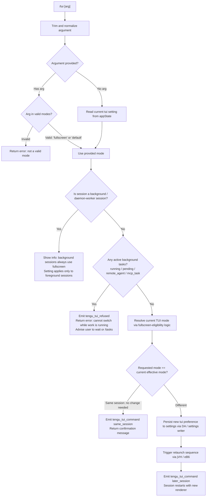

# `/tui`

> Analysis basis: CC v2.1.179 bundle.js (AST extraction + Claude interpretation)
> Minimum version: v2.1.179

---

## Overview

`/tui` sets the terminal UI renderer mode for the current Claude Code session, toggling between `default` and `fullscreen` rendering. When called, the command validates whether a renderer switch is currently permissible (checking for active background work), and if allowed, persists the new TUI preference to settings and relaunches the session with the updated renderer. Background sessions always use the fullscreen renderer regardless of this setting.

---

## Registration

| Field | Value |
|---|---|
| type | `local-jsx` |
| name | `tui` |
| description | `Set the terminal UI renderer (default \| fullscreen)` |
| argumentHint | `[default\|fullscreen]` |
| module_id | `ZJK` |
| load_inline | `true` |
| loc_byte | `12815656` |
| loc_byte_end | `12815838` |
| loc_line | `8795` |
| arbor_handler.name | `TA5` |
| arbor_handler.fqn | `claude-2.1.179::TA5` |
| arbor_handler.kind | `AsyncFunction` |
| arbor_handler.resolution_path | `module_id` |
| arbor_handler.n_hits | `0` |

Analysis basis: CC v2.1.179 bundle.js:+12815656

---

## Input Branching

The command has 5+ distinct branches based on argument parsing, environment guard checks, and background-work detection. A Mermaid flowchart is used.



Analysis basis: CC v2.1.179 bundle.js:+12813414 – +12815309

---

## Behavioral Spec

### 1. Argument Parsing and Mode Validation

```
async function handleTuiCommand(rawArg):
    trimmedArg = rawArg.trim()                    // TA5 → A.trim loc_byte:12813414

    validModes = ["fullscreen", "default"]         // literals loc_byte:3587473, 3587499

    if trimmedArg is not empty:
        if trimmedArg not in validModes:
            return errorMessage("Invalid mode: must be 'default' or 'fullscreen'")
        requestedMode = trimmedArg
    else:
        requestedMode = null   // will be resolved from appState
```

Analysis basis: CC v2.1.179 bundle.js:+12813414, +12813526, +12813572

### 2. Background Session Guard

```
    sessionType = getSessionType()                 // V9 → XyH loc_byte:12813710, 2296562

    if sessionType == "daemon-worker":             // literal loc_byte:2296509
        // Background sessions always use fullscreen; setting does not apply here
        showInfoMessage(
            "Background sessions always use the fullscreen renderer " +
            "so scrolling and mouse work when attached. " +
            "The tui setting applies to sessions started directly with `claude`."
            // literal loc_byte:12813724
        )
        return
```

Analysis basis: CC v2.1.179 bundle.js:+12813710

### 3. Active Background Work Detection

```
    activeTasks = getActiveTaskList()              // B_ loc_byte:12813694

    blockedStatuses = ["running", "pending", "remote_agent", "mcp_task"]
    // literals loc_byte:12814120, 12814142, 12814163, 12814188

    hasActiveWork = activeTasks.some(task => blockedStatuses.includes(task.status))

    if hasActiveWork:
        emitTelemetry("tengu_tui_refused")         // loc_byte:12814209
        return errorMessage(
            "Cannot switch renderers while work is running in the background " +
            "— wait for it to finish (or stop it via /tasks), then run /tui again."
            // literal loc_byte:12814250
        )
```

Analysis basis: CC v2.1.179 bundle.js:+12813694, +12814209, +12814250

### 4. Current TUI Mode Resolution

The command computes the effective TUI mode using a multi-factor eligibility function that takes into account environment variables, terminal detection, and user settings.

```
    effectiveMode = resolveFullscreenEligibility()  // m1 loc_byte:12813439

    // resolveFullscreenEligibility considers, in order:
    //   bg_forced_on  — background forces fullscreen            (loc_byte:3587884)
    //   env_off       — CLAUDE_CODE_NO_FLICKER or              (loc_byte:3587914)
    //                   CLAUDE_CODE_DISABLE_ALTERNATE_SCREEN env vars
    //   env_on        — CLAUDE_CODE_FORCE_FULLSCREEN_UPSELL    (loc_byte:3587964)
    //   tmux_cc_auto_off — tmux -CC (iTerm2 integration) auto-disables fullscreen
    //                      with message about CLAUDE_CODE_NO_FLICKER (loc_byte:3587988)
    //   win_ssh_auto_off — Windows over SSH (ConPTY) auto-disables (loc_byte:3588022)
    //   settings_on   — user settings set to fullscreen         (loc_byte:3588081)
    //   settings_off  — user settings set to default            (loc_byte:3588115)
    //   downsell_on   — feature flag downsell active            (loc_byte:3588188)
    //   gb_on / gb_off — growthbook flag controls              (loc_byte:3588253, 3588261)
```

Analysis basis: CC v2.1.179 bundle.js:+12813439, +3587884 – +3588261

### 5. Terminal Environment Probing (during mode resolution)

```
    function probeTerminalCapabilities():           // yy loc_byte:12814549
        // Checks performed:
        // - Is the terminal Cursor?                (literal "cursor" loc_byte:3658751)
        // - Is the terminal VSCode?                (literal "vscode" loc_byte:3658800)
        // - Is this JetBrains IDE terminal?        (U1H.isJetBrainsIdeTerminal loc_byte:3658074)
        // - Is TERM_PROGRAM in allowed list?       (VF.includes loc_byte:3658046)
        // - Is Ghostty >= 1.2.0?                   (literals loc_byte:3655446, 3655476)
        // - Is iTerm.app >= 3.6.6?                 (literals loc_byte:3655515, 3655547)
        // - Is tmux or screen multiplexer active?  (literals loc_byte:3578356, 3578429)
        //   → If tmux: escape sequence prefix adjusted (literal "\x1b\x1b" loc_byte:3578402)
        // - Platform: darwin / win32               (literals loc_byte:3658284, 3658331)
        // - xterm.js terminal variant detected     (literal loc_byte:3658920)
        // Returns capability profile used to select renderer
```

Analysis basis: CC v2.1.179 bundle.js:+12814549, +3658006 – +3659258

### 6. Same-Session vs. Later-Session Branch

```
    if requestedMode == null:
        requestedMode = effectiveMode   // use current computed mode as toggle target

    currentSetting = readTuiSetting()              // S$ → H.getAppState loc_byte:12813700

    uptimeSeconds = Math.round(process.uptime())   // loc_byte:12814784, 12814773

    if requestedMode == currentEffectiveMode:
        // No renderer switch needed; confirm current state
        emitTelemetry("tengu_tui_command",          // loc_byte:12814682
                      { transition: "same_session", // literal loc_byte:12815146
                        uptime: uptimeSeconds })
        return confirmationMessage(currentEffectiveMode)

    else:
        // Persist new mode to user settings
        persistTuiSetting(requestedMode, settingsWriter)  // DA loc_byte:12814438

        emitTelemetry("tengu_tui_command",          // loc_byte:12814682
                      { transition: "later_session", // literal loc_byte:12815161
                        uptime: uptimeSeconds })

        // Trigger graceful relaunch with new renderer
        initiateRelaunch()                          // eB6 → jVH loc_byte:12815208
```

Analysis basis: CC v2.1.179 bundle.js:+12814682, +12814721, +12814784, +12815146, +12815161, +12815208

### 7. Settings Persistence (via DA — Settings Writer)

```
    function persistTuiSetting(mode, settingsContext):   // DA loc_byte:12814438
        // Resolves the active settings file (userSettings / projectSettings /
        // localSettings), loads the current JSON, merges the tui field,
        // and writes back atomically using a temp-file + rename pattern.
        // Clears in-memory settings cache after write.        (Mz loc_byte:1326928)
        // Emits WnH change event for reactive subscribers.    (DA → WnH.emit loc_byte:1327339)
```

Analysis basis: CC v2.1.179 bundle.js:+12814438, +1326928, +1327339

### 8. Relaunch Sequence (via relaunchHandler)

```
    function initiateRelaunch():                    // jVH loc_byte:12810671
        // 1. Locate versioned binary via config path resolution
        //    (aR → vI8 → hT8 → P_q.homedir, path: ~/.local/share/claude/versions/bin)
        //    literals loc_byte:6982080("local"), 6982089("share"), 8490331("claude"),
        //             8490340("versions"), 6982160("bin")
        // 2. Flush pending UI renders (FxH: unmount Ink, write sync restore sequences)
        //    ANSI escape \x1b7 (save cursor) / \x1b8 (restore cursor)
        //    literals loc_byte:3930024, 3930035
        // 3. Drain analytics queue with timeout 2000ms           (literal loc_byte:12808862)
        // 4. Flush remaining events with timeout 30000ms         (literal loc_byte:12808805)
        // 5. Clear interval timers (Oy6 → Uo_ → clearInterval)
        // 6. Remove all process signal listeners
        //    re-register SIGINT and SIGHUP for clean exit        (literals loc_byte:12809278, 12809297)
        // 7. Load native addon via FFI (jJK → L.dlopen)
        //    Platform: macos → /usr/lib/libSystem.B.dylib        (literal loc_byte:12807886)
        //    Platform: linux → libc.so.6                         (literal loc_byte:12807915)
        // 8. execve() the new process with --resume flag         (literal loc_byte:12808738)
        //    Inherit stdio                                        (literal loc_byte:12809399)
        // 9. On execve failure: write error marker via bX        (loc_byte:12809586)
        //    emit "relaunch_spawn_error" marker                  (literal loc_byte:12809589)
        //    exit process                                         (loc_byte:12809613)
```

Analysis basis: CC v2.1.179 bundle.js:+12808671, +12808592, +12808738, +12808805, +12808862, +12809278, +12809364, +12809586, +12809613

---

## State & Side Effects

| Item | Detail |
|---|---|
| Telemetry: `tengu_tui_refused` | Fired when a renderer switch is blocked due to active background tasks (loc_byte:12814209) |
| Telemetry: `tengu_tui_command` | Fired on every successful command invocation; includes `same_session` or `later_session` transition and `uptime` (loc_byte:12814682) |
| Telemetry: `tengu_amber_creek` | Fired within fullscreen eligibility resolution (loc_byte:3587656) |
| Telemetry: `tengu_pewter_brook` | Fired within fullscreen eligibility resolution (loc_byte:3587564) |
| Telemetry: `tengu_scroll_summary` | Fired during scroll state save before relaunch (loc_byte:7194914) |
| Settings write | Persists `tui` field to the active settings file (userSettings or projectSettings) via atomic write |
| In-memory settings cache | Cleared after write via cache-clear utility (loc_byte:1326928) |
| Settings change event | Emitted on `WnH` event bus so reactive subscribers update (loc_byte:1327339) |
| Process relaunch | Full `execve()` replacement of the current process with `--resume` flag; stdin/stdout/stderr inherited |
| ANSI escape sequences | `\x1b7` / `\x1b8` issued to save/restore terminal cursor state before teardown (loc_byte:3930024, 3930035) |
| Ink TUI unmount | Ink render tree unmounted cleanly before relaunch (`H.unmount` loc_byte:7193158) |
| Analytics drain | Analytics queue drained with 2 000 ms timeout before relaunch (loc_byte:12808862) |
| Signal handler reset | All existing `process` listeners removed; SIGINT/SIGHUP re-registered for clean handoff (loc_byte:12809278, 12809297, 12809307) |
| Native FFI dlopen | Platform-specific libc loaded via Bun FFI to perform `execve` (loc_byte:12807865) |
| Environment variables observed | `CLAUDE_CODE_NO_FLICKER`, `CLAUDE_CODE_DISABLE_ALTERNATE_SCREEN`, `CLAUDE_CODE_FORCE_FULLSCREEN_UPSELL` (loc_byte:12810767, 12810792, 12810831) |

---

## Version History

| Version | Change |
|---|---|
| v2.1.179 | Initial analysis |

---

## Common Mistakes

1. **Passing an unrecognized mode string** — only `default` and `fullscreen` are accepted; any other value is rejected before any state change occurs.
2. **Running `/tui` while background tasks are active** — the command explicitly refuses to switch renderers when tasks with status `running`, `pending`, `remote_agent`, or `mcp_task` exist; use `/tasks` first to stop or wait for them.
3. **Expecting `/tui` to affect background sessions** — sessions launched as daemon-worker processes always use the fullscreen renderer; the command's setting only governs foreground `claude` invocations.
4. **Expecting an instant switch without relaunch** — when the new mode differs from the current one, the process is replaced via `execve` with `--resume`; any unsaved in-memory state not persisted before that point is lost.
5. **Overriding via settings when environment variables take precedence** — `CLAUDE_CODE_NO_FLICKER` and `CLAUDE_CODE_DISABLE_ALTERNATE_SCREEN` suppress fullscreen regardless of what is written to settings; use `/tui default` and remove those variables for full control.

---

## Appendix — Identifier Mapping

> For bundle debugging only. Identifiers change across versions.

| Identifier | Role |
|---|---|
| `TA5` | Main async handler for `/tui` command (arbor_handler) |
| `eB6` | Outer entry-point wrapper that calls relaunch handler and environment flag reader |
| `jVH` | Core relaunch sequence: flushes UI, drains analytics, execve's new process |
| `aR` | Binary path resolver: locates versioned claude binary under home directory |
| `vI8` | Path segment builder for versioned binary lookup |
| `X3` | Array/path normalization utility |
| `A$H` | Alternative path join helper |
| `VqH` | Home directory binary path builder |
| `hT8` | Home directory resolver (calls `os.homedir`) |
| `Fh` | Configuration/state accessor used during relaunch |
| `I6` | Generic output/logging helper |
| `OT` | Terminal output writer |
| `Oy6` | Interval timer cleanup coordinator |
| `Uo_` | `clearInterval` wrapper for all active timers |
| `FxH` | Terminal teardown: unmounts Ink, writes restore sequences, calls cleanup |
| `H` | Ink render instance (also used in various other contexts by name collision) |
| `qR` | Post-unmount cleanup callback |
| `xY8` | ANSI escape sequence writer and terminal state restorer |
| `zRH` | Terminal capability/version checker (Ghostty, iTerm versioning) |
| `_G` | tmux escape sequence prefix patcher |
| `mL` | Miscellaneous string utility |
| `N` | Logger / debug output utility |
| `aZ8` | Scroll summary emitter (fires `tengu_scroll_summary`) |
| `b0` | Scroll state accessor |
| `U9q` | Scroll data serializer |
| `d` | Generic promise/deferred utility |
| `p9q` | Scroll position calculator (uses `Date.now`, `Math.max`, `Math.round`) |
| `u9q` | Scroll update applicator |
| `m1` | Fullscreen eligibility resolver — primary mode decision function |
| `xl` | Feature-flag/growthbook lookup utility |
| `GS_` | Eligibility path: `bg_forced_on` / `env_off` checks |
| `it` | Eligibility path: `env_on` check |
| `WS_` | Eligibility path: Windows SSH / platform detection |
| `t_` | Settings reader for TUI preference field |
| `usf` | Eligibility path: settings-based override (`settings_on` / `settings_off`) |
| `Y6` | Growthbook feature flag evaluator |
| `r4` | Timeout-with-race utility (used for flush timeouts) |
| `iE` | Analytics/event register helper |
| `Pf` | Event pipeline initializer |
| `U9` | Low-level event registration (`oSA.register`) |
| `qdH` | Analytics drain helper (`oSA.drain`) with timeout |
| `QxH` | Ink render launcher / renderer starter |
| `rZ8` | Renderer configuration builder |
| `GXA` | Working-directory and context resolver for relaunch |
| `G_` | Output/error formatter |
| `D4` | Diagnostic output helper |
| `jJK` | Native execve wrapper: loads FFI, builds argv, calls `M.execve` |
| `L` | Bun FFI library handle (loaded via `dlopen`) |
| `A` | Library symbol accessor |
| `q` | FFI pending-call set |
| `f` | FFI call wrapper with cleanup |
| `$` | Background session process tracker |
| `yTK` | Background session health/heartbeat recorder |
| `D` | Daemon process manager and lifecycle controller |
| `b` | Background subprocess runner |
| `n8` | Timeout/abort utility with error signaling |
| `CH` | Feature-check: `tengu_feature_bad` emitter |
| `IH` | Feature-check: `tengu_feature_ok` emitter |
| `il8` | Low-memory warning emitter (`tengu_bg_low_mem_mb`) |
| `oRH` | Background session cleanup: removes stale lock files |
| `SH` | Error logging and reporting utility |
| `g` | Task retirement helper (`retireIfSettled`) |
| `_kA` | Daemon socket connection manager |
| `MkA` | Daemon background session lifecycle (spawn, kill, roster) |
| `Y` | Forced-shutdown handler (calls `process.exit`) |
| `G8` | Generic error/exception reporter |
| `QH` | Result/value container (wraps ok/error) |
| `B` | Resource disposable holder |
| `O` | Background session object accessor |
| `y8` | OS/environment info reader |
| `M` | MCP server manager (execve, server connections) |
| `KxH` | MCP connection slot builder and connector |
| `Us8` | MCP connection result applicator |
| `fhA` | MCP full reconcile (diff + reconnect) |
| `z` | Daemon stop sequence |
| `QS` | First-party event router |
| `QB` | Graceful shutdown with timeout and `process.exit` |
| `GH` | String coercion / display helper |
| `bX` | Error marker file writer (on relaunch failure) |
| `gXH` | Environment flag reader (`CLAUDE_CODE_NO_FLICKER`, etc.) |
| `wc8` | CLI argument passthrough builder for relaunch argv |
| `wNH` | Argument whitelist filter |
| `IL8` | File-watch registration helper |
| `h6` | Configuration file watcher and cache invalidator |
| `c6` | Path existence checker |
| `iy_` | Config file parser / JSON loader |
| `r5H` | Low-level config read/write with backup and migration |
| `brf` | File-watch subscription manager |
| `B_` | Active background task list reader |
| `MU8` | Task field extractor (`working_directory`, `allowed_tools`) |
| `M1` | Task state model accessor |
| `$U8` | Task constraint field reader (`disallowed_tools`, `avoid_prompts`) |
| `wx` | Fullscreen-disabled warning dispatcher |
| `S$` | Current TUI setting reader from appState |
| `V9` | Session type detector (daemon-worker vs. foreground) |
| `XyH` | Session context accessor |
| `OPH` | Alternate fullscreen eligibility resolver (used in specific paths) |
| `DA` | Settings file writer (main) — handles read/merge/write/cache-clear |
| `g3` | Settings directory resolver |
| `oDH` | Settings path builder for project and local scopes |
| `M68` | Settings path segment resolver |
| `$r4` | Settings scope selector |
| `ym` | `.claude` directory path builder |
| `Mr4` | Managed-settings path builder |
| `vb` | Settings data merger and validator |
| `BM_` | Settings load orchestrator |
| `_H1` | Settings key enumerator |
| `UM_` | Settings file reader with scope resolution |
| `CF` | Settings cache get/set coordinator |
| `ZSA` | In-memory settings store getter |
| `_S` | `structuredClone` wrapper |
| `uM_` | Single settings file parser and normalizer |
| `ESA` | In-memory settings store setter |
| `eeA` | SDK inline settings extractor |
| `r7H` | Settings source tagger (marks `userSettings`, `projectSettings`, etc.) |
| `JnH` | Settings merge/conflict resolver with warning emission |
| `$W` | Settings file content reader |
| `Is` | File content reader with encoding detection |
| `iL` | Real-path resolver |
| `Ve6` | File-exists helper |
| `x8` | Error-code extractor |
| `r5_` | Settings write-timestamp recorder |
| `ZkH` | Settings path + data bundler |
| `ED6` | Atomic file writer (temp + rename + fchmod + fsync) |
| `bH` | JSON serializer (`JSON.stringify`) |
| `Mz` | In-memory settings cache clearer |
| `JH8` | gitignore-aware file write helper |
| `x6` | Async-local-storage context accessor |
| `Ee6` | Store context getter |
| `R5_` | Line-ending normalizer |
| `jH8` | gitignore path resolver |
| `o_` | `git check-ignore` runner |
| `un4` | Path normalizer for gitignore lookup |
| `esA` | `git ls-files` runner |
| `HtA` | File write post-processor |
| `U6` | Feature: `tengu_feature_sad` emitter |
| `bF` | Settings load entry-point with performance tracking |
| `$T` | Settings load pre-check |
| `Yq` | Performance measurement initializer (`perf_hooks`) |
| `Lm` | Dynamic `require` for perf_hooks |
| `FM_` | Full settings load pipeline (disk read → parse → cache) |
| `C8` | Settings load debug logger (appendFileSync) |
| `ll6` | Settings load step logger |
| `Pj6` | Watcher set maintainer |
| `K` | Watcher entry formatter |
| `cl6` | Settings change notifier |
| `yy` | Terminal capability prober (Ghostty/iTerm/tmux/Cursor/VSCode/JetBrains) |
| `bT6` | Terminal identifier string builder |
| `Mw` | Terminal environment variable reader |
| `jR_` | Terminal version string parser |
| `r67` | Semantic version comparator |
| `Ww` | Terminal environment variable-to-mode mapper |
| `o67` | Terminal column count calculator |
| `JR_` | Terminal dimensions reader |
| `im` | Notification/UI message emitter |
| `xb` | Notification presenter |
| `Vhf` | Notification formatter |
| `f6` | String coercion helper |
| `$4` | Notification queue manager |
| `uz` | Notification dismiss handler |
| `ahH` | Notification accessibility helper |
| `YrA` | Notification render utility |
| `_9` | Telemetry consent / feature-flag gating evaluator |
| `Mn1` | Telemetry plan-type reader |
| `zt` | Telemetry entitlement checker |
| `pb` | Telemetry payload builder |
| `O26` | Telemetry config file reader |
| `H5H` | Telemetry plan membership checker |
| `fq` | Notification with telemetry context |
| `lLH` | Fallback notification renderer |