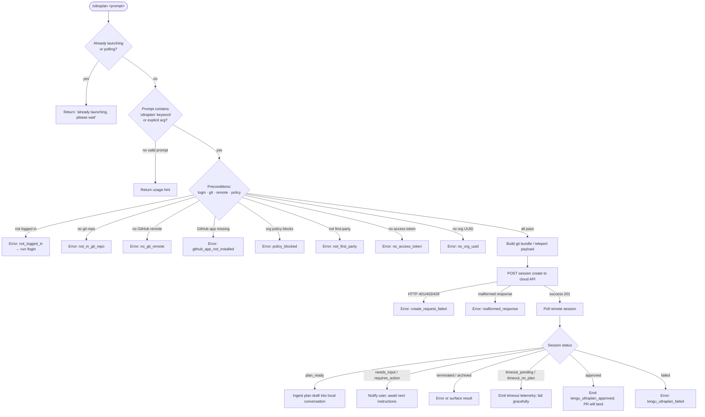

# `/ultraplan`

> Analysis basis: CC v2.1.179 bundle.js (AST extraction + Claude interpretation)
> Minimum version: v2.1.179

---

## Overview

`/ultraplan` launches a cloud-backed planning session that drafts an editable plan in Claude Code on the web. It performs a series of precondition checks (authentication, git repository, GitHub remote, org policy), teleports the local repository state to a remote cloud environment, then polls the resulting session until a plan is ready or a timeout occurs. When the remote agent produces a plan, the plan is ingested back into the local conversation as an editable draft.

---

## Registration

| Field | Value |
|---|---|
| type | `local-jsx` |
| name | `ultraplan` |
| description | `"Draft an editable plan in Claude Code on the web ( ... ) · See ..."` |
| argumentHint | `<prompt>` |
| load_inline | `true` |
| load_ident | `W85` |
| loc_byte | `12639553` |
| loc_byte_end | `12639785` |
| loc_line | `8561` |
| arbor_handler.name | `W85` |
| arbor_handler.kind | `AsyncFunction` |
| arbor_handler.resolution_path | `load_ident` |
| arbor_handler.fqn | `claude-2.1.179::W85` |
| arbor_handler.n_hits | `1` |

Analysis basis: CC v2.1.179 bundle.js:+12639553

---

## Input Branching

The command has 5+ distinct execution paths (duplicate guard → precondition checks → cloud session launch → polling outcomes). A flowchart is used.



Analysis basis: CC v2.1.179 bundle.js:+12637687, +12634875, +8579639, +12630571, +12621269

---

## Behavioral Spec

### 1. Handler Entry — `ultraplanHandler` (`W85`)

```
async function ultraplanHandler(context):
    appState = context.getAppState()                     // bundle.js:+12638022
    
    // Detect invocation source (slash command vs inline keyword)
    invocationSource = detectSource(context)             // "slash" literal at +12637833
    
    // Guard: reject if already launching or polling
    if appState has "already_launching" or "already_polling" flag:
        return earlyExit("ultraplan: already launching. Please wait for the session to start.")
                                                         // +12633687
    
    // Extract prompt text from input
    promptText = extractPromptText(context.input)        // via FU8 at +12637687
    
    if promptText does not contain "ultraplan" keyword and no explicit argument:
        return usageError(
            'Usage: /ultraplan <prompt>, or include "ultraplan" anywhere in your prompt'
        )                                                // +12635199
    
    // Run eligibility checks
    eligibility = await checkEligibility(appState)       // via _9 at +12637705
    if eligibility is not "allow_remote_sessions":
        return eligibilityError(eligibility)
    
    // Launch the remote session
    result = await launchRemoteSession(promptText, appState)   // dB6 at +12637815
    
    // Handle result
    switch result.outcome:
        case "plan_ready":
            ingestPlanDraft(result.plan)                 // via D85/RYK
            setAppState("skip")                          // +12638362
        case "failed", "unexpected_error":
            emitError(result)
        case "approved":
            notifyPRPending()                            // +12632029
    
    context.setAppState(newState)                        // +12638244
```

Analysis basis: CC v2.1.179 bundle.js:+12637687, +12637705, +12637815, +12638022, +12638244

---

### 2. Prompt Keyword Detection — `extractAndNormalizePrompt` (`FU8`)

```
function extractAndNormalizePrompt(rawInput):
    // Strip leading command token via slice
    candidate = rawInput.slice(offset)                   // H.slice at +10909723
    
    // Check if "ultraplan" string appears in the text (case-insensitive, gi flag)
    matches = candidate.matchAll(/ultraplan/gi)          // +10909143, literal at +10909495
    
    // Normalize whitespace runs using replacement pattern "$1$2"
    normalized = candidate.replace(pattern, "$1$2")      // +10909820
    
    // Truncate to max 5 significant tokens if needed
    // (numeric limit 5 found at +10909843)
    
    return normalized
```

Analysis basis: CC v2.1.179 bundle.js:+10909723, +10909143, +10909820, +10909843

---

### 3. Eligibility / Precondition Check — `checkEligibility` (`_9` → `Mn1` → `zt`)

```
async function checkEligibility(appState):
    // Tier check: must be "firstParty" provider
    if provider is not "firstParty":                     // +2588961
        return { code: "not_first_party",
                 message: "Cloud sessions are only available on the first-party Anthropic API provider." }
                                                         // +8565424
    
    // Policy gate
    if orgPolicy blocks remote sessions:
        return { code: "policy_blocked",
                 message: "Cloud sessions are disabled by your organization's policy..." }
                                                         // +8580289
    
    // Authentication check
    if not logged in (no claude.ai account token):
        return { code: "not_logged_in",
                 message: "Please run /login and sign in with your Claude.ai account (not Console)." }
                                                         // +8579786
    
    // Access token check
    if no access token available:
        return { code: "no_access_token" }               // +8565861
    
    // Org UUID check
    orgUUID = resolveOrgUUID()
    if orgUUID is null:
        return { code: "no_org_uuid",
                 message: "Unable to get organization UUID for cloud session creation" }
                                                         // +8565915
    
    // Product-feedback / telemetry settings are read here
    // "allow_product_feedback" checked at +2589535
    
    // Plan mode: check "enterprise" or "team" tier for feature gates
    tier = readTier()                                    // "enterprise" +2589234, "team" +2589269
    
    return { code: "allow_remote_sessions" }
```

Analysis basis: CC v2.1.179 bundle.js:+2588961, +8565424, +8580289, +8579786, +8565861, +8565915, +2589535

---

### 4. Git & GitHub Preflight — `gitPreflightCheck` (`w9q`)

```
async function gitPreflightCheck(workingDir):
    // Verify git repository exists
    if not in git repo:
        return { code: "not_in_git_repo" }               // +8579865
    
    // Resolve remote URL via: git config --get remote.origin.url
    remoteURL = runGit(["config", "--get", "remote.origin.url"])
                                                         // literals +1146641, +1146649
    if remoteURL is empty:
        return { code: "no_git_remote",
                 message: "Cloud agents require a GitHub remote. Add one with `git remote add origin REPO_URL`." }
                                                         // +8580021
    
    // Must contain "github.com"
    if not remoteURL.includes("github.com"):             // +7162637
        return byocPath(remoteURL)
    
    // Check GitHub App installation
    installed = await checkGithubAppInstalled(accessToken, orgUUID)
                                                         // IxH at +8570810
    if not installed:
        return { code: "github_app_not_installed" }      // +8580112
    
    // Detect default branch via:
    //   git symbolic-ref --short refs/remotes/origin/HEAD
    branch = runGit(["symbolic-ref", "--short", "refs/remotes/origin/HEAD"])
                                                         // +1158028, +1158043, +1158053
    if not found: fallback to "main" or "master"         // +1158166, +1158173
    
    return { code: "github_preflight_ok", branch }       // +8570836
```

Analysis basis: CC v2.1.179 bundle.js:+8579865, +1146641, +8580021, +7162637, +8570836, +1158028

---

### 5. Remote Session Launch — `launchRemoteSession` (`dB6` → `P85`)

```
async function launchRemoteSession(promptText, context):
    // Mark state as "already_launching"                 // +12635152
    context.setFlag("already_launching")
    
    // Build task notification payload
    notification = buildTaskNotification(promptText)     // "task-notification" +12635903
    
    // Run teleport (git bundle upload + API POST)
    teleportResult = await teleportToRemote(promptText, context)   // P85 at +12635402
    
    if teleportResult is null:
        emitTelemetry("tengu_ultraplan_create_failed")   // +12634912
        return { outcome: "teleport_null" }              // +12636313
    
    if teleportResult.error:
        return { outcome: "create_api_fail", detail: teleportResult.error }
                                                         // +12636295
    
    // Mark state transition to "already_polling"        // +12635134
    context.setFlag("already_polling")
    
    // Begin polling loop
    pollResult = await pollRemoteSession(teleportResult.sessionId, promptText)
                                                         // D85/RYK at +12630875
    
    emitTelemetry("tengu_ultraplan_launched")            // +12636619
    
    return pollResult
```

Analysis basis: CC v2.1.179 bundle.js:+12635152, +12635903, +12635402, +12634912, +12636313, +12636619

---

### 6. Teleport (Git Bundle Upload + Session Creation) — `teleportToRemote` (`gU`)

```
async function teleportToRemote(promptText, context):
    // Phase: env-select                                 // "[teleport] phase: env-select" +8568415
    environments = await listEnvironments()              // JHH at +8568464
    
    targetEnv = selectOrCreateEnvironment(environments)
    if no environments:
        // Attempt to auto-create a default cloud environment
        newEnv = await createDefaultEnvironment()        // PA6 at +8568504
        if failed:
            warn("Could not create a cloud environment. Set one up at https://claude.ai/code/onboarding?magic=env-setup")
                                                         // +8568681
            return null
    
    // Phase: branch-detect                              // "[teleport] phase: branch-detect" +8570220
    branchInfo = detectBranch(workingDir)                // w5L at +8570371
    
    // Phase: bundle-upload                              // "[teleport] phase: bundle-upload" +8571356
    bundleResult = await uploadGitBundle(context)        // f_A at +8566423
    //   - Creates git stash, uploads as "ccr-seed.bundle" / "_source_seed.bundle"
    //   - Literals: "refs/seed/stash" +8549815, "refs/seed/root" +8549833
    //   - Status codes tracked: "head", "fallback_head", "squashed", "fallback_squashed"
    //     +8551687, +8551726, +8551761, +8551804
    
    emitTelemetry("tengu_teleport_bundle_mode")          // +8566678
    emitTelemetry("tengu_teleport_source_decision")      // +8572266
    
    // Phase: POST-sent                                  // "[teleport] phase: POST-sent" +8573384
    // POST with headers:
    //   anthropic-beta: ccr-byoc-2025-07-29             // +8566334
    //   x-organization-uuid: <orgUUID>                  // +8566356
    response = await httpClient.post(sessionCreateEndpoint, payload)
                                                         // jA.post at +8567543
    
    if response.status === 201:                          // +8567633
        emitTelemetry("tengu_ccr_session_link")          // +8559998
        return { sessionId: response.data.id }
    elif response.status in [401, 403, 429]:             // +8567701, +8567705, +8567709
        return { error: "create_request_failed" }        // +8568053
    elif response.data has no session id:
        return { error: "malformed_response",
                 message: "Server returned a malformed session response (no session id)" }
                                                         // +8568204
```

Analysis basis: CC v2.1.179 bundle.js:+8568415, +8570220, +8571356, +8573384, +8566334, +8567633, +8568053

---

### 7. Session Polling Loop — `pollRemoteSession` (`D85` → `RYK`)

```
async function pollRemoteSession(sessionId, promptText):
    startTime = Date.now()                               // +12630885
    timeout = 5400 seconds                               // literal 5400 at +12630441
    pollInterval = 1000 ms                               // literal 1000 at +8586406
    maxPollDuration = 1800000 ms (30 minutes)            // literal 1800000 at +8586413
    
    emitTelemetry("tengu_ultraplan_timeout_seconds")     // +12630407
    
    loop:
        if elapsed > timeout:
            if no plan ever received:
                return { outcome: "timeout_no_plan" }    // +12622828
            else:
                return { outcome: "timeout_pending" }    // +12622810
        
        sessionStatus = await fetchSessionStatus(sessionId)
        
        switch sessionStatus:
            case "plan_ready":
                emitTelemetry("tengu_ultraplan_plan_ready")  // +12631119
                plan = extractPlanFromSession(sessionStatus)
                return { outcome: "plan_ready", plan }
            
            case "needs_input":
                emitTelemetry("tengu_ultraplan_awaiting_input")  // +12631051
                // Surface "Here is a draft plan to refine:" prefix
                return { outcome: "needs_input",              // +12630748
                         message: planDraft }
            
            case "approved":
                emitTelemetry("tengu_ultraplan_approved")    // +12631539
                return { outcome: "approved",
                         message: "Results will land as a pull request..." }
                                                             // +12632029
            
            case "terminated", "archived":
                emitTelemetry("tengu_ultraplan_failed")      // +12632428
                return { outcome: "failed" }
            
            case "running", "pending", "starting":
                wait(pollInterval)
                continue
        
        // Network failures: retry up to exhaustion
        // On repeated failure emit: "Lost connection to the cloud session..."
        //   +12621767
```

Analysis basis: CC v2.1.179 bundle.js:+12630441, +12630407, +12631119, +12631051, +12631539, +12632428, +8586413

---

### 8. Plan Draft Injection — `buildPlanDraft` (`Y85` → `w85`)

```
function buildPlanDraft(planContent):
    // Prefix the plan with the refinement header
    parts = ["Here is a draft plan to refine:"]          // +12630748
    parts.push(planContent)                              // q.push at +12630741
    
    // Join sections
    planText = parts.join(separator)                     // q.join at +12630831
    
    // Tag the result for the "Refine local plan" action  // +12636059
    // with action type "plan"                            // +12636094
    return { type: "plan", body: planText }
```

Analysis basis: CC v2.1.179 bundle.js:+12630748, +12630741, +12630831, +12636059, +12636094

---

### 9. Error Result Surfacing — `P85` (session orchestrator)

```
function emitSessionErrorToConversation(outcome, detail):
    switch outcome:
        case "teleport_null":
            // gU returned null — fallback
            message = detail + ". See --debug for details."   // +12636395
        
        case "create_api_fail":
            message = detail
        
        case "cloud session returned an error":
            message = "cloud session returned an error"        // +8589014
        
        case "cloud session exceeded 30 minutes":
            message = "cloud session exceeded 30 minutes"      // +8589054
        
        case "failed" (no review output):
            message = "no review output — orchestrator may have exited early"
                                                               // +8589090
        
        case "unexpected_error":
            emitTelemetry("tengu_ultraplan_create_failed")
            message = "Ultraplan hit an unexpected error during launch. Wait for the user's next instructions."
                                                               // +12637211
        
        case "Cloud ultraplan session failed":
            message = "Cloud ultraplan session failed. Wait for the user's next instructions."
                                                               // +12632852
    
    injectAssistantMessage(message)
```

Analysis basis: CC v2.1.179 bundle.js:+12636395, +8589014, +8589054, +8589090, +12637211, +12632852

---

## State & Side Effects

| Item | Detail |
|---|---|
| Telemetry — create failed | `tengu_ultraplan_create_failed` (+12634912) |
| Telemetry — prompt identifier | `tengu_ultraplan_prompt_identifier` (+12630574) |
| Telemetry — launched | `tengu_ultraplan_launched` (+12636619) |
| Telemetry — timeout seconds | `tengu_ultraplan_timeout_seconds` (+12630407) |
| Telemetry — awaiting input | `tengu_ultraplan_awaiting_input` (+12631051) |
| Telemetry — plan ready | `tengu_ultraplan_plan_ready` (+12631119) |
| Telemetry — approved | `tengu_ultraplan_approved` (+12631539) |
| Telemetry — failed | `tengu_ultraplan_failed` (+12632428) |
| Telemetry — bundle seed enabled | `tengu_ccr_bundle_seed_enabled` (+7162441) |
| Telemetry — bundle upload | `tengu_ccr_bundle_upload` (+8550007) |
| Telemetry — teleport bundle mode | `tengu_teleport_bundle_mode` (+8566678) |
| Telemetry — session link | `tengu_ccr_session_link` (+8559998) |
| Telemetry — source decision | `tengu_teleport_source_decision` (+8572266) |
| Telemetry — bg dispatch sigkill | `tengu_bg_dispatch_sigkill_escalate` (+17067302) |
| Telemetry — bg low mem | `tengu_bg_low_mem_mb` (+13454570), `tengu_bg_dispatch_low_mem` (+17067903) |
| Telemetry — spare/claim | `tengu_bg_spare_enable` (+17068607), `tengu_bg_spare_claim` (+17068735), `tengu_bg_spare_claim_fail` (+17069001), `tengu_bg_sendclaim_failed` (+17043852) |
| appState changes | Sets `"already_launching"` flag at launch start (+12635152); transitions to `"already_polling"` (+12635134); sets `"skip"` on plan ingestion (+12638362); calls `_.setAppState` at handler exit (+12638244) |
| HTTP calls | `jA.post` (session create, +8567543); `jA.get` (session status, +7158129, +7160315); `jA.post` (org/env create, +7158886); response headers include `anthropic-beta: ccr-byoc-2025-07-29` (+8566334) |
| File system | Git bundle written as `ccr-seed.bundle` / `_source_seed.bundle` (+8551010, +8551317); stash refs at `refs/seed/stash` and `refs/seed/root` (+8549815, +8549833); temp bundle file unlinked after upload (`Wq6.unlink` +8551962) |
| File watch | `brf` registers `oO8.watchFile` / `oO8.unwatchFile` on config files (+3395952, +3396285) |
| Hook registration | `U9` calls `oSA.register` (+66377) for task-notification hooks |
| Session poll timeout | 5400 s total session timeout (+12630441); 1800000 ms (30 min) max poll window (+8586413); 1000 ms poll interval (+8586406); 60000 ms (1 min) unit used for human-readable elapsed reporting (+12622587) |
| Orphaned session cleanup | Warns `"ultraplan: failed to archive orphaned session"` if cleanup of prior session fails (+12637372) |
| Background daemon interaction | Uses spare-process pool (`_kA` / `MkA`) with `Tc.spawn`, `Tc.claim`, socket connect/kill lifecycle |

---

## Version History

| Version | Change |
|---|---|
| v2.1.179 | Initial analysis — `local-jsx` command registered via `load_ident` `W85`; full teleport + polling pipeline present; beta header `ccr-byoc-2025-07-29` |

---

## Common Mistakes

1. **Invoking without a Claude.ai login**: `/ultraplan` requires a claude.ai account token, not just an API key. Error code `not_logged_in` is returned. Run `/login` first.
2. **No GitHub remote configured**: The command requires `git remote add origin <REPO_URL>` pointing to a `github.com` host. A bare BYOC environment without a GitHub remote returns `no_git_remote`.
3. **Repository has no commits**: Calling `/ultraplan` on an empty repository (no `git commit` yet) triggers the `empty_repo` path. Create at least one commit first.
4. **Organization policy blocking cloud sessions**: Enterprise administrators can disable cloud sessions; if blocked, `policy_blocked` is returned and only the org admin can unblock it.
5. **Running the command twice quickly**: A second invocation while the first is still launching will be rejected with the `"already launching"` guard message. Wait for the session URL to appear before retrying.
6. **Expecting results in the local terminal immediately**: The cloud agent runs asynchronously. When the outcome is `"approved"`, results arrive as a pull request, not as inline text. The message `"There is nothing to do here"` is the expected local response.

---

## Appendix — Identifier Mapping

> For bundle debugging only. Identifiers change across versions.

| Identifier | Role |
|---|---|
| `W85` | Main async handler for `/ultraplan` (entry point via `load_ident`) |
| `FU8` | Prompt extraction and normalization (keyword detection + slice/replace) |
| `BU8` | Inner prompt-parsing helper called by `FU8` |
| `h3A` | Token matching / regex scan for "ultraplan" keyword |
| `_9` | Eligibility / precondition check orchestrator |
| `Mn1` | Auth-tier resolution (firstParty / enterprise / team) |
| `zt` | Auth state reader (reads token and tier from app state) |
| `pb` | Provider config reader (firstParty, allow_remote_sessions) |
| `O26` | Config file reader (readFileSync + parse) |
| `H5H` | Feature-flag / telemetry consent checker |
| `fq` | Telemetry category resolver (essential-traffic / no-telemetry / default) |
| `YrA` | Telemetry traffic-class helper |
| `lLH` | Locale / string formatter helper |
| `FHH` | App-state flag accessor |
| `dB6` | Remote session launch coordinator (sets "already_launching", calls `P85`) |
| `BYK` | State-flag setter / guard helper |
| `Ud8` | Task-notification builder |
| `pd8` | Notification dispatch helper |
| `Y6` | Notification registry accessor |
| `O85` | Notification payload formatter |
| `P85` | Session orchestrator (calls teleport, poll, error surfacing) |
| `IKH` | Eligibility result interpreter for `P85` |
| `w9q` | Git + GitHub preflight check runner |
| `S1` | Structured result emitter |
| `Y85` | Plan draft builder (prefix + join) |
| `w85` | Plan section assembler |
| `gU` | `teleportToRemote` — full teleport pipeline (env-select → bundle-upload → POST) |
| `x6` | Context / working-directory accessor |
| `$4` | Access-token retrieval helper |
| `X$` | Token refresh helper |
| `nI8` | Org UUID resolver |
| `SH` | HTTP error logger |
| `Cb` | Auth-token container / credential store accessor |
| `R1` | API base-URL resolver (local / staging / prod) |
| `VD` | HTTP client configuration builder |
| `f_A` | Git bundle creation and upload logic |
| `I6` | Environment selector helper |
| `N` | String normalizer / header builder |
| `QH` | Queue / task handle constructor |
| `Zb` | Remote-URL parser and git-config reader |
| `RTq` | Session creation request builder (randomUUID, event payload) |
| `ik6` | Session payload field builder |
| `bH` | JSON serializer wrapper |
| `AH` | HTTP response data extractor |
| `STq` | Session-link telemetry emitter |
| `VZ8` | Session status value extractor |
| `JHH` | Cloud environment list fetcher |
| `PA6` | Default cloud environment creator |
| `GH` | String coercer (wraps `String()`) |
| `O` | Background session status mapper |
| `w5L` | Branch detection and title generation (calls cloud API for `teleport_generate_title`) |
| `aS` | GitHub App installation checker (registry) |
| `IxH` | `checkGithubAppInstalled` — queries Anthropic API to verify GitHub App |
| `pk` | Default-branch resolver (`git symbolic-ref`, fallback to main/master) |
| `Q1` | Poll result value extractor |
| `l_H` | Remote-URL scheme parser (https / http / git) |
| `i` | Output stream / stdio writer |
| `qH` | Message queue / event bus helper |
| `WA` | Error wrapper / normalizer |
| `Oz` | Cancellation-error detector |
| `pz` | User-facing error presenter |
| `FD` | Claude.ai base-URL builder (localhost / staging / prod) |
| `g_` | Module initializer / export setter |
| `gg_` | Secondary module initializer |
| `J85` | Session metadata builder |
| `t$H` | Remote-agent session lifecycle manager |
| `LI` | Random-bytes token generator |
| `Tq6` | Temporary file / socket opener for remote agent |
| `A0` | Timestamp / session-start recorder |
| `T5L` | Duration formatter (minutes label) |
| `uTq` | Session message ingest / poll loop |
| `Ev` | Task-event emitter (task_started / task_updated events) |
| `hvL` | Task-started event dispatcher |
| `vvL` | Task-updated event dispatcher |
| `cT8` | App state mutation via `JxH.setState` |
| `r7A` | Task-result recorder |
| `kvL` | Task-completion event handler |
| `yvL` | Task-progress event handler |
| `$4H` | User-typed / active task state manager |
| `D85` | Poll-loop outer controller (timeout, status dispatch) |
| `RYK` | Poll-loop inner iteration (status fetch, ingest, error handling) |
| `M85` | Session notification updater |
| `X85` | Session status transition guard |
| `bR6` | Session cleanup / unlink handler |
| `K` | Column/pad formatter |
| `QU` | Session-status HTTP fetcher (POST/GET to status endpoint) |
| `U9` | Hook registration (`oSA.register`) |
| `j85` | Orphaned-session archive helper |
| `h6` | Config file watcher / accessor |
| `c6` | Config path resolver |
| `iy_` | Config initialization guard |
| `r5H` | Config file reader and backup manager |
| `l6` | JSON parser wrapper |
| `Vm` | Path prefix stripper |
| `G8` | Generic error classifier |
| `fM9` | Config directory scanner |
| `ay_` | Config backup path builder |
| `$` | Utility collection (find, startsWith, etc.) |
| `D` | Background session process manager (spawn / kill / status) |
| `b` | Background-session subprocess record |
| `n8` | Async timeout / abort helper |
| `CH` | Feature-ok telemetry emitter |
| `IH` | Feature-bad telemetry emitter |
| `il8` | Low-memory detector (macOS freemem) |
| `oRH` | File lstat / rm / readFile helper |
| `g` | Retire-if-settled process-pool helper |
| `_kA` | Spare-process claim and socket-connect handler |
| `MkA` | Background-session lifecycle manager (add/delete/rm/unlink) |
| `Y` | Forced-shutdown / process.exit handler |
| `B` | Disposable resource handle |
| `brf` | Config file-watch registration helper |
| `kg` | Config watch debounce helper |
| `eL6` | Pre-launch parallel preflight runner (Zb + aS + kf + IxH) |